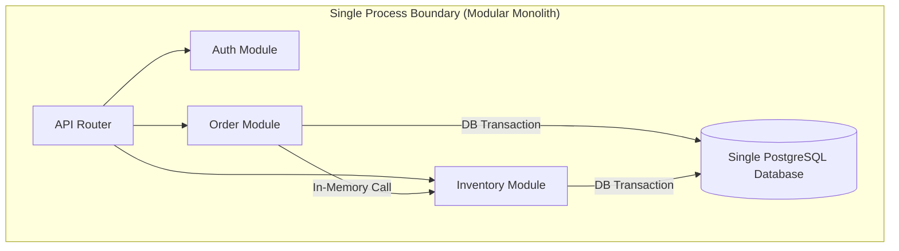
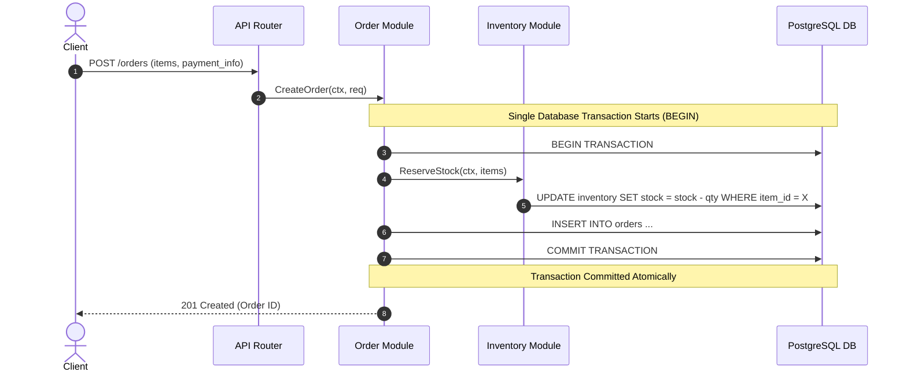

# Day 01 — You Don't Need Microservices Yet

> 🔗 **LinkedIn Discussion**: [Read & Discuss on LinkedIn](https://www.linkedin.com/feed/update/urn:li:activity:7498843866280865792/)  
> 🏛️ **System Architecture Milestone**: [`v1-monolith`](../../../system-evolution/v1-monolith)

---

## The Problem

Imagine starting a new product—an e-commerce platform called **ShopScale**. You need to launch quickly to validate the business. The core features include user authentication, product catalog browsing, cart management, checkout processing, inventory management, and transactional email notifications.

Under social media hype and architectural trends, the team faces immediate pressure to adopt microservices from day one:

- Split the application into an `Auth Service`, `Product Service`, `Order Service`, `Inventory Service`, and `Notification Service`.
- Deploy each service into its own container using Kubernetes.
- Use a dedicated database per service (e.g., PostgreSQL for orders, MongoDB for products, Redis for carts).
- Set up an API Gateway, distributed tracing, service discovery, and a service mesh.

On day one, traffic is zero. Yet before writing a single line of business logic, the team spends weeks setting up local Kubernetes environments, configuring CI/CD pipelines for five different repositories, managing gRPC/HTTP schemas across network boundaries, and debugging why Service A cannot reach Service B inside Docker networks.

When the product launches, the first real customer attempts to buy a product:

1. The API Gateway forwards the request to the `Order Service`.
2. The `Order Service` makes an HTTP call to the `Inventory Service` to reserve stock.
3. The `Inventory Service` succeeds, but the `Order Service` times out trying to reach the `Notification Service`.
4. The user sees a `504 Gateway Timeout`. The order fails, but inventory remains locked because there was no distributed transaction coordinator or Saga orchestration set up.

Instead of shipping product features, the team spends 80% of their engineering capacity maintaining infrastructure for a system handling 50 requests per day.

---

## Why the Simple Approach Breaks

Engineers often jump to microservices to avoid the classic **"Big Ball of Mud"** monolith—a codebase where all code is tightly coupled, global state is mutated everywhere, and a change in the user profile code breaks the checkout pipeline.

However, adopting microservices prematurely to solve codebase organization introduces severe distributed system challenges before you have the operational capacity or traffic to justify them:

```text
[ Microservices Premature Approach ]
Client ──> API Gateway ──HTTP──> Order Service ──HTTP──> Inventory Service
                                      │
                                    HTTP (Fails/Times Out)
                                      ▼
                             Notification Service
                     (Result: Partial failure, inconsistent state)
```

1. **Network Latency & Reliability**: In-memory function calls take sub-nanoseconds and never fail due to network drops. HTTP/gRPC calls over network sockets take 5–50ms and can fail due to DNS issues, packet loss, socket exhaustion, or transient downstream outages.
2. **Distributed Data & Transactions**: A single SQL transaction (`BEGIN ... COMMIT`) guarantees ACID safety across tables. With separate databases per microservice, achieving consistency across `Orders` and `Inventory` requires complex patterns like Two-Phase Commit (2PC) or asynchronous Saga orchestrators.
3. **Operational Overhead**: Managing 5 microservices means 5 CI/CD pipelines, 5 runtime environments, centralized logging (Elasticsearch/Loki), distributed tracing (Jaeger/Tempo), and service discovery.

---

## Understanding the Problem

To decide when to split a system, you must understand the distinction between **Code Architecture** and **Deployment Topology**.



### Process Boundaries vs. Module Boundaries

- **Module Boundary**: Logical separation of code domains within the same codebase (e.g., packages, namespaces, or folders like `/internal/orders` and `/internal/inventory`). Interfaces define how modules interact.
- **Process Boundary**: Physical separation of execution environments across operating system processes or network calls. Microservices force module boundaries to become process boundaries.

### The True Costs of Distributed Boundaries

When you cross a process boundary over a network:

- **Data Marshaling**: Structs/Objects must be serialized to JSON/Protobuf, transmitted over TCP sockets, and deserialized at the receiving end.
- **Partial Failure**: A function call in a monolith either runs or panics within the process. A network call can succeed on the remote end but time out on the client side, leaving the client uncertain if the action occurred.
- **Schema Management**: Interface changes require backward-compatible API versioning, deprecation windows, and multi-repo coordination.

---

## Possible Approaches

Before deciding how to build a initial system, evaluate the realistic options:

| Approach | How It Works | Where It Helps | Limitations | When It Makes Sense |
|---|---|---|---|---|
| **Single-Process Modular Monolith** | Single binary/application process containing strict, independent internal modules sharing one database. | Maximum velocity, zero network overhead, simple debugging, single deployment target. | Limited to vertical scaling of the single instance; entire process must restart during deploy. | **Default choice** for Day 1 through early growth (0 to 100k users). |
| **Microservices Architecture** | Independent services, each running in its own process/container with its own database, communicating via RPC/HTTP/Queues. | Independent deployment cycles, domain team isolation, targeted horizontal scaling per service. | High operational cost, network latency overhead, complex data consistency (eventual consistency). | Large engineering teams (>30–50 engineers) with distinct domain boundaries and high scale requirements. |
| **Distributed Monolith** *(Anti-Pattern)* | Multiple services deployed separately, but tightly coupled via synchronous network calls and a shared database. | Offers no benefits. | Combines the deployment pain of microservices with the coupling of a monolith. | **Never**. Result of premature splitting without domain isolation. |

---

## Trade-offs

Choosing a Modular Monolith on Day 1 is an explicit decision to trade off certain future capabilities for immediate engineering velocity and operational simplicity:

```text
       Velocity & Simplicity                       Operational Complexity
┌──────────────────────────────────┐        ┌──────────────────────────────────┐
│  • Single Git Repository         │        │  • Multiple Deployment Pipelines │
│  • Single Database (ACID)        │   VS   │  • Network Fallacies & Retries   │
│  • In-Memory Method Invocation   │        │  • Distributed Tracing & Logs    │
│  • Simple Local Environment      │        │  • Eventual Consistency / Sagas  │
└──────────────────────────────────┘        └──────────────────────────────────┘
```

### What You Gain
- **Extreme Velocity**: Add features across modules by refactoring code locally without breaking external network contracts.
- **Strong Consistency**: Use database ACID transactions to guarantee that an order is created **if and only if** stock is available.
- **Minimal Infrastructure Cost**: Run the entire system on a low-cost virtual private server (VPS) or single container instance.

### What You Give Up
- **Independent Deployability**: Deploying a fix in the notification module requires re-deploying the single monolith binary.
- **Blast Radius Isolation**: A memory leak or uncaught runtime panic in one module can crash the application process.
- **Custom Tech Stack per Module**: Every module must use the language runtime chosen for the monolith.

---

## A Practical Example

Let's examine how checkout processing works in a **Modular Monolith** vs. **Premature Microservices**.

### 1. Architectural Topology (Day 1 Monolith)

In our Day 1 architecture, all domain logic runs within one runtime process connected to a single relational database (e.g., PostgreSQL).



### 2. In-Memory Transactional Implementation (Go Pseudocode)

Notice how simple data integrity is when executing inside a single module boundary with a shared transaction handle:

```go
// Package checkout handles the order placement workflow.
// Both Order and Inventory logic run within the same database transaction.
package checkout

import (
	"context"
	"database/sql"
	"fmt"
)

type OrderService struct {
	db *sql.DB
}

func (s *OrderService) CreateOrder(ctx context.Context, userID string, itemID string, qty int) (*Order, error) {
	// 1. Begin a local ACID transaction
	tx, err := s.db.BeginTx(ctx, nil)
	if err != nil {
		return nil, fmt.Errorf("failed to begin tx: %w", err)
	}
	// Guarantee rollback if any step fails
	defer tx.Rollback()

	// 2. Reserve stock via SQL directly in the transaction
	res, err := tx.ExecContext(ctx, 
		"UPDATE inventory SET stock = stock - $1 WHERE item_id = $2 AND stock >= $1", 
		qty, itemID,
	)
	if err != nil {
		return nil, fmt.Errorf("inventory query error: %w", err)
	}
	rows, _ := res.RowsAffected()
	if rows == 0 {
		return nil, fmt.Errorf("insufficient stock for item %s", itemID)
	}

	// 3. Insert the order record
	var orderID string
	err = tx.QueryRowContext(ctx,
		"INSERT INTO orders (user_id, item_id, quantity, status) VALUES ($1, $2, $3, 'CREATED') RETURNING id",
		userID, itemID, qty,
	).Scan(&orderID)
	if err != nil {
		return nil, fmt.Errorf("failed to insert order: %w", err)
	}

	// 4. Commit atomically. Stock reduction and order creation succeed together or fail together.
	if err := tx.Commit(); err != nil {
		return nil, fmt.Errorf("failed to commit tx: %w", err)
	}

	return &Order{ID: orderID, UserID: userID, ItemID: itemID, Quantity: qty}, nil
}
```

If this were split into microservices on Day 1, step 2 and step 3 would happen over separate network calls across two databases. If step 3 failed after step 2 succeeded, stock would be deducted without an order existing—forcing you to write complex compensating logic (Sagas) before your product even has users.

---

## Failure Scenarios

Even a single-server monolith has failure modes you must understand:

### 1. Single Point of Failure (SPOF)
If the host server experiences a hardware fault, disk error, or cloud provider disruption, the entire application goes offline.

- **Mitigation at Day 1**: Keep server setup reproducible using infrastructure-as-code (Docker / Systemd scripts) and use automated daily database backups (e.g., `pg_dump` to object storage).

### 2. Resource Starvation within a Shared Process
If a single endpoint contains a CPU-intensive operation (e.g., generating a PDF invoice or resizing an uploaded image), it can exhaust the thread pool or CPU cores, slowing down fast read endpoints (`GET /products`).

```text
[ Unbounded Workload Impact ]
GET /products (Light) ──┐
                        ├──> [ Single App Process ] ──> CPU at 100% (Saturated)
POST /export-pdf (Heavy) ─┘   (All requests slow down or drop)
```

- **Mitigation**: Offload heavy background tasks to async worker threads or local task queues early, keeping HTTP handlers fast and non-blocking.

### 3. Tight Internal Coupling ("Spaghetti Code")
Developers might bypass module interfaces and query another module's database tables directly (e.g., the `Order` module querying the `users` table directly without going through the User domain interface).

- **Mitigation**: Enforce language-level package boundaries (e.g., Go internal packages, Java module visibility, or TypeScript path aliases) so modules cannot import internal logic from other domains.

---

## Key Engineering Decisions

When designing your system on Day 1, follow these rules:

1. **Enforce Clean Domain Boundaries Inside the Codebase**: Write your monolith as a **Modular Monolith**. Treat modules as if they *could* become microservices in the future, but keep them in the same binary today.
2. **Never Share Database Tables Across Modules**: Each module should logically own its tables. Module A must call Module B's public interface function to read or write Module B's data—never run raw SQL across domain boundaries.
3. **Defer Distributed Infrastructure**: Do not introduce message brokers, Kubernetes clusters, or multi-repo setups until traffic volume or team growth explicitly demands it.

---

## Key Takeaways

1. **Scale is a response to a concrete problem, not a default starting point.** Premature distribution adds complexity without adding value.
2. **Network boundaries are expensive.** In-memory function calls are fast, reliable, and support atomic transactions. Network calls fail, lag, and require retry logic.
3. **Build a Modular Monolith first.** If you cannot write clean, decoupled code inside a single repository, splitting it into microservices will only produce a distributed mess.

---

### ⏭️ Next Step
* Read the next guide: **[Day 02 — What Does Scale Actually Mean?](../day-02-what-scale-means/README.md)**
* View the updated architecture milestone: [`v1-monolith`](../../../system-evolution/v1-monolith)
