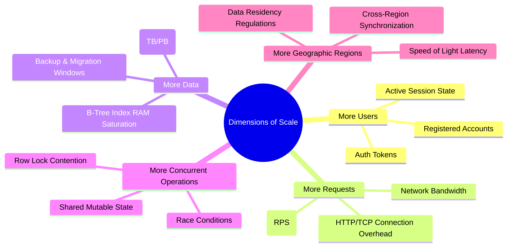

# Day 02 — What Does "Scale" Actually Mean?

> 🔗 **LinkedIn Discussion**: [Read & Discuss on LinkedIn](https://www.linkedin.com/feed/update/urn:li:activity:7498843866280865792/)  
> 🏛️ **System Architecture Milestone**: [`v1-monolith`](../../../system-evolution/v1-monolith/README.md)

---

## The Problem

On Day 01, we deployed **ShopScale** as a single-process Modular Monolith (`v1-monolith`) backed by a PostgreSQL database on a single virtual server. It handled early traffic effortlessly. 

A few weeks later, marketing launches a campaign, and the system begins to struggle. During a team post-mortem, engineers start throwing around solution proposals:

- *"We need to rewrite the API router in Rust to handle more load."*
- *"We should split into microservices so the catalog doesn't slow down checkout."*
- *"We need to add a Redis cluster to handle our growing user base."*
- *"We need to migrate to Cassandra because our data is growing."*

Each engineer is using the word **"scale"**, but each is describing a completely different problem:

1. The frontend team means **user growth** (100,000 registered accounts).
2. The infrastructure team means **request volume** (handling 5,000 HTTP requests per second).
3. The database team means **data footprint** (the `orders` table hitting 500 GB).
4. The operations team means **geographic distribution** (customers in London experiencing 250ms latency).
5. The product team means **concurrent operations** (10,000 users attempting to buy 50 limited-edition items at the exact same second).

Because the team treats "scale" as a single abstract buzzword, they end up implementing fixes for the wrong dimension—such as adding a Redis caching layer to solve a disk-capacity problem, or rewriting backend code in C++ to solve a database row-locking bottleneck.

Scale is not a single number. Systems do not scale in abstract; they face bottlenecks along specific, orthogonal dimensions.

---

## Why the Simple Approach Breaks

When a system slows down or crashes, the default reaction is often to upgrade the server (Vertical Scaling) or add a cache in front of everything. 

While this works for mild load increases, it breaks down quickly because different scaling bottlenecks require fundamentally different architectural responses:

```text
                             ┌──────────────────────────────┐
                             │    "We Need To Scale!"       │
                             └──────────────┬───────────────┘
                                            │
           ┌─────────────────┬──────────────┼──────────────┬──────────────────┐
           ▼                 ▼              ▼              ▼                  ▼
    [ More Users ]   [ High RPS ]    [ Large Data ]  [ High Concurrency ] [ Multi-Region ]
    Session Storage  Network I/O &   Index RAM &     DB Row Locking &     Speed of Light &
    & Auth State     CPU Saturation  Disk Scans      Race Conditions      Cross-Region Lag
```

### 1. Upgrading Compute (Vertical Scaling) Doesn't Fix Data Footprint
If your PostgreSQL `orders` table grows from 100,000 rows to 100 million rows, queries that perform unindexed scans or rely on B-trees larger than available RAM will slow down dramatically. Doubling your application server's CPU cores from 4 to 8 does not alter database index size or disk I/O latency.

### 2. High Registered User Count Does Not Equal High Request Volume
A platform with 1,000,000 registered users who log in once a week generates less real-time load than a stock-trading app with 2,000 active day-traders firing 50 polling requests per second. Designing for *total users* instead of *throughput* leads to over-engineering storage while under-provisioning network socket capacity.

### 3. Caching Does Not Solve Write Concurrency
Caching read requests (`GET /products/123`) using Redis is straightforward. However, when 5,000 users simultaneously execute a write request (`POST /orders`) targeting the exact same row in a database to reserve stock, read-caches provide zero relief. The bottleneck shifts entirely to transaction serialization and row lock contention.

### 4. The Average Latency Trap
Monitoring dashboards that show an *"Average Response Time of 45ms"* conceal severe failures. If 95% of requests take 10ms and 5% take 5,000ms (due to thread pool exhaustion or database lock waits), your average reads a healthy 259.5ms. Yet 1 out of every 20 paying customers experiences a severe 5-second timeout.

---

## Understanding the Problem

To reason about scaling effectively, you must decompose "scale" into its **5 primary dimensions** and understand the **4 core operational metrics** that measure them.

---

### Part 1: The 5 Dimensions of Scale



#### 1. More Users (User Scale)
- **What it affects**: Session storage, authentication token validation, cache eviction rates, and database user tables.
- **The Core Challenge**: Keeping memory consumption manageable as user state accumulates. 100,000 active sessions stored in-memory inside your monolith process can exhaust RAM even if those users are currently idle.

#### 2. More Requests (Throughput Scale)
- **What it affects**: CPU usage, network interface card (NIC) bandwidth, open socket descriptors, HTTP parsing overhead, and web server worker threads.
- **The Core Challenge**: Handling high Requests Per Second (RPS) without running out of operating system file descriptors or worker threads.

#### 3. More Data (Data Scale)
- **What it affects**: Database disk capacity, B-tree index sizes, query execution plans, snapshot/backup durations, and schema migrations.
- **The Core Challenge**: When an index no longer fits into working RAM (PostgreSQL `shared_buffers`), database reads transition from sub-millisecond memory lookups to millisecond disk I/O calls—causing performance to drop abruptly.

#### 4. More Concurrent Operations (Concurrency Scale)
- **What it affects**: Database lock queues, thread synchronization primitives, transaction isolation levels, and atomic state updates.
- **The Core Challenge**: Handling multiple operations attempting to mutate the *exact same data point* simultaneously. Scaling throughput (adding more app servers) actually *worsens* concurrency bottlenecks by increasing lock contention on the database.

#### 5. More Geographic Regions (Spatial Scale)
- **What it affects**: Network round-trip time (RTT), edge routing, multi-region replication lag, and compliance with data sovereignty laws (e.g., GDPR).
- **The Core Challenge**: Physics. Fiber optic signals travel through glass at ~200,000 km/s. A packet traveling from London to Sydney takes ~150ms just for network transit, regardless of how fast your application processes code.

---

### Part 2: The 4 Core Metrics of System Behavior

When evaluating any dimension of scale, engineers use four key metrics:

```text
┌─────────────────────────────────────────────────────────────────────────────┐
│                         CORE SYSTEM METRICS                                 │
├──────────────────┬──────────────────────────────────────────────────────────┤
│ METRIC           │ DEFINITION                                               │
├──────────────────┼──────────────────────────────────────────────────────────┤
│ 1. Throughput    │ Amount of work completed per unit time (RPS, QPS, MB/s). │
│ 2. Latency       │ Time required to process a single request (P50, P99).    │
│ 3. Availability  │ Percentage of time the system successfully serves work. │
│ 4. Capacity      │ Maximum load a component can handle before degrading.    │
└──────────────────┴──────────────────────────────────────────────────────────┘
```

#### 1. Throughput
Throughput measures work performed per second—such as Requests Per Second (RPS), Queries Per Second (QPS), or Megabytes Per Second (MB/s). 

It is constrained by the slowest bottleneck in your execution pipeline. If your application code processes a request in 2ms (500 RPS per thread), but your database connection pool caps active queries at 50 connections, your max database throughput is strictly bound to 25,000 QPS.

#### 2. Latency (and Tail Latency)
Latency is the time taken to process a single unit of work. To analyze latency accurately, avoid mean/average values and measure **Percentiles**:

- **P50 (Median)**: 50% of requests are faster than this value. Represents the typical user experience.
- **P90**: 90% of requests are faster than this value. Highlights emerging performance strain.
- **P99**: 99% of requests are faster than this value. Captures **Tail Latency**—the worst-case experience hit by 1 out of 100 requests.
- **P99.9**: Captures severe outliers caused by Garbage Collection (GC) pauses, network retries, or database lock wait queues.

```text
[ Latency Distribution Curve ]

Requests 
   ▲
   │      ┌──────┐
   │     ┌┘      └┐
   │    ┌┘        └┐
   │   ┌┘          └┐
   │  ┌┘            └┐                  P99
   │ ┌┘              └───────────┐     ┌───┐
   │┌┘                           └─────┤   │
   └───────────────────────────────────┴───┴──────► Latency (ms)
       ◄─── P50: 12ms ───►             ◄─ 450ms ─►
```

#### 3. Availability
Availability is the proportion of time a system remains operational and correctly responds to requests. It is typically expressed in "nines":

| Availability % | Uptime SLA | Max Allowed Downtime Per Year | Max Allowed Downtime Per Month |
|---|---|---|---|
| **99% ("Two Nines")** | Basic web application | 3.65 days | 7.31 hours |
| **99.9% ("Three Nines")** | Standard SaaS product | 8.76 hours | 43.8 minutes |
| **99.99% ("Four Nines")** | Critical Infrastructure / Payments | 52.6 minutes | 4.38 minutes |
| **99.999% ("Five Nines")** | High-availability Telecom / Core Banking | 5.26 minutes | 26.3 seconds |

Availability is tied directly to partial failure resilience. A single-server monolith (`v1-monolith`) running without automated failover can rarely achieve more than **99% to 99.5%** availability due to routine host maintenance, hardware faults, and application restarts.

#### 4. Capacity
Capacity defines the upper operational boundary of a component before performance degrades or failures occur. Examples include:

- **CPU Capacity**: Percentage of compute cycles consumed before request queues build up.
- **Memory Capacity**: Available RAM before operating system Out-Of-Memory (OOM) killers terminate the process.
- **Database Connection Capacity**: Maximum concurrent TCP connections PostgreSQL can maintain before memory overhead degrades query execution.
- **I/O Capacity (IOPS)**: Read/Write operations per second available on disk storage volumes.

---

## Possible Approaches

When facing growth along any specific dimension, select an approach tailored to that exact challenge rather than applying generic infrastructure patterns:

| Scaling Dimension | Diagnostic Signal | Primary Engineering Strategy | Where It Helps | Limitations | When It Makes Sense |
|---|---|---|---|---|---|
| **High Requests (RPS)** | High CPU usage, network socket exhaustion, HTTP 503 errors under peak traffic. | **Horizontal Stateless Scaling** (Load balancer + multiple monolith instances). | Multiplies compute capacity for stateless HTTP handling; distributes request parsing overhead. | Does not resolve database write bottlenecks or shared state locks. | When application CPU/RAM is saturated by stateless request processing. |
| **High Data Volume** | Database disk space full, slow queries due to index size exceeding RAM, slow backups. | **Data Lifecycle Management & Index Optimization** (Archiving, Partitioning, Read Replicas). | Reduces active table size; keeps working index sets in memory; isolates read traffic. | Adds schema complexity; cross-partition queries become expensive. | When query degradation is caused by table size ($>10^7$ rows) rather than request volume. |
| **High Concurrency** | High P99 latency during write events, database lock timeouts, connection pool exhaustion. | **Asynchronous Decoupling & Queue-Based Batching** (Message queues, optimistic locking). | Converts synchronous lock waits into orderly background queues; flattens traffic spikes. | Introduces eventual consistency; users no longer get instantaneous synchronous confirmation. | When thousands of requests attempt to mutate shared records simultaneously (e.g., flash sales). |
| **Geographic Scale** | High latency for distant users ($>200\text{ms}$), compliance requirements (GDPR). | **Edge Content Delivery & Multi-Region Replication** (CDNs for static assets, read replicas). | Brings static content and read operations physically closer to users. | Multi-region write synchronization is complex and prone to cross-region replication lag. | When user base expands internationally and physical network latency degrades UX. |

---

## Trade-offs

Scaling decisions always involve trade-offs. Optimizing a system for one dimension often degrades performance or increases complexity in another:

```text
┌─────────────────────────────────────────────────────────────────────────────┐
│                          ENGINEERING TRADE-OFFS                             │
├───────────────────────────────┬─────────────────────────────────────────────┤
│ GAIN                          │ GIVE UP                                     │
├───────────────────────────────┼─────────────────────────────────────────────┤
│ Horizontal Scale (More Nodes) │ Immediate In-Memory Consistency & Simplicity│
│ Asynchronous Queue Processing │ Instantaneous Response Confirmation         │
│ Database Sharding / Partition │ Cross-Table ACID Joins & Easy Queries       │
│ Multi-Region Read Edge        │ Zero-Replication-Lag Guarantees             │
└───────────────────────────────┴─────────────────────────────────────────────┘
```

### 1. Throughput vs. Tail Latency (Batching Trade-off)
To maximize throughput, applications often batch operations (e.g., grouping 100 database writes into a single transaction). 

- **What You Gain**: Significantly higher overall Requests Per Second (RPS) because network round-trips and disk write commit overheads are amortized.
- **What You Give Up**: Higher individual request latency. The first item added to a batch must wait for the rest of the batch to fill before processing, worsening P99 latency.

### 2. High Availability vs. Strong Consistency (CAP Trade-off)
When distributing data across nodes or regions to withstand hardware failure:

- **What You Gain**: High Availability. If Node A goes down, Node B continues serving requests.
- **What You Give Up**: Immediate consistency. If a user updates their profile on Node A, a user reading from Node B may see stale data for several milliseconds or seconds until replication catches up.

### 3. Data Partitioning vs. Query Flexibility
Splitting a massive 500 GB database table across multiple database nodes (Sharding):

- **What You Gain**: Virtually unlimited data volume and write throughput scale.
- **What You Give Up**: The ability to perform simple SQL `JOIN` operations across shards or run ACID transactions across distributed keys without heavy orchestration overhead.

---

## A Practical Example

Let's examine how our **ShopScale `v1-monolith`** handles three distinct scaling challenges, and analyze why the same architecture succeeds or fails depending on the scale dimension.

```mermaid
sequenceDiagram
    autonumber
    actor User1 as Buyer 1
    actor User2 as Buyer 2
    participant API as Monolith API Node
    participant Pool as DB Connection Pool (Max 50)
    participant DB as PostgreSQL (Inventory Table)

    Note over User1, User2: Flash Sale Event: 1,000 Concurrent Checkouts for Item #42
    User1->>API: POST /orders (Item #42)
    User2->>API: POST /orders (Item #42)
    API->>Pool: Acquire Connection (Conn 1)
    API->>Pool: Acquire Connection (Conn 2)
    Pool->>DB: BEGIN TX 1; SELECT stock FROM inventory WHERE item_id=42 FOR UPDATE;
    Note over DB: TX 1 acquires Row Lock on Item #42
    Pool->>DB: BEGIN TX 2; SELECT stock FROM inventory WHERE item_id=42 FOR UPDATE;
    Note over DB: TX 2 BLOCKED waiting for TX 1 Row Lock release
    Note over API, Pool: Connection Pool saturates as 998 other requests queue up
    API-->>User2: HTTP 503 Service Unavailable (Connection Timeout)
```

---

### Code Analysis: Calculating Capacity & Latency Degradation

Below is a Go implementation demonstrating how **Concurrency Scale** saturates resources in a single-server setup if locks are held across synchronous network boundaries or slow queries:

```go
package main

import (
	"context"
	"database/sql"
	"errors"
	"fmt"
	"time"
)

// CheckoutMetrics tracks throughput and latency indicators.
type CheckoutMetrics struct {
	P50Latency time.Duration
	P99Latency time.Duration
	LockWait   time.Duration
}

type OrderService struct {
	DB *sql.DB // Connection pool capped at 50 connections
}

// ProcessCheckout demonstrates how row locking limits concurrency capacity.
func (s *OrderService) ProcessCheckout(ctx context.Context, userID string, itemID string) error {
	// Enforce a strict timeout context so requests don't hang indefinitely
	ctx, cancel := context.WithTimeout(ctx, 2*time.Second)
	defer cancel()

	// 1. Acquire DB Connection from Pool
	// Bottleneck 1: If pool (50 conns) is exhausted, this call blocks until timeout.
	tx, err := s.DB.BeginTx(ctx, &sql.TxOptions{Isolation: sql.LevelReadCommitted})
	if err != nil {
		return fmt.Errorf("connection pool exhausted or context timeout: %w", err)
	}
	defer tx.Rollback()

	// 2. Lock the target item row for stock validation
	// Bottleneck 2: High Concurrency Scale failure.
	// When 1,000 requests query itemID=42 concurrently, 999 requests queue here linearly.
	var currentStock int
	query := "SELECT stock FROM inventory WHERE item_id = $1 FOR UPDATE"
	err = tx.QueryRowContext(ctx, query, itemID).Scan(&currentStock)
	if err != nil {
		if errors.Is(ctx.Err(), context.DeadlineExceeded) {
			return errors.New("lock acquisition timed out under high concurrency")
		}
		return err
	}

	if currentStock <= 0 {
		return errors.New("out of stock")
	}

	// Simulated business logic processing time (e.g. payment auth call)
	// Holding the DB lock during this time compounds P99 latency linearly!
	time.Sleep(20 * time.Millisecond)

	// 3. Decrement Stock and Commit
	_, err = tx.ExecContext(ctx, "UPDATE inventory SET stock = stock - 1 WHERE item_id = $1", itemID)
	if err != nil {
		return err
	}

	return tx.Commit()
}
```

### Mathematical Capacity Analysis of the Code:

1. **Single Lock Execution Time**: $T_{lock} = 20\text{ms}$ (due to payment processing inside lock).
2. **Maximum Single-Row Write Throughput**: 
   $$\text{Max Throughput} = \frac{1\text{ second}}{20\text{ms}} = 50\text{ operations / second}$$
3. **The Result**: If 1,000 users click "Buy" at the same instant for the same item, the 50th request waits $50 \times 20\text{ms} = 1,000\text{ms}$ (1 second). The 100th request waits $2,000\text{ms}$ and times out. 

Adding more CPU cores or application servers **will not increase this throughput**, because the physical bottleneck is the sequential row-lock on `item_id = 42`.

---

## Failure Scenarios

Understanding scale requires recognizing how systems fail when capacity thresholds are breached:

### 1. Cascading Outages via Tail Latency Sinks
When a downstream database or external API slows down, worker threads on the application server become blocked waiting for responses. 

```text
[ Incoming Traffic ] ──► [ App Thread Pool (100 Threads) ]
                               │
                               ├─ 95 Threads Blocked Waiting on DB Locks
                               ├─ 5 Threads Processing
                               ▼
            [ All New Incoming Requests Rejected (HTTP 503) ]
```

As incoming requests continue arriving, the application thread pool fills completely. Fresh incoming requests (even for fast, unrelated endpoints like `GET /health` or `GET /products`) are rejected with `HTTP 503 Service Unavailable`. The system experiences a total outage despite CPU utilization remaining low.

### 2. The Thundering Herd / Cache Stampede
When a heavily accessed cache key (e.g., the homepage catalog data handling 10,000 RPS) expires, all 10,000 concurrent requests simultaneously fail to find the key in cache and pass through directly to PostgreSQL.

The sudden $10,000\text{ RPS}$ surge instantly saturates the database connection pool, pushing CPU usage to 100% and causing connection timeouts across the entire platform.

### 3. Silent Data Overwrite under Race Conditions
If an application attempts to handle high **Concurrency Scale** without proper database locking or atomic operations:

```text
Thread A: Reads Stock (Stock = 1)
Thread B: Reads Stock (Stock = 1)
Thread A: Decrements (1 - 1 = 0), Writes Stock = 0
Thread B: Decrements (1 - 1 = 0), Writes Stock = 0
Result: 2 items sold, but stock only decremented once! (Overbooked)
```

Without atomic update queries (`UPDATE inventory SET stock = stock - 1 WHERE item_id = 42 AND stock >= 1`), concurrent requests produce silent business logic failures and inventory drift.

---

## Key Engineering Decisions

When evaluating scale requirements for your system, follow this decision framework:

```text
                     ┌────────────────────────────────────────┐
                     │ What is the actual bottleneck source? │
                     └───────────────────┬────────────────────┘
                                         │
         ┌───────────────────┬───────────┴───────┬───────────────────┐
         ▼                   ▼                   ▼                   ▼
   [ CPU / RAM ]       [ Data Size ]      [ Write Locks ]     [ Geo Latency ]
         │                   │                   │                   │
  Scale Compute       Optimize Indexes,    Decouple via Queues, Deploy Edge CDNs,
  Horizontally        Archive Old Data     Use Atomic Updates   Read Replicas
```

1. **Identify the Specific Scale Dimension First**: Never say *"We need to scale."* Specify whether you are scaling **Throughput (RPS)**, **Data Footprint (TB)**, **Concurrency (Locks)**, or **Geography (Latency)**.
2. **Measure Tail Latency (P99), Not Averages**: Build dashboards that track P95, P99, and P99.9 percentiles. Ignore mean/average latency figures when evaluating system health.
3. **Protect Shared Resources with Timeouts**: Always set aggressive, explicit timeouts on database connection pools, HTTP clients, and lock acquisition routines to prevent tail latency from causing thread pool exhaustion.
4. **Isolate Heavy Operations from Critical Paths**: Move slow background jobs (e.g., PDF generation, email sends, report aggregation) out of synchronous HTTP request paths to keep request threads available.

---

## Key Takeaways

1. **Scale is multi-dimensional.** A system optimized for high data storage can fail under high request volume; a system built for high RPS can collapse under write concurrency.
2. **Average metrics hide critical failures.** System stability is determined by tail latency (P99/P99.9) and capacity boundaries under peak concurrent load.
3. **Conflating scale dimensions leads to wrong architectural choices.** Match your technical solution directly to the bottleneck: horizontal scaling for compute, indexing/archiving for data volume, queues for write concurrency, and edge networks for geographic latency.

---

### ⏭️ Next Step
- Read the next guide: **[Day 03 — Your First 1,000 Users](../day-03-first-1000-users/README.md)**
- Read the previous guide: **[Day 01 — You Don't Need Microservices Yet](../day-01-no-microservices-yet/README.md)**
- View the system architecture baseline: [`v1-monolith`](../../../system-evolution/v1-monolith/README.md)
