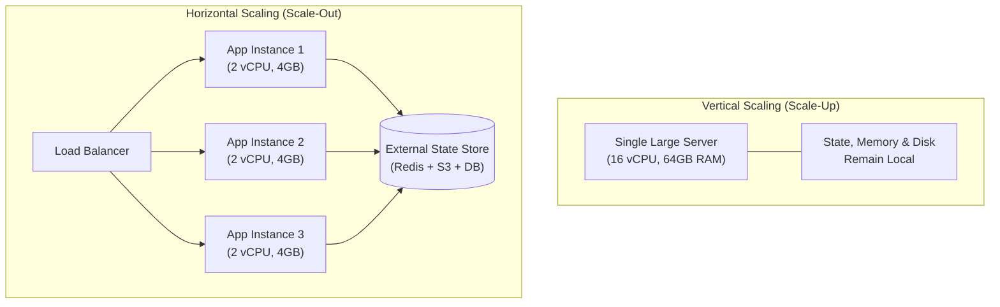
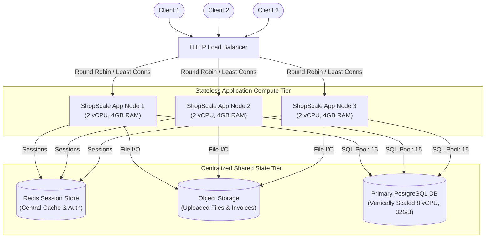
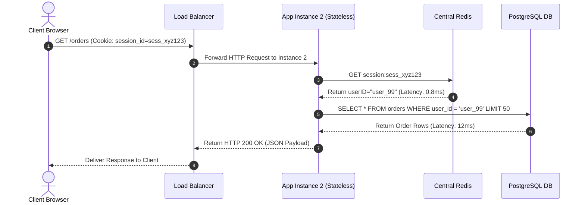

# Day 04 — Vertical vs. Horizontal Scaling: Your Server is at 90% CPU, What Do You Actually Do?

> 🔗 **LinkedIn Discussion**: [Read & Discuss on LinkedIn](https://www.linkedin.com/in/himanshu-verma-822a07286/)  
> 🏛️ **System Architecture Milestone**: [`v1-monolith`](../../../system-evolution/v1-monolith/README.md)

---

## The Problem

On Day 03, we stabilized **ShopScale** under 1,000 concurrent users by enforcing bounded database connection pools, strict API pagination, and Linux socket reuse on a single virtual server (2 vCPUs, 4 GB RAM).

Over the next two weeks, organic growth and a new marketing push increase steady-state traffic to **3,500 active concurrent users**, generating roughly **1,200 requests per second (RPS)**. 

During peak afternoon hours, the on-call engineer receives an urgent alert:

```text
[ALERT] shopscale-app-01: CPU Utilization > 90% for 5 consecutive minutes (Current: 94%)
```

Latency metrics begin degrading across all HTTP routes:
- **P50 Latency** increases from **25ms** to **450ms**.
- **P99 Latency** spikes from **180ms** to **3,200ms**.
- HTTP `504 Gateway Timeout` errors start appearing in client-side metrics as request queues fill up.

```text
[ Traffic: 3,500 Concurrent Users / 1,200 RPS ]
                     │
                     ▼
┌────────────────────────────────────────────────────────┐
│ Single Application Server (2 vCPUs, 4 GB RAM)          │
│ ├── User Space CPU (JSON / Bcrypt / Logic): 82%        │
│ ├── Kernel / System CPU: 10%                           │
│ ├── Total CPU Utilization: 92% (CRITICAL SATURATION)   │
│ └── Application Request Queue: 450 requests waiting    │
└────────────────────────────────────────────────────────┘
```

The engineering manager asks a direct question: 

> *"Our single server is sitting at 90% CPU. Should we resize it to an 8-core server, or spin up 3 more servers?"*

This is the fundamental dilemma of **Vertical Scaling (Scale-Up)** versus **Horizontal Scaling (Scale-Out)**.

If you scale up blindly without understanding instance limits and reboot costs, you lock yourself into an expensive single point of failure. If you scale out blindly without refactoring state management, your application breaks silently as users experience lost sessions, inconsistent data, and missing file uploads.

---

## Why the Simple Approach Breaks

When facing 90% CPU saturation, engineers usually default to one of two quick fixes. Both fail if executed without evaluating application architecture.

```text
               ┌──────────────────────────────────────────────┐
               │    Server CPU Saturation (90% Utilization)   │
               └──────────────────────┬───────────────────────┘
                                      │
           ┌──────────────────────────┴──────────────────────────┐
           ▼                                                     ▼
┌────────────────────────────┐                        ┌────────────────────────────┐
│ NAIVE FIX 1: Scale Up      │                        │ NAIVE FIX 2: Scale Out     │
│ (Upgrade to 8 vCPU / 16GB) │                        │ (Spin up 3 app instances)  │
└──────────┬─────────────────┘                        └──────────┬─────────────────┘
           │                                                     │
           ▼                                                     ▼
• Requires server downtime during resize              • In-memory user sessions lost randomly
• Exponential cost curve at higher tiers              • Local image uploads return HTTP 404
• Hard ceiling at maximum VM size                     • In-process cache data diverges across nodes
• Single Point of Failure remains                      • DB connection pool multiplied x3 (Crashes DB)
```

### 1. Why "Just Upgrade the Server" (Scale-Up) Fails Long-Term

Upgrading from a `2 vCPU / 4 GB` cloud instance to an `8 vCPU / 16 GB` instance takes less than five minutes in a cloud console. However, relying exclusively on vertical scaling introduces severe operational ceilings:

1. **Downtime During Resize**: Resizing a cloud virtual machine requires stopping the instance, migrating the underlying disk volume, and starting it on a larger hypervisor host. For a single-server architecture, this causes **100% service downtime** during the migration.
2. **Hyper-Exponential Cost Curve**: Cloud providers price hardware on a non-linear curve. Doubling server resources at lower tiers is cheap, but scaling to enterprise-grade instances (e.g., 64 vCPUs, 256 GB RAM) costs significantly more per compute unit than running multiple smaller instances.
3. **Hard Hardware Ceilings**: Physical host machines have upper limits. Once you reach the maximum instance size offered by your provider (e.g., 128 vCPUs), you hit a hard wall. You cannot scale up further without refactoring your system.
4. **Single Point of Failure (SPOF)**: A massive 32-core server still runs on a single physical host, single motherboard, and single OS kernel. If the hypervisor fails or the kernel panics, your entire business goes offline.

### 2. Why "Just Spin Up More Servers" (Scale-Out) Breaks Existing Monoliths

If you place 3 identical application servers behind an HTTP load balancer without modifying the application code, the system fails in production immediately:

1. **Session Disruption**: If `Instance 1` handles a user's `/login` request and saves the session token in local RAM (`sessionStore[session_id] = userID`), the user's next request (`GET /checkout`) routed to `Instance 2` fails with HTTP `401 Unauthorized`. The user is repeatedly logged out.
2. **In-Process Cache Divergence**: If `Instance 1` updates a product price in its local memory cache, `Instance 2` and `Instance 3` continue serving the old price from their own isolated local memory, causing data inconsistency.
3. **File Storage Isolation**: If a user uploads an avatar image saved to `/var/www/uploads/avatar.jpg` on `Instance 1`, any subsequent page request routed to `Instance 2` attempts to read `/var/www/uploads/avatar.jpg` on `Instance 2`'s local disk, resulting in HTTP `404 Not Found`.
4. **Uncoordinated Database Connection Explosion**: On Day 03, we configured the app to maintain a maximum of 25 DB connections. If you spin up 4 identical app instances without adjusting database settings, total open connections jump to $4 \times 25 = 100$, threatening PostgreSQL memory limits.

---

## Understanding the Problem

To choose correctly between vertical and horizontal scaling, you must profile the CPU bottleneck and understand the prerequisite architectural transformations required for scale-out.

---

### Part 1: Profiling the 90% CPU Bottleneck

Before changing any infrastructure, inspect where the CPU cycles are actually being consumed using Linux diagnostic tools (`top`, `pidstat`, `perf`):

```text
%Cpu(s): 84.2 us,  8.1 sy,  0.0 ni,  5.2 id,  2.1 wa,  0.0 hi,  0.4 si,  0.0 st
```

CPU execution falls into three primary categories:

1. **User Space Time (`us`)**: Time spent executing application code (parsing JSON, running business logic, hashing passwords with `bcrypt`). High `us` indicates **true compute saturation**.
2. **System Time (`sy`)**: Time spent executing OS kernel instructions (context switching across thousands of threads, network socket processing). High `sy` indicates thread contention or OS boundary limits.
3. **I/O Wait (`wa`)**: CPU cycles spent idling while waiting for disk reads/writes or database network responses to finish. 

> **Critical Rule**: If CPU is at 90% due to **I/O Wait (`wa`)**, adding CPU cores or adding app nodes will **not** fix the bottleneck. You must fix the underlying slow queries or disk I/O. If CPU is at 90% due to **User Space (`us`)**, you are facing a genuine compute scaling boundary.

---

### Part 2: The Core Scaling Mechanics



#### Vertical Scaling (Scale-Up)
- **Concept**: Increasing the hardware capacity of an existing single server (adding CPU cores, RAM, or faster NVMe storage).
- **Architectural Impact**: Zero code changes. The application continues operating in a single memory space, relying on local OS threads, in-memory data structures, and local filesystem access.
- **Primary Use Case**: Stateful workloads that are difficult to partition horizontally (such as primary transactional relational databases).

#### Horizontal Scaling (Scale-Out)
- **Concept**: Adding multiple discrete application servers running parallel copies of the codebase behind a load distributor.
- **Architectural Impact**: Requires **Statelessness**. Application instances must not store any client state, session data, or uploaded files on local disks or in-process RAM.
- **Primary Use Case**: Stateless API layers, web application servers, and event processing workers.

---

### Part 3: The State Externalization Prerequisite

To transition an application from vertical to horizontal scaling, you must extract all state out of the application process and move it into centralized shared state stores:

```text
[ BEFORE: Stateful Application Node ]
┌────────────────────────────────────────────────────────┐
│ App Server Node 1                                      │
│ ├── In-Memory Sessions  (httpSessionMap in RAM)        │
│ ├── Local In-Memory Cache (go-cache / Guava in RAM)    │
│ └── Local Filesystem     (/var/www/uploads on SSD)    │
└────────────────────────────────────────────────────────┘

                           │
                           │  STATE EXTERNALIZATION
                           ▼

[ AFTER: Stateless Application Node ]
┌────────────────────────────────────────────────────────┐
│ App Server Node 1 (Stateless Compute)                  │
│ └── Executes pure code; holds NO local state           │
└──────────────────────────┬─────────────────────────────┘
                           │
        ┌──────────────────┼──────────────────┐
        ▼                  ▼                  ▼
┌───────────────┐  ┌───────────────┐  ┌───────────────┐
│ Central Redis │  │ Object Store  │  │ Central DB    │
│ (Sessions)    │  │ (S3 / GCS)    │  │ (PostgreSQL)  │
└───────────────┘  └───────────────┘  └───────────────┘
```

---

## Possible Approaches

When your server hits 90% CPU, you have four realistic engineering strategies.

| Strategy | How It Works | Where It Helps | Limitations | When It Makes Sense |
|---|---|---|---|---|
| **Option 1: Emergency Scale-Up (Vertical)** | Upgrade instance from 2 vCPUs to 8 vCPUs via cloud console. | Buys instant headroom in < 5 minutes without changing code. | Incurs 2–5 mins reboot downtime; high cost; keeps SPOF. | Emergency on-call stopgap to restore SLA during an active incident. |
| **Option 2: Hot-Path Compute Optimization** | Profile CPU (`pprof`); optimize JSON serialization, DB queries, and heavy algorithms. | Reduces CPU usage per request by 30–60% on existing hardware. | Requires engineering time; has diminishing returns once code is clean. | Always perform alongside or immediately after initial stabilization. |
| **Option 3: Horizontal Scale-Out (Stateless Tier)** | Externalize sessions to Redis, files to S3, and deploy N small app instances behind a Load Balancer. | Infinite linear compute scale; zero-downtime deployments; high availability. | Introduces network latency (0.5–2ms Redis hops); higher operational complexity. | Mandatory for web/API tiers handling growing user traffic. |
| **Option 4: Asymmetric Hybrid Scaling** | Scale application tier horizontally (N stateless nodes) while scaling database vertically. | Decouples web compute scaling from database transactional storage limits. | Relational database write master eventually hits vertical hardware ceiling. | Standard industry architecture for 95% of growing web systems. |

---

## Trade-offs

Choosing between vertical and horizontal scaling is not a decision about which is "better"—it is a decision about which operational trade-offs fit your team's current constraints.

```text
Vertical Scaling (Scale-Up)                   Horizontal Scaling (Scale-Out)
┌──────────────────────────────────────┐     ┌──────────────────────────────────────┐
│ • Simple operations (1 server)       │     │ • High availability (N-1 redundancy) │
│ • Zero network latency for state     │ VS  │ • Zero-downtime deployments          │
│ • Higher cost per compute unit       │     │ • Complex state management           │
│ • Hard hardware limits & SPOF        │     │ • Network latency for remote state   │
└──────────────────────────────────────┘     └──────────────────────────────────────┘
```

### Trade-off Matrix

| Metric | Single Vertically Scaled Instance | Horizontally Scaled Stateless Tier |
|---|---|---|
| **Operational Complexity** | **Very Low**: Single machine to monitor, backup, and log. | **Moderate to High**: Requires load balancers, shared state infrastructure, centralized logging, and service discovery. |
| **Fault Tolerance & Availability** | **Zero**: If host hardware or kernel fails, the system goes offline. | **High**: If Node 2 crashes, the load balancer automatically routes traffic to Node 1 and Node 3. |
| **Deployment Strategy** | Requires brief service maintenance window or blue/green server swap. | Supports **Zero-Downtime Rolling Updates** (upgrade nodes one by one). |
| **Cost Efficiency** | **Poor at Scale**: Large instances incur steep enterprise pricing curves. | **High at Scale**: Run N cheap instances (e.g., 2 vCPU) and auto-scale node counts based on real-time CPU. |
| **Code Structure Requirements** | Code can be stateful (in-memory sessions, local disk storage). | Code **must be 100% stateless**; all shared data must live in external services. |
| **State Latency** | **0ms**: In-memory variable access (`RAM`). | **0.5ms – 2ms**: Network round-trips to Redis or PostgreSQL state services. |

---

## A Practical Example

Let's refactor **ShopScale** from a stateful single server operating at 90% CPU into a horizontally scalable stateless application tier.

### 1. Refactoring Stateful Code to Stateless Code

#### Before (Stateful Implementation — Monolith Node 1)
The original code stored HTTP session data in a local Go map in application RAM and wrote user invoice PDFs directly to local disk:

```go
// BAD: Stateful implementation bound to a single server's local RAM and disk
package main

import (
	"fmt"
	"net/http"
	"os"
	"sync"
)

// ❌ State held in local node RAM
var (
	sessionMutex sync.RWMutex
	sessionStore = make(map[string]string) // sessionToken -> userID
)

func HandleLoginBad(w http.ResponseWriter, r *http.Request) {
	sessionToken := "sess_xyz123"
	userID := "user_99"

	sessionMutex.Lock()
	sessionStore[sessionToken] = userID // ❌ Stored in Node 1 memory
	sessionMutex.Unlock()

	http.SetCookie(w, &http.Cookie{Name: "session_id", Value: sessionToken})
	w.Write([]byte("Logged in"))
}

func HandleUploadInvoiceBad(w http.ResponseWriter, r *http.Request) {
	// ❌ Saved to local node SSD
	filePath := "/var/www/uploads/invoice_1001.pdf"
	os.WriteFile(filePath, []byte("PDF Content"), 0644)
	fmt.Fprintf(w, "File saved locally at %s", filePath)
}
```

If `HandleLoginBad` runs on `Instance 1`, subsequent requests reaching `Instance 2` fail because `sessionStore` on `Instance 2` does not contain `sess_xyz123`.

---

#### After (Stateless Implementation — Scalable Across N Nodes)
We refactor session management to use a central **Redis** instance and store user files in an external **Object Storage** bucket (e.g., AWS S3 or MinIO):

```go
// GOOD: 100% Stateless implementation - can run on 1 or 100 app nodes identically
package main

import (
	"context"
	"net/http"
	"time"

	"github.com/go-redis/redis/v8"
)

type AppHandler struct {
	RedisClient *redis.Client // Central shared session store
}

func (h *AppHandler) HandleLoginGood(w http.ResponseWriter, r *http.Request) {
	ctx, cancel := context.WithTimeout(r.Context(), 2*time.Second)
	defer cancel()

	sessionToken := "sess_xyz123"
	userID := "user_99"

	// ✅ Save session to Central Redis with a 24-hour expiration
	err := h.RedisClient.Set(ctx, "session:"+sessionToken, userID, 24*time.Hour).Err()
	if err != nil {
		http.Error(w, "Session Store Unavailable", http.StatusInternalServerError)
		return
	}

	http.SetCookie(w, &http.Cookie{Name: "session_id", Value: sessionToken, Path: "/"})
	w.Write([]byte("Logged in statelessly"))
}

func (h *AppHandler) HandleAuthCheckGood(w http.ResponseWriter, r *http.Request) bool {
	ctx, cancel := context.WithTimeout(r.Context(), 1*time.Second)
	defer cancel()

	cookie, err := r.Cookie("session_id")
	if err != nil {
		return false
	}

	// ✅ Any app instance (Node 1, 2, or 3) checks the same central Redis store
	userID, err := h.RedisClient.Get(ctx, "session:"+cookie.Value).Result()
	if err != nil || userID == "" {
		return false
	}

	return true
}
```

---

### 2. Horizontally Scaled Topology

With the application code refactored to be completely stateless, we deploy an **HTTP Load Balancer** in front of 3 stateless application nodes, backed by central Redis and PostgreSQL clusters:



---

### 3. Request Data Flow Sequence



Because **Instance 2** holds no local state, if **Instance 2** dies mid-request, the Load Balancer retries the request against **Instance 3**, which reads the exact same session from Redis and completes the request seamlessly.

---

## Failure Scenarios

Transitioning to a horizontally scaled stateless architecture resolves single-server CPU saturation, but introduces four distinct distributed system failure modes:

### 1. The "Sticky Sessions" Trap
Teams sometimes attempt to avoid refactoring stateful code by configuring the load balancer with **Session Stickiness** (using IP hashing or `cookie-based affinity`) to force a client's requests back to the same application node.

```text
[ Client A ] ───(Pinned to Node 1)───> [ App Instance 1 (Stateful) ] ──> (Holds Client A Session)
                                                  │
                                                  ▼
                                       [ 💥 INSTANCE 1 CRASHES ]
                                                  │
                                                  ▼
[ Client A ] ───(Re-routed to Node 2)─> [ App Instance 2 ] ──> ❌ Missing Session! User Logged Out!
```

- **Why it fails**: If `Instance 1` crashes or is terminated by an auto-scaling event, all users pinned to `Instance 1` immediately lose their active sessions and shopping carts. Sticky sessions also cause **traffic imbalance**, where one instance handles 80% of requests because a few high-volume client IPs are pinned to it.
- **Mitigation**: Do not use sticky sessions to bypass state externalization. Treat application nodes as completely interchangeable compute workers.

### 2. Uncoordinated DB Connection Multiplier
On Day 03, we established that PostgreSQL performance degrades when connection counts grow too high. 

If each app node opens a max pool of 25 connections (`SetMaxOpenConns(25)`), scaling out from 1 node to 6 nodes increases active DB connections from 25 to $6 \times 25 = 150$ connections, exhausting PostgreSQL connection limits.

- **Mitigation**: Adjust per-node connection pools dynamically based on node count:
  $$\text{Per-Node Max Open Conns} = \frac{\text{Max Allowed Database Connections}}{\text{Number of App Nodes}}$$
  Alternatively, deploy a central database proxy (such as **PgBouncer**) between the app nodes and PostgreSQL.

### 3. Redis Central State Outage
By moving session storage from local RAM to Redis, Redis becomes a critical dependency. If the Redis instance saturates its CPU or experiences a network partition, **all application nodes fail authentication simultaneously**.

- **Mitigation**: Deploy Redis in a High Availability (HA) configuration using **Redis Sentinel** or **Redis Cluster** with automatic master failover.

### 4. Cache Stampede across Parallel Nodes
When a popular cache key (e.g., product details for a flash sale) expires in central Redis, 4 parallel app nodes simultaneously receive requests for that key. All 4 nodes query PostgreSQL at the exact same millisecond, triggering a **Cache Stampede** on the database.

- **Mitigation**: Implement **Singleflight** pattern or distributed locking in the application tier to ensure only one app node recomputes the cache key while other nodes wait for the updated value.

---

## Key Engineering Decisions

When facing high CPU utilization on a server, follow this decision tree to choose your scaling path:

```text
                      [ Server CPU > 80% ]
                               │
                               ▼
                    Run `top` / `pidstat`
                               │
        ┌──────────────────────┴──────────────────────┐
        ▼                                             ▼
[ High I/O Wait (%wa) ]                     [ High User CPU (%us) ]
        │                                             │
        ▼                                             ▼
• Fix slow DB queries                       Audit Application Code:
• Add DB indexes                            Is state stored in RAM or local disk?
• Optimize Disk I/O                                   │
                                       ┌──────────────┴──────────────┐
                                       ▼                             ▼
                                [ STATEFUL ]                   [ STATELESS ]
                                       │                             │
                                       ▼                             ▼
                       • Apply emergency Scale-Up       • Add app nodes behind LB
                         (Upgrade VM size to buy time)  • Configure Auto-Scaling
                       • Externalize State to Redis/S3   • Scale app tier horizontally
                       • Transition to Scale-Out
```

### Summary Checklist for On-Call Engineers

1. **Diagnose Before Acting**: Inspect CPU breakdown (`us` vs `sy` vs `wa`). Never add compute hardware to solve an I/O wait bottleneck.
2. **Use Scale-Up as Emergency Stopgap Only**: If an outage is imminent, doubling VM specs buys immediate headroom (hours/days). Use that window to refactor for statelessness.
3. **Decouple Compute Scaling from Storage Scaling**: Scale your stateless app tier **horizontally** (many small nodes). Scale your relational database tier **vertically** (single large node with high RAM/IOPS) until write limits require read replicas.
4. **Enforce Hard Bounds on External State Dependencies**: Set aggressive connection pool limits and timeouts on Redis and PostgreSQL calls so app nodes shed load gracefully rather than hanging.

---

## Key Takeaways

1. **Vertical scaling changes hardware; horizontal scaling changes architecture.** Scaling up requires zero code changes but hits cost and uptime limits. Scaling out requires statelessness but yields high availability.
2. **Statelessness is the absolute prerequisite for horizontal scale-out.** Application nodes must treat local RAM and local disk as transient. All shared state must live in external state stores (Redis, Object Storage, Relational DBs).
3. **Beware of the horizontal database connection multiplier.** Scaling stateless app instances multiplies open database connections. Use database connection proxies or adjust per-node pool limits accordingly.
4. **Never rely on sticky sessions as a substitute for stateless design.** Session stickiness creates traffic imbalances and causes session loss during node failures.
5. **The default modern architecture is asymmetric.** Scale compute tiers horizontally behind a load balancer while scaling stateful transactional databases vertically on dedicated hardware.

---

### ⏭️ Next Step
* Read the next guide: **[Day 05 — The Load Balancer Changes Everything](../day-05-load-balancer-changes-everything/README.md)**
* View the updated architecture milestone: [`v1-monolith`](../../../system-evolution/v1-monolith/README.md)
