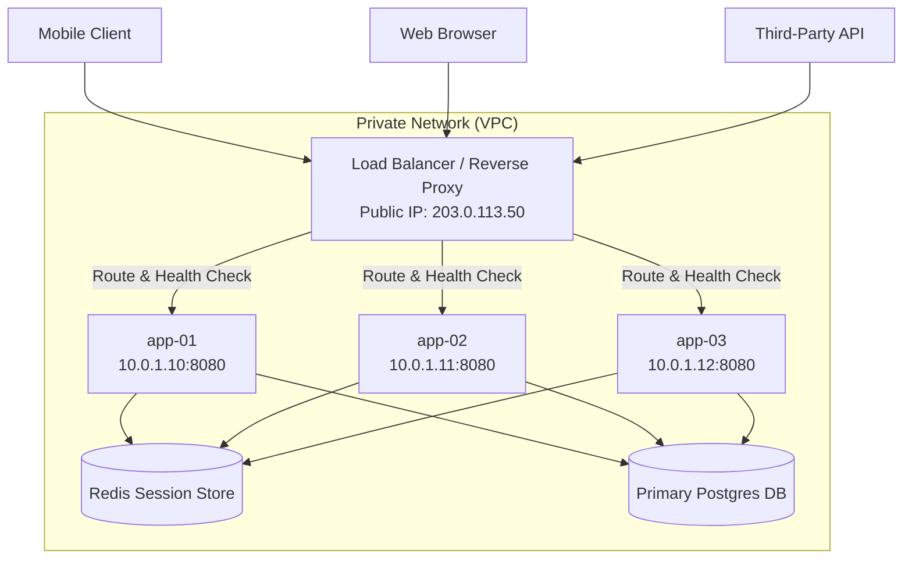
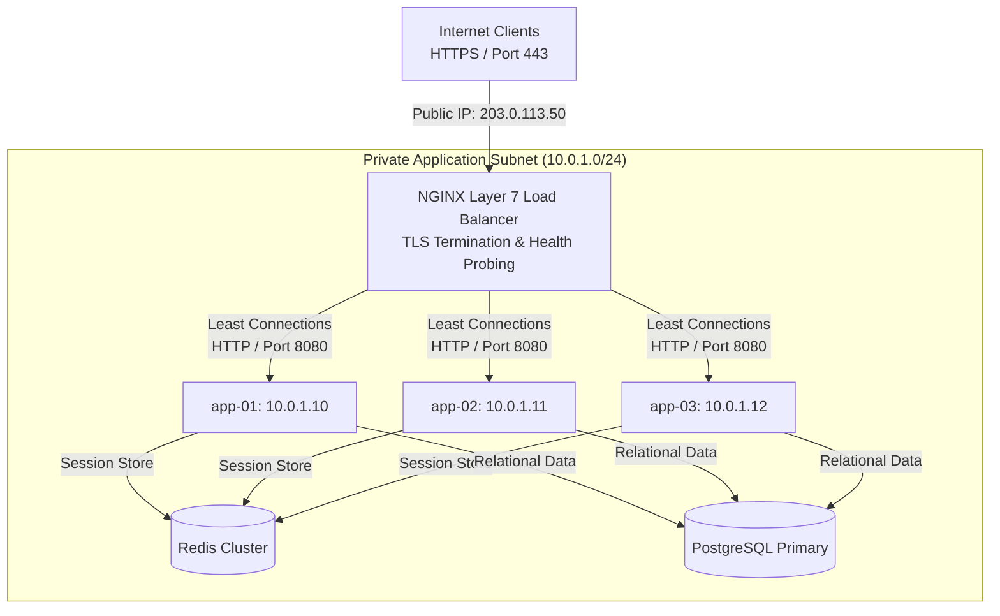

# Day 05 — The Load Balancer Changes Everything: Moving from One Server to Many

> 🔗 **LinkedIn Discussion**: [Read & Discuss on LinkedIn](https://www.linkedin.com/in/himanshu-verma-822a07286/)  
> 🏛️ **System Architecture Milestone**: [`v2-scaled-compute`](../../../system-evolution/v2-scaled-compute/README.md)

---

## The Problem

On Day 04, we made a fundamental architectural decision: to scale out our application compute layer from a single server to multiple instances, we had to make the application **stateless**. We decoupled user session state to a centralized Redis cluster and shifted user file uploads to object storage.

With state externalized, we provisioned three identical application instances for **ShopScale**:
- `app-01` (`10.0.1.10:8080`)
- `app-02` (`10.0.1.11:8080`)
- `app-03` (`10.0.1.12:8080`)

Each instance runs the same compiled code, connects to the same PostgreSQL primary database and Redis cluster, and is capable of processing user checkouts.

However, as soon as we launched these three servers, we ran into an immediate structural wall: **How do incoming client requests actually reach these three distinct IP addresses?**

```text
                                [ Client Requests ]
                                         │
                                         ▼
                            DNS: api.shopscale.com
                                         │
                                   [ IP: ??? ]
                                         │
       ┌─────────────────────────────────┼─────────────────────────────────┐
       ▼                                 ▼                                 ▼
┌──────────────┐                  ┌──────────────┐                  ┌──────────────┐
│    app-01    │                  │    app-02    │                  │    app-03    │
│  10.0.1.10   │                  │  10.0.1.11   │                  │  10.0.1.12   │
└──────────────┘                  └──────────────┘                  └──────────────┘
```

Clients—browsers, mobile apps, third-party webhook callers—only talk to a single entry point: `https://api.shopscale.com`. A domain name resolves to IP addresses via DNS. 

If we hardcode `api.shopscale.com` to point directly to `10.0.1.10` (`app-01`):
1. **100% of traffic hits `app-01`**. `app-01` remains bottlenecked at 90% CPU, while `app-02` and `app-03` sit completely idle at 0% CPU utilization, wasting infrastructure spend.
2. **Zero Fault Tolerance**. If `app-01` experiences a kernel panic, memory leak crash, or cloud hypervisor failure, the entire ShopScale platform goes offline. The existence of `app-02` and `app-03` provides zero benefit because no network route directs users to them.

We have moved from one server to many, but without a dedicated component managing traffic distribution, our multi-instance fleet is useless.

---

## Why the Simple Approach Breaks

Before introducing a dedicated load balancer, engineers often consider lighter, DNS-level or client-side workarounds to distribute traffic across multiple servers. In production, these naive workarounds break down quickly.

```text
                    ┌──────────────────────────────────────────────┐
                    │  Naive Multiserver Distribution Approaches   │
                    └──────────────────────┬───────────────────────┘
                                           │
            ┌──────────────────────────────┴──────────────────────────────┐
            ▼                                                             ▼
┌──────────────────────────────────────┐       ┌──────────────────────────────────────┐
│  NAIVE FIX 1: DNS Round Robin        │       │  NAIVE FIX 2: Client-Side Balancing  │
│  (Multiple A Records in DNS)         │       │  (Hardcoded IPs in Mobile App/Web)   │
└──────────────────┬───────────────────┘       └──────────────────┬───────────────────┘
                   │                                              │
                   ▼                                              ▼
• Aggressive DNS caching ignores low TTLs      • Requires client app update to change IPs
• Zero health check awareness (black-holing)   • Exposes private VPC subnets publicly
• Uneven distribution across client ISPs       • Fails silently on network drop retries
```

### 1. Why DNS Round Robin Fails in Production

The simplest attempt to distribute load is configuring multiple `A` records for `api.shopscale.com` in your DNS provider (e.g., Route53 or Cloudflare):

```text
api.shopscale.com.  60  IN  A  10.0.1.10
api.shopscale.com.  60  IN  A  10.0.1.11
api.shopscale.com.  60  IN  A  10.0.1.12
```

When a client queries the DNS server, the DNS server rotates the order of the IP addresses returned. While conceptually elegant, DNS round robin fails for three critical reasons:

1. **Uncontrollable Client and ISP Caching**: Even if you set DNS Time-To-Live (TTL) to 60 seconds, recursive DNS resolvers at ISPs, operating system DNS caches, and web browsers frequently ignore TTLs and cache IP addresses for hours. If a single corporate network or ISP caches `10.0.1.10`, thousands of employees on that network will all route to `app-01`, causing massive traffic imbalances.
2. **Black-Hole Traffic Routing (Zero Health Awareness)**: DNS is completely decoupled from application runtime health. If `app-01` crashes or suffers a deadlocked thread pool, the DNS resolver continues handing out `10.0.1.10` to 33% of incoming DNS queries. One-third of all user requests fail immediately with `Connection Refused` or `HTTP 504 Gateway Timeout`.
3. **No Graceful Traffic Draining**: When deploying new code, you cannot cleanly remove a node from DNS. Old cached resolvers will continue sending live user requests to the terminated instance long after you shut it down.

### 2. Why Client-Side Balancing Fails for Public APIs

Another naive approach is forcing the frontend or mobile application to fetch a list of active backend server IPs and select one at random.

- **Security Exposure**: Exposing individual internal application server IPs (`10.0.1.10`, `10.0.1.11`) to the public internet bypasses firewall perimeters and exposes application servers to direct DDoS attacks.
- **Client Synchronization Delay**: If an instance crashes or is recycled during auto-scaling, mobile apps currently running in the field will continue attempting connections to the dead IP until they refresh their internal server list.
- **Idempotency and Retry Risks**: If a client-side library attempts an HTTP request to `10.0.1.10`, times out after 2 seconds, and retries the request against `10.0.1.11`, it risks executing non-idempotent operations twice (such as charging a user's credit card twice).

---

## Understanding the Problem

To solve these failure modes, we must place a dedicated, highly reliable proxy component between clients and our application fleet: a **Load Balancer**.



### Layer 4 vs. Layer 7 Load Balancing

Load balancers operate primarily at two distinct layers of the Open Systems Interconnection (OSI) model. Choosing the right layer depends on your routing requirements and performance constraints.

```text
               ┌──────────────────────────────────────────────────┐
               │           Incoming Client Request                │
               └────────────────────────┬─────────────────────────┘
                                        │
             ┌──────────────────────────┴──────────────────────────┐
             ▼                                                     ▼
┌───────────────────────────────────────┐ ┌───────────────────────────────────────┐
│ Layer 4 (Transport Layer Proxy)       │ │ Layer 7 (Application Layer Proxy)     │
│ Protocol: TCP / UDP                   │ │ Protocol: HTTP / HTTPS / gRPC         │
├───────────────────────────────────────┤ ├───────────────────────────────────────┤
│ • Inspects: IP Address & TCP Port     │ │ • Inspects: HTTP Headers, URI Path,   │
│ • Routing based on raw byte streams   │ │   Cookies, Query Parameters, Host     │
│ • Extremely high packet throughput    │ │ • Enables path-based routing          │
│ • Low CPU overhead per connection     │ │ • Enables TLS/SSL Termination         │
│ • Cannot read HTTP headers or cookies │ │ • Enables cookie-based stickiness     │
│ • Examples: AWS NLB, HAProxy (TCP)    │ │ • Examples: NGINX, HAProxy (HTTP), ALB│
└───────────────────────────────────────┘ └───────────────────────────────────────┘
```

#### 1. Layer 4 (Transport Layer) Load Balancing
A Layer 4 load balancer makes routing decisions based strictly on network-layer data: source IP, source port, destination IP, destination port, and IP protocol (TCP/UDP). 

It acts as a smart packet forwarder. It establishes a TCP connection with the client and opens a corresponding TCP connection with a backend server, passing raw bytes back and forth without inspecting or modifying the application payload.

- **Advantage**: Ultra-low latency and minimal CPU consumption per request. It can handle millions of packets per second easily.
- **Limitation**: Cannot inspect HTTP headers, URI paths (`/api/v1/users` vs `/api/v1/orders`), or cookies. Cannot perform TLS termination if application-level HTTP metadata is required for routing.

#### 2. Layer 7 (Application Layer) Load Balancing
A Layer 7 load balancer terminates the client's TCP and TLS connection, parses the incoming HTTP/HTTPS request, reads headers, cookies, and request paths, and then selects an upstream backend server based on application-level context.

- **Advantage**: Intelligent routing (e.g., route `/static/*` to object storage, route `/checkout` to high-compute nodes), SSL/TLS offloading, header manipulation (`X-Forwarded-For`), HTTP health probing, and granular rate limiting.
- **Limitation**: Higher CPU and memory consumption per connection due to TCP connection termination, TLS decryption, and HTTP parsing.

For **ShopScale**, we deploy a **Layer 7 load balancer** because our modern API architecture requires TLS termination, path-based routing, HTTP health checks, and request header sanitization.

---

## Possible Approaches: Balancing Algorithms & Traffic Control

Once a Layer 7 load balancer receives an HTTP request, how does it choose which backend node (`app-01`, `app-02`, or `app-03`) should handle it? 

Different routing algorithms optimize for different traffic profiles and system constraints.

---

### 1. Round Robin

Requests are distributed sequentially across the list of backend servers in a fixed cyclic order.

```text
Request 1  ───>  app-01 (10.0.1.10)
Request 2  ───>  app-02 (10.0.1.11)
Request 3  ───>  app-03 (10.0.1.12)
Request 4  ───>  app-01 (10.0.1.10)
```

- **How it works**: Maintain an internal pointer array of healthy servers. For each new request, pick `servers[index % N]` and increment the index.
- **Where it helps**: Simple, $O(1)$ constant time lookup, zero state tracking per request.
- **Limitations**: Assumes all backend nodes have identical computing power and that all incoming requests consume identical CPU/memory resources.
- **When it makes sense**: Homogeneous backend server fleets where request execution times are uniform (e.g., serving static files or executing predictable, fast read APIs).

---

### 2. Least Connections

The load balancer tracks the number of active, open HTTP connections currently being processed by each backend instance and routes the next incoming request to the server with the fewest active connections.

```text
app-01: 42 active connections
app-02: 18 active connections  <─── Next Request routed here!
app-03: 35 active connections
```

- **How it works**: The proxy increments a counter when a request is forwarded to an instance and decrements it when the response completes. New requests target $\min(\text{active\_connections})$.
- **Where it helps**: Prevents server overload when request processing times vary wildly (e.g., some endpoints complete in 5ms, while others spend 2,000ms generating reports or processing images).
- **Limitations**: Incur slight CPU overhead to track state across connections. **Dangerous during instant error cascades**: if `app-02` breaks and begins immediately throwing HTTP `500` errors in 0.1ms, its active connection count drops to 0. Least Connections will mistakenly route *all* incoming traffic to the failing node!
- **When it makes sense**: Workloads with long-running requests, WebSocket connections, or highly variable API execution times.

---

### 3. Weighted Round Robin / Weighted Least Connections

Each backend server is assigned a weight integer proportional to its hardware capacity.

```text
app-01 (4 vCPU, 8GB): Weight = 2  ─── Gets 50% of traffic
app-02 (2 vCPU, 4GB): Weight = 1  ─── Gets 25% of traffic
app-03 (2 vCPU, 4GB): Weight = 1  ─── Gets 25% of traffic
```

- **How it works**: The algorithm skews distribution cycles based on assigned weights. A node with weight 2 receives twice as many requests as a node with weight 1.
- **Where it helps**: Managing heterogeneous fleets (mixing legacy hardware with newer, faster instances), performing gradual blue-green deployments, or running canary releases (assigning weight 1 to a new code release and weight 99 to the existing fleet).
- **Limitations**: Requires manual tuning or dynamic orchestration integrations to adjust weights accurately.

---

### 4. Health Checks: Active vs. Passive Probing

A load balancer is only as effective as its health check mechanism. Without health checks, a load balancer will happily send traffic to dead application nodes.

```text
Load Balancer ───(GET /health every 5s)───> [ app-01 ] ──> HTTP 200 OK (Healthy)
Load Balancer ───(GET /health every 5s)───> [ app-02 ] ──> Timeout / HTTP 500 (UNHEALTHY!)
                                                  │
                                                  ▼
                                    [ Removed from Upstream Pool ]
```

- **Active Health Checks**: The load balancer periodically initiates out-of-band synthetic HTTP requests to a dedicated endpoint on each backend instance (e.g., `GET /health` every 5 seconds).
  - *Thresholds*:
    - **Rise (Healthy Threshold)**: Number of consecutive successful checks required before marking a failed node as `UP` (e.g., 2 consecutive `200 OK` responses).
    - **Fall (Unhealthy Threshold)**: Number of consecutive failed checks before taking a node out of rotation (e.g., 3 consecutive failures or timeouts).
- **Passive Health Checks**: The load balancer monitors real user traffic flowing through the proxy. If an instance returns 5 consecutive HTTP `502 Bad Gateway` errors or TCP connection resets within 10 seconds, the load balancer temporarily suspends traffic to that node for a configured cooldown period (`fail_timeout`).

---

### 5. Sticky Sessions (Session Affinity): Why It Is an Anti-Pattern for Scalable Monoliths

Teams migrating stateful applications to multi-server setups often attempt to bypass refactoring by enabling **Sticky Sessions** on the load balancer.

Using an HTTP cookie or client IP hash, the load balancer pins Client A to `app-01` permanently.

```text
[ Client A ] ───(Pinned via Cookie)───> [ Load Balancer ] ───> [ app-01 (RAM holds Session A) ]
[ Client B ] ───(Pinned via Cookie)───> [ Load Balancer ] ───> [ app-02 (RAM holds Session B) ]
                                                                       │
                                                                       ▼
                                                             [ 💥 app-02 CRASHES ]
                                                                       │
                                                                       ▼
[ Client B ] ───(Fails over to app-01)─> [ Load Balancer ] ───> ❌ HTTP 401 Unauthorized!
                                                                  (Session B missing in app-01 RAM)
```

- **Why it breaks horizontal scaling**:
  1. **Hot-Spotting**: A few heavy enterprise clients pinned to `app-01` can saturate `app-01`'s CPU while `app-02` stays idle. The load balancer cannot rebalance this traffic.
  2. **Cascading Failure on Instance Termination**: When `app-02` dies or auto-scales down, all users pinned to `app-02` lose their active sessions, shopping carts, and form states, resulting in severe user disruption.
- **Rule of Architecture**: Do not use sticky sessions to bypass state externalization. Treat application instances as completely interchangeable compute units. Store state in external datastores (Redis), not local application RAM.

---

## Trade-offs

Introducing a load balancer transitions your system from a single isolated server into a distributed network architecture. This adds significant capabilities, but introduces new network and operational overhead.

| Architectural Dimension | Single Server (Day 01–03) | Multi-Instance Fleet with Load Balancer (Day 05) |
|---|---|---|
| **Fault Tolerance** | **Zero**. Single Point of Failure (SPOF). Server crash = total platform downtime. | **High**. If 1 of 3 nodes crashes, the LB routes 100% of traffic to the remaining 2 healthy nodes automatically within seconds. |
| **Capacity & Elasticity** | **Capped**. Limited by the maximum physical CPU/RAM specs of a single VM host. | **Elastic**. Scale compute capacity horizontally from 3 to 30 instances based on traffic metrics. |
| **Maintenance & Deployments** | **High Impact**. Upgrades require scheduling downtime windows and stopping the server process. | **Zero Downtime**. Perform rolling deployments by removing instances from the load balancer pool one at a time. |
| **Network Hop Overhead** | **Low**. Client connects directly to application process (1 network hop). | **Medium**. Client connects to LB; LB proxies to application instance over internal network (+1 to +3ms latency). |
| **System Complexity** | **Low**. Single application log file, single IP address, local memory calls. | **Medium**. Requires managing reverse proxy configuration, internal VPC subnets, and proxy header forwarding. |
| **TLS/SSL Overhead** | Application process must parse TLS certificates and compute handshakes alongside business logic. | Load balancer offloads TLS handshakes completely, freeing application CPU cycles for business logic. |

---

## A Practical Example: ShopScale v2 Infrastructure

Let's implement the Layer 7 load balancer architecture for **ShopScale** using NGINX as our high-performance reverse proxy.

### 1. Updated System Architecture Diagram



---

### 2. NGINX Production Load Balancer Configuration

Below is the production-grade NGINX upstream configuration (`/etc/nginx/nginx.conf`) enforcing least connections balancing, active proxy timeouts, and proper client IP header propagation.

```nginx
user nginx;
worker_processes auto;
error_log /var/log/nginx/error.log warn;
pid /var/run/nginx.pid;

events {
    worker_connections 10240;
    use epoll;
    multi_accept on;
}

http {
    include       /etc/nginx/mime.types;
    default_type  application/octet-stream;

    # Logging format extracting client IP from X-Forwarded-For
    log_format main '$remote_addr - $remote_user [$time_local] "$request" '
                    '$status $body_bytes_sent "$http_referer" '
                    '"$http_user_agent" "$http_x_forwarded_for" '
                    'upstream_response_time=$upstream_response_time '
                    'msec=$msec request_time=$request_time';

    access_log /var/log/nginx/access.log main;

    # Performance Tuning
    sendfile        on;
    tcp_nopush      on;
    tcp_nodelay     on;
    keepalive_timeout 65;

    # Define Upstream Pool for ShopScale Application Fleet
    upstream shopscale_app_fleet {
        # Balancing Algorithm: Least Connections
        least_conn;

        # Application Server Targets with Passive Health Checks
        # max_fails: consecutive failed attempts before marking node unavailable
        # fail_timeout: duration node is marked unavailable after max_fails
        server 10.0.1.10:8080 max_fails=3 fail_timeout=10s weight=1;
        server 10.0.1.11:8080 max_fails=3 fail_timeout=10s weight=1;
        server 10.0.1.12:8080 max_fails=3 fail_timeout=10s weight=1;

        # Keepalive persistent TCP connections between LB and App nodes
        keepalive 32;
    }

    # Public HTTPS Server Block
    server {
        listen 443 ssl http2;
        server_name api.shopscale.com;

        # TLS Certificate Configuration
        ssl_certificate /etc/letsencrypt/live/api.shopscale.com/fullchain.pem;
        ssl_certificate_key /etc/letsencrypt/live/api.shopscale.com/privkey.pem;
        ssl_protocols TLSv1.2 TLSv1.3;
        ssl_ciphers HIGH:!aNULL:!MD5;

        # Route Traffic to Upstream Pool
        location / {
            proxy_pass http://shopscale_app_fleet;
            
            # Pass original HTTP Host and Real Client IP to Backend App Nodes
            proxy_set_header Host $host;
            proxy_set_header X-Real-IP $remote_addr;
            proxy_set_header X-Forwarded-For $proxy_add_x_forwarded_for;
            proxy_set_header X-Forwarded-Proto $scheme;

            # HTTP/1.1 for persistent connection reuse to backend
            proxy_http_version 1.1;
            proxy_set_header Connection "";

            # Proxy Timeouts to prevent hanging backends
            proxy_connect_timeout 2s;
            proxy_read_timeout 10s;
            proxy_send_timeout 10s;

            # Automatic Retry on Upstream Failures (Failover)
            proxy_next_upstream error timeout http_502 http_503;
            proxy_next_upstream_tries 2;
        }

        # Dedicated Health Check Location for Synthetic Monitoring
        location /lb-status {
            stub_status on;
            access_log off;
            allow 10.0.0.0/8; # Restrict status endpoint to internal VPC
            deny all;
        }
    }
}
```

---

### 3. Application Health Check Endpoint Implementation

To ensure NGINX or cloud load balancers can evaluate deep application health, the application must expose a dedicated, lightweight health check handler.

Here is how we implement a production **Readiness Health Check** in Go:

```go
package main

import (
	"context"
	"database/sql"
	"encoding/json"
	"net/http"
	"time"

	"github.com/redis/go-redis/v9"
)

type HealthResponse struct {
	Status    string            `json:"status"`
	Timestamp time.Time         `json:"timestamp"`
	Checks    map[string]string `json:"checks"`
}

func HealthCheckHandler(db *sql.DB, rdb *redis.Client) http.HandlerFunc {
	return func(w http.ResponseWriter, r *http.Request) {
		ctx, cancel := context.WithTimeout(r.Context(), 1*time.Second)
		defer cancel()

		status := "UP"
		checks := make(map[string]string)

		// 1. Verify PostgreSQL Database Ping
		if err := db.PingContext(ctx); err != nil {
			status = "DOWN"
			checks["database"] = "UNHEALTHY: " + err.Error()
		} else {
			checks["database"] = "OK"
		}

		// 2. Verify Redis Session Store Ping
		if err := rdb.Ping(ctx).Err(); err != nil {
			status = "DOWN"
			checks["redis"] = "UNHEALTHY: " + err.Error()
		} else {
			checks["redis"] = "OK"
		}

		w.Header().Set("Content-Type", "application/json")
		if status == "DOWN" {
			// HTTP 503 Service Unavailable informs Load Balancer to remove node
			w.WriteHeader(http.StatusServiceUnavailable)
		} else {
			w.WriteHeader(http.StatusOK)
		}

		json.NewEncoder(w).Encode(HealthResponse{
			Status:    status,
			Timestamp: time.Now(),
			Checks:    checks,
		})
	}
}
```

---

## Failure Scenarios: What Can Still Go Wrong

Even with a Layer 7 load balancer routing traffic across multiple application nodes, new edge cases and failure modes emerge in production.

---

### 1. The Single Load Balancer SPOF (Single Point of Failure)

```text
[ Client Traffic ] ───> [ 💥 Single NGINX Load Balancer (Crashed) ]
                                     │
                             (Traffic Blocked!)
                                     │
       ┌─────────────────────────────┼─────────────────────────────┐
       ▼                             ▼                             ▼
┌──────────────┐              ┌──────────────┐              ┌──────────────┐
│  app-01 (UP) │              │  app-02 (UP) │              │  app-03 (UP) │
└──────────────┘              └──────────────┘              └──────────────┘
```

- **The Failure**: You deploy three application servers, but route all traffic through a single NGINX Virtual Machine. If that single NGINX VM suffers a hardware disk failure or kernel panic, 100% of user traffic is blocked—even though all three application nodes are completely healthy.
- **The Solution**: Deploy load balancers in **High Availability (HA) Pairs** using **VRRP (Virtual Router Redundancy Protocol)** with `Keepalived`, or rely on managed cloud load balancers (such as AWS ALB or Cloudflare Anycast) that distribute ingress traffic across multiple Availability Zones under a single Floating Virtual IP (VIP).

```text
                        [ DNS: api.shopscale.com ]
                                     │
                        ┌────────────┴────────────┐
                        ▼                         ▼
             [ Active Load Balancer ] ◄──VRRP──► [ Standby Load Balancer ]
             [  Shared VIP: 203.0.113.50  ]      [ (Promoted if Active dies) ]
```

---

### 2. Zombie Health Checks (Shallow vs. Deep Checks)

- **The Failure**: Your health check endpoint simply returns `HTTP 200 OK` as long as the web server process is running (`GET /health` returns static `{"status":"ok"}`). However, `app-01`'s database connection pool has deadlocked. Real user requests to `/checkout` fail with HTTP 500 errors, but the load balancer continues routing traffic to `app-01` because `/health` keeps returning HTTP 200.
- **The Solution**: Differentiate between **Liveness Checks** (is the HTTP process alive?) and **Readiness Checks** (can the app execute queries against Postgres and Redis?). Ensure the load balancer targets the readiness endpoint.

---

### 3. Thundering Herd on Cold Instance Startup

- **The Failure**: An auto-scaling group spins up a new instance, `app-04`. The moment `app-04` passes its first readiness check, the load balancer instantly sends 25% of all live production traffic to it. Because `app-04` has empty local JIT caches, uninitialized connection pools, and cold memory, its CPU spikes to 100% and it immediately crashes.
- **The Solution**: Implement **Slow-Start / Warm-Up Weights**. Configure the load balancer to ramp up traffic percentage to a newly healthy node gradually (e.g., scale weight from 0% to 100% over 60 seconds).

---

### 4. Broken Connection Draining (Deregistration Delay)

- **The Failure**: During a rolling code deployment, you terminate `app-01` to replace it with updated code. If you terminate the application process instantly, any active checkout request currently in-flight on `app-01` drops instantly, returning an `HTTP 502 Bad Gateway` error to the user.
- **The Solution**: Enforce **Connection Draining (Deregistration Delay)**. When an instance is marked for removal:
  1. The load balancer immediately stops forwarding *new* requests to `app-01`.
  2. The load balancer waits for a configured grace period (e.g., 30 seconds) for existing in-flight HTTP requests on `app-01` to finish cleanly.
  3. Only after the drain timer expires or connection count drops to zero is `app-01` stopped.

---

### 5. IP Address Spoofing via `X-Forwarded-For`

- **The Failure**: When a load balancer proxies a request, the TCP packet's source IP becomes the load balancer's private IP (`10.0.1.2`). To inform the backend app of the original client IP, the load balancer adds the `X-Forwarded-For` header. If a malicious client sends a fake `X-Forwarded-For: 1.1.1.1` header, and your app blindly trusts the first IP in the list, attackers can bypass IP rate limiters or security filters.
- **The Solution**: Configure application web frameworks to trust `X-Forwarded-For` headers **only** when received from the private IP addresses of your known load balancers.

---

## Key Engineering Decisions

When moving from a single server to a multi-instance load-balanced architecture, evaluate these four critical decisions:

```text
                     [ Horizontal Fleet Deployment ]
                                   │
                                   ▼
                   Select Load Balancer Layer Type
                                   │
        ┌──────────────────────────┴──────────────────────────┐
        ▼                                                     ▼
[ Layer 4 (Transport Layer) ]               [ Layer 7 (Application Layer) ]
• High packet volume                        • Requires SSL/TLS Termination
• TCP stream proxying                       • Requires Path/Header Routing
• Zero HTTP inspection                      • Requires HTTP Health Checks
        │                                                     │
        ▼                                                     ▼
Select Algorithm:                           Select Algorithm:
• Round Robin                               • Least Connections (Variable latency)
• IP Hash                                   • Weighted Round Robin (Heterogeneous)
        │                                                     │
        └──────────────────────────┬──────────────────────────┘
                                   │
                                   ▼
                    Configure Health Check Probes
                                   │
         ┌─────────────────────────┴─────────────────────────┐
         ▼                                                   ▼
[ Shallow Check (/liveness) ]                      [ Deep Check (/readiness) ]
• Process health only                              • Pings Redis & PostgreSQL
• Used for restart triggers                        • Used for LB Routing decisions
```

### Summary Checklist for Engineers

1. **Deploy Load Balancers in Redundant Pairs**: Never rely on a single load balancer instance. Use managed cloud load balancers across multiple Availability Zones or pair NGINX/HAProxy using VRRP and Keepalived.
2. **Standardize on Stateless Backend Fleets**: Never use sticky sessions as a permanent workaround for stateful code. Offload sessions to Redis and uploads to object storage.
3. **Use Least Connections for Variable Latency Workloads**: If your API processes mixed payloads, Least Connections prevents heavy endpoints from monopolizing a single application node.
4. **Implement Deep Readiness Probes**: Expose `/health/readiness` endpoints that verify downstream database and cache connectivity before accepting live user traffic.
5. **Configure Connection Draining**: Ensure rolling deployments allow at least 30 seconds of deregistration delay to prevent dropping in-flight user checkouts.

---

## Key Takeaways

1. **The load balancer is the gateway to horizontal scaling.** Moving from one server to many provides zero reliability or performance benefit until a load balancer dynamically routes client traffic across active compute nodes.
2. **DNS round robin is not a load balancer.** DNS caching prevents predictable traffic distribution, and DNS lacks health check awareness, leading to black-holed user requests when instances fail.
3. **Layer 7 proxying enables intelligent traffic control.** Layer 7 load balancers inspect HTTP metadata, providing TLS offloading, path-based routing, HTTP health checks, and graceful failover.
4. **Least Connections prevents request hot-spotting.** Unlike Round Robin, Least Connections dynamically routes incoming requests to instances with the lowest active workload, protecting saturated servers.
5. **Always separate Liveness from Readiness.** Health checks used by load balancers must test downstream datastore connectivity to prevent sending live traffic to deadlocked instances.
6. **Graceful connection draining eliminates deployment errors.** Giving terminating application instances time to finish in-flight requests prevents random HTTP 502 errors during routine code updates.

---

### ⏭️ Next Step
* Read the next guide: **[Day 06 — Your App Scales, But Your Database Doesn't](../../phase-2-database-becomes-the-problem/day-06-app-scales-db-doesnt/README.md)**
* View the updated architecture milestone: [`v2-scaled-compute`](../../../system-evolution/v2-scaled-compute/README.md)
