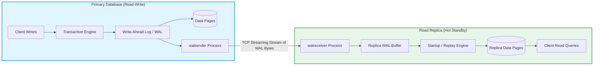
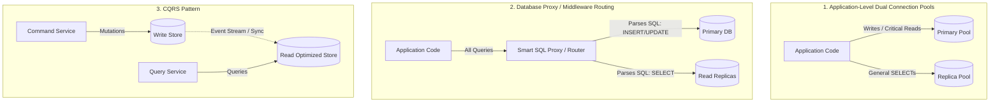
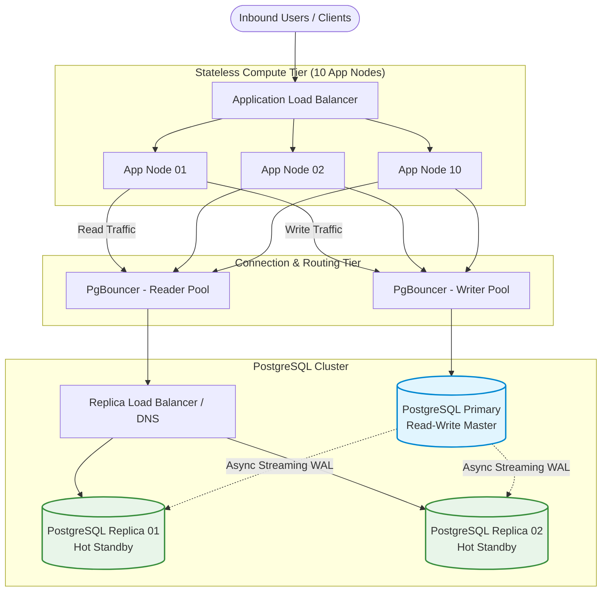
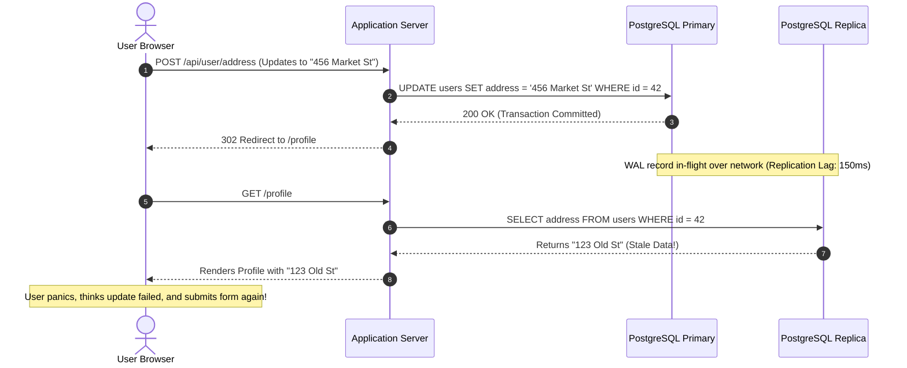

# Day 07 — Read Replicas: The First Escape Route

> 🔗 **LinkedIn Discussion**: [Read & Discuss on LinkedIn](https://www.linkedin.com/in/himanshu-verma-822a07286/)  
> 🏛️ **System Architecture Milestone**: [`v2-scaled-compute`](../../../system-evolution/v2-scaled-compute/README.md)

---

## The Problem

On Day 06, we addressed our database connection explosion by introducing PgBouncer in transaction pooling mode. Our 10 application instances (`app-01` through `app-10`) now multiplex thousands of inbound client connections into a bounded pool of 25 to 35 physical connections to PostgreSQL. Connection starvation errors disappeared, and connection overhead stabilized.

However, as **ShopScale**'s daily active users grow, database resource metrics degrade once again during peak shopping hours:

* **Primary DB CPU Utilization** sustains **90%–98%**, with frequent spikes to 100%.
* **Disk Read IOPS** are pinned at maximum provisioned capacity.
* **API P95 and P99 Latencies** climb steadily from **35ms** to **1,200ms+**, affecting every endpoint across the application.
* Crucial write transactions (such as order checkout and inventory reservations) begin queueing behind heavy query workloads.

When we inspect active queries using `pg_stat_activity` and analyze query logs, we uncover a stark asymmetry in our traffic:

$$\text{Total DB Workload} = 92\% \text{ Read Queries (SELECT)} + 8\% \text{ Write Queries (INSERT, UPDATE, DELETE)}$$

```text
                                [ 10 Application Nodes ]
                                           │
                                           │ (Multiplexed via PgBouncer)
                                           ▼
                       ┌───────────────────────────────────────┐
                       │        Single PostgreSQL Primary      │
                       ├───────────────────────────────────────┤
                       │  💥 92% Read Workload (CPU / IOPS)    │
                       │     • Catalog browsing & search       │
                       │     • Product detail pages            │
                       │     • User profile & reviews          │
                       ├───────────────────────────────────────┤
                       │  ⚠️  8% Write Workload                │
                       │     • Order placement & payments      │
                       │     • Inventory decrements            │
                       │     • Cart modifications              │
                       └───────────────────────────────────────┘
```

Even though PgBouncer keeps our connection count bounded, the **underlying compute, memory bandwidth, and disk I/O of our single database host are fundamentally overwhelmed** executing CPU-intensive `SELECT` statements (table joins, index scans, sorting, JSON serialization) right alongside our critical write transactions and Write-Ahead Log (WAL) flushes.

Our compute tier is distributed across 10 machines, but our entire read-and-write data processing still runs on a single physical machine.

---

## Why the Simple Approach Breaks

When a single database struggles under read-heavy traffic, teams frequently attempt three intuitive solutions. All three fall short under sustained scale.

```text
                     [ Read-Heavy Traffic Surge (92% Reads) ]
                                        │
                                        ▼
                       ┌─────────────────────────────────┐
                       │  Naive Fix: Scale DB Vertically │
                       │  (Upgrade 8 vCPU ➔ 32 vCPU)     │
                       └────────────────┬────────────────┘
                                        │
                                        ▼
                       ┌─────────────────────────────────┐
                       │ Diminishing Returns on Compute: │
                       │ • Exponential Cloud Cost        │
                       │ • Internal Engine Lock Contentions│
                       │ • Single Disk IOPS Ceiling      │
                       └────────────────┬────────────────┘
                                        │
                                        ▼
                       ┌─────────────────────────────────┐
                       │ Single Point of Failure Remains │
                       │ (One host crash = total outage) │
                       └─────────────────────────────────┘
```

### 1. Vertical Scaling (Bigger Instance) Hits a Diminishing-Returns Wall
Upgrading from an 8-vCPU / 32 GB RAM instance to a 32-vCPU / 128 GB RAM instance provides temporary relief, but costs scale exponentially while throughput gains plateau. 

Inside the database engine, scaling CPU cores increases internal latch and lock contention on shared memory structures (such as PostgreSQL's buffer pool and lock manager). Furthermore, you remain constrained by the maximum IOPS throughput of a single attached storage volume and the absolute physical limits of the largest cloud instance available.

### 2. In-Memory App-Level Caching (Without Distributed Coordination)
To protect the database, engineers often introduce local in-memory dictionaries or LRU caches directly inside the application process (`app-01` through `app-10`). 

With 10 distinct application nodes, this creates 10 isolated, uncoordinated caches:
* `app-01` serves a cached product price of $20.
* A seller updates the price to $25 on `app-02`.
* Users routed by the load balancer to `app-01`, `app-03`, or `app-04` continue to see and purchase at the stale $20 price until local process memory expires.
* Cache invalidation across multiple independent application processes without centralized coordination quickly devolves into state corruption.

### 3. Synchronous Multi-Master Replication
Teams sometimes evaluate multi-master synchronous clustering (where every node accepts reads and writes, and every write must commit on all nodes before returning success).

Synchronous replication turns every write into a distributed transaction governed by two-phase commit (2PC) or consensus protocols. The write latency of your system becomes bounded by the **slowest node's disk write and network round-trip time**. If any single node experiences network jitter or disk stall, write operations across the entire platform grind to a halt.

---

## Understanding the Problem

To scale a database tier beyond a single machine without sacrificing write safety, we must separate the responsibilities of **mutating state** from **querying state**.

---

### How Physical Streaming Replication Works

Modern relational databases (such as PostgreSQL and MySQL) rely on an append-only log to ensure durability: the **Write-Ahead Log (WAL)** in PostgreSQL, or the **Binary Log (Binlog)** in MySQL.

Before any transaction modifies table data on disk, the exact binary representation of that change is flushed sequentially to the WAL.



1. **The Primary Node** accepts all mutations (`INSERT`, `UPDATE`, `DELETE`, `DDL`). When a transaction commits, the primary flushes WAL records to disk and sends these records across a dedicated TCP connection via a background process (`walsender`).
2. **The Read Replica (Standby)** runs in read-only mode (`hot_standby = on`). Its background process (`walreceiver`) receives WAL bytes from the primary, buffers them, and a replay process continuously applies those changes sequentially to its local data files.
3. **Application Queries** route mutations exclusively to the Primary, while pure read queries (`SELECT`) can be distributed across one or more Read Replicas.

---

### Asynchronous vs. Synchronous Replication

The fundamental design decision in read replication is how the primary acknowledges commits:

| Replication Mode | Commit Flow | Write Latency | Replica Lag Risk | Data Loss Risk on Primary Crash |
|---|---|---|---|---|
| **Asynchronous (Standard)** | Primary writes WAL $\rightarrow$ Commits $\rightarrow$ Returns success to client. Replicas fetch WAL in background. | Lowest (Local disk write only) | Higher (Replicas can fall milliseconds to seconds behind) | Low to Medium (Unreplicated WAL records in-flight are lost) |
| **Synchronous** | Primary writes WAL $\rightarrow$ Transmits to replica $\rightarrow$ Waits for replica ACK $\rightarrow$ Commits $\rightarrow$ Returns to client. | Higher (Network RTT + Replica disk write) | Zero or near-zero on configured synchronous standbys | Near-Zero for acknowledged transactions |

```text
Asynchronous Commit Flow (Fast Writes, Eventual Consistency):
Client ──► Primary: COMMIT ──► Primary Disk (WAL Flush) ──► Client: 200 OK
                                        │
                                        └──(Async Network)──► Replica Replay

Synchronous Commit Flow (Slower Writes, Strict Consistency):
Client ──► Primary: COMMIT ──► Primary Disk
                                     │
                                     └──(Sync Network)──► Replica Disk (Flush)
                                                                 │
Client ◄── Primary: 200 OK ◄─────────────────────────────────────┘
```

Because read replicas are introduced primarily to scale query throughput, **asynchronous replication is the industry standard**. However, asynchronous replication immediately breaks the assumption of global instant consistency.

---

### The Inherent Challenge: Replication Lag

In an asynchronous setup, there is always a time delta $t_{\text{lag}}$ between when a write commits on the primary and when that change is replayed and visible on a replica:

$$t_{\text{visibility}} = t_{\text{primary commit}} + t_{\text{network transport}} + t_{\text{replica queue}} + t_{\text{replay execution}}$$

Under normal operating conditions on a low-latency local network, $t_{\text{lag}}$ is typically **5ms to 50ms**. 

However, when replication lag spikes (due to heavy write volume, network congestion, or long-running queries running on the replica), $t_{\text{lag}}$ can jump to **several seconds or even minutes**.

---

## Possible Approaches for Read/Write Routing

Introducing read replicas means application instances must decide where to send each SQL query. Three primary architectural patterns exist for routing queries.



---

### 1. Application-Level Dual Connection Pools (Multi-DataSource)

The application code explicitly configures two separate database connection pools: a **Writer Pool** pointing to the Primary, and a **Reader Pool** pointing to a load balancer in front of the Read Replicas.

```python
# Conceptual Application Routing
class DatabaseRouter:
    def __init__(self, write_pool, read_pool):
        self.writer = write_pool
        self.reader = read_pool

    def get_connection(self, is_write: bool = False):
        if is_write:
            return self.writer.acquire()
        return self.reader.acquire()
```

* **How It Works**: Developers or ORM middleware select the target connection pool based on the operation context (e.g., HTTP request method, repository method, or explicit transaction annotation).
* **Where It Helps**: Maximum flexibility and transparency. The application retains full control over routing decisions and can easily pin specific critical reads to the primary.
* **Limitations**: Requires application-level awareness. Developers can accidentally execute a heavy `SELECT` on the writer pool or a write operation on the reader pool (which throws a read-only transaction error).
* **When It Makes Sense**: Most monolithic and modular service architectures scaling from a single database to read replicas.

---

### 2. Database Proxy / Middleware Routing

A database-aware proxy (such as ProxySQL for MySQL, AWS RDS Aurora Reader Endpoint, or custom HAProxy SQL inspection) sits between the application and the database nodes.

* **How It Works**: The application maintains a single connection configuration to the proxy. The proxy parses inbound SQL queries on the fly: statements starting with `SELECT` are forwarded to replicas, while `INSERT`, `UPDATE`, `DELETE`, and `SELECT ... FOR UPDATE` are forwarded to the primary.
* **Where It Helps**: Zero modifications required in legacy application codebases.
* **Limitations**: 
  1. Transaction block ambiguity: Once a client issues `BEGIN`, all subsequent queries (even `SELECT`) must stay pinned to the primary until `COMMIT` to ensure transaction isolation.
  2. SQL parsing adds measurable CPU and latency overhead at the proxy layer.
  3. Session state mismatches (e.g., temporary tables, session variables) between primary and replica connections.
* **When It Makes Sense**: Legacy applications where modifying ORM configuration or codebase query routing is prohibitively expensive.

---

### 3. CQRS (Command Query Responsibility Segregation)

At a broader architectural level, write paths (Commands) and read paths (Queries) are split into completely independent application services and distinct data schemas.

* **How It Works**: The Command service writes to a normalized relational database. State changes trigger asynchronous domain events (via Kafka or CDC) that project denormalized read-optimized views into separate read databases (e.g., Elasticsearch, Read DBs, or Document Stores).
* **Where It Helps**: Massive scale where read and write query access patterns are fundamentally incompatible.
* **Limitations**: Extreme operational and cognitive complexity. Heavy eventual consistency throughout the entire system.
* **When It Makes Sense**: Large-scale distributed systems and microservices with high domain complexity and massive read-to-write disparities.

---

## Comparison of Approaches

| Approach | Routing Complexity | Dev Cognitive Load | Flexibility | Failure Blast Radius |
|---|---|---|---|---|
| **App-Level Multi-Pool** | Low to Medium | Medium (Explicit routing in code) | High (Can bypass replica per-query) | Isolated to misconfigured queries |
| **Database Smart Proxy** | Low (Handled by Infra) | Low | Low (Rigid heuristic rules) | Proxy configuration errors affect all queries |
| **CQRS Architecture** | High | High (Event-driven consistency models) | Extreme | Service-level isolation |

---

## Trade-offs: What We Gain and What We Give Up

Read replicas are not an automatic performance fix. They represent a fundamental transition from a single centralized state machine to a **distributed state system**.

```text
              Single Primary Database            Primary + Asynchronous Read Replicas
┌──────────────────────────────────────────────┐┌──────────────────────────────────────────────┐
│ • Strict Serial Consistency (ACID)           ││ • Eventual Consistency                       │
│ • Immediate Read-Your-Own-Writes Guarantee   ││ • Replication Lag Anomaly Risks              │
│ • Simple Single-Connection App Architecture  ││ • Dual-Pool / Multi-Target Routing Overhead  │
│ • Bounded Read & Write Throughput            ││ • Horizontal Scale for 90%+ Read Workloads   │
│ • Total Outage on Host Failure (SPOF)        ││ • High Availability (Read Path Survives)     │
└──────────────────────────────────────────────┘└──────────────────────────────────────────────┘
```

### What We Gain
1. **Horizontal Read Scalability**: We can add $N$ read replicas behind a read load balancer, multiplying our total `SELECT` query capacity linearly.
2. **Resource Isolation**: Analytical queries, reporting jobs, and catalog search scans run on dedicated replicas without consuming CPU, memory, or buffer cache space needed by checkout writes on the primary.
3. **Improved Fault Tolerance for Reads**: If the primary database crashes, read traffic can continue operating uninterrupted on the replicas while automated failover promotes a standby to become the new primary.

### What We Give Up
1. **Strong Consistency on Reads**: Replicas are always slightly behind the primary ($t_{\text{lag}}$). A query sent to a replica reflects the past state of the world, not necessarily the exact current state.
2. **The Read-After-Write Guarantee (Without Mitigation)**: If a user modifies data and the application immediately queries a replica on the subsequent page load, the user will see stale data.
3. **Monotonic Read Ordering**: If an application balances requests across Replica A (lag: 10ms) and Replica B (lag: 350ms), two consecutive `SELECT` queries by the same user can travel backward in time.
4. **Increased Infrastructure & Cost Overhead**: Multiple database hosts require continuous monitoring of replication lag, WAL disk storage, network bandwidth, and automated failover orchestration.

---

## A Practical Example: ShopScale Read/Write Separation

Let's walk through how **ShopScale** evolves its architecture to implement read replicas and solve the classic distributed state hazards.

---

### 1. Target Architecture with Read Replicas



---

### 2. The Read-After-Write Hazard (The Classic Bug)

Consider what happens when a user updates their account profile or places an order without read-after-write protection:



---

### 3. Mitigating Read-After-Write: The Replication Pinning Pattern

To guarantee **Read-Your-Own-Writes consistency** without sending all read traffic back to the primary, we implement a **Session Write Window (Pinning)** strategy:

1. When a user performs a write operation (`POST`, `PUT`, `DELETE`, `PATCH`), the server sets a short-lived signed cookie or header: `last_write_timestamp = now()`.
2. On subsequent `GET` requests, the application checks `last_write_timestamp`.
3. If the current request arrives within a configured safety window (e.g., $T_{\text{safety}} = 2 \text{ seconds}$) of the last write, the request is **pinned to the Primary database**.
4. Once the safety window elapses, the application resumes routing `GET` requests to the read replicas.

```python
import time
from fastapi import FastAPI, Request, Response, Depends
from sqlalchemy.orm import Session

app = FastAPI()

WRITE_SAFETY_WINDOW_SECONDS = 2.0

def get_db_session(request: Request) -> Session:
    """
    Intelligent Connection Router:
    Routes requests to Primary if:
    1. HTTP method is a mutation (POST, PUT, DELETE, PATCH)
    2. User recently wrote data within the last WRITE_SAFETY_WINDOW_SECONDS
    Otherwise, routes safely to the Read Replica pool.
    """
    now = time.time()
    last_write_str = request.cookies.get("last_write_ts")
    last_write_ts = float(last_write_str) if last_write_str else 0.0

    is_mutation = request.method in ["POST", "PUT", "DELETE", "PATCH"]
    is_within_write_window = (now - last_write_ts) < WRITE_SAFETY_WINDOW_SECONDS

    if is_mutation or is_within_write_window:
        # Route to Primary (Writer Pool)
        session = WriterSessionLocal()
        request.state.routed_to = "PRIMARY"
        return session
    else:
        # Route to Read Replica (Reader Pool)
        session = ReaderSessionLocal()
        request.state.routed_to = "REPLICA"
        return session

@app.post("/api/user/address")
def update_address(address_data: AddressUpdateSchema, response: Response, db: Session = Depends(get_db_session)):
    # 1. Mutation executes on Primary
    db.execute("UPDATE users SET address = :addr WHERE id = :uid", {"addr": address_data.address, "uid": 42})
    db.commit()

    # 2. Stamp client with write timestamp to enforce Read-Your-Own-Writes
    response.set_cookie(
        key="last_write_ts",
        value=str(time.time()),
        max_age=5,
        httponly=True,
        samesite="lax"
    )
    return {"status": "success", "message": "Address updated"}

@app.get("/api/user/profile")
def get_profile(request: Request, db: Session = Depends(get_db_session)):
    # If called immediately after update_address, this automatically hits PRIMARY.
    # After 2 seconds, subsequent calls hit REPLICA.
    user = db.execute("SELECT id, name, address FROM users WHERE id = 42").fetchone()
    return {"user": dict(user), "served_by": request.state.routed_to}
```

---

### 4. PostgreSQL Streaming Replication Configuration

To establish physical streaming replication between Primary and Standby instances:

#### Primary `postgresql.conf`:
```ini
# Network and connection listening
listen_addresses = '*'
port = 5432

# Replication settings
wal_level = replica             # Generates WAL records sufficient for standby read queries
max_wal_senders = 10            # Maximum simultaneous background WAL streaming processes
max_replication_slots = 10      # Prevent primary from deleting WAL segments before replica receives them
wal_keep_size = 4096MB          # Maintain at least 4GB of WAL history for lagging replicas
```

#### Primary `pg_hba.conf`:
```text
# Allow standby nodes on the internal VPC subnet to connect for replication streaming
host  replication  replicator  10.0.2.0/24  scram-sha-256
```

#### Replica `postgresql.conf`:
```ini
# Enable Hot Standby to accept read-only queries while replaying WAL
hot_standby = on

# Control query cancellation when a WAL replay conflicts with a running SELECT query
max_standby_streaming_delay = 30s
hot_standby_feedback = on       # Informs primary of replica's active transactions to prevent vacuum conflicts
```

---

## Failure Scenarios

Operating a replicated database tier introduces failure modes that do not exist on a single database host.

```text
                                [ Primary DB ]
                                       │
                         ┌─────────────┴─────────────┐
                         │ (Streaming WAL)           │
                         ▼                           ▼
                ┌─────────────────┐         ┌─────────────────┐
                │ Read Replica 01 │         │ Read Replica 02 │
                └────────┬────────┘         └────────┬────────┘
                         │                           │
                   [ 💥 DIES ]                 [ 💥 OVERLOADS ]
                         │                           │
                         └─────────────┬─────────────┘
                                       │
                                       ▼
                         ┌───────────────────────────┐
                         │ Cascading Traffic Shift   │
                         │ ➔ All Reads Surge to Primary│
                         │ ➔ Primary DB CPU Hits 100%│
                         │ ➔ COMPLETE SYSTEM OUTAGE  │
                         └───────────────────────────┘
```

---

### 1. Replication Lag Spikes from Long-Running Replica Queries

When a heavy analytical or reporting query executes on a read replica (e.g., aggregating 6 months of sales data), it holds table snapshots open.

If the primary sends a WAL update that alters or vacuums data pages needed by that active query:
* The replica must choose: cancel the client's running query, or pause WAL replay until the query finishes.
* With `max_standby_streaming_delay = 30s`, the replica pauses WAL replay for up to 30 seconds.
* During these 30 seconds, **replication lag spikes**. Every other user query routed to this replica receives data that is 30 seconds out of date.

```text
Mitigation:
1. Isolate analytical/BI queries to a dedicated reporting replica that is completely removed 
   from the user-facing web traffic pool.
2. Set strict statement timeouts on customer-facing read replicas (e.g., statement_timeout = '2000ms').
```

---

### 2. Replica Node Failure and Cascading Overload

If you operate with 2 read replicas splitting 90% of total system read traffic:
1. Replica 01 crashes due to an underlying cloud hardware failure.
2. The replica load balancer immediately diverts 100% of read traffic to the single remaining Replica 02.
3. Replica 02 experiences a 2x traffic surge, maxing out its CPU and disk IOPS, and crashes.
4. With all replicas dead, application health checks or fallback rules divert all read traffic back to the **Primary Database**.
5. The primary—already handling 100% of write traffic—is hit with an unmanageable wave of read queries, triggering total database collapse.

```text
Mitigation:
1. N+1 Redundancy: Size replica clusters so that remaining nodes can sustain peak traffic 
   if one node fails (e.g., 3 replicas running at 50% capacity rather than 2 at 90%).
2. Graceful Degradation / Circuit Breaking: If replicas fail, shed non-critical read traffic 
   (e.g., recommendations, review widgets) rather than forwarding raw overload to the primary.
```

---

### 3. The "Time Travel" Monotonic Read Anomaly

If an application round-robins read requests across two replicas with unequal lag:
* **Replica 01** has $t_{\text{lag}} = 10\text{ms}$.
* **Replica 02** has $t_{\text{lag}} = 1,500\text{ms}$ (due to temporary disk I/O pressure).

A user viewing an auction or live inventory refreshes their browser twice:
* **Request 1** hits Replica 01: User sees current bid is **$150**.
* **Request 2** hits Replica 02: User sees current bid is **$120**.

From the user's perspective, the application state visibly jumped backward in time.

```text
Mitigation:
1. Sticky Replica Sessions: Hash user sessions (e.g., cookie or user_id) to the same replica node 
   to ensure monotonically progressing views of state.
2. LSN / Replication Token Tracking: Track the latest Log Sequence Number (LSN) observed by the client 
   and ensure the target replica has replayed at least up to that LSN before serving the read.
```

---

### 4. Primary Crash & Asynchronous Data Loss on Failover

If the Primary database server suffers a catastrophic power loss or hardware fault while running asynchronous replication:
* Transactions committed on the primary in the last 50ms may still be in transit across the network and never reached any standby replica.
* High-availability tooling (such as Patroni or AWS RDS Multi-AZ) detects the primary failure and promotes the most up-to-date replica to become the new primary.
* Any transaction that was acknowledged to a client in that 50ms window is **permanently lost** (a recovery point objective or RPO $> 0$).

```text
Mitigation:
1. For mission-critical financial transactions, use Synchronous Standby replication 
   (synchronous_commit = on) with at least one local synchronous replica.
2. For high-volume standard web traffic, design application workflows to be idempotent 
   and capable of resynchronizing lost state.
```

---

## Key Engineering Decisions

When scaling database reads through replication, evaluate your architecture against these core decisions:

```text
                          ┌──────────────────────────────┐
                          │  Need to Scale Read Traffic? │
                          └──────────────┬───────────────┘
                                         │
                                         ▼
                          ┌──────────────────────────────┐
                          │  Can the domain tolerate     │
                          │  50ms - 2s of data staleness?│
                          └──────┬───────────────┬───────┘
                                 │               │
                        NO       │               │       YES
                ┌────────────────┘               └────────────────┐
                ▼                                                 ▼
┌────────────────────────────────┐               ┌────────────────────────────────┐
│ Keep Reads on Primary OR       │               │ Route to Asynchronous Replicas│
│ Use Synchronous Replication    │               │ with Read-After-Write Pinning  │
├────────────────────────────────┤               ├────────────────────────────────┤
│ • Checkout inventory locking   │               │ • Product catalog browsing     │
│ • Account balance verification │               │ • User reviews & ratings       │
│ • Authentication & password chg│               │ • Content feeds & search       │
└────────────────────────────────┘               └────────────────────────────────┘
```

1. **Classify Query Staleness Tolerance**: Audit every major endpoint. Never treat all queries equally. Separate queries that require strict linearizability (e.g., balance updates, inventory reservation) from queries that tolerate eventual consistency (e.g., catalog search, user reviews, public profiles).
2. **Implement Read-After-Write Pinning from Day One**: Do not launch read replicas without a mechanism (such as session write cookies or LSN tracking) to route users back to the primary immediately following a mutation.
3. **Monitor Lag by Bytes and Time**: Do not rely solely on node CPU metrics. Alert aggressively on `pg_stat_replication.replay_lag` (time delta) and WAL byte lag (`pg_wal_lsn_diff`).
4. **Automate Lag-Based Replica Eviction**: Configure your replica load balancer to automatically drop any replica whose lag exceeds a defined threshold (e.g., $> 2.0\text{s}$), preventing it from serving excessively stale data to users.

---

## Key Takeaways

1. **Read replicas scale query throughput, not write throughput.** Adding replicas allows you to distribute read load across $N$ machines, freeing the primary host to handle mutations.
2. **Asynchronous replication is an explicit trade-off.** You trade immediate global consistency for high write performance and horizontal read scalability.
3. **Replicas introduce distributed state hazards.** Replication lag, read-after-write inconsistencies, and monotonic read violations require deliberate application-level and routing-level mitigations.
4. **Replicas are not a magic fix for poor query performance.** An unindexed query that scans 10 million rows will overwhelm a read replica just as easily as it overwhelms the primary. Index optimization remains the prerequisite for database scalability.

---

### ⏭️ Next Step
* Read the next guide: **[Day 08 — Caching: Easy Until It's Not](../day-08-caching-easy-until-not/README.md)**
* View the updated architecture milestone: [`v2-scaled-compute`](../../../system-evolution/v2-scaled-compute/README.md)
