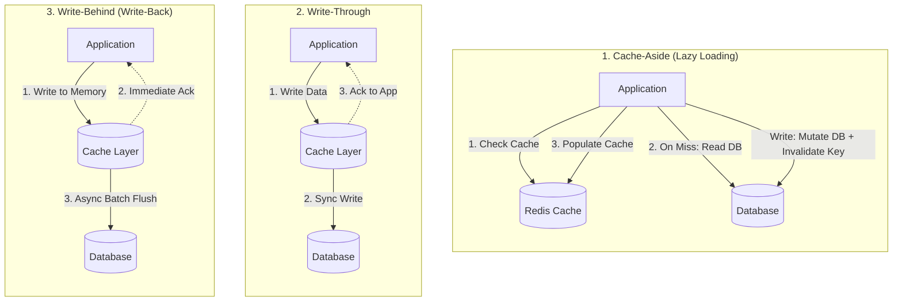
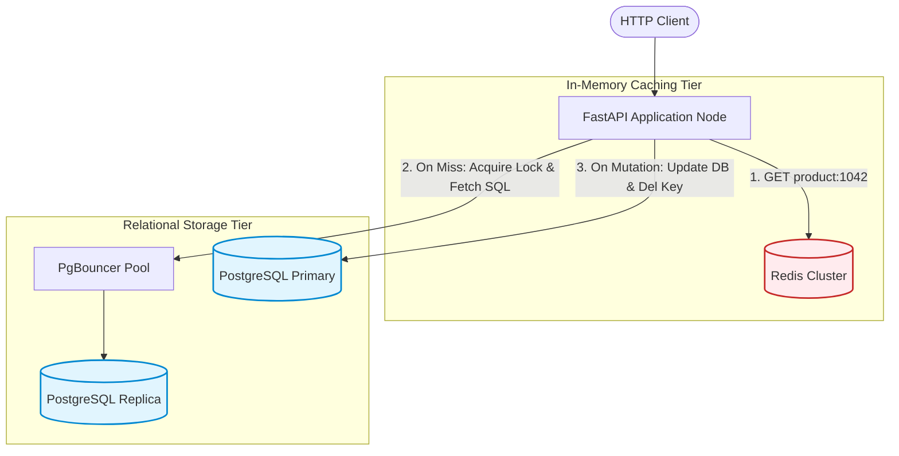
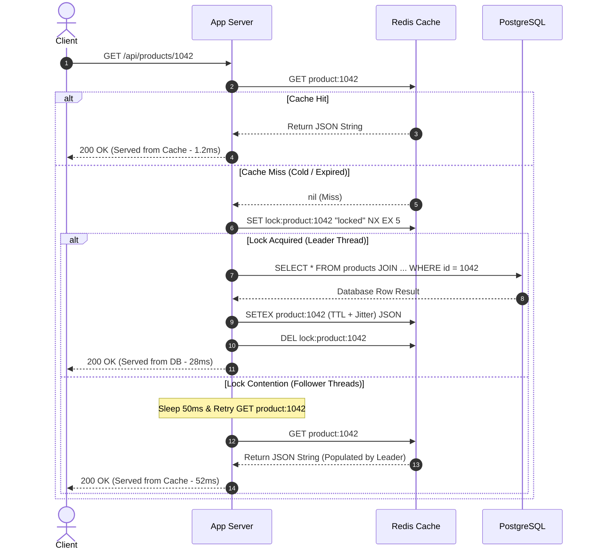
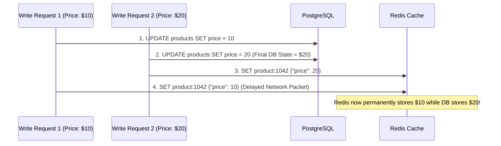

# Day 08 — Caching Is Easy Until It Isn't

> 🔗 **LinkedIn Discussion**: [Read & Discuss on LinkedIn](https://www.linkedin.com/in/himanshu-verma-822a07286/)  
> 🏛️ **System Architecture Milestone**: [`v3-cached-data`](../../../system-evolution/v3-cached-data/README.md)

---

## The Problem

On Day 07, we scaled **ShopScale**'s read capacity by introducing PostgreSQL read replicas with PgBouncer connection pooling. By routing analytical and general catalog queries to replica nodes, we relieved the primary database from read pressure and stabilized write operations.

However, during a seasonal promotional campaign, our system metrics degrade once again:

* **Top 100 Flash Sale Products** account for **85% of all catalog queries**. 
* Even with 4 read replicas distributing traffic, each replica's CPU sits pinned at **88%–95%**.
* Every single product view executes the same query:
  ```sql
  SELECT p.id, p.title, p.price, p.description, i.stock_quantity, b.brand_name
  FROM products p
  JOIN inventory i ON p.id = i.product_id
  JOIN brands b ON p.brand_id = b.id
  WHERE p.id = 1042 AND p.is_active = true;
  ```
* Under 40,000 requests per second, the database cluster executes identical index traversals, joins, buffer pool scans, and row-to-wire serializations **40,000 times every second for the exact same static data**.
* **P99 Read Latency** creeps from **12ms** up to **450ms** due to buffer pool lock contention and disk I/O queueing on the replicas.

```text
               40,000 req/sec for the SAME 100 Products
                                  │
                                  ▼
        ┌───────────────────────────────────────────────────┐
        │       10 Application Nodes (Stateless Web)        │
        └─────────────────────────┬─────────────────────────┘
                                  │
                    ┌─────────────┴─────────────┐
                    │ (Repeated SQL Execution)  │
                    ▼                           ▼
        ┌───────────────────────┐   ┌───────────────────────┐
        │  Read Replica 01      │   │  Read Replica 02      │
        │  💥 High CPU (Joins)  │   │  💥 High CPU (Joins)  │
        │  💥 Buffer Contention │   │  💥 Buffer Contention │
        └───────────────────────┘   └───────────────────────┘
```

The database is an engine designed for **arbitrary queries, transactional ACID safety, and relational integrity**. Using it as a repetitive key-value lookup engine for immutable or rarely-changing data is an inefficient use of database CPU and I/O capacity.

We need a dedicated, in-memory caching tier to intercept read traffic before it ever touches our database engine.

---

## Why the Simple Approach Breaks

The initial impulse for most engineering teams is to treat caching as a simple key-value store: *"Before querying SQL, check if the data is in Redis. If not, fetch SQL and set Redis with an arbitrary TTL."*

Under high concurrency and production scale, this naive mental model collapses in several distinct ways.

```text
                      [ High Concurrency Traffic ]
                                   │
                                   ▼
        ┌─────────────────────────────────────────────────────┐
        │  Naive Fix: "Just put Redis in front of the DB"     │
        └──────────────────────────┬──────────────────────────┘
                                   │
        ┌──────────────────────────┼──────────────────────────┐
        ▼                          ▼                          ▼
┌──────────────────┐      ┌──────────────────┐      ┌──────────────────┐
│ Stale Data Bugs  │      │ Memory Exhaustion│      │ Cache Stampede   │
│ DB updated, but  │      │ Keys stored with │      │ Hot key expires, │
│ cache retains old│      │ infinite TTL fill│      │ 5,000 requests   │
│ price/inventory  │      │ all RAM (OOM)    │      │ hammer DB at once│
└──────────────────┘      └──────────────────┘      └──────────────────┘
```

### 1. In-Memory Process-Local Caching Causes State Divergence
Placing an in-memory dictionary or LRU cache inside application process memory (e.g., Python `lru_cache` or Go `sync.Map`) creates isolated islands of state across our 10 application nodes:
* `app-01` caches Product #1042 at **$29.99**.
* A merchant updates the price to **$19.99** on `app-03`.
* Users routed to `app-01` see and attempt to purchase the product at $29.99, while users routed to `app-03` see $19.99.
* Deploying a new release or restarting a node instantly wipes the local cache, sending a synchronized wave of un-cached requests to the database (Cold Start Surge).

### 2. Blind Key Updates Cause Race Conditions (The Dual-Write Hazard)
When an entity is updated in the database, teams often attempt to update the cache simultaneously:
1. Process A writes new value $V_1$ to PostgreSQL.
2. Process B writes newer value $V_2$ to PostgreSQL.
3. Due to network jitter or scheduling delays, Process B writes $V_2$ to Redis first.
4. Process A writes $V_1$ to Redis second.
5. **Result**: The database permanently contains $V_2$, while the cache permanently serves the obsolete value $V_1$. The cache is permanently poisoned until manual intervention.

### 3. Key Expiration Triggers Cache Stampede (Thundering Herd)
Setting a Time-To-Live (TTL) ensures stale data eventually disappears. However, when a high-traffic key (e.g., 5,000 req/sec) expires:
1. At timestamp $T_0$, the key expires in Redis.
2. In the next 10 milliseconds, 50 concurrent incoming requests observe a cache miss.
3. All 50 application threads simultaneously issue the expensive SQL query with joins to the database.
4. All 50 threads simultaneously attempt to write the result back to Redis.
5. Under high traffic, this sudden surge spikes database CPU to 100%, causing query timeouts and cascading failures across the entire system.

---

## Understanding the Problem

To build a reliable caching layer, we must understand the core mechanics of cache access patterns, invalidation strategies, and concurrency boundaries.

---

### The Fundamental Trade-off of Caching

Caching is not an optimization without cost. When you introduce a cache, you are creating a **distributed dual-state system**:

$$\text{System State} = \text{Database (Source of Truth)} + \text{Cache (Derived Transient Replica)}$$

Every cache architecture must balance three competing requirements:

```text
                       Data Freshness (Consistency)
                                  ▲
                                 / \
                                /   \
                               /     \
                              /       \
                             /         \
                            /           \
  Low Read Latency ◄───────────────────────► High Write Throughput
   (Fast Cache Hits)                         (Simple DB Mutations)
```

1. **Read Latency & Throughput**: Serving queries from in-memory data structures (sub-millisecond) versus disk-backed relational engines (5ms–50ms).
2. **Data Consistency & Freshness**: How closely the cached representation reflects the canonical source of truth at any given point in time.
3. **Operational Complexity**: Managing dual writes, serialization formats, cache eviction policies, and failure failovers.

---

### Cache Invalidation vs. Cache Expiration

There are only two fundamental ways data leaves a cache:

| Mechanism | Definition | Primary Use Case | Risk / Limitation |
|---|---|---|---|
| **Passive Expiration (TTL)** | The cache engine evicts or marks the key expired after a set duration $T$. | Upper bound on staleness; cleanup of abandoned keys (e.g., abandoned carts). | Data remains stale for the entire duration of $T$ if mutated before expiration. |
| **Active Invalidation (Eviction on Write)** | The application or event worker explicitly deletes or updates the key when the source of truth changes. | Critical business entities where updates must be reflected immediately (e.g., price change). | Dual-write failures or race conditions can leave stale keys indefinitely if not paired with a safety TTL. |

> [!IMPORTANT]
> **Rule of Thumb**: Active Invalidation provides freshness. Passive TTL provides a safety net against leaked or orphaned keys. **Production caching requires both.**

---

## Possible Approaches

Let's evaluate the primary caching design patterns used in distributed systems.



---

### 1. Cache-Aside (Lazy Loading / Read-Through)

The application code explicitly orchestrates interactions between the cache and the database.

#### How It Works:
* **Read Path**:
  1. The application checks the cache for key $K$.
  2. If cache hits, return the value immediately.
  3. If cache misses, fetch the raw record from the database.
  4. Serialize and store the record in the cache with a configured TTL.
  5. Return the value to the client.
* **Write Path**:
  1. Mutate the database record (Primary source of truth).
  2. **Delete (invalidate)** the cache key from Redis.
  3. Do *not* update the cache inline; let the next read repopulate it lazily.

#### Where It Helps:
* **Resilience**: If the cache cluster fails, queries can fall back directly to the database (with appropriate rate-limiting).
* **Resource Efficiency**: Only requested data is cached. Seldom-queried products never occupy expensive cache memory.
* **Schema Decoupling**: Cached objects can store pre-computed, denormalized API responses directly matching client needs.

#### Limitations:
* **Cold Read Penalty**: The very first request for an item always incurs the latency of a cache miss plus the round-trip write to Redis.
* **Staleness Window**: If an external process modifies the database directly without invalidating the cache, stale data persists until the TTL expires.

#### When It Makes Sense:
* The standard, default choice for read-heavy web applications with unpredictable or long-tail query patterns.

---

### 2. Write-Through Caching

The cache acts as the main data store interface. The application writes directly to the cache, and the cache synchronously writes to the underlying database before confirming success.

#### How It Works:
1. Application issues a write request to the cache interface.
2. The cache interceptor immediately writes the data to the relational database.
3. Once the database confirms the write, the cache updates its internal in-memory key.
4. The cache returns success to the application.

#### Where It Helps:
* Guarantees that data in the cache is never stale relative to the database.
* Simplifies application logic by presenting a single unified data access layer.

#### Limitations:
* **High Write Latency**: Every write suffers from two network round-trips (App $\rightarrow$ Cache $\rightarrow$ DB).
* **Memory Waste**: Every written record is cached, even if it is never read again (polluting the cache with short-lived or low-utility data).

#### When It Makes Sense:
* Workloads where written data is immediately and repeatedly read back (e.g., user session initialization, active player profiles in gaming).

---

### 3. Write-Behind (Write-Back) Caching

The application writes data exclusively to the in-memory cache, which acknowledges the operation immediately. The cache layer asynchronously flushes batches of dirty entries to the database in the background.

#### How It Works:
1. Application writes data to Redis / in-memory store.
2. Cache marks the entry as "dirty" and immediately returns HTTP 200 OK.
3. A background daemon or queue worker pools dirty records and executes bulk `INSERT`/`UPDATE` operations against the database every $N$ seconds or $M$ operations.

#### Where It Helps:
* **Extreme Write Throughput**: Absorbs massive write spikes (e.g., high-frequency view counters, IoT telemetry, real-time analytics).
* **Reduced Database Load**: Multiple updates to the same record within a flush interval are collapsed into a single database write.

#### Limitations:
* **Risk of Permanent Data Loss**: If the caching node crashes or loses power before flushing dirty records to persistent storage, those writes are lost permanently.
* **Consistency Lag**: The database is continuously out of sync with the cache.

#### When It Makes Sense:
* High-volume counters, video view counts, click tracking, and non-financial metrics where speed outweighs durability.

---

## Comparison of Caching Strategies

| Criterion | Cache-Aside (Lazy) | Write-Through | Write-Behind (Write-Back) |
|---|---|---|---|
| **Read Latency** | Low on Hit / High on Miss | Always Low | Always Low |
| **Write Latency** | Low (DB write + Key Del) | High (Sync DB + Cache write) | Extremely Low (Memory only) |
| **Data Freshness** | Eventual (Bounded by TTL / Del) | Strict / Immediate | Cache is ahead of DB |
| **Data Loss Risk** | Zero (DB is source of truth) | Zero | **High** (If cache fails before sync) |
| **Cache Memory Utilization** | Optimal (Only hot data cached) | Suboptimal (All writes cached) | Suboptimal |
| **Implementation Complexity** | Low to Medium | Medium | High |

---

## Trade-offs: What We Gain and What We Give Up

```text
               Direct Database Queries                     Database + Redis Cache Layer
┌───────────────────────────────────────────────────┐┌───────────────────────────────────────────────────┐
│ • Single Source of Truth                          ││ • Distributed Dual-State Architecture             │
│ • Strong ACID Consistency                         ││ • Eventual Consistency Staleness Hazards         │
│ • Bounded Read Throughput (Disk/Engine Bound)     ││ • In-Memory Read Throughput (100k+ ops/sec/node)  │
│ • High Latency Under Heavy Joins (15ms - 200ms)   ││ • Sub-Millisecond Read Latency (0.5ms - 2ms)      │
│ • Zero Cache Invalidation Logic Required          ││ • Complex Invalidation & Stampede Safeguards      │
└───────────────────────────────────────────────────┘└───────────────────────────────────────────────────┘
```

### What We Gain:
1. **Sub-Millisecond Read Latency**: Querying pre-serialized data structures from RAM drops API response times from tens of milliseconds to sub-millisecond territory.
2. **Massive Database Offloading**: A 95% cache hit ratio reduces database read traffic by a factor of 20, allowing our existing primary and replicas to handle vastly more traffic without upgrading instance sizes.
3. **Protection Against Complex Query Overhead**: Multi-table joins and aggregation queries are computed once and reused thousands of times.

### What We Give Up:
1. **Consistency Guarantees**: Any caching architecture introduces windows of staleness. You must design client applications to tolerate slightly outdated data.
2. **Operational Overhead**: A caching cluster (Redis/Memcached) requires dedicated monitoring for memory usage, eviction rates, connection limits, replication, and failover mechanics.
3. **Code Complexity & Dual-Write Bugs**: Developers must carefully maintain invalidation logic alongside every single database mutation path.

---

## A Practical Example: ShopScale Product Catalog Caching

Let's implement a resilient, production-grade Cache-Aside layer for **ShopScale** using Redis, featuring:
1. **Active Invalidation on Write** (Delete key on mutation).
2. **Safety TTL with Jitter** (Preventing synchronized expiration).
3. **Distributed Mutex Lock** (Eliminating Cache Stampede / Thundering Herd).
4. **Graceful Degradation / Fail-Open** (If Redis goes down, requests continue working by hitting the DB).

---

### Architecture Overview



---

### Sequence: Cache-Aside with Stampede Protection



---

### Production Implementation (Python / FastAPI / Redis)

```python
import json
import random
import time
import uuid
import logging
from typing import Optional, Generator
import redis
from fastapi import FastAPI, HTTPException, Depends
from pydantic import BaseModel
from sqlalchemy import text
from sqlalchemy.orm import Session, sessionmaker
from sqlalchemy import create_engine

logger = logging.getLogger("shopscale.cache")

app = FastAPI()

# Pydantic schema for input validation
class ProductUpdateSchema(BaseModel):
    title: str
    price: float


# Redis client configuration with strict connection & socket timeouts
redis_client = redis.Redis(
    host="redis.internal.shopscale.net",
    port=6379,
    db=0,
    socket_timeout=0.25,        # 250ms socket read/write timeout (fail-fast)
    socket_connect_timeout=0.5, # 500ms initial connection timeout
    decode_responses=True
)

# Canonical Lua script for safe distributed lock release (releases only if token matches)
RELEASE_LOCK_LUA = """
if redis.call("get", KEYS[1]) == ARGV[1] then
    return redis.call("del", KEYS[1])
else
    return 0
end
"""

BASE_TTL_SECONDS = 300          # 5 minutes
JITTER_MAX_SECONDS = 60         # Up to 60s random jitter
LOCK_TIMEOUT_SECONDS = 5        # Lock held max 5 seconds before safety auto-expiry


def get_ttl_with_jitter(base_ttl: int = BASE_TTL_SECONDS, jitter_max: int = JITTER_MAX_SECONDS) -> int:
    """Add pseudo-random jitter to base TTL to prevent synchronized key expiration (Cache Avalanche)."""
    return base_ttl + random.randint(0, jitter_max)


def get_product_from_cache(product_id: int) -> Optional[dict]:
    """Graceful Cache Read: Returns None if Redis is down, slow, or key is missing."""
    try:
        raw_data = redis_client.get(f"product:{product_id}")
        if raw_data:
            return json.loads(raw_data)
    except (redis.ConnectionError, redis.TimeoutError) as err:
        logger.warning(f"Redis unavailable during read, degrading to DB: {err}")
    return None


def set_product_in_cache(product_id: int, data: dict) -> None:
    """Graceful Cache Write: Sets serialized JSON with randomized TTL."""
    try:
        ttl = get_ttl_with_jitter()
        redis_client.setex(
            name=f"product:{product_id}",
            time=ttl,
            value=json.dumps(data)
        )
    except (redis.ConnectionError, redis.TimeoutError) as err:
        logger.warning(f"Failed to populate Redis cache: {err}")


def invalidate_product_cache(product_id: int) -> None:
    """
    Active Invalidation: Always DELETE the key upon mutation.
    Never SET the key directly in write paths to avoid race conditions.
    """
    try:
        redis_client.delete(f"product:{product_id}")
    except (redis.ConnectionError, redis.TimeoutError) as err:
        logger.error(f"Failed to invalidate cache key for product {product_id}: {err}")


@app.get("/api/products/{product_id}")
def get_product(product_id: int, db: Session = Depends(get_db_session)):
    # Step 1: Check Cache (Fast path: ~1ms)
    cached_payload = get_product_from_cache(product_id)
    if cached_payload:
        if cached_payload.get("_empty_sentinel"):
            raise HTTPException(status_code=404, detail="Product not found")
        return {"data": cached_payload, "source": "cache"}

    # Step 2: Cache Miss -> Stampede Guard with a Distributed Mutex Lock
    lock_key = f"lock:product:{product_id}"
    lock_token = str(uuid.uuid4())  # Unique owner identifier for safe release
    lock_acquired = False
    
    try:
        # SET NX EX: Only acquire if key doesn't exist, automatically expiring after 5s
        lock_acquired = bool(redis_client.set(lock_key, lock_token, nx=True, ex=LOCK_TIMEOUT_SECONDS))
    except Exception:
        lock_acquired = False  # If Redis lock fails, fail-open directly to DB

    if lock_acquired:
        try:
            # Winner thread: Query PostgreSQL and populate cache for everyone
            product_record = db.execute(
                text(
                    "SELECT p.id, p.title, p.price, p.description, i.stock_quantity "
                    "FROM products p JOIN inventory i ON p.id = i.product_id "
                    "WHERE p.id = :pid AND p.is_active = true"
                ),
                {"pid": product_id}
            ).mappings().fetchone()

            if not product_record:
                # Prevent Cache Penetration: Cache negative lookup sentinel with short TTL (30s)
                redis_client.setex(f"product:{product_id}", 30, json.dumps({"_empty_sentinel": True}))
                raise HTTPException(status_code=404, detail="Product not found")

            payload = dict(product_record)
            set_product_in_cache(product_id, payload)
            return {"data": payload, "source": "database"}
        finally:
            # Safe lock release using Lua script (only delete if lock_token matches)
            try:
                redis_client.eval(RELEASE_LOCK_LUA, 1, lock_key, lock_token)
            except Exception:
                pass
    else:
        # Follower threads: Wait and poll cache briefly instead of all slamming the DB
        for _ in range(4):
            time.sleep(0.05)  # Backoff 50ms
            retry_cached = get_product_from_cache(product_id)
            if retry_cached:
                if retry_cached.get("_empty_sentinel"):
                    raise HTTPException(status_code=404, detail="Product not found")
                return {"data": retry_cached, "source": "cache_after_wait"}

        # Fallback if leader thread timed out or failed: Read from DB directly
        product_record = db.execute(
            text(
                "SELECT p.id, p.title, p.price, p.description, i.stock_quantity "
                "FROM products p JOIN inventory i ON p.id = i.product_id "
                "WHERE p.id = :pid AND p.is_active = true"
            ),
            {"pid": product_id}
        ).mappings().fetchone()
        
        if not product_record:
            raise HTTPException(status_code=404, detail="Product not found")
        return {"data": dict(product_record), "source": "database_fallback"}


@app.put("/api/products/{product_id}")
def update_product(product_id: int, update_data: ProductUpdateSchema, db: Session = Depends(get_db_session)):
    # 1. Update source of truth in PostgreSQL Primary FIRST
    db.execute(
        text("UPDATE products SET price = :price, title = :title WHERE id = :pid"),
        {"price": update_data.price, "title": update_data.title, "pid": product_id}
    )
    db.commit()

    # 2. Active Invalidation: Delete the cached key AFTER database commit succeeds
    # If done before commit, a concurrent read could re-cache stale data from the uncommitted DB state!
    invalidate_product_cache(product_id)

    return {"status": "success", "message": "Product updated and cache invalidated"}
```

---

## Failure Scenarios

Operating an in-memory caching tier introduces failure modes that can severely degrade system health if not proactively defended against.

```text
                                [ Heavy User Traffic ]
                                          │
                    ┌─────────────────────┼─────────────────────┐
                    ▼                     ▼                     ▼
         ┌───────────────────┐ ┌───────────────────┐ ┌───────────────────┐
         │ 1. Cache Stampede │ │ 2. Cache Avalanche│ │ 3. Cache         │
         │ Hot key expires;  │ │ Millions of keys  │ │    Penetration    │
         │ 5,000 reqs slam   │ │ expire at same sec│ │ Attackers query   │
         │ DB simultaneously │ │ ➔ DB overload wave│ │ non-existent IDs │
         └───────────────────┘ └───────────────────┘ └───────────────────┘
```

---

### 1. Cache Stampede (Thundering Herd)
* **What Happens**: A hot product key (e.g., iPhone launch page receiving 10,000 req/sec) expires or is invalidated. In the 100ms window before the cache is repopulated, 1,000 concurrent application threads miss the cache and simultaneously issue the expensive join query to the database.
* **Impact**: Database CPU spikes to 100%, connection pools exhaust, and API requests time out.
* **Mitigation**:
  1. **Distributed Mutex (Locking)**: As demonstrated in our code example, only the first thread acquires a lock to query the DB and update Redis. Remaining threads wait or return a fallback.
  2. **Probabilistic Early Expiration (XFetch Algorithm)**: As a key nears its expiration time, background threads calculate a probability function based on read delta and recompute the cache value *before* the key officially expires.
  3. **Stale-While-Revalidate**: Serve the slightly stale cached value to clients while a single asynchronous background worker refreshes the cache from the database.

---

### 2. Cache Avalanche (Synchronized Expiration)
* **What Happens**: The application pre-warms its cache or bulk-imports 500,000 products at 02:00 AM with a fixed TTL of exactly `3600 seconds` (1 hour). At exactly 03:00:00 AM, all 500,000 keys expire simultaneously.
* **Impact**: An instantaneous wall of cache misses hits the database, overwhelming replicas and crashing the storage tier.
* **Mitigation**:
  * **TTL Jitter**: Never use deterministic TTLs. Add a random variation to every key:
    $$\text{Actual TTL} = \text{Base TTL} + \text{UniformRandom}(0, \text{JitterMax})$$

---

### 3. Cache Penetration (Non-Existent Keys)
* **What Happens**: Malicious clients or crawlers issue thousands of requests for non-existent product IDs (e.g., `GET /api/products/-9999` or random UUIDs). Because these IDs do not exist in the database, normal caching logic never writes anything to Redis. Every single request bypasses the cache and forces a full database table/index scan.
* **Impact**: The caching layer provides zero protection; the database bears 100% of the query load.
* **Mitigation**:
  1. **Cache Null / Sentinel Values**: If the DB returns "Not Found", store `{"empty": true}` in Redis with a short TTL (e.g., 30–60 seconds).
  2. **Bloom Filters**: Place a space-efficient Bloom Filter in front of the cache. If the Bloom filter determines the ID does not exist, reject the request immediately without querying Redis or PostgreSQL.

---

### 4. The Dual-Write Race Condition (Set vs. Delete)
* **What Happens**: Two concurrent updates occur on the same record. Developer code uses `redis.set()` inside the write endpoint instead of `redis.delete()`:



* **Impact**: The cache permanently serves corrupt, outdated data until the key expires.
* **Mitigation**:
  * **Always Invalidate (`DEL`), Never Mutate (`SET`) on Write**: If you delete the key on write, the next read will fetch the latest committed state from the database.

---

### 5. Redis Outage & Cascading Failures
* **What Happens**: The Redis caching cluster suffers a network partition or hardware crash. If application code treats Redis calls synchronously without timeouts or error handling, every web worker blocks waiting for TCP timeouts.
* **Impact**: Thread exhaustion on application nodes, total API outage across the entire platform.
* **Mitigation**:
  1. **Fail-Open Design**: Wrap all Redis operations in `try/except` blocks with strict socket timeouts ($\le 250\text{ms}$). If Redis is unreachable, log the error and fall back to the database.
  2. **Circuit Breakers**: If Redis failure rates exceed a threshold, trip a circuit breaker to stop attempting cache calls and shed non-essential read features (e.g., recommendations, view counts) to protect the database.

---

## Key Engineering Decisions

When designing a caching layer, evaluate your system against this decision matrix:

```text
                          ┌──────────────────────────────┐
                          │    Is Data Read-Heavy and    │
                          │   Tolerant of Small Delays?  │
                          └──────────────┬───────────────┘
                                         │
                        YES              │               NO
                 ┌───────────────────────┘               └───────────────────────┐
                 ▼                                                               ▼
  ┌──────────────────────────────┐                                ┌──────────────────────────────┐
  │   Use Cache-Aside Pattern    │                                │ Do NOT Cache in Redis.       │
  │   with Invalidation on Write │                                │ Query Primary/Replica DB     │
  └──────────────┬───────────────┘                                └──────────────────────────────┘
                 │
                 ▼
  ┌──────────────────────────────┐
  │   Is the Key Extremely Hot?  │
  │   (> 1,000 req/sec)          │
  └──────┬───────────────┬───────┘
         │               │
        YES              │ NO
         │               └──────────────────────────────┐
         ▼                                              ▼
┌────────────────────────────────┐            ┌────────────────────────────────┐
│ Add Distributed Mutex Lock OR  │            │ Standard Cache-Aside with      │
│ Stale-While-Revalidate Worker  │            │ TTL + Randomized Jitter        │
└────────────────────────────────┘            └────────────────────────────────┘
```

1. **Always Set a TTL**: Even if you have active cache invalidation, always attach a TTL with randomized jitter. It serves as your ultimate insurance policy against forgotten invalidation paths, buggy code, and race conditions.
2. **Invalidate by Deleting, Not Updating**: In the write path, execute `DEL key` rather than `SET key new_value`. This prevents concurrent write interleaving from corrupting the cache.
3. **Guard Against High-Concurrency Expirations**: Implement stampede prevention (mutex locks or background refresh) on hot keys before launching high-traffic promotional events.
4. **Protect Your DB from Cache Failures**: Configure aggressive socket timeouts on your cache clients (e.g., 200ms). Never allow a slow cache to exhaust application worker threads.

---

## Key Takeaways

1. **Caching is not just a fast key-value lookup—it is a distributed state synchronization problem.** Introducing a cache means managing two copies of state with different lifecycles.
2. **Cache-Aside with active invalidation is the industry standard for general web workloads.** It keeps application code resilient, minimizes memory footprint, and bounds staleness.
3. **Never use fixed, deterministic TTLs for bulk-generated keys.** Always apply randomized jitter to prevent the catastrophic synchronized expiration of Cache Avalanches.
4. **Always delete cache keys on write instead of updating them.** Updating cache keys directly inside write requests introduces silent, permanent data corruption under concurrent traffic.
5. **A cache must fail gracefully.** A failure in your caching tier should degrade performance, not cause a total platform outage. Use tight timeouts, circuit breakers, and fallback paths.

---

### 🧭 Navigation & Next Steps
* Read the previous guide: **[Day 07 — Read Replicas: The First Escape Route](../day-07-read-replicas/README.md)**
* Read the next guide: **[Day 09 — When One Database Is Not Enough: Sharding & Partitioning](../day-09-one-db-not-enough/README.md)**
* View the updated architecture milestone: [`v3-cached-data`](../../../system-evolution/v3-cached-data/README.md)
