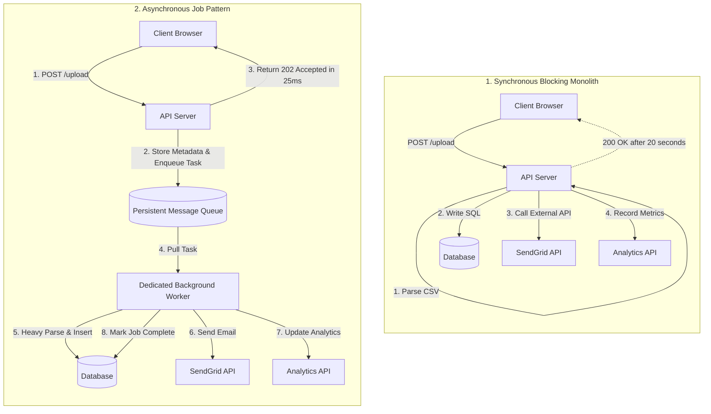
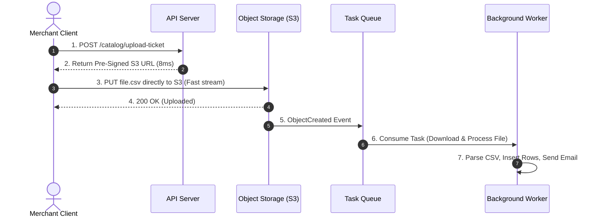

# Day 11 — The Request That Should Never Have Been Synchronous

> 🔗 **LinkedIn Discussion**: [Read & Discuss on LinkedIn](https://www.linkedin.com/in/himanshu-verma-822a07286/)  
> 🏛️ **System Architecture Milestone**: [`v4-async-workers`](../../../system-evolution/v4-async-workers/README.md)  
> 🚀 **Phase Kickoff**: Phase 3 — Stop Making Everything Synchronous (Days 11–15)

---

## The Problem

In Phase 2, we spent substantial engineering effort bulletproofing our data tier:
* We introduced PgBouncer connection pooling to survive connection spikes (Day 06).
* We deployed asynchronous streaming read replicas to offload read traffic (Day 07).
* We added an in-memory Redis caching tier with stampede protection (Day 08).
* We horizontally sharded write-intensive tables across independent databases (Day 09).
* We established transactional outbox boundaries to protect data consistency (Day 10).

Our database cluster is now resilient, responsive, and capable of sustaining tens of thousands of queries per second. 

Yet on a regular Tuesday afternoon, **ShopScale suffers a complete platform-wide outage.**

Every customer-facing API endpoint—including the homepage, product search, and cart checkout—fails with `HTTP 504 Gateway Timeout`. Our load balancers mark application nodes unhealthy one after another.

When we inspect our infrastructure metrics, we discover something baffling:
* **Database CPU is at 7%**.
* **Database IOPS are nearly idle**.
* **Redis memory and latency are nominal**.
* **Application server CPU is under 15%**.

The servers are not computing. They are not waiting on the database. They are completely starved of web worker threads because of a single endpoint: **Merchant Catalog Bulk Upload**.

```text
               Client HTTP Request: POST /api/v1/merchant/catalog/upload
                                          │
                                          ▼
                ┌───────────────────────────────────────────────────┐
                │          Stateless Web Server (Worker Thread)     │
                │                                                   │
                │  1. Receive 25 MB CSV File Multipart Stream       │ ( 3.2s )
                │                           ↓                       │
                │  2. Parse 10,000 Rows & Validate Product Schema   │ ( 4.5s )
                │                           ↓                       │
                │  3. Batch Insert Records into PostgreSQL Shards   │ ( 0.8s )
                │                           ↓                       │
                │  4. Call SendGrid API: Send Email with Attachment │ ( 6.8s ) 💥
                │                           ↓                       │
                │  5. Call Third-Party Analytics / Webhook Pipeline │ ( 4.2s ) 💥
                │                           ↓                       │
                │  6. Return HTTP 200 OK: {"imported": 10000}       │
                └───────────────────────────────────────────────────┘
                                          │
                                Total Request Time: 19.5 SECONDS!
```

During those 19.5 seconds, that web worker process or thread is **100% occupied**. It cannot accept or process any other incoming HTTP request.

When just **40 merchants** simultaneously upload new product catalogs for an upcoming weekend sale:
* All 40 available application worker processes across our compute cluster become frozen inside this single synchronous handler.
* Lightweight, high-priority requests (such as `GET /products/1042` or `POST /checkout`) arrive at the load balancer, find zero available backend workers, sit in the TCP listen backlog until timeout, and fail.
* A non-critical background operation brought down the entire e-commerce store.

---

## Why the Simple Approach Breaks

When synchronous bottlenecks trigger outages, teams often deploy three intuitive workarounds. All three worsen system stability under real-world scale.

```text
                  [ Long-Running Synchronous HTTP Handler ]
                                      │
         ┌────────────────────────────┼────────────────────────────┐
         ▼                            ▼                            ▼
┌──────────────────┐         ┌──────────────────┐         ┌──────────────────┐
│ 1. Increase HTTP │         │ 2. Add More Web  │         │ 3. In-Memory     │
│    Timeouts      │         │    Server Nodes  │         │    Fire-and-Forget│
├──────────────────┤         ├──────────────────┤         ├──────────────────┤
│ 30s ➔ 120s       │         │ Scale 10 ➔ 40    │         │ Spawn raw OS     │
│ Holds threads    │         │ Expensive compute│         │ thread / threadpool│
│ 4x longer during │         │ wasted waiting on│         │ Crashes lose data│
│ external delays  │         │ slow network I/O │         │ on deployment    │
└──────────────────┘         └──────────────────┘         └──────────────────┘
```

### 1. Increasing HTTP Timeouts Exacerbates Resource Exhaustion
When requests hit the default 30-second gateway timeout, the immediate reaction is often raising NGINX and load balancer timeouts to `120s` or `300s`.

This is disastrous. Increasing the timeout does not make the work faster; it simply authorizes worker processes to sit idle across slow network connections four times longer. If an external API (such as an email gateway or analytics provider) experiences temporary latency degradation, every web worker blocks for 2 minutes before giving up, accelerating total platform collapse.

### 2. Horizontally Scaling Web Servers Wastes Expensive Resources
Adding 30 more application servers temporarily provides more worker threads, but it treats the symptom rather than the disease.

Web servers are designed and provisioned for **rapid, lightweight request-response multiplexing** (typically 10ms–100ms per request). Scaling public-facing compute instances to handle long-running file processing, PDF generation, or third-party network retries wastes expensive memory and CPU bandwidth on workloads that do not belong in the HTTP request lifecycle.

### 3. In-Memory Background Threads (Fire-and-Forget)
Developers often attempt to free the HTTP thread by spawning an unmanaged background thread directly inside the web process:

```python
# The Fire-and-Forget Anti-Pattern
@app.post("/api/catalog/upload")
def upload_catalog(file: UploadFile, background_tasks: BackgroundTasks):
    file_bytes = file.file.read()
    # Spawns thread in local web server RAM
    background_tasks.add_task(process_csv_and_send_email, file_bytes)
    return {"status": "processing_started"}
```

While this returns HTTP 200 immediately to the client, it introduces catastrophic data loss risks:
* **Zero Durability on Server Deployments**: If Kubernetes rolls out a new release or restarts an unhealthy container, **all in-memory threads die instantly**. The upload is silently dropped halfway through, the email is never sent, and the customer is left with zero record of what failed.
* **Unbounded Memory Spikes (OOM Kills)**: If 20 merchants upload 50 MB files simultaneously, processing them concurrently inside the web server's local RAM triggers the Linux Out-Of-Memory (OOM) killer, abruptly terminating the entire web service.
* **No Retry or Dead-Letter Capability**: If the downstream email API throws a 503 error, an in-memory thread has no reliable, persistent mechanism to back off, retry, or alert engineers.

---

## Understanding the Problem

To decouple our architecture, we must dissect why synchronous chains are fundamentally fragile.

---

### The Additive Latency Trap

In a synchronous request, total latency is the **sum of all sequential dependencies**:

```text
Total Latency = T(Network Upload) + T(File Parse) + T(DB Insert) + T(Email API) + T(Analytics API)
```

If any single dependency experiences latency jitter (e.g., SendGrid takes 8 seconds due to queue buildup), **the entire HTTP response is penalized by that exact delay**. The client cannot complete its request until the slowest, least critical third party finishes execution.

---

### The Multiplicative Availability Collapse

Every external network dependency chained synchronously inside an HTTP handler exponentially degrades overall endpoint availability.

According to the rules of system reliability, if an endpoint depends on $N$ independent downstream components, each with availability $A_i$:

```text
Overall Endpoint Availability = A(Upload) × A(Database) × A(Email Provider) × A(Analytics Provider)
```

Consider realistic SLAs:
* Web Application & DB: **99.9%** availability
* Third-party Email Gateway: **99.0%** availability
* Third-party Analytics Service: **98.5%** availability

```text
Total Availability = 0.999 × 0.999 × 0.990 × 0.985 ≈ 97.4%
```

By chaining email and analytics synchronously, **an endpoint designed for high availability degrades to an unacceptable 97.4% SLA** (more than 18 hours of downtime per month!). If the analytics vendor goes down, merchants cannot upload product catalogs.

---

### Temporal Coupling: The Root Vulnerability

A synchronous request enforces **strict temporal coupling**:

```text
┌──────────┐       ┌───────────┐       ┌──────────┐       ┌───────────┐       ┌───────────┐
│  Client  │ ────► │ API Node  │ ────► │ Database │ ────► │ Email API │ ────► │ Analytics │
└──────────┘       └───────────┘       └──────────┘       └───────────┘       └───────────┘
   ONLINE             ONLINE              ONLINE             ONLINE              ONLINE
```

Every single participant in the chain must be **online, healthy, and responsive at the exact same millisecond**. If any single link fails, the entire transaction fails.

---

## Possible Approaches for Decoupling

Modern architectures separate the **Critical Path** (what the user needs to know immediately) from the **Non-Critical Path** (background work that can finish seconds or minutes later).



---

### 1. The Asynchronous Job Pattern (202 Accepted + Polling / Webhooks)

Instead of holding the HTTP connection open while processing executes, the API server acts as a rapid ingestion gatekeeper.

#### How It Works:
1. **Ingest & Validate**: The API server receives the upload request, performs minimal structural validation (e.g., verifies authentication, file extension, and size limits).
2. **Persist State**: The server writes a job record to PostgreSQL (`status: PENDING`).
3. **Enqueue Work**: The server pushes a lightweight task payload (`job_id: "job_81726"`) to a durable message broker (e.g., RabbitMQ, Redis Streams, or Amazon SQS).
4. **Immediate Acknowledgment**: The API returns HTTP `202 Accepted` immediately, including a status tracking URL (`/api/v1/jobs/job_81726`).
5. **Background Execution**: Independent worker nodes pull tasks from the queue, execute heavy parsing, write to the database, and interact with external APIs.
6. **Result Retrieval**: The client retrieves job status via periodic polling (`GET /api/v1/jobs/{id}`), WebSockets, or Server-Sent Events (SSE).

#### Where It Helps:
* **Sub-50ms API Latency**: Web worker threads are released immediately to handle other incoming user traffic.
* **Fault Isolation**: If SendGrid or the analytics API is down, the background worker retries using exponential backoff without failing the merchant's upload.

#### Limitations:
* **Increased Architectural Complexity**: Requires managing message queues, worker processes, state machines, and client-side status polling.

#### When It Makes Sense:
* Any operation taking longer than **500ms**, processing batch data, or communicating with third-party external services.

---

### 2. Direct-to-Storage Upload (Bypassing the API Tier Entirely)

Routing multi-megabyte file uploads through your application servers wastes memory and network I/O.

#### How It Works:
1. Client requests an upload token: `POST /api/v1/catalog/upload-ticket`.
2. API validates permissions and generates a time-limited **Pre-Signed URL** directly to object storage (e.g., AWS S3, Google Cloud Storage, or MinIO). This takes **8ms**.
3. Client streams the file directly from their browser to S3 via HTTP `PUT`.
4. Upon successful upload, S3 generates an event notification (via S3 Event Notification / SNS / SQS) that wakes up a background processing worker.



#### Where It Helps:
* Completely removes file upload bandwidth and memory pressure from web servers.

#### When It Makes Sense:
* Any file upload exceeding **2 MB** (videos, images, CSV imports, logs).

---

## Trade-offs: What We Gain and What We Give Up

```text
               Synchronous Monolithic Handler              Asynchronous Decoupled Architecture
┌───────────────────────────────────────────────────┐┌───────────────────────────────────────────────────┐
│ • Simple Linear Code Execution                    ││ • Sub-50ms API Response Times                     │
│ • Immediate Failure Notification in Response Body ││ • Worker Fleet Scales Independently from Web Tier │
│ • Zero Extra Infrastructure (No Queues/Workers)   ││ • High Resilience: 3rd-Party Outages Isolated     │
│ • Catastrophic Worker Thread Starvation Risks     ││ • Automatic Retries with Exponential Backoff      │
│ • Total Availability Bound to Weakest 3rd Party   ││ • 💥 Complex Client UX (Polling / WebSockets)     │
│ • Impossible to Scale Batch Processing Cleanly    ││ • 💥 Eventual Consistency & Job Tracking Overhead │
└───────────────────────────────────────────────────┘└───────────────────────────────────────────────────┘
```

### What We Gain:
1. **Predictable Web Tier Capacity**: Application worker threads are never blocked by long-running computations or slow third-party networks.
2. **Independent Elastic Scaling**: You can run 5 web servers for HTTP traffic and scale background workers from 2 to 50 nodes based on queue backlog depth during seasonal promotions.
3. **Guaranteed Execution & Retries**: Transient downstream errors are handled gracefully in the background without user intervention.

### What We Give Up:
1. **Instantaneous Feedback**: You can no longer return `"Item 42 had an invalid price"` directly in the initial HTTP response. Errors must be captured in job records and queried asynchronously.
2. **Operational Footprint**: You must deploy, monitor, and maintain message queues, worker daemons, and dead-letter queue recovery tools.

---

## A Practical Example: Refactoring ShopScale Catalog Upload

Let's compare the fragile synchronous implementation against the resilient, asynchronous architecture.

---

### The Anti-Pattern: Fragile Synchronous Handler

```python
# ❌ ANTI-PATTERN: Blocking synchronous handler
import time
import requests
from fastapi import FastAPI, UploadFile, HTTPException
from sqlalchemy.orm import Session

app = FastAPI()

@app.post("/api/v1/merchant/catalog/upload-sync")
def upload_catalog_sync(file: UploadFile, db: Session = Depends(get_db)):
    start_time = time.time()
    
    # 1. Block worker reading large file
    csv_content = file.file.read().decode("utf-8")
    
    # 2. Block worker parsing 10,000 lines
    products = parse_large_csv(csv_content)
    
    # 3. Block worker executing heavy SQL inserts
    db.bulk_insert_mappings(ProductModel, products)
    db.commit()
    
    # 4. Block worker waiting on slow external third-party email API
    # If SendGrid is slow or down, this thread hangs for up to 30 seconds!
    email_response = requests.post(
        "https://api.sendgrid.com/v3/mail/send",
        headers={"Authorization": "Bearer SG_KEY"},
        json={"to": "merchant@shopscale.com", "subject": "Catalog Imported"},
        timeout=30.0
    )
    
    # 5. Block worker waiting on third-party analytics
    requests.post("https://analytics.internal/events", json={"imported": len(products)}, timeout=10.0)
    
    duration = time.time() - start_time
    return {"status": "SUCCESS", "rows": len(products), "time_taken": duration}
```

---

### The Production Pattern: Decoupled Asynchronous Handler

#### 1. The Fast Ingestion Endpoint (API Tier)

```python
# ✅ PRODUCTION PATTERN: Fast HTTP 202 Accepted Ingestion
import uuid
import json
import redis
from fastapi import FastAPI, UploadFile, BackgroundTasks, HTTPException, status
from pydantic import BaseModel

app = FastAPI()

# Redis client used as a durable task queue producer
queue_client = redis.Redis(host="queue.internal.shopscale.net", port=6379, db=0)

class JobStatusResponse(BaseModel):
    job_id: str
    status: str
    poll_url: str

@app.post("/api/v1/merchant/catalog/upload", status_code=status.HTTP_202_ACCEPTED, response_model=JobStatusResponse)
async def upload_catalog_async(file: UploadFile):
    # Step 1: Rapid metadata validation (< 5ms)
    if not file.filename.endswith(".csv"):
        raise HTTPException(status_code=400, detail="Only CSV format is supported")

    job_id = str(uuid.uuid4())
    
    # Step 2: Stream file directly to disk/staging storage (< 100ms)
    staged_path = f"/var/staging/uploads/{job_id}.csv"
    with open(staged_path, "wb") as buffer:
        while chunk := await file.read(1024 * 1024):  # 1MB chunks
            buffer.write(chunk)

    # Step 3: Initialize job state in Redis/Database (Status: PENDING)
    initial_payload = {
        "job_id": job_id,
        "status": "PENDING",
        "file_path": staged_path,
        "filename": file.filename,
        "progress_percent": 0
    }
    queue_client.set(f"job:{job_id}", json.dumps(initial_payload), ex=86400)

    # Step 4: Push task to durable message queue (Redis Stream / RabbitMQ)
    queue_client.xadd("catalog_import_queue", {"job_id": job_id})

    # Step 5: Immediately release web worker thread! (Total latency: ~45ms)
    return JobStatusResponse(
        job_id=job_id,
        status="ACCEPTED",
        poll_url=f"/api/v1/merchant/catalog/jobs/{job_id}"
    )

@app.get("/api/v1/merchant/catalog/jobs/{job_id}")
def get_job_status(job_id: str):
    """Allows client to poll for status without blocking workers."""
    job_data = queue_client.get(f"job:{job_id}")
    if not job_data:
        raise HTTPException(status_code=404, detail="Job not found")
    return json.loads(job_data)
```

#### 2. The Dedicated Background Worker (Worker Tier)

```python
# ✅ PRODUCTION PATTERN: Dedicated Worker Process (Runs on worker nodes)
import time
import json
import logging
import redis
import requests

logger = logging.getLogger("shopscale.worker")
queue_client = redis.Redis(host="queue.internal.shopscale.net", port=6379, db=0)

def update_job_progress(job_id: str, status: str, progress: int, error: str = None):
    payload = {
        "job_id": job_id,
        "status": status,
        "progress_percent": progress,
        "error": error
    }
    queue_client.set(f"job:{job_id}", json.dumps(payload), ex=86400)

def run_worker():
    logger.info("Catalog import worker started. Listening for tasks...")
    while True:
        # Read from Redis Stream (blocking read with 5s timeout)
        entries = queue_client.xread({"catalog_import_queue": "$"}, block=5000, count=1)
        if not entries:
            continue

        for stream_name, messages in entries:
            for message_id, data in messages:
                job_id = data[b"job_id"].decode("utf-8")
                process_import_job(job_id)
                queue_client.xdel("catalog_import_queue", message_id)

def process_import_job(job_id: str):
    try:
        update_job_progress(job_id, "PROCESSING", 10)
        
        # 1. Parse CSV and execute batch SQL operations
        # (Isolated to this worker; zero impact on web API nodes)
        time.sleep(4.0) # Simulating heavy batch processing
        update_job_progress(job_id, "PROCESSING", 70)
        
        # 2. Call external SendGrid email API with retries
        send_email_with_backoff(job_id)
        
        # 3. Mark complete
        update_job_progress(job_id, "COMPLETED", 100)
        logger.info(f"Successfully finished processing {job_id}")

    except Exception as err:
        logger.error(f"Job {job_id} failed: {err}")
        update_job_progress(job_id, "FAILED", 0, error=str(err))

def send_email_with_backoff(job_id: str):
    """External API calls retry safely without degrading web servers."""
    for attempt in range(3):
        try:
            resp = requests.post("https://api.sendgrid.com/v3/mail/send", timeout=5.0)
            if resp.status_code < 400:
                return
        except requests.RequestException:
            time.sleep(2 ** attempt)  # Exponential backoff
```

---

## Failure Scenarios

Decoupled asynchronous processing introduces specific operational hazards that must be defended against.

```text
                                [ Asynchronous Failures ]
                                            │
         ┌──────────────────────────────────┼──────────────────────────────────┐
         ▼                                  ▼                                  ▼
┌───────────────────────────┐  ┌───────────────────────────┐  ┌───────────────────────────┐
│ 1. The Poison Pill Task   │  │ 2. Silent Worker Crashes  │  │ 3. Zombie Polling Clients │
│ Malformed CSV crashes the │  │ Worker process crashes    │  │ Client disconnects or     │
│ worker process on parse;  │  │ mid-job; task remains in  │  │ abandons tab; worker      │
│ re-enqueued infinitely    │  │ 'PROCESSING' forever      │  │ wastes compute computing  │
└───────────────────────────┘  └───────────────────────────┘  └─────────────────────────-─┘
```

---

### 1. The Poison Pill Task (Crash Loop)
* **What Happens**: A merchant uploads a corrupt CSV that triggers a parser `Segmentation Fault` or unhandled runtime panic in the worker. The message broker detects worker death and re-delivers the exact same message to another worker.
* **Impact**: The second worker crashes. The message is re-delivered to the third worker, systematically crashing every worker node in your fleet.
* **Mitigation**:
  * Implement a **Dead Letter Queue (DLQ)** with a maximum retry counter (e.g., `max_retries: 3`). If a task fails 3 times, divert it to the DLQ and alert on-call engineering without taking down other jobs.

---

### 2. Silent Worker Death & Stuck Jobs
* **What Happens**: A worker machine experiences a hardware fault or hypervisor reboot while processing Job #402. The job state remains permanently marked as `"PROCESSING"`.
* **Impact**: The customer waits indefinitely on their status screen; the upload never completes and never fails.
* **Mitigation**:
  * Attach heartbeats and visibility timeouts to tasks. If a task remains in `"PROCESSING"` for longer than a threshold (e.g., 10 minutes) without a heartbeat update, an automated watchdog resets the job to `"PENDING"` for re-execution.

---

### 3. Impatient User Duplicate Submissions
* **What Happens**: A merchant clicks "Upload Catalog". Even though the asynchronous response takes 100ms, the merchant does not see immediate product changes in their dashboard, assumes it failed, and clicks "Upload" four more times.
* **Impact**: Five identical heavy import tasks enter the queue, generating duplicate products and wasting computing capacity.
* **Mitigation**:
  * Use **Content Hashing**: Hash the incoming file bytes (`SHA-256`). If an identical file hash is currently `"PROCESSING"` for that merchant, reject the duplicate submission with a reference to the existing active job.

---

## Key Engineering Decisions: The 500ms Rule

Before implementing an endpoint synchronously, evaluate it against this architectural decision framework:

```text
                          ┌──────────────────────────────┐
                          │   Does operation depend on   │
                          │   external third-party APIs? │
                          └──────────────┬───────────────┘
                                         │
                        YES              │               NO
                 ┌───────────────────────┘               └───────────────────────┐
                 ▼                                                               ▼
  ┌──────────────────────────────┐                                ┌──────────────────────────────┐
  │ Make Asynchronous (Worker)   │                                │ Does operation reliably      │
  │ • Isolate third-party jitter │                                │ complete in < 500ms at P99?  │
  │ • Independent retry loops    │                                └──────┬───────────────┬───────┘
  └──────────────────────────────┘                                       │               │
                                                                YES      │               │ NO
                                                         ┌───────────────┘               └───────────────┐
                                                         ▼                                               ▼
                                          ┌──────────────────────────────┐                ┌──────────────────────────────┐
                                          │ Keep Synchronous (HTTP Path) │                │ Make Asynchronous (Job Queue)│
                                          │ • Immediate consistency      │                │ • Return 202 Accepted        │
                                          │ • Direct error feedback      │                │ • Decouple compute capacity  │
                                          └──────────────────────────────┘                └──────────────────────────────┘
```

1. **The 500ms Rule**: If any operation takes longer than 500ms at P99, it does not belong in the synchronous HTTP request lifecycle. Defer it to background workers.
2. **Never Put External APIs on the Critical Path**: Payment gateways, email providers, SMS notifications, and analytics pipelines must never hold an HTTP worker thread open.
3. **Always Set Explicit Timeouts on Internal Queues**: A job in a queue must have a bounded maximum execution time. Tasks that hang indefinitely degrade worker pool capacity.
4. **Design for Idempotency from Day One**: Every asynchronous worker must be capable of executing the exact same task twice without creating duplicate database records or charging cards twice.

---

## Key Takeaways

1. **Synchronous request chains are additive in latency and multiplicative in failure.** Your API's availability is fundamentally bounded by the weakest, slowest third-party dependency in your handler.
2. **Web servers are for multiplexing, not batch computing.** Holding HTTP threads open during heavy file parsing or slow network I/O starves your entire platform of connection capacity.
3. **In-memory background threads are an anti-pattern.** Spawning raw unmanaged threads inside web server memory risks silent data loss on deployments and container restarts.
4. **HTTP 202 Accepted is the universal contract for heavy operations.** Accept the intent, persist the state, enqueue the work, and return immediately.
5. **Decoupling is the foundation of resilience.** Moving heavy work to asynchronous queues allows your web servers to remain blazing fast and completely immune to background workload surges.

---

### 🧭 Navigation & Next Steps
* Read the previous guide: **[Day 10 — Scaling Data Without Breaking Consistency](../../phase-2-database-becomes-the-problem/day-10-data-without-breaking-consistency/README.md)**
* Read the next guide: **[Day 12 — Introducing the Queue: Decoupling Producers from Consumers](../day-12-introducing-the-queue/README.md)**
* View the architecture milestone: [`v4-async-workers`](../../../system-evolution/v4-async-workers/README.md)
