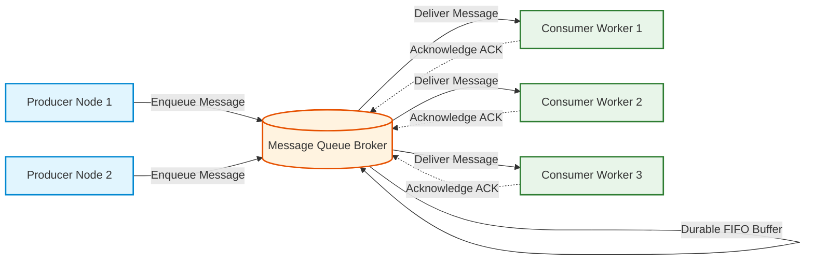
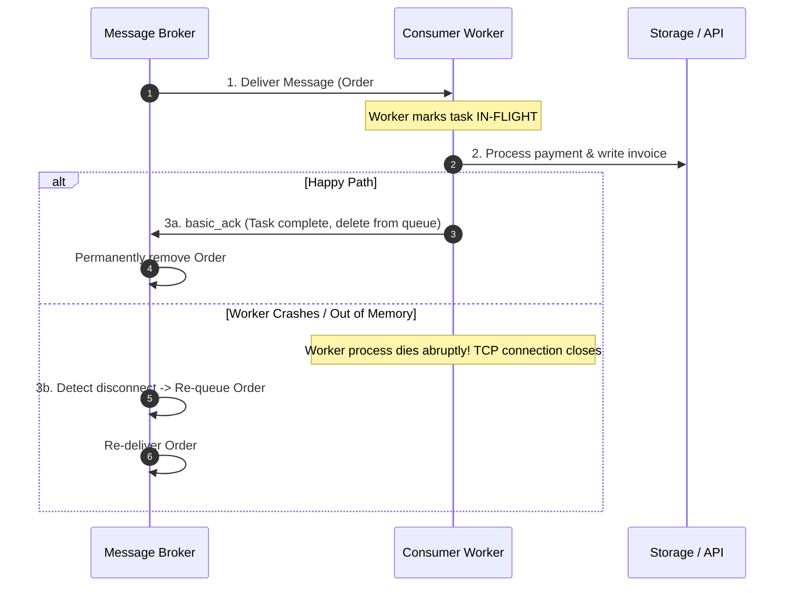
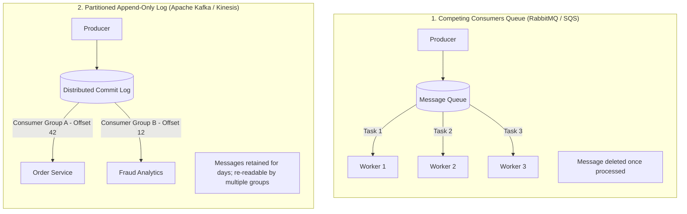
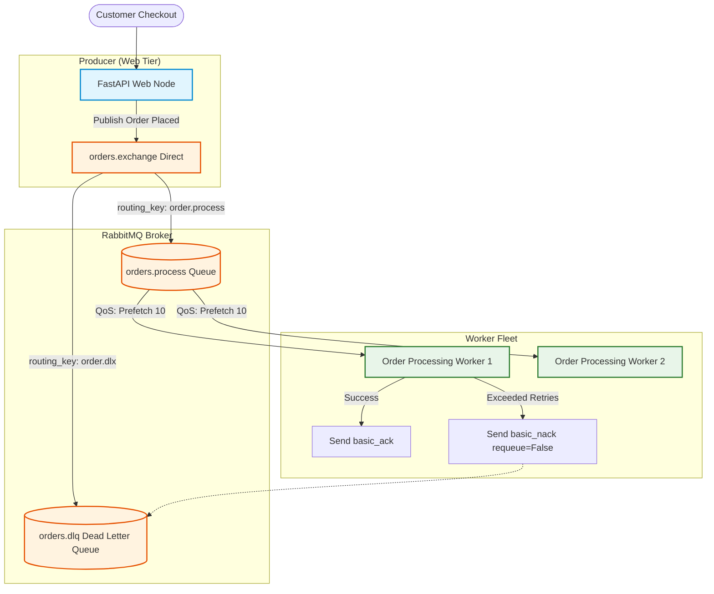

# Day 12 — Introducing the Queue: Decoupling Producers from Consumers

> 🔗 **LinkedIn Discussion**: [Read & Discuss on LinkedIn](https://www.linkedin.com/in/himanshu-verma-822a07286/)  
> 🏛️ **System Architecture Milestone**: [`v4-async-workers`](../../../system-evolution/v4-async-workers/README.md)  
> 📖 **Phase 3**: Stop Making Everything Synchronous

---

## The Problem

On Day 11, we uncovered why long-running tasks do not belong in the synchronous HTTP request lifecycle. We realized that executing CSV imports, generating PDF invoices, or calling third-party email APIs inside web handlers starves application worker threads and triggers catastrophic platform-wide timeouts.

We agreed on the architectural goal: **offload heavy tasks to background workers.**

However, how do we actually transfer work from our customer-facing web servers to our background workers without re-introducing fragility?

In **ShopScale**, the engineering team initially attempts two straightforward integration patterns:

### Attempt 1: Direct Point-to-Point HTTP Calls
The API server accepts the user's order and immediately makes an internal HTTP call to a separate Background Worker Service:
```text
Client ──► API Server (Producer) ──► POST http://worker.internal/process ──► Worker Service (Consumer)
```
During a flash sale, order volume surges to **15,000 orders per minute**. The worker service can only process **2,500 orders per minute** (due to third-party payment settlement and warehouse verification). 

Within 30 seconds:
* The worker service runs out of available HTTP threads and begins rejecting requests with `HTTP 429 Too Many Requests` and `HTTP 503 Service Unavailable`.
* The API server—having nowhere to store the orders—is forced to either fail customer checkouts or buffer orders in local server memory.
* The API servers exhaust their memory, crash with Out-Of-Memory (OOM) errors, and **unprocessed customer orders vanish forever**.

### Attempt 2: The Relational Database as a Queue
To prevent data loss, the team switches to a database-backed table:
```sql
CREATE TABLE task_queue (
    id UUID PRIMARY KEY,
    task_type VARCHAR(50),
    payload JSONB,
    status VARCHAR(20) DEFAULT 'PENDING',
    created_at TIMESTAMP DEFAULT NOW()
);
```
Web nodes insert records into `task_queue`. A fleet of 40 background workers polls the table every 250 milliseconds:
```sql
SELECT id, payload FROM task_queue 
WHERE status = 'PENDING' 
ORDER BY created_at ASC 
LIMIT 1 FOR UPDATE SKIP LOCKED;
```
Under production concurrency, this pattern destroys database health:
* **Table Bloat & VACUUM Starvation**: High-frequency `INSERT`, `UPDATE`, and `DELETE` cycles generate millions of dead tuples per hour. PostgreSQL Autovacuum cannot keep pace, causing table pages to fragment and balloon to gigabytes.
* **Index & Buffer Thrashing**: 40 workers constantly polling with `FOR UPDATE SKIP LOCKED` force PostgreSQL to continuously scan index pages and acquire row locks, driving database CPU to 90% and degrading live customer checkout queries.
* **No Real-Time Push**: Workers either poll too fast (wasting CPU and I/O on empty queries) or poll too slow (introducing artificial latency to urgent customer orders).

```text
                  15,000 Orders/min Surging In
                                │
                                ▼
                   [ 10 API Servers (Producers) ]
                                │
             ┌──────────────────┴──────────────────┐
             │ 40 Workers Polling DB Every 250ms   │
             ▼                                     ▼
┌──────────────────────────────┐     ┌──────────────────────────────┐
│ 💥 PostgreSQL Primary DB     │     │ 💥 Direct Worker HTTP Calls  │
├──────────────────────────────┤     ├──────────────────────────────┤
│ • Millions of dead tuples    │     │ • Worker runs out of threads │
│ • Table and index bloat      │     │ • Returns HTTP 503 / 429     │
│ • CPU pinned on lock checks  │     │ • Orders dropped & lost      │
└──────────────────────────────┘     └──────────────────────────────┘
```

The database is an engine optimized for **long-term indexed state storage and complex queries**, not high-throughput transient buffering.

We need a dedicated, purpose-built distributed component that can absorb massive surges, buffer work reliably on disk, and meter delivery to downstream workers: **The Message Queue.**

---

## Why the Simple Approach Breaks

Before looking at message brokers, let's analyze why naive buffers fail when production traffic spikes.

```text
                      [ High-Throughput Traffic Spike ]
                                      │
         ┌────────────────────────────┼────────────────────────────┐
         ▼                            ▼                            ▼
┌──────────────────┐         ┌──────────────────┐         ┌──────────────────┐
│ 1. In-Memory     │         │ 2. Unbounded DB  │         │ 3. Push Without  │
│    App Buffers   │         │    Polling Queue │         │    Backpressure  │
├──────────────────┤         ├──────────────────┤         ├──────────────────┤
│ Storing tasks in │         │ High lock churn, │         │ Fast producers   │
│ Python queues or │         │ MVCC bloat, and  │         │ overwhelm slow   │
│ Go channels      │         │ constant I/O     │         │ consumers until  │
│ Server crash =   │         │ contention on    │         │ workers crash    │
│ total data loss  │         │ operational DB   │         │ from OOM         │
└──────────────────┘         └──────────────────┘         └──────────────────┘
```

### 1. In-Memory Process Buffers Lack Durability
Using in-process queues (such as a Java `LinkedBlockingQueue` or Go channel) is blazing fast, but memory is ephemeral. If an application node restarts, crashes, or is rescheduled by Kubernetes, **every pending task in that node's RAM is permanently lost**. You cannot run a mission-critical business on non-durable buffers.

### 2. Databases Lack Transient Queue Primitives
Relational databases enforce MVCC (Multi-Version Concurrency Control) and write every row change to the Write-Ahead Log (WAL) to ensure durability. Queues, by definition, are transient: items enter, wait briefly, are processed, and disappear. 
Using an RDBMS as a queue creates a continuous cycle of table page writes, deletions, index updates, and bloat that degrades the core database engine.

### 3. Lack of Backpressure Destroys Downstream Services
Without a queue acting as a controlled dam, an upstream traffic surge is pushed directly downstream. If your API servers receive 20,000 requests per second and immediately push all 20,000 to internal microservices, internal services collapse. A resilient system must allow consumers to **pull work at their own safe, sustainable rate**.

---

## Understanding the Problem

To build reliable asynchronous pipelines, we must understand the core mechanics of queueing theory, decoupled boundaries, and backpressure.

---

### Anatomy of a Message Queue

At its architectural core, a message queue separates three distinct responsibilities:



1. **The Producer**: The system component generating work (e.g., our FastAPI web nodes handling client requests). Producers append messages to the queue and immediately resume serving other users without waiting for processing.
2. **The Broker (The Queue)**: The durable intermediary storage layer (e.g., RabbitMQ, SQS, or Redis Streams). It persists messages to disk, tracks delivery state, manages queue depth, and coordinates message distribution.
3. **The Consumer (Worker)**: Autonomous background processes that retrieve messages from the broker, execute business logic (e.g., PDF generation, payment settlement), and notify the broker upon completion.

---

### Temporal and Spatial Decoupling

The most transformative advantage of introducing a queue is **decoupling in space and time**:

```text
                       SPATIAL DECOUPLING
┌──────────────┐                               ┌──────────────┐
│  Producers   │ ──► [ Intermediary Queue ] ──► │  Consumers   │
└──────────────┘                               └──────────────┘
Producers do not know who the consumers are, where they run, 
or how many exist. They only know the queue contract.

                       TEMPORAL DECOUPLING
┌──────────────┐                               ┌──────────────┐
│  Producers   │                               │  Consumers   │
│  Active at   │ ──► [ Persistent Buffer ] ──► │  Active at   │
│   09:00 AM   │                               │   11:00 AM   │
└──────────────┘                               └──────────────┘
Producers and Consumers do NOT need to be running at the same time.
Producers can generate 100,000 tasks while consumers are offline. 
Consumers can spin up later and process the backlog safely.
```

---

### What Is Backpressure?

In any processing system, rate disparities are inevitable:

```text
Rate of Production (Rp) ≠ Rate of Consumption (Rc)
```

* If `Rp < Rc`: Consumers sit idle waiting for work. Latency is minimal.
* If `Rp > Rc`: Messages accumulate. Without backpressure, the system exhausts memory or disk and crashes.

**Backpressure** is the mechanism that prevents a faster producer from overwhelming a slower consumer:

```text
The Water Tank Analogy:
                   Incoming Flash Surge (10,000 L/min)
                                  │
                                  ▼
                ┌───────────────────────────────────┐
                │          THE QUEUE (TANK)         │
                │                                   │
                │  ~~~~~~~~~~~~~~~~~~~~~~~~~~~~~~~  │ ◄── Water level rises
                │  ~~~~~~~~~~~~~~~~~~~~~~~~~~~~~~~  │     during surges
                └─────────────────┬─────────────────┘
                                  │
                                  ▼
                 Controlled Drainage Pipe (2,000 L/min)
                                  │
                                  ▼
                       [ Downstream Consumers ]
```

1. **Traffic Smoothing (Peak Shaving)**: A sudden 5-minute spike of 50,000 requests fills the queue buffer. Consumers do not crash; they continue processing steadily at their maximum safe capacity (e.g., 2,000/min) until the backlog clears.
2. **Pull-Based Flow Control**: Instead of the broker blindly pushing messages onto workers until they crash, workers **pull** work only when they have CPU and memory capacity to process it.

---

### Message Acknowledgments & Delivery Guarantees

How does a system guarantee that a message is never lost if a worker crashes halfway through processing?



* **Positive Acknowledgment (`ACK`)**: The consumer notifies the broker that processing completed successfully. The broker safely deletes the message.
* **Negative Acknowledgment (`NACK` / Requeue)**: If processing fails due to a transient error, the consumer rejects the message, instructing the broker to re-queue it for another attempt.
* **Visibility Timeout / Disconnect Reclaim**: If a consumer crashes while processing without sending an `ACK` or `NACK`, the broker detects the severed connection (or elapsed visibility timeout) and automatically makes the message available to another worker.

> [!IMPORTANT]
> **Delivery Reality**: Because workers can crash *after* executing business logic but *before* sending the `ACK`, **message queues guarantee At-Least-Once delivery, NOT Exactly-Once.** Consumers must be designed to be **idempotent**.

---

## Possible Approaches: Message Queue vs. Event Stream

When choosing an asynchronous decoupling backbone, systems typically choose between two architectural models:



---

### 1. Traditional Message Queues (RabbitMQ, Amazon SQS)

Built specifically for discrete task management and the **Competing Consumers Pattern**.

* **How It Works**: Producers publish messages to a named queue. Multiple worker processes subscribe to the same queue. The broker distributes tasks across workers (e.g., Round-Robin). Once a worker acknowledges a message, it is purged from the broker.
* **Where It Helps**:
  * Fine-grained task routing (e.g., priority queues, routing keys).
  * High-concurrency worker fleets where jobs take varying amounts of time (e.g., Worker 1 takes 500ms, Worker 2 takes 12s).
  * Native message-level retry handling and Dead Letter Exchanges.
* **Limitations**:
  * Destructive consumption: Once a message is acknowledged, another service cannot read it.
  * Lower total throughput compared to stream logs (typically tens of thousands of messages/sec per node).
* **When It Makes Sense**: Background job execution, email dispatching, order processing, and transactional worker pipelines.

---

### 2. Distributed Append-Only Event Streams (Apache Kafka, AWS Kinesis)

Built for high-throughput event streaming and state retention.

* **How It Works**: Messages are appended to ordered, immutable, partitioned logs on disk. Consumers do not delete messages; instead, each consumer group maintains its own read pointer (**offset**).
* **Where It Helps**:
  * Event-driven architectures where multiple independent microservices must react to the same event (e.g., `OrderPlaced` read by Fraud, Inventory, and Analytics simultaneously).
  * Replayability: Ability to re-process historical data from 7 days ago by rewinding consumer offsets.
  * Massive throughput (millions of events/sec).
* **Limitations**:
  * Coarser concurrency: You cannot have more active consumers in a group than there are partitions in the topic.
  * A single slow or stuck message blocks the entire partition for that consumer group (Head-of-Line blocking).
* **When It Makes Sense**: Real-time analytics, event sourcing, clickstream logging, and multi-service broadcasting.

---

## Comparison Matrix

| Attribute | Traditional Queue (RabbitMQ / SQS) | Event Stream (Kafka / Kinesis) | Redis Streams |
|---|---|---|---|
| **Primary Abstraction** | Discrete Task Queue | Partitioned Commit Log | In-Memory Stream with AOF |
| **Consumption Model** | Competing Consumers (Pushed / Pulled) | Pull-based Partition Offsets | Consumer Groups (Pull) |
| **Message Lifetime** | Deleted upon `ACK` | Retained for configured retention period | Retained until explicitly trimmed |
| **Work Distribution** | Per-message round-robin | Per-partition assignment | Per-message consumer groups |
| **Replayability** | No (Transient) | **Yes** (Rewind offset) | Yes (Within memory limits) |
| **Throughput** | 10k - 50k msgs/sec | **1,000,000+ msgs/sec** | 100k - 500k msgs/sec |
| **Operational Overhead** | Low to Medium | High | Very Low (If Redis exists) |

---

## Trade-offs: What We Gain and What We Give Up

```text
               Direct Synchronous Calls                      Asynchronous Queue Pipeline
┌───────────────────────────────────────────────────┐┌───────────────────────────────────────────────────┐
│ • Simple Linear Debugging & Tracing               ││ • Peak Traffic Shaving (Surges buffered safely)   │
│ • Immediate Response Body Feedback                ││ • Sub-30ms API Latency for Heavy Ingestion        │
│ • Zero Extra Infrastructure to Manage             ││ • Independent Elastic Scaling of Workers & Web    │
│ • Catastrophic Cascading Thread Starvation        ││ • Resilience to 3rd-Party Outages                 │
│ • Zero Resilience to Traffic Surges               ││ • 💥 Eventual Consistency & Asynchronous Polling  │
│ • Blast Radius Covers Entire Platform             ││ • 💥 Operational Overhead (Broker HA, Queues, DLQ)│
└───────────────────────────────────────────────────┘└───────────────────────────────────────────────────┘
```

---

## A Practical Example: ShopScale Order Fulfillment Pipeline

Let's implement a resilient, production-grade RabbitMQ task pipeline for **ShopScale** using Python and `pika`.

---

### Architecture Topology



---

### 1. The Producer: Non-Blocking Order Dispatcher (FastAPI)

```python
import json
import uuid
import pika
from fastapi import FastAPI, HTTPException, status
from pydantic import BaseModel

app = FastAPI()

# Establish persistent RabbitMQ connection with connection pooling
credentials = pika.PlainCredentials("shopscale_app", "secure_password")
parameters = pika.ConnectionParameters(
    host="rabbitmq.internal.shopscale.net",
    port=5672,
    credentials=credentials,
    heartbeat=60,
    blocked_connection_timeout=300
)

class OrderPayload(BaseModel):
    user_id: int
    product_id: int
    quantity: int
    amount: float

@app.post("/api/v1/orders", status_code=status.HTTP_202_ACCEPTED)
def submit_order(order: OrderPayload):
    order_id = str(uuid.uuid4())
    message_body = {
        "order_id": order_id,
        "user_id": order.user_id,
        "product_id": order.product_id,
        "quantity": order.quantity,
        "amount": order.amount,
        "retry_count": 0
    }

    try:
        # Connect and publish to exchange
        connection = pika.BlockingConnection(parameters)
        channel = connection.channel()

        # Declare durable exchange and delivery mode 2 (Persistent on disk)
        channel.basic_publish(
            exchange="orders.exchange",
            routing_key="order.process",
            body=json.dumps(message_body),
            properties=pika.BasicProperties(
                delivery_mode=pika.DeliveryMode.Persistent,
                content_type="application/json",
                correlation_id=order_id
            )
        )
        connection.close()

        # Returns immediately to customer (< 20ms)
        return {
            "status": "ACCEPTED",
            "order_id": order_id,
            "message": "Order queued for processing"
        }
    except Exception as err:
        raise HTTPException(status_code=500, detail=f"Queue ingestion failed: {err}")
```

---

### 2. The Consumer: Resilient Worker with Backpressure (Worker Daemon)

```python
import json
import time
import logging
import pika

logging.basicConfig(level=logging.INFO)
logger = logging.getLogger("shopscale.order_worker")

def setup_channel(channel):
    """
    Configures Queue Topology:
    1. Dead Letter Exchange (DLX) for failed messages after retries.
    2. Durable Queue with DLX configuration.
    3. Prefetch Count (QoS) for strict consumer backpressure.
    """
    # 1. Dead Letter Exchange & Queue
    channel.exchange_declare(exchange="orders.dlx", exchange_type="direct", durable=True)
    channel.queue_declare(queue="orders.dlq", durable=True)
    channel.queue_bind(exchange="orders.dlx", queue="orders.dlq", routing_key="order.poison")

    # 2. Main Order Queue configured with dead-letter forwarding
    channel.exchange_declare(exchange="orders.exchange", exchange_type="direct", durable=True)
    channel.queue_declare(
        queue="orders.process",
        durable=True,
        arguments={
            "x-dead-letter-exchange": "orders.dlx",
            "x-dead-letter-routing-key": "order.poison"
        }
    )
    channel.queue_bind(exchange="orders.exchange", queue="orders.process", routing_key="order.process")

    # 3. CRUCIAL: Set QoS Prefetch Count for Backpressure
    # Without this, RabbitMQ pushes thousands of messages onto this worker at once!
    # A prefetch of 10 means: "Do not give me more than 10 unacknowledged messages at a time."
    channel.basic_qos(prefetch_count=10)


def process_order_message(ch, method, properties, body):
    data = json.loads(body.decode("utf-8"))
    order_id = data.get("order_id")
    retry_count = data.get("retry_count", 0)

    try:
        logger.info(f"Processing order: {order_id} (Attempt {retry_count + 1})")
        
        # Simulate business logic: Payment auth + warehouse allocation
        time.sleep(0.4)  # 400ms processing time
        
        # Acknowledge success: message is safely deleted from broker
        ch.basic_ack(delivery_tag=method.delivery_tag)
        logger.info(f"Order {order_id} processed successfully. ACK sent.")

    except Exception as err:
        logger.error(f"Error processing order {order_id}: {err}")
        
        if retry_count < 3:
            # Requeue with incremented retry count
            data["retry_count"] += 1
            ch.basic_ack(delivery_tag=method.delivery_tag)  # Ack original
            ch.basic_publish(
                exchange="orders.exchange",
                routing_key="order.process",
                body=json.dumps(data),
                properties=pika.BasicProperties(delivery_mode=pika.DeliveryMode.Persistent)
            )
        else:
            # Exhausted retries: Reject message and forward directly to Dead Letter Queue
            logger.critical(f"Order {order_id} failed permanently. Routing to DLQ.")
            ch.basic_nack(delivery_tag=method.delivery_tag, requeue=False)


def start_worker():
    credentials = pika.PlainCredentials("shopscale_app", "secure_password")
    connection = pika.BlockingConnection(
        pika.ConnectionParameters(host="rabbitmq.internal.shopscale.net", credentials=credentials)
    )
    channel = connection.channel()
    setup_channel(channel)

    channel.basic_consume(queue="orders.process", on_message_callback=process_order_message)
    logger.info("Order Worker is running. Waiting for messages. To exit press CTRL+C")
    channel.start_consuming()

if __name__ == "__main__":
    start_worker()
```

---

## Failure Scenarios

Introducing a message broker solves synchronous coupling, but introduces new distributed failure modes that must be proactively monitored.

```text
                                [ Queueing Failure Modes ]
                                            │
         ┌──────────────────────────────────┼──────────────────────────────────┐
         ▼                                  ▼                                  ▼
┌───────────────────────────┐  ┌───────────────────────────┐  ┌───────────────────────────┐
│ 1. The Prefetch Explosion │  │ 2. Consumer Lag Runaway   │  │ 3. Poison Pill Loop       │
│ Worker starts without QoS;│  │ Producer rate exceeds     │  │ Malformed task crashes    │
│ broker pushes 50,000 tasks│  │ worker rate for 6 hours;  │  │ worker; re-enqueued       │
│ ➔ Worker dies from OOM    │  │ Queue depth hits 2,000,000│  │ crashes next worker       │
└───────────────────────────┘  └───────────────────────────┘  └───────────────────────────┘
```

---

### 1. The Prefetch Explosion (Missing QoS)
* **What Happens**: A developer connects a new worker without calling `basic_qos(prefetch_count=10)`. By default, RabbitMQ attempts to push **every message currently in the queue** across the TCP channel to the newly connected worker.
* **Impact**: If the queue holds 80,000 pending orders, the broker streams all 80,000 messages into the worker process's memory buffer within 2 seconds. The worker process crashes with an Out-Of-Memory (OOM) panic, leaving all other workers idle.
* **Mitigation**:
  * Always configure an explicit `prefetch_count` (typically between `1` and `50` depending on job duration) on every single consumer.

---

### 2. Consumer Lag Runaway
* **What Happens**: During a marketing campaign, producers ingest orders at 20,000/min. The worker fleet is sized to process 12,000/min.
* **Impact**: Queue depth (**Consumer Lag**) grows by 8,000 messages every minute. After 3 hours, over 1.4 million messages sit in the queue. Customer order confirmations are delayed by 2 hours.
* **Mitigation**:
  * Implement **Autoscaling based on Queue Depth (Lag)**: Use Kubernetes KEDA or AWS CloudWatch alarms to dynamically scale worker pods from 10 to 60 instances when queue depth crosses a safety threshold.

---

### 3. The Unbounded Retry Storm (Poison Pill)
* **What Happens**: A customer submits an order containing an unhandled Unicode character or negative quantity that triggers an unhandled `TypeError` in the worker. If the consumer code simply executes `ch.basic_nack(requeue=True)` on any exception, the broker immediately hands the exact same message back to the same worker.
* **Impact**: The worker loops infinitely crashing and requeueing 500 times per second, consuming 100% of worker CPU and completely blocking legitimate orders.
* **Mitigation**:
  * Limit retries using a message header counter. After 3 failures, reject the message with `requeue=False` to automatically route it into a **Dead Letter Queue (DLQ)** for engineering inspection.

---

## Key Engineering Decisions

When architecting queue-based systems, apply this decision framework:

```text
                          ┌──────────────────────────────┐
                          │   Need multiple services to  │
                          │   re-read historical events? │
                          └──────────────┬───────────────┘
                                         │
                        YES              │               NO
                 ┌───────────────────────┘               └───────────────────────┐
                 ▼                                                               ▼
  ┌──────────────────────────────┐                                ┌──────────────────────────────┐
  │ Event Stream (Kafka/Kinesis) │                                │ Message Queue (RabbitMQ/SQS) │
  │ • Append-only commit log     │                                │ • Competing consumers        │
  │ • Long-term retention        │                                │ • Granular task routing      │
  │ • Independent group offsets  │                                │ • Low operational complexity │
  └──────────────────────────────┘                                └──────────────┬───────────────┘
                                                                                 │
                                                                                 ▼
                                                                  ┌──────────────────────────────┐
                                                                  │ Configure Backpressure:      │
                                                                  │ • Bounded prefetch_count     │
                                                                  │ • Dead Letter Queue (DLQ)    │
                                                                  │ • Autoscale on Consumer Lag  │
                                                                  └──────────────────────────────┘
```

1. **Never Assume Delivery Order Across Concurrent Workers**: While a queue is FIFO internally, running 20 concurrent workers means Worker 2 may finish Task #2 before Worker 1 finishes Task #1. Design tasks to be order-independent or use message grouping/partition keys.
2. **Treat Prefetch Count as Your Primary Flow Control**: Match prefetch to task execution duration. For fast tasks (< 50ms), use prefetch 50–100. For long-running tasks (> 2s), use prefetch 1–5 to prevent work hoarding.
3. **Alert on Consumer Lag, Not Just Worker CPU**: An idle worker fleet with a skyrocketing queue depth indicates a stalled or blocked pipeline. Alert on `queue_messages_ready` and message age.

---

## Key Takeaways

1. **A queue is a shock absorber for traffic surges.** It decouples the rate of production from the rate of consumption, converting catastrophic spikes into manageable backlogs.
2. **Databases are not message queues.** Using relational tables as queues causes massive MVCC bloat, index thrashing, and database degradation. Use purpose-built message brokers.
3. **Spatial and temporal decoupling unlock resilience.** Producers and consumers do not need to know each other's network addresses or be online at the same time.
4. **Always set a prefetch limit (`QoS`).** Failing to configure prefetch causes message brokers to flood worker memory during traffic surges, triggering OOM crashes.
5. **Always provision a Dead Letter Queue (DLQ).** Never allow a failing poison pill message to retry infinitely and block your consumer fleet.

---

### 🧭 Navigation & Next Steps
* Read the previous guide: **[Day 11 — The Request That Should Never Have Been Synchronous](../day-11-never-synchronous-request/README.md)**
* Read the next guide: **[Day 13 — The Exactly-Once Myth: Dealing with Duplicates](../day-13-exactly-once-myth/README.md)**
* View the architecture milestone: [`v4-async-workers`](../../../system-evolution/v4-async-workers/README.md)
