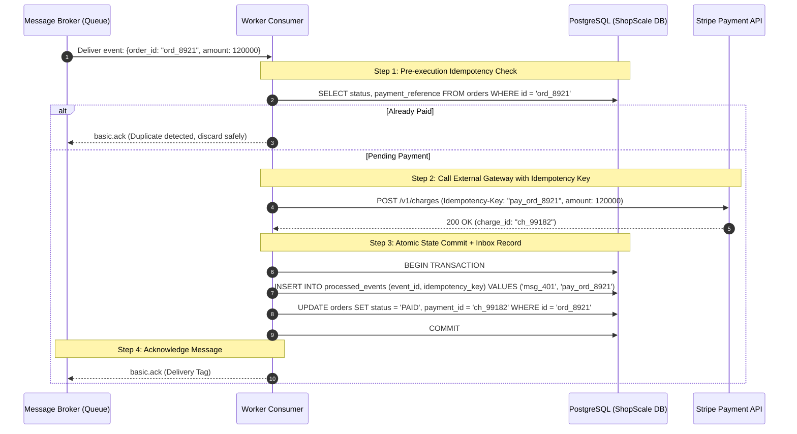

# Day 13 — Exactly Once Is Not What You Think: Delivery Guarantees & Idempotency

> 🔗 **LinkedIn Discussion**: [Read & Discuss on LinkedIn](https://www.linkedin.com/in/himanshu-verma-822a07286/)  
> 🏛️ **System Architecture Milestone**: [`v4-async-workers`](../../../system-evolution/v4-async-workers/README.md)  
> 📖 **Phase 3**: Stop Making Everything Synchronous

---

## The Problem

On Day 12, we introduced a message queue to decouple our API servers from background workers. When a customer purchases an item on **ShopScale**, the API server writes an event to the queue and immediately returns `HTTP 202 Accepted` to the client. Background workers pull tasks from the queue to process payments, allocate warehouse inventory, and dispatch confirmation emails.

The architecture felt complete. We had eliminated synchronous blocking, protected our relational database from polling bloat, and absorbed traffic spikes smoothly.

Then, during a Friday flash sale, our customer support queue explodes.

A customer named Sarah ordered a \$1,200 laptop. When she checked her credit card statement, she found **two identical charges of \$1,200**. In our warehouse management system, our fulfillment team printed **two shipping labels with different tracking IDs** for the exact same order. Two physical laptops were boxed and loaded onto delivery trucks.

We check our order database. There is only one order record with ID `ord_8921`.

We check our queue metrics. There was only one message published by the API server:
```json
{
  "event": "order.process_payment",
  "order_id": "ord_8921",
  "customer_id": "cust_402",
  "amount_cents": 120000
}
```

If the API server sent only one message, why did Sarah get charged twice, and why did our warehouse pack two laptops?

We dig into our worker logs and discover what happened at 14:02:18 UTC:

1. **Worker-04** pulled the message for `ord_8921` from the queue.
2. **Worker-04** made an outbound HTTP call to Stripe and successfully charged Sarah's card \$1,200.
3. **Worker-04** attempted to acknowledge the message (`basic.ack`) back to the message broker.
4. Right before the acknowledgment packet left the network card, **Worker-04 suffered a Linux Out-Of-Memory (OOM) kill** caused by an unrelated background image processing thread running on the same VM.
5. The TCP connection between Worker-04 and the message broker abruptly severed.
6. The broker observed the dead socket without having received an ACK. In accordance with standard queue semantics, the broker flagged the message as unacknowledged and **re-queued it at the head of the queue**.
7. Five seconds later, healthy **Worker-09** pulled the re-queued message.
8. **Worker-09** executed its task: it called Stripe, charged Sarah another \$1,200, notified the warehouse, and sent `basic.ack`.

```
                  [ Message Broker (RabbitMQ / SQS) ]
                                   │
         ┌─────────────────────────┴─────────────────────────┐
         │ 1. Deliver msg_8921                               │ 5. Redeliver msg_8921
         ▼                                                   ▼
┌──────────────────────────────┐                   ┌──────────────────────────────┐
│ Worker-04                    │                   │ Worker-09                    │
├──────────────────────────────┤                   ├──────────────────────────────┤
│ 2. Calls Stripe -> Charged!  │                   │ 6. Calls Stripe -> Charged!  │
│ 3. Informs Warehouse -> Packed!                  │ 7. Informs Warehouse -> Packed!
│ 4. 💥 OOM Crash before ACK   │                   │ 8. Sends basic.ack (Success) │
└──────────────────────────────┘                   └──────────────────────────────┘
```

The system did not fail because of a software bug. It failed because **we designed the consumer assuming the message would only ever be processed once**.

---

## Why the Simple Approach Breaks

When engineers first encounter double-processing incidents, they usually attempt one of two naive fixes:

```text
               Naive Fix 1: At-Most-Once                 Naive Fix 2: In-Memory Set
           ┌──────────────────────────────┐          ┌──────────────────────────────┐
           │ Acknowledge BEFORE doing work│          │ Check memory: seen_ids.add() │
           └──────────────┬───────────────┘          └──────────────┬───────────────┘
                          │                                         │
                          ▼                                         ▼
           Worker crashes mid-execution.             Worker restarts or scales to 10
           Message is gone from broker.              nodes. Node 2 knows nothing 
           Customer paid, order vanished!            about Node 1's memory cache.
```

### 1. Acknowledging Before Processing (At-Most-Once)
"If redelivering unacknowledged messages causes double charges, let's acknowledge the message the millisecond we receive it, before doing any work!"

```python
# The Naive "At-Most-Once" Anti-Pattern
def on_message(channel, method, properties, body):
    # Acknowledge immediately to prevent duplicate delivery
    channel.basic_ack(delivery_tag=method.delivery_tag)
    
    # Now execute the dangerous work
    charge_credit_card(body)
    reserve_inventory(body)
```

**Why this breaks:**  
If Worker-04 pulls the message, sends the ACK, and crashes halfway through charging the customer or reserving inventory, the message is permanently gone from the broker. The customer was charged, but the inventory was never reserved, no shipment was scheduled, and no email was sent. The task simply disappeared into a black hole.

In enterprise software, **silent data loss is infinitely worse than duplicate processing**. You can refund a duplicate charge; you cannot easily recover lost state that you don't even know existed.

### 2. In-Memory De-duplication Caches
"Let's keep a set of processed message IDs in memory: `seen_ids = set()`."

**Why this breaks:**  
1. **Worker Restarts**: When a worker crashes and restarts, its in-memory set is wiped clean.
2. **Multiple Workers**: In any scalable production system, you have 10, 50, or 200 worker pods running concurrently. Worker-09 has no access to the RAM of Worker-04. When Worker-09 receives the redelivered message, its local `seen_ids` set is empty for that ID.

### 3. Trusting Broker "Exactly-Once" Marketing
Several modern message brokers and stream processing engines advertise "Exactly-Once Semantics" (EOS). 

Engineers read this and assume: *"The broker guarantees my consumer code will only execute once for this event."*

This is a fundamental misunderstanding of distributed systems. A broker can only control what happens **inside its own boundary** (e.g., Kafka writing from one internal topic to another internal topic using transactional offsets). 

The moment your consumer reaches out of the broker boundary—calling a third-party payment gateway, sending an email via SendGrid, or writing to an external PostgreSQL database—**the broker has zero control over whether that side effect happens once, twice, or never**.

---

## Understanding the Problem

To build systems that survive network reality, we must dissect the mechanics of message delivery guarantees and accept a hard theoretical truth: **End-to-End Exactly-Once delivery across a network does not exist.**

### The Three Delivery Guarantees

In distributed messaging, every transport protocol falls into one of three guarantee tiers:

```
┌─────────────────┬─────────────────────────────────────────────────┬───────────────────────┐
│ Guarantee Tier  │ Broker & Consumer Behavior                      │ Failure Outcome       │
├─────────────────┼─────────────────────────────────────────────────┼───────────────────────┤
│ At-Most-Once    │ Consumer ACKs message BEFORE processing work.   │ Data Loss             │
│                 │ Broker never redelivers if worker crashes.      │ (Zero Duplicates)     │
├─────────────────┼─────────────────────────────────────────────────┼───────────────────────┤
│ At-Least-Once   │ Consumer ACKs message ONLY AFTER work completes.│ Duplicate Executions  │
│                 │ Broker redelivers on crash, timeout, or blip.   │ (Zero Data Loss)      │
├─────────────────┼─────────────────────────────────────────────────┼───────────────────────┤
│ Exactly-Once    │ Every message is processed and produces side    │ Mathematically        │
│ (End-to-End)    │ effects exactly once across network boundaries. │ Impossible in reality │
└─────────────────┴─────────────────────────────────────────────────┴───────────────────────┘
```

#### 1. At-Most-Once (Fire and Forget)
Messages are delivered 0 or 1 time.
* The consumer receives the payload and immediately acknowledges it or the broker deletes it upon dispatch.
* If the consumer crashes, or a network partition severs communication during execution, the message is lost forever.
* **Acceptable for:** High-volume metric collection, IoT temperature telemetry, gaming cursor coordinates, non-critical trace logging.

#### 2. At-Least-Once (The Industry Standard)
Messages are delivered 1 or more times.
* The consumer receives the payload, executes the business logic, and sends an ACK back to the broker.
* If the worker crashes, runs out of memory, or experiences a network disconnect before the ACK reaches the broker, the broker redelivers the message.
* **The Inevitable Reality:** You **will** receive duplicates.

#### 3. Why True "Exactly-Once" Delivery Is Impossible
The impossibility of end-to-end exactly-once delivery is rooted in the **Two Generals' Problem**, a proven impossibility theorem in distributed computing:

```
                      Unreliable Network Channel
           [ Worker Node ] ─────────────────► [ Message Broker ]
           State: Finished Work               State: Waiting for ACK
                  │                                     │
                  │       1. Send basic.ack             │
                  ├────────────────────────────────────►│ (Packets dropped by switch)
                  │                                     │
                  │   Did broker get the ACK?           │ Did worker finish?
                  │   Should I retry sending ACK?       │ Should I redeliver to someone else?
```

Two separate machines connected over an unreliable network (TCP/IP) cannot achieve consensus on whether a state transition occurred without the possibility of infinite acknowledgment loops. 

If the acknowledgment packet is dropped by an intermediate router, the broker cannot distinguish between:
* The consumer crashed before starting the work.
* The consumer is still working slowly.
* The consumer completed the work, but the return network cable was cut.

Because the broker cannot know, a reliable broker **must assume the worst and redeliver**.

---

### Anatomy of a Duplicate

Duplicates do not occur solely because a worker crashed. In production, duplicates emerge from multiple distinct lifecycle stages:

```
                          Where Duplicates Are Born
                          
   [ Producer ]                [ Broker ]                [ Consumer Fleet ]
        │                           │                            │
   (1) Producer Retry               │                            │
        ├──────── Message ─────────►│                            │
        │ ◄─── Timeout / Net Drop ──┤                            │
        ├──────── Message (retry) ─►│                            │
        │                           │   (2) Visibility Expiry    │
        │                           ├────── Deliver to W1 ──────►│ (Worker 1 runs slow)
        │                           ├────── Deliver to W2 ──────►│ (Worker 2 gets duplicate)
        │                           │                            │
        │                           │   (3) Post-Execution Crash │
        │                           ├────── Deliver to W1 ──────►│ (W1 finishes work)
        │                           │ ◄──── 💥 Crash before ACK ──│
        │                           ├────── Redeliver to W2 ────►│ (W2 gets duplicate)
```

1. **Producer-Side Retries**: The API server publishes an event to RabbitMQ or SQS. The broker writes the event to disk, but the network connection drops before the broker returns a publish confirmation to the API server. The API server client library times out and retries. Now, two identical messages reside in the queue.
2. **Visibility Timeout / Ack Timeout Expiration**: In systems like Amazon SQS or RabbitMQ with ack deadlines, Worker-01 receives a message with a 30-second visibility timeout. Worker-01 experiences a 35-second Stop-The-World Java/Python Garbage Collection pause or an unusually slow database query. The broker assumes Worker-01 died, unlocks the message, and hands it to Worker-02. **Both Worker-01 and Worker-02 are now executing the exact same task concurrently.**
3. **Consumer Rebalance**: In partitioned log systems like Apache Kafka, if a consumer thread takes too long to poll between batches, the consumer group coordinator kicks the consumer out and triggers a partition rebalance. Uncommitted offsets are handed to a peer consumer, redelivering the entire batch.
4. **Post-Execution Failure**: The worker finishes the work, but crashes (or loses network connectivity) milliseconds before transmitting the ACK.

---

### The Real Formula: Exactly-Once Processing

If "Exactly-Once Delivery" is impossible, how do Stripe, PayPal, Netflix, and Amazon process billions of dollars without charging customers twice?

They do not use "Exactly-Once Delivery." They use:

$$\text{At-Least-Once Delivery} + \text{Idempotent Processing} = \text{Effectively-Once Processing}$$

We accept that the transport layer **will deliver duplicate messages**. We place the burden of correctness onto our consumer logic: **no matter how many times a message is delivered, the side effect must only ever occur once.**

---

## Possible Approaches

To make a consumer idempotent, we have four architectural options, ranging from zero-effort natural idempotency to robust transactional tracking.

```
                               Idempotency Options
                                        │
         ┌──────────────────┬───────────┴───────────┬──────────────────┐
         ▼                  ▼                       ▼                  ▼
┌──────────────────┐┌──────────────────┐┌──────────────────┐┌──────────────────┐
│ 1. Natural       ││ 2. Distributed   ││ 3. RDBMS Unique  ││ 4. Transactional │
│    Idempotency   ││    Locking       ││    Constraint    ││    Outbox/Inbox  │
├──────────────────┤├──────────────────┤├──────────────────┤├──────────────────┤
│ Mutate state to  ││ Redis key + TTL  ││ INSERT ON        ││ Atomic multi-op: │
│ an absolute      ││ Fast, but leaks  ││ CONFLICT DO      ││ business state + │
│ target value     ││ under long GC    ││ NOTHING          ││ event tracking   │
└──────────────────┘└──────────────────┘└──────────────────┘└──────────────────┘
```

---

### Approach 1: Natural (Inherent) Idempotency

#### How It Works
An operation is naturally idempotent if executing it $N$ times leaves the system in the exact same state as executing it once:
$$f(f(x)) = f(x)$$

Instead of using relative mutations, you rewrite state transitions to be absolute.

* **Non-Idempotent (Additive):**
  ```sql
  UPDATE accounts SET balance = balance - 100 WHERE user_id = 'cust_402';
  UPDATE inventory SET reserved_units = reserved_units + 1 WHERE sku = 'LAPTOP-01';
  ```
  If executed twice, the user loses \$200 and two laptops are reserved.

* **Naturally Idempotent (State-Overwriting):**
  ```sql
  UPDATE orders SET status = 'CANCELLED' WHERE order_id = 'ord_8921';
  UPDATE users SET phone = '+15550199' WHERE user_id = 'cust_402';
  DELETE FROM sessions WHERE token = 'sess_xyz';
  ```
  No matter how many times this runs, the order is `CANCELLED`, the phone is `+15550199`, and the session is gone.

#### Where It Helps
Ideal for status synchronization, user profile updates, document upserts, and cancellation flows.

#### Limitations
Many core business processes are inherently additive or external:
* Charging money via a credit card gateway.
* Sending a confirmation email or SMS.
* Decrementing finite warehouse inventory.
* Appending audit logs.

#### When It Makes Sense
Always prefer natural idempotency whenever the underlying business logic permits state-setting over state-mutation.

---

### Approach 2: Distributed Locking (Redis / Key-Value Mutex)

#### How It Works
When a worker receives message `msg_8921`, it attempts to acquire a distributed lock in Redis using an idempotency key before running the business logic:

```python
# Acquire lock with a 60-second TTL
lock_acquired = redis.set(f"lock:{order_id}", worker_id, nx=True, ex=60)
if not lock_acquired:
    # Another worker is already processing or has processed this
    channel.basic_ack(delivery_tag)
    return
```

#### Where It Helps
Provides an ultra-fast, low-latency filter that protects downstream services from immediate, bursty concurrent duplicate messages.

#### Limitations
1. **The TTL Dilemma**: If Worker-01 acquires the lock with a 60-second expiration, but an external API call stalls for 65 seconds, Redis automatically releases the lock. Worker-02 acquires the lock and enters the critical section while Worker-01 is still running.
2. **Crash Before Release**: If the worker crashes without cleaning up, tasks are blocked until the TTL expires.
3. **Data Loss on Eviction**: Redis is primarily an in-memory store. Under memory pressure, LRU eviction or failover can lose keys, permitting duplicates through.

#### When It Makes Sense
Use distributed locks as a **rate-limiting concurrency guard**, but **never as your sole guarantee of financial correctness**.

---

### Approach 3: RDBMS Unique Constraints (Deduplication Table)

#### How It Works
We leverage the ACID properties of our relational database (PostgreSQL / MySQL). We create a dedicated table to record every processed message or unique transaction:

```sql
CREATE TABLE processed_events (
    event_id VARCHAR(64) PRIMARY KEY,
    handler_name VARCHAR(100) NOT NULL,
    processed_at TIMESTAMP WITH TIME ZONE DEFAULT NOW()
);
```

When processing a message, we insert the message ID inside the exact same database transaction that updates our business data:

```sql
BEGIN;

-- Attempt to claim this event
INSERT INTO processed_events (event_id, handler_name)
VALUES ('msg_8921', 'process_order_payment');

-- If the insert succeeds, execute our business state changes
UPDATE orders SET payment_status = 'PAID' WHERE id = 'ord_8921';
UPDATE inventory SET stock = stock - 1 WHERE sku = 'LAPTOP-01';

COMMIT;
```

If a duplicate message arrives (whether 2 seconds later or 3 days later), the `INSERT` statement violates the primary key unique constraint and throws a unique violation (`SQLSTATE 23505` in PostgreSQL). The transaction rolls back, preventing double-processing, and the consumer safely acknowledges the message.

#### Where It Helps
* Guaranteed atomic deduplication: The business mutation and the duplicate check succeed together or fail together.
* Zero external locking infrastructure required.
* Survives worker crashes, restarts, and network partitions.

#### Limitations
* Requires all mutations to occur within the same database engine.
* Cannot directly protect external, non-database side effects (like charging a credit card or sending an email) unless combined with an external idempotency key or an outbox pattern.

#### When It Makes Sense
The default architectural standard for all internal database state changes driven by asynchronous queues.

---

### Approach 4: The Transactional Inbox Pattern (With Downstream Idempotency Keys)

#### How It Works
What happens when your consumer must both **call an external third-party API** (Stripe) and **update your internal database**?

You cannot wrap Stripe and PostgreSQL inside a single database transaction. If Stripe charges the card, but the database crashes before committing, the next worker retry will charge Stripe again.

To solve this, we use the **Transactional Inbox Pattern** paired with **Client-Supplied Idempotency Keys**:

```
[ Worker ] ─────── 1. POST /v1/charges ────────► [ Stripe API ]
           Header: Idempotency-Key: ord_8921      (Stores ord_8921 in key-value store)
           ◄────── 2. 200 OK (Charge: ch_441) ────
               │
               ▼
   3. BEGIN TRANSACTION;
      INSERT INTO processed_events (id, charge_id) VALUES ('ord_8921', 'ch_441');
      UPDATE orders SET status = 'PAID';
      COMMIT;
               │
               ▼
   4. channel.basic_ack()
```

1. We derive a deterministic **Idempotency Key** for the operation (e.g., `order_id` or a hash of the operation).
2. We supply this key in the header to the third-party API (`Idempotency-Key: ord_8921`).
3. If the worker crashes and a second worker repeats the call to Stripe with the exact same `Idempotency-Key`, Stripe does not re-charge the customer. Instead, Stripe recognizes the key, suppresses the charge, and returns the **cached response from the original successful charge**.
4. The worker takes that response, records the state in the database, and sends the ACK.

#### Where It Helps
Mission-critical payment gateways, external billing, multi-system orchestration, and non-transactional downstream integrations.

#### Limitations
* Requires downstream third-party systems to support idempotency keys (Stripe, Adyen, and modern payment gateways do; many legacy banking APIs and SMTP email servers do not).
* Requires state storage management for idempotency keys with appropriate retention/TTL policies.

#### When It Makes Sense
Mandatory for any asynchronous worker that performs irreversible real-world actions with financial or physical consequences.

---

## Comparison Matrix

| Approach | Resilience to Worker Crash | Handles Concurrent Duplicates | Works with External APIs | Implementation Complexity | Performance Overhead |
| :--- | :--- | :--- | :--- | :--- | :--- |
| **At-Most-Once (ACK first)** | ❌ Complete data loss | ❌ Not applicable | ❌ High risk of loss | Minimal | Zero overhead |
| **Natural Idempotency** | ✅ Safe | ✅ Safe | ⚠️ Limited to absolute setters | Low (Domain design) | None |
| **Distributed Lock (Redis)** | ⚠️ Leaks on long GC/timeout | ✅ Filters rapid bursts | ❌ Cannot guarantee completion | Medium | Very low (RAM) |
| **RDBMS Unique Constraint** | ✅ 100% ACID safe | ✅ Handled via row locks / conflicts | ❌ Internal DB only | Medium | Low (Index insert) |
| **Transactional Inbox + API Keys** | ✅ 100% Enterprise safe | ✅ Safe across network boundaries | ✅ Fully supported | High | Low to Medium |

---

## Trade-offs: What We Gain and What We Give Up

Engineers often hope for a silver bullet that provides duplicate safety for free. In distributed systems, reliability is always traded for complexity and storage.

```
       What You Gain                             What You Give Up
┌──────────────────────────────┐          ┌──────────────────────────────┐
│ • Financial correctness      │          │ • Extra DB write per message │
│ • Zero customer overcharging │   VS     │ • Index maintenance & bloat  │
│ • Safe automatic retries     │          │ • TTL cleanup jobs           │
│ • Resilient worker reboots   │          │ • Distributed tracing needs  │
└──────────────────────────────┘          └──────────────────────────────┘
```

### 1. Storage Bloat vs. Disaster Recovery
To detect duplicates, you must remember the past. Every message you process requires saving an ID into an `inbox` or `processed_events` table.
* **The Cost:** If ShopScale processes 10,000,000 events a day, that table grows by 10,000,000 rows daily. Left unmanaged, table bloat will slow down inserts and exhaust storage.
* **The Engineering Compromise:** You must implement a **retention window (TTL)**. You store deduplication keys for 7, 14, or 30 days—well beyond the maximum possible lifespan or retry window of any message in your queue—and prune older records with automated partition drops.

### 2. Throughput vs. Safety
A naive worker that pulls a message, writes a record, and ACKs can achieve high throughput. An idempotent consumer must:
1. Open a transaction.
2. Perform a primary key lookup / insert on the deduplication table.
3. Call an external API with an idempotency key.
4. Update the business entity.
5. Commit the transaction.
6. Transmit the ACK.

* **The Cost:** Increased end-to-end processing latency per task (typically 5–25ms additional database overhead).
* **The Gain:** Absolute peace of mind. Your workers can crash, nodes can be terminated by spot-instance reclamation, and the system self-heals without human intervention.

---

## A Practical Example: The ShopScale Resilient Payment Consumer

Let's implement a production-grade, idempotent order processing consumer for **ShopScale**.

### The Architecture Workflow



---

### Database Schema: Inbox & Entity Tables

```sql
-- 1. The Core Business Table
CREATE TABLE orders (
    id VARCHAR(64) PRIMARY KEY,
    customer_id VARCHAR(64) NOT NULL,
    amount_cents BIGINT NOT NULL,
    status VARCHAR(32) NOT NULL DEFAULT 'PENDING',
    payment_id VARCHAR(64),
    created_at TIMESTAMP WITH TIME ZONE DEFAULT NOW(),
    updated_at TIMESTAMP WITH TIME ZONE DEFAULT NOW()
);

-- 2. The Idempotency / Inbox Deduplication Table
CREATE TABLE processed_events (
    event_id VARCHAR(128) PRIMARY KEY,
    idempotency_key VARCHAR(128) UNIQUE NOT NULL,
    handler VARCHAR(64) NOT NULL,
    result_payload JSONB,
    created_at TIMESTAMP WITH TIME ZONE DEFAULT NOW()
);

-- Index for high-speed retention pruning
CREATE INDEX idx_processed_events_created_at ON processed_events(created_at);
```

---

### The Python Consumer Implementation

Here is the robust, production-grade consumer logic using `pika` (RabbitMQ), `psycopg2` (PostgreSQL), and a simulated payment client:

```python
import json
import logging
import psycopg2
from psycopg2.errorcodes import UNIQUE_VIOLATION
import pika

logging.basicConfig(level=logging.INFO)
logger = logging.getLogger("payment_worker")

class PaymentGatewayClient:
    """Simulates an external gateway like Stripe that honors Idempotency-Key."""
    def charge(self, amount_cents: int, idempotency_key: str) -> str:
        # In real life: requests.post(..., headers={"Idempotency-Key": idempotency_key})
        logger.info(f"Dispatching charge to Stripe with Idempotency-Key: {idempotency_key}")
        # The gateway guarantees that repeated calls with the same key return the original charge_id
        return f"ch_mock_{idempotency_key}"

payment_gateway = PaymentGatewayClient()

def get_db_connection():
    return psycopg2.connect(
        dbname="shopscale",
        user="postgres",
        password="secretpassword",
        host="postgres-primary.internal",
        port=5432
    )

def process_order_payment(channel, method, properties, body):
    """
    Idempotent consumer handler for processing order payments.
    Guarantees that duplicate queue deliveries do not cause double charges
    and adheres to ADR-13 (DLQ quarantine after 3 failed retries).
    """
    delivery_tag = method.delivery_tag
    conn = None
    
    try:
        # -----------------------------------------------------------------
        # STEP 0: Poison Pill Quarantine Check (ADR-13)
        # -----------------------------------------------------------------
        # Inspect broker headers for previous failure count (e.g. RabbitMQ x-death)
        retry_count = 0
        if properties.headers and "x-death" in properties.headers:
            retry_count = properties.headers["x-death"][0].get("count", 0)

        if retry_count >= 3:
            logger.error(
                f"Delivery {delivery_tag} exceeded max retries ({retry_count}). "
                "Quarantining message to Dead Letter Queue (DLQ)."
            )
            # requeue=False tells the broker to route directly to Dead Letter Exchange
            channel.basic_nack(delivery_tag=delivery_tag, requeue=False)
            return

        payload = json.loads(body)
        order_id = payload["order_id"]
        amount_cents = payload["amount_cents"]
        event_id = properties.message_id or payload.get("event_id", f"evt_{order_id}")
        
        # Construct deterministic idempotency key derived from the business domain
        idempotency_key = f"payment_order_{order_id}"

        conn = get_db_connection()

        # -----------------------------------------------------------------
        # STEP 1: Quick Pre-Check (Has this order already been paid?)
        # -----------------------------------------------------------------
        with conn.cursor() as cur:
            cur.execute(
                "SELECT status, payment_id FROM orders WHERE id = %s;",
                (order_id,)
            )
            row = cur.fetchone()
            if not row:
                logger.error(f"Order {order_id} not found in database. Moving to DLQ.")
                channel.basic_nack(delivery_tag=delivery_tag, requeue=False)
                return

            status, existing_payment_id = row[0], row[1]
            if status == "PAID":
                logger.warning(
                    f"Order {order_id} is already marked PAID (Payment: {existing_payment_id}). "
                    "Duplicate delivery detected. ACKing and dropping safely."
                )
                conn.commit()
                channel.basic_ack(delivery_tag=delivery_tag)
                return

        # Commit/close the read transaction so no DB locks are held during HTTP I/O
        conn.commit()

        # -----------------------------------------------------------------
        # STEP 2: Call External Gateway with Idempotency Key (OUTSIDE DB TX)
        # -----------------------------------------------------------------
        # CRITICAL DISTRIBUTED SYSTEMS PATTERN:
        # Never hold an open database transaction across an external HTTP call.
        # If Stripe is slow or times out, a held DB lock will exhaust connection pools.
        # Instead, we pass the deterministic Idempotency-Key. If two workers call
        # Stripe concurrently, Stripe charges once and returns the exact same charge ID.
        charge_id = payment_gateway.charge(
            amount_cents=amount_cents,
            idempotency_key=idempotency_key
        )

        # -----------------------------------------------------------------
        # STEP 3: Atomic State Commit + Inbox Record (Short-Lived DB TX)
        # -----------------------------------------------------------------
        with conn.cursor() as cur:
            try:
                # 3a. Record this event into our deduplication inbox
                cur.execute(
                    """
                    INSERT INTO processed_events (event_id, idempotency_key, handler, result_payload)
                    VALUES (%s, %s, %s, %s);
                    """,
                    (
                        event_id,
                        idempotency_key,
                        "process_order_payment",
                        json.dumps({"charge_id": charge_id})
                    )
                )

                # 3b. Mutate the core business entity
                cur.execute(
                    """
                    UPDATE orders 
                    SET status = 'PAID', payment_id = %s, updated_at = NOW()
                    WHERE id = %s;
                    """,
                    (charge_id, order_id)
                )

                # Commit both statements atomically
                conn.commit()
                logger.info(f"Order {order_id} committed as PAID (Charge: {charge_id}).")

            except psycopg2.Error as db_err:
                conn.rollback()
                if db_err.pgcode == UNIQUE_VIOLATION:
                    logger.warning(
                        f"Duplicate event {event_id} caught by UNIQUE constraint on processed_events. "
                        "Another worker committed first. Safely acknowledging."
                    )
                    channel.basic_ack(delivery_tag=delivery_tag)
                    return
                else:
                    raise db_err

        # -----------------------------------------------------------------
        # STEP 4: Acknowledge Message ONLY AFTER DB Commit Succeeds
        # -----------------------------------------------------------------
        channel.basic_ack(delivery_tag=delivery_tag)

    except Exception as e:
        logger.exception(f"Error processing delivery {delivery_tag}: {str(e)}")
        if conn:
            conn.rollback()
        # NACK with requeue=True so the broker can retry after backoff
        channel.basic_nack(delivery_tag=delivery_tag, requeue=True)
        
    finally:
        if conn:
            conn.close()
```

---

### Case Study: Worker Crashes Right Before Acknowledgment

Let's trace exactly how this implementation behaves under the most dangerous distributed failure mode: **The consumer completes all work but crashes milliseconds before sending `basic.ack`**.

```
Timeline of a Post-Execution Worker Crash:

Time   Actor       Action & State
─────────────────────────────────────────────────────────────────────────────
T0     Broker      Delivers msg_8921 to Worker-04
T1     Worker-04   Step 1: Checks DB -> status is 'PENDING'
T2     Worker-04   Step 2: Calls Stripe (Key: 'payment_order_ord_8921') -> Success ($1,200 charged)
T3     Worker-04   Step 3: DB Transaction commits:
                   - INSERT INTO processed_events ('msg_8921', 'payment_order_ord_8921')
                   - UPDATE orders SET status = 'PAID', payment_id = 'ch_mock_...'
                   (State is now durable on PostgreSQL disk!)
T4     Worker-04   💥 CRASH (OOM / Pod eviction / Network split before basic.ack)
T5     Broker      Detects dead TCP socket -> Requeues msg_8921 -> Delivers to Worker-09
T6     Worker-09   Step 1: Checks DB -> status is ALREADY 'PAID'
T7     Worker-09   Skips Stripe, skips DB write, sends basic.ack -> Message cleanly retired!
```

#### What If Worker-04 Crashed After Step 2 (Stripe Charged) But Before Step 3 (DB Commit)?
1. Worker-04 charges the customer on Stripe, but crashes before saving to PostgreSQL.
2. The broker redelivers `msg_8921` to Worker-09.
3. Worker-09 checks the database: `status` is still `PENDING`.
4. Worker-09 executes Step 2: Calls Stripe with `Idempotency-Key: payment_order_ord_8921`.
5. **Stripe inspects its internal idempotency cache**: Stripe recognizes this exact key was already processed, prevents a duplicate charge, and simply returns the original `charge_id`.
6. Worker-09 executes Step 3: Atomically commits the `processed_events` record and sets `orders.status = 'PAID'`.
7. Worker-09 executes Step 4: Transmits `basic.ack`.
8. **Outcome:** Perfect system convergence. No double charge, no ghost order, no lost state.

---

## Failure Scenarios: What Can Still Go Wrong?

Even with an inbox table and downstream idempotency keys, complex real-world distributed edge cases exist. Here is how senior engineers prepare for them.

| Edge Case Failure | Production Mitigation Strategy |
| :--- | :--- |
| **1. The Slow Consumer Race**<br>*(Concurrent execution of duplicates)* | Unique constraint on `idempotency_key` in `processed_events` serves as the atomic serialization barrier. |
| **2. Downstream Gateway Without Key**<br>*(Legacy partner has no idempotency)* | Two-Phase Commit or Outbox pattern with strict state machine verification before dispatch. |
| **3. Deduplication Table Eviction**<br>*(Duplicate arrives after 30 days)* | Set retention window (TTL) strictly longer than queue message retention + DLQ max retry age. |
| **4. Payload Mutation with Same Key**<br>*(Same ID, different data)* | Hash the message payload and store alongside the key; reject if incoming payload hash mismatches stored hash. |

### 1. The Slow Consumer Race (Concurrent Execution of the Same Message)
* **The Scenario:** Worker-01 pulls message `msg_8921`. Due to a transient network pause, its visibility timeout expires after 30 seconds. The broker hands `msg_8921` to Worker-02. Now, both Worker-01 and Worker-02 are executing concurrently.
* **What happens without atomic constraints:** Both workers read `status = 'PENDING'`. Both workers call Stripe with the idempotency key (Stripe charges once). But both workers now race to update the database, trigger warehouse fulfillment, and send customer emails.
* **The Defense:** The `UNIQUE` constraint on `idempotency_key` in `processed_events` acts as the atomic synchronization barrier. Worker-01 inserts and commits. Worker-02's insert immediately throws a `UNIQUE_VIOLATION` (`SQLSTATE 23505`), which automatically rolls back Worker-02's transaction. Worker-02 catches the error, recognizes that peer Worker-01 already succeeded, and sends `basic.ack` to retire the duplicate.

### 2. The Poison Payload with Duplicate Key (Hash Mismatch)
* **The Scenario:** A buggy upstream system generates a message with ID `evt_100` for an order of \$50. A minute later, due to a bug, it sends another message with ID `evt_100`, but with an amount of \$500.
* **The Risk:** If you only check `event_id`, you might ignore the second message thinking it was a duplicate, silently dropping a legitimate \$500 order update.
* **The Defense:** In your `processed_events` table, store a SHA-256 hash of the payload:
  ```sql
  INSERT INTO processed_events (event_id, payload_hash) VALUES ('evt_100', 'e3b0c44298fc...');
  ```
  If an incoming message has the same ID but a different payload hash, alert immediately: this is a **data corruption bug**, not a standard duplicate.

### 3. Evicting the Inbox Table Too Early
* **The Scenario:** To save disk space, your DBA adds a cron job that deletes records from `processed_events` older than 24 hours.
* **The Failure:** A poison pill message gets stuck in a retry loop or is parked in a Dead Letter Queue (DLQ) for 48 hours. An engineer debugs the issue and replays the DLQ back into the main queue on Monday morning. Because the 24-hour deduplication record was deleted, the consumer processes the message a second time.
* **The Defense:** Your deduplication retention period must be **greater than the sum of your message queue's maximum retention period plus your DLQ replay policy window** (e.g., if SQS retention is 14 days, deduplication records must live for at least 21 days).

---

## Key Engineering Decisions

When architecting asynchronous message pipelines, run through this mental decision framework:

```
                          Is the operation naturally idempotent?
                                      │
                         ┌────────────┴────────────┐
                        YES                        NO
                         │                         │
                 Use State-Setter          Does it mutate internal
               (e.g., SET status='X')       database state only?
                                                   │
                                      ┌────────────┴────────────┐
                                     YES                        NO
                                      │                         │
                              Use ACID RDBMS            Does external API
                             Unique Constraint          support Idempotency Keys?
                                (Inbox Table)                   │
                                                   ┌────────────┴────────────┐
                                                  YES                        NO
                                                   │                         │
                                          Pass Deterministic        Require Outbox Pattern +
                                            Idempotency Key         Manual Compensating
                                          (e.g., Stripe Key)        Reconciliation Job
```

1. **Accept At-Least-Once As Law**: Never build a distributed pipeline on the assumption that messages will arrive exactly once. Design every consumer from Day 1 to tolerate being handed the same message five times in a row.
2. **Determine the Natural Scope of Your Keys**: What defines a duplicate? Is it the transport `message_id`? Or the business entity key (`order_id` + `action`)? In practice, **business entity keys are far superior** because they protect against both broker redeliveries and upstream producer retries.
3. **Commit the State Before Sending the ACK**: A consumer must never acknowledge a message until the state change has been durably committed to non-volatile storage. If the worker crashes during ACK transmission, the incoming duplicate will be neutralized by your idempotency check.

---

## Key Takeaways

1. **End-to-End Exactly-Once delivery does not exist.** Network failures, worker crashes, and visibility timeouts guarantee that message duplicates will occur in any real-world distributed system.
2. **At-Most-Once delivery avoids duplicates by accepting silent data loss.** Acknowledging a message before work is finished means that any worker crash destroys work permanently.
3. **Effectively-Once processing is achieved via At-Least-Once delivery plus Idempotent consumption.** The broker handles resilience and redelivery; your consumer handles de-duplication.
4. **Idempotency keys must be tied to the business domain.** Using a business entity identifier (like `order_id` or `payment_id`) protects your system against duplicate messages generated across both producer retries and consumer redeliveries.
5. **Pair the Inbox Pattern with downstream API keys.** Insert an inbox record atomically inside the database transaction that changes business state, and pass a deterministic idempotency header to external third-party APIs like Stripe.

---

### 🧭 Navigation & Next Steps
* Read the previous guide: **[Day 12 — Introducing the Queue: Decoupling Producers from Consumers](../day-12-introducing-the-queue/README.md)**
* Read the next guide: **[Day 14 — Backpressure: Protecting Systems from Themselves](../day-14-back-pressure/README.md)**
* View the architecture milestone: [`v4-async-workers`](../../../system-evolution/v4-async-workers/README.md)
