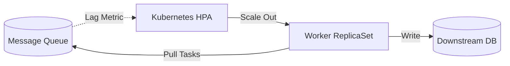
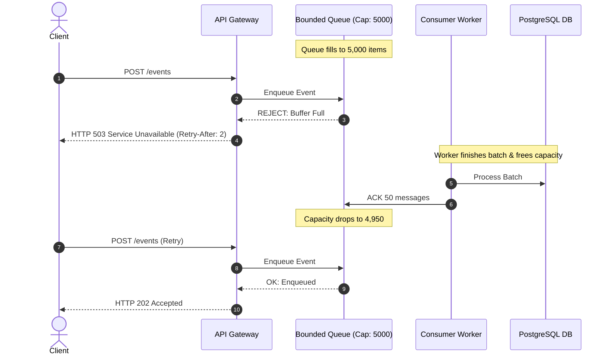
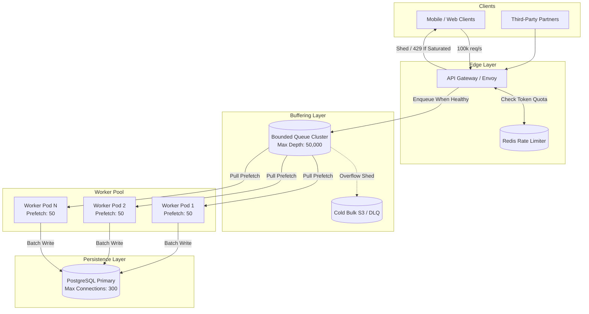

# Day 14 — Back Pressure: When Your System Can't Keep Up

> 🔗 **LinkedIn Discussion**: [Read & Discuss on LinkedIn](https://www.linkedin.com/in/himanshu-verma-822a07286/)  
> 🏛️ **System Architecture Milestone**: [`v4-async-workers`](../../../system-evolution/v4-async-workers/README.md)  
> 📖 **Phase 3**: Stop Making Everything Synchronous

---

## The Problem

On Day 12, we introduced message queues to buffer background work. On Day 13, we built idempotent consumers to survive redeliveries and network partitions. With asynchronous decoupling in place, **ShopScale** felt virtually indestructible.

Then came the annual Cyber Monday flash sale.

At 00:00 UTC, our marketing push triggered a massive wave of traffic across mobile apps, partner integrations, and browser clients. Telemetry, order events, and payment verification requests surged into our ingestion pipeline:

```text
Incoming Events:     100,000 / sec
Processing Capacity:  20,000 / sec
Net Accumulation:    +80,000 events / sec
```

Our API servers happily accepted every incoming HTTP request, published messages to our queue cluster, and returned `HTTP 202 Accepted` to customers within 15 milliseconds. P99 ingestion latency looked flawless on our public status page.

Behind the scenes, reality told a horrifying story:

* In **60 seconds**, the queue accumulated **4.8 million unprocessed messages**.
* In **10 minutes**, the queue accumulated **48 million messages**.
* At an average message payload size of 2 KB, the broker was storing an additional **96 GB of raw payload data every 10 minutes**, excluding index and broker metadata overhead.

```text
                 100,000 events/sec Surging In
                             │
                             ▼
               [ 50 Ingestion API Gateways ]
                             │
                             ▼
              ┌─────────────────────────────┐
              │ 💥 Message Broker Cluster   │
              │ Backlog: +80,000 msgs/sec   │
              │ Depth: 48,000,000 messages  │
              └──────────────┬──────────────┘
                             │
                             ▼
               [ Consumer Fleet (Max Cap) ]
                             │
                             ▼ (20,000 events/sec max)
               [ Relational DB / Third-Party APIs ]
```

### What Happened Next?

1. **Broker Throughput Collapse & Storage Thrashing**:
   * In queue-based brokers like **RabbitMQ**, reaching the memory high-watermark threshold triggered memory alarms that abruptly blocked upstream publisher connections while aggressively paging messages from RAM to disk. Disk I/O hit 100%, and broker ingestion plummeted from 100K/sec down to 8K/sec.
   * In log-based brokers like **Apache Kafka**, when consumers fall 48 million records behind, they can no longer read from the OS page cache in RAM. They are forced to fetch cold segments from physical disk. The resulting disk read/write contention degrades sequential I/O, slowing both writes and reads.
   * In in-memory brokers like **Redis (Streams / Lists)**, hitting `maxmemory` triggered immediate `OOM command not allowed` rejections or evicted critical state.
2. **Cascading Producer Blockage**: The API servers, unable to write to the choked message broker, had their outbound TCP write buffers fill up. In-flight HTTP request threads blocked waiting for queue publisher acknowledgments. Within 45 seconds, all API server thread pools exhausted their connection limits.
3. **The Lag Mirage**: Even if the broker hadn't crashed, an event pushed into the queue at minute 10 would sit behind 48 million prior messages. At a processing speed of 20,000/sec, that message would take **2,400 seconds (40 minutes)** to be read by a consumer. An order confirmation or fraud check arriving 40 minutes late is completely useless to an interactive user.
4. **Platform-Wide Blackout**: Front-end gateways began returning `HTTP 504 Gateway Timeout` and `HTTP 502 Bad Gateway`. The entire platform collapsed under its own weight.

The fundamental fallacy was assuming: **"The queue is an infinite buffer that decouples producers from consumer capacity."**

A queue does not create processing capacity. It only **defers** work. If your arrival rate ($\lambda$) persistently exceeds your departure rate ($\mu$), an unbounded buffer does not save you—it merely changes your crash from an immediate rejection into an uncontrolled, high-latency memory exhaustion catastrophe.

We need a way for overloaded downstream components to signal upstream systems to slow down, shed load, or halt. We need **Backpressure**.

---

## Why the Simple Approach Breaks

When engineering teams encounter this problem for the first time, they almost always reach for three intuitive fixes. Every single one fails under sustained load.

```text
       Naive Attempt 1                  Naive Attempt 2                  Naive Attempt 3
  "Make the Queue Bigger"           "Autoscale Consumers to ∞"        "Buffer in App Memory"
  ┌──────────────────────┐          ┌──────────────────────┐          ┌──────────────────────┐
  │ Increase broker disk │          │ Spin up 500 workers  │          │ Buffer incoming HTTP │
  │ & RAM allocation     │          │ to match 100K/sec    │          │ in local JVM / Go RAM│
  └──────────┬───────────┘          └──────────┬───────────┘          └──────────┬───────────┘
             │                                 │                                 │
             ▼                                 ▼                                 ▼
   Message lag reaches hours;        Downstream Database / Stripe      Node crashes with OOM;
   disk fills; broker crashes        collapses under 500 connections;  all buffered customer
   harder; recovery takes days.      entire system goes down.          orders vanish silently.
```

### 1. "Just Provision an Infinite Disk / Larger Queue"
"Storage is cheap. Let's configure Kafka or SQS with 10 TB of disk space and a 7-day retention window so messages are never dropped."

**Why it breaks:**
* **Consumer Lag Becomes Latency**: Queues are FIFO (First-In, First-Out). When a queue has 50 million messages ahead of it, newly arrived messages cannot jump the line. If a user is waiting for an SMS verification code, a password reset, or an inventory lock, receiving it 45 minutes later is functionally identical to total system failure.
* **Cold Storage Read Thrashing**: When queues grow past physical RAM limits, brokers must fetch old messages from NVMe/HDD storage while simultaneously writing new messages to disk. The disk heads and OS page caches thrash uncontrollably, slashing broker write performance and degrading consumers even further.
* **Prolonged MTTR (Mean Time to Recovery)**: When the spike finally subsides, the system must grind through the 50-million-message backlog before real-time operations resume. If consumers process at 20K/sec and normal incoming traffic is 15K/sec, the system recovers at a net rate of only 5K/sec. Clearing that 48-million backlog will take **over 2.6 hours of degraded operation**.

### 2. "Just Autoscale Consumers Horizontally"
"If we are receiving 100K events/sec and each worker handles 200 events/sec, let's configure Kubernetes Horizontal Pod Autoscaler (HPA) to scale our consumer fleet from 100 pods to 500 pods."

**Why it breaks:**
* **Moving the Bottleneck Downstream**: Consumers do not operate in a vacuum. Each consumer writes to a database, calls an internal inventory microservice, or executes an external API call (e.g., Stripe, SendGrid, Twilio). 
* **Connection Pool & Lock Exhaustion**: 500 worker pods spin up and open 20 database connections each, dumping 10,000 concurrent connections onto your primary PostgreSQL database. The database CPU spikes to 100% on lock contention and context switching. Queries that normally execute in 2ms now take 800ms.
* **Downstream Collapse**: The downstream database crashes completely. Now the consumers cannot process *any* messages. Processing capacity drops from 20K/sec to **0/sec**.
* **Third-Party Rate Limits**: If your workers call Stripe or an address validation API, those external vendors will instantly enforce their own strict rate limits (e.g., returning `HTTP 429 Too Many Requests`), forcing workers into exponential backoff retry loops that worsen the congestion.

### 3. "Buffer Requests in In-Memory Server Queues"
"If the broker is slowing down, let's buffer requests in memory on the API gateway using an in-memory queue (like a Go channel or Java `LinkedBlockingQueue`) before writing to the broker."

**Why it breaks:**
* **Unbounded Memory Allocation**: At 100K requests/sec, an in-process buffer consumes memory at dozens of megabytes per second.
* **Linux OOM-Killer**: Within seconds, the operating system's OOM-killer terminates the API gateway process abruptly.
* **Silent In-Flight Data Loss**: All requests sitting in memory on that terminated node vanish instantly without client notifications or logs.

---

## Understanding the Problem

To solve overload systematically, we need to understand the physics of queued systems and how backpressure operates across boundaries.

### 1. Little's Law and the Inevitability of Collapse

Queueing theory is governed by **Little's Law**:

$$L = \lambda \cdot W$$

Where:
* $L$ = Average number of items in the system (Queue Depth)
* $\lambda$ = Average arrival rate (Incoming throughput)
* $W$ = Average time an item spends in the system (Latency)

For a stable system, the processing capacity ($\mu$) must strictly exceed the arrival rate ($\lambda$):

$$\rho = \frac{\lambda}{\mu} < 1$$

When $\lambda = 100{,}000$ and $\mu = 20{,}000$, the utilization factor $\rho = 5.0$. The system is **non-stationary**. 

Queue depth ($L$) grows toward infinity at the rate of $(\lambda - \mu)$ per unit time. Because $W = \frac{L}{\mu}$, latency ($W$) also approaches infinity. **There is no algorithmic trick that allows a system with $\lambda > \mu$ to remain stable without shedding or throttling traffic.**

```text
System State    Arrival vs Capacity   Queue Depth (L)      Latency (W)     Stability
───────────────────────────────────────────────────────────────────────────────────────
Under-capacity  λ < μ (e.g. 15k < 20k) Flat / Fluctuating   Low & Bounded   Stable
At-capacity     λ = μ (e.g. 20k = 20k) Unstable Drift       High Variance   Fragile
Overloaded      λ > μ (e.g. 100k > 20k) Monotonic +80k/sec  Explodes to ∞   CATASTROPHIC
```

### 2. What Is Backpressure?

**Backpressure is a feedback mechanism where a downstream consumer signals an upstream producer to reduce its sending rate to match downstream capacity.**

Think of a physical plumbing system: if a narrow drain pipe cannot drain water fast enough, water fills the pipe upward, creating physical pressure that resists incoming flow. In distributed software, networks and asynchronous queues break this physical coupling. Unless we deliberately engineer flow-control signals, upstream systems remain blissfully ignorant of downstream agony until the entire pipeline collapses.

```text
WITHOUT BACKPRESSURE (Open Loop - Fire and Forget):
[Fast Producer: 100k/s] ──► [Unbounded Queue: +80k/s] ──► [Slow Consumer: 20k/s]
                                     │
                                     ▼ (Queue grows until OOM / crash)
                             💥 SYSTEM DIES

WITH BACKPRESSURE (Closed Loop - Feedback Controlled):
[Producer: 100k/s] ──► [Rate Limit / Shed: 80k/s Rejected]
        │
        ▼ (Only 20k/s allowed through)
[Bounded Queue: Depth <= 5,000] ──► [Consumer: 20k/s]
        ▲                                    │
        └──────── Feedback Signal ───────────┘
               (Slow down / Wait / 429)
```

### 3. Push vs. Pull Semantics

The communication model dictates where backpressure naturally lives:

* **Push Models (Inherently Vulnerable)**: The producer decides when to send data. Webhooks, Server-Sent Events (SSE), and naive socket listeners push data to the consumer. If the consumer is slow, its operating system network buffers fill up, memory balloons, and it crashes. Push models require explicit signaling protocols (like TCP sliding windows or reactive stream signals) to pause the sender.
* **Pull Models (Naturally Bounded Consumer)**: The consumer decides when to request data. The consumer asks: *"Give me up to 50 messages."* It processes them, acknowledges them, and only then asks for the next 50. The consumer is **naturally protected from dying**. However, the problem hasn't vanished—it has simply migrated upstream to the queue broker buffering the delta.

---

## Possible Approaches

When incoming traffic overwhelms processing capacity, there are four fundamental architectural levers you can pull:

```text
                             Incoming Surge (100K/sec)
                                         │
        ┌───────────────────┬────────────┴───────┬───────────────────┐
        ▼                   ▼                    ▼                   ▼
 1. Scale Consumers   2. Rate Limiting    3. Load Shedding    4. Explicit Bounded
    (Increase μ)         (Cap λ at Edge)     (Drop Excess λ)      Backpressure
```

---

### Approach 1: Consumer Horizontal Autoscaling

#### How It Works
Dynamically scale the worker pool using Kubernetes HPA or cloud autoscaling groups based on **Queue Backlog / Consumer Lag** metrics rather than raw CPU/Memory utilization. 

A target metric formula dictates the desired replica count:

$$\text{Desired Replicas} = \left\lceil \frac{\text{Current Queue Lag}}{\text{Target Processing Time Per Worker} \times \text{Acceptable Latency Window}} \right\rceil$$



#### Where It Helps
* Absorbs short, transient bursts where downstream dependencies (databases, external services) have idle capacity headroom.
* Workloads where processing is purely CPU-bound (e.g., video transcoding, image resizing, cryptographic hashing) and does not bottleneck on a single shared stateful resource.

#### Limitations
* **The Downstream Hard Ceiling**: You can only scale consumers until your shared database, network switch, or third-party API saturates. If PostgreSQL can only sustain 5,000 write transactions/sec, scaling consumers from 20 to 200 just causes lock contention, deadlocks, and connection timeouts.
* **Autoscaling Lag**: Spinning up new container pods or VM instances takes between 30 seconds and 3 minutes (pulling container images, running runtime initializations, warming caches). A 100K/sec spike will flood a queue with 10 million messages before the first new worker pod runs its first cycle.

#### When It Makes Sense
When the downstream dependencies have substantial unutilized headroom and the workload can be fully parallelized across independent partitions.

---

### Approach 2: Edge Rate Limiting (Token Bucket / Leaky Bucket)

#### How It Works
Enforce hard ingestion limits at the API Gateway or reverse proxy before events ever reach your message queues or internal networks. 

Using algorithms like **Token Bucket** or **Leaky Bucket** backed by Redis or local gateway memory, incoming requests that exceed allowed quotas are immediately terminated with `HTTP 429 Too Many Requests`.

```text
Incoming Request ──► [ Token Bucket Filter ]
                           │
             ┌─────────────┴─────────────┐
             ▼                           ▼
      Tokens Available?           No Tokens Left?
             │                           │
             ▼                           ▼
    [ Allow to Queue ]           [ Return HTTP 429 ]
                                 Header: Retry-After: 5
```

#### Where It Helps
* Protects the entire internal infrastructure (gateways, brokers, databases) from being overwhelmed.
* Stops malicious actors, buggy client retry loops, and DDOS spikes right at the perimeter.
* Provides clear economic predictability for API operational costs.

#### Limitations
* **Equal-Opportunity Rejection**: Naive rate limiting treats all requests equally. A high-value `$2,000` checkout order may get rejected while a `$2` browsing telemetry ping slips through simply because of arrival timing.
* **Requires Client Cooperation**: If clients ignore the `HTTP 429` and immediately retry in tight loops without exponential backoff, rate limiting gateways spend massive CPU cycles just rejecting requests.

#### When It Makes Sense
At the edge of public-facing APIs, partner endpoints, and untrusted ingress boundaries.

---

### Approach 3: Intelligent Load Shedding & Drop Policies

#### How It Works
When a system is overloaded, **it is better to do a fraction of the work with 100% success than to accept all work and fail 100% of it**. 

Load shedding evaluates system health (CPU, memory, queue depth, or response latency) and deliberately drops or rejects lower-priority work to keep core business operations alive.

```text
Incoming Load (100K/sec)
           │
           ▼
┌───────────────────────────────────────────────┐
│ Load Shedding Classifier                     │
├───────────────────────────────────────────────┤
│ Tier 1 (Critical): Orders & Payments (15K/s)  │ ──► [ ACCEPT & PROCESS ]
│ Tier 2 (Standard): Account Updates   (10K/s)  │ ──► [ CONDITIONAL DROP ]
│ Tier 3 (Optional): Analytics & Logs  (75K/s)  │ ──► [ 💥 SHED IMMEDIATELY ]
└───────────────────────────────────────────────┘
```

Load shedding employs three primary drop strategies:

1. **Priority-Based Shedding**: Classify traffic into tiers (Critical, High, Best-effort). Under duress, drop all Tier 3 traffic, throttle Tier 2, and guarantee resources for Tier 1.
2. **CoDel (Controlled Delay) / Tail Drop**: Reject incoming messages when queue wait times exceed an acceptable threshold. If an item has waited longer than its useful lifetime, executing it wastes resources.
3. **Dead Letter Queue (DLQ) Offloading**: Divert excess volume into a secondary, cold storage location (like AWS S3 or a bulk DLQ) for deferred asynchronous batch processing during off-peak hours.

#### Where It Helps
* Keeps mission-critical revenue-generating transactions running smoothly even when the system is under 5x normal peak load.
* Prevents total system blackouts by shedding discretionary work.

#### Limitations
* Requires explicit business classification of what data can be dropped or delayed.
* Discarded messages represent lost telemetry or deferred user experiences.

#### When It Makes Sense
Inside core application services, event routing pipelines, and worker queues when incoming load exceeds the maximum possible physical capacity of the underlying infrastructure.

---

### Approach 4: Bounded Buffers with Explicit Backpressure Propagation

#### How It Works
1. **Never allow an unbounded queue anywhere in the system.** Every queue must have a hard maximum capacity (e.g., maximum 10,000 items).
2. **Workers control consumption via strict prefetch limits.** A worker never allows more than $N$ in-flight messages (e.g., `prefetch_count = 20`).
3. **When the queue reaches capacity, the producer is blocked or rejected.** The queue refuses additional writes. This forces the API gateway to slow down or return `HTTP 429 / 503` directly to the client.



#### Where It Helps
* Creates a self-stabilizing system where resource consumption (memory, file descriptors, thread pools) has a deterministic upper bound.
* Fails fast: clients are informed immediately that the system is busy, rather than hanging for 40 minutes on an unresponsive queue.

#### Limitations
* Upstream callers must be built to handle synchronous rejections gracefully.
* May require complex tuning of prefetch sizes and buffer limits across the pipeline.

#### When It Makes Sense
In internal microservice-to-microservice communication, message queue worker pools, and streaming ingestion systems.

---

## Trade-offs

There is no single magic setting that makes an arrival rate of 100K/sec fit into a 20K/sec engine. Architectural maturity lies in choosing **how and where to fail gracefully**.

| Strategy | Primary Mechanism | Data Loss Risk | Latency Impact | Downstream Protection | Implementation Complexity |
|---|---|---|---|---|---|
| **Unbounded Buffering** *(Anti-Pattern)* | Store everything in disk/RAM queues | 💥 Critical (OOM crash / broker failure) | Catastrophic (Lag grows to hours) | ❌ None (eventually crushes DB) | 🟢 Trivial (default settings) |
| **Consumer Autoscaling** | Spin up worker instances dynamically | 🟢 None (retains all data) | 🟡 Medium (temporary lag during spin-up) | ❌ Poor (easily overloads DB/APIs) | 🟡 Moderate (K8s HPA, metrics) |
| **Perimeter Rate Limiting** | Reject requests exceeding quota at gateway | 🟡 High for rejected requests | 🟢 Zero (prevents queue buildup) | 🟢 Excellent (traffic capped at source) | 🟡 Moderate (Redis token bucket) |
| **Priority Load Shedding** | Discard low-priority events when stressed | 🟡 Controlled (non-critical data dropped) | 🟢 Excellent for high-priority traffic | 🟢 High (keeps workers at max throughput) | 🔴 Complex (classification logic) |
| **Bounded Backpressure** | Propagate resistance upstream via flow control | 🟢 Minimal if clients retry with backoff | 🟢 Low (predictable wait times) | 🟢 Maximum (system never exceeds limit) | 🔴 Complex (end-to-end integration) |

### The Core Trade-Off: Latency vs. Availability vs. Completeness
* If you refuse to drop data (**100% Completeness**), your only choice is to queue it, causing **Latency to degrade to infinity**, which eventually destroys **Availability**.
* If you want predictable **Latency** and high **Availability**, you must sacrifice **Completeness** during extreme peaks via rate limiting or load shedding.

---

## A Practical Example: ShopScale Ingestion Pipeline

Let's look at how **ShopScale** implements end-to-end backpressure to handle our 100K/sec flash sale surge without collapsing.

### System Architecture



---

### Component 1: Consumer with Bounded Prefetch and Pull Loop

A common mistake in queue consumers is registering an unconstrained push listener. In Python or Go, if your consumer does not set a prefetch limit, the broker dumps thousands of unacknowledged messages into the consumer process memory:

```python
# consumer.py: Production-grade worker with bounded pull and prefetch control
import pika
import time
import logging

logging.basicConfig(level=logging.INFO)
logger = logging.getLogger("worker")

def process_order(order_payload):
    """
    Simulates database writes and third-party API interactions.
    Processing takes ~5ms per order = 200 orders/sec per worker thread.
    """
    time.sleep(0.005)

def main():
    connection = pika.BlockingConnection(pika.ConnectionParameters(host='localhost'))
    channel = connection.channel()

    # Declare a bounded durable queue
    channel.queue_declare(
        queue='orders_stream',
        durable=True,
        arguments={
            'x-max-length': 50000,             # Cap queue depth at 50,000 messages
            'x-overflow': 'reject-publish'      # Signal backpressure directly to publisher!
        }
    )

    # CRITICAL: Bounded Prefetch (QoS)
    # Never allow the broker to push more than 50 unacknowledged messages to this process.
    # Without this, the worker pulls 10,000 messages into RAM and dies of OOM.
    channel.basic_qos(prefetch_count=50)

    def on_message_callback(ch, method, properties, body):
        try:
            process_order(body)
            # Acknowledge only after durable processing
            ch.basic_ack(delivery_tag=method.delivery_tag)
        except Exception as e:
            logger.error(f"Processing failed: {e}")
            # Negative acknowledge with dead-letter routing
            ch.basic_nack(delivery_tag=method.delivery_tag, requeue=False)

    channel.basic_consume(
        queue='orders_stream',
        on_message_callback=on_message_callback,
        auto_ack=False
    )

    logger.info("Worker started with prefetch_count=50. Waiting for messages...")
    try:
        channel.start_consuming()
    except KeyboardInterrupt:
        channel.stop_consuming()
        connection.close()

if __name__ == "__main__":
    main()
```

---

### Component 2: API Gateway Priority Load Shedder

When the queue approaches its safe upper watermark, the API gateway immediately begins dropping discretionary traffic before the queue hits hard failure:

```python
# gateway_load_shedder.py: Priority-based admission control
from enum import IntEnum

class Priority(IntEnum):
    CRITICAL = 1   # Checkout, Payment capture
    STANDARD = 2   # Inventory update, User profile
    DISCRETIONARY = 3 # Analytics, Clickstream, Recommendations

class AdaptiveLoadShedder:
    def __init__(self, queue_client, max_capacity=50000):
        self.queue_client = queue_client
        self.max_capacity = max_capacity

    def should_admit(self, request_priority: Priority) -> tuple[bool, str]:
        current_depth = self.queue_client.get_queue_depth("orders_stream")
        fill_ratio = current_depth / self.max_capacity

        # Stage 1: Healthy Operation (< 70% capacity)
        if fill_ratio < 0.70:
            return True, "ADMITTED"

        # Stage 2: Warning Zone (70% - 85% capacity) -> Shed Discretionary
        if 0.70 <= fill_ratio < 0.85:
            if request_priority == Priority.DISCRETIONARY:
                return False, "SHED_DISCRETIONARY_LOAD"
            return True, "ADMITTED"

        # Stage 3: Critical Zone (85% - 95% capacity) -> Shed Standard and Discretionary
        if 0.85 <= fill_ratio < 0.95:
            if request_priority in (Priority.DISCRETIONARY, Priority.STANDARD):
                return False, "SHED_NON_CRITICAL_LOAD"
            return True, "ADMITTED_CRITICAL_ONLY"

        # Stage 4: Emergency Circuit Breaker (> 95% capacity) -> Shed Everything to save infrastructure
        return False, "SYSTEM_SATURATED_EMERGENCY_SHED"

# Example Usage in an HTTP Route Handler
def handle_incoming_request(request, shedder: AdaptiveLoadShedder):
    priority = classify_request_priority(request.path)
    admitted, reason = shedder.should_admit(priority)

    if not admitted:
        return {
            "status": 503,
            "headers": {
                "Retry-After": "5",
                "X-Load-Shed-Reason": reason
            },
            "body": {"error": "System under high load. Please retry shortly."}
        }

    # Safe to forward to message queue
    enqueue_success = publish_to_queue(request.payload)
    if not enqueue_success:
        return {"status": 503, "body": {"error": "Queue rejected write"}}

    return {"status": 202, "body": {"status": "Accepted"}}

def classify_request_priority(path: str) -> Priority:
    if path.startswith("/api/v1/checkout"):
        return Priority.CRITICAL
    if path.startswith("/api/v1/cart"):
        return Priority.STANDARD
    return Priority.DISCRETIONARY
```

---

## Failure Scenarios: What Can Still Go Wrong

Even when you configure rate limiting, bounded queues, and load shedding, complex distributed systems find creative ways to break.

```text
                               Common Failure Modes
                                         │
        ┌───────────────────┬────────────┴───────┬───────────────────┐
        ▼                   ▼                    ▼                   ▼
1. The Retry Storm   2. Poison Pills     3. Visibility Lag    4. Metastable
   (Amplification)      (HoL Blocking)      Amplification        Deadlock
```

### 1. The Client Retry Storm (Amplification Attack)
When your gateway sheds load and returns `HTTP 503 Service Unavailable`, what does the client do?
If client libraries are poorly configured, thousands of mobile devices and web browsers **retry immediately**. 

```text
Attempt 1 (Original Surge):  100,000 req/s  ──► 80,000 Shed (HTTP 503)
                                                     │
Attempt 2 (Immediate Retry): 100,000 req/s + 80,000 retries = 180,000 req/s!
```

Within 10 seconds, incoming traffic doubles to 200K/sec. Your gateway spends 100% of its CPU parsing TLS handshakes and serializing JSON error messages, causing the edge gateways themselves to crash.

* **Mitigation**: 
  * Always return a `Retry-After` header.
  * Enforce **Exponential Backoff with Full Jitter** on all client SDKs:
    $$\text{Sleep Time} = \text{random}(0, \min(\text{MaxBackoff}, \text{Base} \times 2^{\text{attempt}}))$$
  * Drop traffic at the reverse proxy (e.g., NGINX/Envoy) before it reaches application runtimes.

### 2. Poison Pill Messages and Head-of-Line (HoL) Blocking
A malformed or unexpected payload causes the consumer worker to crash or throw an unhandled exception before acknowledging the message.

If the broker is configured to immediately redeliver unacknowledged messages to the head of the queue:
1. Worker A pulls message #1 $\to$ crashes.
2. Broker redelivers message #1 to Worker B $\to$ Worker B crashes.
3. Within 2 seconds, all 100 worker pods crash in a continuous loop.
4. While workers repeatedly crash on message #1, millions of healthy messages behind it are completely blocked.

* **Mitigation**: 
  * Set a maximum redelivery attempt count (`max-delivery-attempts: 3`).
  * Route failing payloads to a **Dead Letter Queue (DLQ)** after 3 failed attempts, allowing workers to proceed to healthy messages.

### 3. Visibility Timeout & Lease Thrashing
In lease-based queue systems (such as **AWS SQS visibility timeouts**, **GCP Pub/Sub acknowledgment deadlines**, or **Azure Service Bus message locks**), a consumer is granted a temporary lease window to process and acknowledge the message before the broker assumes the worker died and offers it to another consumer.

Suppose your visibility timeout is set to 30 seconds. Under heavy load, your database slows down, and a worker takes **32 seconds** to process an event:
1. At second 30, the broker's visibility timer expires. The broker assumes the worker crashed and redelivers the message to a second worker.
2. The second worker starts processing the exact same message.
3. At second 32, the first worker finishes and tries to commit its transaction and acknowledge the message.
4. Both workers are now doing duplicate work, **doubling the computational load on the already struggling database**. Even worse, in AWS SQS, the first worker's `DeleteMessage` call might fail if the receipt handle expired, while the second worker repeats the entire operation.

* **Mitigation**: 
  * **Heartbeat / Visibility Extension**: Long-running workers must run a background heartbeat thread to periodically extend the lease with the broker (e.g., calling `ChangeMessageVisibility` in SQS or `modifyAckDeadline` in GCP Pub/Sub).
  * **Safety Margin**: Size your default visibility timeout to at least $3 \times$ to $5 \times$ your steady-state P99 processing latency.

### 4. Metastable Failure States
A metastable failure occurs when a transient spike pushes the system into an inefficient failure state that **persists even after the traffic spike completely subsides**.

For example, when consumers fall severely behind, queue metadata lookups, garbage collection pauses, and connection retries consume so many CPU cycles that effective consumer throughput drops from 20K/sec to 2K/sec. Even when incoming traffic drops back to a normal 10K/sec, the system cannot clear the backlog or recover on its own.

* **Mitigation**: 
  * Build emergency administrative "dump valves" to flush non-critical queues into cold bulk storage (S3) with a single command.
  * Reset the state of the broker rather than waiting for it to chew through an unrecoverable backlog.

---

## Key Engineering Decisions

When designing for overload protection, use this architectural decision tree:

```text
                           Is incoming rate λ > processing capacity μ?
                                               │
                                  ┌────────────┴────────────┐
                                 YES                        NO
                                  │                         │
                     Is the burst short & temporary?   Normal Flow
                                  │                     (Prefetch QoS)
                     ┌────────────┴────────────┐
                    YES                        NO
                     │                         │
         Can downstream DB scale?     Can data be dropped or delayed?
                     │                         │
            ┌────────┴────────┐       ┌────────┴────────┐
           YES                NO     YES                NO
            │                 │       │                 │
      Autoscale Workers   Apply Rate  Priority Load    Bounded Queue +
      via Queue Metric    Limiting at Shedding at      Synchronous 429
                          the Edge    Gateway / Queue  Backpressure
```

### The Rules of Backpressure Engineering

1. **Every Queue Must Be Bounded**: Never instantiate an in-memory queue, channel, or message broker queue without an explicit maximum capacity. If you don't pick a boundary, your operating system will pick one for you when it runs out of memory.
2. **Pull Beats Push for Consumer Protection**: Always design consumers to pull work based on explicit capacity (`basic_qos / prefetch_count`). Never let an upstream broker push an unbounded firehose into worker memory.
3. **Fail Fast at the Perimeter**: Do not accept a request that you know you cannot process. It is far better to return `HTTP 429` in 2 milliseconds than to accept the request, store it in an overloaded queue, and fail it silently 40 minutes later.
4. **Degrade Gracefully via Priority Shedding**: When disaster strikes, sacrifice the nice-to-haves (analytics, recommendation syncs, promotional emails) to preserve core business functionality (checkouts, payments, security auth).
5. **Always Add Jitter to Retries**: Never send an error response without expecting retries. Mandate exponential backoff with full randomization across all upstream callers.

---

## Key Takeaways

1. **Queues do not create capacity; they only defer work.** An unbounded queue transforms a brief traffic surge into a catastrophic, high-latency memory exhaustion event.
2. **Backpressure is flow control.** It is the closed-loop mechanism that forces upstream producers to respect the physical throughput limits of downstream consumers.
3. **Consumer autoscaling has a hard ceiling.** You can only scale workers until your shared relational database, network bandwidth, or third-party APIs saturate.
4. **Shedding load is an act of survival.** Under severe overload, serving 20% of traffic with 100% success is infinitely better than serving 100% of traffic with 0% success.
5. **A bounded queue combined with HTTP 429/503 is a feature, not a bug.** Rejecting excess traffic immediately protects system invariants and gives clients an actionable signal to back off.

---

### 🧭 Navigation & Next Steps
* Read the previous guide: **[Day 13 — Exactly Once Is Not What You Think: Delivery Guarantees & Idempotency](../day-13-exactly-once-myth/README.md)**
* Read the next guide: **[Day 15 — Surviving Traffic Spikes: Thundering Herds & Circuit Breakers](../day-15-surviving-traffic-spikes/README.md)**
* View the architecture milestone: [`v4-async-workers`](../../../system-evolution/v4-async-workers/README.md)
