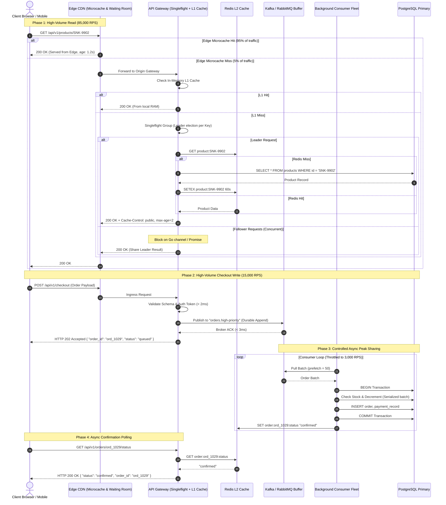

# Day 15 — Designing a System That Can Survive Spikes

> 🔗 **LinkedIn Discussion**: [Read & Discuss on LinkedIn](https://www.linkedin.com/in/himanshu-verma-822a07286/)  
> 🏛️ **System Architecture Milestone**: [`v4-async-workers`](../../../system-evolution/v4-async-workers/README.md)  
> 📖 **Phase 3**: Stop Making Everything Synchronous  
> 🎯 **Phase 3 Capstone**: The System Is Now Asynchronous & Resilient to Uneven Traffic

---

## The Problem

On Day 11, we stopped doing heavy work inside user HTTP requests. On Day 12, we introduced message queues to buffer background tasks. On Day 13, we made our consumers strictly idempotent to survive network retries. And on Day 14, we bounded our buffers and introduced backpressure so our workers wouldn't drown.

Our e-commerce platform, **ShopScale**, now handled steady-state traffic of 10,000 requests per second (RPS) with rock-solid stability. Our average P99 API response time hovered at a crisp 18 milliseconds.

Then came the celebrity flash drop.

At 12:00:00 UTC, an influencer with 40 million followers posted an exclusive link to a limited-edition sneaker release on our platform. Within four seconds, traffic did not grow—it detonated:

```text
Baseline Steady State:      10,000 requests / sec
Peak Surge (T + 4s):       100,000 requests / sec (10× Instantaneous Jump)
Target SKU:                94% of all traffic targeted SKU #SNK-9902
```

What followed was a total architectural chain reaction:

```text
             100,000 req/sec Instantaneous Spike
                             │
                             ▼
              [ Cloud Load Balancers (ALB) ]
                             │
            ┌────────────────┴────────────────┐
            ▼                                 ▼
   [ API Node Fleet (40 pods) ]      [ API Node Fleet (New Pods) ]
   CPU instantly hits 100%           Autoscaler triggers...
   Thread pools saturated            Status: Pending container pull (2-4 min lag)
            │
            ├───────────────────────────────────────────────────────┐
            ▼ (Read Requests: 85,000 RPS)                           ▼ (Write/Checkout: 15,000 RPS)
   [ Redis Cluster (Hot Key) ]                             [ Ingestion Message Broker ]
   Single Redis shard hosts #SNK-9902                      15,000 checkout msgs/sec dumped in.
   CPU hits 100% on single-thread core.                    Worker fleet pulls messages at 3,000/sec.
   Connections timeout -> Cache MISS fallthrough!          Queue backlog explodes by +12,000 msgs/sec.
            │                                                       │
            ▼                                                       ▼
   [ PostgreSQL Primary DB ]                               [ PostgreSQL Primary DB ]
   85,000 cache-stampede queries hit disk.                 15,000 concurrent transactions attempt
   Connection pool (max 500) exhausted in 300ms.           row locks on SKU #SNK-9902 inventory!
   Deadlocks spike; IOPS max out; CPU freezes.             Row lock contention halts the DB engine.
            │                                                       │
            └─────────────────────────┬─────────────────────────────┘
                                      ▼
                        💥 COMPLETE SYSTEM COLLAPSE
                   HTTP 502 / 504 across all endpoints
```

Within 20 seconds:
1. **The Ingress Saturated**: API server worker pools running on Node.js, Go, and Python thread pools were tied up waiting on database socket connections. Incoming TCP connections overflowed the OS `listen` backlog queue (`SYN` drops).
2. **The Cache Evaporated Under a Hot Key**: Redis is single-threaded per shard. When 80,000 concurrent requests targeted the exact same product cache key, the network interface card (NIC) and Redis CPU core saturated. Latencies rose from 0.8ms to 450ms. Client timeouts triggered, causing requests to fall through directly to the database.
3. **The Database Experienced a Thundering Herd**: Tens of thousands of identical queries (`SELECT * FROM products WHERE id = 'SNK-9902'`) slammed the PostgreSQL primary and read replicas simultaneously. The database crashed before the read replicas could even register the load.
4. **Row-Level Lock Starvation**: The remaining 15,000 write requests were checkouts attempting `UPDATE inventory SET stock = stock - 1 WHERE id = 'SNK-9902' AND stock > 0`. Because every single request targeted the *same database row*, every transaction queued sequentially behind a single row-level exclusive lock. Transaction queues swelled, memory blew up, and the database ground to an absolute halt.
5. **Autoscaling Arrived Too Late**: Kubernetes Horizontal Pod Autoscaler (HPA) detected high CPU at $T + 30\text{s}$ and requested 120 new pods. The cloud provider took 90 seconds to provision worker nodes, pull the Docker image, and run application health checks. By the time the new instances joined the cluster at $T + 3\text{m}$, the database was dead, the broker was unresponsive, and the flash sale was already over.

The system did not fail because it had too little compute. It failed because **instantaneous, highly concentrated spikes break every assumption of steady-state distributed design**.

---

## Why the Simple Approach Breaks

When developers realize their system cannot survive a 10× jump, they reach for three predictable remedies. In production, each of them makes the failure worse.

```text
       Approach 1                       Approach 2                       Approach 3
  "Rely on Autoscaling"           "Make the DB Bigger"             "Cache Everything in Redis"
  ┌──────────────────────┐        ┌──────────────────────┐         ┌──────────────────────┐
  │ HPA scales pods      │        │ Upgrade to 128-core  │         │ Store product data   │
  │ from 40 to 200       │        │ db.m6i.32xlarge      │         │ in Redis cache       │
  └──────────┬───────────┘        └──────────┬───────────┘         └──────────┬───────────┘
             │                               │                                │
             ▼                               ▼                                ▼
   Cold start takes 3 min;         Row-lock serialization on        Hot-key saturates single
   200 pods dump 10,000 new        1 SKU is physical; CPU sits      Redis shard core; cache
   connections onto dead DB.       idle while locks queue up.       misses stampede DB anyway.
```

### 1. "Autoscaling Will Absorb the Spike"
"We have cloud autoscaling configured. If CPU exceeds 70%, our cluster adds nodes automatically."

**Why it breaks:**
* **Autoscaling has severe latency**: Autoscaling is a **reactive** metric loop. The metric must breach a threshold for a sustained window (typically 1 to 3 minutes to prevent flapping). The cloud control plane must allocate a virtual machine, attach storage volumes, pull container images, run initialization scripts, and pass health checks. Total elapsed time: **3 to 7 minutes**.
* A traffic spike happens in **seconds**. If your traffic surges from 10k to 100k RPS in 4 seconds, your system will live in total catastrophic overload for over 180 seconds before a single new container serves a single byte.
* **The Connection Avalanche**: When 150 new pods finally come online simultaneously, their first action is to initialize database connection pools, cache clients, and broker channels. Instead of relieving pressure, the newly spawned pods unleash an "avalanche effect" that delivers the final fatal blow to the already struggling database.

### 2. "Scale Up the Database (Vertical Scaling)"
"Let's provision an AWS RDS instance with 128 vCPUs, 512 GB RAM, and 64,000 Provisioned IOPS."

**Why it breaks:**
* **Amdahl's Law and Row Contention**: Scaling up hardware adds more CPU cores and memory channels. But when 90% of requests are attempting to purchase or inspect the *same* item, they must modify the *same* database row. Row-level locks in relational databases (such as InnoDB or Postgres MVCC) are strictly serialized. 128 cores cannot update one physical memory address in parallel; 127 cores will sit idle in spinlocks or context-switch overhead while waiting for the mutex to release.
* **Cost Inefficiency**: Paying $15,000/month for a monstrous database tier that is 95% idle 364 days a year just to survive an occasional 10-minute traffic spike destroys unit economics.

### 3. "Just Cache Everything in Redis"
"The database shouldn't handle reads during a spike. Put everything into a Redis cluster."

**Why it breaks:**
* **The Hot-Key Dilemma**: Redis clusters distribute data across shards using consistent hashing on the key (e.g., `CRC16(key) % 16384`). When 95,000 requests per second ask for the *same key* (`product:SNK-9902`), 100% of that traffic is routed to **one single Redis node and one single CPU core**. The cluster has 30 nodes, but 29 nodes sit at 1% CPU while the single node hosting that key saturates its network interface and drops packets.
* **The Thundering Herd (Cache Stampede)**: If that key expires, or if the single Redis node stumbles and drops connection for even 500ms, all 95,000 incoming requests discover a cache miss simultaneously. They all bypass the cache and race to the database to reload the key. The database collapses instantly under the stampede.

---

## Understanding the Problem

To engineer a system that does not collapse under sudden traffic shocks, we must isolate the physics of spike propagation.

```text
Steady State Traffic                    Spike Shock (Flash Sale / Breaking News)
────────────────────                    ────────────────────────────────────────
• Dispersed across thousands of keys    • Concentrated on 1 to 5 "hot" keys
• Uniform temporal distribution         • Step-function arrival curve (t = 0)
• Arrival rate λ < Max Capacity μ       • Arrival rate λ >> Max Capacity μ (by 5x - 10x)
• Autoscaler can track gentle slope     • Autoscaler lag renders it completely useless
```

### 1. The Asymmetry of Reads vs. Writes Under Spikes

Spike traffic is never purely reads or purely writes. It is a toxic mix of both, each requiring an entirely different defensive posture:

| Traffic Class | Characteristic in a Spike | System Vulnerability | Architectural Goal |
|---|---|---|---|
| **Read Traffic** (80-95%) | Millions of users refreshing the same landing page, product view, or news post. | Hot-key cache node saturation; cache stampedes hitting origin DB. | **Collapse to zero origin hits**: Never let the spike touch the database or internal services. |
| **Write Traffic** (5-20%) | Thousands of users clicking "Place Order" or "Vote" on the same inventory. | Database row-lock serialization; connection pool exhaustion; payment gateway throttling. | **Temporal smoothing (Peak Shaving)**: Buffer writes durably and consume at a strictly controlled rate. |

### 2. Peak Shaving: Transforming a Spike into a Plateau

The fundamental mathematical insight of asynchronous resilience is **Peak Shaving**. 

You cannot alter the total volume of work during an event, but you **can alter the time domain over which that work is executed**.

```text
Without Peak Shaving (Synchronous):
Throughput
  ▲
  │       ▲  100,000 req/sec (Spike crashes DB & third-party APIs)
  │      ╱ ╲
  │     ╱   ╲
  │────╱─────╲──────────────── Maximum System Capacity (20,000 req/sec)
  │   ╱       ╲
  └──┴─────────┴──────────────► Time
     Crash occurs here

With Peak Shaving (Buffered Ingestion):
Throughput
  ▲
  │   ┌───────────────────────┐ Ingestion accepts 100k/sec to durable queue (< 5ms)
  │   │                       │
  │───┼───────────────────────┼── Worker Processing Rate (Capped at 18,000 req/sec)
  │   │   Smoothed Plateau    │
  │   │   (Buffer Drains)     │ Work processed safely over minutes without crashing DB
  └───┴───────────────────────┴──► Time
```

If 100,000 customers submit an order over a 30-second window, a synchronous system tries to execute 100,000 database writes, fraud checks, and payment authorizations within those 30 seconds. It crashes.

An asynchronous system decouples **intake** from **processing**:
1. It validates the request payload and checks broad preconditions in memory.
2. It commits the intent to an append-only, durable ingestion log in under 5 milliseconds.
3. It replies with `HTTP 202 Accepted` and a polling/webhook token.
4. Downstream workers process the orders at an optimal, non-destructive rate of 15,000/sec over the next 6.6 minutes.

The database never sees 100,000 operations per second; it sees a perfectly flat, safe plateau of 15,000 operations per second.

---

## Possible Approaches

Surviving a 10× traffic spike requires multi-layered defensive engineering across the entire request path: Edge $\rightarrow$ Ingress $\rightarrow$ Application $\rightarrow$ Cache $\rightarrow$ Storage.

```text
             [ Incoming 100,000 RPS Spike ]
                           │
 1. Edge Defense           ▼
 ┌─────────────────────────────────────────────────────┐
 │ CDN Stale-While-Revalidate / Edge Microcaching      │ ──► Absorbs 95% of reads
 └─────────────────────────┬───────────────────────────┘
                           │ 5,000 Read Misses + 15,000 Writes
 2. Ingress Gatekeeper     ▼
 ┌─────────────────────────────────────────────────────┐
 │ Virtual Waiting Room & Token-Bucket Rate Limiter    │ ──► Bounds active concurrency
 └─────────────────────────┬───────────────────────────┘
                           │
 3. Application Tier       ▼
 ┌─────────────────────────────────────────────────────┐
 │ Singleflight Mutex & Multi-Tier Local Caching       │ ──► Prevents Cache Stampedes
 └─────────────────────────┬───────────────────────────┘
                           │ Controlled Writes (< 15,000 RPS)
 4. Asynchronous Core      ▼
 ┌─────────────────────────────────────────────────────┐
 │ Priority Queues, Peak Shaving & Circuit Breakers    │ ──► Protects DB & downstream
 └─────────────────────────────────────────────────────┘
```

---

### Approach 1: Multi-Tier Caching with Near-Memory (L1) & Edge Microcaching

#### How It Works
Instead of relying solely on a remote Redis cluster (L2), introduce an in-process local cache (L1) directly inside the API gateway memory (e.g., using Ristretto in Go, Caffeine in Java, or an LRU with high-performance memory alignment) combined with Edge CDN microcaching.

* **Edge Microcaching (TTL = 1-3 seconds)**: At Cloudflare, Fastly, or NGINX edge layers, cache the hot product details for just 2 seconds with `stale-while-revalidate`. If 50,000 users request the product page in that 2-second window, exactly **one** request hits your origin; the other 49,999 are served directly from the CDN edge pop in < 10ms.
* **Process-Local L1 Cache (TTL = 500ms - 2 seconds)**: For requests that breach the edge, the application server checks its local process heap before querying Redis. Even if 1,000 threads on that instance need the data, they read from RAM without a network hop.

#### Where It Helps
Completely neutralizes the "Redis Hot-Key" bottleneck. 100,000 requests per second never reach the single Redis shard; they are absorbed by thousands of edge servers and local gateway memory.

#### Limitations
* **Stale Reads**: Inventory counts or prices might be 1 to 2 seconds out of date on client screens.
* **Memory Footprint**: L1 caches consume container RAM. If not bounded with strict item limits and LRU eviction, they trigger JVM GC pauses or Go runtime memory fragmentation.

#### When It Makes Sense
For any high-concurrency read endpoint where data changes infrequently compared to request volume (product pages, articles, live stream metadata, search landing pages).

---

### Approach 2: Singleflight Request Coalescing (Defeating the Thundering Herd)

#### How It Works
When a cache key expires or is invalidated during a spike, thousands of concurrent threads simultaneously observe the cache miss. Instead of allowing all threads to query the database, **Singleflight** (also known as request coalescing or mutex locking per key) ensures that **only one in-flight request is executed for a given key at any given time**.

All other concurrent requests for that identical key block, wait for the leader request to return, and share the exact same returned data.

```text
Without Singleflight:
Thread 1 (Miss) ────► [ Query Database ] ────► Returns Row
Thread 2 (Miss) ────► [ Query Database ] ────► Returns Row  (1,000 DB queries)
Thread 3 (Miss) ────► [ Query Database ] ────► Returns Row

With Singleflight (Coalesced):
Thread 1 (Miss) ────► [ Acquires In-Flight Lock ] ──► [ Query Database ] ──► Returns Data
Thread 2 (Miss) ────► [ Waits on Flight Channel ] ─────────────────────────► Reuses Data
Thread 3 (Miss) ────► [ Waits on Flight Channel ] ─────────────────────────► Reuses Data
                                                             (Only 1 DB query executed!)
```

#### Where It Helps
Completely eliminates database cache stampedes. When the cache expires under 50,000 RPS, the database receives **one single query**, not 50,000.

#### Limitations
* In-flight requests block until the leader completes. If the leader query hangs or times out, all waiting callers hang unless wrapped in strict context timeouts.
* Only coalesces requests *within the same application process* unless using a distributed singleflight mutex (e.g., Redis-backed lock), which itself introduces broker overhead.

#### When It Makes Sense
Every service that pulls data from a slower backing store (DB, external HTTP API, microservice) into a cache.

---

### Approach 3: Asynchronous Peak Shaving with Prioritized Ingestion Queues

#### How It Works
When traffic spikes, the checkout and order creation pipeline switches from synchronous transactional execution to **buffered queue ingestion**.

1. The API gateway performs cheap, stateless validation (JWT authentication, schema validation, payload signature).
2. The order event is written directly to a durable message broker (e.g., Kafka, RabbitMQ, SQS).
3. The client receives an immediate response:
   ```json
   {
     "status": "queued",
     "order_id": "ord_8829104",
     "estimated_wait_seconds": 15,
     "check_status_url": "/api/v1/orders/ord_8829104/status"
   }
   ```
4. Background workers pull orders from the queue at a **strictly metered rate** calibrated to the maximum throughput of the database (e.g., 2,500 transactions/second).
5. **Priority Partitioning**: Separate queues for VIP/paying users vs. standard users, or high-value cart operations vs. background audit logging. If the system experiences severe pressure, lower-priority queues pause while high-priority traffic processes uninterrupted.

#### Where It Helps
Guarantees that downstream databases, payment processors (Stripe), and email providers are never subjected to traffic exceeding their safe operating envelope.

#### Limitations
* Changes the user experience from immediate synchronous confirmation to asynchronous polling or WebSocket notification.
* Requires clients (web apps, mobile apps) to support pending states and status polling.

#### When It Makes Sense
For any state-mutating operation (checkout, file processing, booking, payment processing) subject to volatile traffic peaks.

---

### Approach 4: Virtual Waiting Rooms (Admission Control at the Edge)

#### How It Works
If incoming traffic exceeds total system capacity ($\lambda > \mu_{\text{max}}$) and queues threaten to exceed maximum allowable recovery time, the edge proxy or CDN activates an admission control **Virtual Waiting Room**.

```text
Incoming User ──► [ Edge Ingress / Cloudflare / Custom Envoy ]
                         │
                         ├── Inactive / Normal Traffic: Passed directly to origin
                         │
                         └── Flash Spike Active (e.g., Active sessions > 25,000):
                                 │
                                 ├── Has Valid Pass Token? ──► Forwarded to Origin
                                 │
                                 └── No Token? ──► Intercepted at Edge!
                                                   Served Static Waiting Room Page
                                                   Assigned Queue Position #4,812
                                                   Polls every 5s for Admission Token
```

#### Where It Helps
* Protects the entire infrastructure from total collapse by mathematically capping the concurrency entering the origin data centers.
* Provides users with a transparent, fair queue interface instead of broken pages, gateway timeouts, and lost shopping carts.

#### Limitations
* Significant frontend and operational complexity. Requires secure cryptographic tokens (e.g., signed JWTs) passed between the edge and the origin to verify that a request was admitted legally.

#### When It Makes Sense
High-stakes flash sales (tickets, sneaker drops, limited console sales, government tax submission deadlines) where demand physically exceeds inventory by multiple orders of magnitude.

---

## Trade-offs

Engineering for extreme spikes is an exercise in explicit compromise. Every defense mechanism trades away an aspect of normal system behavior to guarantee survivability.

| Strategy | What We Gain | What We Give Up | The Engineering Trade-off |
|---|---|---|---|
| **Edge Microcaching** | Eliminates 95%+ of read load; sub-10ms response times at the edge. | Real-time freshness. Clients may see cached inventory counts for 1-3 seconds. | **Consistency for Availability**: In a flash spike, displaying "In Stock" for 2 seconds longer is vastly superior to displaying `504 Gateway Timeout`. |
| **Singleflight Coalescing** | Protects databases from instantaneous cache stampedes. | Waiting requests are coupled to the latency of the single leader execution. | **Latency coupling for Origin Protection**: 1,000 threads accept 50ms latency rather than 1,000 threads knocking down the database. |
| **Buffered Async Ingestion** | Total decoupling of client traffic from DB write limits; zero dropped orders. | Immediate confirmation. Clients must poll or listen to websockets for order finalization. | **Simplicity for Durability**: Replacing synchronous ACID transactions with asynchronous event-driven state transitions. |
| **Virtual Waiting Room** | Mathematically guarantees the origin never exceeds capacity; zero crashes. | Friction in user flow; users are forced to wait in a virtual line. | **Open Access for Predictable Survival**: Rejecting or queuing users at the door to ensure admitted users have a 100% flawless transaction. |
| **Graceful Degradation** | Frees up 40-60% of database IOPS and CPU by turning off secondary features. | Degraded user experience (no personalized recommendations, reviews hidden). | **Richness for Core Utility**: The customer cannot see recommendations, but they *can* purchase the product. |

---

## A Practical Example: The ShopScale Spike Survival Architecture

To make these concepts concrete, let's look at how we re-architected **ShopScale** to survive the 100,000 RPS sneaker drop without dropping a single order or crashing the database.

### 1. End-to-End Traffic Flow Architecture



---

### 2. Singleflight Request Coalescing Implementation (Go)

Here is the exact pattern used in our Go API gateways to coalesce thousands of concurrent product requests into a single database/cache query:

```go
package cache

import (
	"context"
	"fmt"
	"sync"
	"time"
)

// Result represents the data or error returned by the coalesced function.
type Result struct {
	Val interface{}
	Err error
}

// call represents an in-flight query for a specific key.
type call struct {
	wg  sync.WaitGroup
	val interface{}
	err error
}

// SingleflightGroup manages keyed in-flight requests.
type SingleflightGroup struct {
	mu sync.Mutex
	m  map[string]*call
}

func NewSingleflightGroup() *SingleflightGroup {
	return &SingleflightGroup{
		m: make(map[string]*call),
	}
}

// Do executes and returns the results of the given function, making
// sure that only one execution is in-flight for a given key at a time.
// If a duplicate comes in, the duplicate caller waits for the original to complete
// and receives the same results.
func (g *SingleflightGroup) Do(key string, fn func() (interface{}, error)) (interface{}, error) {
	g.mu.Lock()
	if c, ok := g.m[key]; ok {
		// An identical request is ALREADY in flight. Unlock and wait.
		g.mu.Unlock()
		c.wg.Wait()
		return c.val, c.err
	}

	// This goroutine is the LEADER for this key.
	c := new(call)
	c.wg.Add(1)
	g.m[key] = c
	g.mu.Unlock()

	// Execute the expensive query (DB/Redis fetch)
	c.val, c.err = fn()
	c.wg.Done()

	// Clean up map so future queries after completion initiate a fresh run
	g.mu.Lock()
	delete(g.m, key)
	g.mu.Unlock()

	return c.val, c.err
}
```

#### How the Gateway Uses Singleflight with Multi-Tier Cache:

```go
func (s *ProductService) GetProductDetails(ctx context.Context, productID string) (*Product, error) {
	// 1. Check Fast L1 In-Memory Cache (Process RAM)
	if prod, found := s.localL1Cache.Get(productID); found {
		return prod.(*Product), nil
	}

	// 2. Coalesce all concurrent misses for this productID into ONE network call
	val, err := s.singleflight.Do(productID, func() (interface{}, error) {
		// A. Check Remote Redis Cluster (L2)
		if prod, err := s.redisClient.GetProduct(ctx, productID); err == nil {
			s.localL1Cache.SetWithTTL(productID, prod, 2*time.Second)
			return prod, nil
		}

		// B. Cold Cache Stampede Protection: Query Database Primary/Replica ONCE
		prod, err := s.db.QueryProduct(ctx, productID)
		if err != nil {
			return nil, fmt.Errorf("db fetch failed: %w", err)
		}

		// Write back to Redis (TTL 60s) and L1 (TTL 2s)
		_ = s.redisClient.SetProduct(ctx, productID, prod, 60*time.Second)
		s.localL1Cache.SetWithTTL(productID, prod, 2*time.Second)

		return prod, nil
	})

	if err != nil {
		return nil, err
	}
	return val.(*Product), nil
}
```

---

### 3. Asynchronous Buffered Ingestion Endpoint (Fast Ingress)

Instead of running an expensive transaction directly on HTTP request threads, the API gateway validates the request, stamps an idempotency key, and immediately writes the intent to our durable message broker:

```python
# API Gateway: Fast Ingestion Handler (Python / FastAPI)
import time
import uuid
from fastapi import FastAPI, HTTPException, status, Response
from pydantic import BaseModel
from infrastructure.broker import DurableKafkaProducer

app = FastAPI()
producer = DurableKafkaProducer(bootstrap_servers="broker.internal:9092")

class CheckoutRequest(BaseModel):
    idempotency_key: str
    user_id: str
    sku: str
    quantity: int

@app.post("/api/v1/checkout", status_code=status.HTTP_202_ACCEPTED)
async def submit_checkout(payload: CheckoutRequest, response: Response):
    start_time = time.perf_counter()

    # Step 1: In-Memory / Edge Validation (< 1ms)
    if payload.quantity <= 0 or payload.quantity > 5:
        raise HTTPException(status_code=400, detail="Invalid quantity limit")

    order_id = f"ord_{uuid.uuid4().hex[:12]}"
    
    event_payload = {
        "order_id": order_id,
        "idempotency_key": payload.idempotency_key,
        "user_id": payload.user_id,
        "sku": payload.sku,
        "quantity": payload.quantity,
        "enqueued_at": time.time()
    }

    # Step 2: Append to Durable Ingestion Queue (< 3ms)
    # Partitioned by SKU to preserve per-item sequence without cross-partition contention
    try:
        await producer.send_and_wait(
            topic="orders.checkout.incoming",
            key=payload.sku.encode("utf-8"),
            value=event_payload
        )
    except Exception as exc:
        # Broker down or backpressure threshold hit (Day 14)
        raise HTTPException(status_code=503, detail="Ingestion saturated, retry shortly")

    # Step 3: Return Immediate 202 Accepted with polling location
    response.headers["Location"] = f"/api/v1/orders/{order_id}/status"
    return {
        "status": "queued",
        "order_id": order_id,
        "message": "Order accepted and is currently processing in queue.",
        "ingestion_latency_ms": round((time.perf_counter() - start_time) * 1000, 2)
    }
```

---

### 4. Controlled Worker Processing with Batching and Inventory Locks

The background workers consume events at a steady, mathematically safe pace. Notice how workers **batch updates** to prevent hammering the database with individual single-row transactions:

```python
# Background Worker: Throttled Batch Consumer
import time
from infrastructure.db import db_connection_pool
from infrastructure.redis import redis_client

BATCH_SIZE = 50
BATCH_TIMEOUT_SECONDS = 0.05  # 50ms batching window

async def process_checkout_batch(messages):
    """
    Groups 50 individual orders targeting the same SKU into a single 
    atomic database batch execution, avoiding 50 individual roundtrips.
    """
    sku_quantities = {}
    valid_orders = []

    for msg in messages:
        sku = msg["sku"]
        sku_quantities[sku] = sku_quantities.get(sku, 0) + msg["quantity"]
        valid_orders.append(msg)

    try:
        async with db_connection_pool.acquire() as conn:
            async with conn.transaction():
                # 1. Acquire batch row locks in consistent alphabetical order to eliminate deadlocks
                for sku in sorted(sku_quantities.keys()):
                    total_demanded = sku_quantities[sku]
                    
                    # Atomic stock decrement across the batch
                    result = await conn.execute(
                        """
                        UPDATE inventory 
                        SET available_stock = available_stock - $1
                        WHERE sku = $2 AND available_stock >= $1
                        """,
                        total_demanded, sku
                    )
                    
                    if result == "UPDATE 0":
                        # Aggregate batch demand exceeds available inventory.
                        # Abort & roll back batch transaction cleanly.
                        raise InsufficientBatchStockError(f"Insufficient stock for SKU {sku}")

                # 2. Bulk insert order records in 1 roundtrip
                await conn.copy_records_to_table(
                    "orders",
                    columns=["order_id", "user_id", "sku", "quantity", "status"],
                    records=[
                        (o["order_id"], o["user_id"], o["sku"], o["quantity"], "CONFIRMED")
                        for o in valid_orders
                    ]
                )

        # 3. Update Redis cache for fast client status polling
        pipe = redis_client.pipeline()
        for o in valid_orders:
            pipe.set(f"order:{o['order_id']}:status", "confirmed", ex=3600)
        await pipe.execute()

    except InsufficientBatchStockError:
        # Fallback: Process orders individually to fulfill remaining items up to exact stock limit
        await process_orders_individually(valid_orders)
```

---

## Failure Scenarios: What Can Still Go Wrong

Even with edge caching, singleflight coalescing, and async queues, high-velocity spikes expose subtle, edge-case failure modes that engineers must plan for.

```text
┌────────────────────────────────────────────────────────────────────────────┐
│                       Spike Failure Modes                                  │
├──────────────────────────┬─────────────────────────┬───────────────────────┤
│ 1. Client Double-Click   │ 2. Deadlock on Multi-   │ 3. Asymmetric Shard   │
│    Stampede              │    Item Checkouts       │    Worker Starvation  │
│                          │                         │                       │
│ Impatient users tap      │ Carts containing        │ Partitioning by SKU   │
│ "Submit" 8 times when    │ [SKU-A, SKU-B] lock in  │ routes all 100k msgs  │
│ seeing a queue spinner;  │ reverse order of carts  │ to 1 partition,       │
│ traffic multiplies 8x.   │ with [SKU-B, SKU-A].    │ starving other pods.  │
└──────────────────────────┴─────────────────────────┴───────────────────────┘
```

### 1. The Impatient User "Double-Click" Multiplication Storm
* **The Failure**: When users submit a checkout and receive a "Queued: Please wait..." spinner, human psychology dictates that a significant percentage will frantically tap the "Place Order" button repeatedly or refresh their browser.
* **The Result**: 15,000 real users generate 90,000 write requests. If idempotency checks happen *downstream* in the consumer worker, the message queue and ingress layers are choked with duplicate garbage.
* **The Defense**:
  1. Frontend buttons must disable immediately upon the first click with optimistic UI locking.
  2. The API Gateway must check idempotency tokens in an in-memory Redis filter *before* pushing to the message broker. If an identical `idempotency_key` is already pending in the queue, return the existing tracking ID immediately (`HTTP 202`) without re-enqueuing.

### 2. Multi-Item Deadlock in Batch Workers
* **The Failure**: User 1 checks out a cart with `[Sneaker A, Socks B]`. User 2 checks out a cart with `[Socks B, Sneaker A]`. Worker 1 locks row `Sneaker A` and requests `Socks B`. Worker 2 locks row `Socks B` and requests `Sneaker A`.
* **The Result**: Database deadlock! PostgreSQL aborts one or both transactions, throwing exceptions and triggering retries that compound worker congestion.
* **The Defense**: Always enforce **deterministic lock sorting**. Before acquiring database row locks or distributed locks on multiple resources, sort the resource identifiers alphabetically (e.g., `ORDER BY sku ASC`). Both workers will attempt to lock `Sneaker A` first, turning a deadlock into clean, sequential row lock acquisition.

### 3. Kafka / Queue Partition Key Hotspots
* **The Failure**: To guarantee order per product, an engineer partitions the message broker queue using `hash(sku)`. During the flash sale, 95% of incoming messages share the exact same `sku`.
* **The Result**: In a Kafka topic with 32 partitions, **Partition 4** receives 95,000 messages per second. The other 31 partitions sit completely idle. Because only **one** consumer in a consumer group can read from a single partition, exactly **one worker thread** attempts to process the entire flash drop while 31 worker pods remain idle!
* **The Defense**: 
  * Do not partition the ingestion queue solely by `sku`. Partition by `user_id` or `order_id` to distribute the write load evenly across all 32 partitions and all 32 consumer workers.
  * Use internal application-level synchronization or atomic database updates to manage stock across workers.

### 4. Memory Exhaustion via Polling Stampede
* **The Failure**: 100,000 users are enqueued. Every user’s client initiates a polling loop: `GET /api/v1/orders/{id}/status` every 1 second.
* **The Result**: The write spike has successfully transitioned into a massive, sustained **100,000 RPS read polling spike** hitting your status verification endpoint.
* **The Defense**:
  * Enforce **exponential backoff with jitter** in client polling SDKs (poll at 2s, 5s, 10s, 15s with $\pm 20\%$ randomization).
  * Direct polling endpoints exclusively to Redis or an edge KV store. Never allow an order status poll to hit the primary transactional database.
  * Use HTTP `Retry-After: <seconds>` headers in the `202 Accepted` response. Modern browsers and clients respect this delay before issuing the first poll request.

---

## Key Engineering Decisions

Designing a system to survive spikes requires making deliberate architectural choices ahead of time. Use this decision matrix when planning for uneven traffic:

```text
                               Traffic Spike Decision Tree
                                            │
                     Is the operation read-heavy or write-heavy?
                                    │
                  ┌─────────────────┴─────────────────┐
                  ▼                                   ▼
             Read-Heavy                          Write-Heavy
                  │                                   │
       Can data tolerate 1-3s staleness?     Can clients accept async confirmation?
            ┌─────┴─────┐                           ┌─────┴─────┐
            ▼           ▼                           ▼           ▼
           Yes          No                         Yes          No
            │           │                           │           │
     Edge Microcache  Singleflight           Async Buffered  Pre-Allocated
     with Stale-      Coalescing +           Ingestion with  In-Memory Redis
     While-Revalidate Redis L2 Cache         Peak Shaving    Counters + DB Sync
```

### 1. Synchronous Rejection vs. Asynchronous Queuing
* If your downstream processing time exceeds 200ms or involves third-party services (payments, fraud), **never process synchronously during a spike**. Return `202 Accepted` and buffer.
* If the queue depth exceeds a critical SLA threshold (e.g., clearing time > 15 minutes), transition from buffering to **explicit load shedding** (`HTTP 429 Too Many Requests` or activating the Virtual Waiting Room). A clean rejection is always better than an infinite backlog.

### 2. Cache Invalidation vs. Microcaching with Short TTLs
* Traditional cache invalidation (purging keys on write) fails under spikes because invalidation triggers a cache stampede right when traffic is highest.
* For spike-prone systems, prefer **short, fixed TTLs (1 to 5 seconds) combined with background refresh** (`stale-while-revalidate`). The cache never empties; background workers quietly update the value while users read the slightly stale snapshot.

### 3. Graceful Feature Degradation Matrix
Define an explicit "degradation ladder" before an event occurs. When CPU or queue depth breaches safety thresholds, automatically disable non-critical features:

```text
Threshold Alert        Action Taken Automatically
─────────────────────────────────────────────────────────────────────────────
CPU > 75%              Disable personalized recommendations; serve static fallbacks.
Queue Lag > 50,000     Disable promotional email dispatch; bypass non-essential audit logs.
DB Connection Pool > 85% Turn off real-time search auto-complete; use cached prefix trees.
Incoming RPS > 10x Max  Activate Edge Virtual Waiting Room; admit only matched capacity.
```

---

## Key Takeaways

1. **Autoscaling cannot save you from instantaneous spikes.** Reactive scaling takes 3 to 7 minutes; traffic spikes explode in seconds. Your architecture must absorb the shock immediately with existing compute.
2. **Spikes are asymmetric.** 90% of spike traffic targets a tiny fraction of resources (hot keys / hot rows). Sharding and horizontal scaling do not help when 100,000 requests hit the same CPU core or the same database row.
3. **Edge microcaching absorbs the read avalanche.** Caching a hot key for just 1 to 2 seconds at the CDN edge eliminates 99% of read origin requests while keeping content practically real-time.
4. **Singleflight request coalescing neutralizes cache stampedes.** When a cache miss occurs under 50,000 RPS, singleflight ensures that only *one* thread queries the origin, sharing the result with all waiting callers.
5. **Peak shaving converts a destructive spike into a manageable plateau.** Buffer write requests to a durable queue in under 5ms, return `HTTP 202 Accepted`, and consume messages at a controlled rate your database can safely sustain.
6. **Protect your queues from polling stampedes.** When converting synchronous flows to asynchronous status polling, mandate exponential backoff, jitter, and strict edge-cached status lookups to prevent clients from taking down your ingress.

---

### 🧭 Phase 3 Complete: System Evolution Milestone

You have reached the end of **Phase 3: Stop Making Everything Synchronous**!

```text
[Day 11: Async Requests] ──► [Day 12: Message Queues] ──► [Day 13: Idempotency] ──► [Day 14: Backpressure] ──► [Day 15: Spike Resilience]
```

* **Baseline**: Synchronous blocking API server that stalled on slow third-party calls and PDF generation.
* **Evolution**: Introduced message brokers, temporal decoupling, worker fleets, strict deduplication, bounded buffers, and shock-absorbing peak shavers.
* **Milestone Achieved**: [`v4-async-workers`](../../../system-evolution/v4-async-workers/README.md) — The system is now fully asynchronous, decoupled, and mathematically shielded against 10× traffic spikes.

---

### 🧭 Navigation & Next Steps
* Read the previous guide: **[Day 14 — Back Pressure: When Your System Can't Keep Up](../day-14-back-pressure/README.md)**
* Enter Phase 4: **[Day 16 — The Network Is Not Reliable](../../phase-4-now-the-system-is-distributed/day-16-network-is-unreliable/README.md)**
* View the architecture milestone: [`v4-async-workers`](../../../system-evolution/v4-async-workers/README.md)
