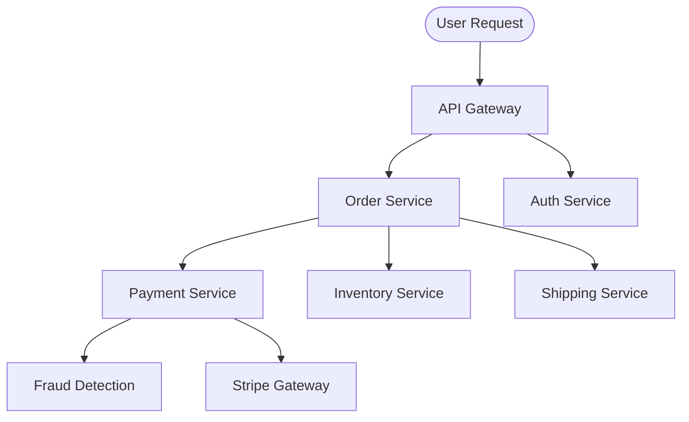

# Day 16 — The Network Is Not Reliable

> 🔗 **LinkedIn Discussion**: [Read & Discuss on LinkedIn](https://www.linkedin.com/in/himanshu-verma-822a07286/)  
> 🏛️ **System Architecture Milestone**: [`v5-resilient-services`](../../../system-evolution/v5-resilient-services/README.md)  
> 🚀 **Phase Kickoff**: Phase 4 — Now the System Is Distributed (Days 16–20)  
> 🎯 **Today's Focus**: The Fundamental Tri-State of Distributed RPCs & Network Uncertainty

---

## The Problem

In Phase 1, our entire application ran inside a single operating system process. When the `OrderService` needed to charge a customer, it executed an in-memory method call:

```java
PaymentResult result = paymentProcessor.charge(orderId, amount);
```

In-memory execution is binary and deterministic. The method executes on the CPU stack. Either it returns a `PaymentResult`, or it throws an unhandled exception and unwinds the stack. At no point in single-process memory execution does the caller ask: *"Did the code execute, but the universe forgot to tell me?"*

In Phase 3, we broke apart our monolithic architecture to scale background tasks and absorb spikes. As our engineering organization grew into specialized domain teams, we split **ShopScale** into independent microservices communicating over the internal VPC network via HTTP/REST and gRPC:

```text
[ Browser Client ]
        │
        ▼
[ API Gateway ]
        │ HTTP
        ▼
[ Order Service ] ──── HTTP POST /v1/charges (Timeout: 2000ms) ────► [ Payment Service ]
        │                                                                    │
        ▼                                                                    ▼
 [ PostgreSQL ]                                                        [ Stripe API ]
```

At 14:23:01 UTC on a Tuesday afternoon, a customer clicked **"Complete Purchase ($250)"**.

The `Order Service` opened an outbound TCP socket to the `Payment Service` and transmitted an HTTP `POST /v1/charges` request. The calling thread paused, waiting on the network socket read buffer.

Exactly 2,000 milliseconds later, the operating system raised an alarm:

```text
java.net.SocketTimeoutException: Read timed out
    at java.base/sun.nio.ch.NioSocketImpl.timedRead(NioSocketImpl.java:283)
    at org.apache.http.impl.io.SessionInputBufferImpl.read(SessionInputBufferImpl.java:137)
    at com.shopscale.order.client.PaymentClient.charge(PaymentClient.java:48)
```

Now, answer this critical engineering question:

**Did the customer pay for the order?**

You do not know. And worse: **your software does not know.**

```text
                               THE 3 FATAL POSSIBILITIES
                               
  Possibility 1: Dropped on the Way In (Never Executed)
  [ Order Service ] ─── POST /charges ───► 💥 (Dropped packet / switch reboot)
                                           [ Payment Service ] (Never saw it)
  Outcome: Customer was NOT charged. Order should NOT be confirmed.

  Possibility 2: Crashed Mid-Execution (Partially Executed)
  [ Order Service ] ─── POST /charges ───► [ Payment Service ] ──► [ Stripe: CHARGED! ]
                                           [ Payment Service ] ──► 💥 (OOM Kill / Crash)
  Outcome: Customer WAS charged. Payment Service never wrote to its DB.

  Possibility 3: Dropped on the Way Out (Fully Executed!)
  [ Order Service ]                        [ Payment Service ] ──► [ Stripe: CHARGED! ]
  [ Order Service ] ◄── 💥 (ACK lost) ──── [ Payment Service ] ──► [ DB: CHARGE_SAVED ]
  (Socket timed out at 2000ms)             (Response sent at 2005ms)
  Outcome: Customer WAS charged. Database IS updated. Order Service thinks it failed!
```

If the `Order Service` assumes the call failed and tells the customer *"Payment failed, please try again"*, the customer clicks the button again. Now they have been charged **$500** for a single order.

If the `Order Service` assumes the call succeeded, marks the order as `PAID`, and issues a warehouse shipping ticket, but Possibility 1 occurred, **you just gave away a $250 item for free**.

This is not a bug in your code. This is the **Fundamental Tri-State of Network Operations**. The moment a function call crosses a network wire, you leave the safe world of binary logic and enter a universe of fundamental physical uncertainty.

---

## Why the Simple Approach Breaks

When development teams first transition from a monolith to distributed services, they carry monolithic mental models into a networked world. They write code assuming the network is an invisible, reliable pipe.

Three naive implementations inevitably appear in the codebase:

```text
       Naive Pattern 1                  Naive Pattern 2                  Naive Pattern 3
     "Treat as Failure"                "Blind Auto-Retry"              "The Giant Timeout"
  ┌──────────────────────┐          ┌──────────────────────┐          ┌──────────────────────┐
  │ catch (TimeoutException)        │ catch (TimeoutException)        │ Set client timeout   │
  │   markOrderFailed(); │          │   retry3Times();     │          │ to 60 seconds        │
  └──────────┬───────────┘          └──────────┬───────────┘          └──────────┬───────────┘
             │                                 │                                 │
             ▼                                 ▼                                 ▼
   Customer charged $250;            Triple-charges credit card;       All 200 worker threads
   sees "Order Failed" screen;       amplifies network outage;         block; entire storefront
   initiates bank chargeback.        triggers vendor rate-limits.      freezes (Thread Starvation).
```

### 1. "If It Times Out, It Failed"
```python
# The Naive "Fail-Fast" Fallacy
try:
    payment_response = http_client.post("/v1/charges", json=payload, timeout=2.0)
except TimeoutError:
    # BUG: We assume timeout means "nothing happened"
    order.status = "PAYMENT_FAILED"
    db.save(order)
    return {"error": "Payment failed, please try again"}
```

**Why it breaks:**
In production telemetry across large-scale distributed systems, over **70% of network read timeouts occur after the downstream server has successfully received and executed the work**, but before the response packet could traverse the network back to the caller. 

By treating a timeout as an explicit failure, you create **phantom mutations**: state exists in downstream systems (credit cards charged, inventory reserved, seats booked) that upstream systems believe never happened. Your database state is now corrupt across microservice boundaries.

### 2. "If It Times Out, Just Retry"
```python
# The Naive "Blind Retry" Fallacy
for attempt in range(3):
    try:
        return http_client.post("/v1/charges", json=payload, timeout=2.0)
    except (TimeoutError, ConnectionError):
        continue  # BUG: Retrying non-idempotent network mutations!
```

**Why it breaks:**
If the first attempt timed out because the downstream service was struggling under high CPU or a slow third-party API, Possibility 3 happened: the server executed the charge, but was slow to reply.

Your loop immediately fires a second HTTP request. The downstream service executes the charge a **second time**. If the network hiccup persists, your loop fires a third request, executing the charge a **third time**. You have just created a duplicate payment disaster while simultaneously tripling the load on a downstream service that was already struggling to survive.

### 3. "Just Increase the Timeout to 60 Seconds"
"Our network latency spikes occasionally. Let's increase our HTTP client read timeout from 2 seconds to 60 seconds so we never time out prematurely."

**Why it breaks:**
Every in-flight network request ties up physical operating system resources: a socket descriptor, kernel TCP send/receive buffers, and an execution thread (in thread-per-request servers like Tomcat, Puma, or synchronous Python workers).

If your `Order Service` has a thread pool of 200 workers and processes 100 requests/sec, and the downstream `Payment Service` freezes:
* At a **2-second timeout**, threads clear out and surface errors, keeping the gateway responsive.
* At a **60-second timeout**, all 200 worker threads block on frozen sockets within **2 seconds** ($100\text{ req/sec} \times 2\text{s} = 200\text{ threads}$).
* Once all 200 threads are blocked waiting for the 60-second timer to expire, the `Order Service` cannot accept any new incoming requests—even for unrelated operations like `GET /health` or `GET /order/123`.

The calling service collapses from **Thread Starvation**. A slow dependency has successfully knocked down an upstream service without throwing a single error.

---

## Understanding the Problem

To build systems that survive network reality, we must deconstruct the assumptions software engineers take for granted.

### 1. The Fallacies of Distributed Computing

In 1994, L. Peter Deutsch and James Gosling at Sun Microsystems formulated the **Fallacies of Distributed Computing**—eight false assumptions that programmers new to distributed systems invariably make:

```text
               THE 8 FALLACIES OF DISTRIBUTED COMPUTING
  ┌─────────────────────────────────┬─────────────────────────────────┐
  │ 1. The network is reliable.     │ 5. Topology doesn't change.     │
  │ 2. Latency is zero.             │ 6. There is one administrator.  │
  │ 3. Bandwidth is infinite.       │ 7. Transport cost is zero.      │
  │ 4. The network is secure.       │ 8. The network is homogeneous.  │
  └─────────────────────────────────┴─────────────────────────────────┘
```

The entire history of resilient systems engineering is a battle against **Fallacy #1 ("The network is reliable")** and **Fallacy #2 ("Latency is zero")**.

### 2. Local Calls vs. Remote Calls: The Fundamental Boundary

In 1994, Jim Waldo, Ann Wollrath, Sam Kendall, and Geoff Wyant published the foundational paper [*A Note on Distributed Computing*](https://scholar.harvard.edu/waldo/publications/note-distributed-computing), arguing that attempting to make remote calls look syntactically identical to local calls (such as CORBA, Java RMI, or naive RPC frameworks) is fundamentally flawed.

Local memory calls and remote network calls differ across four unbridgeable dimensions:

| Dimension | In-Memory Local Call | Distributed Network RPC |
|---|---|---|
| **Latency** | ~10 to 50 nanoseconds (RAM access) | ~1 to 50 milliseconds (50,000× to 1,000,000× slower) |
| **Failure Modes** | Binary: Success or Process Crash | Tri-State: **Success, Failure, or Indeterminate** |
| **Concurrency & Memory** | Shared address space; deterministic pointers | Disjoint address spaces; serialized byte streams |
| **Partial Failure** | Impossible: either the whole program runs or it halts | **Ubiquitous**: 10 services run fine while 2 are partitioned |

### 3. The Two Generals' Problem

The impossibility of guaranteed certainty across an unreliable network was mathematically proven in 1975 as the **Two Generals' Problem**:

```text
    General 1                                             General 2
  ┌───────────┐        Messengers Across Enemy Valley   ┌───────────┐
  │ Camp East │ ──────────────────────────────────────► │ Camp West │
  │           │ ◄────────────────────────────────────── │           │
  └───────────┘        (Messengers captured / killed)   └───────────┘
```

Two allied generals must coordinate an attack on a fortified city. They can only communicate by sending messengers on foot through an enemy valley. If both attack simultaneously, they win. If either attacks alone, their army is slaughtered.

1. General 1 sends a messenger: *"Attack at dawn."*
2. Did the messenger make it? General 1 cannot attack without knowing General 2 agreed.
3. General 2 receives the message and sends an acknowledgment: *"Agreed. Attacking at dawn."*
4. Did the acknowledgment make it? General 2 cannot attack without knowing General 1 received the confirmation. If General 1 never got it, General 1 won't attack!
5. General 1 sends an ACK of the ACK: *"Got your agreement."*
6. But did *that* messenger make it? General 1 cannot be sure General 2 knows...

**Mathematical Conclusion**: Over an unreliable network, **no finite number of acknowledgments can ever guarantee mutual consensus**. 

Every network protocol you use—TCP, HTTP, gRPC, WebSocket—runs on top of physical infrastructure subject to this exact mathematical reality. You can never achieve absolute certainty over the wire; you can only minimize risk and engineer recovery paths.

### 4. The Tail at Scale: Why Latency Multiplies

A network is not slow because the speed of light in optical fiber is slow (~200 km/ms). A network is slow because of **queues inside middleboxes**: router buffer bloat, TCP retransmission timeouts (RTO), switch packet drops, NIC ring buffer contention, and noisy neighbors in cloud virtualized hypervisors.

In a microservice architecture, your user's request rarely hits one server. It branches into a tree of calls:



In 2013, Jeffrey Dean and Luiz André Barroso published [*The Tail at Scale*](https://cacm.acm.org/magazines/2013/2/160173-the-tail-at-scale/fulltext). They demonstrated that even if individual network services are highly reliable with a 99th percentile (P99) latency of 100ms (meaning only 1 in 100 calls is slow), the aggregate system latency degrades catastrophically:

The probability that a request completing $N$ independent network calls encounters at least one P99 tail delay is:

$$P(\text{Slow Request}) = 1 - (1 - 0.01)^N$$

```text
Number of Downstream Calls (N)    Probability of User Experiencing P99 Latency
──────────────────────────────────────────────────────────────────────────────
1 call                            1.0%
10 calls                          9.6%
50 calls                          39.5%
100 calls                         63.4%   ◄ Over half your users suffer!
```

If your architecture requires 50 distributed network hops to render a dashboard, **nearly 40% of all user requests will suffer the worst-case network latency of your slowest dependency**.

---

## Possible Approaches

Since we cannot eliminate network failure, how do real-world engineering teams design systems that remain reliable when the underlying transport is fundamentally unreliable?

Here are the four realistic engineering strategies:

```text
                                  NETWORK SURVIVAL MATRIX
  ┌────────────────────────┬────────────────────────┬────────────────────────┐
  │ 1. Asynchronous Sagas  │ 2. Idempotent Ingress  │ 3. Dual-Level Timeouts │
  │    & State Machines    │    & Deduplication     │    (Connect vs. Read)  │
  ├────────────────────────┼────────────────────────┼────────────────────────┤
  │ Decouple mutation from │ Make duplicate network │ Free blocked threads   │
  │ synchronous response.  │ retries safe and       │ before thread pool     │
  │ Use explicit "PENDING" │ mathematically         │ starvation kills the   │
  │ operational states.    │ non-destructive.       │ application.           │
  └────────────────────────┴────────────────────────┴────────────────────────┘
```

---

### Approach 1: Explicit Three-Valued State Machines (Unknown State Architecture)

#### How It Works
Stop modeling operations as binary (`SUCCESS` vs `FAILED`). In a distributed system, every state-mutating network interaction must support a first-class third state: **`UNKNOWN`** (or `PENDING_RECONCILIATION`).

When a client receives a network timeout, socket drop, or `504 Gateway Timeout`:
1. It transitions the entity state to `PAYMENT_PENDING_VERIFICATION`.
2. It does not mark the order as failed.
3. It does not blindly retry the mutation.
4. A background **reconciliation worker** or outbox scheduler queries the downstream service with the transaction's unique business identifier to resolve the state asynchronously.

```text
               ┌────────────────────────────────────────┐
               │ Order Created: State = INITIATED       │
               └───────────────────┬────────────────────┘
                                   │
                    POST /v1/charges over Network
                                   │
            ┌──────────────────────┴──────────────────────┐
            ▼ (HTTP 200)                                  ▼ (Timeout / Socket Error)
  ┌───────────────────┐                         ┌────────────────────────────────┐
  │ State = CONFIRMED │                         │ State = PENDING_RECONCILIATION │
  └───────────────────┘                         └───────────────┬────────────────┘
                                                                │
                                                Reconciliation Poller (Every 5s)
                                                GET /v1/charges?order_id=123
                                                                │
                                           ┌────────────────────┴───────────────────┐
                                           ▼ (Charge Exists)                        ▼ (Charge Not Found)
                                 ┌───────────────────┐                    ┌───────────────────┐
                                 │ State = CONFIRMED │                    │ State = CANCELLED │
                                 └───────────────────┘                    └───────────────────┘
```

#### Where It Helps
Eliminates phantom payments and phantom cancellations. The system gracefully accepts that the network is temporarily blind, without corrupting user data.

#### Limitations
Increases business workflow complexity. Frontends must display intermediate states (*"Your order is processing..."*) instead of instant confirmations.

#### When It Makes Sense
For any high-value distributed transaction (payments, banking transfers, inventory reservations, airline booking engines).

---

### Approach 2: End-to-End Idempotency Keys with Deterministic Result Caching

#### How It Works
If a network call times out, the client *must* be allowed to retry without fear of duplicate execution. To make this safe, the upstream caller generates a globally unique **Idempotency Key** (UUIDv4) and transmits it in the HTTP header:

```http
POST /v1/charges HTTP/1.1
Host: payment.shopscale.internal
Idempotency-Key: 9b1deb4d-3b7d-4bad-9bdd-2b0d7b3dcb6d
Content-Type: application/json

{
  "order_id": "ord_9901",
  "amount_cents": 25000
}
```

The downstream `Payment Service`:
1. Checks a persistent fast store (e.g., Redis or Postgres) using an atomic `INSERT ... ON CONFLICT DO NOTHING`.
2. If the key exists and processing is complete, it skips business logic and **immediately returns the cached response payload** from the original run.
3. If the key is currently locked (in-flight), it returns `HTTP 409 Conflict` or blocks until the leader finishes.
4. If the key is brand new, it executes the charge, saves the result alongside the key in a single transaction, and returns.

#### Where It Helps
Allows clients and upstream services to retry aggressively upon network errors without creating double-charges, duplicate shipments, or duplicate user accounts.

#### Limitations
Requires the downstream service to store idempotency records and response payloads durably for a defined retention window (typically 24 to 72 hours), adding storage overhead.

#### When It Makes Sense
Every non-idempotent HTTP mutation (`POST`, `PATCH`, non-deterministic `PUT`) crossing microservice boundaries.

---

### Approach 3: Two-Phase Commit (2PC) / Distributed Transactions

#### How It Works
A centralized Transaction Coordinator sends a `PREPARE` message to all participating databases and services. Each participant acquires local locks, ensures it can commit, and votes `YES` or `NO`. If all vote `YES`, the coordinator sends a `COMMIT` message.

#### Where It Helps
Provides strict ACID consistency across multiple databases.

#### Limitations (Why It Fails in Distributed Microservices)
* **The Coordinator Is a Single Point of Failure**: If the coordinator crashes or is partitioned after nodes vote `YES`, participating nodes are left holding row locks indefinitely, freezing the database.
* **Latency Multiplier**: 2PC requires multiple sequential network roundtrips (`PREPARE` $\rightarrow$ `VOTE` $\rightarrow$ `COMMIT` $\rightarrow$ `ACK`). Under real-world network jitter, throughput collapses.
* **Violates Service Autonomy**: Microservices cannot expose internal database transaction handles to external coordinators without breaking data isolation.

#### When It Makes Sense
Inside homogeneous, tightly coupled distributed databases (like Google Spanner or CockroachDB running within the same data center). **Virtually never makes sense across microservices.**

---

### Approach 4: Calibrated Dual-Level Timeouts with Bounded Deadlines

#### How It Works
Never use a single generic "timeout". An HTTP client connection traverses two entirely distinct physical phases:
1. **Connect Timeout**: The time allowed to perform DNS resolution, complete the three-way TCP handshake (`SYN` $\rightarrow$ `SYN-ACK` $\rightarrow$ `ACK`), and negotiate TLS. This should be **very short (100ms to 500ms)** because establishing a socket within a data center or VPC should take under 5 milliseconds.
2. **Read/Socket Timeout**: The time allowed between data packets arriving from the server while processing. This should be calibrated to the server's **P99.9 latency profile plus an operational safety margin**.

Furthermore, implement **Context Deadlines (Deadline Propagation)**: When a user request enters the API Gateway with a total acceptable budget of 2,000ms, that remaining budget must be passed downstream in headers (`X-Request-Deadline: 1718029301.250`). If 1,800ms has elapsed by the time the request reaches the third service in the chain, that service knows it only has 200ms left. If it cannot finish in 200ms, it aborts immediately rather than wasting CPU on work whose caller will have already timed out!

#### Where It Helps
Prevents thread starvation, bounds worst-case resource lockup, and stops zombie requests from consuming compute across the cluster.

#### Limitations
Requires discipline across all service teams to propagate deadlines in RPC contexts.

#### When It Makes Sense
Every outbound network client in every service in your infrastructure.

---

## Trade-offs

When designing around network unreliability, you cannot optimize for every property simultaneously. You are choosing which failure mode your business can accept.

| Strategy | What We Gain | What We Give Up | The Engineering Trade-off |
|---|---|---|---|
| **Short Timeouts (Fail Fast)** | Protects caller threads; prevents cascading resource exhaustion. | Increases rate of false-positive "Unknown" errors during brief network latency blips. | **Availability over Completeness**: We choose to fail quickly and free resources rather than wait patiently for a slow link. |
| **Long Timeouts (Patient Waiting)** | Maximizes chance of receiving the response without needing reconciliation. | High risk of thread starvation; binds database connections and sockets for minutes. | **Completeness over Resilience**: Only acceptable in asynchronous batch systems, never in interactive user-facing request paths. |
| **Idempotency Keys + Aggressive Retries** | Self-healing network interactions; automates recovery from transient packet drops. | Requires distributed state storage for keys; increases downstream load during partial outages. | **Simplicity for Durability**: Microservices trade away statelessness to gain resilience against network duplicate delivery. |
| **Asynchronous State Machines (Sagas)** | Eliminates distributed transaction deadlocks; survives complete network partitions. | Immediate consistency is lost. Users see "Pending" states; UI complexity increases. | **Consistency for Availability (CAP Theorem)**: We accept eventual consistency to keep the platform responsive. |

---

## A Practical Example: The Resilient Network RPC Pattern

To see how an engineer handles network unreliability in code, let's implement the complete **Resilient Network Client Pattern** in Python.

This example includes:
1. Isolated Connect vs. Read timeouts
2. Idempotency Key injection
3. Explicit classification of the **`UNKNOWN`** network state
4. Safe query-based reconciliation before any retry or cancellation

### 1. The Resilient HTTP Client with State Classification

```python
import uuid
import time
import requests
from requests.exceptions import Timeout, ConnectionError, RequestException
from enum import Enum

class RPCStatus(Enum):
    SUCCESS = "SUCCESS"               # 200 OK received, payload valid
    EXPLICIT_FAILURE = "EXPLICIT_FAILURE" # 4xx / 5xx error from server logic
    NETWORK_UNKNOWN = "NETWORK_UNKNOWN"   # Timeout or socket break: STATE UNCERTAIN!

class ResilientPaymentClient:
    def __init__(self, base_url: str, connect_timeout_sec=0.2, read_timeout_sec=2.0):
        self.base_url = base_url
        # CRITICAL: Separate connect timeout (fast fail) from read timeout (processing)
        self.timeouts = (connect_timeout_sec, read_timeout_sec)
        self.session = requests.Session()

    def charge(self, order_id: str, amount_cents: int, idempotency_key: str) -> dict:
        url = f"{self.base_url}/v1/charges"
        headers = {
            "Content-Type": "application/json",
            "Idempotency-Key": idempotency_key,
            "X-Client-Timestamp": str(time.time())
        }
        payload = {
            "order_id": order_id,
            "amount_cents": amount_cents
        }

        try:
            response = self.session.post(
                url, 
                json=payload, 
                headers=headers, 
                timeout=self.timeouts
            )

            if 200 <= response.status_code < 300:
                return {
                    "status": RPCStatus.SUCCESS,
                    "data": response.json()
                }
            elif 400 <= response.status_code < 500:
                # Client errors (e.g. Card Declined, Invalid CVV) are deterministic failures
                return {
                    "status": RPCStatus.EXPLICIT_FAILURE,
                    "error": response.json().get("detail", "Business validation failed")
                }
            else:
                # 500 Internal Server Error: Server may have executed partially or crashed!
                return {
                    "status": RPCStatus.NETWORK_UNKNOWN,
                    "error": f"Server error HTTP {response.status_code}"
                }

        except ConnectionError as ce:
            # Failed to resolve DNS or establish TCP connection.
            # Usually safe to assume request never reached downstream application logic.
            return {
                "status": RPCStatus.EXPLICIT_FAILURE,
                "error": f"Could not establish connection: {str(ce)}"
            }

        except Timeout as te:
            # FATAL TRI-STATE OCCURRED:
            # We sent the request bytes, but the socket timed out waiting for the reply.
            # We CANNOT determine whether the charge went through or not!
            return {
                "status": RPCStatus.NETWORK_UNKNOWN,
                "error": f"Read timeout occurred: {str(te)}"
            }

    def verify_charge_status(self, idempotency_key: str) -> dict:
        """
        Idempotent Query: Safely asks downstream if the operation was executed.
        """
        url = f"{self.base_url}/v1/charges/lookup?idempotency_key={idempotency_key}"
        try:
            resp = self.session.get(url, timeout=(0.2, 1.5))
            if 200 <= resp.status_code < 300:
                return {"found": True, "data": resp.json()}
            elif resp.status_code == 404:
                return {"found": False}
            else:
                return {"found": "UNKNOWN"}
        except RequestException:
            return {"found": "UNKNOWN"}
```

---

### 2. The Order Workflow Orchestrator

Notice how the `OrderService` handles `NETWORK_UNKNOWN`. It refuses to guess; it transitions to an explicit `PAYMENT_PENDING_RECONCILIATION` state:

```python
class OrderService:
    def __init__(self, db, payment_client: ResilientPaymentClient):
        self.db = db
        self.payment_client = payment_client

    def process_order_checkout(self, order_id: str, amount_cents: int):
        order = self.db.find_order(order_id)
        
        # Step 1: Generate or retrieve stable Idempotency Key bound to this order
        if not order.get("idempotency_key"):
            order["idempotency_key"] = f"idem_{order_id}_{uuid.uuid4().hex[:8]}"
            self.db.save(order)

        idem_key = order["idempotency_key"]

        # Step 2: Make the network call
        result = self.payment_client.charge(
            order_id=order_id, 
            amount_cents=amount_cents, 
            idempotency_key=idem_key
        )

        # Step 3: Branch on the Three-Valued Logic
        if result["status"] == RPCStatus.SUCCESS:
            order["status"] = "PAID"
            order["payment_id"] = result["data"]["charge_id"]
            self.db.save(order)
            return {"status": "SUCCESS", "message": "Order confirmed and paid."}

        elif result["status"] == RPCStatus.EXPLICIT_FAILURE:
            # Safe to fail immediately: we know no money was moved
            order["status"] = "FAILED"
            order["failure_reason"] = result["error"]
            self.db.save(order)
            return {"status": "FAILED", "message": result["error"]}

        elif result["status"] == RPCStatus.NETWORK_UNKNOWN:
            # THE CRITICAL STEP: DO NOT FAIL, DO NOT BLINDLY RETRY!
            order["status"] = "PAYMENT_PENDING_RECONCILIATION"
            self.db.save(order)

            # Return an indeterminate status to caller.
            # Client UI displays: "Payment is confirming with your bank, please wait..."
            return {
                "status": "PENDING",
                "message": "Payment processing delayed by network. Confirming status shortly.",
                "check_status_url": f"/orders/{order_id}/status"
            }
```

---

### 3. The Asynchronous Reconciliation Worker

A background daemon continuously resolves pending orders. If the downstream service executed the charge, the order is confirmed. If downstream has no record of it, the orchestrator can safely cancel or re-issue the charge with the exact same idempotency key:

```python
class PaymentReconciliationDaemon:
    def __init__(self, db, payment_client: ResilientPaymentClient):
        self.db = db
        self.payment_client = payment_client

    def reconcile_pending_orders(self):
        """Runs every 10 seconds to resolve indeterminate states."""
        pending_orders = self.db.find_orders_by_status("PAYMENT_PENDING_RECONCILIATION")

        for order in pending_orders:
            idem_key = order["idempotency_key"]
            check = self.payment_client.verify_charge_status(idem_key)

            if check["found"] is True:
                # Downstream did execute the charge! The network dropped the response.
                order["status"] = "PAID"
                order["payment_id"] = check["data"]["charge_id"]
                self.db.save(order)
                print(f"[RECONCILED] Order {order['id']} was charged successfully.")

            elif check["found"] is False:
                # Downstream has no record. The request packet was lost before arrival.
                # Safe to mark FAILED or retry cleanly using the SAME idempotency key.
                order["status"] = "PAYMENT_FAILED_VERIFIED"
                self.db.save(order)
                print(f"[RECONCILED] Order {order['id']} never reached payment service.")

            else:
                # Network is still unreachable; back off and retry next cycle
                print(f"[RETRY_LATER] Network still partitioned for Order {order['id']}")
```

---

## Failure Scenarios: What Can Still Go Wrong

Even when your codebase understands the network is unreliable, distributed systems present bizarre, unintuitive failure modes.

```text
┌────────────────────────────────────────────────────────────────────────────┐
│                  Distributed Network Failure Modes                         │
├──────────────────────────┬─────────────────────────┬───────────────────────┤
│ 1. The Half-Open TCP     │ 2. Asymmetric Network   │ 3. The Phantom Write  │
│    Zombie Socket         │    Partition (BGP / NIC)│    (Zombie Success)   │
│                          │                         │                       │
│ Server crashes abruptly; │ Node A can send packets │ Request times out;    │
│ intermediate NAT table   │ to Node B, but Node B's │ client cancels; 40    │
│ drops connection; caller │ ACKs cannot reach Node  │ seconds later, slow   │
│ hangs for 2 hours.       │ A. Infinite retries.    │ worker commits write. │
└──────────────────────────┴─────────────────────────┴───────────────────────┘
```

### 1. The Half-Open TCP Zombie Socket
* **The Scenario**: An application server opens a TCP connection to an internal service. While a query is running, the remote server experiences a sudden kernel panic or hardware power loss. No TCP `FIN` or `RST` packet is ever transmitted.
* **The Failure**: The operating system on the client side still believes the TCP connection is healthy and established. If the client did not set a specific socket `SO_TIMEOUT` or TCP keepalive parameters (`TCP_USER_TIMEOUT`), the thread will wait on that dead socket for **up to 2 hours** (the default OS TCP keepalive timeout).
* **The Defense**: Always set explicit socket read timeouts in your HTTP/gRPC client configurations. At the Linux kernel level, tune `tcp_keepalive_time` (e.g., 60 seconds) and set `TCP_USER_TIMEOUT` on critical sockets.

### 2. Asymmetric Network Partitions (Unidirectional Black Hole)
* **The Scenario**: A misconfigured firewall rule, faulty switch ASIC, or saturated uplink drops packets in only **one direction**. Node A can transmit packets to Node B, but Node B's response packets cannot reach Node A.
* **The Failure**: 
  1. Node A sends `POST /v1/payments`.
  2. Node B receives it, executes the payment, and sends `200 OK`.
  3. The `200 OK` is dropped by the broken switch.
  4. Node A times out and assumes Node B is dead.
  5. Node A retries. Node B receives the retry.
  Node B is continuously bombarded with requests that it successfully processes, but Node A believes Node B is completely offline.
* **The Defense**: Heartbeat ping-pong mechanisms must test bidirectional packet flow. Health checks must be end-to-end, validating both egress and ingress path health.

### 3. The Phantom Write (Zombie Worker Race)
* **The Scenario**: 
  1. Client sends an order request with a 2-second timeout.
  2. The server experiences a 4-second Stop-The-World Garbage Collection (GC) pause.
  3. At millisecond 2,000, the client times out, marks the order as cancelled, and releases the inventory back to the store.
  4. At millisecond 4,001, the server's GC pause ends. The server thread wakes up, unaware that time has passed.
  5. The server thread proceeds to execute the database write, inserting the order and charging the credit card!
* **The Result**: An order is created and paid for *after* the client declared it dead and released its inventory!
* **The Defense**: **Token Leasing and Conditional Updates**. When executing writes, workers must verify that the transaction's deadline has not expired (`WHERE deadline > NOW()`). In distributed databases, fencing tokens (monotonically increasing epoch counters) prevent expired workers from committing writes.

---

## Key Engineering Decisions

When architecting microservices communicating over a network, use this decision framework:

```text
                           Distributed Network Decision Tree
                                           │
                        Is the operation a Read or a Mutation?
                                           │
                         ┌─────────────────┴─────────────────┐
                         ▼                                   ▼
                    Read Operation                      Mutation
                         │                                   │
                Is the read cacheable?             Can it be made Idempotent?
                  ┌──────┴──────┐                     ┌──────┴──────┐
                  ▼             ▼                     ▼             ▼
                 Yes            No                   Yes            No
                  │             │                     │             │
              Serve with    Direct Read           Use Idempotency  Use Two-Phase
              Short TTL &   with Tight            Token Header +   Saga with Explicit
              Microcache    Timeout (500ms)       Auto-Retry Loop  "PENDING" States
```

### 1. The Rules of Distributed Network Calls
1. **Never Make an Unbounded Network Call**: Every single HTTP, gRPC, database, or Redis connection must have an explicit Connect Timeout and Read/Socket Timeout. If you leave timeouts as default (`0` or `infinite`), your application will eventually freeze and die in production.
2. **Never Treat a Timeout as a Failure**: A timeout is an `UNKNOWN` state. You know that you stopped waiting; you do not know what the server did.
3. **Every Mutation Must Be Idempotent**: If a network call changes state, the server must support an `Idempotency-Key` header so that clients can safely retry across network drops without side effects.
4. **Propagate Deadlines Across Service Chains**: If the ingress gateway has a 2-second budget, pass the remaining time in a header (`X-Deadline`). Never let downstream services waste CPU on dead requests.
5. **Decouple Fast Ingress from Slow Operations**: If an operation takes longer than 500ms, do not hold an open synchronous HTTP connection over the network. Switch to asynchronous buffered queues (`v4-async-workers`).

---

## Key Takeaways

1. **A network call has three outcomes, not two**: `SUCCESS`, `FAILURE`, and `UNKNOWN`. Engineering for the network means designing systems that handle `UNKNOWN` as a normal, everyday condition.
2. **Local calls and network RPCs are fundamentally different**: Networks introduce variable latency, partial failure, packet drops, and split-brain scenarios that cannot be hidden behind clean programming language abstractions.
3. **Autoscaling and vertical scaling cannot fix network drops**: Physical switches fail, BGP routes flap, and hypervisors pause VMs. Resilience is an architectural property, not an infrastructure size.
4. **Blind retries cause double-charges and retry storms**: Never retry a network mutation without an idempotency key and exponential backoff.
5. **Use explicit intermediate states**: For critical transactions, transition through `PENDING_RECONCILIATION` and resolve the final state with background reconciliation workers rather than making unsafe assumptions during timeouts.

---

### 🧭 Navigation & Next Steps
* Read the previous guide: **[Day 15 — Designing a System That Can Survive Spikes](../../phase-3-stop-making-everything-synchronous/day-15-surviving-traffic-spikes/README.md)**
* Read the next guide: **[Day 17 — Timeouts, Retries, and the Retry Storm](../day-17-timeouts-retries-retry-storm/README.md)**
* View the architecture milestone: [`v5-resilient-services`](../../../system-evolution/v5-resilient-services/README.md)
