# Day 17 — Timeouts, Retries, and the Retry Storm

> 🔗 **LinkedIn Discussion**: [Read & Discuss on LinkedIn](https://www.linkedin.com/in/himanshu-verma-822a07286/)  
> 🏛️ **System Architecture Milestone**: [`v5-resilient-services`](../../../system-evolution/v5-resilient-services/README.md)  
> 🚀 **Phase**: Phase 4 — Now the System Is Distributed (Days 16–20)  
> 🎯 **Today's Focus**: How Naive Retries Multiply Across Microservice Call Chains to Create Destructive Self-Inflicted Outages

---

## The Problem

Yesterday in [Day 16 — The Network Is Not Reliable](../day-16-network-is-unreliable/README.md), we established that distributed systems operate in a state of physical uncertainty. When a remote call times out, you enter an indeterminate state: did the packet drop on the way in, did the server crash mid-flight, or did the response drop on the way back?

To prevent minor network blips, momentary packet loss, or a sub-second Garbage Collection (GC) pause from failing customer requests, an engineer on the **ShopScale** checkout team adds what appears to be the most standard, harmless line of code in modern software engineering:

```python
# "Just retry twice if the network drops or times out"
max_retries = 2
```

At baseline traffic—500 checkout requests per second—the network experiences a typical 0.1% background packet drop. Retries work miracles. Ninety-nine percent of transient hiccups are masked seamlessly. Customer checkout success rates climb to 99.99%. The team congratulates themselves on building a "resilient" distributed system.

Then comes Black Friday at 18:00 UTC.

A flash sale launches. Incoming checkout traffic surges **3×**, from 500 requests/second to 1,500 requests/second.

```text
                                  THE MULTIPLICATION DISASTER
                                  
  1,500 req/s          ┌────────────────┐
 ─────────────►        │ Order Service  │  (Retries: 2)
  (User Spikes)        └───────┬────────┘
                               │  3 attempts per user request (1 initial + 2 retries)
                               ▼
  4,500 req/s          ┌────────────────┐
 ─────────────►        │ Payment Service│  (Retries: 2)
                       └───────┬────────┘
                               │  3 attempts per incoming call (3 × 3 = 9 attempts)
                               ▼
  13,500 req/s         ┌────────────────┐
 ─────────────►        │ Pricing Engine │  (Retries: 2)
                       └───────┬────────┘
                               │  3 attempts per incoming call (3 × 3 × 3 = 27 attempts)
                               ▼
  40,500 req/s         ┌────────────────┐
 ─────────────►        │ Database / DB  │  💥 TOTAL SYSTEM COLLAPSE
                       └────────────────┘
```

Here is the exact sequence of events that unfolded over 90 seconds:

1. **The Initial Slowdown (T = 0s)**: At 1,500 req/s, the downstream `Pricing Engine` experiences database lock contention. Its average response latency slips from 40ms to 520ms.
2. **The First Timeouts (T = 15s)**: The `Payment Service` has an HTTP client timeout configured at 500ms. Because the `Pricing Engine` is now taking 520ms, calls begin timing out.
3. **The Upstream Amplification (T = 20s)**: The `Payment Service` catches the timeout and immediately fires Attempt #2. For every 1 customer request, the `Payment Service` is now sending 2 or 3 requests to the `Pricing Engine`. Load on the `Pricing Engine` jumps from 1,500 req/s to 4,500 req/s.
4. **The Cascading Explosion (T = 35s)**: Flooded with 4,500 req/s, the `Pricing Engine`'s CPU hits 100%. Its response latency explodes from 520ms to 4,000ms. Now, the `Payment Service` itself cannot complete its work within its 1,000ms deadline.
5. **The Gateway Joins the Attack (T = 50s)**: The `Order Service` times out waiting for the `Payment Service`. It catches the error and triggers *its* retry loop.
6. **The Blackout (T = 65s)**: A single incoming customer request generates up to **27 downstream requests**. The bottom-tier services are hit with over 40,000 requests per second—**27× the ingress load**. Operating system socket buffers overflow, Linux kernel connection backlogs drop SYN packets, memory exhausts from thread accumulation, and every service in the dependency tree crashes.

The engineering team tries restarting the services. As soon as a service pod boots up, it is instantly slammed with tens of thousands of queued and retrying requests from upstream services. It crashes within 3 seconds of health-check passage. 

The system cannot recover. You did not suffer a Denial of Service attack from external hackers. **Your own resilience code attacked and destroyed your infrastructure.**

This is a **Retry Storm** (also known as *retry amplification*).

---

## Why the Simple Approach Breaks

When engineers notice intermittent failures, they reach for intuitive retry mechanisms. Each naive implementation solves the immediate symptom while laying a trap for full-scale production failure.

```text
       Naive Pattern 1                  Naive Pattern 2                  Naive Pattern 3
     "Immediate Retries"              "Fixed Sleep Retry"             "Blind Catch-All"
  ┌──────────────────────┐         ┌──────────────────────┐         ┌──────────────────────┐
  │ catch (Exception e)  │         │ catch (Exception e)  │         │ catch (Exception e)  │
  │   retryImmediately() │         │   sleep(500ms);      │         │   retry();           │
  │                      │         │   retry();           │         │                      │
  └──────────┬───────────┘         └──────────┬───────────┘         └──────────┬───────────┘
             │                                │                                │
             ▼                                ▼                                ▼
   Crushes struggling server;       "Thundering Herd": All           Retries non-transient 4xx
   fires 3 requests in 2ms;         retries wake up at same          errors and dead requests;
   100% failure rate.               exact millisecond.               wastes 100% of CPU budget.
```

### 1. Immediate Retries (The Sledgehammer)

```python
# NAIVE PATTERN 1: The Immediate Retry Loop
def fetch_product_price(product_id):
    for attempt in range(3):
        try:
            return http_client.get(f"/v1/prices/{product_id}", timeout=0.5)
        except Exception:
            pass  # Immediately loop to attempt 2
    raise ServiceUnavailableError("Pricing service down")
```

**Why it breaks:**
If a downstream server failed or timed out because its thread pool is saturated or its CPU is at 98%, firing a second request **zero milliseconds later** guarantees that the second request encounters the exact same congested conditions. 

Immediate retries convert transient latency into sustained outages. If a server is struggling through a 2-second garbage collection pause, sending 3 requests within 2 milliseconds simply queues up garbage work, ensuring that when the server resumes, its request queue is already overflowing.

### 2. Fixed-Interval Retries and the "Thundering Herd"

```python
# NAIVE PATTERN 2: Fixed Delay Retries
def fetch_inventory(item_id):
    for attempt in range(3):
        try:
            return http_client.get(f"/v1/inventory/{item_id}", timeout=0.5)
        except Exception:
            time.sleep(0.250)  # Sleep exactly 250 milliseconds
    raise ServiceUnavailableError("Inventory unavailable")
```

**Why it breaks:**
Suppose a downstream network switch encounters packet drops for 1 second. During that 1 second, 2,000 incoming requests across your fleet fail at roughly the same time.

Because every client sleeps for *exactly* 250 milliseconds, all 2,000 clients wake up and transmit their retry payloads at the **exact same millisecond**. 

```text
Incoming Load on Downstream Service:

Traffic
  ▲
  │        Wave 1 (Retry)           Wave 2 (Retry)
  │            ████                     ████
  │            ████                     ████
  │            ████                     ████
  │            ████                     ████
──┼────────────████─────────────────────████──────────► Time
  │ Baseline   t = 250ms                t = 500ms
```

This creates **periodic shockwaves** (resonant oscillation). The downstream server is pummeled by massive spikes of synchronized traffic, causing it to fall over, recover momentarily during the sleep window, and get knocked down again by the next synchronized wave.

### 3. Multi-Hop Retry Multipliers (The Geometric Trap)

Consider a standard e-commerce microservice call chain with 4 hops:

$$\text{API Gateway} \longrightarrow \text{Order Service} \longrightarrow \text{Payment Service} \longrightarrow \text{Database}$$

If every service in this chain has a default retry policy of `max_retries = 3` (1 initial attempt + 3 retries = 4 total attempts):

$$\text{Total Potential Requests} = 4 \times 4 \times 4 = 4^3 = 64 \text{ requests to the database}$$

When retries are uncoordinated across architecture tiers, the amplification factor is exponential with respect to call depth:

$$R_{\text{total}} = \prod_{i=1}^{D} (1 + r_i)$$

Where:
* $D$ is the depth of the dependency tree.
* $r_i$ is the number of configured retries at tier $i$.

A modest retry configuration of 2 retries ($1 + 2 = 3$) across 4 hops results in:

$$3^4 = 81 \text{ requests per initial user click}$$

When your downstream database or third-party payment vendor is already experiencing performance degradation, multiplying inbound traffic by **8,100%** guarantees total infrastructure collapse.

### 4. Retrying Permanent (Non-Transient) Errors

```python
# NAIVE PATTERN 3: Catch-All Retry
try:
    response = http_client.post("/v1/charges", json=payload, timeout=2.0)
except Exception:  # Catches HTTP 400, 401, 404, 422, 500, timeouts
    retry()
```

**Why it breaks:**
Not all errors are created equal. If a client submits a malformed JSON payload (`HTTP 400 Bad Request`), an expired credit card token (`HTTP 422 Unprocessable Entity`), or invalid credentials (`HTTP 401 Unauthorized`), retrying the request 3 times will yield the exact same error 100% of the time.

Retrying deterministic, permanent errors wastes CPU cycles, network bandwidth, and database connection pool capacity on work that is fundamentally doomed to fail.

---

## Understanding the Problem

To build systems that survive network degradation and traffic surges, we must master the underlying physics of queues, error classifications, and distributed timing.

### 1. The Physics of Queueing: Kingman’s Formula and The Knee of the Curve

Why does a small increase in traffic from retries cause such a disproportionate explosion in system latency?

In queuing theory, this behavior is modeled by **Kingman’s Formula** for a $G/G/1$ queue (general arrivals, general service times, single server). The average waiting time $W_q$ spent in a processing queue before being handled is approximated by:

$$W_q \approx \left( \frac{\rho}{1 - \rho} \right) \left( \frac{C_a^2 + C_s^2}{2} \right) \left( \frac{1}{\mu} \right)$$

Where:
* $\rho = \frac{\lambda}{\mu}$ is the **server utilization** (arrival rate $\lambda$ divided by service rate $\mu$).
* $C_a$ and $C_s$ are the coefficients of variation for arrival and service times.
* $\frac{1}{\mu}$ is the average service time.

Notice the term $\frac{\rho}{1 - \rho}$. This creates a hyperbola with a sharp vertical asymptote as utilization $\rho$ approaches $1.0$ (100% capacity):

```text
Latency / Wait Time
  ▲
  │                                           / (System Collapse)
  │                                          /
  │                                         /
  │                                        /
  │                                       │  ◄── THE KNEE OF THE CURVE
  │                                      /
  │                                 . - '
  │                     . - - - - '
  │ . - - - - - - - - '
──┴─────────────────────────────────────────► Utilization (ρ)
  0%                 50%           80%  90% 100%
```

* At **50% utilization**: $\frac{0.5}{1 - 0.5} = 1.0$ (Wait time is roughly equal to service time).
* At **80% utilization**: $\frac{0.8}{1 - 0.8} = 4.0$ (Wait time is 4× service time).
* At **95% utilization**: $\frac{0.95}{1 - 0.95} = 19.0$ (Wait time is 19× service time!).
* At **99% utilization**: $\frac{0.99}{1 - 0.99} = 99.0$ (Wait time is 99× service time!).

When a service is running at 85% capacity during peak traffic, it is stable. But when naive retries introduce just a **15% to 20% increase in traffic**, utilization crosses 100%. 

Once $\rho > 1.0$, the queue length grows toward **infinity**. Memory fills with buffered requests, garbage collection pauses escalate, worker threads lock up waiting on queues, and throughput plummets to near zero.

### 2. Transient vs. Non-Transient Failures

A resilient system must strictly differentiate between errors that can succeed upon retry and errors that will never succeed upon retry:

```text
┌─────────────────────────────────────────────────────────────────────────────┐
│                          FAILURE CLASSIFICATION                             │
├──────────────────────────────────────┬──────────────────────────────────────┤
│ 1. Transient (Retryable)             │ 2. Non-Transient (Do NOT Retry)      │
├──────────────────────────────────────┼──────────────────────────────────────┤
│ • TCP Connection Reset (RST)         │ • HTTP 400 Bad Request (Invalid body)│
│ • Dropped packet / Socket Timeout    │ • HTTP 401 Unauthorized / 403 Forbidden│
│ • HTTP 503 Service Unavailable       │ • HTTP 404 Not Found                 │
│ • HTTP 429 Too Many Requests         │ • HTTP 422 Unprocessable Entity      │
│   (ONLY if Retry-After is respected) │ • Database Unique Constraint Failure │
│ • gRPC UNAVAILABLE                   │ • Schema validation errors           │
│ • Load balancer reconnecting pods    │ • Business rule rejections           │
└──────────────────────────────────────┴──────────────────────────────────────┘
```

> [!IMPORTANT]
> What about `HTTP 500 Internal Server Error`?  
> **Treat HTTP 500 as non-retryable by default.** In 90% of real-world microservices, HTTP 500 represents an unhandled NullPointerException, an unexpected data structure, or an assertion error in application code. Retrying an unhandled exception will simply throw the same unhandled exception again, consuming CPU for nothing. Only retry 500 if specific downstream telemetry explicitly declares it safe.

### 3. Sockets, Deadlines, and Zombie Requests

When an upstream caller experiences a client-side timeout, what happens to the downstream server?

```text
 [ Upstream Client ]                              [ Downstream Worker ]
         │                                                  │
         │─── POST /v1/process (Timeout: 500ms) ───────────►│ (Enters Thread Queue)
         │                                                  │
    [ 500ms Elapses ]                                       │ (Still waiting in queue...)
         │                                                  │
    💥 Timeout! Client aborts.                              │
    Client sends Retry Attempt #2 ────────┐                 │
         │                                │                 │
         │                                │                 │ (Picks up Request #1 at 650ms)
         │                                │                 │ Executes heavy DB query...
         │                                │                 │ Computes PDF invoice...
         │                                │                 │ 💥 Writes result to closed socket!
         │                                ▼                 │
         │─────────────────────────────────────────────────►│ (Enters Thread Queue as #2)
```

If your distributed system does not propagate deadlines or monitor connection closures:
1. The client gives up at 500ms and fires a retry.
2. The downstream server was simply slow; at 650ms, a worker thread finally pulls the *first* request from the queue.
3. The server spends 1,200ms of intensive CPU and database resources completing Request #1.
4. When it finally attempts to send the response back over the TCP socket, it receives a TCP `RST` because the client already closed the connection!
5. Meanwhile, Request #2 is waiting in the exact same queue, doomed to repeat the exact same fate.

The downstream server is now spending 100% of its computing capacity doing **zombie work**—processing requests whose callers have long since abandoned them.

---

## Possible Approaches

To achieve resilience without inducing self-destruction, we use five complementary architectural patterns:

```text
                               THE RESILIENCE TOOLKIT
                               
   1. Exponential Backoff       2. Random Jitter            3. Retry Budgets
  ┌───────────────────────┐   ┌───────────────────────┐   ┌───────────────────────┐
  │ Increase delay with   │   │ Break synchronization │   │ Cap total fleet       │
  │ each attempt:         │   │ by adding randomness; │   │ retries to max 10%    │
  │ t = base * 2^attempt  │   │ eliminates herds.     │   │ of total traffic.     │
  └───────────────────────┘   └───────────────────────┘   └───────────────────────┘
                                          │
                                          ▼
   4. Deadline Propagation     5. Edge-Only Retries
  ┌───────────────────────┐   ┌───────────────────────┐
  │ Pass remaining budget │   │ Only retry at the     │
  │ in headers; cancel    │   │ outermost orchestrator;│
  │ dead zombie requests. │   │ eliminate multipliers.│
  └───────────────────────┘   └───────────────────────┘
```

---

### Approach 1: Exponential Backoff

#### How It Works
Instead of retrying immediately or at fixed intervals, the client exponentially increases the wait duration between successive retry attempts:

$$t_{\text{wait}} = \min(t_{\text{max}}, t_{\text{base}} \times 2^{\text{attempt}})$$

Where:
* $t_{\text{base}}$ is the initial backoff delay (e.g., 100 milliseconds).
* $\text{attempt}$ is the zero-indexed retry count ($0, 1, 2, \dots$).
* $t_{\text{max}}$ is a ceiling cap to prevent wait times from growing into hours (e.g., 5 seconds).

```text
Attempt 0 (Initial): 0ms
Attempt 1 (Retry 1): 100ms * 2^0 = 100ms
Attempt 2 (Retry 2): 100ms * 2^1 = 200ms
Attempt 3 (Retry 3): 100ms * 2^2 = 400ms
Attempt 4 (Retry 4): 100ms * 2^3 = 800ms
```

#### Where It Helps
Exponential backoff provides immediate breathing room to an overloaded downstream dependency. If a database is struggling with a temporary lock spike, backing off gives the database time to clear its active transaction queue before the client returns.

#### Limitations
While exponential backoff spaces out requests from a *single* client, it does **not** solve the problem of multiple independent clients experiencing the same outage. If 1,000 clients fail simultaneously at 12:00:00.000, they will all back off by 100ms, and all 1,000 will retry simultaneously at 12:00:00.100. Then they will all back off by 200ms and retry simultaneously at 12:00:00.300. The lock-step thundering herd remains intact.

---

### Approach 2: Jitter (Breaking Synchronization)

In 2015, Marc Brooker published a landmark AWS Architecture paper: [*Exponential Backoff And Jitter*](https://aws.amazon.com/blogs/architecture/exponential-backoff-and-jitter/). The core thesis was simple: **add randomness to backoff timers to mathematically eliminate synchronized retry waves.**

There are three primary algorithms for adding jitter:

```text
                                  JITTER ALGORITHMS
                                  
  1. Full Jitter                     2. Equal Jitter                    3. Decorrelated Jitter
  ┌───────────────────────────────┐  ┌───────────────────────────────┐  ┌───────────────────────────────┐
  │ Sleep = random(0, Backoff)    │  │ Half = Backoff / 2            │  │ Sleep = min(cap,              │
  │ Maximum randomness; spreads   │  │ Sleep = Half + random(0, Half)│  │   random(base, prev_sleep * 3)│
  │ load most evenly across time. │  │ Guarantees minimum backoff;   │  │ State-dependent backoff;      │
  │ (Industry Standard)           │  │ lower variance than Full.     │  │ avoids synchronized clustering│
  └───────────────────────────────┘  └───────────────────────────────┘  └───────────────────────────────┘
```

#### 1. Full Jitter (The Industry Gold Standard)
The backoff time is chosen uniformly at random between 0 and the calculated exponential ceiling:

$$t_{\text{sleep}} = \text{random}(0, \min(t_{\text{max}}, t_{\text{base}} \times 2^{\text{attempt}}))$$

* Attempt 1 ($200\text{ms}$ ceiling): Slept duration is uniformly distributed between $0\text{ms}$ and $200\text{ms}$.
* Attempt 2 ($400\text{ms}$ ceiling): Slept duration is uniformly distributed between $0\text{ms}$ and $400\text{ms}$.

**Result**: Synchronized clients are instantly smeared across a continuous timeline. Peak request spikes on the downstream service are flattened into a smooth, manageable stream of traffic.

#### 2. Equal Jitter
Equal jitter preserves a guaranteed minimum backoff duration while adding randomness to the remaining half:

$$t_{\text{ceiling}} = \min(t_{\text{max}}, t_{\text{base}} \times 2^{\text{attempt}})$$
$$t_{\text{sleep}} = \frac{t_{\text{ceiling}}}{2} + \text{random}\left(0, \frac{t_{\text{ceiling}}}{2}\right)$$

**Result**: Prevents calls from retrying too early (e.g., at $5\text{ms}$), but provides slightly less queue-smoothing than Full Jitter.

#### 3. Decorrelated Jitter
Decorrelated jitter does not rely strictly on the attempt number; instead, it scales the sleep duration based on the *previous* sleep duration:

$$t_{\text{sleep}} = \min(t_{\text{max}}, \text{random}(t_{\text{base}}, t_{\text{previous}} \times 3))$$

**Result**: Highly effective when clients have no shared knowledge and attempts need to scale dynamically without fixed exponentiation.

#### Comparison of Load Profiles
In AWS simulations of hundreds of clients contending for a congested service:
* **No Jitter**: Extreme spikes up to 400% of capacity; completion time is delayed significantly due to collisions.
* **Full Jitter**: **Lowest work completed (least wasted calls)** and shortest time to total system recovery. Full Jitter is the recommended default for internet-scale services.

---

### Approach 3: Retry Budgets (Token Bucket for Retries)

Pioneered by Twitter's **Finagle** RPC framework and popularized by modern service meshes like **Envoy** and **Linkerd**, **Retry Budgets** prevent retry amplification at the architectural level.

#### How It Works
Instead of deciding to retry purely based on local function state, every service client maintains a sliding-window token bucket representing its aggregate retry health.

```text
                  THE RETRY BUDGET TOKEN BUCKET (10% RATIO)
                  
  Successful Ingress Requests ────► [ +1 Retry Token per 10 Successful Calls ]
                                                   │
                                                   ▼
                                      ┌─────────────────────────┐
                                      │   Retry Token Bucket    │
                                      │   (Max Capacity: 100)   │
                                      └────────────┬────────────┘
                                                   │
                                     Failed Call?  │ Token Available?
                                                   ├──────────────────────────┐
                                                   ▼ YES                      ▼ NO
                                            [ Consume Token ]          [ Fail Fast! ]
                                            Execute Retry Attempt      Raise Error Immediately;
                                                                       NO RETRY ALLOWED!
```

1. **Tokens Earned**: Every time the client makes a successful regular request, it deposits a fraction of a token into the bucket (e.g., 0.1 tokens, meaning 10 successful requests earn 1 retry).
2. **Tokens Spent**: When a call fails with a transient error, the client checks the bucket. If a token is available, it consumes the token and issues a retry.
3. **Budget Exhaustion**: If downstream failures exceed **10% of total traffic**, the bucket is emptied. 
4. **Enforcement**: Any further failed requests **fail fast immediately**. No retries are executed, regardless of the individual request’s configured retry counter.

#### Where It Helps
A retry budget sets a strict mathematical ceiling on retry amplification: **under no circumstances can your fleet generate more than 10% additional traffic due to retries.**

If a downstream service suffers a major failure affecting 80% of calls, a naive retry policy would double or triple total traffic. With a 10% retry budget, the client fleet retries only a tiny fraction, failing the rest fast and allowing the downstream service to recover.

---

### Approach 4: Deadline Propagation and Context Cancellation

#### How It Works
When an ingress request enters your system (e.g., at the API Gateway), it is assigned a **total execution budget**—for example, 1,000 milliseconds.

This deadline is not a local timer; it is serialized and passed downstream across every HTTP header or gRPC metadata frame:

```http
POST /v1/payments HTTP/1.1
Host: payment-service.internal
X-Request-Deadline: 1718000000.850
X-Request-TTL-Ms: 650
```

```text
 [ API Gateway ] ──── Total Budget: 1000ms ────► [ Order Service ]
                                                        │
                      Spent: 400ms                      │ Remaining Budget: 600ms
                                                        ▼
                                                 [ Payment Service ]
                                                        │
                      Spent: 550ms                      │ Remaining Budget: 50ms
                                                        ▼
                                                 [ Fraud Service ]
                                                        │
               Needs 150ms! 💥 ABORT IMMEDIATELY!       │ Budget remaining (50ms) < min_latency (100ms)
               Do not make remote call.                 │ Fail fast; save CPU and network bandwidth!
```

Every service in the call tree inspects the remaining time:
1. **Pre-Call Check**: If the remaining deadline is $30\text{ms}$, but calling the Fraud Service has a historical P50 of $80\text{ms}$, the service **aborts immediately without firing the network request**. Making a call guaranteed to time out is an engineering crime.
2. **Context Cancellation**: If the user closes their browser or cancels the order at the Gateway, a cancellation signal propagates down the gRPC/HTTP/2 connection tree. All downstream services immediately abort their active database queries and worker threads.

---

### Approach 5: Single-Layer Retries (Edge Only or Leaf Only)

A simple architectural rule that eliminates the geometric explosion $O(N^D)$:

> **Retries must only occur at one designated tier in a call chain.**

Two patterns exist:
1. **Edge-Only Retries**: Intermediate microservices never retry. If Service B calls Service C and fails, B returns the error to A immediately. Only the outermost orchestrator (API Gateway or asynchronous workflow runner) is permitted to retry.
2. **Leaf-Only Retries**: Only the immediate caller of a resource retries (e.g., Payment Service retrying Stripe with a strict budget). Upstream services must fail fast if their direct call fails.

Never allow both. If every tier retries, exponential amplification is mathematically guaranteed.

---

## Trade-offs: What We Gain and What We Give Up

No resilience pattern is free. Implementing robust retry and timeout mechanisms involves balancing conflicting engineering trade-offs:

| Strategy | What We Gain | What We Give Up / Risks Introduced | When to Choose |
|---|---|---|---|
| **No Retries (Fail-Fast)** | Zero risk of retry storms; instant feedback to users; minimal resource waste. | Poor user experience; every momentary network drop surfaces as an error to the user. | Non-idempotent operations without tracking tokens; high-throughput internal caching calls. |
| **Immediate Retries** | Simplest implementation; masks ultra-short transient glitches (<1ms). | High risk of crushing struggling services; useless against GC pauses or database contention. | In-memory inter-thread communication or IPC over local UNIX domain sockets. |
| **Exponential Backoff + Full Jitter** | Flattens request spikes; allows downstream dependencies time to recover; high recovery rate. | Increases worst-case client latency (P99/P99.9); users wait longer before seeing a failure response. | **The industry standard default** for all outbound HTTP/gRPC remote microservice calls. |
| **Retry Budgets (10%)** | Hard mathematical cap on load amplification; protects downstream infrastructure during outages. | Requires shared in-memory state tracking per client; during deep outages, 90% of requests fail fast. | High-scale distributed systems with deep dependency trees (Envoy/Linkerd/Finagle architectures). |
| **Deadline Propagation** | Eliminates zombie work; stops downstream services from processing expired requests; frees worker threads. | Requires end-to-end framework instrumentation (headers must be forwarded through every service hop). | Microservice architectures with call chains $\ge 3$ hops deep; gRPC and HTTP/2 ecosystems. |

---

## A Practical Example: ShopScale Resilient Client

Let us implement a production-grade HTTP client for the **ShopScale** `Order Service`.

It integrates:
1. **Error Classification** (Transient vs. Non-Transient).
2. **Exponential Backoff with Full Jitter**.
3. **Sliding-Window Retry Budget** (Token Bucket capped at 10% amplification).
4. **Deadline-Aware Budget Checks**.

```mermaid
sequenceDiagram
    autonumber
    participant GW as API Gateway (Budget: 800ms)
    participant OS as Order Service Client
    participant RB as Sliding-Window Retry Budget
    participant PS as Pricing Engine

    GW->>OS: POST /checkout (X-Deadline: 800ms remaining)
    OS->>RB: Record Inbound Call (Attempt 1)
    
    Note over OS,PS: Attempt 1 (Elapsed: 40ms)
    OS->>PS: GET /v1/prices/SKU-99 (Timeout: 200ms)
    PS-->>OS: 503 Service Unavailable (Transient Error)
    
    OS->>OS: Classify Error: Transient (503)
    OS->>RB: can_retry()?
    
    alt Fleet Budget Exhausted (>10% calls are retries)
        RB-->>OS: False (Deny Retry)
        OS-->>GW: 503 Fail Fast (Protect downstream cluster!)
    else Fleet Budget Healthy
        RB-->>OS: True (Allow Retry Token)
        OS->>OS: Calculate Full Jitter Sleep (e.g., uniform random [0, 200ms] -> 125ms)
        Note over OS: Sleep 125ms (Desynchronizes from competing clients)
        
        Note over OS,PS: Attempt 2 (Elapsed: 365ms, Deadline Remaining: 435ms)
        OS->>PS: GET /v1/prices/SKU-99 (Timeout: 200ms)
        PS-->>OS: 200 OK (Price: $49.99)
        OS->>RB: Record Retry Success
        OS-->>GW: 200 OK (Checkout completed successfully)
    end
```



### Complete Implementation

```python
import time
import random
import threading
from typing import Optional, Dict, Any

class RetryBudgetExhaustedError(Exception):
    """Raised when a transient error occurs but the retry budget is empty."""
    pass

class DeadlineExceededError(Exception):
    """Raised when remaining request deadline is insufficient to attempt call."""
    pass

class NonRetryableError(Exception):
    """Raised when an error is permanent (e.g., HTTP 4xx, business failure)."""
    pass


class SlidingWindowRetryBudget:
    """
    Token bucket retry budget.
    Allows retries only if retries represent <= retry_ratio of total requests
    over a sliding time window.
    """
    def __init__(self, window_seconds: float = 10.0, retry_ratio: float = 0.10, min_retries_per_sec: int = 5):
        self.window_seconds = window_seconds
        self.retry_ratio = retry_ratio
        self.min_retries_per_sec = min_retries_per_sec
        self.lock = threading.Lock()
        
        # History format: [(timestamp, is_retry: bool)]
        self.history = []

    def _cleanup(self, now: float):
        cutoff = now - self.window_seconds
        while self.history and self.history[0][0] < cutoff:
            self.history.pop(0)

    def record_request(self, is_retry: bool):
        with self.lock:
            now = time.time()
            self._cleanup(now)
            self.history.append((now, is_retry))

    def can_retry(self) -> bool:
        with self.lock:
            now = time.time()
            self._cleanup(now)
            
            total_requests = len(self.history)
            if total_requests == 0:
                return True
                
            retry_requests = sum(1 for _, is_retry in self.history if is_retry)
            
            # Allow a small baseline allowance so cold systems can retry single errors
            baseline_allowance = int(self.min_retries_per_sec * self.window_seconds)
            if retry_requests < baseline_allowance:
                return True
                
            # Enforce ratio: Retries must not exceed configured percentage of total calls
            current_ratio = retry_requests / total_requests
            return current_ratio <= self.retry_ratio


class ResilientHttpClient:
    def __init__(
        self,
        base_backoff_sec: float = 0.1,    # 100ms
        max_backoff_sec: float = 3.0,     # 3 seconds
        max_attempts: int = 3,
        retry_budget: Optional[SlidingWindowRetryBudget] = None
    ):
        self.base_backoff_sec = base_backoff_sec
        self.max_backoff_sec = max_backoff_sec
        self.max_attempts = max_attempts
        self.retry_budget = retry_budget or SlidingWindowRetryBudget()

    def _is_transient_error(self, status_code: int, exception: Optional[Exception]) -> bool:
        """
        Differentiates transient failures from permanent business failures.
        """
        if exception is not None:
            # Network drops, socket timeouts, connection resets are transient
            return True
            
        # 502 Bad Gateway, 503 Service Unavailable, 504 Gateway Timeout are transient
        if status_code in (502, 503, 504):
            return True
            
        # HTTP 429 Too Many Requests is transient (with appropriate backoff)
        if status_code == 429:
            return True
            
        # HTTP 4xx errors and internal application bugs (500) are treated as permanent
        return False

    def _calculate_full_jitter(self, attempt: int) -> float:
        """
        Full Jitter Algorithm:
        Sleep = Uniform_Random(0, Min(Max_Backoff, Base * 2^attempt))
        """
        calculated_ceiling = min(self.max_backoff_sec, self.base_backoff_sec * (2 ** attempt))
        return random.uniform(0, calculated_ceiling)

    def execute_with_resilience(
        self,
        request_fn,
        deadline_timestamp: float,
        request_name: str
    ) -> Dict[str, Any]:
        """
        Executes a remote network call wrapped in:
        - Deadline verification
        - Retry budget enforcement
        - Full jitter exponential backoff
        - Strict transient error classification
        """
        attempt = 0
        
        while attempt < self.max_attempts:
            now = time.time()
            time_remaining = deadline_timestamp - now
            
            # 1. Deadline Check: Never call downstream if budget is already expired
            if time_remaining <= 0.05:  # Less than 50ms remaining
                raise DeadlineExceededError(
                    f"[{request_name}] Aborted before attempt {attempt + 1}. "
                    f"Remaining budget: {time_remaining * 1000:.1f}ms"
                )

            is_retry = (attempt > 0)
            
            # 2. Retry Budget Check: Protect downstream from storm amplification
            if is_retry:
                if not self.retry_budget.can_retry():
                    raise RetryBudgetExhaustedError(
                        f"[{request_name}] Fast-failing attempt {attempt + 1}. "
                        "Fleet retry budget exhausted (>10% traffic is retries)."
                    )

            # Record outbound attempt in telemetry / sliding window budget
            self.retry_budget.record_request(is_retry=is_retry)
            
            status_code = 200
            caught_exception = None
            response_data = None
            
            try:
                # Execute simulated remote call
                response_data, status_code = request_fn(time_remaining)
                
                # If HTTP 2xx, return immediately
                if 200 <= status_code < 300:
                    return response_data
                    
            except Exception as ex:
                caught_exception = ex

            # 3. Classify Failure: Can this error realistically be fixed by retrying?
            if not self._is_transient_error(status_code, caught_exception):
                raise NonRetryableError(
                    f"[{request_name}] Non-retryable failure encountered "
                    f"(Status: {status_code}, Exception: {caught_exception})"
                )

            attempt += 1
            
            if attempt >= self.max_attempts:
                break

            # 4. Calculate Backoff with Full Jitter
            sleep_duration = self._calculate_full_jitter(attempt)
            
            # If the required sleep exceeds our entire remaining lifetime, abort now
            if time.time() + sleep_duration > deadline_timestamp:
                raise DeadlineExceededError(
                    f"[{request_name}] Aborting retries. "
                    f"Backoff sleep ({sleep_duration * 1000:.1f}ms) exceeds deadline."
                )

            # Sleep to break the herd
            time.sleep(sleep_duration)

        raise Exception(f"[{request_name}] Failed after {self.max_attempts} attempts.")
```

### Demonstration: Testing Under Simulated Degradation

```python
# Simulated downstream Pricing Service
def simulated_pricing_call(remaining_timeout: float):
    # Simulates a service experiencing 80% failure rate under high load
    if random.random() < 0.80:
        return None, 503  # Service Unavailable (Transient)
    return {"item_id": "SKU-99", "price_cents": 4999}, 200

# Client setup
budget = SlidingWindowRetryBudget(window_seconds=5.0, retry_ratio=0.10)
client = ResilientHttpClient(
    base_backoff_sec=0.05,
    max_backoff_sec=1.0,
    max_attempts=3,
    retry_budget=budget
)

# Run a batch of calls with an end-to-end deadline of 800ms per call
for i in range(15):
    deadline = time.time() + 0.800  # 800ms from now
    try:
        result = client.execute_with_resilience(
            request_fn=simulated_pricing_call,
            deadline_timestamp=deadline,
            request_name=f"OrderCheckout-{i}"
        )
        print(f"Request #{i}: SUCCESS -> {result}")
    except (RetryBudgetExhaustedError, DeadlineExceededError, Exception) as err:
        print(f"Request #{i}: FAILED FAST -> {type(err).__name__}: {err}")
```

### Production Configuration: Envoy Service Mesh

In enterprise cloud architectures, resilient retry policies and retry budgets are often declared at the service mesh proxy level (e.g., Envoy or Linkerd) so that every microservice language runtime benefits without manual code duplication:

```yaml
# envoy.yaml - Route and Cluster Retry Budget Configuration
static_resources:
  listeners:
    - name: egress_listener
      filter_chains:
        - filters:
            - name: envoy.filters.network.http_connection_manager
              typed_config:
                "@type": type.googleapis.com/envoy.extensions.filters.network.http_connection_manager.v3.HttpConnectionManager
                route_config:
                  name: outbound_routes
                  virtual_hosts:
                    - name: pricing_service
                      domains: ["pricing.service.internal"]
                      routes:
                        - match:
                            prefix: "/v1/prices/"
                          route:
                            cluster: pricing_cluster
                            timeout: 0.500s  # 500ms max per attempt
                            # Declarative Retry Policy
                            retry_policy:
                              retry_on: "5xx,gateway-error,connect-failure,refused-stream"
                              num_retries: 2
                              retriable_status_codes:
                                - 502
                                - 503
                                - 504
                              retry_back_off:
                                base_interval: 0.050s  # 50ms initial backoff
                                max_interval: 1.000s   # 1s max backoff
                              # Envoy automatically implements Full Jitter when base_interval is defined

  clusters:
    - name: pricing_cluster
      type: STRICT_DNS
      connect_timeout: 0.200s
      circuit_breakers:
        thresholds:
          - priority: DEFAULT
            # Retry Budget: Restricts concurrent retries across the entire proxy fleet
            # Under severe downstream distress, retries fail fast automatically
            max_retries: 100
```

---

## Failure Scenarios: What Can Still Go Wrong

Even when your code implements backoff, jitter, and retry budgets, distributed environments exhibit bizarre edge-case failures.

```text
┌────────────────────────────────────────────────────────────────────────────┐
│                       DISTRIBUTED RETRY FAILURE MODES                      │
├──────────────────────────┬─────────────────────────┬───────────────────────┤
│ 1. The Poison Pill       │ 2. Unsynchronized Wall  │ 3. Cold-Start Crash   │
│    Payload               │    Clock Drift          │    Loops (JIT / DB)   │
│                          │                         │                       │
│ Malformed payload causes │ NTP clock drift causes  │ Booting pods get hit  │
│ downstream to crash OOM; │ downstream to drop all  │ by instant retries;   │
│ 5 retries repeat crash   │ incoming requests as    │ crashes before caches │
│ across 5 separate pods.  │ "already expired".      │ and JIT can warm up.  │
└──────────────────────────┴─────────────────────────┴───────────────────────┘
```

### 1. The Poison Pill Payload (Crash Amplification)
* **The Scenario**: A user submits an order containing an unusual Unicode character sequence or an edge-case 50MB array. When the downstream service attempts to parse the payload, an unhandled native memory bug or regular expression backtracking catastrophe triggers an immediate Out-Of-Memory (OOM) crash.
* **The Failure**: Because the socket drops abruptly upon process crash, the upstream client interprets this as a transient connection reset (`ECONNRESET`). It retries. The request is routed by the load balancer to Pod #2, crashing Pod #2. It retries again, crashing Pod #3.
* **The Result**: A single malformed user request systematically knocks down every healthy replica in your production cluster one by one.
* **The Defense**: Never retry requests that trigger fatal connection resets without inspecting payload size and validation. Implement a dead-letter queue (DLQ) or fingerprinting mechanism to quarantine crashing requests.

### 2. Wall-Clock Drift in Deadline Propagation
* **The Scenario**: Microservice architectures that serialize deadlines as absolute epoch timestamps (`X-Deadline: 1718000000.500`) rely on server system clocks.
* **The Failure**: Server A's clock is synchronized via NTP, but Server B has drifted **150 milliseconds fast**. When Server A sends a request with an intended 100ms deadline, Server B reads its local clock, calculates that the deadline expired 50ms ago, and immediately returns `408 Request Timeout`. Every single request fails instantly.
* **The Defense**: **Never pass absolute timestamps across network boundaries.** Always pass **relative durations** (e.g., `X-Request-Timeout-Ms: 250` or gRPC `grpc-timeout: 250m`). Each receiving server decrements the counter using its own monotonic CPU clock (`CLOCK_MONOTONIC`), completely immune to wall-clock drift.

### 3. The Cold-Start Crash Loop
* **The Scenario**: A struggling microservice is autoscaled from 5 pods to 20 pods to handle a surge. New pods take 15 seconds to establish database connection pools, warm JIT compilation, and populate local caches.
* **The Failure**: The instant new pods pass Kubernetes TCP liveness probes, the load balancer begins routing traffic to them. Because their caches are cold, initial queries take 800ms instead of 40ms. Upstream clients time out at 500ms and immediately retry. The brand-new pods are overwhelmed with retry waves before their runtimes can warm up, causing CPU to spike to 100% and liveness probes to fail. Kubernetes kills the pods and starts new ones, entering an infinite crash loop.
* **The Defense**: Implement gradual traffic ramp-up (**slow-start / warming** algorithms in Envoy/Kubernetes) and ensure that health probes test application readiness under load before exposing pods to the general traffic pool.

---

## Key Engineering Decisions

When designing timeouts and retries in distributed architectures, follow this decision framework:

```text
                             RETRY DECISION MATRIX
                                       │
                       Did the network call fail?
                                       │
                                       ▼
                       Is the operation IDEMPOTENT?
                                       │
                    ┌──────────────────┴──────────────────┐
                    ▼ NO                                  ▼ YES
            DO NOT RETRY OVER THE WIRE            Is the error TRANSIENT?
            Mark as PENDING_RECONCILIATION                   │
            (See Day 16)                        ┌────────────┴────────────┐
                                                ▼ NO                      ▼ YES
                                         FAIL FAST              Is this the SINGLE retry
                                         (Do not retry 4xx      tier in the call chain?
                                          or unhandled bugs)               │
                                                               ┌───────────┴───────────┐
                                                               ▼ NO                    ▼ YES
                                                        FAIL TO UPSTREAM        Does RETRY BUDGET
                                                        (Let Edge handle it)    have tokens?
                                                                                       │
                                                                           ┌───────────┴───────────┐
                                                                           ▼ NO                    ▼ YES
                                                                    FAIL FAST               RETRY WITH
                                                                    (Protect downstream)    FULL JITTER
```

### The 6 Golden Rules of Distributed Retries

1. **Every Timeout Must Have an Intentional Value**: Never accept framework defaults (which are often `0` or `infinite`). Latency distributions in distributed systems are heavy-tailed (log-normal or Pareto), not Gaussian normal distributions. Avoid using standard deviations. Set timeouts based on empirical percentiles:
   $$\text{Timeout} \approx \text{P99.9 Latency} \quad \text{or} \quad \text{P99 Latency} \times (1.5 \text{ to } 2.0)$$
   This provides sufficient margin for normal tail variability while aggressively bounding worst-case thread blocking during downstream lockups.
2. **Never Retry Non-Idempotent Mutations Without Keys**: If an endpoint modifies account balances or reserves inventory, you cannot safely retry unless both client and server negotiate an `Idempotency-Key` header (as detailed in Day 16).
3. **Always Combine Backoff with Full Jitter**: Pure exponential backoff is insufficient. Adding full randomness is mandatory to break the lock-step synchronization of distributed clients.
4. **Enforce a 10% Fleet Retry Budget**: Never let client retries exceed 10% of total outbound requests. A service that is 90% down cannot be rescued by retries; it must be protected by failing fast.
5. **Propagate Relative Deadlines, Not Absolute Timestamps**: Decrement remaining durations at every hop using monotonic clocks. Abort execution the instant remaining time is insufficient to complete the operation.
6. **Limit Retries to One Layer**: Restrict retries to the edge gateway or the immediate caller. Never allow every layer in a deep microservice chain to retry independently.

---

## Key Takeaways

* **Retries are an amplifier**: When a downstream service experiences latency degradation, blind retries multiply ingress traffic, transforming minor performance hiccups into total system blackouts.
* **Immediate retries are self-defeating**: Retrying zero milliseconds after a timeout guarantees hitting the same saturated queue. Exponential backoff gives congested systems time to clear their backlogs.
* **Jitter is not optional**: Without randomness, thousands of independent clients retry in synchronized lock-step waves (the thundering herd). Full Jitter mathematically smooths load across time.
* **Retry Budgets set a hard boundary**: A token bucket capping retries at $\le 10\%$ of total traffic ensures that your own resilience code cannot be weaponized into an accidental Denial of Service attack against your infrastructure.
* **Propagate deadlines to eliminate zombie work**: If an upstream user gives up or an ingress timeout expires, downstream services must abort immediately rather than burning CPU on work no one is waiting to receive.

---

### 🧭 Navigation & Next Steps
* Read the previous guide: **[Day 16 — The Network Is Not Reliable](../day-16-network-is-unreliable/README.md)**
* Read the next guide: **[Day 18 — Cascading Failures & Circuit Breakers](../day-18-cascading-failures/README.md)**
* View the architecture milestone: [`v5-resilient-services`](../../../system-evolution/v5-resilient-services/README.md)
