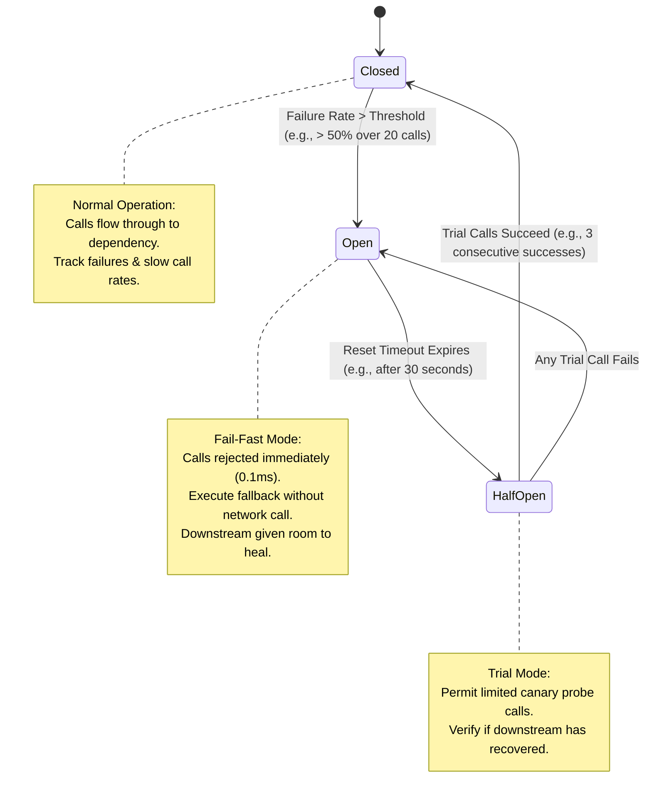
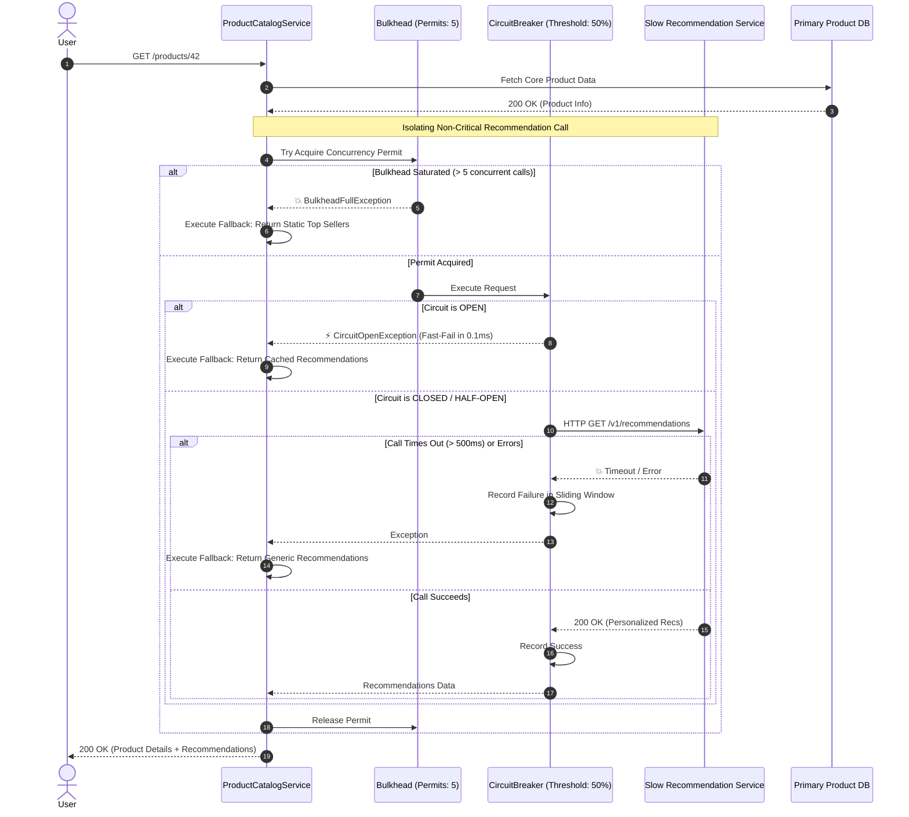

# Day 18 — The Cascading Failure: Circuit Breakers, Bulkheads, and System Isolation

> 🔗 **LinkedIn Discussion**: [Read & Discuss on LinkedIn](https://www.linkedin.com/in/himanshu-verma-822a07286/)  
> 🏛️ **System Architecture Milestone**: [`v5-resilient-services`](../../../system-evolution/v5-resilient-services/README.md)  
> 🚀 **Phase**: Phase 4 — Now the System Is Distributed (Days 16–20)  
> 🎯 **Today's Focus**: How Localized Downstream Latency Destroys Entire Distributed Fleets, and How to Isolate Failure Domains Using Circuit Breakers and Bulkheads

---

## The Problem

Yesterday in [Day 17 — Timeouts, Retries, and the Retry Storm](../day-17-timeouts-retries-retry-storm/README.md), we explored how uncoordinated retry logic multiplies network traffic across microservice boundaries. Today, we confront an even more dangerous production failure mode: **the slow dependency that starves your application from the inside out.**

In real-world distributed architectures, complete crashes are easy to handle. If a downstream database or third-party service crashes hard and drops TCP connections (`RST`), your application fails fast in milliseconds. The calling thread returns immediately, memory is freed, and the system continues running.

**Slowness is infinitely worse than outright failure.**

Consider what happens inside our **ShopScale** e-commerce platform during an ordinary Tuesday afternoon:

```text
                               THE ANATOMY OF A COLLAPSE
                               
     Incoming User Traffic
        (1,000 req/s)
              │
              ▼
   ┌────────────────────────────────────────────────────────┐
   │                  ShopScale API Gateway                 │
   └──────────┬─────────────────────────────────┬───────────┘
              │ (GET /checkout)                 │ (GET /products/:id)
              ▼                                 ▼
   ┌──────────────────────┐          ┌──────────────────────┐
   │    Order Service     │          │   Product Service    │
   │  (Thread Pool: 200)  │          │  (Thread Pool: 200)  │
   └──────────┬───────────┘          └──────────┬───────────┘
              │                                 │
              │                                 │ Calls recommendation engine
              │                                 ▼
              │                      ┌──────────────────────┐
              │                      │Recommendation Service│  ◄── Slips from 30ms to 4,500ms
              │                      └──────────┬───────────┘      (Lock contention on disk)
              ▼                                 │
   ┌──────────────────────┐                     ▼
   │   Primary Database   │          ┌──────────────────────┐
   │  (Healthy & Fast)    │          │ ML Vector DB / Disk  │  💥 Heavy background compaction
   └──────────────────────┘          └──────────────────────┘
```

The sequence of collapse unfolds with mechanical certainty:

1. **The Subtle Degradation (T = 0s)**: The data science team pushes an update to the `Recommendation Service`. A disk compaction job kicks off on its database replica. Response times for `/v1/recommendations` drift upward from **30 milliseconds to 4,500 milliseconds**. The service does not crash; it continues to respond—just slowly.
2. **Thread Saturation (T = 10s)**: The upstream `Product Service` handles 500 requests per second. Every product page renders personalized "Related Items" by synchronously calling the `Recommendation Service`. Under normal conditions (30ms latency), the `Product Service` requires only 15 concurrent worker threads to process these calls. But at 4,500ms latency, requests pile up. Within 10 seconds, all **200 worker threads** in the `Product Service`'s application pool are blocked, waiting on synchronous socket reads.
3. **Queue Inundation (T = 20s)**: With all worker threads blocked, the operating system socket backlog and the application's internal HTTP request queue fill to capacity. Incoming requests for *any* product—even requests that do not care about recommendations—are queued.
4. **Health Check Failure & Traffic Shedding (T = 30s)**: The Kubernetes kubelet sends a periodic HTTP ping to the `Product Service`'s `/healthz` endpoint. Because all worker threads are frozen waiting on socket I/O, the health check ping sits in the queue and times out after 2 seconds. Kubernetes concludes the pod is dead and removes it from the service endpoint list.
5. **The Domino Cascade (T = 45s)**: The remaining 4 pods of the `Product Service` suddenly receive a 25% increase in ingress traffic. Their thread pools saturate in less than 4 seconds. One by one, their health probes fail, and Kubernetes kills them.
6. **Platform-Wide Blackout (T = 60s)**: Now the `API Gateway` has hundreds of pending connections open to the dead `Product Service`. The Gateway’s own connection pools and file descriptors exhaust. Users trying to hit the completely unrelated `/checkout` endpoint receive `504 Gateway Timeout`.

A non-essential luxury feature—**product recommendations**—has systematically knocked down the product catalog, the API gateway, and the checkout system. The business cannot process payments.

This is a **Cascading Failure**.

---

## Why the Simple Approach Breaks

When engineering teams first encounter this failure mode, they typically implement intuitive, localized fixes. Each of these attempts fails under production stress.

```text
       Naive Attempt 1                   Naive Attempt 2                   Naive Attempt 3
     "Bigger Thread Pools"             "Shorter Timeouts"                "Restart the Service"
   ┌───────────────────────┐         ┌───────────────────────┐         ┌───────────────────────┐
   │ Increase pool size    │         │ Cut timeout from      │         │ Kill pod and let      │
   │ from 200 to 2,000     │         │ 5,000ms to 1,000ms    │         │ Kubernetes recreate   │
   └───────────┬───────────┘         └───────────┬───────────┘         └───────────┬───────────┘
               │                                 │                                 │
               ▼                                 ▼                                 ▼
    Memory blows up (OOM);            Still blocks 500 threads          Rebooted pod immediately
    CPU thrashing on context          every second; user wait           slammed with queued calls;
    switches; DB connections dead.    time remains unacceptable.        instant CrashLoopBackOff.
```

### 1. Increasing Thread / Connection Pool Limits

```yaml
# "Quick fix: Give the app more threads so it stops blocking incoming requests"
server:
  tomcat:
    threads:
      max: 2500  # Increased from 200
```

**Why it breaks:**
1. **Memory Exhaustion**: In runtimes like the JVM or Go/Python with OS-level threads, each thread reserves a stack (typically 512KB to 1MB). Allocating 2,500 active threads consumes 2.5GB of RAM purely for thread stacks, completely bypassing heap reservations and triggering the Linux Out-Of-Memory (OOM) Killer.
2. **CPU Context-Switching Thrashing**: When thousands of threads contend for CPU cores while waiting on I/O, the Linux kernel spends more time performing context switches, updating page tables, and managing runqueues than executing application instructions.
3. **Database Connection Starvation**: If every thread pool expands, the number of potential simultaneous outbound connections to your PostgreSQL or Redis cluster multiplies by 10×. The database hits `max_connections`, rejects all clients, and fails the entire engineering platform.

### 2. Relying Solely on Shorter Timeouts

```python
# "Just add a 1-second timeout to the recommendation call"
response = http_client.get("http://recommendation-service/v1/items", timeout=1.0)
```

**Why it breaks:**
A 1-second timeout is a boundary, not an isolation mechanism. 

If your service receives 500 requests per second and the downstream dependency takes 1.0 second to time out, your service is continuously holding:

$$\text{Active Blocked Threads} = 500 \text{ req/s} \times 1.0 \text{ s} = 500 \text{ threads}$$

If your thread pool has only 200 workers, **you are still completely saturated**. Every single incoming request spends 1,000 milliseconds blocked before returning an error to the user. Timeouts limit the damage duration, but they do not stop the bleeding.

### 3. Blind Pod Restarts (The Cold-Start Trap)

When on-call engineers see high memory, 100% thread utilization, and failing health checks, the instinctive reaction is:

```bash
kubectl rollout restart deployment/product-service
```

**Why it breaks:**
The new replacement pods must start from scratch:
* They must initialize runtimes, run JIT compilation, and allocate memory.
* They must establish database connection pools.
* Their internal caches are completely empty.

The moment the new pod becomes "Ready", the ingress load balancer directs full production traffic (e.g., 500 req/s) at it. Because its caches are cold, each request takes *longer* than normal to execute. The thread pool saturates within 500 milliseconds of startup. 

The pod fails its readiness check, Kubernetes marks it unready, and the cluster enters **CrashLoopBackOff**.

---

## Understanding the Problem

To prevent one dying component from dragging down the rest of the infrastructure, we must model resource utilization mathematically and understand how latency propagates through software layers.

### 1. The Physics of Concurrency: Little’s Law

The foundation of capacity planning in queuing systems is **Little’s Law**:

$$L = \lambda \times W$$

Where:
* $L$ = The average number of concurrent requests in the system (in-flight concurrency / threads occupied).
* $\lambda$ = The arrival rate of incoming requests (requests per second).
* $W$ = The average time spent processing a request (latency in seconds).

Under normal operational conditions for the ShopScale `Product Service`:
* $\lambda = 400 \text{ req/s}$
* $W = 0.050 \text{ s}$ (50ms)
* $L = 400 \times 0.050 = \mathbf{20 \text{ concurrent threads occupied}}$

A pool of 100 threads can handle this load comfortably, leaving 80% headroom for traffic spikes.

Now consider what happens when a downstream service degrades to 2.5 seconds:
* $\lambda = 400 \text{ req/s}$
* $W = 2.500 \text{ s}$ (2,500ms)
* $L = 400 \times 2.500 = \mathbf{1,000 \text{ concurrent threads required}}$

$$\Delta L = \frac{1,000}{20} = 50\times \text{ increase in thread demand}$$

The arrival rate $\lambda$ did not change by a single request. But because latency $W$ increased by 50×, the system requires **50× more concurrent resources** just to stay afloat. 

Any fixed-capacity resource (worker threads, database connections, socket descriptors, ephemeral ports) will be instantly depleted.

### 2. Synchronous Coupling and Latency Contagion

When Service A calls Service B synchronously, Service A's execution thread is **physically tethered** to Service B's responsiveness.

```text
Service A (Thread 42)
  │
  ├─► Executes local validation (1ms)
  │
  ├─► Sends HTTP request to Service B ──┐
  │   [THREAD BLOCKED ON RECV WAIT]     │ (Network Wire)
  │   [CANNOT PROCESS OTHER WORK]       ▼
  │                               Service B
  │                               (Running slow DB lock contention: 4,000ms)
  │                                     │
  ├─◄ Receives response from B ◄────────┘
  │
  └─► Returns response to User
```

In a synchronous runtime, a thread blocked on I/O cannot be reassigned to handle a different incoming HTTP request. Latency acts like an infectious contagion: **any upstream system calling a slow downstream system becomes equally slow.**

### 3. Blast Radius and Failure Domains

In civil engineering, a **failure domain** is the physical area affected when a single structural component fails. In software architecture, the blast radius of a failure defines what functionality breaks when a specific subsystem degrades:

```text
┌────────────────────────────────────────────────────────────────────────┐
│                   BLAST RADIUS COMPARISON                              │
├───────────────────────────────────┬────────────────────────────────────┤
│ Unisolated Architecture           │ Isolated Architecture              │
├───────────────────────────────────┼────────────────────────────────────┤
│ • Recommendations fail            │ • Recommendations fail             │
│   └── Product Page fails          │   └── Degraded fallback used       │
│       └── User cannot add to cart │       └── Cached/blank items shown │
│           └── Checkout fails      │ • Product page loads in 40ms       │
│               └── $0 Revenue      │ • Checkout runs at 100% capacity   │
└───────────────────────────────────┴────────────────────────────────────┘
```

Without strict architectural isolation, the blast radius of your least critical feature is **the entire platform**.

---

## Possible Approaches

To achieve resilience against cascading failures, we employ three complementary patterns:

```text
                               THE ISOLATION TOOLKIT
                               
     1. Circuit Breaker             2. Bulkhead Pattern           3. Graceful Fallback
   ┌───────────────────────┐     ┌───────────────────────┐     ┌───────────────────────┐
   │ Cut the connection to │     │ Compartmentalize your │     │ Return degraded,      │
   │ failing dependencies; │     │ resources into silos; │     │ cached, or default    │
   │ fail fast in 0.1ms.   │     │ prevent leakages.     │     │ data immediately.     │
   └───────────────────────┘     └───────────────────────┘     └───────────────────────┘
```

---

### Approach 1: The Circuit Breaker Pattern

Popularized by Michael Nygard in his seminal book *Release It!*, the **Circuit Breaker** pattern mimics electrical circuit breakers in home wiring. When a downstream service becomes unhealthy, the breaker "trips", immediately severing the network connection and failing fast without waiting for timeouts.



#### The Three Operational States

1. **CLOSED (Normal State)**:
   * All requests are executed against the downstream dependency.
   * The circuit breaker maintains a sliding window (time-based or count-based) recording outcomes: success, failure, or timeout.
   * If the failure rate or slow-call rate exceeds a configured threshold (e.g., 50% failures over 50 requests), the breaker **trips to OPEN**.

2. **OPEN (Failing Fast)**:
   * **Zero network calls are made to the downstream dependency.**
   * All calls immediately short-circuit. Instead of blocking a thread for 5,000ms waiting for a timeout, the method returns in **0.1ms** with an error or executes an alternative fallback.
   * This accomplishes two critical goals:
     1. **Protects the Caller**: Application threads are never blocked.
     2. **Protects the Callee**: The struggling downstream service is relieved of 100% of its inbound load, giving it room to clear backlogs, finish garbage collection, or scale up.

3. **HALF-OPEN (Canary Probing)**:
   * After a configured cool-down period (e.g., 30 seconds), the breaker transitions to `HALF-OPEN`.
   * It allows a small, strictly limited number of trial requests (e.g., 3 requests) to pass through to the downstream service.
   * If all trial requests succeed, the breaker assumes the downstream dependency has recovered and transitions back to **CLOSED**.
   * If even a single trial request fails or times out, the breaker immediately returns to **OPEN** for another cool-down period.

#### Where It Helps
* Eliminates thread starvation caused by slow or unresponsive remote dependencies.
* Shields downstream services from being overwhelmed while recovering.

#### Limitations
* Requires tuning of sensitive thresholds: failure percentage, sliding window size, minimum request volume, and reset durations.
* Introduces state management: in multi-instance deployments, each instance typically maintains its own local circuit breaker state unless coordinated via an external store (which introduces distributed complexity).

---

### Approach 2: The Bulkhead Pattern

The **Bulkhead Pattern** takes its name from the watertight compartments of a ship’s hull. If the hull of a ship is breached in one section, only that specific compartment fills with water. The remaining sealed bulkheads maintain buoyancy, preventing the entire vessel from sinking.

```text
           TRADITIONAL SHARED POOL vs. BULKHEAD PARTITIONING
           
  [ Shared Application Thread Pool: 100 Threads ]
  ┌────────────────────────────────────────────────────────────┐
  │ ▓▓▓▓▓▓▓▓▓▓▓▓▓▓▓▓▓▓▓▓▓▓▓▓▓▓▓▓▓▓▓▓▓▓▓▓▓▓▓▓▓▓▓▓▓▓▓▓▓▓▓▓▓▓▓▓▓▓ │
  └────────────────────────────────────────────────────────────┘
  ▲ 100% of threads consumed by slow Recommendation Service.
  💥 Checkout, Auth, and Search starve and crash!

  ──────────────────────────────────────────────────────────────

  [ Partitioned Bulkheads ]
  ┌──────────────────────┐  ┌──────────────────────┐  ┌──────────────────────┐
  │  Checkout Bulkhead   │  │   Search Bulkhead    │  │Recommendation Bulkhead│
  │    (50 Threads)      │  │    (30 Threads)      │  │    (20 Threads)      │
  │ ░░░░░░░░░░░░░░░░░░░░ │  │ ░░░░░░░░░░░░░░░░░░░░ │  │ ▓▓▓▓▓▓▓▓▓▓▓▓▓▓▓▓▓▓▓▓ │
  └──────────────────────┘  └──────────────────────┘  └──────────────────────┘
  ▲ Running smoothly!       ▲ Running smoothly!       ▲ Completely saturated;
  (Healthy)                 (Healthy)                 rejects new calls.
```

In software, bulkheads compartmentalize capacity so that a runaway failure in one component cannot consume the resources allocated to others.

There are two primary ways to implement bulkheads:

#### 1. Thread Pool Bulkheads
Each dependency is assigned its own dedicated thread pool with an isolated queue:
* `Order Processing`: 50 threads
* `Payment Gateway`: 30 threads
* `Recommendations`: 10 threads

If the `Recommendation Service` slows down, only its 10 dedicated threads will ever become blocked. The remaining 90 threads assigned to Orders and Payments remain 100% responsive.

#### 2. Semaphore Bulkheads (Concurrency Limiters)
Rather than spawning separate thread pools (which introduces thread scheduling and context-switching overhead), a **Semaphore Bulkhead** uses non-blocking atomic counters.
* The application allows a maximum of 15 concurrent calls to the `Recommendation Service`.
* When a thread wants to make a call, it attempts to acquire a permit from the semaphore.
* If 15 calls are already in-flight, the 16th call is **immediately rejected** without spawning a thread or waiting.
* The calling thread can immediately execute fallback logic without burning memory or CPU.

```text
┌─────────────────────────┬─────────────────────────────────┬─────────────────────────────────┐
│ Feature                 │ Thread Pool Bulkhead            │ Semaphore Bulkhead              │
├─────────────────────────┼─────────────────────────────────┼─────────────────────────────────┤
│ Overhead                │ High (extra threads & contexts) │ Ultra-Low (atomic counters)     │
│ Asynchronous Execution  │ Yes (work runs on worker pool)  │ No (runs on caller's thread)    │
│ Timeout Handling        │ Built-in thread interruption    │ Relies on socket-level timeouts │
│ Ideal Use Case          │ High-risk third-party APIs      │ Internal low-latency microservices│
└─────────────────────────┴─────────────────────────────────┴─────────────────────────────────┘
```

---

### Approach 3: Failure Isolation and Graceful Degradation

Isolation ensures that failures remain strictly localized within their designated failure domain. Once an issue is isolated by a Bulkhead or Circuit Breaker, the system must decide **what to return to the user**.

Instead of returning an unhandled `500 Internal Server Error`, a resilient system employs **Graceful Degradation**:

```text
                                FALLBACK STRATEGIES
                                
     1. Cached Fallback             2. Stub / Default             3. Silent Omission
   ┌───────────────────────┐     ┌───────────────────────┐     ┌───────────────────────┐
   │ Return stale data     │     │ Return static generic │     │ Omit component from   │
   │ from a local Redis    │     │ default values        │     │ UI; render remainder  │
   │ or in-memory cache.   │     │ (e.g., top 10 items). │     │ of page seamlessly.   │
   └───────────────────────┘     └───────────────────────┘     └───────────────────────┘
```

1. **Cached / Stale Fallback**: When the real-time pricing or recommendation engine fails, read the customer's last known cached recommendations from an in-memory cache. Stale data is infinitely superior to a broken page.
2. **Static Stub Fallback**: If personalized recommendations fail, fall back to a hardcoded list of the platform's all-time top 10 best-selling items. The user experience remains intact.
3. **Silent Omission**: On the product details page, if the review service is down, render the product description, images, and "Buy Now" button without the customer reviews widget. The customer can still purchase the product.

---

## Trade-offs: What We Gain and What We Give Up

Resilience patterns introduce structural trade-offs. You cannot add isolation without sacrificing either peak resource efficiency or architectural simplicity.

| Pattern | What We Gain | What We Give Up / System Costs | When to Choose |
|---|---|---|---|
| **No Isolation (Shared Pool)** | Maximum resource efficiency; all threads available to all endpoints; zero architectural overhead. | Total vulnerability to cascading failure; one slow dependency brings down the entire system. | Internal developer tools or ultra-simple CLI utilities. Never in production microservices. |
| **Circuit Breakers** | Fast failures (0.1ms vs 5,000ms); prevents thread exhaustion; provides breathing room for downstream recovery. | Complex tuning; risks false positives during brief latency spikes; requires well-designed fallbacks. | Any outbound network call across service boundaries or to external vendors. |
| **Semaphore Bulkheads** | Zero context-switching overhead; caps concurrent in-flight requests; lightweight protection against surges. | Cannot asynchronously interrupt a hanging socket; relies on downstream network timeouts. | High-throughput synchronous internal RPCs with strict timeout configurations. |
| **Thread Pool Bulkheads** | Complete isolation of memory and CPU; true asynchronous timeout interruption capabilities. | Increased memory footprint (thread stacks); CPU overhead from context switching; queuing delays. | Calling untrusted third-party vendors or heavy, unpredictable external systems. |
| **Graceful Fallbacks** | Preserves user journey; avoids catastrophic 500 error pages; maintains revenue generation. | Users may see stale, inaccurate, or incomplete information; requires custom fallback business logic. | Non-critical read paths (recommendations, reviews, search suggestions, analytics). |

---

## A Practical Example: The ShopScale Resilient Catalog Engine

Let us implement a production-grade, resilient service in Python for **ShopScale**.

The `ProductCatalogService` handles incoming user requests for product details. It must coordinate:
1. **Primary Product Database** (Critical — must succeed to view product).
2. **Recommendation Engine** (Non-critical — if it fails or slows down, we must gracefully degrade).

We will build a custom **Circuit Breaker** and a **Semaphore Bulkhead** to protect the catalog from being destroyed when recommendations experience latency spikes.



### Complete Implementation

```python
import time
import threading
from enum import Enum
from typing import Callable, Any, Optional, List

# ============================================================================
# 1. CIRCUIT BREAKER IMPLEMENTATION
# ============================================================================

class CircuitState(Enum):
    CLOSED = "CLOSED"        # Normal operation: traffic passes through
    OPEN = "OPEN"            # Tripped: traffic is rejected immediately
    HALF_OPEN = "HALF_OPEN"  # Testing: limited traffic allowed to test health

class CircuitBreakerOpenException(Exception):
    """Raised when an operation is attempted while the circuit breaker is OPEN."""
    pass

class CircuitBreaker:
    """
    A thread-safe Sliding-Window Circuit Breaker.
    Monitors failure rates and trips open when downstream dependencies degrade.
    """
    def __init__(
        self,
        failure_rate_threshold: float = 0.5,  # Trip if >= 50% fail
        recovery_time_seconds: float = 10.0,  # Wait 10s before probing
        sliding_window_size: int = 10,        # Sample size of 10 requests
        min_requests: int = 5                 # Minimum calls before evaluating
    ):
        self.failure_rate_threshold = failure_rate_threshold
        self.recovery_time_seconds = recovery_time_seconds
        self.sliding_window_size = sliding_window_size
        self.min_requests = min_requests

        self.state = CircuitState.CLOSED
        self.window: List[bool] = []  # True = Success, False = Failure
        self.last_state_change = time.time()
        self.lock = threading.Lock()

    def allow_request(self) -> bool:
        """Determines if a request is permitted to execute over the wire."""
        with self.lock:
            now = time.time()
            if self.state == CircuitState.OPEN:
                # Check if recovery cooldown has elapsed
                if now - self.last_state_change >= self.recovery_time_seconds:
                    self._transition_to(CircuitState.HALF_OPEN)
                    return True
                return False
            return True

    def record_result(self, success: bool):
        """Records whether the network call succeeded or failed."""
        with self.lock:
            if self.state == CircuitState.HALF_OPEN:
                if success:
                    # Canary probe succeeded: close the circuit
                    self._transition_to(CircuitState.CLOSED)
                else:
                    # Canary probe failed: trip immediately back to open
                    self._transition_to(CircuitState.OPEN)
                return

            if self.state == CircuitState.CLOSED:
                self.window.append(success)
                if len(self.window) > self.sliding_window_size:
                    self.window.pop(0)

                # Evaluate failure rate if minimum sample size reached
                if len(self.window) >= self.min_requests:
                    failures = self.window.count(False)
                    failure_rate = failures / len(self.window)
                    if failure_rate >= self.failure_rate_threshold:
                        self._transition_to(CircuitState.OPEN)

    def _transition_to(self, new_state: CircuitState):
        self.state = new_state
        self.last_state_change = time.time()
        self.window.clear()

    def execute(self, func: Callable, fallback: Callable, *args, **kwargs) -> Any:
        """Executes a protected callable with circuit breaking and fallback."""
        if not self.allow_request():
            # Circuit is OPEN: Short-circuit immediately!
            return fallback(*args, **kwargs)

        try:
            result = func(*args, **kwargs)
            self.record_result(success=True)
            return result
        except Exception:
            self.record_result(success=False)
            return fallback(*args, **kwargs)

# ============================================================================
# 2. BULKHEAD (CONCURRENCY LIMITER) IMPLEMENTATION
# ============================================================================

class BulkheadFullException(Exception):
    """Raised when concurrent request limit has been reached."""
    pass

class SemaphoreBulkhead:
    """
    Limits the number of concurrent executions to isolate resource usage.
    Fails fast without allocating additional threads.
    """
    def __init__(self, max_concurrent_calls: int):
        self.semaphore = threading.Semaphore(max_concurrent_calls)
        self.max_calls = max_concurrent_calls

    def execute(self, func: Callable, fallback: Callable, *args, **kwargs) -> Any:
        # Non-blocking acquisition: if full, fail immediately!
        acquired = self.semaphore.acquire(blocking=False)
        if not acquired:
            # Capacity exceeded: execute fallback immediately without waiting
            return fallback(*args, **kwargs)

        try:
            return func(*args, **kwargs)
        finally:
            self.semaphore.release()

# ============================================================================
# 3. SHOP-SCALE CATALOG SERVICE WITH ISOLATION
# ============================================================================

class ProductCatalogService:
    def __init__(self):
        # Allow maximum 5 concurrent recommendation calls
        self.bulkhead = SemaphoreBulkhead(max_concurrent_calls=5)
        
        # Trip if >= 50% of calls fail or time out
        self.circuit_breaker = CircuitBreaker(
            failure_rate_threshold=0.5,
            recovery_time_seconds=5.0,
            sliding_window_size=10,
            min_requests=4
        )

    def _call_slow_recommendations_api(self, product_id: int) -> List[str]:
        """Simulates a remote call to the Recommendation Service."""
        # Under normal conditions, takes 30ms.
        # Under degraded conditions, takes 4,000ms or raises TimeoutError.
        raise TimeoutError("Downstream service timed out after 500ms")

    def _recommendation_fallback(self, product_id: int) -> List[str]:
        """Graceful degradation: Return cached or static popular items."""
        return ["Item-TopSeller-A", "Item-TopSeller-B", "Item-TopSeller-C"]

    def get_product_details(self, product_id: int) -> dict:
        """
        Critical Path: Must return core product data even if
        recommendations are completely offline.
        """
        # Step 1: Fetch core product information (Fast & Healthy)
        product_data = {
            "id": product_id,
            "title": "Ergonomic Mechanical Keyboard",
            "price": 149.99,
            "inventory": 38
        }

        # Step 2: Fetch non-critical recommendations wrapped in Bulkhead + Circuit Breaker
        def protected_call():
            return self.circuit_breaker.execute(
                func=lambda: self._call_slow_recommendations_api(product_id),
                fallback=lambda: self._recommendation_fallback(product_id)
            )

        recommendations = self.bulkhead.execute(
            func=protected_call,
            fallback=lambda: self._recommendation_fallback(product_id)
        )

        product_data["recommendations"] = recommendations
        return product_data

# ============================================================================
# 4. SIMULATION DEMONSTRATION
# ============================================================================

if __name__ == "__main__":
    service = ProductCatalogService()

    print("--- Simulating Incoming Traffic During Downstream Outage ---")
    for req_id in range(1, 13):
        start_time = time.time()
        response = service.get_product_details(product_id=42)
        elapsed_ms = (time.time() - start_time) * 1000

        print(
            f"Req #{req_id:02d} | "
            f"State: {service.circuit_breaker.state.value:<9} | "
            f"Latency: {elapsed_ms:5.1f}ms | "
            f"Recs: {response['recommendations']}"
        )
        time.sleep(0.1)

    print("\n--- Waiting 5 Seconds for Circuit Breaker Cooldown ---")
    time.sleep(5.1)

    print("\n--- Probing in HALF-OPEN State ---")
    response = service.get_product_details(product_id=42)
    print(
        f"Probe Req | State: {service.circuit_breaker.state.value:<9} | "
        f"Recs: {response['recommendations']}"
    )
```

### Output Analysis

When you execute this script, notice what happens to latency and system state:

```text
--- Simulating Incoming Traffic During Downstream Outage ---
Req #01 | State: CLOSED    | Latency:   0.2ms | Recs: ['Item-TopSeller-A', 'Item-TopSeller-B', 'Item-TopSeller-C']
Req #02 | State: CLOSED    | Latency:   0.1ms | Recs: ['Item-TopSeller-A', 'Item-TopSeller-B', 'Item-TopSeller-C']
Req #03 | State: CLOSED    | Latency:   0.1ms | Recs: ['Item-TopSeller-A', 'Item-TopSeller-B', 'Item-TopSeller-C']
Req #04 | State: CLOSED    | Latency:   0.1ms | Recs: ['Item-TopSeller-A', 'Item-TopSeller-B', 'Item-TopSeller-C']
Req #05 | State: OPEN      | Latency:   0.1ms | Recs: ['Item-TopSeller-A', 'Item-TopSeller-B', 'Item-TopSeller-C']
Req #06 | State: OPEN      | Latency:   0.1ms | Recs: ['Item-TopSeller-A', 'Item-TopSeller-B', 'Item-TopSeller-C']
...
--- Waiting 5 Seconds for Circuit Breaker Cooldown ---

--- Probing in HALF-OPEN State ---
Probe Req | State: OPEN      | Recs: ['Item-TopSeller-A', 'Item-TopSeller-B', 'Item-TopSeller-C']
```

1. **Req #01 to #04**: The calls fail because the downstream service timed out. The circuit records these failures while in `CLOSED` state.
2. **Req #05**: The failure threshold (50%) is breached across the minimum sample window. **The Circuit Breaker trips to OPEN.**
3. **Req #06 to #12**: **Zero network calls are attempted.** The requests do not wait for timeouts; they short-circuit in **0.1ms** and execute the graceful fallback. The primary product page loads instantly.
4. **Cooldown**: After 5 seconds, the breaker enters `HALF-OPEN` on the probe request. Because the downstream dependency is still timing out, it immediately re-trips to `OPEN` without admitting further traffic.

The catalog service remained completely healthy throughout the incident. **The failure was contained.**

---

## Failure Scenarios: What Can Still Go Wrong

Even when circuit breakers and bulkheads are deployed, subtle misconfigurations can lead to production disasters.

```text
┌─────────────────────────────────────────────────────────────────────────────┐
│                       RESILIENCE FAILURE MODES                              │
├──────────────────────────────────────┬──────────────────────────────────────┤
│ 1. The Flapping Circuit Breaker      │ 2. The Heavy Fallback Trap           │
├──────────────────────────────────────┼──────────────────────────────────────┤
│ Breaker cycles OPEN -> HALF-OPEN ->  │ Fallback query hits a centralized    │
│ OPEN every 10s under heavy load;     │ Redis/DB cache, exhausting the cache │
│ introduces periodic latency spikes.  │ and taking down secondary systems.   │
├──────────────────────────────────────┼──────────────────────────────────────┤
│ 3. The Bulkhead Bypass (Shared Pool) │ 4. Misconfigured Health Probes       │
├──────────────────────────────────────┼──────────────────────────────────────┤
│ Isolated thread pools draw from the  │ Kubelet liveness probe hits a broken │
│ exact same database connection pool; │ circuit breaker, killing healthy pods│
│ DB starvation bypasses isolation.    │ that are safely serving fallbacks.   │
└──────────────────────────────────────┴──────────────────────────────────────┘
```

### 1. The Flapping Circuit Breaker
* **The Scenario**: A high-throughput service (2,000 req/s) trips its circuit breaker to `OPEN`. After a 30-second cooldown, the breaker transitions to `HALF-OPEN`.
* **The Failure**: If the circuit breaker implementation does not restrict concurrency in `HALF-OPEN` mode to a single probe request, **hundreds of requests surge through at once**. The struggling downstream dependency is slammed with a thundering herd, immediately chokes, and causes all trial requests to fail. The breaker snaps back to `OPEN`.
* **The Impact**: Every 30 seconds, your system experiences a massive latency spike and error surge. The breaker continuously "flaps" between states.
* **The Defense**: In `HALF-OPEN`, use a strict semaphore of **exactly 1 or 2 probe requests**. Reject all other requests with the fallback until the probe conclusively verifies downstream health.

### 2. The Heavy Fallback Trap (The Secondary Collapse)
* **The Scenario**: An engineer configures a fallback for a failing SQL query: *"If PostgreSQL fails, fetch the cached user profile from Redis."*
* **The Failure**: Under normal conditions, Redis handles 50 req/s. When PostgreSQL degrades, the circuit breaker trips, routing **5,000 req/s** directly to Redis. Redis memory bandwidth saturates, CPU hits 100%, and Redis crashes.
* **The Defense**: Fallbacks must be **passive, pre-calculated, or static**. A fallback should never perform an un-throttled heavy operation on a shared infrastructure dependency.

### 3. The Bulkhead Bypass (Hidden Shared Resources)
* **The Scenario**: A team separates their application threads into two isolated pools: `Pool A` (Orders) and `Pool B` (Reporting).
* **The Failure**: Both thread pools use the same underlying database connection pool (`HikariCP` with 50 connections). When reporting queries run slow, `Pool B` threads hold onto 45 of the 50 database connections. `Pool A` worker threads are healthy and free, but they cannot execute because **no database connections are available**.
* **The Defense**: Bulkheads must isolate **all shared bottlenecks**, not just application threads. Create separate database connection pools, separate CPU quotas, and separate network connection pools for critical vs. non-critical workflows.

### 4. Health Check Poisoning
* **The Scenario**: An application has a circuit breaker protecting calls to an external payment gateway. When the payment gateway goes down, the circuit breaker opens, and the service returns a degraded response.
* **The Failure**: The application's `/healthz` or `/ready` endpoint checks the health of *all* downstream dependencies. Because the circuit breaker is OPEN, the health check endpoint returns `503 Service Unavailable`. Kubernetes interprets this as a container failure and restarts the pod.
* **The Defense**: **Never include external or non-critical dependencies in Kubernetes liveness or readiness probes.** Liveness probes should only verify if the local process is alive and able to allocate memory. A service serving degraded fallbacks is healthy and must remain running!

---

## Key Engineering Decisions

When architecting isolation and fault tolerance into distributed systems, follow this decision tree:

```text
                         ISOLATION DECISION FRAMEWORK
                                      │
                      Is the dependency in the CRITICAL
                         path for primary revenue/auth?
                                      │
                   ┌──────────────────┴──────────────────┐
                   ▼ YES                                 ▼ NO
      Must succeed to complete              Can degrade or omit
             transaction                         gracefully
                   │                                     │
                   ▼                                     ▼
        Is the call SYNCHRONOUS?               Is real-time data
                   │                          MANDATORY for user?
        ┌──────────┴──────────┐                          │
        ▼ NO                  ▼ YES           ┌──────────┴──────────┐
    Move to ASYNC       Use THREAD POOL       ▼ NO                  ▼ YES
     EVENT QUEUE           BULKHEAD       Return STATIC /      Use CIRCUIT BREAKER
     (Kafka / SQS)      + STRICT TIMEOUT  STALE CACHED DATA    + SEMAPHORE BULKHEAD
      (See Day 12)       (Fast Fail)       (Zero Network)       + GRACEFUL FALLBACK
```

### The 5 Golden Rules of Cascading Failure Defense

1. **Non-Critical Dependencies Must Never Break the Critical Path**: If the user is trying to check out, a failure in recommendations, analytics, reviews, or personalization must have zero impact on the checkout flow.
2. **Fail Fast with Circuit Breakers**: Waiting 5,000ms for a timeout is an architectural anti-pattern. If a service is down, fail in 0.1ms and free the thread immediately.
3. **Isolate Capacities with Bulkheads**: Compartmentalize thread pools and connection pools. Never let an auxiliary feature consume more than its reserved share of global capacity.
4. **Plan Fallbacks Before Writing Network Calls**: When writing a remote call, define what the user will see when that call fails. If the answer is an error screen, you have not finished designing the feature.
5. **Decouple Health Probes from Dependency Health**: A container that is gracefully degrading via circuit breakers is functioning as intended. Never let downstream outages kill healthy upstream pods.

---

## Key Takeaways

* **Slowness is worse than death**: A crashed service fails immediately; a slow service holds threads, exhausts connection pools, and triggers fleet-wide cascading collapse.
* **Little’s Law dictates concurrency**: When response latency increases by 50×, the number of concurrent threads required to sustain the same arrival rate increases by 50×.
* **Circuit Breakers prevent latency contagion**: By tripping to OPEN, circuit breakers replace multi-second timeouts with sub-millisecond fast rejections, shielding callers and allowing callees time to heal.
* **Bulkheads prevent cross-contamination**: Partitioning concurrency limits (via threads or semaphores) ensures that non-essential features cannot starve mission-critical transactions.
* **Graceful degradation preserves business value**: Serving stale recommendations, generic best-sellers, or omitted UI widgets is infinitely superior to serving a `500 Internal Server Error`.

---

### 🧭 Navigation & Next Steps

* Read the previous guide: **[Day 17 — Timeouts, Retries, and the Retry Storm](../day-17-timeouts-retries-retry-storm/README.md)**
* Read the next guide: **[Day 19 — Distributed Systems Don't Agree on Everything](../day-19-distributed-disagreement/README.md)**
* View the architecture milestone: [`v5-resilient-services`](../../../system-evolution/v5-resilient-services/README.md)
