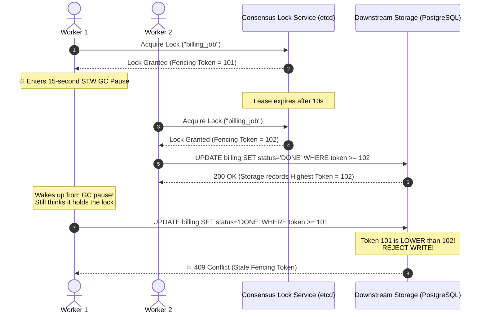
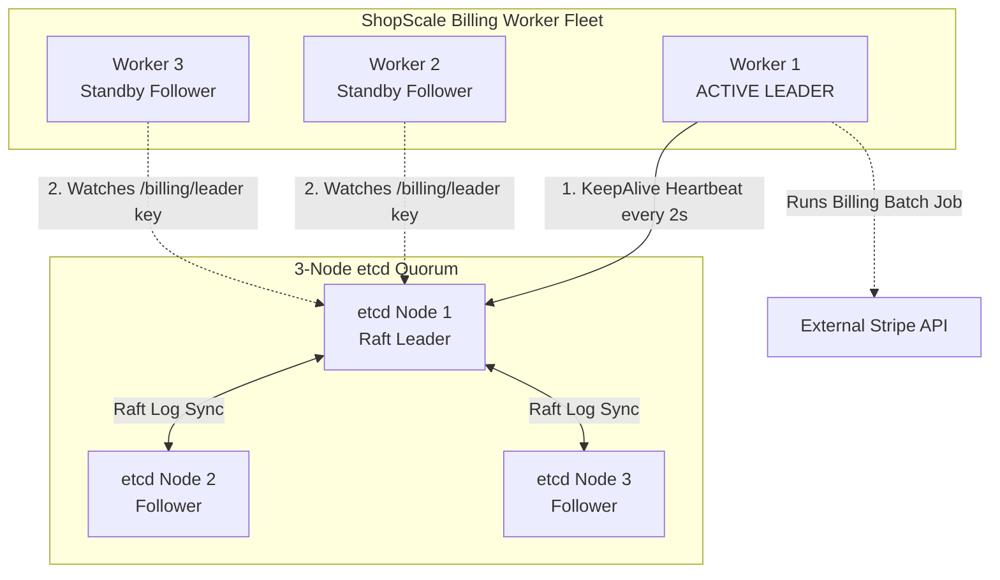

# Day 19 — Distributed Systems Don't Agree on Everything: Coordination, Locks, Leaders, and Split-Brain

> 🔗 **LinkedIn Discussion**: [Read & Discuss on LinkedIn](https://www.linkedin.com/in/himanshu-verma-822a07286/)  
> 🏛️ **System Architecture Milestone**: [`v5-resilient-services`](../../../system-evolution/v5-resilient-services/README.md)  
> 🚀 **Phase**: Phase 4 — Now the System Is Distributed (Days 16–20)  
> 🎯 **Today's Focus**: Why Independent Nodes Cannot Inherently Agree on Time, State, or Authority—and How to Coordinate Without Destroying Availability or Data Integrity

---

## The Problem

Over the previous three days ([Day 16 — The Network Is Not Reliable](../day-16-network-is-unreliable/README.md), [Day 17 — Timeouts, Retries, and the Retry Storm](../day-17-timeouts-retries-retry-storm/README.md), and [Day 18 — The Cascading Failure](../day-18-cascading-failures/README.md)), we examined what happens when networks drop packets, retries storm infrastructure, and downstream services slow to a crawl. But today, we confront an even more dangerous distributed failure mode: **what happens when independent nodes disagree on state, authority, or reality itself?**

In Phase 1 and Phase 2, our entire application ran inside a single operating system process or relied on a single primary database. Coordination in that world was straightforward:

* If two threads inside the same process needed to update the inventory counter, we acquired a language-level mutex (`sync.Mutex` in Go, `synchronized` in Java, or `threading.Lock` in Python). The operating system kernel and CPU cache coherency protocols (MESI) ensured that exactly one thread entered the critical section at any nanosecond.
* If multiple worker processes needed to reserve stock, we issued a transactional row-level lock in PostgreSQL:
  ```sql
  SELECT stock FROM inventory WHERE product_id = 42 FOR UPDATE;
  ```
  The database engine serialized access via its internal lock manager. One transaction waited for the other to commit or roll back.

In Phase 3 and Phase 4, we scaled **ShopScale** horizontally. Today, our architecture features:
1. **12 stateless API pods** running across multiple availability zones.
2. **Background worker clusters** processing asynchronous billing batches and order fulfillment jobs.
3. **A partitioned datastore and streaming tier** where dedicated nodes must manage leader-only tasks like shard rebalancing, sequence generation, and cron scheduling.

```text
                     THE ILLUSION OF DISTRIBUTED AGREEMENT
                     
       Pod A (Worker 1)                            Pod B (Worker 2)
    ┌────────────────────┐                      ┌────────────────────┐
    │  "I am the leader  │                      │  "I am the leader  │
    │  for Invoice Batch │                      │  for Invoice Batch │
    │     #2026-09"      │                      │     #2026-09"      │
    └─────────┬──────────┘                      └──────────┬──────────┘
              │                                            │
              │ Both believe they hold exclusive authority │
              ▼                                            ▼
    ┌─────────────────────────────────────────────────────────────────┐
    │                      Third-Party Payment API                    │
    │               Customers charged TWICE ($1.2M total)             │
    └─────────────────────────────────────────────────────────────────┘
```

Consider what happened in production during an overnight billing run:

1. **Job Initialization**: At 02:00:00 UTC, the scheduled billing job kicked off. To prevent duplicate charges, worker nodes must run a mutual exclusion protocol so that only **one worker** processes invoice batch `#2026-09`.
2. **The Worker Stall**: `Worker-A` acquired the lock and began charging customer payment methods via an external payment gateway. At 02:00:15 UTC, `Worker-A` entered an unannounced 12-second Stop-The-World (STW) Garbage Collection pause triggered by memory compaction.
3. **The Presumed Death**: `Worker-B` monitored `Worker-A` via heartbeats. Because `Worker-A` was paused, its heartbeat stopped. `Worker-B` concluded: *"Worker-A has crashed. I must take over leadership."*
4. **The Dual Execution**: `Worker-B` claimed the billing job and began issuing charges to the payment gateway starting from invoice #1.
5. **The Resurrection**: Three seconds later, `Worker-A`'s GC pause completed. `Worker-A` had no idea it had been paused. Its CPU registers and instruction pointer resumed exactly where they left off. It continued executing charges starting from invoice #45.
6. **The Disaster**: For the next 10 minutes, **both workers ran simultaneously**. Over 8,000 customers were charged twice. The support queue exploded with fraud complaints, chargebacks spiked, and our payment processor temporarily flagged our merchant account.

Why did this happen? Because in a distributed system, **there is no shared memory, there is no shared physical clock, and there is no reliable way to distinguish between a node that is dead and a node that is merely slow.**

---

## Why the Simple Approach Breaks

When engineering teams transition from single-node systems to distributed architectures, they instinctively apply single-node mental models to multi-node environments. Every one of these naive approaches fails in production.

```text
       Naive Attempt 1                   Naive Attempt 2                   Naive Attempt 3
      "In-Memory Locks"                 "Redis SETNX with TTL"            "Heartbeat Leader Ping"
    ┌───────────────────────┐         ┌───────────────────────┐         ┌───────────────────────┐
    │ Use language mutex    │         │ SET lock:job token    │         │ Ping primary every 1s │
    │ inside application    │         │ EX 10 NX; delete lock │         │ If 3 pings fail,      │
    │ memory pool           │         │ on job completion     │         │ promote secondary     │
    └───────────┬───────────┘         └───────────┬───────────┘         └───────────┬───────────┘
                │                                 │                                 │
                ▼                                 ▼                                 ▼
    Only guards threads within        GC pause/network delay            Network partition separates
    a single OS process.              expires TTL; another worker       nodes. Both think they are
    Pod B ignores Pod A's lock.       acquires lock. DUAL WRITERS!      primary. SPLIT-BRAIN!
```

### 1. The In-Memory Mutex Fallacy

```python
# Naive Attempt: Trying to coordinate across pods with local locks
import threading

invoice_lock = threading.Lock()

def process_monthly_invoices():
    with invoice_lock:
        # Critical section: charge credit cards
        run_billing_pipeline()
```

**Why it breaks:**
An in-memory lock (`mutex`, `semaphore`, `reentrant lock`) is a pointer in the private virtual address space of a single operating system process. When you deploy 5 pods on Kubernetes, you have 5 isolated memory spaces. `Pod-2` has no visibility into the memory address of `Pod-1`. All 5 pods will acquire their own local lock simultaneously and execute the critical section in parallel.

### 2. The Unfenced Redis Lock (`SETNX` with TTL)

To coordinate across independent processes, engineers turn to a shared key-value store like Redis:

```python
# Naive Attempt: Redis SETNX with a lease timeout
def process_order_with_lock(order_id):
    acquired = redis_client.set(f"lock:order:{order_id}", "worker-1", nx=True, ex=10)
    if not acquired:
        return "Resource busy"
    
    try:
        # Perform external call and database mutation
        debit_inventory(order_id)
        charge_payment(order_id)
    finally:
        redis_client.delete(f"lock:order:{order_id}")
```

**Why it breaks:**
This pattern works in 99% of unit tests, but collapses in production due to the **pause-expire-race sequence**:

```text
 Worker 1                     Redis Cluster                    Worker 2                    Database
    │                               │                              │                           │
    ├─── SET lock:order EX 10 ────►│                              │                           │
    │◄── Lock Granted (OK) ────────┤                              │                           │
    │                               │                              │                           │
  [ 💥 STW GC Pause / Network Lag ] │                              │                           │
  [ Worker 1 is frozen for 15s     ] │                              │                           │
    │                               │                              │                           │
    │                               ├── 10s TTL Expires            │                           │
    │                               │   Lock automatically deleted │                           │
    │                               │                              │                           │
    │                               │◄── SET lock:order EX 10 ─────┤                           │
    │                               ├─── Lock Granted (OK) ───────►│                           │
    │                               │                              │                           │
    │                               │                              ├── Read stock (1 item) ───►│
    │                               │                              ├── Decrement stock (0) ───►│
  [ Worker 1 wakes up from GC ]     │                              │                           │
    │                               │                              │                           │
    │─── Decrement stock (-1) ────────────────────────────────────────────────────────────────►│ 💥 CORRUPTED!
    │                               │                              │                           │
```

1. `Worker 1` acquires the lock with a 10-second Time-To-Live (TTL).
2. `Worker 1` experiences an unexpected delay: a JVM Stop-The-World pause, Python GIL contention, a page fault loading virtual memory from swap disk, or a CPU throttle from Kubernetes CFS bandwidth limits.
3. While `Worker 1` is paused, 10 seconds elapse. Redis automatically expires the lock key.
4. `Worker 2` requests the lock. Redis grants it because the key no longer exists.
5. `Worker 2` reads the current inventory, sees 1 unit left, and decrements it to 0.
6. `Worker 1` wakes up. It does not know time passed. It believes it still owns the lock! It proceeds to execute its write, decrementing inventory to -1 or double-charging the customer.

**A distributed lock without a validation mechanism on the target storage cannot guarantee mutual exclusion.**

### 3. Asymmetric Heartbeats and the Split-Brain Trap

To run an active-passive stateful service (e.g., our custom search indexer or leader-elected payment worker), teams write simple heartbeat monitors:

```text
                  THE SPLIT-BRAIN PARTITION
                  
       Subnet Alpha                              Subnet Beta
  ┌───────────────────────┐               ┌───────────────────────┐
  │        Node A         │   💥 Network  │        Node B         │
  │   (Original Leader)   │   Partition   │  (Promoted to Leader) │
  │                       │   (Switch     │                       │
  │ Accepts writes from   │   failure)    │ Accepts writes from   │
  │ Clients in Subnet A   │               │ Clients in Subnet B   │
  └───────────┬───────────┘               └───────────┬───────────┘
              │                                       │
              ▼                                       ▼
     [ Storage Vol A ]                       [ Storage Vol B ]
     (Data divergence: Conflicting IDs, conflicting balances)
```

**Why it breaks:**
A top-of-rack network switch failure isolates Rack Alpha from Rack Beta. 
* `Node A` is still healthy and continues serving writes from clients located in its rack.
* `Node B` cannot reach `Node A`. It concludes `Node A` has died, promotes itself to Primary, and begins accepting writes from clients in its rack.
* The system now has **two leaders (Split-Brain)**.

When the network heals 20 minutes later, the data on both sides has irreversibly diverged. Both nodes issued the same sequential IDs, processed conflicting account withdrawals, and mutated identical records into irreconcilable states. Merging two conflicting distributed logs without data loss is mathematically impossible without domain-specific conflict resolution rules.

---

## Understanding the Problem: Why Agreement is Hard

To build distributed systems that do not corrupt data, we must understand the fundamental physical constraints governing computers connected by networks.

### 1. The Three Impossibilities of Distributed State

In a single machine, we take three foundational primitives for granted:
1. **Shared State**: All CPU cores observe changes to main memory through hardware cache coherency.
2. **Monotonic Wall Clocks**: Time moves forward at a predictable rate across all cores.
3. **Deterministic Failure**: If the CPU crashes, it stops executing instructions immediately (Crash-Stop).

In a distributed system, **all three primitives vanish**:

```text
┌────────────────────────────────┬────────────────────────────────────────────────────────────────┐
│ Single-Machine Assumption      │ Distributed Reality                                            │
├────────────────────────────────┼────────────────────────────────────────────────────────────────┤
│ Memory is directly accessible  │ State is communicated exclusively via asynchronous messages    │
│ Clocks are synchronized        │ Clocks drift; NTP can jump backwards or freeze                 │
│ Failures are binary (up/down)  │ Nodes can be arbitrarily slow, unresponsive, or partially dead │
│ Ordering is deterministic      │ Messages can be delayed, reordered, or duplicated              │
└────────────────────────────────┴────────────────────────────────────────────────────────────────┘
```

### 2. Time is an Illusion: Physical vs. Logical Clocks

Software engineers often write code that assumes wall-clock time (`System.currentTimeMillis()` or `time.time()`) is globally consistent:

```python
# DANGEROUS: Assuming two servers agree on what time it is
if incoming_message.timestamp > current_record.timestamp:
    current_record = incoming_message  # Last-Write-Wins (LWW)
```

Physical quartz oscillators in server motherboards drift naturally due to ambient temperature, voltage fluctuations, and hardware age. A typical server clock drifts by several milliseconds every day. 

While the Network Time Protocol (NTP) periodically synchronizes servers against atomic clocks:
* NTP synchronization is periodic, not continuous. Between sync intervals, clocks drift apart.
* An NTP sync can step time **backwards** if the local clock was running fast.
* Virtualized environments (AWS EC2, GCP Compute Engine, containers) can experience multi-hundred-millisecond clock jumps during hypervisor live migrations.

If `Server A` has a clock that is 80ms ahead of `Server B`, an event that occurs *after* another event in real physical time can receive an earlier timestamp. Relying on physical timestamps for ordering creates silent data loss under **Last-Write-Wins (LWW)** conflict resolution:

```text
 Real Physical Time ─────────────────────────────────────────────────────────────►
 
 T = 100ms: User updates email to "alice@work.com" on Server B (Local clock: 090ms)
 T = 105ms: User updates email to "alice@home.com" on Server A (Local clock: 185ms)
 
 If Server B's write arrives late, its timestamp (090ms) is lower than 185ms.
 The earlier update wins, and the user's latest intent is permanently erased!
```

> **Engineering Rule**: Never use physical wall-clock timestamps to establish causal ordering in distributed systems. Use **Logical Clocks** (Lamport Timestamps, Vector Clocks) or **Consensus Sequences** (Raft/Paxos Log Indices).

### 3. The Unobservability of Failure

If `Node A` sends a message to `Node B` and receives no reply, it is mathematically impossible for `Node A` to determine which of the following four events occurred:

```text
 Possibility 1: The outbound request packet was dropped by a router.
 Possibility 2: Node B crashed before executing the request.
 Possibility 3: Node B executed the request, but entered a 30-second GC pause.
 Possibility 4: Node B executed the request, but the inbound response packet was dropped.
```

Because `Node A` cannot distinguish between a dead node and a slow network, **any timeout chosen to detect node death is an arbitrary guess.**
* If you set the timeout too short: A temporary network spike or GC pause causes healthy nodes to be declared dead, triggering constant, destructive leader re-elections (election storms).
* If you set the timeout too long: The system remains frozen for minutes before realizing the actual leader has crashed.

### 4. The FLP Impossibility Result

In 1985, researchers Fischer, Lynch, and Paterson published the foundational theorem of distributed computing (**FLP Impossibility**):

> *In an asynchronous network, no deterministic consensus protocol can guarantee both Safety (nothing bad happens / no two nodes decide differently) and Liveness (something good eventually happens / nodes make progress) in the presence of even a single unannounced crash failure.*

Real-world distributed systems solve this dilemma by refusing to operate in pure asynchronous mode:
* They sacrifice pure liveness during network partitions to guarantee **Safety** (e.g., Raft, etcd, ZooKeeper refuse to accept writes if a majority quorum cannot be reached).
* They employ **partial synchrony** (assuming that networks usually deliver messages within an upper bound, allowing randomized timeouts to elect leaders).

---

## Possible Approaches

When your system must coordinate work across multiple independent nodes, you have four realistic architectural strategies.

```text
                              COORDINATION STRATEGIES
                                         │
                 ┌───────────────────────┴───────────────────────┐
                 ▼                                               ▼
         STORAGE-BOUNDED                                 DISTRIBUTED CONSENSUS
   (Rely on an existing ACID engine)               (Multi-node quorum agreement)
                 │                                               │
        ┌────────┴────────┐                             ┌────────┴────────┐
        ▼                 ▼                             ▼                 ▼
   1. Database      2. Optimistic                  3. Consensus      4. Single Writer
    Pessimistic      Concurrency                     Leader /           Partitioning
      Locking          Control                      Distributed         (Kafka Shard)
   (FOR UPDATE)     (Version Token)                    Lock
```

### 1. Database-Level Pessimistic Locking (`SELECT ... FOR UPDATE`)

Instead of inventing a distributed coordination layer, delegate mutual exclusion to the transactional database that already holds your source of truth.

#### How it works
The client starts an ACID transaction, queries the row, and appends `FOR UPDATE`. The database engine holds an exclusive row lock on the primary index until the transaction explicitly executes `COMMIT` or `ROLLBACK`.

```sql
BEGIN;
SELECT id, stock, version 
FROM inventory 
WHERE product_id = 42 
FOR UPDATE;

-- Application checks: stock > 0
UPDATE inventory 
SET stock = stock - 1 
WHERE product_id = 42;

COMMIT;
```

#### Where it helps
* Immediate consistency on financial balances, physical inventory allocation, and order state machines.
* Eliminates the need to manage external locking infrastructure like Redis or ZooKeeper.

#### Limitations
* **Database Connection Saturation**: Long-running operations inside the transaction hold database connections open. If the worker makes an outbound HTTP call to Stripe while holding `FOR UPDATE`, that database connection is blocked for seconds.
* **Deadlocks**: If two transactions lock resources in different orders (`Order A locks Item 1 then Item 2`; `Order B locks Item 2 then Item 1`), the database engine must detect and abort one of them.
* **Scope Limit**: Cannot coordinate actions that exist outside the database (e.g., preventing two workers from writing the same file to S3).

#### When it makes sense
When the state being guarded lives entirely within a single relational database, and the critical section executes in under 50 milliseconds without outbound network I/O.

---

### 2. Optimistic Concurrency Control (OCC / CAS with Fencing Tokens)

Instead of blocking other writers, assume conflicts are rare. Allow anyone to attempt the operation, but reject any write that tries to update stale state.

#### How it works
Every mutable entity carries a monotonically increasing version number or transaction counter. When updating, the write only succeeds if the version in storage matches the version read at the start of the transaction:

```sql
UPDATE inventory 
SET stock = stock - 1, version = version + 1 
WHERE product_id = 42 AND version = 7;
```

If another worker modified the row in the meantime, the `version` is now `8`. The SQL statement affects `0 rows`. The calling application detects that zero rows were updated, aborts the operation, and either retries from scratch or reports an error.

```text
 Worker A (Read version=7)                       Storage (Current version=7)
 Worker B (Read version=7)                                    │
    │                                                         │
    ├─── Worker A: UPDATE ... SET stock=9, ver=8 WHERE ver=7 ─►│ (Succeeds! ver becomes 8)
    │                                                         │
    ├─── Worker B: UPDATE ... SET stock=9, ver=8 WHERE ver=7 ─►│ 💥 FAILS! (0 rows updated)
    │                                                         │    Worker B must re-read
```

#### Where it helps
* High-read, low-write workloads.
* Stateless REST APIs where clients submit updates to resources (using HTTP `ETag` and `If-Match` headers).

#### Limitations
* High write contention causes **retry storms**. If 100 workers attempt to update the same row simultaneously, 1 succeeds and 99 fail, wasting massive amounts of CPU and database bandwidth on retries.

#### When it makes sense
When write contention on any single entity is low (< 5 writes/sec), or when operations can be retried cleanly without side effects.

---

### 3. Quorum-Based Consensus & Leader Election (Raft / Paxos / etcd)

When independent nodes must agree on who is the single authorized leader, or agree on a sequential log of state changes, they rely on **Quorum-based Consensus Protocols** (such as Raft or Paxos).

#### How it works
Consensus algorithms rely on an odd number of voting nodes ($2f + 1$, e.g., 3, 5, or 7). A decision (electing a leader, committing a log entry) is valid only when approved by a **strict majority quorum**:

$$\text{Quorum Size} = \left\lfloor \frac{N}{2} \right\rfloor + 1$$

* In a 3-node cluster, quorum is $2$. The system survives $1$ dead node.
* In a 5-node cluster, quorum is $3$. The system survives $2$ dead nodes.

```text
               THE MATHEMATICS OF MAJORITY OVERLAP
               
      Quorum 1 (Nodes A, B)             Quorum 2 (Nodes B, C)
    ┌───────────────────────┐         ┌───────────────────────┐
    │  [Node A]   [Node B]  │         │  [Node B]   [Node C]  │
    └─────────────────┬─────┘         └─────┬─────────────────┘
                      │                     │
                      └──────────┬──────────┘
                                 ▼
                         Node B (The Overlap)
             Guarantees that no two majorities can ever
             make conflicting decisions simultaneously!
```

Because any two majorities *must share at least one node in common*, the overlapping node guarantees that conflicting decisions cannot both win a majority.

If a network partition splits a 5-node cluster into `{Node A, Node B}` and `{Node C, Node D, Node E}`:
* The `{A, B}` partition contains only 2 nodes (less than the required quorum of 3). It immediately stops accepting writes and revokes leadership.
* The `{C, D, E}` partition contains 3 nodes (a valid majority). It elects a leader and continues operating safely.
* **Split-brain is mathematically prevented.**

#### Where it helps
* Distributed locks with guaranteed safety (via tools built on consensus like etcd or ZooKeeper).
* Service discovery, control plane configuration, and metadata registries.
* Electing a primary leader for partition-aware message brokers or databases.

#### Limitations
* **Latency Overhead**: Every write requires a network round-trip to multiple nodes before returning.
* **Availability Trade-Off**: If a network partition leaves no partition with a strict majority, the entire cluster becomes read-only or completely unserviceable (CP in CAP).
* **Scaling Ceiling**: You cannot scale a Raft consensus cluster to 1,000 nodes. Every node must participate in consensus; larger clusters increase network traffic exponentially ($O(N^2)$). Consensus clusters rarely exceed 7 nodes.

#### When it makes sense
For foundational control-plane decisions, metadata management, and locking mechanisms where correctness is paramount.

---

### 4. Single-Writer Partitioning (The Kafka / Actor Model)

Instead of letting arbitrary workers fight over locks, architect the system so that **only one worker ever has the authority to write to a given entity**.

#### How it works
Incoming requests are hashed by an entity key (e.g., `hash(order_id) % num_partitions`) and routed to an append-only event stream (like Kafka, Apache Pulsar, or an Actor system like Akka/Orleans). A single consumer thread is assigned to that partition.

```text
 Client Requests
  [Order #101] ──┐
  [Order #102] ──┼───► Ingress Router ──► Hash(order_id)
  [Order #101] ──┘           │
                             ├── Partition 0 (Order #101) ──► Worker A (Sole Writer for #101)
                             │                                (Zero locking needed!)
                             └── Partition 1 (Order #102) ──► Worker B (Sole Writer for #102)
```

Because all events for `Order #101` flow strictly into `Partition 0`, and `Partition 0` is read sequentially by **Worker A alone**, Worker A processes operations sequentially in memory without any distributed locks, mutexes, or row locks!

#### Where it helps
* High-throughput event processing (trading engines, gaming sessions, real-time inventory reservation).
* Eliminates lock contention entirely.

#### Limitations
* **Hot Partition Problem**: If 80% of all flash-sale traffic targets a single viral item (`product_id = 9999`), all requests hash to the exact same partition. One worker core runs at 100% CPU while other workers sit idle.
* **Rebalancing Hiccups**: When a worker node crashes or a new node joins, the streaming broker must pause and reassign partition ownership (Kafka consumer group rebalance).

#### When it makes sense
When write throughput demands exceed what distributed locks or relational databases can support, and data can be partitioned cleanly by an entity key.

---

## Trade-offs: What We Gain and What We Give Up

Every coordination strategy forces a choice between throughput, latency, architectural complexity, and partition tolerance.

| Strategy | What We Gain | What We Give Up / System Costs | Failure Mode Under Partition | When to Choose |
|---|---|---|---|---|
| **No Coordination (LWW / Eventual)** | Maximum write throughput; lowest latency ($<1\text{ms}$); 100% availability. | Zero consistency guarantees; silent data overwrites; race conditions. | Conflicting updates silently overwrite each other based on skewed clocks. | Social media like counters, telemetry, non-critical metrics. |
| **Database Row Locks (`FOR UPDATE`)** | Strict ACID guarantees; zero new infrastructure; simple programming model. | High database connection utilization; vulnerable to deadlocks; blocks DB threads. | Transactions block or time out; database connection pool starves. | High-value monetary transfers within a single relational database. |
| **Optimistic Concurrency Control (OCC)** | Non-blocking reads; no persistent locks held; highly scalable under low contention. | Severe performance collapse and CPU thrashing under high write contention. | All but one concurrent writer are rejected and must retry. | Low-contention updates (user profile edits, document drafting). |
| **Consensus-Backed Lock (etcd / Raft)** | Mathematically proven safety; immune to split-brain; automatic lease TTL expiration. | High write latency (multi-node network RTTs); operational complexity. | Minority partition becomes read-only or rejects lock acquisition. | Leader election, critical cron jobs, cluster topology management. |
| **Single-Writer Partitioning (Kafka)** | Extreme throughput; eliminates locking contention; strictly ordered execution. | Vulnerable to hot-key bottlenecks; partition rebalance pauses; asynchronous flow. | Partition paused during worker rebalance; processing stops until reassigned. | High-volume order queues, streaming telemetry, inventory reservations. |

---

## A Practical Example: The ShopScale Distributed Coordinator

To make these concepts concrete, let us examine two production-grade patterns implemented for **ShopScale**:
1. **A Safe Distributed Lock using Fencing Tokens** (defending against GC pauses and delayed network packets).
2. **Consensus-Based Leader Election** using `etcd` / Raft principles to ensure only one worker processes monthly billing.

### 1. Fencing Tokens: Neutralizing the GC Pause Race

Earlier, we saw that a Stop-The-World GC pause allows two workers to hold the same Redis lock simultaneously. 

Martin Kleppmann proposed the definitive industry solution to this problem: **Fencing Tokens**.



#### How the Fencing Token Works:
1. Every time a lock is acquired from the consensus server, the server returns an incrementing integer: **the fencing token** (`101`, `102`, `103`).
2. When the worker writes to the underlying storage (database, file store, cache), it includes its fencing token in the write.
3. The storage engine tracks the highest fencing token it has ever accepted.
4. When `Worker 1` wakes up from its GC pause and attempts to write with token `101`, the database rejects it because it has already processed a write with token `102`!

#### Python Implementation: Distributed Lock Client with Fencing Tokens

```python
import time
import threading
from typing import Optional

class StorageWithFencing:
    """
    Simulates a database table that enforces fencing tokens.
    Guarantees that stale writers are rejected.
    """
    def __init__(self):
        self._lock = threading.Lock()
        self.highest_token: int = 0
        self.data: dict = {}

    def write(self, key: str, value: str, fencing_token: int) -> bool:
        with self._lock:
            if fencing_token < self.highest_token:
                print(f"❌ [STORAGE REJECT] Write rejected for '{key}'. "
                      f"Token {fencing_token} is older than highest observed {self.highest_token}!")
                return False
            
            self.highest_token = fencing_token
            self.data[key] = value
            print(f"✅ [STORAGE WRITE] Accepted '{key}' = '{value}' with Fencing Token {fencing_token}")
            return True


class MockConsensusLockServer:
    """
    Simulates a Raft/etcd-backed lock service with monotonically
    increasing generation tokens and lease TTLs.
    """
    def __init__(self):
        self._lock = threading.Lock()
        self.current_owner: Optional[str] = None
        self.current_token: int = 100
        self.lease_expiry_time: float = 0.0

    def acquire_lock(self, client_id: str, ttl_seconds: float) -> Optional[int]:
        with self._lock:
            now = time.monotonic()
            # If lock is held and lease has not expired, reject
            if self.current_owner is not None and now < self.lease_expiry_time:
                return None
            
            # Grant lock and increment monotonic fencing token
            self.current_owner = client_id
            self.current_token += 1
            self.lease_expiry_time = now + ttl_seconds
            print(f"🔒 [LOCK SERVER] Lock granted to {client_id}. Token: {self.current_token}, TTL: {ttl_seconds}s")
            return self.current_token

    def release_lock(self, client_id: str, token: int) -> bool:
        with self._lock:
            if self.current_owner == client_id and self.current_token == token:
                self.current_owner = None
                self.lease_expiry_time = 0.0
                print(f"🔓 [LOCK SERVER] Lock released by {client_id}")
                return True
            return False


# ============================================================================
# DEMONSTRATION: The GC Pause Race Condition Defeated by Fencing
# ============================================================================

def run_distributed_fencing_demo():
    print("--- STARTING DISTRIBUTED FENCING DEMO ---\n")
    storage = StorageWithFencing()
    lock_server = MockConsensusLockServer()

    # 1. Worker 1 acquires lock
    w1_id = "Worker-Alpha"
    token_w1 = lock_server.acquire_lock(w1_id, ttl_seconds=2.0)
    assert token_w1 is not None

    # 2. Worker 1 suffers an unexpected Stop-The-World pause (simulated)
    print(f"\n⏸️  [{w1_id}] Entering simulated 3-second Stop-The-World GC Pause...")
    time.sleep(2.5)  # Lease expires during this sleep!

    # 3. Worker 2 detects expired lease and acquires lock
    w2_id = "Worker-Beta"
    print(f"\n⚡ [{w2_id}] Worker 1 lease expired. Worker 2 requesting lock...")
    token_w2 = lock_server.acquire_lock(w2_id, ttl_seconds=2.0)
    assert token_w2 is not None

    # 4. Worker 2 performs its write successfully
    print(f"📝 [{w2_id}] Executing write to storage...")
    w2_success = storage.write("order_1001", "PAID_BY_BETA", token_w2)
    assert w2_success is True

    # 5. Worker 1 wakes up from GC pause!
    print(f"\n▶️  [{w1_id}] Wakes up from GC pause! (Unaware that time elapsed)")
    print(f"📝 [{w1_id}] Attempting to execute write with stale token {token_w1}...")
    w1_success = storage.write("order_1001", "PAID_BY_ALPHA", token_w1)

    # 6. Verify that storage protected itself
    print(f"\nResult: Worker 1 write succeeded? {w1_success}")
    assert w1_success is False, "Storage failed to reject stale writer!"
    print(f"Final Storage State: {storage.data}")
    print("\n✅ Data integrity preserved: Split-brain write was blocked by the Fencing Token.")

if __name__ == "__main__":
    run_distributed_fencing_demo()
```

---

### 2. Leader Election with etcd Leases (Architecture & Flow)

For background cron jobs, we use `etcd`—a distributed, consistent key-value store powered by the **Raft consensus algorithm**.



#### How etcd Guarantees Single-Leader Execution:
1. **The Campaign**: All candidate workers attempt to write a specific lease-attached key:
   ```text
   PUT /shopscale/leader/billing -> "worker-pod-1" (with Lease ID: 0x7a3f, TTL: 10s)
   ```
   Because `etcd` routes writes through the single Raft leader and requires a majority quorum commit, **only one candidate's transaction succeeds**.
2. **The Lease Keep-Alive**: The active leader runs an internal background thread that issues a periodic `KeepAlive` heartbeat every 3 seconds to refresh the lease TTL.
3. **The Standby Watchers**: All other workers subscribe to key mutation events using `etcd`'s long-lived streaming **Watch API**. They sleep without consuming CPU or polling network connections.
4. **Clean Failover**: If the active leader crashes or is partitioned:
   * Its `KeepAlive` heartbeats cease.
   * After 10 seconds, `etcd` automatically deletes the `/shopscale/leader/billing` key.
   * `etcd` fires a deletion event to all standby watchers.
   * The standby workers wake up immediately and campaign to claim the next lease.

---

## Failure Scenarios: What Can Still Go Wrong

Even when using consensus systems and distributed locks, subtle design oversights can bring down a production system.

```text
┌─────────────────────────────────────────────────────────────────────────────┐
│                      COORDINATION FAILURE MODES                             │
├──────────────────────────────────────┬──────────────────────────────────────┤
│ 1. The Fencing Token Bypass          │ 2. The Asymmetric Split-Brain        │
├──────────────────────────────────────┼──────────────────────────────────────┤
│ Application uses distributed locks   │ Network drops packets unidirection-  │
│ but storage engine lacks conditional │ ally; Node A can ping B, but B's     │
│ token checking. Dual writes occur.   │ responses are dropped.               │
├──────────────────────────────────────┼──────────────────────────────────────┤
│ 3. The NTP Step Disaster             │ 4. The Lock Renewal Blackout         │
├──────────────────────────────────────┼──────────────────────────────────────┤
│ Wall clock steps backwards 1,000ms;  │ Worker CPU hits 100%, starving the   │
│ software miscalculates lease expiry, │ background heartbeat thread. The lock│
│ resulting in premature lock release. │ expires while the main thread works. │
└──────────────────────────────────────┴──────────────────────────────────────┘
```

### 1. The Fencing Token Bypass (The False Sense of Security)
* **The Scenario**: An engineering team implements Redlock or an `etcd` distributed lock. Every lock returns an incrementing fencing token.
* **The Failure**: The application performs an external write to an un-fenced storage dependency:
  ```python
  # BUG: S3 PutObject has no native fencing check!
  s3_client.put_object(Bucket="invoices", Key="batch.pdf", Body=pdf_data)
  ```
  Amazon S3 `PutObject` does not know what your fencing token means. It overwrites the file unconditionally. If two workers run concurrently due to a GC pause, the slower, stale worker’s upload will overwrite the newer worker’s upload.
* **The Defense**: Fencing tokens **require downstream cooperation**. The target datastore must natively support conditional updates (`WHERE token >= current_token` or atomic conditional puts).

### 2. The Asymmetric Network Partition (The Flapping Leader)
* **The Scenario**: In a 3-node cluster (`Node A`, `Node B`, `Node C`), a hardware fault causes an **asymmetric partition**:
  * `Node A` can transmit packets to `Node B`, but packets from `Node B` to `Node A` are corrupted and dropped.
  * `Node B` and `Node C` communicate normally.
  * `Node A` and `Node C` communicate normally.
* **The Failure**: Simple heartbeat algorithms that assume symmetric connectivity enter an endless election loop: `Node A` initiates an election because it cannot hear from `Node B`, but `Node B` rejects `Node A` because it can communicate with `Node C`.
* **The Defense**: Modern consensus algorithms implement a **Pre-Vote phase** (e.g., Raft Pre-Vote). A node cannot initiate a disruptive election unless it first receives speculative permission from a majority indicating that they also believe the current leader is dead.

### 3. The NTP Step Disaster
* **The Scenario**: A developer calculates lock expiration using physical time:
  ```python
  # BUG: Physical time is non-monotonic!
  lease_expiration = time.time() + 10.0  # Unix timestamp in seconds
  ```
* **The Failure**: 2 seconds later, the server's NTP daemon executes a clock step to correct drift, setting the server clock back by 5 seconds. The application compares `time.time() < lease_expiration` and erroneously concludes that the lease still has 13 seconds left instead of 8 seconds. The worker continues writing long after the lock server has expired the lease and granted it to another machine.
* **The Defense**: Always use monotonic physical clocks (`time.monotonic()` in Python, `CLOCK_MONOTONIC` in C/Linux, `System.nanoTime()` in Java). Monotonic clocks measure elapsed CPU oscillator cycles and can **never step backwards**, regardless of NTP adjustments.

### 4. Lock Renewal Thread Starvation
* **The Scenario**: To avoid short lock TTLs, an application spawns a background thread to renew the lock every 3 seconds:
  ```python
  # Background thread keeps lock alive while main thread processes
  def auto_renew_lease():
      while job_running:
          redis_client.expire("lock:billing", 10)
          time.sleep(3)
  ```
* **The Failure**: The worker process encounters severe CPU starvation (e.g., another process consumes 100% CPU on the same VM) or enters a heavy database computation. The renewal thread is starved of CPU time and fails to execute for 11 seconds. The lock expires on the central server, a secondary worker acquires the lock, and two workers run concurrently.
* **The Defense**: Treat distributed locks as **leases with a hard maximum boundary**, or verify that the lease is still valid immediately before issuing every state-mutating command.

---

## Key Engineering Decisions

When architecting coordination into a distributed system, follow this decision framework:

```text
                     COORDINATION DECISION FRAMEWORK
                                    │
                  Can the conflict be avoided entirely
                  by partitioning or routing by entity key?
                                    │
                 ┌──────────────────┴──────────────────┐
                 ▼ YES                                 ▼ NO
       Use SINGLE-WRITER ROUTING             Can the state be guarded
        (Kafka / Actor / Shard)             inside a single ACID database?
       Zero distributed locks needed!                  │
                                            ┌──────────┴──────────┐
                                            ▼ YES                 ▼ NO
                                     Use ROW-LEVEL LOCKS     Is the operation
                                    (SELECT FOR UPDATE or   CRITICAL for money
                                        Optimistic OCC)       or data safety?
                                                                  │
                                                ┌─────────────────┴─────────────────┐
                                                ▼ YES                               ▼ NO
                                       Use CONSENSUS LOCK           Use REDIS SETNX LEASE
                                       (etcd / ZooKeeper)             (Non-critical deduplication;
                                      + MONOTONIC FENCING            occasional dual-run acceptable)
```

### The 5 Golden Rules of Distributed Coordination

1. **Avoid Distributed Locks Whenever Possible**: The safest distributed lock is the one you never had to write. If you can hash requests by `user_id` and route them to a dedicated single-writer partition (e.g., Kafka partition or pinned worker), you eliminate coordination entirely.
2. **Never Trust the Lock Holder to Stop on Time**: A client that successfully acquired a lock can pause at any moment (GC, I/O wait, CPU starvation). You must never assume that holding a lock prevents that client from executing a stale write later.
3. **Enforce Fencing at the Storage Layer**: Distributed locks without monotonic fencing tokens are merely suggestions. The downstream database or object store must validate the fencing token and reject stale mutations.
4. **Use Monotonic Clocks for Local Timers**: Never calculate lease durations, backoffs, or timeouts using wall-clock time (`time.time()`). Always use monotonic timers (`time.monotonic()`, `CLOCK_MONOTONIC`).
5. **Always Use Quorums for Leader Authority**: A leader cannot declare itself leader unilaterally. It must be recognized by a strict majority quorum ($\lfloor N/2 \rfloor + 1$) to prevent split-brain catastrophic data corruption.

---

## Key Takeaways

* **Distributed systems cannot rely on shared memory or physical time**: Independent nodes communicate solely via unreliable asynchronous networks where messages can be arbitrarily delayed, dropped, or duplicated.
* **Nodes cannot distinguish between slow peers and dead peers**: Any timeout used for failure detection is an arbitrary operational guess that must balance false alarms against recovery delays.
* **The Stop-The-World GC pause destroys naive distributed locks**: A paused worker whose lease expires will wake up and execute stale writes unless downstream storage enforces monotonically increasing **fencing tokens**.
* **Split-brain corrupts data permanently**: When a network partition divides a cluster, only a partition containing a **strict majority quorum** may continue accepting writes.
* **Raft and Paxos guarantee safety over liveness**: Under network partitions, consensus clusters refuse to process writes on the minority side to ensure that conflicting state is never committed.
* **Single-writer architectures eliminate coordination overhead**: Partitioning incoming traffic by entity ID allows individual workers to process updates sequentially without distributed locking overhead.

---

### 🧭 Navigation & Next Steps

* Read the previous guide: **[Day 18 — The Cascading Failure: Circuit Breakers, Bulkheads, and System Isolation](../day-18-cascading-failures/README.md)**
* Read the next guide: **[Day 20 — Consistency vs Availability: The Practical Realities of CAP and PACELC](../day-20-consistency-vs-availability/README.md)**
* View the architecture milestone: [`v5-resilient-services`](../../../system-evolution/v5-resilient-services/README.md)
