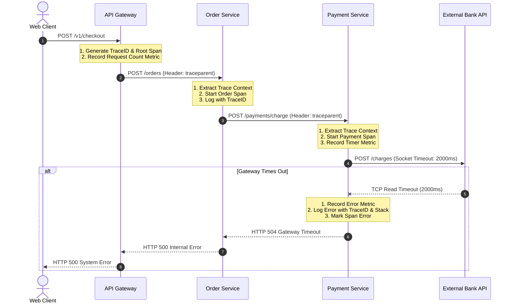

# Day 21 — Your Users Know There's a Problem Before You Do

> 🔗 **LinkedIn Discussion**: [Read & Discuss on LinkedIn](https://www.linkedin.com/in/himanshu-verma-822a07286/)  
> 🏛️ **System Architecture Milestone**: [`v6-observable-stack`](../../../system-evolution/v6-observable-stack/README.md)  
> 🚀 **Phase**: Phase 5 — You Can't Scale What You Can't See (Days 21–25)  
> 🎯 **Today's Focus**: Why Distributed Systems Fail Silently, the Shift from Monitoring to Observability, and How to Pragmatically Wield Metrics, Logs, and Traces

---

## The Problem

Across [Phase 3 — Stop Making Everything Synchronous](../../phase-3-stop-making-everything-synchronous/day-11-never-synchronous-request/README.md) and [Phase 4 — Now the System Is Distributed](../../phase-4-now-the-system-is-distributed/day-20-consistency-vs-availability/README.md), we transformed our monolithic application into a distributed architecture: decoupled microservices, asynchronous message brokers, background workers, idempotent payment handlers, circuit breakers, and partition-tolerant datastores.

On paper, our system is modern and resilient. In production, however, we just experienced every on-call engineer's worst nightmare:

**Our customers told us the system was broken hours before our engineering team had any idea.**

```text
                                 THE SILENT FAILURE
                                 
    Customer Support Slack              Engineering On-Call Dashboard
    ┌─────────────────────────────┐     ┌─────────────────────────────┐
    │ 🚨 14:12: Customer Tweets:  │     │  Datadog / Grafana Summary  │
    │   "Checkout button spins    │     │                             │
    │    for 45s then dies!"      │     │  • CPU Usage:     28%  [OK] │
    │                             │     │  • Memory:        42%  [OK] │
    │ 🚨 14:18: 45 support tickets│     │  • Healthcheck:   200  [OK] │
    │   "Cannot finalize order"   │     │  • Pods Running:  12/12[OK] │
    │                             │     │                             │
    │ 🚨 14:35: Payment drop 60%  │     │  STATUS: ALL SYSTEMS GREEN  │
    └─────────────────────────────┘     └─────────────────────────────┘
```

At 14:10 on a Friday, our conversion rate dropped off a cliff. Customers clicking **"Confirm Purchase"** on the **ShopScale** web application were met with a spinning wheel that eventually timed out after 30 seconds with a generic error dialog: *"Something went wrong. Please try again later."*

Meanwhile, inside the engineering operations center:
1. **Infra dashboards showed bright green across the board.** Host CPU utilization hovered at a calm 28%. Memory utilization was stable at 42%. Disk I/O was nominal.
2. **Kubernetes reported all pods healthy.** The `/healthz` endpoints for the `API Gateway`, `Order Service`, `Payment Service`, and `Inventory Service` returned `HTTP 200 OK` on every 10-second probe.
3. **No pager went off.** The PagerDuty rotation remained dead silent because the existing alert rules—built for an era of monolithic servers—were configured to alert only on host-level saturation (CPU > 85%, Out of Memory) or direct process crashes.

The incident lasted 58 minutes. We lost thousands of dollars in revenue. When the post-mortem began, the humiliating reality set in:

The checkout flow was deadlocked because the `Payment Service` was timing out on an unresponsive third-party fraud-check API. Because the call was misconfigured without an explicit TCP read timeout, worker threads remained stalled for 60 seconds before failing. But because other endpoints on `Payment Service` (like `/healthz`) continued to answer instantly, the synthetic health check reported total system health.

Our tools told us the machinery was running. They could not tell us whether the system was actually doing its job.

---

## Why the Simple Approach Breaks

When teams build early-stage systems, their operational visibility relies on three naive primitives:
1. **Host-level infrastructure metrics** (CPU, Memory, Disk).
2. **Shallow synthetic health check endpoints** (`GET /healthz`).
3. **Unstructured console logging** inspected via `ssh` and `grep`.

These primitives work adequately when your entire business lives in a single monolithic process talking to a single PostgreSQL database on a single server. The moment you introduce network boundaries, asynchronous messaging, and horizontal scaling, all three assumptions break down.

```text
       Naive Approach 1                  Naive Approach 2                  Naive Approach 3
     "Check Host Metrics"              "Shallow /healthz Ping"           "SSH and Grep the Logs"
   ┌──────────────────────┐          ┌──────────────────────┐          ┌──────────────────────┐
   │ Check CPU & Memory   │          │ Ping GET /healthz    │          │ SSH into instance    │
   │ via system agent     │          │ every 10 seconds     │          │ and grep console.log │
   └──────────┬───────────┘          └──────────┬───────────┘          └──────────┬───────────┘
              │                                 │                                 │
              ▼                                 ▼                                 ▼
    A deadlock consumes               The healthz endpoint              With 40 containers across
    0% CPU and flat RAM.              returns 200 OK while all          3 AZs, logs are scattered,
    System is 100% broken,            background worker queues          unindexed, and impossible
    yet graphs look healthy.          are completely frozen.            to correlate across hops.
```

### 1. The Host-Metric Fallacy (Symptoms vs. Intent)

Host-level metrics tell you how hard your hardware is working, not whether your software is providing business value.
* A deadlocked thread pool consumes **0% CPU**. The server looks completely idle.
* An infinite retry loop on an invalid payload consumes **100% CPU**, but the service might still return errors on every single request.
* A thread holding a global mutex while awaiting socket I/O leaves memory and CPU flat, but throttles throughput to 1 request at a time.

Measuring CPU to determine user happiness is like measuring a car's engine temperature to determine if the driver is lost.

### 2. The Shallow Health Check Trap

Most health checks are implemented like this:

```python
# Naive health check in Order Service
@app.route("/healthz", methods=["GET"])
def health_check():
    # If the Python interpreter can execute this line, return 200!
    return jsonify({"status": "UP"}), 200
```

This endpoint verifies only that the application runtime is executing instructions and the HTTP listener is accepting sockets. It tells you nothing about:
* Can the service acquire an available database connection from its pool?
* Can the service publish messages to Kafka without blocking?
* Can the service communicate with downstream dependencies?

Conversely, making `/healthz` **deep** (e.g., executing `SELECT 1` on the database and pinging Redis on every health probe) introduces a deadly vulnerability: if your database experiences a 3-second query spike, Kubernetes health checks time out across all 20 application pods simultaneously. Kubernetes kills the entire fleet, converting a temporary database slow-down into a complete self-inflicted outage.

### 3. The `ssh` and `grep` Bottleneck

In our [Day 01](../../phase-1-one-server-enough/day-01-no-microservices-yet/README.md) monolith, diagnosing an issue meant logging into `app-server-01` and running:

```bash
tail -f /var/log/app/production.log | grep "ERROR"
```

In our distributed `ShopScale` cluster, a single purchase request touches:
1. `API Gateway` (Pod 3 on Node 12)
2. `Order Service` (Pod 7 on Node 4)
3. `Payment Service` (Pod 2 on Node 9)
4. `Inventory Service` (Pod 11 on Node 1)
5. `Kafka Message Broker`
6. `Notification Worker` (Pod 5 on Node 8)

When a customer reports an error, which of the 40 running nodes do you SSH into? Which log file contains the error? If 500 customers are checking out concurrently, which of the 10,000 log lines belongs to Alice and which belongs to Bob?

Without a unified telemetry pipeline, debugging distributed systems becomes blind guesswork.

---

## Understanding the Problem

To solve this, we must transition from **traditional monitoring** to **observability**.

### Monitoring vs. Observability

These terms are frequently conflated, but they address fundamentally different engineering questions:

| Dimension | Monitoring (Black-Box / White-Box) | Observability (State Inference) |
|---|---|---|
| **Core Question** | *"Is the system broken right now?"* | *"Why is the system in this state?"* |
| **Failure Modes** | Detects **known unknowns** (anticipated failure modes with pre-configured thresholds: disk full, CPU spike, 500 error count). | Exposes **unknown unknowns** (unanticipated behaviors, bizarre edge cases, emergent distributed race conditions). |
| **Actionability** | Triggers an alert when a static threshold is violated. | Enables an engineer to ask arbitrary questions and localize root cause without shipping new code. |
| **Primary Artifact** | Dashboards, alert rules, threshold triggers. | High-cardinality telemetry data, distributed trace context, structured events. |

Observability is not something you buy in a box or install via an agent. **Observability is a property of your software system**: the degree to which you can infer the internal execution state of your distributed system solely by examining its external outputs.

### The Three Pillars: What They Are and How They Differ

Observability relies on three foundational data types: **Metrics**, **Logs**, and **Traces**. Each represents a distinct point on the trade-off curve between storage efficiency, contextual richness, and computational overhead.

```text
                  THE TELEMETRY TRADE-OFF SPACE
                  
        [ METRICS ]
        • Aggregated numbers
        • Zero individual context
        • Extremely cheap storage
        • Optimal for: Real-time alerting & trend detection
               ▲
               │
               │             [ TRACES ]
               │             • Request DAGs across network hops
               │             • Preserves causality & latency breakdown
               │             • Moderate-to-high cost
               │             • Optimal for: Localizing bottlenecks in microservices
               │
               ▼
        [ LOGS ]
        • Discrete, rich text events
        • High contextual granularity
        • Very expensive storage and indexing
        • Optimal for: Forensic deep-dive and root-cause verification
```

#### 1. Metrics (Aggregatable Numbers)
A metric is a numeric measurement recorded over time, stored as a time-series (`timestamp`, `metric_name`, `value`, `key-value labels`).
* **Format**: Counters, Gauges, Histograms (e.g., `http_requests_total{method="POST", status="500"} 42`).
* **Superpower**: Highly compressible, constant storage footprint regardless of traffic volume, and blazingly fast to query over vast time windows.
* **Blindspot**: No individual transaction context. A metric can tell you that the 99th percentile latency of `/checkout` is 4,200ms, but it cannot tell you *which* customer suffered or *why* their request was slow.

#### 2. Logs (Discrete Event Records)
A log is an immutable, timestamped record of an event that occurred inside the software.
* **Format**: Structured JSON strings containing timestamps, log levels, messages, and contextual attributes (e.g., `{"time": "...", "level": "error", "order_id": "ord_99", "error": "insufficient_funds"}`).
* **Superpower**: Unlimited contextual detail. Contains the exact stack trace, variable state, and conditional branch execution that triggered an event.
* **Blindspot**: Massive volume and storage cost. As traffic grows, log volume scales linearly ($O(N)$) with request count. Unindexed text logs are computationally expensive to search across terabytes of data.

#### 3. Traces (Request Journeys Across Boundaries)
A trace represents the end-to-end journey of a single request as it traverses distributed network boundaries. A trace is a directed acyclic graph (DAG) of **spans**, where each span represents a contiguous unit of work (e.g., an HTTP call, an RPC call, a database query).
* **Format**: Spans containing `TraceID`, `SpanID`, `ParentSpanID`, start/end timestamps, and span tags.
* **Superpower**: Preserves **causality and execution topology**. Shows precisely how long each downstream service took during a specific end-to-end user operation.
* **Blindspot**: Implementation complexity. Requires pervasive context propagation across every HTTP client, RPC framework, and message broker. High network and storage overhead if sampled at 100%.

---

## Possible Approaches

Let's examine how each of the three pillars operates in practice, where each shines, where it fails, and when you should use it.

```text
                  THE INCIDENT INVESTIGATION FUNNEL
                  
       Stage 1: DETECTION       ──►   [ METRICS ]
       "Something is wrong with        Alert triggers on checkout p99 latency
        checkout right now."          exceeding 2,000ms SLO.
               │
               ▼
       Stage 2: LOCALIZATION    ──►   [ TRACES ]
       "Where in the network           Distributed trace isolates the delay to
        is time being spent?"         Payment Service -> Fraud Check RPC.
               │
               ▼
       Stage 3: DIAGNOSIS       ──►   [ LOGS ]
       "Why did that specific          Filtered logs for trace_id show:
        call fail?"                   "Connection reset by peer: api.fraudcheck.internal"
```

---

### Approach 1: Metrics (The Detection Engine)

#### How It Works
Your application updates in-memory counters, gauges, or histogram buckets during execution. A time-series database (like Prometheus) periodically scrapes these numbers via HTTP (or receives them via StatsD/OTel push). 

Instead of tracking every request individually, the application increments counters:
* Request Counter: `http_requests_total{service="order", endpoint="/checkout", status="200"}`
* Duration Histogram: `http_request_duration_seconds_bucket{le="0.5"}`

#### Where It Helps
* **Real-time Alerting**: Metrics are computationally trivial to evaluate. An alerting engine can evaluate 10,000 metric rules across 1,000 services every 15 seconds with negligible CPU overhead.
* **Trend Analysis & Capacity Planning**: Want to compare today's peak traffic against Black Friday three months ago? Querying a metric over 90 days returns in milliseconds because the data is aggregated into time buckets.
* **SLO / SLI Tracking**: Calculating error budgets (e.g., "99.9% of requests must succeed in < 500ms") requires continuous percentile math, which is native to metric histograms.

#### Limitations
* **The High-Cardinality Trap**: Every unique combination of key-value labels creates a new time-series in memory. If you add `user_id` or `order_id` as a label in Prometheus:
  
  $$\text{Total Series} = \text{Endpoints (50)} \times \text{Statuses (10)} \times \text{Users (1,000,000)} = 500,000,000 \text{ time-series}$$
  
  Your metric server runs out of memory (OOM) and crashes immediately. **Metrics cannot identify individual users or transactions.**
* **Aggregation Masks Reality**: If 99 requests take 10ms and 1 request takes 10,000ms, the mean average is 109ms—a figure that looks perfectly fine while 1% of your users suffer catastrophic slowness.

#### When It Makes Sense
* Use metrics as the **first responder** to detect that an anomaly exists and trigger automated alerts.
* Implement the **RED Method** on every public service interface:
  * **Rate**: The number of requests per second.
  * **Errors**: The number of failed requests per second.
  * **Duration**: The time each request takes (measured in percentiles: p50, p90, p99).
* Implement the **USE Method** on all underlying hardware/OS resources:
  * **Utilization**: Percent time the resource was busy (CPU %, Disk %).
  * **Saturation**: The degree to which extra work is queued (Queue depth, Runqueue).
  * **Errors**: Hardware and network interface error counters.

---

### Approach 2: Structured Logs (The Diagnostic Engine)

#### How It Works
Whenever something significant happens, the application emits a structured JSON object to standard output (`stdout`). A background daemon (e.g., FluentBit, Vector, Promtail) collects these streams from container runtimes, buffers them, and ships them to a centralized search store (e.g., Elasticsearch, OpenSearch, Grafana Loki).

```json
{
  "timestamp": "2026-09-16T14:10:05.123Z",
  "level": "ERROR",
  "service": "payment-service",
  "trace_id": "4bf92f3577b34da6a3ce929d0e0e4736",
  "span_id": "00f067aa0ba902b7",
  "user_id": "usr_88192",
  "order_id": "ord_5521",
  "event": "payment_gateway_timeout",
  "gateway": "Stripe",
  "attempt": 3,
  "timeout_ms": 5000,
  "error": "read tcp 10.244.2.14:48212->54.187.12.9:443: i/o timeout"
}
```

#### Where It Helps
* **Root-Cause Forensics**: Once you know *which* request failed, logs provide the microscopic detail: exact exception messages, invalid parameters, query execution plans, and third-party response bodies.
* **Audit and Compliance Trails**: Financial and healthcare operations require an immutable record of actions (e.g., "User Alice updated shipping address to X at time T").
* **Low-Frequency Event Analysis**: For events that occur infrequently (e.g., database schema migrations, node reboots, cold restarts), logs capture the exact state transitions.

#### Limitations
* **Cost and Volume Explosion**: At 10,000 requests per second, emitting 5 log lines per request generates **4.3 billion log lines per day**. Storing, indexing, and retaining this data costs tens of thousands of dollars per month in SSD storage and cluster nodes.
* **Logging Can Take Down Production**: Writing logs synchronously blocks application worker threads on disk I/O. If disk I/O saturates or the logging socket blocks, the application grinds to a halt—a self-inflicted cascading failure.
* **Unstructured Log Chaos**: Free-text logs (`logger.info("Order processed for user: " + id)`) require brittle regex queries to search. If three developers write three variations of the same log message, querying across services becomes impossible.

#### When It Makes Sense
* Use logs as the **final destination** in an investigation to inspect the exact details of an already-identified anomaly.
* Always enforce **Structured JSON** output.
* Mandate correlation attributes (`trace_id`, `user_id`, `tenant_id`) on every log entry.
* Use log levels strictly:
  * `DEBUG`: Off by default in production. Only enabled dynamically per tenant during targeted investigations.
  * `INFO`: High-level business milestones only (Order Created, Payment Settled).
  * `WARN`: Expected deviations that system recovered from (Transient cache miss, Retry succeeded).
  * `ERROR`: Actionable failures that degraded a user experience (Payment failed, DB deadlocked).

---

### Approach 3: Distributed Tracing (The Localization Engine)

#### How It Works
Distributed tracing follows a request as it hops across network boundaries. 

To achieve this, services must implement **Context Propagation**:
1. When an HTTP request enters the `API Gateway`, the gateway generates a unique 128-bit (32 hex character) **Trace ID** and a 64-bit (16 hex character) **Span ID**.
2. When the gateway makes an outbound HTTP/gRPC call to the `Order Service`, it injects these IDs into the outbound request headers using standardized formats (such as the W3C `traceparent` header).
3. The `Order Service` extracts the IDs from incoming headers, creates a child span with a new `Span ID` referencing the gateway's span as its `ParentSpanID`, and propagates the context to subsequent outbound calls.
4. Each service asynchronously exports finished spans to a trace collector (e.g., OpenTelemetry Collector, Jaeger, Tempo).

```text
                        CONTEXT PROPAGATION ACROSS HOPS
                        
    Client Request
          │
          ▼
   ┌────────────────────────────────┐   HTTP Header: traceparent
   │ API Gateway                    │ ─────────────────────────────────────────────────────────┐
   │ SpanID:   00f067aa0ba902b7     │   00-4bf92f3577b34da6a3ce929d0e0e4736-00f067aa0ba902b7-01  │
   └────────────────────────────────┘                                                          │
                                                                                               ▼
                                                                    ┌────────────────────────────────┐
                                                                    │ Order Service                  │
                                                                    │ SpanID:   00f067aa0ba902b8     │
                                                                    │ ParentID: 00f067aa0ba902b7     │
                                                                    └───────────────┬────────────────┘
                                                                                    │
                              HTTP Header: traceparent                              │
                              00-4bf92f3577b34da6a3ce929d0e0e4736-00f067aa0ba902b8-01  │
                                                                                    ▼
                                                                    ┌────────────────────────────────┐
                                                                    │ Payment Service                │
                                                                    │ SpanID:   00f067aa0ba902b9     │
                                                                    │ ParentID: 00f067aa0ba902b8     │
                                                                    └────────────────────────────────┘
```

#### Where It Helps
* **Pinpointing the Slow Dependency**: In a call graph with 8 nested microservices, a trace instantly reveals whether the 4-second delay occurred in the database, in network transit, in the auth service, or in a third-party gateway.
* **Understanding Asynchronous Concurrency**: Modern requests spawn parallel sub-tasks (e.g., fetching user profile, fetching inventory, fetching recommendations). Tracing visualizes waterfall timelines and exposes critical execution paths.
* **Service Dependency Mapping**: Distributed tracing collectors can automatically analyze millions of traces to generate accurate, real-time architectural dependency diagrams without human intervention.

#### Limitations
* **Integration Tax**: Tracing requires pervasive instrumentation across every HTTP client, database driver, cache connector, thread pool handoff, and message queue consumer. If a single service in the chain fails to propagate headers, the trace context breaks into disconnected fragments.
* **Network & Storage Overhead**: Capturing, serializing, and exporting spans for 100% of requests consumes significant CPU and network egress bandwidth. Production systems require intelligent **sampling strategies** (e.g., recording 1% of normal requests, but 100% of errors and slow requests).

#### When It Makes Sense
* Indispensable for any architecture with **more than one service** or any asynchronous event-driven pipeline.
* Use traces as the **bridge** between an alert (Metric) and the microscopic root cause (Log).

---

## Trade-offs

Building an observable system requires engineering compromises across cost, performance, and operational complexity.

```text
       ┌────────────────────────────────────────────────────────┐
       │             THE OBSERVABILITY TRILEMMA                 │
       │                                                        │
       │                  Contextual Granularity                │
       │                      (High Cardinality)                │
       │                             ▲                          │
       │                            / \                         │
       │                           /   \                        │
       │                          /     \                       │
       │                         /       \                      │
       │                        /         \                     │
       │                       /           \                    │
       │  System Performance  ◄─────────────► Operational Cost  │
       │  (Zero App Overhead)                 (Infra & Storage) │
       └────────────────────────────────────────────────────────┘
```

| Strategy / Decision | What We Gain | What We Give Up | Practical Rule of Thumb |
|---|---|---|---|
| **High Metric Cardinality** (Adding user/order IDs to Prometheus labels) | Ability to slice-and-dice metrics by user, order, or IP directly in real-time dashboards. | Massive RAM consumption in Prometheus; query timeouts; potential monitoring cluster crashes (OOM). | **Strictly prohibit dynamic IDs in metric labels.** Keep cardinality bounded to fixed enums (HTTP methods, status codes, regions). |
| **100% Trace Ingestion** (Sampling Rate = 1.0) | Zero blindspots. Every single user request has a full waterfall trace available for inspection. | Massive trace ingestion costs; network egress saturation; high collector cluster hardware requirements. | **Use Tail-Based Sampling.** Sample 1% of successful, fast requests, but capture 100% of HTTP 5xx errors and requests exceeding p99 thresholds. |
| **Synchronous vs. Asynchronous Logging** | Immediate guarantee that every log line reaches disk before execution continues (great for debugging crashes). | Application worker threads block on disk I/O or network sockets. System throughput drops up to 80% under load. | **Always log asynchronously** using bounded ring buffers. If the buffer fills, shed logs rather than crashing the business application. |
| **Pull-Based vs. Push-Based Telemetry** | Pull (Prometheus) prevents applications from overwhelming the monitoring system; monitors can detect dead nodes if scrape fails. | Requires service discovery; difficult to scrape short-lived serverless jobs or nodes behind NAT firewalls. | Use **Pull for infrastructure and long-lived services**; use **Push via local OpenTelemetry Collector sidecars** for application traces and serverless tasks. |

---

## A Practical Example

Let's implement a real-world, observable checkout flow for **ShopScale**. We will trace an end-to-end request across the `API Gateway`, the `Order Service`, and the `Payment Service`, demonstrating how Metrics, Logs, and Traces interlock.

### 1. Architectural Request Flow



---

### 2. Context Propagation (The W3C `traceparent` Standard)

When the `API Gateway` forwards a request to `Order Service`, it serializes trace context into the standardized W3C HTTP header:

```http
POST /orders HTTP/1.1
Host: order-service.internal
traceparent: 00-4bf92f3577b34da6a3ce929d0e0e4736-00f067aa0ba902b7-01
```

The header components:
* `00`: Protocol version.
* `4bf92f3577b34da6a3ce929d0e0e4736`: **Trace ID** (16 bytes / 32 hex characters shared across all services for this entire transaction).
* `00f067aa0ba902b7`: **Parent Span ID** (8 bytes / 16 hex characters identifying the caller's span).
* `01`: **Trace Flags** (`01` indicates the trace was sampled for recording).

---

### 3. Application Code with Telemetry (Python & OpenTelemetry)

Below is an annotated, production-grade implementation of the `Payment Service` endpoint handling the checkout charge, demonstrating context extraction, child span creation, outbound context injection, structured logging, and Prometheus RED metrics:

```python
import time
import logging
import requests
from flask import Flask, request, jsonify, Response
from opentelemetry import trace
from opentelemetry.trace import Status, StatusCode
from opentelemetry.trace.propagation.tracecontext import TraceContextTextMapPropagator
from prometheus_client import Counter, Histogram, generate_latest, CONTENT_TYPE_LATEST

app = Flask(__name__)
tracer = trace.get_tracer("payment-service")
logger = logging.getLogger("payment-service")
logger.setLevel(logging.INFO)

# ==========================================
# 1. METRICS (RED Method)
# ==========================================
# Counter: Total payment requests processed
PAYMENT_REQUESTS_TOTAL = Counter(
    "payment_requests_total",
    "Total number of payment processing requests",
    ["method", "status", "gateway"]
)

# Histogram: Latency distribution in explicit second buckets
PAYMENT_DURATION_SECONDS = Histogram(
    "payment_request_duration_seconds",
    "Time spent processing payments through external banking gateways",
    ["gateway"],
    buckets=[0.1, 0.25, 0.5, 1.0, 2.0, 5.0, 10.0]
)

# ==========================================
# 2. LOGGING HELPER (Trace-Correlated JSON)
# ==========================================
def emit_structured_log(level, event, **kwargs):
    span = trace.get_current_span()
    ctx = span.get_span_context()
    
    log_entry = {
        "timestamp": time.time(),
        "level": level,
        "service": "payment-service",
        "trace_id": format(ctx.trace_id, "032x") if ctx.is_valid else None,
        "span_id": format(ctx.span_id, "016x") if ctx.is_valid else None,
        "event": event,
        **kwargs
    }
    # In production, this ships to stdout formatted as JSON
    logger.info(str(log_entry))

# ==========================================
# 3. ENDPOINT WITH INTEGRATED TELEMETRY
# ==========================================
@app.route("/v1/payments/charge", methods=["POST"])
def charge_payment():
    start_time = time.time()
    payload = request.get_json() or {}
    order_id = payload.get("order_id", "unknown")
    amount = payload.get("amount", 0.0)
    gateway = "bank_partner_alpha"

    # Step A: Extract W3C traceparent header from incoming HTTP request headers
    carrier = {k.lower(): v for k, v in request.headers.items()}
    parent_ctx = TraceContextTextMapPropagator().extract(carrier)

    # Step B: Start child span linked to upstream parent context
    with tracer.start_as_current_span("process_payment_charge", context=parent_ctx) as span:
        span.set_attribute("payment.order_id", order_id)
        span.set_attribute("payment.amount", amount)
        span.set_attribute("payment.gateway", gateway)

        emit_structured_log("INFO", "payment_attempt_started", order_id=order_id, amount=amount)

        try:
            # Step C: Inject trace context into outbound request headers to propagate downstream
            outbound_headers = {}
            TraceContextTextMapPropagator().inject(outbound_headers)

            response = requests.post(
                "https://api.bankpartner.internal/v1/charge",
                json={"order_id": order_id, "amount": amount},
                headers=outbound_headers,
                timeout=(0.5, 2.0)  # (connect timeout 500ms, read timeout 2000ms)
            )
            response.raise_for_status()

            duration = time.time() - start_time
            PAYMENT_REQUESTS_TOTAL.labels(method="POST", status="200", gateway=gateway).inc()
            PAYMENT_DURATION_SECONDS.labels(gateway=gateway).observe(duration)

            span.set_status(Status(StatusCode.OK))
            emit_structured_log("INFO", "payment_success", order_id=order_id, duration_s=duration)

            return jsonify({"status": "CHARGED", "order_id": order_id}), 200

        except requests.exceptions.Timeout as e:
            duration = time.time() - start_time
            
            # Record failed metric
            PAYMENT_REQUESTS_TOTAL.labels(method="POST", status="504", gateway=gateway).inc()
            PAYMENT_DURATION_SECONDS.labels(gateway=gateway).observe(duration)

            # Record failure on Trace Span
            span.record_exception(e)
            span.set_status(Status(StatusCode.ERROR, description="Downstream gateway socket timeout"))

            # Emit rich, correlated error log
            emit_structured_log(
                "ERROR",
                "payment_gateway_timeout",
                order_id=order_id,
                gateway=gateway,
                timeout_configured_ms=2000,
                duration_s=duration,
                error=str(e)
            )

            return jsonify({"error": "Payment gateway timed out", "order_id": order_id}), 504

@app.route("/metrics", methods=["GET"])
def metrics():
    # Prometheus scrape endpoint with correct HTTP headers
    return Response(generate_latest(), mimetype=CONTENT_TYPE_LATEST)
```

---

### 4. Step-by-Step Incident Walkthrough

With this observable stack in place, observe how the on-call engineer diagnoses our production failure in under 90 seconds instead of waiting for customer tweets:

```text
  STEP 1: METRICS ALERT FIRES (T = 0s)
  ──────────────────────────────────────────────────────────────────────────
  PagerDuty Alert: "High Error Rate & Latency on Service: Order Service"
  Triggered Rule:
    sum(rate(payment_requests_total{status=~"5.."}[2m])) 
    / 
    clamp_min(sum(rate(payment_requests_total[2m])), 1) > 0.05
  Observation: Checkout p99 latency spiked from 180ms to 2,100ms. 
               Status 504 errors jumped to 8% of total volume.
  Action: Engineer clicks the direct dashboard link attached to the alert.
```
```text
  STEP 2: DISTRIBUTED TRACE ISOLATES THE BOTTLENECK (T = 30s)
  ──────────────────────────────────────────────────────────────────────────
  Engineer opens the Grafana Tempo / Jaeger trace waterfall for a slow 504 request:

  [API Gateway] POST /v1/checkout ───────────── 2,120ms
    └─ [Order Service] POST /orders ──────────── 2,110ms
         └─ [Payment Service] POST /payments ─── 2,050ms
              └─ HTTP POST api.bankpartner ───── 2,002ms (STATUS: ERROR)

  Observation: Gateway and Order Service spent almost 0ms in local computation.
               99% of total request duration was spent waiting inside Payment Service
               on the external call to `api.bankpartner`.
  Action: Engineer copies the TraceID from the span: `4bf92f3577b34da6a3ce929d0e0e4736`.
```
```text
  STEP 3: CORRELATED LOG REVEALS ROOT CAUSE (T = 60s)
  ──────────────────────────────────────────────────────────────────────────
  Engineer pastes `trace_id="4bf92f3577b34da6a3ce929d0e0e4736"` into OpenSearch / Loki:

  {
    "timestamp": 1773843005.12,
    "level": "ERROR",
    "service": "payment-service",
    "trace_id": "4bf92f3577b34da6a3ce929d0e0e4736",
    "span_id": "00f067aa0ba902b7",
    "event": "payment_gateway_timeout",
    "order_id": "ord_99182",
    "gateway": "bank_partner_alpha",
    "timeout_configured_ms": 2000,
    "error": "HTTPSConnectionPool(host='api.bankpartner.internal', port=443): Read timed out."
  }

  Diagnosis: Complete. The external bank API is hanging. 
  Mitigation: Engineer activates the circuit breaker to fall back to secondary payment gateway `bank_partner_beta`.
  Total Time to Resolution: 3 minutes.
```

---

## Failure Scenarios

Even with an observability stack deployed, production systems introduce new failure modes created by the telemetry pipeline itself.

### 1. The Cardinality Bomb (Prometheus Out-of-Memory)
A well-meaning engineer adds the customer's email address or credit card transaction UUID as a metric label to measure usage per customer:

```python
# CATASTROPHIC BUG: High-cardinality metric label
TRANSACTION_COUNTER.labels(user_email=user.email, status="success").inc()
```

**The Failure**: When 2,000,000 unique users transact over a weekend, Prometheus allocates RAM for 2,000,000 new distinct time-series. The Prometheus container exceeds its memory limits, triggers the Linux OOM Killer, and enters a CrashLoopBackOff. **The monitoring system crashes at the exact moment user traffic is highest.**

### 2. The Log Flood (I/O Contention and Cascading Death)
Under heavy load or during a database outage, every worker thread encounters an error. Each thread prints a 100-line stack trace to stdout synchronously.

**The Failure**: 
* Docker daemon or systemd-journald blocks on synchronous disk writes.
* The Linux kernel page cache fills with unwritten log buffers.
* Application worker threads block while executing `print()` or `logger.error()`, waiting for the stdout pipe buffer to drain.
* The application grinds to an absolute halt not because the database failed, but because the application couldn't write the error message fast enough.

### 3. Trace Context Breaking (The Async Void)
A developer uses an asynchronous thread pool or Go goroutine to offload background tasks, but forgets to propagate the trace context:

```go
// BUG: Trace context is lost across goroutine boundary
func handleOrder(w http.ResponseWriter, r *http.Request) {
    ctx := r.Context() // Contains TraceID
    
    go func() {
        // BUG: Background context creates a brand-new, unrelated trace!
        processInventory(context.Background(), orderID) 
    }()
}
```

**The Failure**: The distributed trace ends abruptly at the HTTP handler. When `processInventory` fails 10 seconds later, its spans and logs float in total isolation with an arbitrary new `TraceID`. Engineers searching for the customer's trace see a normal, successful web request and conclude the inventory step never ran.

### 4. The Sampling Bias Trap
To reduce tracing costs, the team configures **Head-Based Sampling** at 1%: the API gateway randomly decides whether to trace a request when it first arrives.

**The Failure**: If a critical payment bug affects only 0.1% of transactions (e.g., high-value VIP carts with complex discounts), 99 out of 100 failed transactions will have their traces discarded at ingress. When debugging customer complaints, engineers search for the failed Trace IDs only to find: `"Trace not found."`

---

## Key Engineering Decisions

When architecting observability for a scaling system, treat telemetry as a first-class subsystem governed by explicit architectural rules.

```text
                  OBSERVABILITY DECISION CHECKLIST
                  
  [ ] 1. Telemetry Ingress Standards
      • Standardize on W3C Trace Context (traceparent headers) across all protocols.
      • Adopt OpenTelemetry (OTel) SDKs to avoid proprietary vendor lock-in.

  [ ] 2. Metric Cardinality Governance
      • Forbid dynamic IDs (UUIDs, usernames, emails, timestamps) in metric labels.
      • Enforce the RED method (Rate, Errors, Duration) on all public RPC/HTTP endpoints.

  [ ] 3. Logging Hygiene
      • Enforce structured JSON logging across all services.
      • Automatically inject `trace_id` and `span_id` into every log record.
      • Ensure all logging writes are non-blocking / asynchronous.

  [ ] 4. Trace Sampling Strategy
      • Do not blindly use 100% tracing at high volume.
      • Implement Tail-Based Sampling in an OpenTelemetry Collector to capture:
        - 100% of HTTP 5xx responses.
        - 100% of requests exceeding p95 latency thresholds.
        - 1% to 5% of healthy, nominal transactions.
```

---

## Key Takeaways

* **Host metrics do not equal user experience.** A system with 15% CPU, healthy RAM, and green `/healthz` checks can be completely failing every user checkout request.
* **Monitoring alerts you to known failures; observability lets you explain novel ones.** If you can only debug problems you anticipated in advance, your system is monitored, not observable.
* **Metrics are for detection, traces are for localization, logs are for diagnosis.** Never try to force one pillar to do the job of the others:
  * Do not put high-cardinality metadata in metrics.
  * Do not rely on logs to calculate real-time p99 latency alerts.
  * Do not debug distributed latency without distributed traces.
* **Context propagation is the glue of distributed systems.** Standardize on the W3C `traceparent` header across HTTP, gRPC, and message brokers from Day 1.
* **Correlate your telemetry.** A log message without a `trace_id` is a needle in a haystack; a metric alert without a trace link is an alarm without a map.

---

### Next: Day 22 — The Dashboard That Doesn't Help During an Incident

Now that our system emits metrics, logs, and traces, a new operational pathology arises: **The Dashboard Graveyard.** When an incident strikes, on-call engineers open a wall of 40 cluttered dashboards, get overwhelmed by hundreds of conflicting graphs, and succumb to alert fatigue. Tomorrow, we examine how to design actionable operational dashboards and alert on Service Level Objectives (SLOs) instead of raw server noise.
