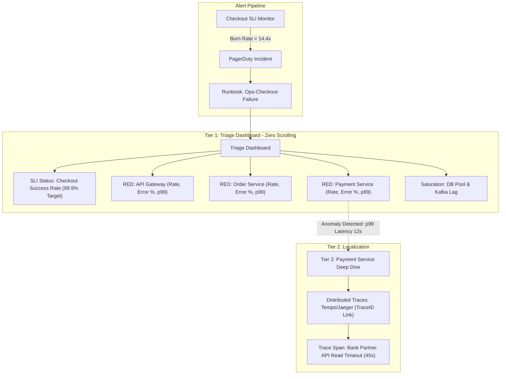

# Day 22 — The Dashboard That Doesn't Help During an Incident

> 🔗 **LinkedIn Discussion**: [Read & Discuss on LinkedIn](https://www.linkedin.com/in/himanshu-verma-822a07286/)  
> 🏛️ **System Architecture Milestone**: [`v6-observable-stack`](../../../system-evolution/v6-observable-stack/README.md)  
> 🚀 **Phase**: Phase 5 — You Can't Scale What You Can't See (Days 21–25)  
> 🎯 **Today's Focus**: Eliminating Alert Fatigue and Vanity Metrics, Designing Incident-Ready Views Using RED Metrics, the Four Golden Signals, and Service-Level Objectives (SLIs/SLOs)

---

## The Problem

It is 02:45 AM on a Tuesday. The on-call engineer at **ShopScale** is jolted awake by a piercing PagerDuty alarm:

```text
CRITICAL: PagerDuty [ShopScale-Prod] - 14 Alerts Fired
- High Error Rate - API Gateway (p50 > 200ms)
- CPU Throttling Detected - Node worker-pool-k8s-prod-08
- Unhandled Exception Count > 15 in PaymentService
- Redis Connection Latency Spike (zone-east-1b)
- Kafka Consumer Group Lag Warning (order-events-processor)
```

Groggy and adrenaline-fueled, the engineer opens the primary production monitoring dashboard. 

What loads is a monument to eighteen months of microservice migrations: **94 panels spread across twelve rows**.

```text
+----------------------------------------------------------------------------------------------------+
|                                    SHOPSCALES MASTER INFRA OVERVIEW                                 |
+----------------------------------------------------------------------------------------------------+
| [Gauge: Cluster CPU]  [Gauge: Memory %]    [Pie: Pods by State]    [Counter: Total HTTP Requests]  |
| 34% (Normal)          61% (Normal)         98% Running / 2% Term   142,391,208 (Since Monday)      |
+----------------------------------------------------------------------------------------------------+
| [Graph: JVM Garbage Collection Pauses]     | [Graph: Host Network Octets In/Out]                   |
| 12 lines, 3 overlapping spikes at 02:15    | Spikes in blue, flat in orange, no baseline           |
+----------------------------------------------------------------------------------------------------+
| [Graph: Redis Keyspace Hits vs Misses]     | [Graph: Payment Service HTTP Status Codes]            |
| Fluctuating wildly, no error correlation   | 200 OK: 14k/s (Green), 500: 42/s (Red tiny sliver)    |
+----------------------------------------------------------------------------------------------------+
| [Panel: Top 20 MySQL Slow Queries]         | [Graph: Node Disk Write IOPS]                         |
| Truncated SQL statements from 4 hours ago  | Node 04: 1,200 IOPS, Node 12: 450 IOPS                |
+----------------------------------------------------------------------------------------------------+
```

The engineer stares at the screen. The customer-facing symptom reported in the `#incident-war-room` Slack channel is unequivocal: **"Users in Western Europe cannot complete checkout. Carts are dropping with payment timeout errors."**

Yet looking at this dashboard:
1. **Three panels are flashing red**, but two of them have been red for six weeks because someone set an arbitrary threshold on a non-critical background scraper that everyone ignores.
2. **The CPU and memory gauges are calm green.** The Kubernetes nodes hosting the `Order Service` and `Payment Service` are cruising at 35% utilization.
3. **The graphs show raw counts instead of rates or proportions.** The HTTP status chart displays 14,000 successful `200 OK` responses per second alongside 42 failed `500 Internal Server Error` responses per second. On a linear scale, a line at 42 is practically invisible against a line at 14,000. Is 42 errors per second normal background jitter, or is it 100% of all checkout transactions? The graph doesn't say.
4. **There is no indication of what to do next.** The dashboard contains plenty of data, but zero answers.

Twenty-eight minutes into the outage, the on-call engineer is still clicking through six different dashboard tabs—"Host Metrics", "JVM Deep Dive", "Database Internals", "Networking Core", "Payment SRE", and "Kubernetes Pods"—trying to find the correlation between a 500 error in `Payment Service` and an upstream timeout in `API Gateway`.

In [Day 21](../day-21-users-know-before-you/README.md), we solved the problem of **telemetry collection**: we installed OpenTelemetry, emitted structured JSON logs, exported Prometheus metrics, and propagated W3C distributed trace contexts.

Now we face the second operational trap of scaling systems: **we have collected all the data, but our dashboards and alerts actively hinder us during an emergency.**

---

## Why the Simple Approach Breaks

When a team first begins monitoring a system, they follow an intuitive, bottom-up path. That path consistently produces four structural pathologies as traffic scales.

```text
    THE PATHOLOGY OF THE NAIVE DASHBOARD
    
    1. The Post-Mortem Accumulator       2. The Infrastructure Proxy Trap
    ┌─────────────────────────────┐      ┌─────────────────────────────┐
    │ Every outage adds a panel.  │      │ "Alert if CPU > 80%."       │
    │ Outage 04: "Watch Redis!"   │      │ An outage occurs at 30% CPU │
    │ Outage 12: "Watch Disk IO!" │      │ due to lock contention.     │
    │ Outage 21: "Watch JVM GC!"  │      │ Meanwhile, batch jobs fire  │
    │ Result: 100-panel graveyard.│      │ CPU alerts without impact.  │
    └─────────────────────────────┘      └─────────────────────────────┘
                  │                                     │
                  ▼                                     ▼
    ┌─────────────────────────────┐      ┌─────────────────────────────┐
    │ Look at the mean average.   │      │ "We have 85 alert rules."   │
    │ Mean response: 85ms.        │      │ 40 fire every week.         │
    │ Meanwhile, 1% of users      │      │ Team mutes Slack channel.   │
    │ (all big spenders) wait     │      │ Real outages drown in the   │
    │ 12 seconds and time out.    │      │ sea of false alarms.        │
    └─────────────────────────────┘      └─────────────────────────────┘
    3. The Average (Mean) Fallacy         4. Alert Fatigue
```

### 1. The Post-Mortem Accumulator Pattern

In most engineering organizations, dashboards are not designed; they **accumulate**.

* In month 2, a memory leak crashes the server. The post-mortem action item: *"Add a JVM heap utilization panel to the main dashboard."*
* In month 6, a database connection pool runs out of sockets. Action item: *"Add active connection count, idle connection count, and wait duration panels."*
* In month 11, an external SMS provider rate-limits verification codes. Action item: *"Add SMS gateway HTTP 429 response rate."*

After two years, the team has accumulated dozens of panels. Nobody ever deletes a panel because "someone might need it during an incident." 

The result is a **dashboard graveyard**: an uncurated wall of graphs that reflects the historical scars of the system rather than its current runtime health. During an incident, cognitive bandwidth is the scarcest resource. Forcing a human being under high stress to scan 90 graphs to locate an unknown fault guarantees prolonged Mean Time to Resolution (MTTR).

### 2. The Infrastructure Proxy Trap

Teams monitor what is easy to measure, not what matters. 

Measuring CPU utilization, RAM usage, and network interface packet drops is trivial—the cloud provider or operating system gives them to you for free out of the box. So teams build alerts around them:
* `ALERT: Host CPU > 80% for 5 minutes`
* `ALERT: Free Memory < 15%`

These metrics are **proxies** for application health, and they are notoriously unreliable:
* **False Positives**: A machine learning worker or batch reconciliation job running at 2:00 AM drives CPU to 95%. The system is functioning exactly as intended, but the on-call engineer is paged out of sleep.
* **False Negatives**: A deadlock between two database transactions freezes the checkout workflow. The threads are blocked waiting for locks, consuming **0% CPU**. Memory usage is completely flat. All infrastructure alerts remain quiet while 100% of incoming customer checkouts fail.

### 3. The Fallacy of the Arithmetic Mean

Look at this typical dashboard panel:

```text
Avg Response Time: 74ms  [GREEN / NOMINAL]
```

The arithmetic mean ($\mu = \frac{1}{N} \sum X_i$) is mathematically invalid for measuring latency in distributed systems.

Assume our `Order Service` handles 1,000 requests per minute:
* 990 requests are cache hits or simple queries that complete in **10ms**.
* 10 requests hit an unindexed database query or a slow external payment gateway and block for **10,000ms (10 seconds)** before timing out.

$$\text{Mean Latency} = \frac{(990 \times 10) + (10 \times 10,000)}{1,000} = \frac{9,900 + 100,000}{1,000} = \frac{109,900}{1,000} \approx 110\text{ms}$$

An average latency of 110ms looks completely benign on a dashboard graph with a 200ms green threshold. In reality, **1% of your users experienced catastrophic 10-second timeouts**. If that 1% represents high-value customers attempting to execute $2,000 checkout transactions, your business is hemorrhaging money while your dashboard reports that performance is stellar.

Latency in distributed systems is multi-modal, asymmetrical, and long-tailed. Monitoring requires **percentiles** ($p50$, $p90$, $p99$, $p99.9$), not averages.

### 4. Alert Fatigue and the Broken Window Syndrome

When alerts fire for conditions that require no immediate human intervention, engineers adapt by ignoring them.

First, alerts are routed to a dedicated `#alerts-noisy` Slack channel. Within three weeks, everyone has muted the channel. Next, when PagerDuty pages an engineer at night for a threshold violation that self-resolves after 4 minutes, the engineer learns to acknowledge the page and go back to sleep without investigating.

```text
         THE ALERT FATIGUE SPIRAL
         
      Noisy Alert Configured
                │
                ▼
      Spurious Pages Fire (Nightly)
                │
                ▼
      Engineers Learn Alerts Are "Noise"
                │
                ▼
      Alerts Muted / Pagers Auto-Acked
                │
                ▼
      Real Catastrophic Outage Occurs
                │
                ▼
      Alert Fires... and Is Ignored
                │
                ▼
      Users Report Outage 2 Hours Later
```

If an alert does not require an immediate, well-defined human decision or remediation action, **it should not be an alert.** It should be a ticket, a daily summary report, or deleted entirely.

---

## Understanding the Problem

To build operational views that actually help during an incident, we must dissect why our current telemetry fails to communicate.

### Vanity Metrics vs. Actionable Metrics

In observability, metrics fall into two broad classes:

| Characteristic | Vanity Metric | Actionable Metric |
|---|---|---|
| **Definition** | A number that moves up and to the right, looks great in an investor deck or executive status report, but cannot guide an operational choice. | A metric that measures work delivered or work failing, where an anomaly dictates an explicit, unambiguous engineering action. |
| **Examples** | • Total registered users<br>• Total requests served since deploy<br>• Total bytes written to disk<br>• Raw CPU utilization of an auto-scaling group | • Checkout error rate percentage ($> 0.5\%$)<br>• Ingress request duration $p99$ ($> 750\text{ms}$)<br>• Queue consumer processing lag (in seconds)<br>• Thread pool / connection pool saturation ($> 85\%$) |
| **Operational Value** | Zero during an active incident. | Immediate: identifies the failure boundary and whether human intervention is mandatory. |
| **Key Question** | *"Does this number make us feel good about the size of our system?"* | *"If this number spikes right now, do I know what system component is degrading and what to do?"* |

A gauge displaying `Total Orders Processed Today: 45,210` is a vanity metric on an operational dashboard. It tells you nothing about whether the last 200 orders failed. A metric displaying `Order Creation Failure Rate over the last 5 minutes: 8.2%` is an actionable metric.

### Alert Fatigue: The Cognitive Economics of On-Call

Alert fatigue is not a personal failing of tired engineers; it is an architectural flaw in the monitoring pipeline.

Every alert incurs a **cognitive interrupt cost**:
1. Context switching from sleep or focused work.
2. Mental model construction (orienting to which service is firing and what the threshold means).
3. Triage verification (determining whether this is a false alarm or a true degradation).

When the signal-to-noise ratio of an alerting system drops below roughly 70%, the human brain naturally recalibrates the default assumption from *"The system is broken and needs me"* to *"The monitoring system is crying wolf again."*

The operational rule for alerts is strict:
* **Alert on Symptoms, Not Causes**: Do not alert on high CPU; alert because customer requests are timing out or returning 500s. High CPU is a *diagnostic clue*, not a symptom of user harm. If CPU is 92% but latency is 25ms and error rate is 0%, nobody should be woken up.
* **Every Alert Must Have a Runbook**: If an alert fires, the notification must include a direct link to a runbook explaining:
  1. What the customer impact is.
  2. How to verify the root cause.
  3. The immediate mitigation step (e.g., scale up, rollback, flip feature flag, drain traffic).

### Missing Context: The Isolation Fallacy

A metric displayed in total isolation has zero diagnostic value. Consider this graph on a dashboard:

```text
[ Payment Service Errors: 150 errors/min ]
```

Is this an emergency?
* If the service is currently processing 150,000 requests per minute, the error rate is **0.1%**. That is within nominal operational tolerance for an e-commerce platform handling invalid credit card inputs.
* If the service is currently processing 180 requests per minute, the error rate is **83.3%**. The payment system is dead.

Data requires three layers of context to become information:

```text
                       THE TRIAD OF CONTEXT
                       
                     [ 1. PROPORTIONALITY ]
                     Is this 150 errors out of
                     200 requests or 200,000?
                               ▲
                              ╱ ╲
                             ╱   ╲
                            ╱     ╲
                           ▼       ▼
               [ 2. TEMPORALITY ]   [ 3. TOPOLOGY ]
               Is this normal for   Which dependency is
               Tuesday at 2:00 AM   causing this? Upstream
               compared to last     gateway or downstream
               week's baseline?     database?
```

1. **Proportionality (Rates and Ratios)**: Never show absolute error counts without the corresponding total request rate. Show errors as a **percentage of total traffic**.
2. **Temporality (Baselines and Seasonality)**: Traffic at 2:00 AM on a Tuesday is fundamentally different from traffic at 2:00 PM on Black Friday. A latency spike to 400ms might be normal during a scheduled nightly database backup. High-quality dashboard graphs overlay the current metric against **week-over-week baselines** (`offset 1w`).
3. **Topology (Upstream vs. Downstream Correlation)**: A graph showing high latency in the `API Gateway` must sit directly adjacent to the latency graph of downstream services (`Order Service`, `Auth Service`). This allows an engineer to tell at a glance whether the gateway itself is hanging or simply waiting for a sluggish downstream dependency.

---

## Possible Approaches

To replace the 100-panel dashboard graveyard and stop alert fatigue, the industry has developed structured telemetry frameworks. Instead of inventing metric names and guessing what graphs to draw, we rely on three complementary paradigms:

```text
                    THE MODERN OPERATIONAL TRIAD
                    
       [ RED METHOD ]                 [ FOUR GOLDEN SIGNALS ]
       • Designed for Microservices   • Designed by Google SRE
       • Rate, Errors, Duration       • Latency, Traffic, Errors, Saturation
       • Request-centric              • Covers both work & capacity
              │                                  │
              └────────────────┬─────────────────┘
                               │
                               ▼
                 [ SLIs, SLOs & ERROR BUDGETS ]
                 • User-centric reliability contracts
                 • Alert only when Error Budget burns too fast
                 • Ties alerting directly to business impact
```

---

### Approach 1: The RED Method (Request-Driven Architecture)

Popularized by Tom Wilkie, the **RED Method** is designed specifically for request-driven architectures, HTTP microservices, and RPC endpoints.

For every service interface in your system, you measure exactly three things:

```text
+-------------------+--------------------------------------------------------------------+
| Metric            | What It Measures                                                   |
+-------------------+--------------------------------------------------------------------+
| Rate              | The number of requests your service is serving per second.        |
| Errors            | The number of incoming requests that fail per second.              |
| Duration          | The amount of time those requests take (latency distribution).     |
+-------------------+--------------------------------------------------------------------+
```

#### How It Works

Instead of creating 15 disparate graphs for `Order Service`, your primary triage dashboard row contains just three graphs:

```text
+----------------------------------------------------------------------------------------------------+
| ORDER SERVICE — PRIMARY RED ROW                                                                    |
+----------------------------------------------------------------------------------------------------+
| 1. RATE (Traffic)                | 2. ERRORS (Failures)             | 3. DURATION (Latency)        |
| Total Req/sec by HTTP Method     | 5xx Errors / Total Requests      | p50, p95, p99 Latency vs.    |
| & Route                          | as a Percentage (%)              | 1-week baseline              |
|                                  |                                  |                              |
|   1.2k rps [======]              |   0.02% (Nominal) [===]          |   p50: 18ms                  |
|                                  |                                  |   p95: 65ms                  |
|                                  |                                  |   p99: 140ms                 |
+----------------------------------------------------------------------------------------------------+
```

#### Where It Helps
* **Standardization**: Every microservice in your architecture—whether written in Go, Java, Python, or Node.js—has the exact same three graphs. When an on-call engineer navigates from `Order Service` to `Inventory Service`, their eyes look at the exact same spatial layout.
* **Instant Triage**: If `Rate` is flat, `Errors` is 0%, and `Duration` is normal, **this service is not the cause of the incident**. You move on in 5 seconds.
* **Direct Symptom Exposure**: Any failure experienced by an upstream caller manifests immediately as an increase in `Errors` or an increase in `Duration`.

#### Limitations
* **Blind to Queue-Based and Batch Systems**: The RED method is strictly request/response oriented. It does not naturally fit asynchronous background workers consuming messages from Kafka or RabbitMQ, where there is no synchronous client waiting for an immediate response.
* **Blind to Underlying Resource Saturation**: A service can have a pristine RED profile (low latency, 0 errors) right up until its database connection pool hits 100% capacity, at which point it falls off a cliff instantaneously.

#### When It Makes Sense
* Use the RED Method as the **default standard layout for every HTTP, gRPC, and GraphQL service dashboard**.

---

### Approach 2: The Four Golden Signals (Google SRE)

Defined in the Google Site Reliability Engineering (SRE) handbook, the **Four Golden Signals** expand upon the RED method to cover both request performance and underlying resource constraints.

```text
                             THE FOUR GOLDEN SIGNALS
                             
        1. LATENCY                2. TRAFFIC                3. ERRORS
   The time it takes to      A measure of how much     The rate of requests
   service a request.        demand is placed on       that fail, either
   Distinguish between       the system (e.g., HTTP    explicitly (500s) or
   successful latency and    req/sec, network I/O      implicitly (wrong
   failed request latency.   throughput).              payload / 200 error).
              │                         │                         │
              └─────────────────────────┼─────────────────────────┘
                                        │
                                        ▼
                                  4. SATURATION
                       How "full" your service is.
                       Measures the constrained resource
                       (memory, CPU, disk, thread pool,
                       socket queues) most likely to degrade.
```

#### 1. Latency
The time it takes to service a request. Crucially, Google SRE emphasizes **differentiating the latency of successful requests from the latency of failed requests**.
* *Gotcha*: A 500 error that fails fast in 2ms can artificially pull down your overall average latency, making the system look *faster* when it is actually failing completely!

#### 2. Traffic
A measure of how much demand is being placed on your service. For web services, this is typically requests per second; for data pipelines, it is records or messages processed per second.

#### 3. Errors
The rate of requests that fail. Failures fall into two categories:
* **Explicit Errors**: HTTP `500 Internal Server Error`, gRPC `Unavailable`.
* **Implicit Errors**: An HTTP `200 OK` response that returns an empty JSON payload or a business logic error string like `{"status": "failed", "reason": "db_timeout"}`.

#### 4. Saturation
The measure of system fractionality—how close a constrained subsystem is to its absolute limit.
* Saturation measures the resource that will become the bottleneck first:
  * In a database: connection pool utilization or lock queue depth.
  * In a message worker: Kafka consumer lag or Celery queue backlog.
  * In an in-memory cache: eviction rate and memory usage.
  * In a compute node: CPU runqueue length (not just raw CPU percentage).

#### Where It Helps
* **Early Warning System**: Saturation alerts you *before* the system breaks. If your database connection pool climbs from 40% to 85%, your latency and error graphs may still look perfectly green, but you have 10 minutes to act before total failure occurs.

#### Limitations
* Defining true saturation requires deep knowledge of the application runtime. For example, in a Go service, is memory saturated when runtime heap reaches 80%, or will the garbage collector reclaim 60% of it on the next cycle?

#### When It Makes Sense
* Use the Four Golden Signals for all core stateful services, storage layers, message brokers, and mission-critical microservice APIs.

---

### Approach 3: Service-Level Indicators (SLIs) and Objectives (SLOs)

Both RED and the Golden Signals tell you what metrics to graph. But **when do you actually page an engineer?**

Alerting on arbitrary metric thresholds (`Duration > 500ms for 5m`) is the root cause of alert fatigue. The solution is to alert on **Service-Level Objectives (SLOs) and Error Budget Burn Rates**.

```text
                      THE HIERARCHY OF RELIABILITY
                      
             [ SLI ]  Service-Level Indicator
                      "What is the actual measured performance?"
                      Formula: (Good Events / Total Valid Events) * 100
                                  │
                                  ▼
             [ SLO ]  Service-Level Objective
                      "What is the target reliability agreed with the business?"
                      Example: 99.9% of checkout requests must succeed in < 500ms
                      measured over a rolling 30-day window.
                                  │
                                  ▼
        [ ERROR BUDGET ] The allowable unreliability
                         100% - 99.9% = 0.1% allowable failures.
                         If you serve 10,000,000 checkouts a month,
                         you are allowed 10,000 bad checkouts before violating SLO.
                                  │
                                  ▼
       [ BURN-RATE ALERT ] "How fast are we spending our budget?"
                           Alert ONLY when the error budget is burning so fast
                           that it will be completely exhausted within hours.
```

#### How It Works

Instead of 40 separate alerts on CPU, thread pools, and individual error codes, you define an SLI directly tied to customer pain:

$$\text{SLI}_{\text{checkout}} = \frac{\text{Count of HTTP POST /checkout with status } < 500 \text{ and duration } < 500\text{ms}}{\text{Total Count of HTTP POST /checkout}} \ge 99.9\%$$

This gives you an **Error Budget** of $0.1\%$ over a 30-day rolling window:

* If your system experiences a tiny hiccup where 5 requests fail out of 100,000 at 3:00 AM, you consumed **0.005%** of your monthly budget. Nobody gets paged. You go back to sleep.
* If a deployment introduces a bug where 15% of checkout requests fail, you will exhaust your entire 30-day budget in **20 minutes**. This is a **high burn rate**. A critical PagerDuty page fires immediately.

#### Multi-Window Multi-Burn-Rate Alerting

The modern gold standard (from Google SRE Workbook Chapter 5) replaces single static thresholds with multi-window burn-rate alerts:

```text
+-----------+-------------------+-------------------+-------------------------+-------------------------+-----------------------------------+
| Burn Rate | % Budget Consumed | Time to Consume % | Time to 100% Exhaustion | Alert Channel           | Evaluation Windows (Long / Short) |
+-----------+-------------------+-------------------+-------------------------+-------------------------+-----------------------------------+
| 14.4x     | 2% of budget      | 1 hour            | ~50 hours (2.1 days)    | PagerDuty (Critical)    | 1 hour & 5 minutes                |
| 6.0x      | 5% of budget      | 6 hours           | ~120 hours (5 days)     | PagerDuty (Urgent)      | 6 hours & 30 minutes              |
| 1.0x      | 10% of budget     | 3 days            | 30 days (end of window) | Slack / Jira (Ticket)   | 3 days & 6 hours                  |
+-----------+-------------------+-------------------+-------------------------+-------------------------+-----------------------------------+
```

* **A 14.4x burn rate** means your system is burning its error budget 14.4 times faster than allowed. At this rate, it consumes **2% of your entire 30-day budget in just 1 hour**, exhausting 100% of your monthly budget in **~50 hours (about 2 days)** instead of 30 days. This acute threat demands an immediate, middle-of-the-night page.
* **A 6.0x burn rate** consumes 5% of your budget in 6 hours, exhausting it in 5 days. It triggers an urgent page during normal hours or escalates if unacknowledged.
* **A 1.0x burn rate** consumes the budget at the exact steady allowable pace over 30 days. You do not wake up an engineer; you file an automated ticket for scheduled sprint triage.

#### Where It Helps
* **Eliminates 90% of False Alarms**: Temporary minor spikes that do not threaten your user contract never trigger pages.
* **Unifies Business and Engineering**: Product managers and engineers agree on the SLO. If the error budget is healthy, engineers can deploy aggressively. If the error budget is exhausted, deployments freeze and engineering focuses exclusively on stability.

#### Limitations
* Requires organizational discipline. Product and leadership must respect the error budget contract.
* Setting meaningful SLO targets requires historical baseline data; setting an SLO of 99.99% on a system that historically achieves 98.5% creates instant failure.

---

## Trade-offs: Choosing Your Telemetry Strategy

There is no single silver bullet dashboard. Designing operational observability involves deliberate engineering trade-offs between granularity, storage cost, cognitive load, and detection speed.

```text
+------------------------+-------------------------------+-------------------------------+-------------------------------+
| Dimension              | Infrastructure Monitoring     | RED / Golden Signals          | SLI / SLO Error Budget Alerting |
+------------------------+-------------------------------+-------------------------------+-------------------------------+
| Primary Focus          | Hardware & container resources | Service API interface health  | End-user experience & impact  |
| Metric Types           | CPU %, RAM %, Disk IOPS, Net  | Rate (rps), Errors, Latency,  | Good events / Total events    |
|                        | packet counts                 | Queue Saturation              | over rolling time window      |
| Signal-to-Noise Ratio  | Very Low (high alert fatigue) | High (clear service symptoms) | Very High (actionable only)   |
| Cognitive Load         | Extreme (dozens of panels)    | Low (3-4 standard graphs)     | Minimal (one health status)   |
| Detection Speed        | Fast for crashes; blind to    | Real-time (seconds)           | Calibrated to burn rate       |
|                        | logical deadlocks             |                               | (fast for severe outages)     |
| Diagnostic Depth       | Good for capacity planning    | Points to failing service;    | Tells you IF you are burning; |
|                        | and host-level issues         | needs traces for root cause   | zero root-cause clues alone   |
| Engineering Overhead   | Zero (provided by cloud/agent)| Low (standard middleware)     | Medium (requires consensus    |
|                        |                               |                               | and historical baselining)    |
+------------------------+-------------------------------+-------------------------------+-------------------------------+
```

### The Two-Tier Dashboard Architecture

To resolve the trade-off between **high-level rapid triage** and **deep forensic debugging**, mature engineering organizations split their dashboards into two distinct tiers:

```text
                           TWO-TIER DASHBOARD MODEL
                           
      [ TIER 1: INCIDENT TRIAGE DASHBOARD ]
      • Screen target: 1 laptop display, NO SCROLLING (max 6-8 panels).
      • Answers exactly two questions:
        1. "Is the business healthy?" (Customer-facing SLI / Error Budget).
        2. "Which service boundary is failing?" (Standard RED row per service).
      • Intended user: On-call engineer woken up at 3:00 AM.
      • Rule: Every graph has an explicit threshold and a link to a runbook.
                           │
                           ▼ (Click on degrading service)
      [ TIER 2: COMPONENT DEEP-DIVE DASHBOARD ]
      • Screen target: Detailed multi-panel view for a SINGLE component.
      • Contains: Connection pools, GC pauses, cache hit rates, thread states,
        slow query breakdowns, Kafka consumer partition lag.
      • Intended user: The domain specialist investigating *why* after the
        fault has already been isolated to this specific service.
      • Rule: Never used for primary alerting or first-response triage.
```

---

## A Practical Example: Rebuilding ShopScale's Observability

Let us take the broken **ShopScale** e-commerce system from our opening scenario and re-architect its operational dashboards and alert rules from the ground up.

### 1. Incident Triage Architecture

Here is how an incoming alert should flow through our observability stack during an incident:



### 2. Prometheus Metrics: Implementing the RED Method

In our application code, we expose standardized Prometheus metrics using OpenTelemetry or native Prometheus client middleware.

Here is how we instrument our `Order Service` in Python (FastAPI/Flask) to emit standard RED signals:

```python
# metrics.py — Standardized RED Metric Definitions for ShopScale
from prometheus_client import Counter, Histogram, Gauge

# 1. RATE & ERRORS: Counter tracking every completed request
# Labels allow splitting into Rate (all statuses) and Errors (5xx statuses)
HTTP_REQUESTS_TOTAL = Counter(
    name="http_requests_total",
    documentation="Total HTTP requests processed by endpoint and status code.",
    labelnames=["service", "endpoint", "method", "status_code"],
)

# 2. DURATION: Histogram tracking request duration in seconds
# Buckets must be tuned to encompass your SLA/SLO boundaries (e.g., 50ms to 10s)
HTTP_REQUEST_DURATION_SECONDS = Histogram(
    name="http_request_duration_seconds",
    documentation="HTTP request latency distributions in seconds.",
    labelnames=["service", "endpoint", "method"],
    buckets=(0.025, 0.05, 0.1, 0.25, 0.5, 1.0, 2.5, 5.0, 10.0),
)

# 3. SATURATION: Gauge tracking connection pool health (Gauges can go up and down)
DB_CONNECTION_POOL_ACTIVE = Gauge(
    name="db_connection_pool_active_connections",
    documentation="Number of currently acquired connections from the pool.",
    labelnames=["service", "pool_name"],
)
```

And in the HTTP middleware:

```python
# middleware.py — Measuring RED Signals on Every Request
import time
from fastapi import Request, Response

async def red_telemetry_middleware(request: Request, call_next) -> Response:
    endpoint = request.url.path
    method = request.method
    start_time = time.monotonic()
    status_code = 500  # Default to 500 if an unhandled exception crashes the handler

    try:
        response = await call_next(request)
        status_code = response.status_code
        return response
    finally:
        duration = time.monotonic() - start_time
        
        # Record Rate and Errors
        HTTP_REQUESTS_TOTAL.labels(
            service="order-service",
            endpoint=endpoint,
            method=method,
            status_code=str(status_code),
        ).inc()
        
        # Record Duration
        HTTP_REQUEST_DURATION_SECONDS.labels(
            service="order-service",
            endpoint=endpoint,
            method=method,
        ).observe(duration)
```

### 3. Production PromQL Queries for the Tier 1 Triage Dashboard

Now we translate the RED signals into precise, actionable PromQL queries for our Grafana dashboard:

#### Graph 1: Request Rate (Traffic)
```promql
# Rate of incoming HTTP requests per second over a 2-minute sliding window
sum(rate(http_requests_total{service="order-service"}[2m])) by (endpoint)
```

#### Graph 2: Error Rate Ratio (Errors)
Instead of an absolute count, calculate errors as a percentage of incoming traffic:

```promql
# Error rate as a percentage of total traffic. 
# Anything > 0.5% highlights red on the triage panel.
(
  sum(rate(http_requests_total{service="order-service", status_code=~"5.."}[2m]))
  /
  sum(rate(http_requests_total{service="order-service"}[2m]))
) * 100
```

#### Graph 3: Latency Distribution Percentiles (Duration)
Never display average latency. Graph $p50$, $p95$, and $p99$ side by side with a 1-week offset baseline to instantly spot regressions:

```promql
# 99th percentile latency for the checkout endpoint
histogram_quantile(0.99, 
  sum(rate(http_request_duration_seconds_bucket{service="order-service", endpoint="/api/v1/checkout"}[2m])) by (le)
)

# Baseline: 99th percentile latency from exactly 7 days ago
histogram_quantile(0.99, 
  sum(rate(http_request_duration_seconds_bucket{service="order-service", endpoint="/api/v1/checkout"}[2m] offset 1w)) by (le)
)
```

#### Graph 4: Database Pool Saturation
```promql
# Saturation: percentage of available database connections actively in use
(
  app_db_connections_active{service="order-service"}
  /
  app_db_connections_max{service="order-service"}
) * 100
```

### 4. Production Prometheus Alert Rule: Multi-Burn-Rate SLO Alert

Here is how we replace 15 noisy threshold alerts with a single, highly reliable **Multi-Burn-Rate Alert** that fires only when our 30-day customer SLO is in genuine jeopardy:

```yaml
# prometheus_alerts.yml
groups:
  - name: shopscale_slo_alerts
    rules:
      # Critical Page: 14.4x Burn Rate (Burns 2% of monthly budget in 1 hour)
      # Evaluates both a 1-hour window (fast burn) and a 5-minute window (current confirmation)
      - alert: CheckoutErrorBudgetBurnRateHigh
        expr: |
          (
            # Short window: last 5 minutes
            (
              sum(rate(http_requests_total{service="order-service", endpoint="/api/v1/checkout", status_code=~"5.."}[5m]))
              /
              sum(rate(http_requests_total{service="order-service", endpoint="/api/v1/checkout"}[5m]))
            ) > (14.4 * (1 - 0.999))
          )
          and
          (
            # Long window: last 1 hour
            (
              sum(rate(http_requests_total{service="order-service", endpoint="/api/v1/checkout", status_code=~"5.."}[1h]))
              /
              sum(rate(http_requests_total{service="order-service", endpoint="/api/v1/checkout"}[1h]))
            ) > (14.4 * (1 - 0.999))
          )
        for: 2m
        labels:
          severity: critical
          tier: tier-1
          pager: pageduty
        annotations:
          summary: "Checkout SLO Error Budget burning at 14.4x rate"
          description: "High error rate on /api/v1/checkout is consuming the 30-day error budget. At this rate, 100% of the monthly budget will be exhausted in ~50 hours (consuming 2% of total budget per hour)."
          runbook_url: "https://wiki.shopscale.internal/ops/runbooks/checkout-high-burn"
          dashboard_url: "https://grafana.shopscale.internal/d/triage-checkout"
```

Why this rule eliminates alert fatigue:
1. **Requires both windows to agree**: A 30-second blip will trigger the 5-minute window, but the 1-hour window will remain calm. The alert will **never fire for transient spikes**.
2. **Mathematically grounded**: The constant `14.4 * (1 - 0.999)` calculates the exact error percentage that threatens the agreed business contract ($14.4 \times 0.001 = 1.44\%$ error rate).
3. **Contains actionable routing**: It includes the exact URL to the runbook and the Tier 1 Triage dashboard.

---

## Failure Scenarios

Even when a team implements RED metrics and SLO alerts, production environments introduce subtle failure modes that can silently blind your monitoring system.

```text
+----------------------------------------------------------------------------------------------------+
| COMMON OBSERVABILITY FAILURE MODES                                                                 |
+----------------------------------------------------------------------------------------------------+
| 1. The 200 OK False Negative       | 2. The Flapping Alert Storm     | 3. High-Percentile Blindspot |
| Backend fails, but returns 200 OK  | Alert triggers, resolves, and   | A metric bucket too coarse   |
| with an embedded error string.     | re-triggers every 60 seconds.   | lumps all requests > 1s into |
| Error rate metric stays at 0.0%.   | Pager fires 20 times an hour.   | "+Inf", hiding 45s timeouts. |
+----------------------------------------------------------------------------------------------------+
```

### 1. The 200 OK False Negative (Silent Business Failure)

A developer wraps an external API call in a `try/except` block and returns a polite fallback response:

```python
# NAIVE ERROR HANDLING: Hides failure from HTTP metrics
@app.post("/api/v1/checkout")
def checkout(order: OrderRequest):
    try:
        return payment_gateway.charge(order)
    except PaymentGatewayTimeout:
        # Returns HTTP 200 with an error object inside the body!
        return {"status": "FAILED", "code": "GATEWAY_TIMEOUT", "message": "Try again later"}
```

* **The Failure**: The HTTP reverse proxy and Prometheus middleware observe an `HTTP 200 OK`. The error rate metric remains at **0.00%**. The latency remains low because the timeout failed over to a cached stub. The dashboard is bright green. Meanwhile, 100% of customers are unable to complete their transactions.
* **The Fix**: Instrument business-logic outcomes as distinct metrics (e.g., `checkout_transactions_total{result="success|declined|gateway_timeout"}`) and alert on the business transaction outcome rather than raw HTTP protocol transport codes.

### 2. The Flapping Alert Storm

An alert is configured with a strict threshold: `Checkout Latency p99 > 500ms for 1m`.

During peak traffic, latency oscillates between 490ms and 520ms every 90 seconds. 
* At 14:00:00: Latency is 520ms. Alert triggers. PagerDuty notifies on-call.
* At 14:01:30: Latency drops to 480ms. Prometheus sends `RESOLVED` notification.
* At 14:03:00: Latency climbs to 515ms. Alert triggers. PagerDuty notifies on-call again.
* **The Failure**: Within an hour, the engineer receives 25 notifications for the same underlying issue. 
* **The Fix**: Introduce **alert hysteresis**:
  * Set a higher threshold or longer duration to fire (e.g., `for: 5m`).
  * Require the metric to remain below a recovery threshold (e.g., `< 350ms`) for at least 10 minutes before marking the incident resolved.

### 3. The Histogram Bucket Boundary Distortion

Prometheus histograms calculate percentiles by grouping observed durations into predefined discrete buckets:

```python
# Misconfigured histogram buckets
HISTOGRAM_BUCKETS = (0.1, 0.5, 1.0, 2.0)
```

* **The Failure**: If your backend experiences a severe deadlock where requests hang for 45 seconds before dying, all those requests fall into the highest bucket (`le="+Inf"` or `le="2.0"`). When Grafana calculates `histogram_quantile(0.99, ...)`, the interpolation formula estimates the 99th percentile at approximately **2.1 seconds**, completely obscuring the fact that users are waiting 45 seconds.
* **The Fix**: Ensure histogram buckets cover the entire range from nominal response times (10ms) up to the client or gateway timeout boundary (e.g., 30s or 60s).

### 4. The Slow-Burn Drain

A multi-burn-rate alert catches fast catastrophes (14.4x burn rate), but a subtle bug causes an error rate of **0.2%** (against an allowable error budget of 0.1%).
* This burn rate is only **2x**. It will not trigger the 14.4x page or the 6x page.
* However, over 15 days, it steadily and silently consumes 100% of the monthly error budget.
* **The Fix**: Implement a low-severity, non-paging alert for slow burns (e.g., 2x burn rate evaluated over a 3-day window) that routes to a team Slack channel or creates an automated ticket for scheduled sprint remediation.

---

## Key Engineering Decisions

When designing dashboards and alerts for a scaling architecture, structure your operational decisions around this checklist:

```text
                  DASHBOARD & ALERTING DECISION MATRIX
                  
  [ ] 1. The "One-Page" Triage Rule
      • Limit the Tier 1 incident triage dashboard to a single screen (zero scrolling).
      • Include only:
        - High-level business SLI status.
        - One standard RED row per critical upstream and downstream service.
        - Key shared resource saturation (DB pool, Kafka consumer lag).
      • Push all component-specific metrics (JVM, GC, disk IOPS) to Tier 2 dashboards.

  [ ] 2. Measure Distributions, Never Averages
      • Ban the arithmetic mean (`avg()`) for latency on all operational dashboards.
      • Always display median ($p50$), high-percentile ($p95$), and tail ($p99$).
      • Overlay graphs with a 7-day offset baseline (`offset 1w`) to contextualize seasonality.

  [ ] 3. Paging Rules: The 3:00 AM Test
      • If an alert fires at 3:00 AM, does it require immediate human intervention to prevent
        critical business harm?
      • If YES: Route to PagerDuty. Ensure it has an attached runbook URL.
      • If NO: It is NOT an alert. Downgrade to an email/Slack report or delete it.

  [ ] 4. Alert on Symptoms via SLOs, Not Underlying Causes
      • Do not page on CPU > 85% or Memory > 90%.
      • Page when your customer-facing Error Budget is burning dangerously fast.
      • Use Multi-Window Multi-Burn-Rate alerting to avoid false alarms from transient spikes.

  [ ] 5. Link Alert to Dashboard to Trace
      • Every PagerDuty notification must link to the Tier 1 Triage Dashboard.
      • Every panel on the Triage Dashboard must link to a pre-filtered distributed trace query
        (e.g., Grafana Tempo / Jaeger for `service="order-service" status="500"`).
```

---

## Key Takeaways

* **More data does not equal more visibility.** A dashboard with 100 uncurated panels creates cognitive paralysis during an incident. The goal of an incident dashboard is rapid decision-making, not data exhibition.
* **Vanity metrics flatter; actionable metrics guide.** Eliminate cumulative counters, node-wide averages, and raw server uptimes from your primary operational views.
* **Averages hide catastrophic user suffering.** Always measure latency distributions using percentiles ($p50, p95, p99$). A 110ms average latency can easily conceal a 10-second timeout for 1% of your most critical transactions.
* **Standardize on the RED Method for services.** Rate, Errors, and Duration provide an identical, intuitive mental model across every microservice in your stack.
* **Track Saturation before systems fail.** Latency and errors only degrade after a resource is exhausted. Monitoring queue depth, connection pools, and thread saturation gives you time to react before an outage.
* **Alert on Error Budget Burn Rates, not static thresholds.** Protect your on-call engineers from alert fatigue by paging only when an incident genuinely threatens your 30-day reliability contract with users.

---

### Next: Day 23 — What Actually Happens During a Production Incident?

We have instrumented our services with OpenTelemetry and replaced the dashboard graveyard with actionable RED metrics and SLO burn-rate alerts. Now, the inevitable happens: **a catastrophic, cascading failure strikes our production cluster during peak traffic.** Tomorrow, we walk minute-by-minute through a real-world production incident—from the first pager notification, through war-room triage and blast-radius mitigation, to writing an blameless post-mortem that drives genuine architectural change.
