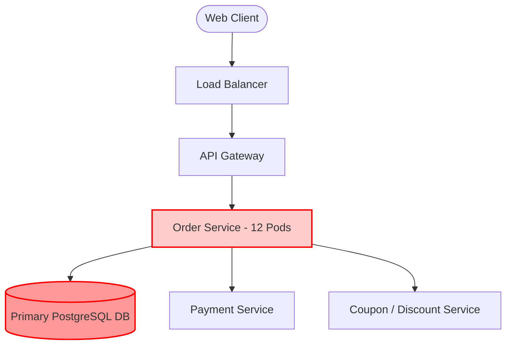

# Day 23 — What Actually Happens During a Production Incident?

> 🔗 **LinkedIn Discussion**: [Read & Discuss on LinkedIn](https://www.linkedin.com/in/himanshu-verma-822a07286/)  
> 🏛️ **System Architecture Milestone**: [`v6-observable-stack`](../../../system-evolution/v6-observable-stack/README.md)  
> 🚀 **Phase**: Phase 5 — You Can't Scale What You Can't See (Days 21–25)  
> 🎯 **Today's Focus**: The Anatomy of an Outage, Incident Command, Blast Radius Containment, Mitigation vs. Root Cause, and Running Blameless Postmortems

---

## The Problem

It is 14:02 on a Friday. Peak shopping traffic is hitting **ShopScale**.

In [Day 21](../day-21-users-know-before-you/README.md), we built an observable telemetry pipeline with OpenTelemetry, structured JSON logging, and distributed tracing. In [Day 22](../day-22-unhelpful-dashboards/README.md), we eliminated noisy alerts by establishing multi-burn-rate SLO alerts tied directly to customer impact.

At 14:03:15, the pager vibrates:

```text
CRITICAL: PagerDuty [ShopScale-Prod] - SEV-1
Alert: CheckoutErrorBudgetBurnRateHigh (14.4x Burn Rate)
Impact: Checkout success rate dropped to 64.2% (Target: 99.9%)
Long Window (1h): 4.1% errors | Short Window (5m): 35.8% errors
Runbook: https://wiki.shopscale.internal/ops/runbooks/checkout-high-burn
Dashboard: https://grafana.shopscale.internal/d/triage-checkout
```

Within ninety seconds, the primary on-call engineer clicks the dashboard. The RED metrics on the Tier 1 incident triage view confirm a disaster:
* `Order Service` incoming request latency $p99$ has exploded from **85ms to 18,400ms**.
* `API Gateway` is shedding load with `HTTP 504 Gateway Timeout` errors.
* Customer Support reports that social media is lighting up with complaints of charged cards without order confirmation screens.

```text
                                  THE ANATOMY OF A CRITICAL OUTAGE
                                  
    14:03 Pager Fires             14:06 Chaos in Slack           14:12 Uncoordinated Actions
    ┌───────────────────────┐     ┌───────────────────────┐      ┌─────────────────────────┐
    │ PagerDuty SEV-1 Alert │ ──► │ 25 people join channel│ ──►  │ "Let's restart the DB!" │
    │ 35.8% checkouts fail  │     │ Execs asking for ETAs │      │ "Wait, rollback prod!"  │
    │ Latency p99 > 18s     │     │ Zero clear leadership │      │ "I'm running a script!" │
    └───────────────────────┘     └───────────────────────┘      └────────────┬────────────┘
                                                                              │
                                                                              ▼
                                                                 [ OUTAGE DOUBLES IN SIZE ]
                                                                 Database crashes on restart;
                                                                 connection flood destroys pool;
                                                                 MTTR stretches from 10m to 2h.
```

At this moment, the greatest threat to your system is not the software bug. **The greatest threat is human disorganization under extreme stress.**

Without an operational incident framework, teams consistently fall into catastrophic behavioral patterns:
1. **The War Room Free-for-All**: Twenty engineers jump into a call. Five people talk at once, proposing conflicting hypotheses. No one knows who has the authority to make a change.
2. **Cowboy Remediation**: An engineer with production SSH access runs an ad-hoc script or modifies a database configuration live without informing anyone, masking the original symptoms and introducing secondary faults.
3. **Diagnosing Before Mitigating**: Engineers spend forty-five minutes reading stack traces to find the "root cause" line of code while hundreds of thousands of dollars in checkout revenue bleed out.
4. **Premature Restarts**: Someone restarts the database or application cluster. The restart destroys in-memory diagnostic logs, dumps open TCP sockets, and when the nodes come back up, a thundering herd of reconnecting clients crushes them instantly.

Scaling a system does not just mean scaling compute, caches, and queues. **It means scaling the operational process that defends the system when it inevitably breaks.**

---

## Why the Simple Approach Breaks

The naive approach to incident management relies on two flawed assumptions:
1. *"Smart engineers will naturally coordinate and fix the problem quickly."*
2. *"The priority during an outage is to find the bug and fix it."*

Under normal circumstances, software engineering is a contemplative, iterative, and analytical discipline. During a high-severity production incident, however, the environment becomes adversarial: incomplete information, high financial loss per minute, intense executive pressure, and rapid cognitive overload.

```text
        TRADITIONAL ENGINEERING MINDSET              INCIDENT RESPONSE MINDSET
        (NORMAL CONDITIONS)                          (ACTIVE OUTAGE)
      ┌─────────────────────────────────┐          ┌─────────────────────────────────┐
      │ Goal: Find correct, clean fix.  │          │ Goal: Stop the bleeding NOW.    │
      │ Method: Reproduce, write tests, │   VS     │ Method: Rollback, shed load,    │
      │         refactor, code review.  │          │         divert, flip flags.     │
      │ Timeframe: Hours to days.       │          │ Timeframe: Minutes.             │
      └─────────────────────────────────┘          └─────────────────────────────────┘
```

Here is why unstructured responses break down under pressure:

### 1. The "Root-Cause First" Trap

When a system fails, the instinct of a developer is to ask: *"Why did this code fail?"* They pull up IDEs, search commit diffs, and attempt to isolate a null-pointer exception or race condition.

This is fundamentally backwards. **During an active incident, you do not care why the code broke; you care about restoring user service.**

| Action Type | Goal | Typical Duration | Priority During Incident |
|---|---|---|---|
| **Mitigation** | Restore customer traffic to acceptable SLI levels (e.g., rollback deploy, toggle feature flag, scale up replicas, shed background traffic). | 2 to 10 minutes | **P0 (Immediate)** |
| **Root Cause Fix** | Write clean code, patch database schema, add unit tests, pass CI pipeline, deploy tested fix. | 2 to 24 hours | **P2 (Post-Incident)** |

Trying to write, review, and deploy a code hotfix during an active outage almost always introduces a secondary bug that compounds the disaster.

### 2. The Tragedy of Distributed Ownership

In a microservices architecture, no single engineer understands the entire dependency tree. When `Order Service` fails:
* The Order team claims: *"Our service is slow because the Database connection pool is exhausted."*
* The Database team claims: *"The Database is slow because the Network switch is dropping packets."*
* The Network team claims: *"The Network is fine; the Payment Service is holding sockets open."*

Without a designated **Incident Commander**, teams debate ownership while the outage continues uninterrupted.

### 3. Destruction of Forensic Evidence

When an incident strikes, panic prompts impulsive actions:
* *"Let's kill all pods and restart."*
* *"Flush Redis!"*
* *"Clear the OS cache and reboot the node."*

These actions wipe the exact state needed to understand what happened: JVM thread dumps, in-memory connection states, Linux kernel socket queues, and crash logs disappear. Worse, if the problem was an external dependency or an architectural bottleneck, the restart provides zero relief—the moment traffic hits the rebooted instances, they deadlock immediately.

---

## Understanding the Problem

To handle high-severity production incidents systematically, we must treat an incident as a formalized operational state machine with explicit stages and defined roles.

```text
                        THE INCIDENT LIFECYCLE
                        
     [ 1. ALERT ] ──► [ 2. TRIAGE ] ──► [ 3. BLAST RADIUS ]
           ▲                                     │
           │                                     ▼
     [ 7. POSTMORTEM ] ◄── [ 6. ROOT CAUSE ] ◄── [ 5. RECOVER ] ◄── [ 4. MITIGATE ]
```

### The Seven Stages of an Incident

```text
+-----------------------+-------------------------------------------------------------------------------+
| Phase                 | Core Operational Question & Action                                            |
+-----------------------+-------------------------------------------------------------------------------+
| 1. Alert              | "Did something break that matters?"                                           |
|                       | Telemetry alerts on an SLO burn rate violation.                               |
+-----------------------+-------------------------------------------------------------------------------+
| 2. Triage             | "Is this real, how severe is it, and who is in charge?"                       |
|                       | Verify the alert, set severity (SEV-1 vs SEV-2), appoint Incident Commander.  |
+-----------------------+-------------------------------------------------------------------------------+
| 3. Blast Radius       | "Who is hurt, what paths are broken, and what is still working?"              |
|                       | Segment by endpoint, tenant, geography, customer cohort, and read vs. write.  |
+-----------------------+-------------------------------------------------------------------------------+
| 4. Mitigate           | "How do we stop the bleeding in under 10 minutes?"                            |
|                       | Execute pre-approved runbook actions: rollback, feature flag, load shedding.  |
+-----------------------+-------------------------------------------------------------------------------+
| 5. Recover            | "Has customer traffic stabilized back within SLO boundaries?"                 |
|                       | Monitor the telemetry recovery curve; verify that recovery is sustained.      |
+-----------------------+-------------------------------------------------------------------------------+
| 6. Root Cause         | "What exact sequence of technical events triggered this failure?"            |
|                       | Offline forensics: inspect traces, logs, memory dumps, and code paths.        |
+-----------------------+-------------------------------------------------------------------------------+
| 7. Postmortem         | "How do we structurally change the system so this never happens again?"       |
|                       | Blameless retrospective producing prioritized, preventative engineering work. |
+-----------------------+-------------------------------------------------------------------------------+
```

---

### Incident Command System (ICS) Roles

Borrowed from emergency response services (firefighting, disaster relief), the **Incident Command System (ICS)** eliminates chaos by establishing strict separation of responsibilities:

```text
                         INCIDENT COMMAND STRUCTURE
                         
                       ┌─────────────────────────┐
                       │   INCIDENT COMMANDER    │
                       │          (IC)           │
                       │   Single point of true  │
                       │   decision authority    │
                       └────────────┬────────────┘
                                    │
            ┌───────────────────────┴───────────────────────┐
            ▼                                               ▼
┌─────────────────────────┐                     ┌─────────────────────────┐
│     TECHNICAL LEAD      │                     │   COMMUNICATIONS LEAD   │
│         (TL)            │                     │          (CL)           │
│ Directs investigations  │                     │ Shields responders;     │
│ Coordinates subject-    │                     │ updates executives,     │
│ matter experts (SMEs)   │                     │ support, and customers  │
└─────────────────────────┘                     └─────────────────────────┘
```

1. **Incident Commander (IC)**:
   * Holds ultimate decision-making authority for the duration of the incident.
   * **Does not investigate or touch code.** The IC maintains high-level situational awareness.
   * Directs the room: assigns tasks, enforces silence on speculative debates, asks for timeboxed hypotheses, and approves mitigations.
2. **Technical Lead (Operations / SME)**:
   * Directs the technical investigation.
   * Proposes mitigation hypotheses (e.g., *"If we disable the recommendation engine via flag, DB load drops by 40%"*).
   * Executes technical actions only after IC approval.
3. **Communications Lead (Scribe / Comms)**:
   * Maintains the public status page and internal incident timeline.
   * Shields the IC and Technical Lead from external interruptions (executives, marketing, account managers).
   * Publishes periodic updates (e.g., every 15 minutes for SEV-1) using a standardized format.

---

## Possible Approaches

When organizing an engineering organization for incident management, companies generally adopt one of three operating models.

```text
       Approach 1: AD-HOC WAR ROOM         Approach 2: ITIL / CAB TICKETING     Approach 3: MODERN SRE / ICS
       
       "Shout in Slack"                    "File 4 Approvals"                   "Decentralized Mitigation"
       ┌────────────────────────┐          ┌────────────────────────┐           ┌────────────────────────┐
       │ Anyone proposes fixes. │          │ Change Advisory Board  │           │ Incident Commander     │
       │ No designated leader.  │          │ must approve every     │           │ directs pre-approved   │
       │ Fast, but erratic and  │          │ rollback. Safe, but    │           │ playbooks. Blameless   │
       │ frequently breaks prod.│          │ MTTR takes 4 hours.    │           │ postmortems follow.    │
       └────────────────────────┘          └────────────────────────┘           └────────────────────────┘
```

### Approach 1: Ad-Hoc / Reactive War Room

#### How It Works
When an alert fires, engineers pile into an open Slack channel (`#outage-chat`) or an open video bridge. Anyone who has an opinion suggests fixes. Whoever has the terminal open tries things out in real time.

#### Where It Helps
* Works reasonably well for early-stage startups (1–5 engineers) working on a monolithic codebase where everyone knows the entire stack.
* Zero process overhead.

#### Limitations
* Breaks completely the moment the organization scales past ~15 engineers or moves to microservices.
* High risk of concurrent, contradictory actions (e.g., Engineer A scales up pods while Engineer B restarts the cluster).
* Subject to the "loudest voice in the room" rather than data-driven decisions.

#### When It Makes Sense
* Pre-product-market fit, single-team monoliths with negligible revenue penalty for downtime.

---

### Approach 2: Rigid ITIL / Change Advisory Board (CAB)

#### How It Works
Every production change—even an emergency rollback or cache flush—requires formal change requests, risk assessment tickets, and explicit sign-offs from operational managers.

#### Where It Helps
* Prevents rogue engineers from making reckless production modifications in heavily regulated, legacy enterprise environments (banking, defense).

#### Limitations
* **Catastrophically slow.** During an active outage where every second costs thousands of dollars, waiting 35 minutes for a manager to approve a feature-flag flip is unacceptable.
* Encourages covert workarounds by engineers desperate to fix the system.

#### When It Makes Sense
* Highly regulated legacy environments with strict compliance mandates where audit trails supersede availability.

---

### Approach 3: SRE Incident Command System with Pre-Approved Runbooks

#### How It Works
When an incident is declared, an Incident Commander is appointed immediately. The IC operates under a charter of **pre-delegated authority**: they have the pre-approved mandate to execute *any* non-destructive mitigation (rollback, load shedding, traffic diversion, feature flag disabling) without executive sign-off.

Actions are guided by peer-reviewed **Runbooks** (standard operating procedures for known failure modes).

#### Where It Helps
* Minimizes Mean Time to Mitigate (MTTM).
* Clear division of labor: engineers investigate without distraction; stakeholders receive consistent updates.
* Preserves psychological safety: the IC makes decisions based on agreed protocols, preventing individual blame.

#### Limitations
* Requires upfront investment in runbooks, training, and regular incident simulation drills (Game Days).
* Requires cultural discipline across management to refrain from interfering in the incident channel.

#### When It Makes Sense
* Standard practice for any modern scaling system with high-availability requirements and distributed engineering teams.

---

## Trade-offs

Incident management forces deliberate trade-offs between mitigation speed, data preservation, operational safety, and system fidelity.

```text
+------------------------------------+------------------------------------+------------------------------------+
| Decision / Action                  | What We Gain                       | What We Give Up                    |
+------------------------------------+------------------------------------+------------------------------------+
| Rollback First vs. Debug In-Place  | Immediate return to known-good     | Loses transient runtime state      |
|                                    | state; stops user bleeding fast.   | (heap dumps, socket metrics);      |
|                                    |                                    | doesn't work if DB schema migrated.|
+------------------------------------+------------------------------------+------------------------------------+
| Aggressive Load Shedding           | Protects core datastore and keeps  | Degrades user experience for       |
| (Dropping non-critical traffic)    | critical paths (checkout) alive.   | low-priority users or features     |
|                                    |                                    | (recommendations, search filters). |
+------------------------------------+------------------------------------+------------------------------------+
| Strict Comms Cadence (every 15m)   | Keeps executives and customers     | Consumes cognitive bandwidth of    |
|                                    | informed; prevents inbound pings.  | the Communications Lead / Scribe.  |
+------------------------------------+------------------------------------+------------------------------------+
| Isolating a Node for Forensics     | Preserves memory and connection    | Reduces overall cluster capacity   |
| (Removing 1 pod from load balancer)| state for offline root-cause analysis.| by 1 node while the rest of the   |
|                                    |                                    | fleet is already under load.       |
+------------------------------------+------------------------------------+------------------------------------+
```

---

## A Practical Example

Let us walk minute-by-minute through a real-world production incident on **ShopScale**.

### Incident Topology



---

### Phase 1: Alert (14:03:15 UTC)

The automated SLO multi-burn-rate monitor detects that the checkout error budget is burning at **14.4x** nominal rate over a 5-minute sliding window.

```text
[14:03:15] PagerDuty fires:
           "ShopScale-Prod / SEV-1: Checkout Error Budget Burn Rate > 14.4x"
           Assigned to: Alex (Primary On-Call SRE)
```

Alex acknowledges the page in PagerDuty within 60 seconds.

---

### Phase 2: Triage (14:04:30 UTC)

Alex opens the Tier 1 Triage dashboard. 

```text
[14:04:45] Triage Observations:
           • Endpoint: POST /v1/checkout
           • Error Rate: 36.2% of all checkouts returning HTTP 504 Gateway Timeout
           • Ingress Latency: p99 = 18.2s (Nominal: 85ms)
           • Downstream Services:
             - Payment Service: p99 = 45ms, Error Rate = 0.0% (HEALTHY)
             - Primary PostgreSQL: Active Connections = 100/100 (SATURATED)
             - DB Waiting Queries: 342 queries in queue
```

Alex confirms this is a **real, customer-impacting outage on the core revenue path**.

**Alex takes Command**:
1. Creates a dedicated Slack incident channel: `#inc-20260918-checkout-timeout`.
2. Starts an incident video bridge.
3. Sets incident severity to **SEV-1**.
4. Posts the operational declaration:

```text
🚨 INCIDENT DECLARED: SEV-1 - Checkout Failing with 504 Timeouts
• Incident Commander (IC): Alex (SRE)
• Technical Lead (TL): Sarah (Backend Tech Lead)
• Communications Lead (CL): Marcus (Product Ops)
• Voice Bridge: https://meet.shopscale.internal/inc-20260918
• Incident Slack: #inc-20260918-checkout-timeout

All operational discussions must occur on this bridge and channel.
Speculation will be muted. Do NOT run unapproved production commands.
```

---

### Phase 3: Identify Blast Radius (14:08:00 UTC)

The IC instructs the Technical Lead (Sarah) to establish the exact blast radius:

```text
[14:08:30] IC (Alex): "Sarah, what is working and what is broken?"
[14:09:45] TL (Sarah): "Blast radius confirmed:
           1. Reads are unaffected: Browse, Search, Product Details returning 200 OK (p99 = 42ms).
           2. Writes on Cart are unaffected: Adding/removing items works.
           3. Blast radius is isolated to POST /v1/checkout.
           4. Affected users: 100% of checkouts that apply promotional discount codes.
           5. Unaffected: Checkouts without promotional discount codes succeed."
```

#### What distributed tracing reveals:
Sarah opens a sample trace for an `HTTP 504` checkout in Grafana Tempo:

```text
TRACE ID: 7c89f210d3a9b4e6
[API Gateway] POST /v1/checkout ──────────────────────────── 18,200ms (504 Timeout)
  └─ [Order Service] createOrder ─────────────────────────── 18,195ms
       ├─ [Payment Service] verifyToken ────────────────────     12ms (200 OK)
       └─ [PostgreSQL] SELECT * FROM coupons FOR UPDATE ──── 18,180ms (TIMEOUT)
```

The trace isolates the problem immediately: `Order Service` threads are deadlocking inside PostgreSQL while trying to acquire an exclusive lock (`FOR UPDATE`) on the `coupons` table.

---

### Phase 4: Mitigate (Stop the Bleeding) (14:12:00 UTC)

```text
[14:12:15] TL (Sarah): "Root cause appears to be a lock contention storm on the coupons table
           introduced in deployment v2.41 thirty minutes ago. 
           Option A: Roll back v2.41 (Takes 7 minutes via CI/CD pipeline).
           Option B: Flip feature flag 'enable_dynamic_coupon_validation' to FALSE 
                     (Falls back to async coupon verification; takes 30 seconds)."
[14:13:00] IC (Alex): "We choose Option B. Disable the feature flag immediately. 
           Sarah, execute the flag change. Marcus, prepare an internal update."
```

Sarah uses the internal admin CLI to toggle the feature flag:

```bash
# Executed by Technical Lead after explicit IC authorization
curl -X POST https://config.shopscale.internal/api/v1/flags/enable_dynamic_coupon_validation \
  -H "Authorization: Bearer $PROD_INCIDENT_TOKEN" \
  -H "Content-Type: application/json" \
  -d '{"enabled": false, "reason": "INC-20260918 mitigation"}'
```

---

### Phase 5: Recover (14:14:30 UTC)

Within 45 seconds of flipping the flag, the telemetry responds:

```text
                               TELEMETRY RECOVERY CURVE
                               
    Checkout Error Rate (%)                  Active DB Connections
    100% ┼                                   100 ┼───────┐
         │                                       │       │
     50% ┼   [Flag Flipped: 14:13:30]         50 ┼       │
         │        ╲                              │       └──────────────
      0% ┼─────────╲────────────────          0% ┼──────────────────────
         14:00   14:14   14:20                   14:00   14:14   14:20
```

1. **Active PostgreSQL connections drop** from 100/100 (saturated) to 22/100.
2. **Order Service $p99$ latency drops** from 18,200ms to 92ms.
3. **Checkout error rate drops** from 36.2% to 0.02% (nominal baseline).

The IC announces:

```text
[14:18:00] IC (Alex): "Customer-facing SLI is restored. 
           We will hold the incident open in MONITORING state for 20 minutes.
           Do not touch anything else."
```

At 14:40:00, with all metrics green for 20 continuous minutes, the IC declares the incident resolved:

```text
[14:40:00] IC (Alex): "SEV-1 is officially CLOSED. 
           Total Customer-Impacting Duration: 15 minutes.
           Marcus will publish final stakeholder comms.
           Sarah and team: schedule blameless postmortem for Monday at 10:00 AM."
```

---

### Phase 6: Root Cause Investigation (Offline) (15:30:00 UTC)

Now that production is stable and customers are unaffected, the engineering team investigates *why* the failure occurred.

By examining the git diff of deployment `v2.41` (commit `a89f31`), Sarah identifies the offending change:

```python
# order_service/discounts.py — The Fatal Code Change

def apply_discount(order, coupon_code):
    # BAD PATTERN: Row-level lock inside a long-running transaction!
    with db.transaction():
        coupon = db.query(Coupon).filter_by(code=coupon_code).with_for_update().first()
        
        # SLOW STEP: Synchronous network call to third-party fraud API
        # while holding an exclusive lock on the coupon row!
        fraud_risk = fraud_client.evaluate_risk(order.user_id)
        
        if fraud_risk < 0.2:
            coupon.usage_count += 1
            order.apply_discount(coupon.discount_amount)
```

#### The Mechanics of the Cascade:
1. Marketing launched a sitewide flash promotion using a single universal code: `FLASH50`.
2. Every customer checkout concurrently executed `SELECT * FROM coupons WHERE code = 'FLASH50' FOR UPDATE`.
3. The first request acquired an exclusive lock on the `FLASH50` row.
4. While holding the database lock, the thread waited on the external fraud API (which took 800ms).
5. Hundreds of concurrent checkouts piled up waiting for the `FLASH50` lock.
6. Each waiting request consumed an active PostgreSQL database connection from the pool.
7. Within 90 seconds, all 100 database connections were locked up waiting on row `FLASH50`.
8. Once the pool was exhausted, every other query in `Order Service` starved, causing the entire checkout endpoint to time out with HTTP 504.

---

### Phase 7: The Blameless Postmortem

On Monday morning, the team convenes for the postmortem. The purpose is not to reprimand the author of the code; **it is to identify what systemic, architectural, and procedural flaws allowed this bug to reach production and take down the platform.**

Here is the actual postmortem document:

```markdown
# Incident Postmortem: SEV-1 Checkout Database Contention

**Date**: 2026-09-18  
**Incident Commander**: Alex (SRE)  
**Lead Investigator**: Sarah (Backend)  
**Status**: Resolved  
**Impact**: 15 minutes of degraded checkout; ~1,420 checkout attempts failed with HTTP 504; estimated $42,000 in delayed revenue.

---

## Executive Summary
At 14:03 UTC, an SLO alert fired indicating high checkout failure rates. A universal promotional coupon code (`FLASH50`) triggered severe row-level lock contention in the primary PostgreSQL database because row locks were held across external network I/O calls. This exhausted the database connection pool, causing cascade timeouts on all checkouts. Service was restored at 14:14 UTC by disabling dynamic coupon evaluation via feature flag.

---

## Timeline (All times UTC)
- **13:30**: Deployment `v2.41` completed without error in CI.
- **14:00**: Marketing launched sitewide `FLASH50` campaign.
- **14:02**: Checkout latency begins climbing.
- **14:03:15**: PagerDuty fires SEV-1 alert (14.4x SLO burn rate).
- **14:04:30**: IC appointed; triage confirms database pool saturation.
- **14:08:30**: Blast radius isolated to checkouts with coupons.
- **14:12:00**: Decision made to toggle feature flag `enable_dynamic_coupon_validation`.
- **14:13:30**: Feature flag disabled.
- **14:14:15**: Database connection pool recovers; error rate drops to nominal.
- **14:40:00**: Incident officially closed after 20 minutes of confirmed stability.

---

## The "5 Whys" Root Cause Analysis

1. **Why did checkouts time out with 504?**  
   `Order Service` ran out of database connections in its connection pool.
2. **Why was the database connection pool exhausted?**  
   Dozens of worker threads were blocked waiting to acquire an exclusive row lock on the `FLASH50` coupon record in PostgreSQL.
3. **Why was the row lock held for so long?**  
   The code executed an external HTTP call to the fraud service *inside* an open database transaction while holding `FOR UPDATE`.
4. **Why did this not show up in staging/testing?**  
   Staging load tests test unique, randomly generated coupon codes per virtual user. They never tested 500 concurrent requests competing for the *same* coupon row.
5. **Why was code that holds database locks across network boundaries allowed past review?**  
   We had no static analysis rule (linter) or architectural boundary prohibiting network I/O within a database transaction block.

---

## Action Items (Preventative Engineering)

| Type | Action Item | Owner | Priority | Target Date |
|---|---|---|---|---|
| **Architectural** | Move coupon usage tracking to Redis counters (`INCRBY`) to eliminate relational row locks entirely. | Sarah | P0 | 2026-09-25 |
| **Code Hygiene** | Refactor `apply_discount` to perform fraud check BEFORE opening DB transaction. | Dave | P0 | 2026-09-22 |
| **Tooling** | Add linter rule prohibiting HTTP/RPC client calls inside database transaction contexts. | Alex | P1 | 2026-10-02 |
| **Testing** | Update load test suite in `labs/load-testing` to include "hot-row contention" test cases. | Elena | P1 | 2026-10-09 |
| **Observability** | Add alert for `PostgreSQL transaction duration > 1.0s` to detect lock hogging before pool exhaustion. | Alex | P2 | 2026-10-05 |
```

---

## Failure Scenarios

Even when following standard incident protocols, teams often encounter dangerous edge cases during incident execution.

```text
+----------------------------------------------------------------------------------------------------+
| INCIDENT EXECUTION FAILURE MODES                                                                   |
+----------------------------------------------------------------------------------------------------+
| 1. The Rollback Schema Incompatibility | 2. Cold-Cache Thundering Herd | 3. The Executive Hijack   |
| Rolling back app code crashes because  | Rebooting clears Redis cache; | VP joins bridge, demands  |
| a DB column migration was irreversible.| DB instantly crushed by 100x  | constant updates, breaks  |
|                                        | raw query traffic.            | responders' focus.        |
+----------------------------------------------------------------------------------------------------+
```

### 1. The Rollback Schema Incompatibility
* **The Failure**: An incident occurs 10 minutes after a deploy. The IC immediately orders: *"Roll back to the previous Docker image!"* However, the deployment included a non-backward-compatible database migration (e.g., dropped a column or renamed a table). The old application code boots up, tries to query the removed column, and crashes instantly. Now *both* versions are broken.
* **The Fix**: Enforce the **Expand/Contract (Parallel Run) migration pattern**: database schema changes must always be backward-compatible with at least one previous version of application code. Never roll back without confirming database compatibility.

### 2. The Cold-Cache Thundering Herd
* **The Failure**: During a high-load incident, an engineer reboots the application or cache cluster. When the pods boot up, their local and distributed caches are completely empty. The incoming wave of 5,000 requests per second bypasses the empty cache and hits PostgreSQL directly. The database CPU spikes to 100% and crashes.
* **The Fix**: Implement cache warmers, aggressive request coalescing (singleflight), or pre-warm caches before opening the load balancer to traffic.

### 3. The Executive Hijack
* **The Failure**: During a high-profile outage, an executive joins the incident call: *"Who broke this? When will it be back up? I need an update every two minutes!"* Engineers freeze, stop investigating, and pivot to answering executive questions. MTTR triples.
* **The Fix**: The Communications Lead immediately intercepts the executive: *"We are executing active mitigation. All updates are posted in `#inc-updates` every 15 minutes. Please allow the responders to focus on the incident bridge."* If necessary, the IC mutes non-essential participants.

---

## Key Engineering Decisions

When formalizing an incident management system for a scaling engineering organization, codify these core rules:

```text
                   INCIDENT READINESS DECISION CHECKLIST
                   
  [ ] 1. Define Severity Levels with Zero Ambiguity
      • SEV-1: Core customer flow down (Revenue/Auth blocked). Page immediately. IC mandatory.
      • SEV-2: Major feature degraded with no workaround. Page on-call. Comms every 30m.
      • SEV-3: Minor issue with workaround. Fix during normal working hours. Ticket created.

  [ ] 2. Mandate Mitigation Before Diagnosis
      • Responders are strictly instructed: Stop the bleeding first.
      • Revert deploys, disable non-essential features via feature flags, or divert traffic.
      • Do not spend time writing code patches during a SEV-1 outage.

  [ ] 3. Pre-Approve Non-Destructive Mitigations
      • Grant on-call engineers pre-authorized executive authority to shed load, disable
        features, or roll back code without seeking managerial permission.

  [ ] 4. Preserve One Node for Forensics
      • If a fleet of 20 pods is failing, drain traffic from 1 pod and isolate it.
      • Take thread dumps, memory profiles, and socket dumps from that pod offline.
      • Restart or recycle the remaining 19 pods to restore customer service.

  [ ] 5. Enforce Blamelessness in Word and Action
      • If an engineer ran a bad query or deployed bad code, the postmortem must ask:
        "Why did our tooling allow an invalid query to take down production?"
      • Blaming individuals destroys psychological safety and guarantees engineers will
        hide future mistakes.
```

---

## Key Takeaways

* **An incident is an operational state machine.** Moving deliberately through Alert → Triage → Blast Radius → Mitigate → Recover → Root Cause → Postmortem prevents panic and reduces MTTR.
* **Mitigate first; debug later.** The goal of incident response is restoring customer service, not writing a bug fix. Always favor rollbacks, feature flag toggles, and traffic shedding over live debugging.
* **The Incident Commander does not write code.** The IC coordinates the room, assigns tasks, shields responders from distractions, and approves mitigations. Hands-on debugging belongs to the Technical Lead.
* **Never deploy hotfixes during an outage.** A hurried code patch written under adrenaline is far more likely to introduce a secondary disaster than to fix the system cleanly.
* **Failure is an architectural property, not a moral failing.** Systems that scale anticipate human errors. Blameless postmortems convert catastrophic outages into permanent systemic resilience.

---

### Next Step
* Read the next guide: **[Day 24 — Load Testing in Practice](../day-24-load-testing-in-practice/README.md)**
* View the updated architecture milestone: [`system-evolution/v6-observable-stack`](../../../system-evolution/v6-observable-stack/README.md)
