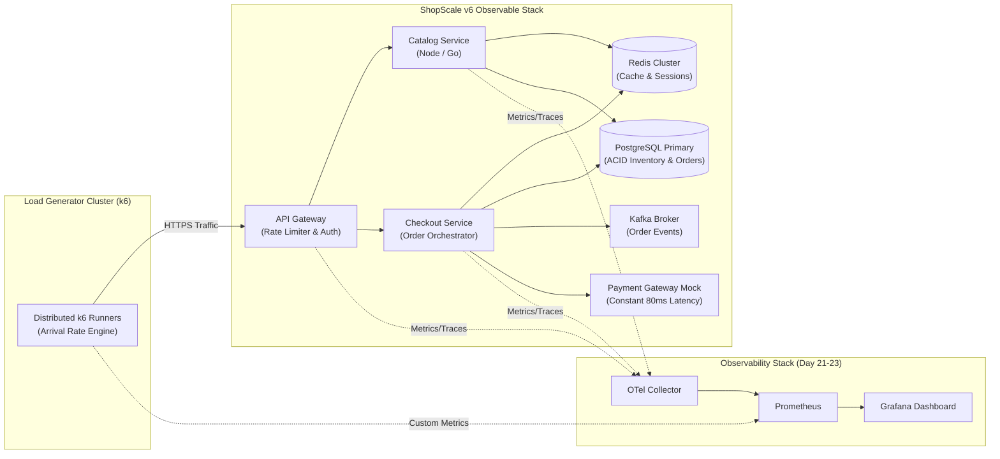

# Day 24 — Load Testing Before Your Users Do It for You

> 🔗 **LinkedIn Discussion**: [Read & Discuss on LinkedIn](https://www.linkedin.com/in/himanshu-verma-822a07286/)  
> 🏛️ **System Architecture Milestone**: [`v6-observable-stack`](../../../system-evolution/v6-observable-stack/README.md)  
> 🚀 **Phase**: Phase 5 — You Can't Scale What You Can't See (Days 21–25)  
> 🎯 **Today's Focus**: Baseline Testing, Stress Testing, Spike Testing, Soak Testing, Open vs. Closed Workload Models, Coordinated Omission, and Production-Grade Scenario Modeling with k6

---

## The Problem

It is three weeks before the biggest flash sale event of the year on **ShopScale**.

Over the previous twenty-three days, our engineering team systematically tackled architectural bottlenecks:
* We migrated our single-server monolith into horizontally scaled stateless application services behind an L7 load balancer ([Day 05](../../phase-1-one-server-enough/day-05-load-balancer-changes-everything/README.md)).
* We offloaded reads using read replicas and a Redis caching cluster ([Days 07–08](../../phase-2-database-becomes-the-problem/day-07-read-replicas/README.md)).
* We turned synchronous checkout bottlenecks into asynchronous worker pipelines using Kafka ([Days 11–15](../../phase-3-stop-making-everything-synchronous/day-12-introducing-the-queue/README.md)).
* We fortified network boundaries with bounded timeouts, exponential backoff with jitter, circuit breakers, and bulkhead isolation ([Days 17–18](../../phase-4-now-the-system-is-distributed/day-17-timeouts-retries-retry-storm/README.md)).
* We implemented OpenTelemetry distributed tracing and multi-window burn-rate SLO alerts ([Days 21–23](../day-21-users-know-before-you/README.md)).

At the executive capacity planning review, the VP of Product asks a straightforward question:

> *"Marketing is launching a nationwide campaign at midnight. We project 25,000 concurrent active users and a peak surge of 8,000 checkout attempts per minute. Will ShopScale hold?"*

The engineering lead answers with confidence:
> *"Our unit tests pass 100%. Our integration tests pass in CI. Our Kubernetes cluster has Horizontal Pod Autoscalers (HPA) configured to scale compute up to 80 pods. In theory, the system scales horizontally."*

Then midnight arrives. The marketing notification goes live. 

Within ninety seconds:
1. **The p99 latency on `/api/v1/checkout` spikes from 65ms to 14,200ms.**
2. **The cache hit ratio collapses from 94% to 32%** because thousands of users are querying non-existent or newly dropped SKU IDs that were never warmed in the cache.
3. **The PostgreSQL primary runs out of available connection slots.** Worker threads deadlock waiting for connections, while CPU utilization sits at a deceptive 38%.
4. **Kubernetes HPAs fail to respond in time.** Spinning up new container pods takes 75 seconds (container image pull, JVM/Node runtime initialization, dependency health checks). By the time the new pods report `Ready`, incoming traffic has already overwhelmed the existing pods into a cascading crash-restart loop.
5. **Six hours later, background consumer pods crash with `OOMKilled`.** A subtle memory leak in the event processing loop—undetectable during short test runs—accumulated 4 bytes of uncollected heap per order event until the Linux kernel slaughtered the processes.

```text
                           THE PRODUCTION LOAD DISASTER
                           
  Midnight Drop (8,000 RPS)
  ═════════════════════════► [ API Gateway ]
                                  │
                   ┌──────────────┴──────────────┐
                   ▼                             ▼
         [ Catalog Service ]           [ Checkout Service ]
           Cache Hit Rate:               DB Connection Pool:
           94% ──► 32%                   100/100 EXHAUSTED
                   │                             │
                   ▼                             ▼
         [ Redis Master ]              [ Postgres Master ]
           Bandwidth Saturated           Threads Blocked on Locks
           p99: 850ms                    CPU: 38% | Latency: 14s
                   │                             │
                   └──────────────┬──────────────┘
                                  ▼
                     [ CASCADE FAILURE & OOM CRASH ]
                     Pods crash-looping under load;
                     HPA spins up pods 75s too late;
                     Users get 504 Gateway Timeouts.
```

The team made the most dangerous assumption in systems engineering: **confusing functional correctness with operational capacity.**

Functional testing verifies that for input $A$, the system produces output $B$. It tells you nothing about what happens when input $A$ arrives 10,000 times a second, when shared mutexes contend, when memory buffers saturate, or when network sockets run out of ephemeral ports.

If you do not load test your system deliberately under controlled observation, **your users will load test it for you—in production, during peak revenue, when downtime costs the most.**

---

## Why the Simple Approach Breaks

Most engineering teams realize they need load testing right before a major launch. They instinctively reach for a quick script or a lightweight CLI tool. 

The naive approaches fail because they violate the physical realities of networked systems.

```text
               FOUR PATHOLOGIES OF NAIVE LOAD TESTING
               
    1. The Single-URL Loop               2. Coordinated Omission
    ┌─────────────────────────────┐      ┌─────────────────────────────┐
    │ curl / ab against 1 URL.    │      │ Tool waits for response     │
    │ Hits 100% warmed cache.     │      │ before sending next.        │
    │ False confidence: 50k RPS!  │      │ Stalls hide catastrophic    │
    │ Real traffic bypasses cache.│      │ tail latencies (p99/p99.9). │
    └─────────────────────────────┘      └─────────────────────────────┘
                   │                                     │
                   ▼                                     ▼
    ┌─────────────────────────────┐      ┌─────────────────────────────┐
    │ Testing against dummy stubs.│      │ "We ran it for 3 minutes,   │
    │ Mock DB, mock Kafka.        │      │ zero errors!"               │
    │ Real failure happens at     │      │ Fails to catch slow memory  │
    │ disk IOPS and network locks.│      │ leaks, socket leaks, and    │
    │                             │      │ disk buffer saturation.     │
    └─────────────────────────────┘      └─────────────────────────────┘
    3. Isolated Component Fantasy        4. The 3-Minute Smoke Fallacy
```

### 1. The Single-URL Script (`ab` / `curl` in a Loop)

An engineer opens a terminal on their laptop and executes:

```bash
ab -n 100000 -c 200 https://staging.shopscale.internal/api/v1/products/item-101
```

The benchmark completes with flying colors: `Requests per second: 12,500 [#/sec]`. The team celebrates.

This test is practically meaningless:
* **100% Cache Hit Rate**: The request hits the exact same URL with the exact same query parameters. After the first request, the reverse proxy (Nginx/Cloudflare) and Redis serve every single response from memory. Zero database queries execute. Zero lock contention occurs. Zero disk I/O takes place.
* **No Write Path Exercised**: Real users do not just look at one product. They browse search results with high-cardinality filters, write items into carts, reserve inventory with database row-level locks, execute payment calls, and publish events to Kafka.
* **Client Bottleneck**: The engineer's laptop runs out of local TCP ephemeral ports, context switches CPU threads, and throttles its own network card, measuring the client's inability to generate load rather than the server's capacity to receive it.

### 2. The Coordinated Omission Trap

Coordinated Omission (a term coined by Gil Tene) is the single most pervasive flaw in load testing tools and methodologies.

Most naive load testing tools operate as a **closed workload model**:
1. A virtual user (worker thread) sends a request.
2. The worker thread **blocks and waits** for the response.
3. Once the response is received, it sends the next request.

```text
    CLOSED MODEL (COORDINATED OMISSION):
    Worker 1: [ Req 1 ]──► [ Server 20ms ] ──► [ Req 2 ]──► [ Server 20ms ] ...
    
    SERVER FREEZES FOR 5,000ms (GC Pause / DB Lock):
    Worker 1: [ Req 3 ]────────────────────────────────────────────► [ 5,000ms ]
    
    What happened to the requests that were SUPPOSED to be sent during those 5 seconds?
    THEY WERE NEVER SENT! The client coordinated with the server to back off.
    Reported throughput drops, and 5 seconds of latency is recorded as ONE sample.
```

In the real world, **users do not wait for the server to unfreeze before arriving.** If your server stalls for 5 seconds during a flash sale, incoming customer requests do not pause; they pile up in OS socket queues, TCP backlogs, and load balancer buffers.

When a closed-loop tool encounters a 5-second server freeze, its worker threads stall. Consequently, it sends *fewer* requests during the period the server is struggling. The resulting test report displays a gentle dip in throughput and artificially low p99 latencies, masking the reality that in production, thousands of arriving requests would have timed out with `504 Gateway Timeout`.

### 3. The Isolated Component Fantasy

Testing a service with its downstream dependencies mocked out proves only that the service can shuffle bytes through memory. 

In [Day 18](../../phase-4-now-the-system-is-distributed/day-18-cascading-failures/README.md), we saw how cascading failures occur at the seams between services: thread pools waiting on database connections, unbuffered Kafka producer channels blocking HTTP request handlers, and downstream TCP sockets held open. Testing `Order Service` against an in-memory mock database hides the exact failure mode that will destroy it in production.

### 4. The 3-Minute Smoke Fallacy

Running a load test for 180 seconds verifies that your system can handle an initial burst of traffic. It tells you nothing about:
* **Memory Leaks**: JVM metaspace creep, Go goroutine leaks, or Node.js event listener accumulation that exhausts RAM over 12 hours.
* **Connection Exhaustion**: Database connection pool leaks where an unhandled exception skips the `defer connection.close()` cleanup branch, leaking one socket every 500 requests.
* **Log Disk Exhaustion**: Application debug logs writing 50 MB per minute until the root disk partition hits 100% and crashes the host OS.

---

## Understanding the Problem

To build a reliable load testing strategy, we must understand the core mechanics of traffic generation and dissect the **four distinct load profiles** required to evaluate a distributed system.

### Workload Models: Closed vs. Open

Understanding the difference between Closed and Open workload models is critical to designing tests that reflect reality.

```text
+------------------------+------------------------------------+------------------------------------+
| Attribute              | Closed Workload Model              | Open Workload Model                |
+------------------------+------------------------------------+------------------------------------+
| Driving Variable       | Fixed number of Concurrent Users   | Fixed Arrival Rate (Requests/sec)  |
|                        | (Virtual Users / VUs).             | independent of response time.      |
+------------------------+------------------------------------+------------------------------------+
| Request Trigger        | Next request sent ONLY after       | Next request sent when clock ticks,|
|                        | prior response returns (+ think).  | regardless of system responsiveness|
+------------------------+------------------------------------+------------------------------------+
| Behavior Under Stress  | If server slows down, client sends | If server slows down, requests keep|
|                        | FEWER requests. Load decreases.    | arriving. Queues explode.          |
+------------------------+------------------------------------+------------------------------------+
| Coordinated Omission   | Highly susceptible. Tail latencies | Immune. Accurately measures queue  |
|                        | are artificially suppressed.       | delay and backpressure collapse.   |
+------------------------+------------------------------------+------------------------------------+
| Real-World Equivalent  | Call center agents processing      | E-commerce public web traffic,     |
|                        | tickets one after another.         | IoT sensor telemetry ingress.      |
+------------------------+------------------------------------+------------------------------------+
```

For public-facing distributed systems like **ShopScale**, testing must be conducted primarily using an **Open Workload Model** (or an arrival-rate-based engine like k6's `constant-arrival-rate` executor) to accurately reflect incoming consumer demand.

---

### The Four Types of Load Testing

No single test can evaluate performance, capacity, elasticity, and stability simultaneously. A robust verification strategy deploys four complementary test profiles:

```text
    1. BASELINE TEST (Load)              2. STRESS TEST (Breaking Point)
    RPS                                  RPS
     ▲        ┌──────────────┐            ▲                  ┌──── [ CRASH ]
     │       /│              │\           │            ┌─────┘
     │      / │ Expected Peak│ \          │      ┌─────┘ Step up until
     │ ────┘  │              │  └──       │┌─────┘       saturation / crash
     └─────────────────────────────►      └─────────────────────────────►
                   Time                                 Time

    3. SPIKE TEST (Elasticity)           4. SOAK TEST (Endurance)
    RPS                                  RPS
     ▲           ┌──┐                     ▲   ┌─────────────────────────┐
     │           │  │ Flash surge         │   │ 70-80% Capacity         │
     │           │  │ (10x in 5s)         │   │ Sustained for 12-48 hrs │
     │ ──────────┘  └──────────────       │───┘                         └───
     └─────────────────────────────►      └─────────────────────────────►
                   Time                                 Time
```

#### 1. Baseline Testing (Normal Load Testing)
* **Objective**: Measure the system under expected day-to-day and peak operational traffic.
* **Profile**: Ramp up to expected peak traffic (e.g., 2,500 RPS on ShopScale), sustain for 30–60 minutes, ramp down.
* **What to Look For**:
  * Are service-level objectives (SLOs) met? (e.g., p95 < 120ms, p99 < 350ms, error rate < 0.01%).
  * Are CPU, memory, and database connection pools within safe operational margins (e.g., CPU < 65%)?
  * What is the cost per transaction under normal operating parameters?

#### 2. Stress Testing (Finding the Breaking Point)
* **Objective**: Determine the absolute maximum throughput capacity of the system and discover **how** it fails.
* **Profile**: Continuous step-wise increase in traffic (e.g., 2,000 $\rightarrow$ 4,000 $\rightarrow$ 6,000 $\rightarrow$ 10,000 $\rightarrow$ 15,000 RPS) until the system breaches error thresholds or crashes entirely.
* **Critical Questions**:
  * What is the bottleneck component? (Database locks, thread starvation, network interface saturation, upstream third-party payment APIs?)
  * **Does the system fail gracefully?** Does it shed load using HTTP 429 / 503 responses and keep critical flows alive (as designed in [Day 18](../../phase-4-now-the-system-is-distributed/day-18-cascading-failures/README.md)), or does it enter a catastrophic cascading freeze?
  * **Does it recover automatically?** When traffic drops back to baseline, does the system heal itself, or do services remain in deadlock requiring manual operator restarts?

#### 3. Spike Testing (Surge and Elasticity)
* **Objective**: Test how the architecture handles dramatic, instantaneous bursts of traffic and verify autoscaler behavior.
* **Profile**: Baseline traffic running at 500 RPS $\rightarrow$ instantaneous step function to 6,000 RPS in 5 seconds $\rightarrow$ sustain for 2 minutes $\rightarrow$ drop back to 500 RPS.
* **What to Look For**:
  * **Autoscaling Lag**: Kubernetes HPA takes 30–90 seconds to detect load and provision new pods. How do existing pods survive during those 90 seconds?
  * Do circuit breakers trip cleanly to protect downstream databases?
  * Do message queues absorb incoming spikes without dropping messages?
  * Do cache stampedes occur on high-demand SKU keys?

#### 4. Soak Testing (Endurance Testing)
* **Objective**: Uncover slow-degrading resource leaks and time-dependent defects under sustained moderate-to-high load.
* **Profile**: Run at 70%–80% of rated capacity continuously for 12 to 48 hours.
* **What to Look For**:
  * **Memory Leaks**: Gradual upward climb in JVM Old Generation heap, Node.js resident set size (RSS), or Go heap allocations that never release after garbage collection.
  * **Connection Leaks**: Database or HTTP client connection pools steadily losing idle sockets over time.
  * **Disk & Buffer Saturation**: Disk partitions filling up with unrotated logs, temporary files, or Kafka consumer lag gradually accumulating over hours.

---

## Possible Approaches

When designing a load testing practice for a scaling architecture, engineering teams have three primary architectural choices for test execution and environment strategy.

```text
+------------------------------------+------------------------------------+------------------------------------+
| Strategy                           | Description                        | Key Strengths & Trade-Offs         |
+------------------------------------+------------------------------------+------------------------------------+
| 1. Synthetic Scripted Tests        | Dedicated test runners (e.g., k6,  | [+] Reproducible, deterministic,   |
|    in Staging                      | Gatling) execute simulated user    |     safe from customer impact.     |
|                                    | journeys against a staging cluster.| [-] Staging rarely matches prod    |
|                                    |                                    |     scale/data cardinality 1:1.    |
+------------------------------------+------------------------------------+------------------------------------+
| 2. Production Traffic Shadowing    | Asynchronously duplicate live      | [+] 100% realistic user behavior,  |
|    (Mirroring / Replay)            | production ingress traffic to a    |     realistic data distribution.   |
|                                    | canary or staging cluster.         | [-] Difficult to scale beyond 1x;  |
|                                    |                                    |     write paths must be sanitized. |
+------------------------------------+------------------------------------+------------------------------------+
| 3. Controlled In-Production Load   | Run synthetic load tests directly  | [+] Tests exact hardware, network, |
|    Testing (Off-Peak / Game Days)  | against production with tagged     |     caches, and third-party limits.|
|                                    | synthetic test accounts/tenants.   | [-] High blast radius risk; needs  |
|                                    |                                    |     strict data isolation cleanup. |
+------------------------------------+------------------------------------+------------------------------------+
```

### Approach 1: Synthetic Scripted Testing with Modern Engines (Recommended Baseline)

Modern load testing has largely abandoned heavy, thread-per-user GUI tools (like classic JMeter) in favor of lightweight, asynchronous, code-as-configuration engines like **k6** (written in Go with a JavaScript scripting runtime) or **Vegeta**.

* **How It Works**: Tests are written as code, checked into version control, and executed via CLI or Kubernetes operators. Virtual users run as lightweight asynchronous goroutines.
* **Where It Helps**: Allows precise mathematical definition of traffic stages (e.g., `ramping-arrival-rate`), automated assertion thresholds (`thresholds` mapped to SLOs), and integration into CI/CD deployment gates.
* **Limitations**: Synthetic tests only test the user paths that engineers remember to code. If engineers assume users always browse before purchasing, but real users directly hammer `/checkout` via automated bots, the synthetic script misses the real traffic pattern.

### Approach 2: Production Traffic Shadowing (Mirroring)

* **How It Works**: At the API Gateway or Service Mesh layer (e.g., Envoy `request_mirror_policy`), incoming live HTTP requests are cloned asynchronously and sent to a dark test cluster.
* **Where It Helps**: Exposes performance regressions against complex, unpredictable user queries with real-world headers, query parameters, and payload sizes without manual script authoring.
* **Limitations**: Shadowing cannot easily generate 5x or 10x stress tests (you only have 1x production traffic to mirror). Furthermore, write operations (e.g., `POST /orders`, card charges) must be intercepted and stripped to prevent duplicate billing and phantom warehouse dispatches.

### Approach 3: Testing in Production with Synthetic Tenants

* **How It Works**: Load generation runs directly against the production environment during scheduled off-peak windows. Requests carry a specific header (e.g., `X-ShopScale-Synthetic-Test: true`). Downstream systems process requests normally through real load balancers, caching layers, and database clusters, but mock out external financial payment gateways and write to segregated test tables.
* **Where It Helps**: Eliminates the "staging parity" problem. Staging environments are almost always under-provisioned (1/5th the database size, smaller network bandwidth, missing read replicas), leading to false assumptions about capacity.
* **Limitations**: Carries genuine risk of impacting real users if load generation runs out of control. Requires mature observability and immediate emergency stop triggers.

---

## Trade-offs: Choosing Your Load Testing Strategy

Every testing decision involves balancing cost, safety, fidelity, and operational overhead.

```text
+------------------------------+---------------------------------------+---------------------------------------+
| Decision Axis                | Option A                              | Option B                              |
+------------------------------+---------------------------------------+---------------------------------------+
| Workload Model               | Closed Model (Virtual Users)          | Open Model (Arrival Rate / RPS)       |
|                              | Gain: Easy to conceptualize; matches  | Gain: Mathematically accurate; immune |
|                              |       fixed user counts.              |       to Coordinated Omission.        |
|                              | Sacrifice: Hides tail latency during  | Sacrifice: Requires more compute on   |
|                              |       server slowdowns.               |       load generator cluster.         |
+------------------------------+---------------------------------------+---------------------------------------+
| Environment                  | Dedicated 1:1 Staging Replica         | Shared Downscaled Staging (e.g. 25%)  |
|                              | Gain: Zero production risk; full      | Gain: 75% lower infrastructure costs. |
|                              |       stress-to-destruction freedom.  | Sacrifice: Non-linear scaling fallacies|
|                              | Sacrifice: High ongoing cloud bill    |       (a 25% system does not break at |
|                              |       for idle staging hardware.      |       exactly 25% load).              |
+------------------------------+---------------------------------------+---------------------------------------+
| Test Cardinality             | Static / Hardcoded IDs                | High-Cardinality Randomized Dataset   |
|                              | Gain: Simple test script creation.    | Gain: Realistic cache hit/miss ratios |
|                              | Sacrifice: Artificially high cache    |       and realistic DB index scans.   |
|                              |       hit rates; invalid results.     | Sacrifice: Requires pre-seeding huge  |
|                              |                                       |       test database datasets.         |
+------------------------------+---------------------------------------+---------------------------------------+
```

> [!WARNING]
> **The Non-Linear Scaling Fallacy**: Never assume that if a 2-node staging cluster handles 1,000 RPS, an 8-node production cluster will handle 4,000 RPS. Distributed bottlenecks—such as database lock contention on shared rows, Kafka partition rebalancing, and network switch backplanes—scale quadratically or exponentially, not linearly.

---

## A Practical Example: Load Testing ShopScale with k6

Let us implement an end-to-end, production-grade load testing suite for **ShopScale** using **k6**.

### System Under Test Architecture

Our target is the ShopScale checkout pipeline. The load generator runs on a separate compute node (or cluster) to ensure client-side resource contention does not distort the results.



### The Test Suite: Implementing the Four Profiles

The following script models a realistic user journey:
1. **Browse Catalog**: User loads product details (70% probability).
2. **Add to Cart**: User writes items to their session cart (20% probability).
3. **Checkout**: User reserves inventory and completes the purchase (10% probability).

It defines four independent scenarios matching our four core testing types and enforces strict SLO-based **Thresholds**.

```javascript
// load-test-shopscale.js
import http from 'k6/http';
import { check, sleep } from 'k6';
import { Counter, Rate, Trend } from 'k6/metrics';

// Custom Application Metrics
const checkoutLatency = new Trend('shopscale_checkout_duration');
const inventoryContentionRate = new Rate('shopscale_inventory_conflict_rate');
const successfulOrders = new Counter('shopscale_successful_orders');

// Configuration and Target Environment
const BASE_URL = __ENV.TARGET_URL || 'https://staging.shopscale.internal';

// High-cardinality pool of SKUs to prevent artificial 100% cache hits
const TOTAL_PRODUCTS = 50000;

export const options = {
  // Service-Level Objective (SLO) Thresholds
  // If any threshold fails, k6 exits with non-zero status code (fails CI/CD)
  thresholds: {
    // 95% of catalog requests must be under 150ms; 99% under 400ms
    'http_req_duration{type:catalog}': ['p(95)<150', 'p(99)<400'],
    
    // 95% of checkouts must complete in under 500ms; 99% under 1500ms
    'shopscale_checkout_duration': ['p(95)<500', 'p(99)<1500'],
    
    // System-wide error rate must stay below 0.5%
    'http_req_failed': ['rate<0.005'],
    
    // Inventory lock contention (HTTP 409) must not exceed 2%
    'shopscale_inventory_conflict_rate': ['rate<0.02'],
  },

  scenarios: {
    // -------------------------------------------------------------
    // 1. BASELINE TEST: Normal peak operational load (Open Model)
    // -------------------------------------------------------------
    baseline_load: {
      executor: 'constant-arrival-rate',
      rate: 1500,               // 1,500 requests per second
      timeUnit: '1s',
      duration: '20m',
      preAllocatedVUs: 200,     // Pre-allocate memory for workers
      maxVUs: 1000,             // Scale workers if server latency grows
      tags: { test_type: 'baseline' },
      exec: 'userJourney',
    },

    // -------------------------------------------------------------
    // 2. STRESS TEST: Finding the breaking point via step ramps
    // (Uncomment to execute dedicated stress profile)
    // -------------------------------------------------------------
    /*
    stress_to_breaking_point: {
      executor: 'ramping-arrival-rate',
      startRate: 500,
      timeUnit: '1s',
      preAllocatedVUs: 500,
      maxVUs: 4000,
      stages: [
        { target: 1000, duration: '5m' },   // Stage 1: Warm-up
        { target: 3000, duration: '10m' },  // Stage 2: Normal Peak
        { target: 6000, duration: '10m' },  // Stage 3: High Stress
        { target: 10000, duration: '10m' }, // Stage 4: Saturation search
        { target: 14000, duration: '5m' },  // Stage 5: Push to failure
        { target: 500, duration: '5m' },    // Stage 6: Recovery verification
      ],
      tags: { test_type: 'stress' },
      exec: 'userJourney',
    },
    */

    // -------------------------------------------------------------
    // 3. SPIKE TEST: Flash surge to test autoscaling & queue buffers
    // (Uncomment to execute dedicated spike profile)
    // -------------------------------------------------------------
    /*
    flash_sale_spike: {
      executor: 'ramping-arrival-rate',
      startRate: 300,
      timeUnit: '1s',
      preAllocatedVUs: 1000,
      maxVUs: 5000,
      stages: [
        { target: 300, duration: '2m' },    // Quiet baseline
        { target: 5000, duration: '10s' },  // INSTANTANEOUS SPIKE (Flash sale drop)
        { target: 5000, duration: '3m' },   // Hold while HPA attempts to react
        { target: 300, duration: '1m' },    // Instant drop
        { target: 300, duration: '5m' },    // Observe drain of backlogged queues
      ],
      tags: { test_type: 'spike' },
      exec: 'userJourney',
    },
    */

    // -------------------------------------------------------------
    // 4. SOAK TEST: Detect memory/connection leaks over long runs
    // (Uncomment to execute dedicated endurance profile)
    // -------------------------------------------------------------
    /*
    soak_endurance: {
      executor: 'constant-arrival-rate',
      rate: 1000,               // 70% capacity
      timeUnit: '1s',
      duration: '12h',          // Sustained over 12 hours
      preAllocatedVUs: 300,
      maxVUs: 1500,
      tags: { test_type: 'soak' },
      exec: 'userJourney',
    },
    */
  },
};

// Main Simulated User Behavior
export function userJourney() {
  const roll = Math.random();

  // 1. Random product selection from high-cardinality catalog (Cache vs DB scan)
  const randomProductId = Math.floor(Math.random() * TOTAL_PRODUCTS) + 1;

  if (roll < 0.70) {
    // PATH A: Browse Catalog (70% of traffic)
    const res = http.get(`${BASE_URL}/api/v1/products/${randomProductId}`, {
      tags: { type: 'catalog' },
    });

    check(res, {
      'catalog status is 200': (r) => r.status === 200,
      'catalog response has body': (r) => r.body && r.body.length > 0,
    });

  } else if (roll < 0.90) {
    // PATH B: Add to Cart (20% of traffic)
    const payload = JSON.stringify({
      productId: randomProductId,
      quantity: 1,
    });

    const headers = { 'Content-Type': 'application/json' };
    const res = http.post(`${BASE_URL}/api/v1/cart/items`, payload, {
      headers,
      tags: { type: 'cart' },
    });

    check(res, {
      'cart status is 200 or 201': (r) => r.status === 200 || r.status === 201,
    });

  } else {
    // PATH C: Complete Checkout (10% of traffic - heavy write transaction)
    const idempotencyKey = `user-${__VU}-iter-${__ITER}-${Date.now()}`;
    const payload = JSON.stringify({
      productId: randomProductId,
      quantity: 1,
      paymentMethodToken: 'tok_mock_visa_4242',
    });

    const headers = {
      'Content-Type': 'application/json',
      'Idempotency-Key': idempotencyKey,
      'X-ShopScale-Synthetic-Test': 'true',
    };

    const startTime = Date.now();
    const res = http.post(`${BASE_URL}/api/v1/checkout`, payload, {
      headers,
      tags: { type: 'checkout' },
    });
    const duration = Date.now() - startTime;

    checkoutLatency.add(duration);

    // Check for row lock conflict / out of stock (HTTP 409)
    if (res.status === 409) {
      inventoryContentionRate.add(1);
    } else {
      inventoryContentionRate.add(0);
    }

    const isSuccess = check(res, {
      'checkout status is 201': (r) => r.status === 201,
    });

    if (isSuccess) {
      successfulOrders.add(1);
    }
  }

  // Realistic human think time between interactions (Gaussian distributed)
  sleep(Math.random() * 2 + 1);
}
```

### Running the Load Test and Correlating with Observability

When executing this test, the terminal output provides immediate feedback, but the **true source of truth is the Grafana dashboard built in Day 22**:

```bash
# Execute the k6 baseline test pointing to the staging cluster
k6 run --out statsd=localhost:9125 load-test-shopscale.js
```

During the run, watch the **Four Golden Signals** simultaneously:
1. **Traffic**: Does incoming throughput match the expected arrival rate curve?
2. **Errors**: At what exact RPS do `504 Gateway Timeout` or `429 Too Many Requests` start appearing?
3. **Latency**: Does the p99 latency curve remain flat, or does it start curving upward exponentially (indicating queue formation)?
4. **Saturation**: Which resource reaches 80% first? (Postgres connections, Redis CPU, Kafka network bandwidth, or Kubernetes pod memory?)

---

## Failure Scenarios: What Breaks Under Each Test Type

Each load testing profile is engineered to trigger specific classes of real-world failures. Here is what breaks on ShopScale when tests are executed properly:

```text
+---------------------+---------------------------------+---------------------------------------------+
| Test Type           | Failure Mode Uncovered          | Root Cause Mechanism                        |
+---------------------+---------------------------------+---------------------------------------------+
| 1. Baseline Test    | Thread Pool Starvation          | Synchronous HTTP calls to downstream        |
|                     |                                 | services hold worker threads open too long. |
+---------------------+---------------------------------+---------------------------------------------+
| 2. Stress Test      | Database Connection Pool Lockout| Inbound HTTP requests exceed DB pool size;  |
|                     |                                 | un-pooled queries queue up and timeout.     |
+---------------------+---------------------------------+---------------------------------------------+
| 3. Spike Test       | Autoscaler Thundering Herd      | HPA spin-up latency leaves existing pods    |
|                     |                                 | exposed to 10x traffic for 90 seconds.      |
+---------------------+---------------------------------+---------------------------------------------+
| 4. Soak Test        | Linux OOMKilled via Buffer Leak | Unclosed network streams or unevicted cache |
|                     |                                 | keys slowly consume node memory over hours. |
+---------------------+---------------------------------+---------------------------------------------+
```

### 1. The Stress Test Failure: Connection Pool Exhaustion & Queue Collapse

During the **Stress Test**, as arrival rates reach 6,500 RPS, the application doesn't crash from CPU overload. Instead, it enters **Queue Saturation Collapse**.

```text
    STRESS TEST FAILURE TIMELINE (6,500 RPS):
    
    T+00s: Traffic steps up from 4,000 to 6,500 RPS.
    T+15s: Postgres connection pool (max_connections = 200) hits 100% saturation.
    T+20s: Incoming checkout requests wait on the HikariCP / pgx pool queue.
    T+25s: Queue wait time exceeds client HTTP timeout (5,000ms).
    T+28s: API Gateway starts dropping requests with HTTP 504.
    T+35s: CANCELED REQUESTS STILL EXECUTE ON DB!
           Clients abandoned the TCP connection, but the application service 
           keeps executing the expensive SQL transaction because cancellation 
           contexts were not propagated.
    T+45s: Total database lockup. All services fail health checks.
```

**How We Fixed It**:
* Configured proper connection pool sizing using the empirical formula:
  $$\text{Pool Size} = \text{Core Count} \times 2 + \text{Effective Spindle Count}$$
* Propagated `context.Context` (Go) or cancellation tokens throughout the database query path so that when a client times out or drops a socket, the database instantly aborts the query instead of wasting cycles.

### 2. The Spike Test Failure: The Autoscaling Lag Disaster

During the **Spike Test**, traffic surges from 500 RPS to 5,000 RPS in 5 seconds.

* The Kubernetes Horizontal Pod Autoscaler (HPA) monitors CPU utilization via metrics-server.
* Metrics-server scrapes metrics every **15 seconds**.
* HPA recalculates desired replica count every **15 seconds**.
* Container image pull, initialization, and readiness probes take **60 seconds**.
* **Total Time to Scale**: **90 seconds**.

For 90 seconds, the original 5 pods bear the entire 10x load. Memory usage spikes, CPU throttling kicks in, and all 5 pods crash before the 25 new pods become ready. When the new pods finally arrive, they are greeted by a massive backlog of queued requests and immediately crash as well.

**How We Fixed It**:
* Implemented proactive scheduled scaling prior to known marketing spikes.
* Tuned HPA behavior specs with aggressive scale-up policies (`stabilizationWindowSeconds: 0`, scaling up by 100% every 15 seconds).
* Installed **Rate Limiting & Graceful Load Shedding** at the API Gateway ([Day 18](../../phase-4-now-the-system-is-distributed/day-18-cascading-failures/README.md)) to drop excess traffic with HTTP 429 rather than allowing incoming surges to crash the compute cluster.

### 3. The Soak Test Failure: The 14-Hour Memory Creep

During the **Soak Test**, ShopScale runs at a comfortable 1,000 RPS (well within normal limits).

* For the first 4 hours, memory utilization is flat at 45%.
* At Hour 8, memory reaches 68%.
* At Hour 12, memory reaches 88%.
* At Hour 14, the Linux kernel Out-Of-Memory Killer (`OOMKilled`) slaughters the `Order Worker` pods one by one.

```text
    SOAK TEST: MEMORY USAGE OVER TIME
    
    100% ┼──────────────────────────────────────────────────────── [ OOM CRASH ]
         │                                                      ╭─╯
     75% │                                            ╭────────╯
         │                                   ╭────────╯
     50% │ ─────────────────────────╭────────╯
         │                 ╭────────╯
     25% │ ────────────────╯
         ┼───────────────────────────────────────────────────────────────────►
           0h     2h     4h     6h     8h     10h     12h     14h     16h
```

**The Underlying Bug**:
In the order event processing loop, an OpenTelemetry span was created for every Kafka message. On an edge-case error path (e.g., when the payment stub returned an invalid currency code), the exception handler skipped `span.End()`. The unclosed trace spans remained referenced in the tracer's internal memory buffer, leaking 1.2 KB of RAM on every failed message. Under low traffic, this leak was invisible. Under 14 hours of continuous traffic, it caused complete system failure.

---

## Key Engineering Decisions

When architecting a load testing capability for your team, make these fundamental decisions:

```text
+----------------------------------------------------------------------------------------------------+
| 1. Model Closed vs. Open Systems Accurately                                                        |
| If your system faces the public internet, use an Open Workload Model (arrival-rate-based engines).  |
| Closed models will deceive you by coordinating omission and suppressing tail latencies.            |
+----------------------------------------------------------------------------------------------------+
| 2. Seed High-Cardinality Datasets Before Testing                                                   |
| Never run a load test against an empty database or a database with only 10 rows. If your test      |
| queries the same 10 product IDs, you are benchmarking Redis RAM, not your architecture. Pre-seed  |
| hundreds of thousands of records to force realistic cache evictions and database index traversals.|
+----------------------------------------------------------------------------------------------------+
| 3. Never Test From a Single Client Machine                                                         |
| A single laptop or VM running a test generator will run out of ephemeral sockets, file descriptors,|
| or CPU context-switching capacity long before the server breaks. Distribute load generators or run |
| them on adequately sized cloud VMs with tuned Linux kernel limits (`ip_local_port_range`, `nofile`)|
+----------------------------------------------------------------------------------------------------+
| 4. Make Load Tests Part of Continuous Deployment (Gates, Not Events)                               |
| A load test run once a year before Black Friday is a panic exercise. Run automated baseline load   |
| tests in CI/CD nightly against staging to detect performance regressions on every pull request.    |
+----------------------------------------------------------------------------------------------------+
```

---

## Key Takeaways

1. **Load testing is not functional testing.** A system that functions perfectly with 10 concurrent requests will completely collapse at 10,000 concurrent requests due to physical resource contention.
2. **Beware of Coordinated Omission.** If your load generation tool waits for responses before sending new requests, it artificially inflates performance numbers during server stalls. Always use arrival-rate-based open workload models for public systems.
3. **Run all four testing profiles.** 
   * **Baseline** verifies your day-to-day SLOs.
   * **Stress** discovers where and how the system breaks.
   * **Spike** tests elasticity and autoscaler latency.
   * **Soak** uncovers slow, fatal memory and connection leaks.
4. **The database and connection pools break before CPU.** In modern distributed systems, compute is rarely the bottleneck; connection pool exhaustion, row lock contention, and thread starvation cause outages while CPU utilization appears healthy.
5. **Autoscaling is not an instant shield.** Kubernetes HPAs and cloud autoscalers take 60–120 seconds to provision and warm up new pods. During that window, existing pods must be protected by rate limiters, timeouts, and circuit breakers.
6. **If you don't load test your architecture, your users will do it for you.**

---

### Next Step
* Read the next guide: **[Day 25 — Break Your Own System](../day-25-breaking-your-own-system/README.md)**
* View the updated architecture milestone: [`system-evolution/v6-observable-stack`](../../../system-evolution/v6-observable-stack/README.md)

