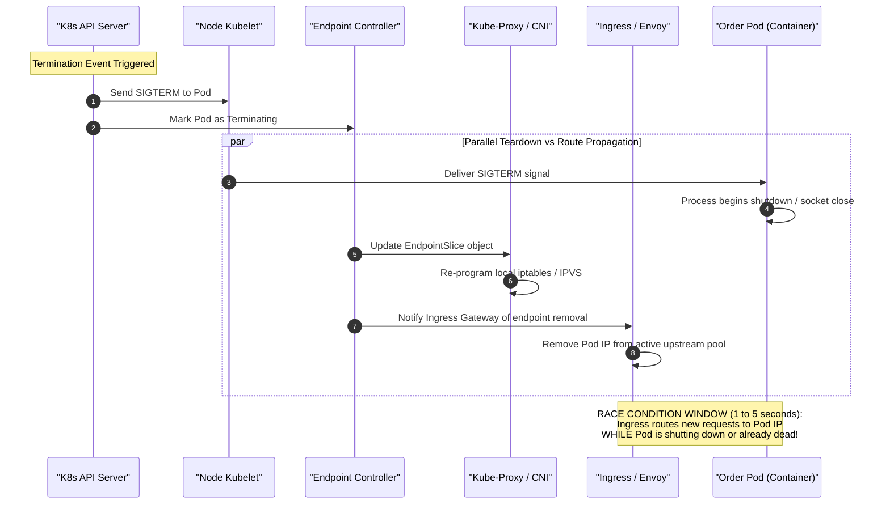
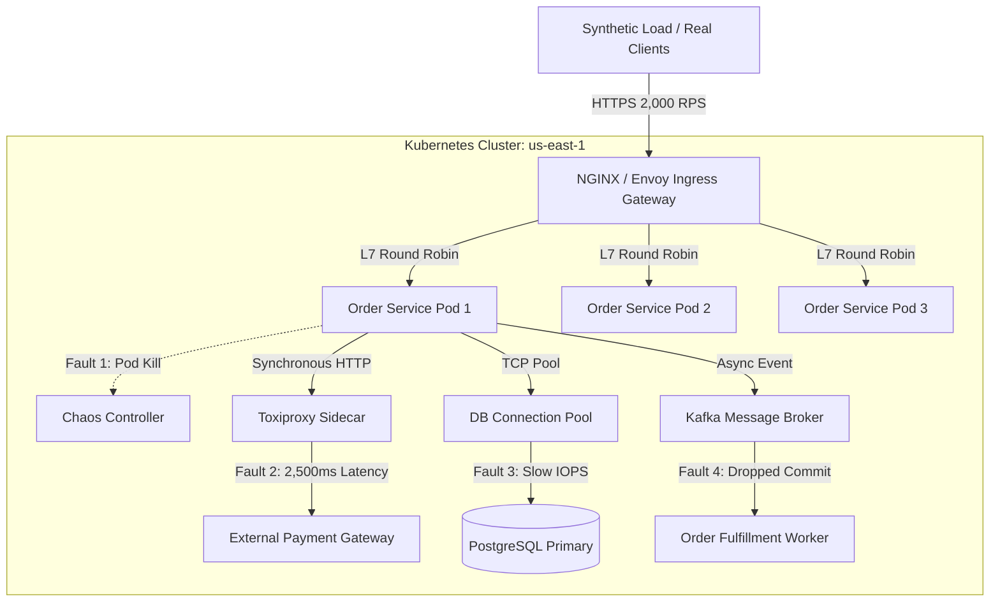

# Day 25 — Break Your Own System

> 🔗 **LinkedIn Discussion**: [Read & Discuss on LinkedIn](https://www.linkedin.com/in/himanshu-verma-822a07286/)  
> 🏛️ **System Architecture Milestone**: [`v6-observable-stack`](../../../system-evolution/v6-observable-stack/README.md)  
> 🚀 **Phase**: Phase 5 — You Can't Scale What You Can't See (Days 21–25)  
> 🎯 **Today's Focus**: Chaos Engineering, Hypothesis-Driven Failure Injection, Steady-State Verification, Blast Radius Containment, Kubernetes Pod Eviction, Toxiproxy Network Faults, Database Latency, and Automated Game Days

---

## The Problem

Yesterday ([Day 24](../day-24-load-testing-in-practice/README.md)), our team subjected **ShopScale** to an exhaustive battery of load tests. We ramped traffic up to 10,000 requests per second. We tuned Kubernetes Horizontal Pod Autoscalers (HPA), right-sized PostgreSQL connection pools, optimized Redis cache invalidation, and verified that our Prometheus dashboards and OpenTelemetry traces ([Days 21–23](../day-21-users-know-before-you/README.md)) gave us real-time visibility into the system.

At 10,000 RPS in our staging environment, every graph was green. Latency percentiles sat comfortably at $p50 = 22\text{ms}$ and $p99 = 110\text{ms}$. Error rates were $0.00\%$. 

Then, on a Tuesday at 2:14 PM in production, during a normal traffic baseline of only 1,800 RPS, disaster struck:

1. A routine AWS cloud maintenance event silently retired an underlying hypervisor, forcibly terminating a Kubernetes worker node that hosted two of our four `Order Service` replicas.
2. Simultaneously, a degraded network switch between the application availability zone (`us-east-1a`) and the managed PostgreSQL primary (`us-east-1b`) began dropping 3% of TCP packets, inflating database query times from 4ms to 2,800ms.
3. Because the queries were slow rather than crashing immediately with a connection reset, worker threads inside the remaining `Order Service` pods blocked, waiting for database response sockets.
4. Within 45 seconds, the HTTP thread pools on all remaining application pods saturated completely. 
5. Kubernetes liveness probes failed because the blocked threads could not respond to `/healthz` checks within their 2-second timeout window. The kubelet began killing the remaining healthy pods, throwing the entire cluster into an unrecoverable `CrashLoopBackOff` state.
6. The ingress gateway emitted thousands of `504 Gateway Timeout` errors to end users attempting to complete their purchases.

```text
                           THE GRAY FAILURE CASCADE
                           
   Ingress Traffic (1,800 RPS)
   ═══════════════════════════► [ Ingress Gateway ]
                                       │
                      ┌────────────────┴────────────────┐
                      ▼                                 ▼
             [ Order Pod 1 ]                    [ Order Pod 2 ]
             STATUS: RUNNING                    STATUS: TERMINATED (Node Eviction)
             Threads: 200/200 BLOCKED
             Liveness Probe: TIMED OUT
                      │
                      ▼ 3% Packet Loss / 2,800ms Latency
             [ PostgreSQL Primary ]
             CPU: 14% | Active Connections: 100/100 (Stalled on locks)
                      │
                      ▼
             [ KUBELET INTERVENTION ]
             Liveness probe failed 3 times ──► SIGKILL Order Pod 1
             Remaining capacity drops to 0% ──► TOTAL SERVICE OUTAGE
```

The team was bewildered:
* We had timeouts configured ([Day 17](../../phase-4-now-the-system-is-distributed/day-17-timeouts-retries-retry-storm/README.md)).
* We had circuit breakers deployed ([Day 18](../../phase-4-now-the-system-is-distributed/day-18-cascading-failures/README.md)).
* We had message queues to decouple downstream processing ([Days 11–15](../../phase-3-stop-making-everything-synchronous/day-12-introducing-the-queue/README.md)).
* We had passed our load tests at 5x this traffic volume ([Day 24](../day-24-load-testing-in-practice/README.md)).

Why did the system collapse?

Because **load testing tests whether your system can handle volume when everything is healthy. It does not test how your system behaves when things break.**

In a distributed system, components do not fail cleanly. They degrade slowly, drop partial packets, hold locks, run out of ephemeral sockets, and fail asynchronously. If the only time you witness your resilience mechanisms in action is during an unannounced production incident, your resilience mechanisms do not actually exist—they are merely unverified hypotheses written in code.

To build a truly reliable system, you must stop waiting for production to break on its own terms. **You must break your own system deliberately, under controlled observation.**

---

## Why the Simple Approach Breaks

Most teams recognize the necessity of resilience testing, but their initial attempts to test failure modes suffer from fundamental flaws:

```text
               FOUR PATHOLOGIES OF NAIVE FAILURE TESTING
               
    1. The Clean Crash Fallacy           2. The Staging Illusion
    ┌─────────────────────────────┐      ┌─────────────────────────────┐
    │ Testing only `kill -9` or   │      │ Mocking dependencies in CI. │
    │ container termination.      │      │ Staging lacks real network  │
    │ Clean exits close sockets;  │      │ topology, cross-AZ latency, │
    │ real bugs hide in hangs,    │      │ and multi-tenant noisy      │
    │ slow disks, and packet loss.│      │ neighbors.                  │
    └─────────────────────────────┘      └─────────────────────────────┘
                   │                                     │
                   ▼                                     ▼
    ┌─────────────────────────────┐      ┌─────────────────────────────┐
    │ Killing a pod when the      │      │ Running ad-hoc terminal     │
    │ cluster is sitting at 0 RPS.│      │ commands without baseline   │
    │ Kubelet restarts it in 10s. │      │ hypotheses, SLI metrics, or │
    │ "Look, Kubernetes heals!"   │      │ automated abort switches.   │
    └─────────────────────────────┘      └─────────────────────────────┘
    3. Failure Without Concurrency       4. The Uncontrolled Cowboy Test
```

### 1. The Clean Crash Fallacy

When an engineer decides to test fault tolerance, their instinctive first action is to run:

```bash
docker stop redis-master
# or
kubectl delete pod -l app=order-service
```

This tests the most forgiving failure mode in computing: **an instantaneous, clean crash**.

When a process is terminated cleanly or receives a `SIGTERM`/`SIGKILL`, the Linux kernel immediately tears down the process table, closes open file descriptors, and transmits TCP `RST` (Reset) or `FIN` packets to connected peers. Downstream clients receive an immediate `ECONNREFUSED` or `ECONNRESET` error within microseconds. The client's connection pool instantly purges the dead socket and retries or fails fast.

Real distributed systems rarely fail this cleanly. The catastrophic outages that cause multi-hour downtime are **gray failures**:
* A network switch drops 2% of packets, causing TCP retransmission timeouts (RTO) that freeze threads for 200ms to 3 seconds per RPC.
* A cloud SSD exhausts its burst IOPS budget, causing write latency to climb from 1ms to 450ms.
* A third-party payment gateway accepts incoming TCP handshakes immediately, but hangs indefinitely on the HTTP payload transmission.

In a gray failure, sockets remain open. No `RST` is sent. Client threads block, connection pools starve, and queues back up across every upstream caller.

### 2. Testing Failure in an Idle System

Running a failure injection script against a cluster that is processing zero user traffic is useless:
* You kill an instance of `Order Service`.
* The Kubernetes replication controller notices a missing pod.
* A new pod schedules, boots, and joins the service endpoints within 15 seconds.
* The test is declared a success.

In reality, when that same pod is killed while handling 3,000 active concurrent connections:
* In-flight requests are aborted mid-flight, triggering client-side retry storms ([Day 17](../../phase-4-now-the-system-is-distributed/day-17-timeouts-retries-retry-storm/README.md)).
* The remaining pods suddenly absorb a 33% surge in traffic.
* CPU utilization spikes, triggering thread contention and garbage collection pauses.
* The ingress load balancer continues routing new HTTP requests to the dead pod's IP address for several seconds until endpoint controller convergence completes.

Failure injection without concurrent synthetic load tests only your orchestration scripts; it tells you nothing about application runtime resilience.

### 3. The Staging Fantasy

Teams frequently attempt chaos testing in staging environments that do not mirror production realities:
* Staging uses a single-node PostgreSQL instance running on a shared development VM; production uses a multi-AZ Aurora cluster with synchronous replication.
* Staging handles 0 background traffic, so cache hit rates are completely unrepresentative.
* Staging runs all services on a single flat virtual network, masking cross-AZ routing delays, transit gateway throttles, and NAT gateway connection tracking table limits.

If the blast radius and network topology of the test environment do not reflect the physical constraints of production, the experiment provides false confidence.

### 4. Cowboy Chaos (Testing Without Hypotheses or Controls)

Occasionally, an ambitious engineer will install an open-source chaos tool and randomly terminate containers or drop network interfaces in production without preparation.

This is not engineering; it is vandalism. 

Chaos engineering is **not** about causing havoc to see what happens. It is an empirical discipline of controlled scientific experimentation: defining a steady state, formulating a refutable hypothesis, introducing a tightly bounded perturbation, observing whether the hypothesis holds, and immediately aborting if customer-facing SLOs are breached.

---

## Understanding the Problem

To practice chaos engineering effectively, we must formalize the core principles of failure injection and understand the mechanics of failure propagation in modern containerized architectures.

### The Scientific Method of Chaos Engineering

Every failure injection experiment must adhere to a strict four-step scientific cycle:

```text
    ┌─────────────────────────────────────────────────────────────┐
    │ 1. DEFINE STEADY STATE                                      │
    │ Quantify normal system behavior using high-order SLIs:      │
    │ • Ingress p99 latency < 120ms                               │
    │ • Order checkout success rate > 99.9%                       │
    └──────────────────────────────┬──────────────────────────────┘
                                   │
                                   ▼
    ┌─────────────────────────────────────────────────────────────┐
    │ 2. FORMULATE A HYPOTHESIS                                   │
    │ "If we introduce [FAULT], the system will [RESILIENCE MECH],│
    │ and steady-state SLIs will [REMAIN WITHIN BOUNDS]."         │
    └──────────────────────────────┬──────────────────────────────┘
                                   │
                                   ▼
    ┌─────────────────────────────────────────────────────────────┐
    │ 3. INJECT FAULT WITH STRICT BLAST RADIUS                    │
    │ Introduce the variable (latency, packet drop, process kill) │
    │ targeting a small fraction of compute or traffic.           │
    └──────────────────────────────┬──────────────────────────────┘
                                   │
                                   ▼
    ┌─────────────────────────────────────────────────────────────┐
    │ 4. VERIFY OR DISPROVE & ABORT                               │
    │ If steady state holds: Hypothesis confirmed!                │
    │ If steady state breaches: Auto-abort fault, file bug, fix. │
    └─────────────────────────────────────────────────────────────┘
```

#### 1. Define Steady State
Never measure a chaos experiment using low-level infrastructure metrics alone (e.g., "did the CPU stay below 80%?"). Infrastructure metrics are noisy and misleading. Define steady state using **User-Facing Service Level Indicators (SLIs)** and **Business Health Metrics**:
* **Technical SLI**: HTTP 5xx error rate at the API Gateway remains $< 0.1\%$; $p99$ response latency remains $< 350\text{ms}$.
* **Business Metric**: Successful checkouts per minute (Orders/min) does not deviate by more than $\pm 2\%$ from baseline.

#### 2. Formulate a Refutable Hypothesis
A chaos experiment must never begin with: *"Let's kill the primary database and see what happens."*

It must begin with a clear, falsifiable engineering statement:
> *"Hypothesis: If we inject 1,500ms of latency into the synchronous Payment Gateway integration, the Payment Circuit Breaker will open within 3 seconds, the Order Service will return a degraded 'Payment Queued' response via Kafka fallback, and user checkout success rate will remain $\ge 99.9\%$ with an API gateway p99 latency under 200ms."*

#### 3. Bound the Blast Radius
When running tests—especially in pre-production or production—you must strictly constrain the scope of impact:
* **Canary Failures**: Inject faults into only 1 pod out of a 20-pod replica set.
* **Header-Based Fault Routing**: Inject faults only for synthetic test users carrying a specific HTTP header (`x-chaos-test: true`), leaving real customer traffic untouched.
* **Strict Time Boxing**: Automatically terminate the experiment after 120 seconds if not manually extended.

#### 4. Automated Kill Switch (Rollback Trigger)
If the perturbation escapes the intended blast radius—for example, if the real customer error rate exceeds $1.0\%$ or the OpenTelemetry trace burn rate exceeds safe thresholds—the injection framework must instantly terminate the experiment and restore normal routing without requiring human intervention.

---

### Anatomy of a Container Failure in Kubernetes

To understand why killing a pod or an instance causes unexpected downtime, we must look inside the Kubernetes control plane.

When a pod is terminated (either via `kubectl delete pod` or a host-level crash), a distributed state synchronization race occurs across multiple independent controllers:



1. **The API Server** broadcasts the pod deletion simultaneously to two independent actors: the **Node Kubelet** hosting the pod, and the **Endpoint Controller**.
2. **The Kubelet** delivers a `SIGTERM` signal to the container process. If the application does not intercept `SIGTERM` or immediately exits, the container terminates within milliseconds.
3. **The Endpoint Controller** removes the pod's IP address from the service's `EndpointSlice` object.
4. **Kube-proxy** (or the CNI daemon) on every node in the cluster must detect the `EndpointSlice` change via the API Server watch stream and re-program local Linux `iptables` or IPVS rules.
5. **The Ingress Controller** (Nginx, Envoy, or AWS ALB Controller) must scrape or receive the endpoint update and drain the upstream pool.

**The Distributed Race Condition**:
Re-programming `iptables` across a 50-node cluster and updating Envoy's upstream cluster configuration takes anywhere from **1 to 5 seconds**. 

If your application process receives `SIGTERM` and immediately stops accepting new connections, **the ingress load balancer will continue forwarding incoming customer requests to that pod's dead IP address for up to 5 seconds.** Every single one of those requests fails instantly with `502 Bad Gateway` or `Connection Refused`.

Understanding this physical reality allows us to formulate targeted failure injection experiments to verify graceful termination and connection draining.

---

## Possible Approaches

When designing a failure injection capability for your architecture, you have four distinct layers where faults can be introduced. Each targets a specific category of architectural vulnerability.

```text
+----------------------------------------------------------------------------------------------------+
|                                      THE 4 LAYERS OF CHAOS                                         |
+----------------------------------------------------------------------------------------------------+
| 1. COMPUTE LAYER       Kill processes, evict pods, exhaust node CPU/RAM, crash VMs.                |
| 2. NETWORK LAYER       Inject latency, drop packets, corrupt frames, simulate partitions.          |
| 3. DATA & STORAGE      Throttle disk IOPS, freeze read replicas, lock tables, simulate failover.   |
| 4. APPLICATION LAYER   Inject RPC exceptions, drop consumer ACKs, poison cache keys, corrupt payloads|
+----------------------------------------------------------------------------------------------------+
```

---

### 1. Compute & Process Layer Faults

This involves intentionally terminating or starving application runtimes and host nodes.

* **How it works**: Intercepts the process lifecycle by issuing POSIX signals (`SIGKILL`, `SIGTERM`, `SIGSTOP`), evicting Kubernetes pods via the Eviction API, or starving processes of CPU shares using Linux Control Groups (`cgroups v2`).
* **Where it helps**:
  * Verifies zero-downtime rolling deployments.
  * Validates whether Kubernetes `preStop` lifecycle hooks and termination grace periods are functioning correctly.
  * Ensures stateless services do not hold state in local ephemeral disk storage.
  * Verifies that client connection pools gracefully reconnect to surviving replicas without thundering-herd spikes.
* **Limitations**: Tests primarily binary up/down states. It cannot test what happens when a dependency remains online but becomes pathologically slow.
* **When it makes sense**: The mandatory starting point for any cloud-native architecture. If your service cannot survive a single pod eviction without dropping customer requests, it is not ready for network-level chaos.

---

### 2. Network & Transport Layer Faults

This involves manipulating the transmission of IP packets and TCP streams between distributed nodes.

* **How it works**: Operates at the Linux kernel level via the Traffic Control (`tc`) subsystem and Network Emulation (`netem`) module, or via layer-7 proxy injectors (such as Shopify's `Toxiproxy` or Envoy fault injection filters).
  * **Latency**: Adding a fixed or normally distributed delay (e.g., $150\text{ms} \pm 30\text{ms}$) to all egress packets destined for a specific port.
  * **Packet Loss**: Dropping a specified percentage (e.g., 3%) of TCP packets, forcing TCP window exhaustion and retransmission delays.
  * **Blackholing (Partitioning)**: Dropping 100% of packets between two subnets or availability zones, simulating an asymmetric network partition.
* **Where it helps**:
  * Validates client-side socket timeouts and connect timeouts ([Day 17](../../phase-4-now-the-system-is-distributed/day-17-timeouts-retries-retry-storm/README.md)).
  * Ensures circuit breakers trip within expected time windows ([Day 18](../../phase-4-now-the-system-is-distributed/day-18-cascading-failures/README.md)).
  * Discovers thread pool starvation caused by unhedged downstream blocking calls.
  * Verifies distributed consensus and leader re-election under network splits ([Day 19](../../phase-4-now-the-system-is-distributed/day-19-distributed-disagreement/README.md)).
* **Limitations**: Kernel-level network emulation (`tc/netem`) requires elevated Linux privileges (`CAP_NET_ADMIN`), which can be dangerous if misconfigured. Proxy-based injection requires running sidecar proxies between all service communication paths.
* **When it makes sense**: Essential for microservice architectures with deep synchronous call graphs or critical external SaaS dependencies (payment processors, fraud detection, third-party logistics).

---

### 3. Data & Storage Layer Faults

This involves degrading or disrupting the relational database, cache cluster, or distributed message log.

* **How it works**:
  * **Primary Failover**: Forcing an immediate ungraceful failover on the PostgreSQL/MySQL primary instance to evaluate replica promotion time.
  * **Disk IOPS Exhaustion**: Saturating storage controllers using synthetic write benchmarks (`fio`) to simulate storage degradation.
  * **Replication Freeze**: Pausing the replication stream to a read replica (`SELECT pg_wal_replay_pause()`) to observe how the application handles severe replication lag ([Day 07](../../phase-2-database-becomes-the-problem/day-07-read-replicas/README.md)).
  * **Connection Starvation**: Artificially holding database connection slots open via idle transactions to saturate `max_connections`.
* **Where it helps**:
  * Exposes whether read/write splitting logic properly falls back or gracefully degrades when replicas fall behind.
  * Verifies application behavior during the 30-to-60 second window of a managed database failover.
  * Verifies that connection pools (e.g., HikariCP, PgBouncer) fail fast rather than locking HTTP worker threads indefinitely.
* **Limitations**: High blast-radius potential. If executed improperly in shared environments, it can corrupt persistent state or require manual database WAL recovery.
* **When it makes sense**: Critical before high-profile traffic events to verify that database failovers do not require a full cluster restart to recover.

---

### 4. Application & Dependency Layer Faults

This involves injecting exceptions, error status codes, or message drops directly inside the application runtime or message bus.

* **How it works**: Uses application interceptors, middleware, or mock proxies:
  * **Dropped Messages / ACK Suppression**: Simulating a Kafka consumer crash immediately after processing a record but before committing the offset, verifying idempotency keys and deduplication tables ([Day 13](../../phase-3-stop-making-everything-synchronous/day-13-exactly-once-myth/README.md)).
  * **Synthetic HTTP 503 / 429**: Configuring the API Gateway or downstream mocks to return intermittent errors.
  * **Payload Corruption**: Injecting malformed JSON payloads into the message broker to verify Dead-Letter Queue (DLQ) routing ([Day 15](../../phase-3-stop-making-everything-synchronous/day-15-surviving-traffic-spikes/README.md)).
* **Where it helps**:
  * Validates asynchronous retry policies and Dead-Letter Queue handling.
  * Proves idempotency mechanisms actually prevent double charges or duplicate inventory reservations.
  * Tests graceful UI degradation (e.g., displaying cached product recommendations when the ML recommendation service throws 500s).
* **Limitations**: Requires code-level hooks or dedicated middleware; may not reproduce underlying OS and socket-level edge cases.
* **When it makes sense**: Perfect for testing complex asynchronous workflows and transactional sagas ([Day 10](../../phase-2-database-becomes-the-problem/day-10-data-without-breaking-consistency/README.md)).

---

## Trade-offs

Resilience testing comes with real costs, risks, and engineering trade-offs. No single testing methodology fits every stage of an organization's maturity.

```text
+-----------------------+----------------------------------+----------------------------------+
| Dimension             | Testing in Staging               | Testing in Production            |
+-----------------------+----------------------------------+----------------------------------+
| Customer Risk         | Zero risk to real users.         | Potential blast radius can       |
|                       | Safe for high-risk experiments.  | impact real customer revenue.    |
+-----------------------+----------------------------------+----------------------------------+
| Environmental Realism | Low to Medium. Staging rarely has| 100% Real. Authentic traffic,   |
|                       | real scale, real cache churn, or | true multi-tenant noisy neighbors|
|                       | production hardware topologies.  | and actual network topologies.   |
+-----------------------+----------------------------------+----------------------------------+
| Confidence Gained     | Verifies functional resilience   | Proves operational resilience    |
|                       | and basic configurations.        | under real-world conditions.     |
+-----------------------+----------------------------------+----------------------------------+
| Prerequisites         | Basic load generator (k6),       | Mature observability (RED/USE),  |
|                       | simple scripts.                  | automated rollback switches,     |
|                       |                                  | distributed tracing, SLO alerts. |
+-----------------------+----------------------------------+----------------------------------+
```

```text
+-----------------------+----------------------------------+----------------------------------+
| Approach              | Automated Continuous Chaos       | Scheduled Game Days              |
|                       | (e.g., Chaos Monkey in CI/CD)    | (Human-in-the-Loop Drills)       |
+-----------------------+----------------------------------+----------------------------------+
| What It Validates     | Regression prevention. Ensures   | Validates human runbooks, team   |
|                       | new commits do not break         | incident response, dashboard     |
|                       | architectural guardrails.        | clarity, and complex multi-faults|
+-----------------------+----------------------------------+----------------------------------+
| Failure Scope         | Small, bounded, predictable      | Large, complex, cross-service    |
|                       | single-component failures.       | failure scenarios.               |
+-----------------------+----------------------------------+----------------------------------+
| Engineering Overhead  | High initial setup; low          | Low initial tooling setup; high  |
|                       | operational maintenance.         | ongoing engineering coordination.|
+-----------------------+----------------------------------+----------------------------------+
```

> [!IMPORTANT]
> **The Golden Rule of Chaos Engineering**: Never run chaos experiments in production until you have successfully run them in staging under continuous synthetic load. If you cannot survive a simulated failure in a controlled staging environment, running it in production is not an experiment—it is an outage.

---

## A Practical Example: The ShopScale Chaos Suite

To understand how this operates in practice, let us examine how we inject deliberate failures into our **ShopScale** architecture.

### The System Under Test



We establish our **Steady-State Baseline** using synthetic k6 load running at 2,000 requests per second:
* `http_req_duration{quantile="0.99"}` $< 150\text{ms}$
* `http_req_failed` $< 0.05\%$
* Active Order Checkouts: $\approx 120\text{ orders/sec}$

Let us execute four progressive failure experiments to uncover the hidden failure modes of our system.

---

### Experiment 1: Killing an Instance Under Peak Load

#### 1. The Hypothesis
> *"When 1 of our 3 active `Order Service` pods is abruptly terminated with `SIGKILL` while handling 2,000 RPS, the Kubernetes endpoint controller and ingress gateway will route incoming traffic to the surviving 2 pods. The overall customer error rate will remain $< 0.05\%$, and no `502 Bad Gateway` errors will be returned."*

#### 2. The Failure Injection
Using a Kubernetes chaos spec (or an automated script), we evict Pod 1:

```yaml
apiVersion: chaos-mesh.org/v1alpha1
kind: PodChaos
metadata:
  name: order-service-pod-kill
  namespace: shopscale
spec:
  action: pod-kill
  mode: fixed
  value: "1"
  selector:
    namespaces:
      - shopscale
    labelSelectors:
      app: order-service
  duration: "30s"
```

#### 3. What Actually Happened (The Observation)
* Within 100 milliseconds of pod termination, the ingress error rate spiked from **0.00% to 4.2%**.
* Over a 4.5-second window, **382 user checkout requests failed with `HTTP 502 Bad Gateway`**.
* The surviving two pods showed zero errors.

#### 4. The Autopsy & Root Cause
Why did 382 requests fail if we had two healthy surviving pods?

Tracing the requests in OpenTelemetry revealed that the Ingress controller was still forwarding requests to the dead pod's IP address (`10.244.2.84`) for 4.3 seconds after the container had died. 

The application process had received `SIGTERM` and exited immediately. However, the Kubernetes control plane took 4.3 seconds to propagate the updated `EndpointSlice` through the API Server to the ingress controller. During that 4.3-second gap, incoming traffic was routed to a closed socket.

```text
    THE RACE CONDITION DISCOVERED BY EXPERIMENT 1
    
    T+0.0s: Kubelet sends SIGTERM. Order App terminates instantly.
    T+0.1s: Ingress routes request #101 to Pod IP 10.244.2.84 ──► [ ECONNREFUSED -> 502 ]
    T+1.2s: Ingress routes request #145 to Pod IP 10.244.2.84 ──► [ ECONNREFUSED -> 502 ]
    T+2.8s: Ingress routes request #210 to Pod IP 10.244.2.84 ──► [ ECONNREFUSED -> 502 ]
    T+4.3s: EndpointSlice update reaches Ingress. Pod IP removed.
    T+4.4s: Traffic routes cleanly to Pod 2 and Pod 3.
```

#### 5. The Architectural Fix
We implement two changes:
1. **Add a `preStop` hook** to the container specification. The `preStop` hook executes a 5-second sleep before delivering `SIGTERM` to the application. This delays process termination until after the endpoint controller has removed the pod from the ingress routing table.
2. **Implement graceful shutdown in application code** to allow in-flight HTTP requests to complete before closing the server socket.

```yaml
apiVersion: apps/v1
kind: Deployment
metadata:
  name: order-service
spec:
  replicas: 3
  template:
    spec:
      containers:
      - name: order-service
        image: shopscale/order-service:v6
        lifecycle:
          preStop:
            exec:
              # Delay container SIGTERM to allow Ingress endpoint propagation
              command: ["/bin/sh", "-c", "sleep 5"]
```

```go
// Graceful shutdown implementation in the Go application runtime
srv := &http.Server{
    Addr:    ":8080",
    Handler: router,
}

// Channel to listen for OS termination signals
stopChan := make(chan os.Signal, 1)
signal.Notify(stopChan, os.Interrupt, syscall.SIGTERM)

go func() {
    if err := srv.ListenAndServe(); err != nil && err != http.ErrServerClosed {
        log.Fatalf("listen: %s\n", err)
    }
}()

<-stopChan
log.Println("SIGTERM received. Starting graceful draining...")

// Give in-flight requests 15 seconds to finish processing
ctx, cancel := context.WithTimeout(context.Background(), 15*time.Second)
defer cancel()

if err := srv.Shutdown(ctx); err != nil {
    log.Fatalf("Server forced to shutdown: %v", err)
}
log.Println("Server exiting cleanly. All sockets drained.")
```

**Re-running the Experiment**:
We repeat the pod kill. Error rate remains **0.00%**. The hypothesis is confirmed.

---

### Experiment 2: Injecting Downstream Latency (The Gray Failure)

#### 1. The Hypothesis
> *"If the external Payment Gateway experiences 2,500ms of latency, our circuit breaker ([Day 18](../../phase-4-now-the-system-is-distributed/day-18-cascading-failures/README.md)) will open within 3 seconds. The `Order Service` will fall back to queuing the payment asynchronously via Kafka, and API Gateway p99 latency for `/checkout` will not exceed 250ms."*

#### 2. The Failure Injection
Instead of killing the service, we inject artificial latency using **Toxiproxy** running as a sidecar proxy between the `Order Service` and the `Payment Gateway`:

```bash
# Inject 2,500ms latency with 200ms jitter on the payment downstream TCP stream
curl -X POST http://localhost:8474/proxies/payment_gateway/toxics \
  -H "Content-Type: application/json" \
  -d '{
    "type": "latency",
    "name": "payment_slowdown",
    "attributes": {
      "latency": 2500,
      "jitter": 200
    }
  }'
```

#### 3. What Actually Happened
* Within 12 seconds of injecting latency, **the entire `Order Service` stopped responding completely.**
* All three `Order Service` pods breached their Kubernetes liveness probes.
* Kubelet began restarting all pods simultaneously.
* Ingress p99 latency jumped to **10,000ms+**, and the entire platform suffered total checkout failure.

#### 4. The Autopsy & Root Cause
What went wrong? We had a circuit breaker configured, didn't we?

Inspecting the configuration revealed a fatal parameter mismatch:
1. The HTTP client timeout inside `Order Service` was configured with a default value of **10,000ms**.
2. The Circuit Breaker was configured to trip only after **50 consecutive failures**.
3. But the incoming checkout traffic was arriving at **150 requests per second per pod**.

Because each request took 2.5 seconds to complete, each active connection held an HTTP worker thread for 2,500ms. In a service with a maximum thread pool size of 200 workers:

$$\text{Required Threads} = \text{Arrival Rate} \times \text{Latency} = 150 \text{ req/s} \times 2.5\text{s} = 375 \text{ threads}$$

Within 1.3 seconds, all 200 worker threads were completely exhausted. The service had zero threads remaining to process incoming traffic—**including the internal `/healthz` probe endpoint.**

When the kubelet sent an HTTP GET to `/healthz`, the request queued behind 200 blocked payment calls. The health check timed out after 2 seconds. After three consecutive timeouts, Kubernetes killed the healthy application.

```text
    THE THREAD POOL COLLAPSE
    
    Client Req 1..200 ──► [ Order Service: 200 Threads Busy Waiting on Payment ]
                                │
    Incoming Req 201+ ──► [ Queue Full: Stalls in OS TCP Backlog ]
                                │
    Kubelet /healthz  ──► [ BLOCKED IN TCP BACKLOG ]
                                │
                          Timeout (2,000ms) exceeded!
                                │
                          Kubelet restarts pod ──► Cascading Death Spiral
```

#### 5. The Architectural Fix
We implement three defensive layers:
1. **Tighten the Outbound Timeout**: Reduce the HTTP client timeout for the Payment Gateway from 10s to **800ms**.
2. **Bulkhead Isolation**: Place payment calls inside an isolated thread pool / worker pool with a maximum concurrency limit of 20. If all 20 slots are occupied, fail fast immediately without starving main HTTP worker threads.
3. **Dedicated Health Check Port/Loop**: Ensure health check endpoints run on a dedicated internal port or bypass application-level worker queues.

```go
// Bulletproof HTTP Client Configuration
paymentClient := &http.Client{
    Timeout: 800 * time.Millisecond, // Strict bounded timeout
    Transport: &http.Transport{
        MaxIdleConns:        100,
        MaxIdleConnsPerHost: 20,
        IdleConnTimeout:     90 * time.Second,
    },
}

// Bulkhead: Limit concurrent payment requests to 20
var paymentBulkhead = make(chan struct{}, 20)

func ProcessPayment(ctx context.Context, req PaymentRequest) (PaymentResponse, error) {
    select {
    case paymentBulkhead <- struct{}{}:
        defer func() { <-paymentBulkhead }()
    default:
        // Bulkhead is saturated! Fail fast immediately to circuit breaker
        return PaymentResponse{}, ErrPaymentBulkheadSaturated
    }

    return executePaymentHTTP(ctx, req)
}
```

**Re-running the Experiment**:
We inject the 2,500ms latency again. 
* 20 workers hit the timeout.
* The bulkhead sheds excess requests immediately in $< 1\text{ms}$.
* The circuit breaker trips in **1.8 seconds**.
* Subsequent requests fall back to Kafka async queuing.
* Ingress p99 remains at **42ms**. Zero pods crash. The hypothesis is confirmed.

---

### Experiment 3: Database Connection Pool Starvation

#### 1. The Hypothesis
> *"If the primary PostgreSQL database experiences an IOPS freeze causing query latency to spike to 3,000ms, the application's connection pool will reject excess acquisition requests with an immediate error, preserving API Gateway responsiveness and preventing CPU saturation."*

#### 2. The Failure Injection
We inject an artificial lock on the `orders` table by initiating an uncommitted transaction in PostgreSQL:

```sql
-- Inject database lock contention
BEGIN;
SELECT * FROM orders WHERE status = 'PENDING' FOR UPDATE;
-- Intentionally sleep without committing or rolling back
SELECT pg_sleep(60);
```

#### 3. What Actually Happened
* All queries attempting to update order statuses queued behind the exclusive row lock.
* The application's database connection pool (`maxPoolSize: 100`) was exhausted within 800ms.
* New incoming HTTP requests that required a database connection blocked waiting on the internal pool semaphore.
* The application ran out of file descriptors, and latency degraded across the entire system.

#### 4. The Fix
Connection pool acquisitions must **never wait indefinitely**. We configure a strict `connectionTimeout`:

```properties
# HikariCP / Connection Pool Configuration
dataSource.maximumPoolSize=50
# If a connection cannot be acquired within 250ms, fail immediately
dataSource.connectionTimeout=250
# Cancel queries on the PostgreSQL server if they run longer than 1500ms
dataSource.connectionInitSql=SET statement_timeout = 1500
```

When connection acquisition times out after 250ms, the service immediately sheds load, returns `HTTP 429 Too Many Requests` or `HTTP 503 Service Unavailable`, and logs an alert. The system stays alive.

---

### Experiment 4: Dropping Message Broker ACKs (Idempotency Test)

#### 1. The Hypothesis
> *"If our Kafka consumers crash after executing downstream inventory reservations but before committing their consumer offsets ([Day 13](../../phase-3-stop-making-everything-synchronous/day-13-exactly-once-myth/README.md)), the re-delivered messages will be recognized as duplicates, and inventory will not be double-decremented."*

#### 2. The Failure Injection
We simulate a consumer crash right after the business logic executes, before the offset commit:

```go
// Chaos injection flag in consumer worker
func ProcessOrderMessage(msg kafka.Message) error {
    order := deserialize(msg.Value)
    
    // Step 1: Reserve inventory
    if err := inventoryService.Reserve(order.ItemID, order.Quantity); err != nil {
        return err
    }

    // SIMULATE CHAOS: Kill process before offset commit on 5% of messages
    if os.Getenv("INJECT_CRASH_BEFORE_ACK") == "true" && rand.Float32() < 0.05 {
        log.Fatal("CHAOS: Simulating abrupt crash before committing Kafka offset!")
    }

    // Step 2: Commit offset to Kafka
    return consumer.Commit(msg)
}
```

#### 3. What Actually Happened
The container restarted, re-read the uncommitted message from Kafka, and executed `inventoryService.Reserve()` a second time. 
* **The inventory count for item `SKU-8821` dropped by 2 units instead of 1.**
* Our idempotency verification had failed.

#### 4. The Fix
We discovered that the database update and the idempotency record insertion were executing in two separate database transactions. If the process was killed between them, deduplication failed.

We refactored the consumer operation to execute inside a single atomic database query using the `processed_events` deduplication table established on [Day 13](../../phase-3-stop-making-everything-synchronous/day-13-exactly-once-myth/README.md):

```sql
-- Atomic single-statement idempotent reservation via CTE
WITH claim AS (
    INSERT INTO processed_events (event_id, handler_name)
    VALUES ($1, 'inventory_reservation')
    ON CONFLICT (event_id) DO NOTHING
    RETURNING event_id
)
UPDATE inventory_items
SET stock = stock - $3
WHERE item_id = $2
  AND EXISTS (SELECT 1 FROM claim);
```

**Why this is airtight**:
* If message `$1` is fresh, `claim` inserts the idempotency token and returns the `event_id`. `EXISTS (SELECT 1 FROM claim)` evaluates to `TRUE`, and `stock` is decremented.
* If message `$1` is a duplicate delivery caused by an uncommitted offset or consumer crash, `ON CONFLICT DO NOTHING` executes. `claim` returns 0 rows. `EXISTS (SELECT 1 FROM claim)` evaluates to `FALSE`. The `UPDATE` statement touches 0 rows without failing the transaction.
* The operation is atomic, eliminating the multi-transaction race condition entirely.

By re-running the experiment, duplicate deliveries were ignored cleanly. The inventory balance remained mathematically correct.

---

## Failure Scenarios: What Can Still Go Wrong

Even after building a comprehensive failure injection suite, real-world distributed systems harbor subtle edge cases that can compromise your tests.

### 1. Blast Radius Escape

An experiment intended for staging or an isolated canary escapes into production:
* **The Scenario**: An engineer runs a network latency injection script targeting `us-east-1`. Because the security group or VPC CIDR mask was specified incorrectly, the script adds 2,000ms latency to the **production database cluster** instead of staging.
* **The Defense**: 
  * Infrastructure as Code (IaC) boundary separation: Production and Staging must reside in entirely separate AWS accounts / GCP projects with completely isolated IAM credentials.
  * Chaos tools must require cryptographically signed tokens and explicitly verify environment variables (`ENVIRONMENT=staging`) before executing any system-level system call (`tc`, `iptables`).

### 2. Cascading Recovery (The Thundering Herd on Restoration)

A chaos experiment terminates, and the restoration of the failed dependency causes an outage worse than the original failure:
* **The Scenario**: You inject a 60-second outage into Redis. During the outage, 50,000 incoming requests miss the cache and read from PostgreSQL. When the chaos test ends and Redis comes back online, its cache is completely empty. Thousands of concurrent requests immediately attempt to query PostgreSQL to re-populate Redis, creating a catastrophic **Cache Stampede** ([Day 08](../../phase-2-database-becomes-the-problem/day-08-caching-easy-until-not/README.md)) that crashes the database.
* **The Defense**: Always test the **recovery phase** of an experiment, not just the degradation phase. Use mutex locking (`singleflight`) around cache re-warming and rate-limit reconnection attempts.

### 3. Observability Blind Spots During Chaos

Your observability pipeline shares the same infrastructure as the system under test:
* **The Scenario**: You inject 50% packet drop across the Kubernetes node network to test service degradation. The OpenTelemetry Collector daemon and Vector logging agent cannot transmit metrics or logs to Prometheus and Loki because the network is dropping their packets too.
* **The Result**: You are flying completely blind during the exact moment of failure. Dashboards show flat lines, which alerting rules misinterpret as zero errors!
* **The Defense**: Deploy telemetry egress on isolated out-of-band networks or configure local persistent disk buffering for telemetry agents.

---

## Key Engineering Decisions

When establishing a chaos engineering practice for your team, make these fundamental architectural decisions:

```text
+----------------------------------------------------------------------------------------------------+
| 1. Never Inject Chaos Without an Automated Kill Switch                                             |
| Every chaos experiment must have a software "dead man's switch." If the testing harness loses     |
| network connectivity to the controller, the injected fault must automatically expire within 60s.   |
+----------------------------------------------------------------------------------------------------+
| 2. Hypothesis First, Tooling Last                                                                  |
| Do not start by buying or installing complex chaos platforms. Start with a plain shell script or   |
| a single `toxiproxy` instance and a written hypothesis. If you cannot explain the failure mode on  |
| a whiteboard, tooling will only automate confusion.                                                |
+----------------------------------------------------------------------------------------------------+
| 3. Test the Humans and Runbooks (Game Days)                                                        |
| Half of system resilience is organizational. Run monthly "Game Days" where a designated "Chaos    |
| Master" injects a secret failure into staging. Measure how long it takes on-call engineers to:    |
|   1. Receive the alert (MTTA)                                                                      |
|   2. Locate the relevant dashboard and trace span                                                  |
|   3. Correctly identify the degraded component                                                    |
+----------------------------------------------------------------------------------------------------+
| 4. Make Chaos a Continuous Regression Gate in CI/CD                                                |
| Once a failure mode is discovered and fixed (e.g., the `preStop` race condition), convert that     |
| chaos test into an automated integration test in CI/CD to prevent future code regressions.         |
+----------------------------------------------------------------------------------------------------+
```

---

## Key Takeaways

1. **Clean crashes are easy; gray failures are deadly.** Systems rarely fail via instantaneous process termination. Real disasters are caused by slow queries, 2% packet loss, thread exhaustion, and resource starvation.
2. **If you haven't tested it under failure, your resilience code does not work.** Timeouts, circuit breakers, bulkheads, and retries are complex distributed systems features. Without empirical verification, they almost always contain configuration bugs that fail during an incident.
3. **Always test failure under concurrent load.** Killing a pod or freezing a database when traffic is zero proves nothing. Combine load testing engines (k6) with failure injection to observe how remaining components absorb displaced traffic.
4. **Kubernetes pod termination is a distributed race condition.** Without container `preStop` hooks (`sleep 5`) and application graceful shutdown, ingress controllers will route customer traffic to terminating pods, causing `502 Bad Gateway` errors.
5. **Chaos engineering is the scientific method applied to infrastructure.** Define steady state using user-facing SLIs, formulate a refutable hypothesis, constrain the blast radius, and automate an abort trigger.
6. **Break your own system before production breaks it for you.**

---

### Next Step
With Phase 5 complete, our system is fully observable, load-tested, and hardened against real-world failures. Now we move into **Phase 6 — Designing for Real Scale**.
* Read the next guide: **[Day 26 — Rate Limiting at Scale](../../phase-6-designing-for-real-scale/day-26-rate-limiting-at-scale/README.md)**
* Review the Phase 5 architecture milestone: [`system-evolution/v6-observable-stack`](../../../system-evolution/v6-observable-stack/README.md)
