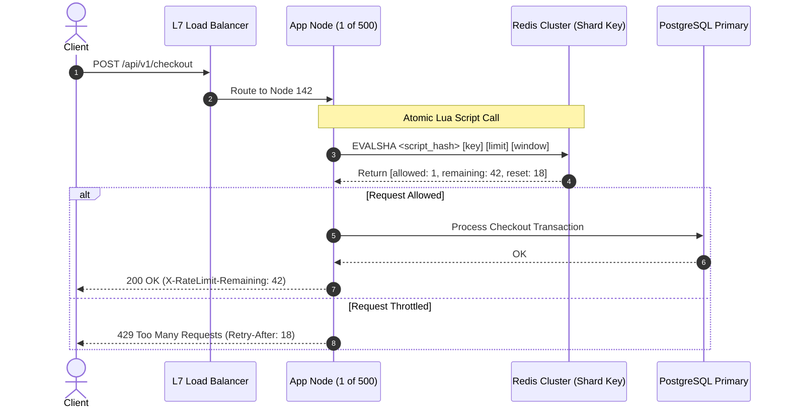

# Day 26 — Rate Limiting at Scale

> 🔗 **LinkedIn Discussion**: [Read & Discuss on LinkedIn](https://www.linkedin.com/in/himanshu-verma-822a07286/)  
> 🏛️ **System Architecture Milestone**: [`v7-global-architecture`](../../../system-evolution/v7-global-architecture/README.md)  
> 🚀 **Phase**: Phase 6 — Designing for Real Scale (Days 26–29)  
> 🎯 **Today's Focus**: Distributed Rate Limiting Across 500+ App Nodes, Token Bucket vs. Sliding Window, Redis Lua Atomicity, Token Batching, and Graceful Degradation

---

## The Problem

Yesterday in [Day 25 — Break Your Own System](../../phase-5-cant-scale-what-you-cant-see/day-25-breaking-your-own-system/README.md), we injected synthetic latency, killed nodes, and verified that our observability stack ([Days 21–23](../../phase-5-cant-scale-what-you-cant-see/day-21-users-know-before-you/README.md)) caught gray failures before they cascaded. 

Now, **ShopScale** has entered **Phase 6: Designing for Real Scale**. 

Our infrastructure footprint has grown dramatically. To service peak global traffic, our application compute layer has scaled horizontally to **500 stateless application instances** running inside Kubernetes across multiple availability zones. Behind them sits our shared infrastructure: PostgreSQL primary and read replicas ([Days 06–09](../../phase-2-database-becomes-the-problem/day-06-app-scales-db-doesnt/README.md)), Redis caches ([Day 08](../../phase-2-database-becomes-the-problem/day-08-caching-easy-until-not/README.md)), and asynchronous Kafka message brokers ([Days 11–15](../../phase-3-stop-making-everything-synchronous/day-12-introducing-the-queue/README.md)).

To protect our downstream databases and third-party payment gateways from starvation, product engineering defines an API usage contract:

```text
Tier 1 Partners: Maximum 600 requests per minute per API Key
Public / Unauthenticated: Maximum 60 requests per minute per IP
Checkout Endpoint: Maximum 10 requests per minute per User Account
```

An engineer implements an in-memory rate limiter on the backend services. The algorithm is textbook: a standard Token Bucket stored in application memory. When tested locally, it works flawlessly: request 61 receives an immediate `HTTP 429 Too Many Requests`.

Then, a rogue scraper script targets our catalog search and flash-sale checkout endpoints. 

The scraper distributes its requests across a cluster of residential proxies and blasts our system with **15,000 requests in 60 seconds**.

Here is what happens inside our 500-node cluster:

```text
                             THE 500-SERVER DILUTION EFFECT
                             
   Rogue Client: 15,000 requests in 60 seconds (Quota: 600 req/min)
   ═══════════════════════════════════════════════════════════════════►
                                  │
                                  ▼
                   [ Layer 7 Load Balancer Fleet ]
                   (Distributes round-robin / least-conn)
                                  │
         ┌────────────────────────┼────────────────────────┐
         │ (30 reqs)              │ (30 reqs)              │ (30 reqs)
         ▼                        ▼                        ▼
  [ App Instance 1 ]       [ App Instance 2 ]     ... [ App Instance 500 ]
  Local Count: 30/600      Local Count: 30/600        Local Count: 30/600
  Status: ALLOWED ✅       Status: ALLOWED ✅         Status: ALLOWED ✅
         │                        │                        │
         └────────────────────────┼────────────────────────┘
                                  │
                                  ▼
              💥 15,000 REQUESTS SLAM DOWNSTREAM DATABASE!
                 Database connection pool exhausted (Day 06)
                 Read replica replication lag surges to 45s (Day 07)
                 Thread pool saturation triggers cascading 504 timeouts (Day 18)
```

Because our Layer 7 load balancer distributes incoming requests evenly across the 500 nodes, each individual application server sees only:

$$\frac{15{,}000 \text{ requests}}{500 \text{ servers}} = 30 \text{ requests per server}$$

Every single server looks at its local in-memory counter, compares 30 against the 600 req/min threshold, and concludes: *"This client has used only 5% of their quota. Request approved."*

The client successfully pushed **15,000 requests through a 600-request limit**—a **25× quota breach**. The rate limiter was completely blind because the state was fragmented across 500 independent memory spaces.

Rate limiting on a single node is a solved data-structures problem. **Rate limiting across 500 independent servers under high concurrency is a distributed systems problem.**

---

## Why the Simple Approach Breaks

When engineering teams first encounter the multi-server dilution problem, they cycle through three predictable stages of "simple" fixes. Each one introduces severe operational failures.

```text
      Naive Pattern 1                  Naive Pattern 2                  Naive Pattern 3
   "Sticky Sessions (IP)"            "Central Database Table"        "Naive Redis GET + SET"
 ┌──────────────────────────┐     ┌──────────────────────────┐     ┌──────────────────────────┐
 │ Hash client IP to a      │     │ INSERT INTO request_logs;│     │ count = redis.get(key)   │
 │ single server node.      │     │ SELECT COUNT(*) WHERE    │     │ if count < limit:        │
 │                          │     │ timestamp > NOW() - 60s; │     │   redis.incr(key)        │
 └────────────┬─────────────┘     └────────────┬─────────────┘     └────────────┬─────────────┘
              │                                │                                │
              ▼                                ▼                                ▼
   Hotspots destroy nodes;          50,000 writes/sec to disk;       Race condition: 50 nodes   
   carrier-grade NAT routes         database locks collapse          read `99` concurrently;    
   10,000 users to one pod.         the entire system.               admit 50 requests at limit.
```

### 1. Sticky Load Balancing (Session Affinity)

The first instinctive suggestion is: *"Use consistent hashing on the client IP or API key at the load balancer. If the same client always lands on the same server, that server's local in-memory counter is always accurate!"*

**Why it breaks in production:**
* **The Carrier-Grade NAT (CGNAT) Problem**: Thousands of cellular mobile devices on networks like T-Mobile or Vodafone share a small pool of gateway public IP addresses. Routing by IP dumps tens of thousands of distinct human users onto a single application node, instantly crashing it while the remaining 499 servers sit idle.
* **Auto-scaling and Pod Churn**: In Kubernetes, pods are ephemeral. As soon as the cluster scales up or an unhealthy pod is evicted, the hash ring rebalances. Existing counters are stranded or reset to zero, resetting client quotas mid-minute.
* **The Whale Tenant Problem**: If an enterprise partner generates 20% of your total traffic, consistent hashing pins that entire 20% load to one node. The node experiences CPU starvation and memory exhaustion while other nodes remain at 5% utilization.

### 2. The Centralized SQL Database Query

The second approach attempts centralized truth using the existing database:

```sql
-- Executed on EVERY incoming HTTP request before processing
INSERT INTO api_request_logs (client_id, requested_at) VALUES ('usr_9812', NOW());

SELECT COUNT(*) 
FROM api_request_logs 
WHERE client_id = 'usr_9812' 
  AND requested_at >= NOW() - INTERVAL '1 MINUTE';
```

**Why it breaks in production:**
At 25,000 incoming requests per second, this pattern forces **25,000 disk writes and 25,000 range-scan aggregations per second** onto your primary database. 

Table bloat accelerates exponentially. Index maintenance on `requested_at` saturates database write IOPS. The rate-limiting query intended to shield the database becomes the very mechanism that brings the database down.

### 3. Naive Redis `GET` + `INCR` (The Concurrency Window)

Recognizing that relational databases cannot handle the write throughput, teams move counters to an in-memory key-value store like Redis:

```python
# NAIVE PATTERN: Non-atomic Check-Then-Act
def is_allowed(client_id: str, limit: int = 100) -> bool:
    current_count = redis_client.get(f"ratelimit:{client_id}")
    
    if current_count is not None and int(current_count) >= limit:
        return False  # Throttled
    
    # Check passed! Increment counter
    redis_client.incr(f"ratelimit:{client_id}")
    return True
```

**Why it breaks in production:**
This code contains a classic **check-then-act race condition**. 

Suppose the limit is 100, and the counter is currently at 99. A burst of 30 concurrent requests arrives across 30 different application servers within the same 2-millisecond window:

```text
 Time    App Server 1              App Server 2              App Server 30             Redis State
 ───────────────────────────────────────────────────────────────────────────────────────────────────
 T+0ms   GET ratelimit:user_123 ─►                                                  Count is 99
 T+1ms                             GET ratelimit:user_123 ─►                        Count is 99
 T+2ms                                                       GET ratelimit:user_123 Count is 99
 T+3ms   Evaluates: 99 < 100 (OK)                                                   
 T+4ms                             Evaluates: 99 < 100 (OK)                         
 T+5ms                                                       Evaluates: 99 < 100 (OK)
 T+6ms   INCR ───────────────────►                                                  Count becomes 100
 T+7ms                             INCR ───────────────────►                        Count becomes 101
 T+8ms                                                       INCR ────────────────► Count becomes 129
```

All 30 servers read `99`. All 30 servers conclude the client is below the limit. All 30 requests are admitted. The client pushed 129 requests through a strict 100-request ceiling. 

Under real-world concurrency, naive Redis reads and writes permit burst overruns of **20% to 300%**.

---

## Understanding the Problem

To build a rate limiter that functions across hundreds of nodes, we must understand the core algorithmic mechanics, the mathematics of time windows, and the cost of distributed consensus.

### The Five Canonical Rate Limiting Algorithms

Every distributed rate limiter is built upon one of five core algorithms. Choosing the wrong one introduces subtle bugs or prohibitive memory costs.

```text
 1. Fixed Window            2. Sliding Window Log       3. Sliding Window Counter
 ┌──────────┬──────────┐    ┌──────────────────────┐    ┌──────────┬──────────┐
 │ [ 100 ]  │  [ 100 ] │    │ • • • • • • • • • •  │    │ Prev: 80 │ Curr: 30 │
 └──────────┴──────────┘    └──────────────────────┘    └──────────┴──────────┘
 Boundary burst: 2x limit   Exact timestamps (ZSET)     Weighted mathematical estimate
 Low memory, coarse.        High memory: O(N) per user  Ultra-low memory: O(1), fast

 4. Token Bucket                                        5. Leaky Bucket
 ┌─────────────────────────┐                            ┌─────────────────────────┐
 │       Tokens Refill     │                            │     Incoming Requests   │
 │            ▼            │                            │            ▼            │
 │   ┌─────────────────┐   │                            │   ┌─────────────────┐   │
 │   │  ●   ●   ●   ●  │   │                            │   │  ░░░░░░░░░░░░░  │   │
 │   └────────┬────────┘   │                            │   └────────┬────────┘   │
 │            ▼            │                            │            ▼            │
 │     Allows Bursts       │                            │     Constant Outflow    │
 └─────────────────────────┘                            └─────────────────────────┘
```

#### 1. Fixed Window Counter
Time is divided into rigid, fixed chronological intervals (e.g., 12:00:00–12:01:00, 12:01:00–12:02:00). A counter increments with each request. When the window rolls over, the counter resets to 0.

* **The Fatal Flaw (The Edge Burst)**: If a client has a limit of 100 req/min, they can send 100 requests at 12:00:59 (the tail of Window 1) and another 100 requests at 12:01:01 (the head of Window 2). 
* Over a 2-second interval across the window boundary, the backend experiences **200 requests**—double the safe operating limit.

#### 2. Sliding Window Log
Instead of counting in buckets, we store an exact Unix timestamp for every single request in a sorted set (e.g., Redis `ZSET`). When a new request arrives:
1. Purge all timestamps older than `now - window_size`.
2. Count remaining elements in the set.
3. If `count < limit`, append `now` and admit the request.

* **Advantages**: Mathematically perfect. Zero window edge bursts.
* **The Fatal Flaw (Memory Explosion)**: If an active API customer has a limit of 5,000 requests per minute, and you have 200,000 active users, Redis must store $200{,}000 \times 5{,}000 = 1{,}000{,}000{,}000$ 64-bit integer timestamps. At ~64 bytes of overhead per sorted set member, this requires **64 GB of expensive Redis RAM** purely to store rate-limiting logs.

#### 3. Sliding Window Counter (Approximation)
This algorithm combines the ultra-low memory footprint of Fixed Window with the boundary-smoothing accuracy of Sliding Window Log.

Instead of tracking every request timestamp, we store only the total count of the **previous window** and the **current window**. When a request arrives at time $t$ within the current window:

$$\text{Weight}_{\text{prev}} = 1 - \frac{\text{time elapsed in current window}}{\text{total window duration}}$$

$$\text{Estimated Count} = (\text{Count}_{\text{prev}} \times \text{Weight}_{\text{prev}}) + \text{Count}_{\text{curr}}$$

```text
 Scenario: Limit is 100 requests/minute.
 Previous Window [12:00 - 12:01]: 80 requests
 Current Window  [12:01 - 12:02]: 30 requests
 Current Time: 12:01:18 (18 seconds into current 60s window = 30% elapsed)

 Weight of Previous Window = 1 - (18 / 60) = 0.70
 Estimated Count = (80 * 0.70) + 30 = 56 + 30 = 86 requests

 86 < 100 => Request APPROVED!
```

* **Memory Usage**: Exactly two integer counters per key ($O(1)$ memory).
* **Accuracy**: Assumes traffic in the previous window was evenly distributed. Across production datasets, the maximum error rate compared to exact logs is less than **0.05%**, making it the industry standard for high-throughput API gateways (used by Cloudflare and Stripe).

#### 4. Token Bucket
A bucket of maximum capacity $C$ continuously refills with tokens at a sustained rate of $r$ tokens per second. Each incoming request consumes 1 token.
* If tokens $\ge 1$: Deduct 1 token, approve request.
* If tokens $< 1$: Reject request (`429 Too Many Requests`).

* **Key Characteristic**: **Allows controlled traffic bursts**. If an API has been idle, the bucket fills to capacity $C$. A client can immediately fire $C$ requests in a single millisecond without being blocked. Once the bucket is empty, the client is strictly throttled to the refill rate $r$.

#### 5. Leaky Bucket
Requests enter a FIFO buffer of fixed capacity. The buffer leaks requests out for processing at a **strictly constant, smooth rate** (like water dripping from a punctured bucket).
* If incoming traffic bursts beyond the buffer capacity, the bucket overflows and excess requests are immediately rejected.
* **Key Characteristic**: Eliminates bursts entirely. It enforces **traffic shaping**, guaranteeing that downstream services experience completely flat, predictable load.

---

## Possible Approaches

When enforcing rate limits across 500 servers, four architectural patterns emerge. Each occupies a distinct position on the spectrum between **consistency** and **latency**.

```text
 ┌──────────────────────────────────────────────────────────────────────────┐
 │                       THE RATE LIMITING SPECTRUM                         │
 │                                                                          │
 │   Decentralized / Fast                           Centralized / Strict    │
 │   ────────────────────                           ────────────────────    │
 │   Approach 2: Local Batch     Approach 4: Edge   Approach 1: Central     │
 │   Pre-Allocation              Envoy / Gateway    Redis + Lua Script      │
 │   (0.01ms latency,            (0.5ms latency,    (1.5ms latency,         │
 │    approximate quotas)         perimeter drop)    exact atomic bounds)   │
 └──────────────────────────────────────────────────────────────────────────┘
```

---

### Approach 1: Centralized Redis with Atomic Lua Scripting

Every application server delegates the rate-limiting decision to a centralized Redis cluster. To eliminate the check-then-act race condition, the entire algorithm executes inside a **Redis Lua script**. 

Because Redis executes Lua scripts as a single, atomic operation on its main execution thread, no other command can run concurrently between the calculation and the counter update.



#### How it works:
When an application server receives a request, it calls Redis with `EVALSHA`. The script calculates token availability or window counts, updates the data structures, sets an automatic time-to-live (`TTL`) eviction on the key, and returns the verdict in a single network round-trip.

#### Where it helps:
* **Absolute Accuracy**: Enforces a strict, unyielding limit across 500+ servers. If the limit is 100, exactly 100 requests pass—never 101.
* **Instant Propagation**: If a client consumes their quota on Server 1, Server 500 knows about it within 1 millisecond.

#### Limitations:
* **Network Latency Tax**: Every incoming HTTP request must wait for a network round-trip to Redis ($0.5\text{ms}$ to $2\text{ms}$) before application processing can begin.
* **Redis Saturation**: At 200,000 requests per second across the fleet, Redis must process 200,000 Lua evaluations per second. Without clustering and pipelining, the Redis single-threaded CPU will bottleneck.

#### When it makes sense:
Financial transactions, checkout operations, inventory reservations, and paid third-party API tiers where over-admission directly impacts revenue or downstream stability.

---

### Approach 2: Local In-Memory Limiting with Asynchronous Batch Synchronization

Instead of pinging Redis on every single request, application nodes maintain **local token buckets in memory** and asynchronously synchronize with a central coordinator in batches.

```text
                               LOCAL TOKEN BATCHING
                               
   App Server 23 (Local Bucket)
   ┌────────────────────────────────────────┐
   │ Current Tokens: 12                     │
   │ Requests 1-12 processed with 0ms delay │
   └───────────────────┬────────────────────┘
                       │
                       │ Local tokens hit low watermark (≤ 5)
                       ▼
             [ Batch Reservation ]
             "Reserve 50 tokens from Redis for client_usr_9812"
                       │
                       ▼
          [ Central Redis Cluster ]
          Global Tokens: 600 -> 550 (Deducted in one atomic call)
```

#### How it works:
1. Each application node manages an in-memory Token Bucket.
2. An incoming request consumes a local token with **sub-microsecond memory access**.
3. When an application server's local token supply drops below a threshold (e.g., 10 tokens), it fires a background asynchronous request to Redis: *"Reserve a batch of 50 tokens for `user_123`"*.
4. If Redis has tokens available, it deducts 50 globally and grants them to the node. If Redis reports the global pool is empty, the node marks the client as throttled locally.

#### Where it helps:
* **Zero Critical-Path Latency**: Over 95% of incoming requests are approved in-memory without touching the network ($< 0.05\text{ms}$).
* **Redis Offload**: Reduces Redis operations by **50×** (one Redis call per 50 requests instead of one per request).
* **Fault Tolerance**: If Redis crashes or undergoes a failover, nodes can continue draining their locally allocated tokens gracefully.

#### Limitations:
* **Loose Bounds**: If an application node allocates 50 tokens for a client that goes idle, those 50 tokens are "trapped" on that node until they expire, temporarily under-allocating tokens to active nodes.
* **Minor Burst Leaks**: During a sharp global spike across 500 nodes, each node might burn its remaining batch before receiving the global empty signal, allowing a bounded overrun proportional to $\text{number of nodes} \times \text{batch size}$.

#### When it makes sense:
Ultra-high-throughput public APIs (e.g., catalog search, telemetry endpoints, content delivery) where sub-millisecond p99 latency is prioritized over absolute mathematical precision.

---

### Approach 3: Consistent Hashing at the API Gateway Layer

Instead of making state distributed, make the routing state-aware.

```text
   Incoming Request (User: usr_4401)
                  │
                  ▼
       [ Envoy API Gateway ]
   Hash(usr_4401) % 500 = Node 87
                  │
                  ▼
         [ App Node 87 ]
   Local In-Memory Rate Limiter
   (State is 100% accurate because ALL requests for usr_4401 arrive here)
```

#### How it works:
The ingress gateway calculates a hash of the rate-limiting key (API Key or User ID) and routes the request to a specific backend application pod using a consistent hash ring. Because all requests for a given user always terminate at the exact same pod, that pod can use simple, high-performance in-memory rate limiting.

#### Where it helps:
* Zero distributed coordinator dependencies (no Redis needed for rate limiting).
* Fast in-memory execution.

#### Limitations:
* **The Hotspot Fragility**: A single high-volume tenant saturates the specific node they hash to.
* **Cluster Rebalancing Churn**: In Kubernetes, nodes scale up and down continually. Every scaling event remaps hash boundaries, resetting rate-limiting counters and letting bursts through.
* **Connection Overhead**: The gateway must maintain active HTTP/2 or TCP multiplexing pools from every gateway proxy to every individual backend pod.

#### When it makes sense:
Stateful, long-lived WebSocket connections or specialized internal microservice fabrics with static node topologies.

---

### Approach 4: Perimeter Rate Limiting at the Edge (CDN / Gateway)

Enforce rate limiting at the outer perimeter of your network—at the CDN edge (Cloudflare/CloudFront) or at the Ingress Gateway (Envoy/Kong)—before the request ever touches your application VPC or Kubernetes cluster.

```text
 Client (Attacker)
       │
       ▼
 [ Cloudflare / AWS CloudFront Edge ] ──► Exceeds 10,000 req/min IP Rule
       │                                  💥 DROPPED AT EDGE (429)
       │ (Legitimate Traffic)             (Zero backend CPU/Bandwidth consumed)
       ▼
 [ AWS Ingress Gateway (Envoy) ] ───────► Exceeds 600 req/min API Key Rule
       │                                  💥 DROPPED AT GATEWAY (429)
       ▼ (Clean, Sanitized Traffic)
 [ 500 Application Pods ]
```

#### How it works:
* **Tier 1 (L3/L4 & IP Limits)**: Handled at Anycast edge locations. Drops volumetric DDoS floods, brute-force IP sweeps, and scraper bots.
* **Tier 2 (L7 Route Limits)**: Handled by Envoy reverse proxies at the ingress boundary using Envoy's distributed Rate Limit Service (RLS) via gRPC.

#### Where it helps:
* Protects internal infrastructure completely: blocked requests consume **zero backend application memory, zero thread pool slots, and zero database connections**.
* Drastically lowers egress bandwidth costs.

#### Limitations:
* Edge proxies cannot perform complex business-tier authorization (e.g., querying whether an account has overdue invoices or dynamic custom quotas) without calling internal services.

#### When it makes sense:
Universal best practice for perimeter defense; must be combined with application-level rate limiters for fine-grained business logic.

---

## Trade-offs

There is no single "correct" rate limiting architecture. Every choice trades consistency for latency, or operational simplicity for resource efficiency.

| Dimension | Centralized (Redis + Lua) | Local Batching (Memory + Redis) | Edge Perimeter (Envoy/CDN) |
|---|---|---|---|
| **Enforcement Accuracy** | **Exact (100% strict)**. No over-admission. | **Bounded error** ($\pm 5\%$). Small burst leaks. | **Coarse**. Excellent for IPs, rough for user tiers. |
| **p99 Latency Overhead** | $+1.0\text{ms} - 2.5\text{ms}$ (Network RTT per call) | **$< 0.05\text{ms}$** (Local memory access) | **$0\text{ms}$ added to backend** (Evaluated at ingress) |
| **Blast Radius of Outage** | **High**: If Redis fails, rate limiting halts globally. | **Low**: Nodes degrade to local quotas gracefully. | **Zero backend impact**: Drops occur before VPC ingress. |
| **Infrastructure Cost** | High: Requires large multi-node Redis clusters. | Very Low: Minimal Redis IOPS due to batching. | Included in edge/ingress proxy infrastructure. |
| **Implementation Complexity** | Low to Medium: One Redis script and client library. | High: Watermark logic, local buckets, rebalancing. | Low to Medium: Declarative proxy YAML configuration. |

### The Core Architectural Dilemma: Fail-Open vs. Fail-Close

When the rate limiter infrastructure itself degrades (e.g., Redis experiences high network latency, cluster failover, or packet drops), you must choose your failure mode in advance:

```text
                       THE DOWNTIME DILEMMA
                       
                 [ Rate Limiting Store Unhealthy ]
                                │
         ┌──────────────────────┴──────────────────────┐
         ▼                                             ▼
    FAIL-OPEN                                     FAIL-CLOSE
  Allow all requests through.                   Reject all requests with 429/503.
  ───────────────────────────                   ────────────────────────────────
  Pros: Legitimate customers can                Pros: Protects the downstream
        still checkout and pay.                       database from collapsing.
  Cons: Malicious scrapers could                Cons: A glitch in Redis takes
        overwhelm your database.                      down 100% of your business.
```

> [!IMPORTANT]
> **Production Rule of Thumb**: For user-facing revenue paths (such as `/checkout`), **always fail open**. Your database should have backpressure and circuit breakers ([Days 14](../../phase-3-stop-making-everything-synchronous/day-14-back-pressure/README.md) & [18](../../phase-4-now-the-system-is-distributed/day-18-cascading-failures/README.md)) to defend itself. Never allow a monitoring or throttling component to cause a self-inflicted total business outage.

---

## A Practical Example

Let us implement a production-grade, distributed **Sliding Window Counter** rate limiter using Redis and atomic Lua scripting, integrated into an API Gateway / Application Middleware.

### 1. The Atomic Redis Lua Script

This script runs atomically inside Redis. It maintains two rolling counters (previous window and current window) and calculates the sliding weighted estimate in microsecond time.

```lua
-- =====================================================================
-- REDIS LUA SCRIPT: Sliding Window Counter Rate Limiter
-- KEYS[1]: Base rate limit key (e.g., "ratelimit:usr_9812:60s")
-- ARGV[1]: Max limit allowed in the window (e.g., 100)
-- ARGV[2]: Window size in seconds (e.g., 60)
-- ARGV[3]: Current Unix timestamp in milliseconds
--
-- NOTE: Uses Redis Hash Tag {...} syntax to guarantee that curr_key
-- and prev_key hash to the EXACT SAME Redis Cluster slot, preventing
-- 'CROSSSLOT Keys in request don't hash to the same slot' errors.
-- =====================================================================

local key = KEYS[1]
local limit = tonumber(ARGV[1])
local window_size_ms = tonumber(ARGV[2]) * 1000
local now_ms = tonumber(ARGV[3])

-- Calculate current and previous window bucket IDs
local current_window_bucket = math.floor(now_ms / window_size_ms)
local prev_window_bucket = current_window_bucket - 1

-- Enforce Redis Cluster hash tag so both keys share identical CRC16 slots
local curr_key = "{" .. key .. "}:" .. current_window_bucket
local prev_key = "{" .. key .. "}:" .. prev_window_bucket

-- Fetch counts from current and previous windows
local current_count = tonumber(redis.call('GET', curr_key) or "0")
local prev_count = tonumber(redis.call('GET', prev_key) or "0")

-- Calculate elapsed time into the current window (0.0 to 1.0)
local time_into_current_window_ms = now_ms % window_size_ms
local weight_previous = 1 - (time_into_current_window_ms / window_size_ms)

-- Calculate weighted sliding estimate
local estimated_count = math.floor(prev_count * weight_previous + current_count)

if estimated_count < limit then
    -- Increment current window counter
    local new_count = redis.call('INCR', curr_key)
    if new_count == 1 then
        -- Set TTL to 2x window size to ensure automatic cleanup after next window passes
        redis.call('PEXPIRE', curr_key, window_size_ms * 2)
    end
    
    local remaining = limit - (estimated_count + 1)
    local reset_seconds = math.ceil((window_size_ms - time_into_current_window_ms) / 1000)
    
    -- Return: [ALLOWED (1), REMAINING, RESET_SECONDS]
    return {1, remaining, reset_seconds}
else
    local reset_seconds = math.ceil((window_size_ms - time_into_current_window_ms) / 1000)
    -- Return: [BLOCKED (0), REMAINING (0), RESET_SECONDS]
    return {0, 0, reset_seconds}
end
```

### 2. Application Middleware Implementation (Python / FastAPI)

Here is how our 500 application nodes consume the Lua script with connection pooling, circuit breaking, and standard HTTP rate-limiting headers:

```python
import time
import logging
from fastapi import FastAPI, Request, Response, status
import redis

logger = logging.getLogger("ratelimiter")

app = FastAPI()

# Connection pool configured with tight timeouts (Day 17)
redis_pool = redis.ConnectionPool(
    host="redis-rate-limiter.internal",
    port=6379,
    db=0,
    max_connections=50,
    socket_connect_timeout=0.100,  # 100ms connection timeout
    socket_timeout=0.100          # 100ms read/write timeout
)
redis_client = redis.Redis(connection_pool=redis_pool)

# Load the Lua script into Redis script cache once on startup
with open("sliding_window.lua", "r") as f:
    LUA_SCRIPT = f.read()
SCRIPT_SHA = redis_client.script_load(LUA_SCRIPT)

LIMIT_PER_MINUTE = 100
WINDOW_SECONDS = 60

@app.middleware("http")
async def distributed_rate_limit_middleware(request: Request, call_next):
    # Extract identity: prefer authenticated API key, fallback to client IP
    client_id = request.headers.get("X-API-Key") or request.client.host
    rate_limit_key = f"ratelimit:{client_id}:{WINDOW_SECONDS}s"
    current_time_ms = int(time.time() * 1000)
    
    is_allowed = True
    remaining = 1
    reset_seconds = WINDOW_SECONDS

    try:
        # Atomic evaluation via cached SHA hash (evalsha saves bandwidth)
        result = redis_client.evalsha(
            SCRIPT_SHA,
            1,
            rate_limit_key,
            LIMIT_PER_MINUTE,
            WINDOW_SECONDS,
            current_time_ms
        )
        is_allowed = bool(result[0])
        remaining = int(result[1])
        reset_seconds = int(result[2])

    except redis.exceptions.RedisError as err:
        # ⚠️ CRITICAL RESILIENCE DECISION: FAIL-OPEN
        # If Redis is slow, disconnected, or partitioned, log alert and allow traffic
        logger.error(f"RateLimiter Redis error: {err}. Failing OPEN to protect traffic.")
        is_allowed = True
        remaining = -1
        reset_seconds = 0

    # If limit exceeded, halt pipeline immediately
    if not is_allowed:
        return Response(
            content='{"error": "Too Many Requests", "message": "Rate limit exceeded."}',
            status_code=status.HTTP_429_TOO_MANY_REQUESTS,
            media_type="application/json",
            headers={
                # IETF Standard Draft Headers
                "RateLimit-Limit": str(LIMIT_PER_MINUTE),
                "RateLimit-Remaining": "0",
                "RateLimit-Reset": str(reset_seconds),
                # RFC 6585 Backoff Indicator
                "Retry-After": str(reset_seconds),
                # De-facto Legacy Headers for broad client compatibility
                "X-RateLimit-Limit": str(LIMIT_PER_MINUTE),
                "X-RateLimit-Remaining": "0",
                "X-RateLimit-Reset": str(reset_seconds)
            }
        )

    # Proceed to application business logic
    response = await call_next(request)
    
    # Inject standard RFC & legacy rate-limiting headers on success
    response.headers["RateLimit-Limit"] = str(LIMIT_PER_MINUTE)
    response.headers["RateLimit-Remaining"] = str(remaining)
    response.headers["RateLimit-Reset"] = str(reset_seconds)
    response.headers["X-RateLimit-Limit"] = str(LIMIT_PER_MINUTE)
    response.headers["X-RateLimit-Remaining"] = str(remaining)
    response.headers["X-RateLimit-Reset"] = str(reset_seconds)
    
    return response
```

### 3. The IETF Standard HTTP Headers

When throttling clients, never return an undocumented or ambiguous error payload. Always supply standardized headers so compliant HTTP clients and SDKs can pace their retry loops automatically:

```http
HTTP/1.1 429 Too Many Requests
Content-Type: application/json
Retry-After: 24
RateLimit-Limit: 100
RateLimit-Remaining: 0
RateLimit-Reset: 24

{
  "code": "RATE_LIMIT_EXCEEDED",
  "message": "Quota exceeded. Please retry in 24 seconds.",
  "documentation_url": "https://api.shopscale.com/docs/rate-limits"
}
```

---

## Failure Scenarios

Distributed rate limiters introduce their own failure modes. Understanding these edge cases is the difference between an architecture that survives production and one that collapses under stress.

```text
 ┌───────────────────────────┐      ┌───────────────────────────┐
 │   1. Hot Shard Meltdown   │      │    2. Clock Drift Error   │
 │   One viral client hashes │      │    NTP drift across 500   │
 │   to a single Redis shard;│      │    nodes produces erratic │
 │   maxes 100% of single CPU│      │    window estimates.      │
 └───────────────────────────┘      └───────────────────────────┘
               ▲                                  ▲
               │      DISTRIBUTED FAILURE MODES   │
               ▼                                  ▼
 ┌───────────────────────────┐      ┌───────────────────────────┐
 │  3. 429 Retry Avalanche   │      │ 4. Cross-AZ Latency Tax   │
 │  Clients receiving 429    │      │ Cross-zone Redis calls    │
 │  immediately retry,       │      │ add 2ms to every single   │
 │  amplifying cluster load. │      │ backend transaction.      │
 └───────────────────────────┘      └───────────────────────────┘
```

### 1. The Hot Key / Single-Shard Meltdown

In a Redis Cluster, keys are partitioned across 16,384 hash slots using CRC16:

$$\text{slot} = \text{CRC16}(\text{key}) \pmod{16384}$$

If a large scraper or popular merchant uses the key `ratelimit:partner_enterprise_99`, every single request for that client hashes to the **exact same Redis node**. 

If that client sends 30,000 requests per second across our 500 app pods, all 500 app pods hammer that single Redis primary node with 30,000 commands/sec. That specific Redis node hits 100% CPU utilization and stops responding, while the other 15 nodes in the Redis cluster sit completely idle.

#### The Solution: Sub-Key Sharding (Salting)
Divide the hot key across $S$ sub-shards by salting the key:

```python
# Distribute the counter across 4 distinct Redis keys
shard_id = hash(request_id) % 4
sharded_key = f"ratelimit:partner_enterprise_99:shard_{shard_id}"
```

Each shard allows $\frac{\text{limit}}{S}$ requests. Now the read and write throughput is evenly spread across 4 distinct Redis cluster instances.

### 2. Distributed Clock Drift

The Sliding Window Counter relies on accurate timestamps to calculate the weight of the previous window:

$$\text{Weight} = 1 - \frac{\text{now} \pmod W}{W}$$

If our 500 application servers have unsynchronized system clocks (a common issue when NTP servers drift or AWS Time Sync Service lags by 300ms–800ms), Server A and Server B will calculate wildly divergent weights for the exact same millisecond event.

#### The Solution: Redis-Derived Time
Never rely on the application server's local system time for rate-limiting math. Instead, fetch the time directly from Redis in the Lua script using `redis.call('TIME')`. Redis returns a microsecond-accurate two-element array `[seconds, microseconds]` from its own system clock, ensuring that all 500 nodes share the exact same temporal source of truth.

### 3. The Throttling Retry Avalanche (429 Storm)

When a client receives a `429 Too Many Requests`, a naive HTTP client library will immediately catch the exception and retry within a tight loop.

If 1,000 clients are simultaneously throttled, their aggressive retrying generates tens of thousands of additional requests per second, slamming your load balancers and consuming CPU simply to calculate and return `429` responses.

#### The Solution: Exponential Backoff with Decorrelated Jitter
As we established on [Day 17](../../phase-4-now-the-system-is-distributed/day-17-timeouts-retries-retry-storm/README.md), clients must parse the `Retry-After` header and add randomized jitter before re-attempting requests.

### 4. Cross-AZ Network Latency and Bandwidth Costs

If your 500 application nodes are spread across 3 Availability Zones (`us-east-1a`, `us-east-1b`, `us-east-1c`), and your Redis primary resides in `us-east-1a`:

* 66% of your rate-limiting calls must cross AZ boundaries.
* Cross-AZ network round-trips add **1.5ms to 3ms** of baseline latency to every request.
* Cloud providers charge ~$0.01 per GB of cross-AZ data transfer. At hundreds of millions of requests per day, sending raw Redis commands across AZs generates thousands of dollars in surprise network egress costs ([Day 28](../day-28-scaling-cost-economics/README.md)).

#### The Solution: In-Zone Envoy Rate Limit Service or Read-Local Replicas
Deploy Redis read replicas in each AZ for quota checks, or maintain local in-memory token buffers on the application pods, synchronizing only asynchronously.

---

## Key Engineering Decisions

When architecting a rate limiter at scale, systematically work through these five engineering decisions:

```text
 1. IDENTIFY THE RATE LIMITING KEY
    ├── By Client IP: Vulnerable to NAT aggregation and IPv6 spoofing.
    ├── By API Key / User ID: Requires authentication before throttling.
    └── Composite Key (User ID + Endpoint Route): Best balance of security and fairness.

 2. SELECT THE ENFORCEMENT LOCATION
    ├── Perimeter (CDN / Edge): Volumetric DDoS protection & IP blocks.
    ├── Ingress Gateway (Envoy): API contract enforcement, auth validation.
    └── Application Layer: Complex, tier-based, or dynamic business rules.

 3. DEFINE THE DEGRADATION POLICY
    ├── Fail-Open: Essential for customer-facing, high-revenue transactional paths.
    └── Fail-Close: Reserved strictly for expensive backend compute or security endpoints.

 4. CHOOSE PRECISION VS. LATENCY
    ├── Centralized Redis + Lua: When 100% strict adherence is non-negotiable.
    └── Local In-Memory Batching: When sub-millisecond p99 latency is prioritized.

 5. STANDARDIZE CLIENT COMMUNICATION
    └── Emit standard headers: `RateLimit-Limit`, `RateLimit-Remaining`, `RateLimit-Reset`, `Retry-After`.
```

---

## Key Takeaways

* **The Multi-Server Dilution Problem guarantees that in-memory rate limiting fails as you scale.** Across 500 servers, local limits allow up to 500× the intended burst capacity through round-robin load balancers.
* **Naive Redis `GET` followed by `SET`/`INCR` contains severe check-then-act race conditions.** Under concurrent load, multiple servers read the same pre-limit value, permitting substantial over-admissions. Always use atomic Redis Lua scripts or atomic primitives.
* **Sliding Window Counter is the production standard for distributed scale.** It delivers 99.95% accuracy with $O(1)$ memory consumption, eliminating the boundary burst flaw of Fixed Windows and the massive memory overhead of Sliding Window Logs.
* **Always design for Fail-Open on critical business paths.** If your rate-limiting cache encounters packet loss or crashes, your rate limiter should degrade gracefully rather than turning a transient cache hiccup into a total service blackout.
* **Standardize client responses with RFC headers.** Always return `HTTP 429` with `Retry-After`, `RateLimit-Limit`, `RateLimit-Remaining`, and `RateLimit-Reset` to prevent client retry storms from overloading your edge infrastructure.
