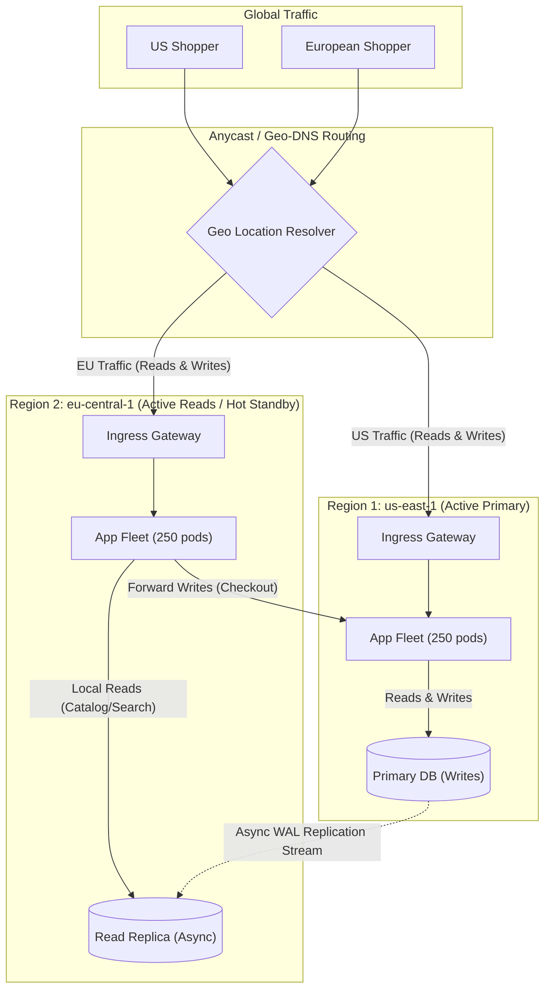
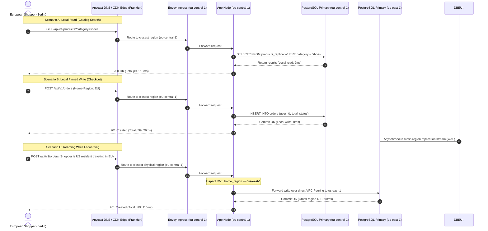

# Day 27 — Multi-Region Systems

> 🔗 **LinkedIn Discussion**: [Read & Discuss on LinkedIn](https://www.linkedin.com/in/himanshu-verma-822a07286/)  
> 🏛️ **System Architecture Milestone**: [`v7-global-architecture`](../../../system-evolution/v7-global-architecture/README.md)  
> 🚀 **Phase**: Phase 6 — Designing for Real Scale (Days 26–29)  
> 🎯 **Today's Focus**: Multi-Region Topology, Active-Active vs. Active-Passive, Cross-Region Replication Lag, Failover Orchestration, and Data Locality

---

## The Problem

Yesterday in [Day 26 — Rate Limiting at Scale](../day-26-rate-limiting-at-scale/README.md), we deployed a distributed sliding window counter across 500 application nodes to protect our backend databases and third-party payment gateways from volumetric floods and rogue scrapers.

At this point in **ShopScale's** evolution, our infrastructure lives entirely within a single cloud region: **AWS `us-east-1` (North Virginia)**, spread across three Availability Zones (`us-east-1a`, `us-east-1b`, and `us-east-1c`).

On paper, this design appears highly resilient:
* Redundant stateless application pods on Kubernetes ([Day 05](../../phase-1-one-server-enough/day-05-load-balancer-changes-everything/README.md)).
* Primary PostgreSQL with local synchronous standby across AZs ([Day 07](../../phase-2-database-becomes-the-problem/day-07-read-replicas/README.md)).
* Distributed Redis caching cluster ([Day 08](../../phase-2-database-becomes-the-problem/day-08-caching-easy-until-not/README.md)).
* Multi-broker Kafka clusters for asynchronous events ([Day 12](../../phase-3-stop-making-everything-synchronous/day-12-introducing-the-queue/README.md)).

Then, two operational realities collide.

### Reality 1: The Speed of Light and International Expansion

ShopScale launches marketing partnerships across Europe and the Asia-Pacific region. Overnight, **45% of our daily active shoppers connect from London, Frankfurt, Paris, Singapore, Tokyo, and Sydney**.

Our monitoring dashboards ([Day 21](../../phase-5-cant-scale-what-you-cant-see/day-21-users-know-before-you/README.md)) light up with severe p99 latency regressions:

```text
               ROUND-TRIP FIBER LATENCY TO US-EAST-1 (NORTH VIRGINIA)
               
  Origin Location         Network RTT (Ping)     Observed API Checkout p99
  ────────────────────────────────────────────────────────────────────────
  New York, USA                  12 ms                    85 ms
  San Francisco, USA             70 ms                   210 ms
  London, UK                     75 ms                   420 ms
  Frankfurt, Germany             90 ms                   480 ms
  Singapore                     220 ms                 1,150 ms
  Sydney, Australia             215 ms                 1,220 ms
```

For a customer in Singapore browsing products, an interactive page load requires multiple sequential API calls (session check, personalized catalog, currency conversion, cart status). Even with TCP connection reuse and TLS 1.3 session resumption, transmitting network packets back and forth across 15,000 kilometers takes **over one full second purely in transit time**.

Cart abandonment among European and Asian shoppers jumps by **32%**. The engineering team cannot optimize this away with database indexing or caching algorithms: **we have collided with the speed of light in optical fiber**.

```text
                  THE SPEED-OF-LIGHT LATENCY FLOOR
                  
   Singapore Shopper                             AWS us-east-1 (N. Virginia)
   ┌───────────────┐                             ┌─────────────────────────┐
   │               │ ── 1. TCP Handshake (220ms) ─────────────────────────►│
   │               │ ◄──────────────────────────────────────────────────── │
   │               │ ── 2. TLS 1.3 Neg.  (220ms) ─────────────────────────►│
   │               │ ◄──────────────────────────────────────────────────── │
   │               │ ── 3. API Request   (220ms) ─────────────────────────►│
   │               │ ◄── 4. API Response (220ms) ───────────────────────── │
   └───────────────┘                             └─────────────────────────┘
   
   Total elapsed before first byte of application JSON: ~880 ms!
```

### Reality 2: The Multi-AZ Illusion and Regional Outages

At 09:14 UTC, a major utility substation fire in Virginia triggers a physical power drop across multiple data centers. Minutes later, the cloud provider's regional internal DNS service and IAM control plane degrade.

Within 120 seconds:
* Cross-AZ replication links drop.
* Kubernetes control planes in `us-east-1` become unresponsive.
* Elastic Load Balancers fail health checks.
* **100% of ShopScale goes offline worldwide.**

Our 3-AZ architecture provided local hardware redundancy, but it shared a common fate: **a single geographical blast radius**. 

European shoppers cannot browse. Asian merchants cannot fulfill orders. North American shoppers cannot check out. 

To survive regional catastrophes and deliver sub-100ms response times to a worldwide audience, **ShopScale must expand beyond a single cloud region**.

---

## Why the Simple Approach Breaks

When engineering teams first transition from a single region to a global footprint, they typically attempt three intuitive shortcuts. Every one of them fails under production traffic.

```text
       Naive Pattern 1                  Naive Pattern 2                  Naive Pattern 3
   "Edge CDN for Everything"      "Remote Compute, Central DB"      "Global Synchronous 2PC"
 ┌──────────────────────────┐     ┌──────────────────────────┐     ┌──────────────────────────┐
 │ Put Cloudflare/CloudFront│     │ Spin up app pods in      │     │ Deploy Multi-Master DB;  │
 │ in front of us-east-1.   │     │ Frankfurt; keep database │     │ require synchronous cross│
 │ Dynamic API routes to US.│     │ primary in us-east-1.    │     │ region quorum on writes. │
 └────────────┬─────────────┘     └────────────┬─────────────┘     └────────────┬─────────────┘
              │                                │                                │
              ▼                                ▼                                ▼
   Static assets are 10ms;          "Chatty DB Antipattern":         Speed of light stalls      
   dynamic checkout/cart API        8 queries * 90ms RTT =           every write; 250ms floor;  
   remains 800ms+ for Asia.         720ms added to every call!       network partitions halt DB.
```

### 1. Putting an Edge CDN in Front of Everything

The first suggestion is invariably: *"Just put an Anycast CDN (Cloudflare, AWS CloudFront, Fastly) in front of our domain."*

**Why it breaks:**
CDNs excel at static asset distribution (images, compiled JavaScript, stylesheets). With edge caching, those static bytes download in under 15ms.

However, e-commerce applications are fundamentally dynamic:
* Personalized cart state
* Real-time inventory verification
* User authorization and payment processing
* Dynamic flash-sale pricing

When an edge CDN processes a dynamic request marked `Cache-Control: private, no-store`, it simply proxies the HTTP payload through its Anycast network back to the origin server in `us-east-1`. 

While Anycast optimizes TCP routing over private fiber backbones (shaving perhaps 15% off transit times), a Singapore customer must still wait for packets to traverse the globe. Dynamic write and read requests remain brutally slow.

### 2. Remote Compute with a Centralized Database (The Chatty DB Antipattern)

The second attempt involves spinning up a Kubernetes compute cluster in Europe (`eu-central-1`, Frankfurt) close to European shoppers, while keeping the primary PostgreSQL database in North Virginia (`us-east-1`).

```text
                         THE CHATTY CROSS-REGION ANTIPATTERN
                         
  Shopper in Berlin               App Pod (Frankfurt)              PostgreSQL Primary (Virginia)
  ┌────────────────┐              ┌─────────────────┐              ┌───────────────────────────┐
  │ POST /checkout │ ── 15ms ────►│                 │              │                           │
  │                │              │ Query 1: User   │ ── 90ms RTT ─► (Fetch user record)       │
  │                │              │ Query 2: Auth   │ ── 90ms RTT ─► (Validate session)        │
  │                │              │ Query 3: Cart   │ ── 90ms RTT ─► (Fetch cart items)        │
  │                │              │ Query 4: Stock  │ ── 90ms RTT ─► (Verify item quantities)  │
  │                │              │ Query 5: Promo  │ ── 90ms RTT ─► (Verify coupon code)      │
  │                │              │ Query 6: Paymnt │ ── 90ms RTT ─► (Record payment audit)    │
  │                │              │ Query 7: Order  │ ── 90ms RTT ─► (Insert order record)     │
  │                │              │ Query 8: Reduce │ ── 90ms RTT ─► (Deduct inventory count)  │
  │                │              │                 │              │                           │
  │ 200 OK         │ ◄── 15ms ─── │ Total Network Wait: 8 * 90ms = 720 ms!                     │
  └────────────────┘              └─────────────────┘              └───────────────────────────┘
```

**Why it breaks:**
A typical monolithic or microservice business transaction is **chatty**. Processing a checkout operation involves multiple database queries, lock acquisitions, and cache checks.

If an application pod in Frankfurt executes 8 sequential database queries to satisfy a single checkout request, each query incurs a cross-Atlantic network round trip of 90ms:

$$\text{Latency} = 15\text{ms (Shopper to App)} + (8 \times 90\text{ms (App to DB)}) = 735\text{ms}$$

By moving the application compute *closer* to the user while leaving the database behind, **we made overall latency significantly worse** than if the browser had called Virginia directly!

> [!IMPORTANT]
> **The Data Proximity Rule**: Compute must live adjacent to the data it reads and writes. Distributing stateless compute without distributing data creates an operational disaster.

### 3. Global Synchronous Multi-Master (Distributed Two-Phase Commit)

The third attempt tries to deploy full-stack replicas (Compute + Database) in both Frankfurt and Virginia, configuring the databases in a synchronous multi-master cluster (using Two-Phase Commit / synchronous Paxos). Any region can accept writes, and both regions immediately agree before confirming success.

**Why it breaks:**
Synchronous distributed transactions across continental distances collide with the laws of physics and the **CAP Theorem**:
1. **Unforgiving Latency Floor**: To guarantee that a row update in Frankfurt is immediately identical in Virginia, the database transaction cannot commit until Frankfurt transmits the write log to Virginia, Virginia flushes it to disk, and Virginia transmits back an acknowledgment. Every single database write now carries a minimum latency floor of $100\text{ms} - 150\text{ms}$.
2. **Network Partitions Freeze Writes**: Undersea cables are cut by maritime anchors with surprising regularity. During an ocean network partition, synchronous consensus fails quorum. The system must choose: either reject all global writes completely (preserving consistency), or allow divergent writes (destroying consistency).

---

## Understanding the Problem

To build a multi-region architecture that actually survives production, an engineer must master three underlying principles: the physics of wide-area networking, replication trade-offs, and failure recovery metrics.

### 1. The Physics of Wide-Area Networking (WAN)

Local Area Networks (LAN) within an Availability Zone offer sub-millisecond latencies ($< 0.5\text{ms}$) with gigabit bandwidth and virtually zero packet loss.

Wide Area Networks (WAN) operating across continents behave entirely differently:
* **Propagation Delay**: Signals travel through fiber at roughly $\frac{2}{3}$ the speed of light in a vacuum ($\approx 200{,}000\text{ km/s}$).
* **Intermediate Hops**: Packets traverse dozens of Autonomous System (AS) routers, BGP peering exchanges, and optical amplifiers.
* **Jitter & Packet Loss**: Public internet backbones experience transient packet loss ($0.1\% - 1\%$), triggering TCP retransmission timeouts that spike p99 tail latencies.

```text
               INTER-REGION LATENCY & BANDWIDTH CHARACTERISTICS
               
  Metric                     Intra-AZ (Same DC)    Cross-AZ (Same Region)    Cross-Region (WAN)
  ─────────────────────────────────────────────────────────────────────────────────────────────
  Latency (RTT)              0.1 ms - 0.4 ms       0.8 ms - 1.5 ms           70 ms - 250 ms
  Bandwidth                  100+ Gbps             25 - 40 Gbps              1 - 10 Gbps
  Packet Loss Rate           < 0.0001%             < 0.001%                  0.05% - 0.5%
  Data Transfer Cost         Free / Negligible     $0.01 / GB                $0.02 - $0.09 / GB
```

### 2. The CAP / PACELC Reality in Multi-Region Systems

In 2000, Eric Brewer introduced the CAP Theorem. In 2012, Daniel Abadi expanded it into the **PACELC Theorem**, which captures distributed systems reality far more accurately:

$$\text{If } \mathbf{P} \text{ (Partition): Choose } \mathbf{A} \text{ (Availability) OR } \mathbf{C} \text{ (Consistency)}$$
$$\mathbf{E} \text{lse (Normal Operation): Choose } \mathbf{L} \text{ (Latency) OR } \mathbf{C} \text{ (Consistency)}$$

Across multiple regions, **partitions are inevitable**. But even when the network is functioning perfectly without partitions, you must choose between:
* **Low Latency ($L$)**: Replicating data asynchronously. Writes return immediately in the local region. Replicas in other regions catch up milliseconds or seconds later.
* **Strict Consistency ($C$)**: Synchronizing writes across regions before acknowledging the client. Writes pay the transatlantic speed-of-light penalty on every single request.

### 3. Understanding Asynchronous Replication Lag

In an asynchronous multi-region topology, when a write occurs in Region 1, it commits to the local Write-Ahead Log (WAL), confirms success to the client, and is shipped over a background stream to Region 2.

```text
                          ASYNCHRONOUS REPLICATION STREAM
                          
      Region 1 (Primary)                                     Region 2 (Replica)
  ┌────────────────────────┐                             ┌────────────────────────┐
  │ Client commits write   │                             │                        │
  │ Transaction committed  │                             │                        │
  │ WAL pointer: LSN 5000  │                             │                        │
  └───────────┬────────────┘                             └───────────┬────────────┘
              │                                                      │
              │ ── 1. Shipped over WAN via replication stream ──────►│
              │                                                      │ 2. WAL applied
              │                                                      │    WAL pointer: LSN 4920
              │                                                      │    
              │◄── Replication Lag ($L_R$) = 80 LSN (e.g., 450ms) ──►│
```

The time delta between when data is committed on the primary and when it becomes readable on the replica is the **Replication Lag ($L_R$)**.

Replication lag is not constant. It swells under high primary write volumes, WAN congestion, or replica CPU exhaustion. This lag introduces the most common distributed bug: **the stale-read inconsistency**.

### 4. Recovery Metrics: RPO and RTO

When a disaster strikes a primary region, two business metrics dictate your architecture:

```text
  Incident Occurs
        │
  ◄─────┴─────────────────────────► Time
  Past                            Future
  
  ├───────────────────┤           ├─────────────────────────┤
  │ Data Lost in WAN  │           │ Time System is Offline  │
  ├───────────────────┤           ├─────────────────────────┤
   ◄─── RPO Window ──►             ◄────── RTO Window ─────►
   (Recovery Point                 (Recovery Time
    Objective)                      Objective)
```

* **RPO (Recovery Point Objective)**: *How much data can the business afford to lose?*  
  If the primary region explodes and you fail over to a replica that is 500ms behind, the writes from that 500ms window are gone. If your RPO is 0, you must use synchronous replication (and accept high write latency). If your RPO is 5 seconds, asynchronous replication is acceptable.
* **RTO (Recovery Time Objective)**: *How long can the system remain completely offline during a regional failure?*  
  If failover requires manual DNS updates, database cluster reconfiguration, and health validation taking 45 minutes, your RTO is 45 minutes. If an automated system redirects traffic within 30 seconds, your RTO is 30 seconds.

---

## Possible Approaches

Four standard architectural patterns exist for multi-region systems. They sit on an evolutionary ladder ranging from simple disaster recovery to complex distributed multi-master platforms.

```text
 ┌──────────────────────────────────────────────────────────────────────────┐
 │                     THE MULTI-REGION TOPOLOGY SPECTRUM                   │
 │                                                                          │
 │   Simple / Low Cost                              Complex / High Cost     │
 │   ─────────────────                              ───────────────────     │
 │   Pattern 1: Active-Passive   Pattern 2: Active-  Pattern 3: Partitioned  │
 │   Cold/Warm Standby           Passive Hot Standby Active-Active (Cells)  │
 │   (Low cost, RTO: 30m)        (Fast RTO: 60s)     (Sub-50ms global p99)  │
 └──────────────────────────────────────────────────────────────────────────┘
```

---

### Approach 1: Active-Passive (Warm Standby / Disaster Recovery)

In this model, **Region 1 (`us-east-1`) is the Active region** handling 100% of global reads and writes. **Region 2 (`eu-central-1`) is the Passive region**. 

The passive region maintains a minimal footprint: core VPC networking, a database read replica receiving asynchronous WAL logs, and an idle or minimally-scaled Kubernetes cluster.

```text
                                ACTIVE-PASSIVE TOPOLOGY
                                
         [ Global Users (US, Europe, Asia) ]
                         │
                         ▼
             [ Route 53 / Geo-DNS ]
             (100% of traffic routed to us-east-1)
                         │
        ┌────────────────┴────────────────┐
        ▼                                 ▼ (Standby - Zero Traffic)
  [ Region 1: us-east-1 (ACTIVE) ]   [ Region 2: eu-central-1 (PASSIVE) ]
  ┌──────────────────────────────┐   ┌──────────────────────────────┐
  │ Ingress ALB + Envoy Fleet    │   │ Ingress ALB (Idle)           │
  │ 500 App Pods (Kubernetes)    │   │ 10 App Pods (Min scaled)     │
  │ Redis Master/Replicas        │   │ Redis (Cold / Empty)         │
  │ PostgreSQL Primary ──────────┼───┼──► PostgreSQL Read Replica   │
  └──────────────────────────────┘   └──────────────────────────────┘
              (Asynchronous Cross-Region Storage Replication)
```

#### How it works:
* Under normal operations, all international traffic routes across the internet or CDN to `us-east-1`.
* When `us-east-1` experiences a catastrophic regional failure:
  1. Automated monitors or engineers declare a disaster.
  2. The PostgreSQL read replica in `eu-central-1` is promoted to standalone primary.
  3. The Kubernetes cluster in `eu-central-1` scales up from 10 to 500 pods.
  4. Global DNS records (Route 53) are updated to point to `eu-central-1`.

#### Where it helps:
* **Zero Distributed Write Conflicts**: Only one primary database exists. No multi-master race conditions or merge conflicts.
* **Low Infrastructure Cost**: The passive region compute can remain scaled down to near-zero until an actual emergency occurs.

#### Limitations:
* **Does not solve latency**: International shoppers in Europe and Asia still endure high latency during normal operations.
* **High RTO (15–45 minutes)**: Scaling a Kubernetes cluster from 10 to 500 nodes and warming empty caches takes substantial time.
* **Cold System Risk**: A passive region that never handles production traffic rarely works cleanly when suddenly activated during an emergency (untested configurations, capacity quota limits).

#### When it makes sense:
Enterprise B2B applications, internal administrative backends, and early-stage platforms where business agreements permit an RTO of 30–60 minutes and low infrastructure cost is paramount.

---

### Approach 2: Active-Passive with Local Read Replicas (Hot Standby)

In this evolution, Region 1 (`us-east-1`) remains the sole **write primary**, but Region 2 (`eu-central-1`) is fully provisioned with a warm compute fleet and serves **local read traffic** via a cross-region database read replica.



#### How it works:
* European users route to their nearest regional ingress (`eu-central-1`).
* **Reads** (browsing product listings, viewing reviews, searching categories) execute locally against the `eu-central-1` read replica in **under 20ms**.
* **Writes** (adding to cart, checkout, updating profile) are forwarded by the European application servers over a dedicated cross-region VPC peering link to the primary in `us-east-1`.

#### Where it helps:
* **Massive Read Latency Drop**: Because read-to-write ratios in e-commerce exceed 10:1 or 20:1, over 90% of user interactions become instantaneous.
* **Fast RTO (< 2 minutes)**: The compute fleet in Region 2 is already warm and processing production traffic. If Region 1 collapses, promoting the database replica to primary takes seconds.

#### Limitations:
* **The "Read-Your-Own-Writes" Consistency Hazard**: If an EU user modifies their shipping address (forwarded to Virginia) and immediately reloads their profile page (read from Frankfurt), they will see their *old* address if the replication stream is 300ms behind.
* **Write Latency Unchanged**: Checkout transactions still pay the cross-ocean latency tax.

#### When it makes sense:
Content-heavy platforms, media streaming, e-commerce catalog browsing, and news organizations where consumption heavily dominates mutation.

---

### Approach 3: Partitioned Active-Active (Data Locality / Region Sharding)

Instead of one global primary, we partition users, merchants, and transactions by **geographic affinity**. 

* Region 1 (`us-east-1`) is the authoritative primary for all **Americas** customers and data.
* Region 2 (`eu-central-1`) is the authoritative primary for all **European** customers and data.
* Each region runs an independent, fully active stack that handles both reads and writes locally.

```text
                         PARTITIONED ACTIVE-ACTIVE (CELLS)
                         
      Americas Customers                              European Customers
              │                                               │
              ▼                                               ▼
    [ Region 1: us-east-1 ]                         [ Region 2: eu-central-1 ]
  ┌─────────────────────────────┐                 ┌─────────────────────────────┐
  │ Local Ingress & Compute     │                 │ Local Ingress & Compute     │
  │                             │                 │                             │
  │ Primary DB: Americas Users  │                 │ Primary DB: European Users  │
  │  - US Orders & Carts        │                 │  - EU Orders & Carts        │
  │                             │                 │                             │
  │ Read Replica: European Data │◄── Async WAL ──►│ Read Replica: Americas Data │
  │                             │     Streams     │                             │
  └─────────────────────────────┘                 └─────────────────────────────┘
```

#### How it works:
* A user's account is pinned to a specific **Home Region** upon registration (stored in their authentication JWT and DNS routing tables).
* When an EU user checks out, the write commits directly to the `eu-central-1` database in **10ms**.
* Data that must be visible globally (such as the global product catalog) is authored in one region and replicated asynchronously to all other regions as read-only.
* Data subject to data residency laws (like GDPR) is guaranteed to reside on European disks.

#### Where it helps:
* **True Sub-50ms Global Write Latency**: Both reads and writes are served within the shopper's home continent.
* **Zero Write Conflict Overhead**: Because each record has a strictly designated "home" region, two regions never accept conflicting writes for the same customer record simultaneously.
* **Regulatory Compliance**: Satisfies data sovereignty frameworks (GDPR, CCPA) natively.

#### Limitations:
* **The Roaming User Complexity**: When a German customer travels to New York, the New York edge proxy must recognize their home region (`eu-central-1`) and route their checkout write back to Frankfurt.
* **Cross-Partition Operations**: Global inventory counters become complex. If a limited-edition sneaker has 100 units in stock globally, how do you prevent US and EU shoppers from overselling it? (Requires inventory pre-allocation across regions).

#### When it makes sense:
Modern global SaaS applications, banking, e-commerce marketplaces, and large-scale consumer platforms operating across distinct continental markets.

---

### Approach 4: True Multi-Master Active-Active (Distributed SQL / CRDTs)

Any application server in any region can write to any record at any time. The underlying data layer automatically resolves concurrency using **Distributed SQL** (Google Spanner, CockroachDB, YugabyteDB) or **Conflict-Free Replicated Data Types (CRDTs)** with Last-Write-Wins (LWW).

```text
                     TRUE ACTIVE-ACTIVE MULTI-MASTER
                     
    US Shopper: Update Cart                        EU Shopper: Update Cart
              │                                              │
              ▼                                              ▼
    [ App Node: us-east-1 ]                       [ App Node: eu-central-1 ]
              │                                              │
              ▼                                              ▼
    [ CockroachDB Node 1 ] ◄──── Raft Quorum / ────► [ CockroachDB Node 2 ]
    Writes locally               Consensus Latency   Writes locally
    Commit requires cross-region consensus or automated conflict merge
```

#### How it works:
* Tables are split into dynamic ranges sharded across all global nodes.
* Writes to single-row entities use consensus protocols (Raft/Paxos) across regions, or utilize hardware atomic clocks (Google Spanner TrueTime) to achieve strict serializability.
* For multi-leader asynchronous stores (like DynamoDB Global Tables or Cassandra), conflicting concurrent writes are merged using deterministic mathematical rules (e.g., highest client timestamp wins).

#### Where it helps:
* Completely transparent operational topology: application code writes to "the database" without tracking which region is the primary.
* Highest theoretical availability: any surviving node in any region can take over.

#### Limitations:
* **Latency Penalties or Data Loss**: If the database provides strict serializability (CockroachDB/Spanner), writes across regions require network round trips for consensus ($> 150\text{ms}$). If it uses asynchronous multi-master (DynamoDB Global Tables), conflicting writes overwrite each other silently (**lost updates**).
* **Extreme Operational Complexity**: Debugging distributed deadlocks, Raft lease rebalancing, and clock synchronization across cloud providers requires deep specialized expertise.

#### When it makes sense:
Global financial ledgers with immense budgets (Spanner), or low-contention collaborative systems with append-only write patterns (chat messages, telemetry streams).

---

## Trade-offs

Choosing a multi-region architecture is not an exercise in finding the "best" pattern. It is an exercise in choosing which failure modes, latency constraints, and operational expenses your organization can tolerate.

| Dimension | Pattern 1: Active-Passive (Warm Standby) | Pattern 2: Active-Passive (Local Reads) | Pattern 3: Partitioned Active-Active (Locality) | Pattern 4: True Multi-Master (Distributed SQL) |
|---|---|---|---|---|
| **Write Latency (Global)** | High ($150\text{ms} - 300\text{ms}$) for remote users | High ($150\text{ms} - 300\text{ms}$) for remote users | **Ultra-Low ($10\text{ms} - 25\text{ms}$)** in home region | High ($150\text{ms}+$) or Unsafe (LWW overwrites) |
| **Read Latency (Global)** | High for remote users | **Ultra-Low ($5\text{ms} - 15\text{ms}$)** | **Ultra-Low ($5\text{ms} - 15\text{ms}$)** | **Ultra-Low ($5\text{ms} - 15\text{ms}$)** |
| **Recovery Point Objective (RPO)** | $10\text{s} - 60\text{s}$ (Async replication window) | $1\text{s} - 5\text{s}$ | **0 for un-partitioned data** ($< 1\text{s}$ async mirror) | **0** (Raft consensus quorum) |
| **Recovery Time Objective (RTO)** | $15 - 45\text{ minutes}$ | **$< 2\text{ minutes}$** | **$< 30\text{ seconds}$** (Local traffic continues) | **Near 0** (Automatic node failover) |
| **Write Conflict Risk** | **Zero** (Single primary) | **Zero** (Single primary) | **Zero** (Partitioned ownership) | **High** (Concurrent updates require merge logic) |
| **Infrastructure Cost** | $+20\% - 30\%$ | $+80\% - 100\%$ | $+100\% - 140\%$ | $+150\% - 250\%$ |
| **Engineering Complexity** | Low (Basic DNS & DR scripts) | Medium (Read routing & read-your-writes handling) | High (Data partitioning, home-region routing) | Extreme (Distributed consensus, clock drift) |

### The Core Architectural Tension: The Cost Multiplier

Every region you add does not simply add linear server costs. It introduces **cross-region data transfer fees**:
* Cloud providers charge between **$0.02 and $0.09 per Gigabyte** transferred across regions over the WAN.
* Replicating high-throughput PostgreSQL WAL records, Redis cache invalidations, and Kafka event topics across the Atlantic consumes substantial continuous bandwidth.
* Running idle standby capacity in secondary regions represents a continuous operational cash burn ([Day 28](../day-28-scaling-cost-economics/README.md)).

---

## A Practical Example

Let us examine how **ShopScale** implements **Pattern 3: Partitioned Active-Active with Cross-Region Read Forwarding and Fast Failover**.



### 1. Home-Region Routing & Write Forwarding Middleware

Our application nodes use an intelligent middleware layer. It inspects incoming requests, determines data locality, and routes queries either locally or over an internal cross-region proxy link:

```python
# ==============================================================================
# ShopScale Multi-Region Routing Middleware
# Identifies user home region from JWT or routing header and enforces locality.
# ==============================================================================

import os
import httpx
from fastapi import FastAPI, Request, Response, status
from starlette.middleware.base import BaseHTTPMiddleware

CURRENT_REGION = os.getenv("CURRENT_REGION", "eu-central-1")
PRIMARY_REGION_URLS = {
    "us-east-1": "https://internal-gw.us-east-1.shopscale.internal",
    "eu-central-1": "https://internal-gw.eu-central-1.shopscale.internal",
}

class MultiRegionRoutingMiddleware(BaseHTTPMiddleware):
    def __init__(self, app: FastAPI):
        super().__init__(app)
        # Dedicated HTTP/2 client for cross-region connection pooling
        self.cross_region_client = httpx.AsyncClient(
            timeout=3.0,
            limits=httpx.Limits(max_keepalive_connections=50, max_connections=200)
        )

    async def dispatch(self, request: Request, call_next):
        # Extract user home region from auth token claim (injected by API Gateway)
        user_home_region = request.headers.get("X-User-Home-Region", CURRENT_REGION)
        method = request.method

        # SAFE METHODS (GET, HEAD, OPTIONS) -> ALWAYS SERVE LOCALLY
        if method in ("GET", "HEAD", "OPTIONS"):
            response = await call_next(request)
            response.headers["X-Served-By-Region"] = CURRENT_REGION
            return response

        # MUTATING METHODS (POST, PUT, DELETE, PATCH)
        # If write belongs to current region, execute locally
        if user_home_region == CURRENT_REGION:
            response = await call_next(request)
            response.headers["X-Served-By-Region"] = CURRENT_REGION
            return response

        # ROAMING USER DETECTED: Forward write to user's authoritative home region
        # Prevents multi-master concurrent write conflicts
        home_region_url = PRIMARY_REGION_URLS.get(user_home_region)
        if not home_region_url:
            # Fallback to local execution if home region unknown
            return await call_next(request)

        # Proxy the mutating request over private cross-region VPC peering
        body = await request.body()
        headers = dict(request.headers)
        headers["X-Forwarded-From-Region"] = CURRENT_REGION

        proxy_url = f"{home_region_url}{request.url.path}"
        if request.url.query:
            proxy_url += f"?{request.url.query}"

        try:
            proxy_response = await self.cross_region_client.request(
                method=request.method,
                url=proxy_url,
                headers=headers,
                content=body,
            )
            return Response(
                content=proxy_response.content,
                status_code=proxy_response.status_code,
                headers=dict(proxy_response.headers),
            )
        except httpx.RequestError as exc:
            # If cross-region transit fails, return explicit retryable error
            return Response(
                content=f'{{"error": "Cross-region gateway timeout", "detail": "{str(exc)}"}}',
                status_code=status.HTTP_504_GATEWAY_TIMEOUT,
                media_type="application/json",
            )
```

### 2. Solving "Read-Your-Own-Writes" via Causality Tokens

When a user writes to their primary database and subsequently issues a read request, that read might land on a read replica that has not yet caught up with the replication stream.

To solve this, we implement **Causality Tokens (Replication Checkpoints)**:

```python
# ==============================================================================
# Causality Token Generator and Database Read Selector
# ==============================================================================

import time
from fastapi import Request, Response
from sqlalchemy import text

def record_write_checkpoint(response: Response, db_connection) -> str:
    """
    After a successful database write, extract the Postgres Log Sequence Number (LSN).
    Inject this LSN into an HTTP response cookie (Causality Token).
    """
    # Fetch current Write-Ahead Log position from Postgres
    with db_connection.cursor() as cur:
        cur.execute("SELECT pg_current_wal_lsn();")
        current_lsn = cur.fetchone()[0]  # e.g., "16/B374D848"

    # Set cookie with 5-second lifetime (covers standard replication lag)
    response.set_cookie(
        key="x-shopscale-min-lsn",
        value=str(current_lsn),
        max_age=5,
        httponly=True,
        samesite="lax",
    )
    return str(current_lsn)


def select_database_engine(request: Request, read_replica_engine, primary_engine):
    """
    Determines whether a read operation can safely hit the local read replica
    or must be routed directly to the primary to prevent stale reads.
    """
    required_min_lsn = request.cookies.get("x-shopscale-min-lsn")
    
    # If no recent write occurred, local replica is safe
    if not required_min_lsn:
        return read_replica_engine

    # Check the current replay LSN of the local read replica
    with read_replica_engine.connect() as conn:
        result = conn.execute(text("SELECT pg_last_wal_replay_lsn();"))
        replica_replay_lsn = result.scalar()

        # If replica is uninitialized or not in recovery, fallback safely to primary
        if not replica_replay_lsn:
            return primary_engine

        # If replica has caught up beyond the user's write position, use replica.
        # pg_wal_lsn_diff(lsn1, lsn2) calculates (lsn1 - lsn2) in bytes.
        diff_query = conn.execute(
            text("SELECT pg_wal_lsn_diff(:req, :rep);"),
            {"req": required_min_lsn, "rep": replica_replay_lsn}
        )
        bytes_behind = diff_query.scalar()

        if bytes_behind is not None and bytes_behind <= 0:
            # Replica has already applied the write! Safe to read locally.
            return read_replica_engine
        else:
            # Replica is lagging behind this user's write!
            # Route this specific read to primary to guarantee read-your-own-writes.
            return primary_engine
```

---

## Failure Scenarios

Operating across multiple regions introduces complex distributed failure modes. If you have not engineered specifically for these edge cases, your multi-region architecture will create larger outages than the single-region design it replaced.

```text
 ┌───────────────────────────┐      ┌───────────────────────────┐
 │   1. Split-Brain Havoc    │      │ 2. The 30-Minute DNS Trap │
 │   Both regions think the  │      │ Client resolvers ignore   │
 │   other is dead; both     │      │ 10s TTL; traffic stays    │
 │   accept divergent writes.│      │ glued to the dead region. │
 └───────────────────────────┘      └───────────────────────────┘
               ▲                                  ▲
               │       MULTI-REGION DISASTERS     │
               ▼                                  ▼
 ┌───────────────────────────┐      ┌───────────────────────────┐
 │ 3. Global Capacity Crunch │      │  4. The Replication Chasm │
 │ Failing 60% of traffic to │      │ WAN congestion balloons   │
 │ Region 2 immediately      │      │ lag to 45 minutes;        │
 │ overwhelms its database.  │      │ failover causes data loss.│
 └───────────────────────────┘      └───────────────────────────┘
```

### 1. The Split-Brain Catastrophe

The most destructive disaster in distributed systems is **Split-Brain**.

Suppose Region 1 (`us-east-1`) and Region 2 (`eu-central-1`) are connected via transatlantic links. An undersea cable disruption severs communication between the regions, while the public internet connection to each region remains operational.

```text
                              THE SPLIT-BRAIN PARTITION
                              
     Americas Users                                    European Users
           │                                                 │
           ▼                                                 ▼
  [ Region 1: us-east-1 ]                           [ Region 2: eu-central-1 ]
  ┌───────────────────────┐                         ┌───────────────────────┐
  │ Primary DB (Active)   │                         │ Read Replica          │
  │ Heartbeat check fails ├── 💥 UNDERSEA LINK CUT ─┤ Heartbeat check fails │
  │ "Europe must be dead" │                         │ "US must be dead!"    │
  │                       │                         │ PROMOTES REPLICA TO   │
  │ Continues writes!     │                         │ PRIMARY DATABASE!     │
  └───────────────────────┘                         └───────────────────────┘
           │                                                 │
           ▼                                                 ▼
    User A buys Item #999                             User B buys Item #999
    (Balance: $100 -> $50)                            (Balance: $100 -> $50)
```

If Region 2 relies on a simple peer-to-peer heartbeat, it observes that Region 1 is unreachable. Region 2 concludes: *"Region 1 has collapsed. I must promote my local database replica to primary to maintain availability."*

Now, **both regions act as write primaries simultaneously**.
* In Virginia, User A purchases the last remaining laptop in stock.
* In Frankfurt, User B purchases the exact same laptop.
* Account balances, inventory records, and order sequences diverge.

Six hours later, the transatlantic link recovers. The database engines cannot merge the two diverged histories without manual database reconciliation, transaction cancellations, and financial losses.

#### How to Prevent It: Quorum Fencing and Witness Nodes
Never allow a two-party system to make an autonomous failover decision. 
* Introduce a lightweight **Witness Node** in an independent third region (e.g., `us-west-2` or `eu-west-1`).
* Promotion to primary requires an absolute majority quorum ($2 \text{ out of } 3$ votes):

$$\text{Quorum} = \left\lfloor \frac{N}{2} \right\rfloor + 1 = \left\lfloor \frac{3}{2} \right\rfloor + 1 = 2 \text{ votes}$$

If Region 2 loses connectivity to Region 1, it contacts the Witness in Region 3. If the Witness can still talk to Region 1, the Witness denies Region 2's promotion request: *"Region 1 is alive. You are partitioned. Do not promote."*

```text
                          THREE-REGION QUORUM ARBITRATION
                          
                      [ Region 3: us-west-2 ]
                      (Lightweight Witness Node)
                            ▲         ▲
                     Vote: NO         │ Vote: YES
                     (US alive)       │
                        │             │
        ┌───────────────┴─────────────┴──────────────┐
        │                                            │
  [ Region 1: us-east-1 ]                    [ Region 2: eu-central-1 ]
  Authoritative Primary                      Isolated by Undersea Cut
  (Active)                                   Quorum Denied (1/3 votes)
                                             Remains READ-ONLY!
```

---

### 2. The DNS TTL Caching Trap

During a regional outage in Region 1, our automated failover orchestrator updates Route 53 or Cloudflare DNS records, pointing `api.shopscale.com` away from Region 1 and toward Region 2. 

The DNS records have a configured Time-To-Live (TTL) of **10 seconds**. The engineering team expects all global traffic to migrate within 10 seconds.

**What happens in production:**
* Major corporate internet service providers (ISPs), mobile carrier gateways, and recursive DNS resolvers around the world aggressively ignore low TTLs to reduce upstream DNS bandwidth.
* Many resolvers enforce a hard minimum cache floor of **15 to 30 minutes**.
* Mobile operating systems and Java virtual machines (JVMs) cache DNS responses indefinitely by default unless `networkaddress.cache.ttl` is explicitly configured.

**Result**: 30 minutes after declaring failover, **35% of global requests still attempt to connect to the dead IP addresses in Region 1**, receiving connection timeouts.

#### How to Prevent It: Anycast BGP Routing
Instead of relying on DNS to shift traffic during an emergency, front your global infrastructure with **Anycast IP Addresses** (via AWS Global Accelerator, Cloudflare, or Google Cloud External HTTP Load Balancing):
* A single static IP address (e.g., `198.51.100.1`) is advertised from hundreds of BGP edge locations worldwide.
* When Region 1 fails, the cloud provider's internal routing mesh redirects traffic arriving at edge points of presence across private fiber to Region 2 **within 5 to 10 seconds**, bypassing local ISP DNS caching entirely.

---

### 3. The Capacity Collapse (The Thundering Failover)

Under normal operating conditions:
* Region 1 (`us-east-1`) processes **60,000 requests/sec** (Americas peak).
* Region 2 (`eu-central-1`) processes **25,000 requests/sec** (Europe normal).
* Region 2's compute and database infrastructure is sized to handle up to 40,000 requests/sec.

When Region 1 suffers an outage and automated failover redirects all Americas traffic to Region 2, Region 2 is instantly hit with **85,000 requests/sec**.

```text
                        THE THUNDERING FAILOVER CRASH
                        
        Normal Day                                 Failover Event
  ┌─────────────────────┐                    ┌─────────────────────┐
  │ Region 1: us-east-1 │                    │ Region 1: us-east-1 │
  │ 60,000 req/sec      │                    │ 💥 OUTAGE           │
  └─────────────────────┘                    └──────────┬──────────┘
             │                                          │ 100% Traffic Diverted
             ▼                                          ▼
  ┌─────────────────────┐                    ┌─────────────────────┐
  │ Region 2: eu-cntr-1 │                    │ Region 2: eu-cntr-1 │
  │ 25,000 req/sec      │                    │ 85,000 req/sec!     │
  │ (Capacity: 40k RPS) │                    │ 💥 DB POOL DROWNED  │
  └─────────────────────┘                    └─────────────────────┘
```

Within 45 seconds:
1. Region 2's PostgreSQL database connection pool saturates ([Day 06](../../phase-2-database-becomes-the-problem/day-06-app-scales-db-doesnt/README.md)).
2. App pod CPU hits 100%, causing health checks to fail.
3. Region 2 experiences a cascading collapse ([Day 18](../../phase-4-now-the-system-is-distributed/day-18-cascading-failures/README.md)).

The failover succeeded only in **moving the outage from one region to another**, knocking out the entire global business.

#### How to Prevent It: Headroom Sizing and Priority Load Shedding
1. **Maintain Overhead**: Secondary regions must be provisioned with sufficient headroom (or rapid autoscaling pre-warming) to absorb expected failover volume.
2. **Aggressive Load Shedding**: If incoming volume exceeds safe operating capacity during a disaster, the ingress gateway must immediately shed non-critical traffic (recommendations, marketing trackers, search autocomplete) via `429` / `503` responses to protect core checkout and payment pipelines ([Day 15](../../phase-3-stop-making-everything-synchronous/day-15-surviving-traffic-spikes/README.md)).

---

### 4. The Replication Lag Chasm

Under heavy flash-sale promotions, write throughput on the primary database in Virginia surges to 15,000 transactions/sec. 

The cross-region network link experiences temporary packet congestion, causing the replication lag to the Frankfurt replica to balloon from **200 milliseconds to 45 seconds**.

At that precise moment, a catastrophic hardware failure kills the Virginia primary database.

The disaster recovery automation detects the failure and promotes the Frankfurt replica to primary. 

**The Consequence**:
Because the replica was 45 seconds behind the primary, **the last 45 seconds of committed customer transactions never reached Frankfurt**.
* 600 completed checkouts disappear from the database.
* Inventory deducted during those 45 seconds is reverted.
* Customers whose credit cards were charged receive no order confirmation and find empty account histories.

#### How to Handle It:
You must establish an explicit organizational agreement on your **Recovery Point Objective (RPO)**:
* If business requirements dictate **Zero Data Loss (RPO = 0)**, you cannot use asynchronous replication. You must use synchronous replication or multi-region Distributed SQL (and pay the continuous write latency tax).
* If using asynchronous replication, the failover orchestrator must evaluate the replica's lag before initiating promotion. If lag exceeds an acceptable threshold (e.g., $> 10\text{ seconds}$), promotion should pause for manual executive sign-off rather than blindly discarding transactions.

---

## Key Engineering Decisions

When designing or evolving a system toward a multi-region topology, systematically work through these five architectural decisions:

```text
 1. DETERMINE YOUR TRUE RPO AND RTO CONSTRAINTS
    ├── Can the business tolerate 15 minutes of downtime during a once-a-year regional disaster?
    │   └── YES: Active-Passive Warm Standby. Do not over-engineer active-active.
    └── NO: Active-Passive Hot Standby or Partitioned Active-Active required.

 2. MAP DATA OWNERSHIP AND LOCALITY BOUNDARIES
    ├── Can data be strictly partitioned by user, tenant, or geography?
    │   ├── YES: Partitioned Active-Active (Home Region). Zero write conflict overhead.
    │   └── NO (e.g., shared global inventory): Choose between centralized writes or 
    │            pre-allocated regional inventory pools.

 3. SELECT YOUR TRAFFIC ROUTING TIER
    ├── DNS-Based Routing (Geo-DNS / Latency Routing): Simple, low cost, but subject to ISP TTL caching.
    └── Anycast BGP Routing (AWS Global Accelerator / Cloudflare): Fast failover (< 10s), bypasses DNS caching.

 4. DEFINE READ-YOUR-OWN-WRITES GUARANTEES
    ├── Implement Causality Tokens (LSN checkpoints via cookies).
    └── Route lagging reads to primary when the local replica has not applied recent mutations.

 5. SAFEGUARD AGAINST SPLIT-BRAIN DISASTERS
    ├── Require a third-region Witness Node for consensus quorum.
    └── Never allow an isolated replica to autonomously promote itself without an odd-numbered majority vote.
```

---

## Key Takeaways

* **Multi-AZ protects against hardware failures; Multi-Region protects against geographical and control-plane disasters.** Do not confuse intra-region Availability Zones with true geographic separation.
* **The speed of light in fiber dictates a physical latency floor.** Transmitting network packets across continents requires tens to hundreds of milliseconds. No amount of application tuning or caching can overcome wide-area network propagation delay.
* **Compute must live adjacent to data.** Deploying stateless application servers in Europe while keeping the database in North America creates the "Chatty DB Antipattern," drastically worsening user latency.
* **Partitioned Active-Active beats True Multi-Master for most global systems.** Pinning users and their data mutations to an authoritative "Home Region" delivers sub-50ms local reads and writes without the crushing latency or conflict complexity of global distributed locking.
* **Split-brain is the most catastrophic multi-region failure mode.** Never permit automated failover in a two-region system without a third-region witness node to guarantee an odd-numbered quorum.
* **Anycast BGP routing circumvents DNS caching traps.** ISP resolvers routinely ignore 10-second DNS TTLs; Anycast migrates traffic at the network routing layer within seconds during a regional collapse.
* **Asynchronous cross-region replication always carries an RPO trade-off.** Failing over to an asynchronous replica guarantees that transactions committed within the replication lag window are lost. Match your data tier to your business RPO.

---

> ➡️ **Next Up**: [Day 28 — How Much Does Scaling Actually Cost? Cloud Unit Economics, Bandwidth Egress, and Fleet Sizing](../day-28-scaling-cost-economics/README.md)
