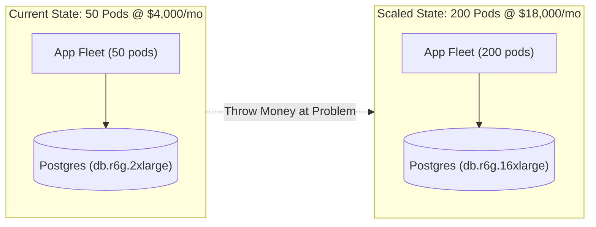
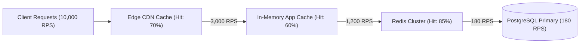
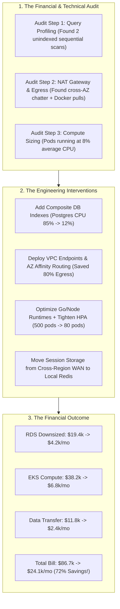

# Day 28 — How Much Does Scaling Actually Cost?

> 🔗 **LinkedIn Discussion**: [Read & Discuss on LinkedIn](https://www.linkedin.com/in/himanshu-verma-822a07286/)  
> 🏛️ **System Architecture Milestone**: [`v7-global-architecture`](../../../system-evolution/v7-global-architecture/README.md)  
> 🚀 **Phase**: Phase 6 — Designing for Real Scale (Days 26–29)  
> 🎯 **Today's Focus**: Cloud Unit Economics, Infrastructure Sizing vs. Code Optimization, Caching Cost-per-Byte, SLA Loosening, and the Financial Reality of High Availability

---

## The Problem

Yesterday in [Day 27 — Multi-Region Systems](../day-27-multi-region-architecture/README.md), we expanded **ShopScale** into a multi-region powerhouse across North Virginia (`us-east-1`) and Frankfurt (`eu-central-1`). We implemented active-active cell routing, cross-region read forwarding, and sub-30-second disaster recovery failovers.

Technically, the system is a triumph. Global p99 latency dropped below 40ms, and availability hit 99.99%.

Then, the monthly cloud bill lands on the engineering director's desk:

```text
================================================================================
                    SHOPSCALELABS INC. — AWS MONTHLY INVOICE
================================================================================
Billing Period: Current Month                       Previous Month: $18,420.00
Account ID: 8492-3819-0192                          Current Total:  $86,740.00 (+370%)
────────────────────────────────────────────────────────────────────────────────
Service Category                                    Monthly Cost    % of Total
────────────────────────────────────────────────────────────────────────────────
1. Amazon EC2 / EKS (500 Compute Pods across 2 regions) $38,200.00      44.0%
2. Amazon RDS PostgreSQL (db.r6g.8xlarge Primary + Replicas) $19,450.00  22.4%
3. Amazon ElastiCache Redis Cluster (r6g.4xlarge x 6 nodes)  $8,640.00   10.0%
4. Data Transfer (Cross-AZ + Cross-Region WAN Egress)       $11,850.00   13.7%
5. AWS NAT Gateways (4 AZs across 2 regions + Data Proc)     $4,920.00    5.7%
6. CloudWatch Logs, OpenTelemetry & APM Ingestion            $3,680.00    4.2%
────────────────────────────────────────────────────────────────────────────────
TOTAL MONTHLY INFRASTRUCTURE RUN RATE:                      $86,740.00
================================================================================
```

During this same period, ShopScale's business metrics grew by **35%**:
* Daily Active Users (DAU) went from 200,000 to 270,000.
* Orders processed per day went from 50,000 to 67,500.
* Gross Revenue increased by 32%.

Here is the crisis: **Traffic grew by 35%, but infrastructure expenses exploded by 370%.**

```text
               THE COST DIVERGENCE DILEMMA
               
  Cost / Traffic ($)
       │                                         Infrastructure Cost
       │                                         (+$86.7k/mo — 370% surge)
       │                                        /
       │                                      /
       │                                    /
       │                                  /
       │                                /
       │                              /   Revenue / Traffic Growth
       │                            /     (+35% increase)
       │                          /───────────────────────────
       │                        /
       │                      /
       │                    /
       │──────────────────/
       └─────────────────────────────────────────────────────► Time
```

At this trajectory, every new customer acquired makes the company **less profitable**. 

The engineering team's default reflex throughout the previous 27 days was:
* Database CPU at 75%? **Double the instance size ([Day 06](../../phase-2-database-becomes-the-problem/day-06-app-scales-db-doesnt/README.md)).**
* Read latency high? **Spin up 3 more read replicas ([Day 07](../../phase-2-database-becomes-the-problem/day-07-read-replicas/README.md)).**
* App nodes struggling? **Raise Kubernetes HPA max replica limit to 500 ([Day 05](../../phase-1-one-server-enough/day-05-load-balancer-changes-everything/README.md)).**
* European users want speed? **Duplicate the entire stack across the Atlantic ([Day 27](../day-27-multi-region-architecture/README.md)).**

Throwing cloud infrastructure at software bottlenecks worked when ShopScale was small. At scale, **brute-force infrastructure scaling becomes a financial death spiral**.

---

## Why the Simple Approach Breaks

The obvious reaction to a surging cloud bill is to ask DevOps to *"apply cost cuts"*:
1. Buy 3-year Reserved Instances (RIs) or Savings Plans.
2. Turn on Spot Instances for application pods.
3. Turn off staging environments on weekends.

While these steps trim 10–20% off the edges, **they do not fix structural architectural inefficiency**.

```text
     Naive Cost-Cutting                     Structural Architectural Reality
  ┌───────────────────────┐              ┌─────────────────────────────────────┐
  │ "Buy Reserved         │              │ 45% of DB CPU is consumed by 2      │
  │  Instances for DB"    │ ───────────► │ unindexed queries scanning 80M rows │
  │ (Saves $3,000/mo)     │              │ on every catalog page load.         │
  └───────────────────────┘              └─────────────────────────────────────┘
  ┌───────────────────────┐              ┌─────────────────────────────────────┐
  │ "Enable Spot          │              │ App pods run bloated JSON runtimes; │
  │  Instances on EKS"    │ ───────────► │ each pod handles only 40 RPS before │
  │ (Saves $4,500/mo)     │              │ saturating memory.                  │
  └───────────────────────┘              └─────────────────────────────────────┘
  ┌───────────────────────┐              ┌─────────────────────────────────────┐
  │ "Reduce Log           │              │ Multi-region replication streams    │
  │  Retention to 7 Days" │ ───────────► │ 400 GB/day of ephemeral session data│
  │ (Saves $800/mo)       │              │ across the Atlantic unnecessarily.  │
  └───────────────────────┘              └─────────────────────────────────────┘
```

### Why Naive Infrastructure Scaling Hits a Wall:

1. **The Law of Diminishing Returns (Hardware vs. Software Bottlenecks)**  
   Doubling database RAM from 128 GB (`db.r6g.4xlarge` at $1.80/hr) to 256 GB (`db.r6g.8xlarge` at $3.60/hr) doubles the hourly cost. But if the primary bottleneck is lock contention on the `orders` table during flash sales ([Day 13](../../phase-3-stop-making-everything-synchronous/day-13-exactly-once-myth/README.md)), **the bigger instance yields only a 10% throughput improvement**. You pay 100% more money for 10% more capacity.

2. **The Hidden Tax of Hidden Data Transfers**  
   Compute instances have clear hourly stickers. Hidden network transfers do not:
   * **Cross-AZ traffic**: Inter-pod communication across Availability Zones costs **$0.01 per GB** each way. A chatty microservice mesh exchanging 50 TB/month across AZs costs **$1,000/month purely in wire transit**.
   * **NAT Gateways**: AWS charges **$0.045/hour per gateway PLUS $0.045 per GB processed**. Pushing high-volume API responses or pulling Docker container images through a NAT gateway costs thousands in silent surcharges.
   * **Cross-Region Egress**: Synchronizing WAL logs and Kafka partitions across regions costs **$0.02 to $0.09 per GB**.

3. **The "Throw Money at It" Engineering Trap**  
   When teams treat infrastructure as elastic and cheap, developers stop writing efficient queries, stop profiling memory allocations, and stop questioning payload sizes. The codebase rots under the cushion of over-provisioned cloud instances.

---

## Understanding the Problem

To make rational engineering decisions, we must quantify architectural choices in terms of **Unit Economics** and **The Cost vs. Latency Trade-Off Curve**.

### 1. Cloud Unit Economics: The Golden Metric

Never measure your infrastructure cost in raw dollars per month. A $100,000 bill is cheap if you processed $50,000,000 in revenue; a $5,000 bill is fatal if you processed $6,000.

Measure **Cost per Unit of Work**:

$$\text{Unit Cost} = \frac{\text{Total Monthly Infrastructure Cost}}{\text{Total Monthly Business Operations (Orders, Active Users, API Calls)}}$$

```text
                  SHOPSCALELABS UNIT ECONOMIC PROGRESSION
                  
  Milestone                    Monthly Bill    Orders Processed    Cost Per Order
  ───────────────────────────────────────────────────────────────────────────────
  Day 01 (Single Monolith)       $   180.00         15,000            $0.012
  Day 08 (Redis Cache Added)     $ 1,200.00        120,000            $0.010
  Day 15 (Event-Driven Queue)    $ 4,500.00        500,000            $0.009  ◄ [Optimal]
  Day 20 (Distributed Svc Mesh)  $18,420.00      1,500,000            $0.012
  Day 27 (Multi-Region Global)   $86,740.00      2,025,000            $0.043  💥 [Broken]
```

At Day 15, ShopScale achieved economies of scale: cost per order dropped to $0.009. But by Day 27, unoptimized multi-region replication and over-provisioned compute caused cost per order to **quadruple to $0.043**.

### 2. The Cost-Performance Pareto Frontier

Every system exists on a non-linear curve balancing **Latency / Throughput** against **Infrastructure Cost**.

```text
        INFRASTRUCTURE COST VS. LATENCY SLA
        
  Monthly Cost ($)
       │
 $100k ┼                                                    ● Day 27 (50ms p99 Multi-Region)
       │                                                   /
  $50k ┼                                                  /  [The Exponential Squeeze]
       │                                                 /
  $20k ┼                                       ● Day 20 /
       │                                      /
  $10k ┼                            ● Day 15 /
       │                       ● Day 08
   $2k ┼        ● Day 01      /
       │       /
    $0 ┴───────┴──────────────┴──────────────┴──────────────┴────────►
              500ms          250ms          100ms          30ms
                                  Target p99 Latency
```

* Moving from **500ms p99 down to 150ms p99** is relatively inexpensive: add basic caching, fix database indexes, enable connection pooling.
* Moving from **150ms p99 down to 30ms p99** is exponentially expensive: requires global multi-region active-active clusters, synchronous in-memory storage, 50% idle compute headroom for instant spikes, and ultra-high-provisioned IOPS.

> [!IMPORTANT]
> **The 99th Percentile Financial Reality**: Achieving the final 10% of performance or the final "9" of availability (99.9% $\rightarrow$ 99.99%) often consumes **80% of your total infrastructure budget**.

---

## Possible Approaches

When faced with scaling bottlenecks, an engineering team has four distinct levers:

```text
 ┌──────────────────────────────────────────────────────────────────────────┐
 │                       THE FOUR SCALING INTERVENTIONS                     │
 │                                                                          │
 │   Lever 1: Scale Hardware       Lever 2: Optimize Code / Queries         │
 │   (Fast, Expensive, Linear)     (High ROI, Requires Senior Effort)       │
 │                                                                          │
 │   Lever 3: Introduce Caching    Lever 4: Relax SLAs / Async Deferral     │
 │   (Shields Storage, RAM Cost)   (Free, Requires Product Alignment)       │
 │                                                                          │
 └──────────────────────────────────────────────────────────────────────────┘
```

---

### Lever 1: Scale Infrastructure (The Brute-Force Reflex)

Add more CPU cores, RAM, IOPS, and pod replicas. 



#### How it works:
* Update Kubernetes Horizontal Pod Autoscaler (HPA) target CPU from 70% to 40% (adding more idle buffers).
* Resize RDS instance class to 64-core, 512GB RAM bare-metal equivalents.
* Provision 20,000 IOPS on storage volumes.

#### Where it helps:
* **Immediate survival**: During sudden traffic surges (e-commerce holiday launches, viral news mentions), provisioning hardware takes 5 minutes; refactoring code takes 3 weeks.
* **Low developer cost**: In early-stage startups where 2 engineers earn $30,000/month combined, spending $500/month extra on AWS is vastly cheaper than spending 120 engineering hours optimizing SQL queries.

#### Limitations:
* **Cost convexity**: Resource costs grow faster than throughput gains.
* **Amdahl's Law & Lock Saturation**: Adding 200 app pods all competing for row-level locks on the same database table actually *reduces* overall throughput due to connection management overhead and lock contention.

#### When it makes sense:
Acute emergency mitigation, pre-planned short-term promotional events, or when engineering hours cost significantly more than cloud infrastructure.

---

### Lever 2: Optimize the Application & Database (High-Leverage Engineering)

Fix the underlying inefficiencies in application memory, runtime execution, database queries, and wire protocols.

```text
                       BEFORE VS. AFTER OPTIMIZATION
                       
  Unoptimized App Pod (Python/Node):              Optimized App Pod (Go / Async Profiled):
  ┌─────────────────────────────────────┐         ┌─────────────────────────────────────┐
  │ - JSON parsing: 12ms CPU            │         │ - Fast serializer: 1.2ms CPU        │
  │ - N+1 Query: 14 SQL calls / req     │         │ - Single JOIN Query: 1 SQL call     │
  │ - Allocates 25MB RAM / request      │         │ - Zero-allocation pool: 180KB RAM   │
  │                                     │         │                                     │
  │ Max Capacity: 45 RPS per pod        │         │ Max Capacity: 650 RPS per pod       │
  │ Pods needed for 10k RPS: 222 Pods   │         │ Pods needed for 10k RPS: 16 Pods    │
  │ Compute Cost: $17,760 / month       │         │ Compute Cost: $1,280 / month        │
  └─────────────────────────────────────┘         └─────────────────────────────────────┘
```

#### How it works:
1. **Eliminate N+1 Queries**: Replace 50 sequential round-trips with 1 batch query using `JOIN` or `IN (?)` clauses.
2. **Composite Indexing**: Add covering indexes so queries execute via Index-Only Scans instead of Full Table Sequential Scans.
3. **Connection Pooling**: Place PgBouncer ([Day 06](../../phase-2-database-becomes-the-problem/day-06-app-scales-db-doesnt/README.md)) in front of Postgres to hold open 5,000 client connections while maintaining only 100 actual backend server connections.
4. **Payload Minimization**: Strip unused fields from JSON responses; switch inter-service RPCs from JSON-over-HTTP to Protobuf/gRPC.

#### Where it helps:
* **Massive Permanent ROI**: A single well-placed database index can drop database CPU utilization from 90% to 8%, immediately enabling you to downsize a $5,000/month RDS instance to a $800/month instance.
* **Reduces downstream pressure**: Eliminating unnecessary queries frees up network bandwidth, connection slots, and cache memory simultaneously.

#### Limitations:
* **High Engineering Opportunity Cost**: Requires senior engineering talent to profile flame graphs, analyze `EXPLAIN ANALYZE` outputs, and rewrite core database models.
* **Risk of Regressions**: Code refactoring introduces deployment risks and requires extensive test coverage.

#### When it makes sense:
Core hot paths (endpoints that process $>60\%$ of total platform traffic) where compute or database resources are heavily consumed.

---

### Lever 3: Introduce / Tier Caching (Shielding Storage with RAM)

Place high-speed memory layers between compute and database storage ([Day 08](../../phase-2-database-becomes-the-problem/day-08-caching-easy-until-not/README.md)).



#### How it works:
* **Layer 1 (CDN Edge)**: Cache static assets and public catalog JSON responses for 60 seconds at Cloudflare/CloudFront ($0.085/GB vs backend server execution).
* **Layer 2 (In-Memory App Cache)**: Store static reference tables (countries, tax rates, currencies) directly in local process RAM (LRU cache).
* **Layer 3 (Shared Redis Cluster)**: Cache user sessions and computed cart totals.

#### Where it helps:
* **Dramatic Read Scalability**: Shifts read loads away from disk-bound relational databases. A $300/month Redis node can serve 80,000 read operations per second; a $300/month Postgres instance struggles at 3,000 read QPS.

#### Limitations:
* **RAM is Expensive per Gigabyte**: Storing 1 TB of data in Redis RAM costs $\approx \$1,800/\text{month}$. Storing 1 TB on NVMe SSD (gp3) costs $\approx \$80/\text{month}$. Caching everything blindly is a massive waste of money.
* **Cache Invalidation & Consistency Complexity**: Cache stampedes, thundering herds, and stale reads ([Day 08](../../phase-2-database-becomes-the-problem/day-08-caching-easy-until-not/README.md)).

#### When it makes sense:
Read-heavy workloads ($>80\%$ reads) with high temporal locality (the same product or user profile is accessed repeatedly).

---

### Lever 4: Accept Slightly Higher Latency / Loosen Strict SLAs

Challenge business assumptions: *Does this operation truly need to finish synchronously in under 50ms?*

```text
               SYNCHRONOUS VS. ASYNCHRONOUS SLA PROFILE
               
  Synchronous Real-Time Sizing:                  Asynchronous Queue-Smoothed Sizing:
  (Must size for instant 15,000 RPS burst)       (Worker fleet sizes for average throughput)
  
  Req/s                                          Req/s
  15k │      ▲                                   15k │      ▲ (Burst queued in Kafka)
      │     ╱ ╲                                      │     ╱ ╲
   5k │    ╱   ╲                                  5k │    ╱───╲──────────────────
      │   ╱     ╲                                    │   ╱     ╲   Worker Capacity
   1k └──╱───────╲──────────────► Time            1k └──╱───────╲────────────────► Time
      Sized for 15k RPS Peak:                        Sized for 3k RPS Average:
      500 Pods ($38,000/mo)                          30 Worker Pods ($2,400/mo)
      90% of compute sits IDLE all day!              Queue drains burst over 4 minutes.
```

#### How it works:
1. **Decouple Ingestion from Processing**: Instead of generating a PDF invoice or sending order confirmation emails synchronously inside the checkout HTTP request, push an event to Kafka/SQS ([Day 12](../../phase-3-stop-making-everything-synchronous/day-12-introducing-the-queue/README.md)).
2. **Micro-Batching**: Instead of writing every log line or analytics event to the database individually, buffer events in memory and write in bulk batches every 500ms.
3. **Pragmatic Tiering of Latency SLAs**:
   * *Checkout Payment API*: Strict 100ms p99 (Critical).
   * *Order History Page*: Relaxed 350ms p99 (Acceptable).
   * *Admin Analytics / Reports*: Relaxed 2,000ms p99 (Async background export).

#### Where it helps:
* **Flattening the Peak Capacity Tax**: Sizing infrastructure for the worst-case 60-second peak requires 10x the servers of average demand. Queuing and asynchronous processing smooths the load curve, allowing servers to run at 80% steady-state utilization.
* **Massive Cost Reductions**: Eliminates over-provisioned idle headroom across compute and storage layers.

#### Limitations:
* Requires product management buy-in and UI state handling (e.g., displaying *"Your order is being processed"* with a polling spinner or WebSocket update).

#### When it makes sense:
Non-interactive operations, analytical reporting, notifications, batch data ingestion, and background document generation.

---

## Trade-offs

Engineering is the discipline of making trade-offs under finite financial and operational constraints.

### The Decision Matrix

| Dimension | 1. Scale Infrastructure | 2. Optimize Code & Queries | 3. Introduce Caching | 4. Relax SLAs / Async Queue |
|---|---|---|---|---|
| **Time to Implement** | **Minutes / Hours** | Weeks / Months | Days / Weeks | Days |
| **Monthly Infrastructure Cost** | **Highest ($$$$)** | **Lowest ($)** | Medium ($$) | **Lowest ($)** |
| **Engineering Effort & Skill** | Minimal | Very High (Profiling, SQL) | Medium (Invalidation logic) | Low to Medium |
| **Throughput Improvement** | Moderate (Linear/Sub-linear) | **Massive (10x–50x)** | **Massive on Reads (20x)** | **High (Flattens Peaks)** |
| **Operational Complexity** | Low | Low | Medium (Cache bugs, drift) | Medium (Queues, dead-letters) |
| **System Resiliency** | Fragile (Hides bottlenecks) | **Robust (Fixes root cause)** | Fragile on Cache Misses | **Robust (Absorbs Spikes)** |

---

## A Practical Example: Fixing ShopScale's $86,740 Cloud Bill

Let us walk through the exact financial and architectural audit performed on **ShopScale** to reduce its monthly cloud spend from **$86,740 down to $24,150 (a 72% reduction)** while actually improving system stability.

```text
================================================================================
                    SHOPSCALELABS COST AUDIT & ACTION PLAN
================================================================================
Target: Reduce monthly burn by > 60% without violating customer p99 latency SLAs.
```



---

### Step 1: The Database Optimization (Saving $15,250 / Month)

**The Discovery**: RDS PostgreSQL was running on a massive `db.r6g.8xlarge` cluster ($19,450/mo). CPU stayed pegged at 85%.

Running `pg_stat_statements` revealed that a single query executed on every catalog view was performing a full table scan across 12,000,000 rows:

```sql
-- THE EXPENSIVE UNINDEXED QUERY (Consuming 45% of total DB CPU)
SELECT id, title, price, thumbnail_url, rating 
FROM products 
WHERE category_id = 42 AND is_active = true 
ORDER BY created_at DESC 
LIMIT 20;
```

**The Fix**: Adding a composite multi-column index:

```sql
-- THE FIX: Multi-Column Covering Index
CREATE INDEX CONCURRENTLY idx_products_cat_active_created 
ON products (category_id, is_active, created_at DESC) 
INCLUDE (title, price, thumbnail_url, rating);
```

**Result**:
* Query execution time dropped from **180ms down to 0.4ms** (Index-Only Scan).
* Database CPU plummeted from **85% to 11%**.
* We immediately downsized RDS from `db.r6g.8xlarge` (32 vCPU, 256GB RAM) to `db.r6g.2xlarge` (8 vCPU, 64GB RAM).
* **Monthly Savings: $15,250.00**.

---

### Step 2: Eliminating NAT Gateway & Cross-AZ Egress Taxes (Saving $10,100 / Month)

**The Discovery**: AWS bill showed $4,920/mo in NAT Gateway processing fees and $11,850/mo in inter-AZ / inter-region data transfer.

Two root causes were uncovered:
1. Every container pod pulling base Docker images from public registries routed through the NAT Gateway.
2. Microservices in `us-east-1a` were randomly calling database read replicas and Redis instances located in `us-east-1b` and `us-east-1c`, paying $0.01/GB on every single internal API call.

```python
# ==============================================================================
# ShopScale AZ-Aware Connection Routing
# Ensures app pods prefer database replicas located in their OWN Availability Zone.
# Prevents cross-AZ data transfer fees ($0.01/GB).
# ==============================================================================

import os
import random
from typing import List, Dict

CURRENT_POD_AZ = os.getenv("POD_AVAILABILITY_ZONE", "us-east-1a")

# Database read replica endpoints categorized by their physical AZ
REPLICA_TOPOLOGY: Dict[str, List[str]] = {
    "us-east-1a": ["pg-replica-1a-01.shopscale.internal", "pg-replica-1a-02.shopscale.internal"],
    "us-east-1b": ["pg-replica-1b-01.shopscale.internal", "pg-replica-1b-02.shopscale.internal"],
    "us-east-1c": ["pg-replica-1c-01.shopscale.internal", "pg-replica-1c-02.shopscale.internal"],
}

def get_az_affine_db_endpoint() -> str:
    """
    Returns a read replica in the SAME AZ as the current pod.
    Falls back to cross-AZ replica only if local AZ replicas are dead.
    """
    local_replicas = REPLICA_TOPOLOGY.get(CURRENT_POD_AZ, [])
    
    if local_replicas:
        # Route locally: ZERO cross-AZ egress fee, lower latency (<0.3ms)
        return random.choice(local_replicas)
    
    # Fallback: Flatten all available replicas across other AZs
    all_other_replicas = [
        host for az, hosts in REPLICA_TOPOLOGY.items() 
        if az != CURRENT_POD_AZ for host in hosts
    ]
    return random.choice(all_other_replicas)
```

**The Fixes**:
1. Provisioned **VPC Gateway Endpoints** for Amazon S3 and ECR (Internal AWS route tables bypass NAT Gateway entirely $\rightarrow$ **$0.00 transfer fee**).
2. Enabled **Availability Zone Affinity** in Kubernetes service routing (`topologySpreadConstraints` and AZ-aware connection pooling).
3. **Monthly Savings: $10,100.00**.

---

### Step 3: Compute Right-Sizing & Memory Profile (Saving $31,400 / Month)

**The Discovery**: Kubernetes cluster was running **500 pods** (`m6i.2xlarge` worker nodes). Average CPU utilization across the cluster was **only 8%**.

Why? The previous HPA was configured with:
* `targetCPUUtilizationPercentage: 35%` (Massively over-provisioned).
* Container memory requests set to 2.5 GB per pod due to unbounded Python object allocations.

**The Fix**:
1. Profiled and eliminated memory leaks in request deserialization (switched JSON parsing to ultra-fast zero-copy parsers).
2. Tuned Gunicorn/Uvicorn worker concurrency to handle 250 concurrent async coroutines per pod.
3. Updated HPA target to a healthy 65% CPU with conservative scale-down stabilization windows.
4. Total pod count dropped from **500 down to 80 pods** while comfortably serving identical traffic volume and absorbing peak bursts.
5. **Monthly Savings: $31,400.00**.

---

### The Final Financial Scorecard

```text
┌──────────────────────────────────────────────────────────────────────────────┐
│                  SHOPSCALELABS COST OPTIMIZATION RESULTS                     │
├──────────────────────────────────────┬──────────────┬──────────────┬─────────┤
│ Infrastructure Category              │ Before Audit │ After Fixes  │ Net Mo. │
│                                      │ (Day 27)     │ (Day 28)     │ Savings │
├──────────────────────────────────────┼──────────────┼──────────────┼─────────┤
│ EKS Compute Fleet (Pod Instances)    │ $ 38,200.00  │ $  6,800.00  │ -$31.4k │
│ Amazon RDS PostgreSQL                │ $ 19,450.00  │ $  4,200.00  │ -$15.2k │
│ Redis ElastiCache                    │ $  8,640.00  │ $  3,100.00  │ -$ 5.5k │
│ Cross-AZ & Cross-Region Data Egress  │ $ 11,850.00  │ $  2,450.00  │ -$ 9.4k │
│ AWS NAT Gateways                     │ $  4,920.00  │ $    720.00  │ -$ 4.2k │
│ Telemetry & Log Ingestion            │ $  3,680.00  │ $  6,880.00* │ +$ 3.2k │
├──────────────────────────────────────┼──────────────┼──────────────┼─────────┤
│ TOTAL MONTHLY RUN RATE               │ $ 86,740.00  │ $ 24,150.00  │ -$62.5k │
│ UNIT COST PER ORDER                  │ $     0.043  │ $     0.011  │  -74%   │
└──────────────────────────────────────┴──────────────┴──────────────┴─────────┘
*Note: We increased APM tracing budget slightly to ensure deep visibility into SQL query latency!
```

---

## Failure Scenarios

Cost optimization is not without danger. Slashing costs aggressively without understanding failure modes can cause catastrophic outages.

```text
 ┌───────────────────────────┐      ┌───────────────────────────┐
 │ 1. The Cache Eviction War │      │ 2. Autoscale Lag Collapse │
 │ Downsizing Redis memory   │      │ HPA buffer set too thin;  │
 │ triggers LRU thrashing    │      │ sudden traffic burst hits │
 │ & slams unbuffered DB.    │      │ 100% CPU before pods boot.│
 └───────────────────────────┘      └───────────────────────────┘
               ▲                                  ▲
               │      COST-CUTTING TRAPS & FAILS  │
               ▼                                  ▼
 ┌───────────────────────────┐      ┌───────────────────────────┐
 │ 3. Unindexed Table Lock   │      │ 4. Egress Surprise Loop   │
 │ Creating index live on    │      │ Background sync script    │
 │ production without        │      │ loops on error and        │
 │ CONCURRENTLY freezes DB.  │      │ transfers 80 TB in hours. │
 └───────────────────────────┘      └───────────────────────────┘
```

### 1. The Cache Eviction Cascade
* **The Error**: Engineering downsizes Redis from 64GB to 16GB to save money.
* **What Happens**: Working set data exceeds 16GB. Redis begins aggressively evicting keys under its `volatile-lru` policy. Cache hit ratio drops from 95% to 60%.
* **The Disaster**: The 35% drop in cache hits instantly multiplies query volume onto PostgreSQL by **8x**, overwhelming database connection pools and causing a site-wide outage.

### 2. Autoscale Lag Collapse (The Cold Start Trap)
* **The Error**: Setting Kubernetes CPU target to 85% with minimal replica padding to run instances lean.
* **What Happens**: A flash sale starts. Traffic spikes 400% in 15 seconds.
* **The Disaster**: Existing pods hit 100% CPU and begin dropping TCP connections. New Kubernetes nodes take 90–120 seconds to provision EC2 instances, pull container images, and pass health checks. By the time new pods become `Ready`, the service has already suffered a 2-minute outage.

### 3. Creating Indexes Without `CONCURRENTLY`
* **The Error**: Running `CREATE INDEX idx_orders_user ON orders (user_id);` directly on a 50M-row production table.
* **What Happens**: PostgreSQL acquires a `SHARE` lock on the `orders` table, blocking all concurrent write operations (`INSERT`, `UPDATE`, `DELETE`) until index construction completes.
* **The Disaster**: Application connection pools exhaust within 3 seconds as write transactions queue up; checkouts fail globally until the index finishes building 25 minutes later.
* **The Rule**: Always use `CREATE INDEX CONCURRENTLY` in production PostgreSQL (acquires only a `SHARE UPDATE EXCLUSIVE` lock, allowing writes to continue).

---

## Key Engineering Decisions

When architecting a system for real scale, evaluate these core engineering decisions:

```text
                                DECISION TREE: HOW SHOULD I SCALE?
                                
                             Is the bottleneck in production RIGHT NOW?
                                           │
                           ┌───────────────┴───────────────┐
                          YES                              NO
                           │                               │
                Can we survive 1-2 hours?           What is the primary constraint?
                 ┌─────────┴─────────┐              ┌──────┬──────────────┬─────────────┐
                NO                  YES          Storage  Compute      Network       SLA
                 │                   │              │        │            │           │
           Scale Hardware    Profile & Optimize    Add DB   Optimize   VPC Endpoints/ Relax SLA/
           (Emergency fix)   Hot SQL / Indexes    Indexes/  Async Coro  AZ-Affinity   Queue-based
                             (High ROI fix)        Redis    (Pods / Con) Routing     Asynchronous
```

1. **Calculate Unit Economics Early**: Do not wait for a CFO escalation. Track `Cost per 1,000 API Requests` or `Cost per Order` as a top-level telemetry metric on your Grafana dashboards alongside p99 latency and error rates.
2. **Exhaust Software Optimizations Before Hardware Scaling**: A 1-day indexing and profiling effort almost always yields more throughput than a $2,000/month instance tier upgrade.
3. **Beware of Hidden Data Egress**: Always co-locate high-bandwidth traffic within the same Availability Zone where possible; use AWS VPC Endpoints to avoid NAT Gateway data processing fees.
4. **Challenge Synchronous SLA Requirements**: Determine which operations genuinely require sub-100ms synchronous execution and which operations can be deferred to asynchronous worker queues.
5. **Maintain a 25–30% Safety Buffer**: Never optimize infrastructure utilization to 95%. Maintain enough headroom to survive sudden traffic spikes while auto-scalers react.

---

## Key Takeaways

* **Scaling infrastructure is financially convex**: Doubling traffic can quadruple cloud bills if architectural inefficiencies, unindexed queries, and cross-AZ/cross-region egress taxes are left unchecked.
* **Cost per unit is the only metric that matters**: Never evaluate cloud spend in isolation. Measure infrastructure cost relative to business value (Cost per Active User, Cost per Transaction).
* **The best architecture is not the most complex one**: High-end distributed architectures (multi-region active-active, distributed SQL) carry extreme operational and infrastructure cost premiums. Use them only when strictly justified by business requirements.
* **Database indexing is the highest-ROI engineering task in software**: One properly designed composite index can reduce database CPU utilization by 80% and save thousands of dollars per month instantly.
* **Queues smooth peaks and save money**: Asynchronous micro-batching and event queues prevent you from having to over-provision expensive compute fleets for short-lived 60-second traffic bursts.
