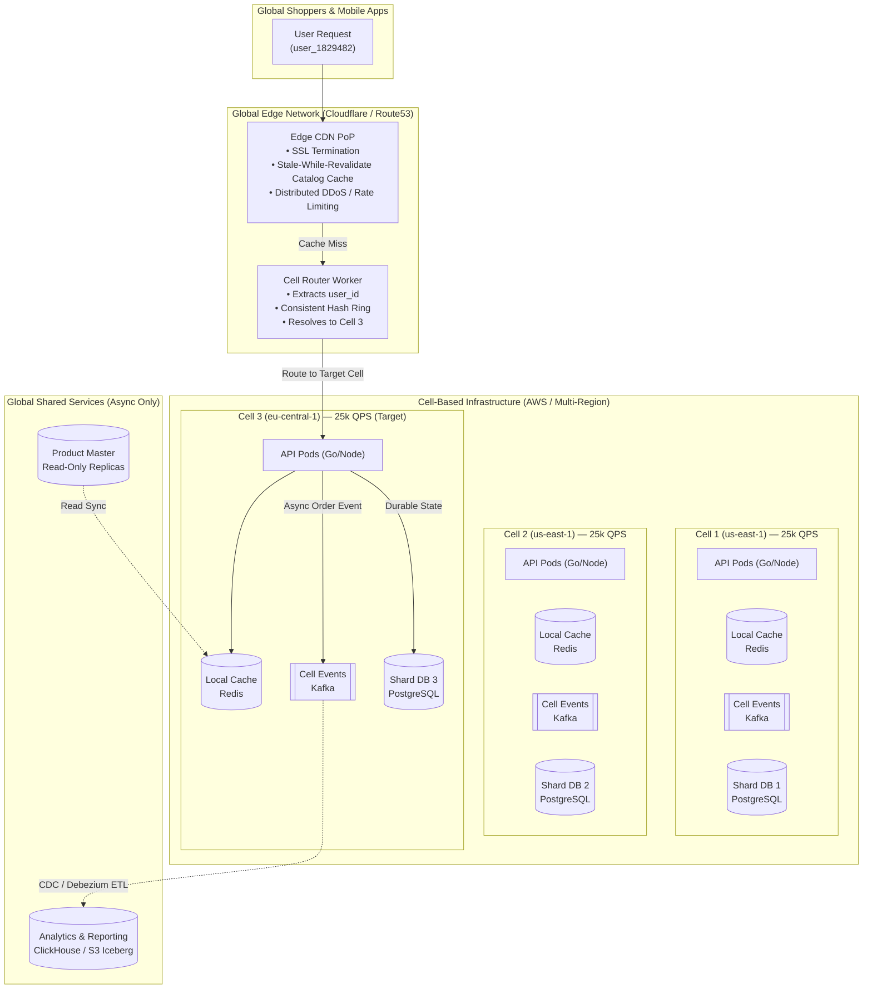

# Day 29 — Designing for 10× Growth

> 🔗 **LinkedIn Discussion**: [Read & Discuss on LinkedIn](https://www.linkedin.com/in/himanshu-verma-822a07286/)  
> 🏛️ **System Architecture Milestone**: [`v7-global-architecture`](../../../system-evolution/v7-global-architecture/README.md)  
> 🚀 **Phase**: Phase 6 — Designing for Real Scale (Days 26–29)  
> 🎯 **Today's Focus**: Bottleneck Forecasting, The 10× Threshold, Cell-Based Architectures, Strategic Postponement, and Architectural Pruning

---

## The Problem

Yesterday in [Day 28 — How Much Does Scaling Actually Cost?](../day-28-scaling-cost-economics/README.md), we confronted the brutal economics of our multi-region deployment. We reined in a 370% cloud bill surge by eliminating unindexed query scans, trimming cross-AZ egress taxes, and sizing our infrastructure around unit cost per order.

Today, the leadership team drops a bomb in the quarterly engineering all-hands:

> *"We just signed global retail distribution agreements and closed a tier-one celebrity partnership. Over the next 12 to 18 months, our platform must support **10× our current peak traffic**."*

Here is where **ShopScale** stands today versus what 10× looks like:

```text
================================================================================
                    SHOPSCALELABS: THE 10× TRAFFIC HORIZON
================================================================================
Metric                           Current Baseline (Day 28)     10× Target (Year +1)
────────────────────────────────────────────────────────────────────────────────
Daily Active Users (DAU)         270,000                       2,700,000
Peak Catalog Browsing Traffic    15,000 QPS                    150,000 QPS
Sustained Order Creation Rate    50 orders/sec                 500 orders/sec
Peak Flash Sale Order Surge      800 orders/sec                8,000 orders/sec
Daily Database Ingestion Volume  120 GB / day                  1.2 TB / day
Active Product Catalog SKUs      2,000,000                     20,000,000
Monthly Infrastructure Budget    $38,000 / month               $120,000 / month (Max 3.1×)
Target P99 Checkout Latency      < 120 ms                      < 150 ms
================================================================================
```

Notice the last constraint: **Traffic is growing by 1,000%, but the infrastructure budget is only permitted to grow by ~200%.** You cannot simply buy 10× more servers or provision a database that is ten times larger.

The junior engineering impulse is excitement: *"Let's rewrite the entire backend in Rust, throw away PostgreSQL for distributed CockroachDB or Google Spanner, break our four core services into 65 microservices, and deploy multi-region active-active clusters everywhere!"*

The seasoned principal engineer's impulse is caution: **Every architectural redesign carries an operational tax.** If you redesign for 100× today, you will bankrupt the company under operational complexity before you ever reach 10×. If you merely tweak configuration files, the system will collapse the moment traffic hits 3×.

Designing for 10× growth is not an exercise in adding more technology. It is an exercise in **engineering judgment**:
1. **What breaks first?**
2. **What do we change?**
3. **What do we deliberately delay?**
4. **What is unnecessarily complex and must be pruned?**

---

## Why the Simple Approach Breaks

When confronted with 10× projections, teams almost always take one of two flawed extremes: **Linear Vertical Over-Provisioning** or **The Premature Distributed Over-Correction**.

```text
     Extremes of 10× Planning                  The Real-World Outcome
  ┌──────────────────────────────┐          ┌────────────────────────────────────────┐
  │ Approach A: Linear Scaling   │          │ Wall hits at 3×. Primary DB saturates  │
  │ "Just make RDS instances and │ ───────► │ locks, connection pools run dry, and   │
  │  Kube pod pools 10× bigger"  │          │ single-thread event loops choke.       │
  └──────────────────────────────┘          └────────────────────────────────────────┘
  ┌──────────────────────────────┐          ┌────────────────────────────────────────┐
  │ Approach B: Total Rewrite    │          │ 14-month multi-service rewrite stalls. │
  │ "Rewrite into 60 microsvcs   │ ───────► │ Distributed transaction latency spikes │
  │  and multi-master Spanner"   │          │ p99 to 1.8s. Team drowns in debug logs.│
  └──────────────────────────────┘          └────────────────────────────────────────┘
```

### Flaw 1: The Linear Scaling Fallacy (Hardware Hits Hard Physics)

If your primary PostgreSQL instance handles 800 write orders/second on an `AWS db.r6g.8xlarge` (32 vCPU, 256 GB RAM), can you scale to an `AWS db.r6g.16xlarge` or `32xlarge` to process 8,000 writes/second?

**No.** Relational write capacity does not scale linearly with hardware cores:
* **WAL (Write-Ahead Log) Serial Bottleneck**: Every transactional commit must flush sequential bytes to the WAL disk. Disk controller queues, NVMe IOPS limits, and kernel fsync locks introduce a hard physical ceiling around 2,500–4,000 durable ACID write commits per second on a single primary node, regardless of CPU count.
* **Row-Level Lock Contention**: During a flash sale ([Day 13](../../phase-3-stop-making-everything-synchronous/day-13-exactly-once-myth/README.md)), hundreds of parallel checkout transactions attempt to decrement `inventory_count` on the top 20 hot SKUs. More CPU cores only increase the number of threads waiting in kernel sleep queues on mutex locks, driving CPU context switching through the roof while throughput collapses.
* **Connection Pool Overhead**: Scaling application pods from 50 to 500 pods means thousands of backend connection sockets. Even with PgBouncer connection pooling ([Day 06](../../phase-2-database-becomes-the-problem/day-06-app-scales-db-doesnt/README.md)), managing 15,000 active client connections consumes gigabytes of memory purely in connection metadata and TCP buffer management.

### Flaw 2: The Distributed Over-Correction (The Latency Multiplier)

Terrified of database limits, the team decides to break every subsystem into microservices communicating over gRPC, with distributed multi-region databases:
* A single user action that once touched 1 monolithic database transaction now spans 6 microservices (Identity, Catalog, Cart, Pricing, Inventory, Payment).
* According to the **Distributed Systems Tail Latency Law**, if one service has a p99 latency of 30ms, the composite p99 of 6 sequential network calls is:
  $$\text{Composite P99} = 1 - (1 - 0.01)^6 \approx 5.85\% \text{ of requests experience severe tail latency.}$$
* If network jitter or cross-AZ roundtrips add 15ms per hop, your checkout latency balloons from 80ms to over 700ms.
* Operational cognitive load spikes: the team spends 80% of their sprints debugging distributed traces, Kafka lag drift, and out-of-order event arrivals rather than shipping business features.

---

## Understanding the Problem

To rationally navigate an order of magnitude growth, we must apply three fundamental scaling laws: **The Rule of 3 and 10**, **Amdahl's Law of Scaling Bottlenecks**, and **Blast Radius Isolation via Cell-Based Architecture**.

### 1. The Rule of 3 and 10

Originally coined by engineers at Flickr and codified across Silicon Valley, **The Rule of 3 and 10** states:

> *Every system breaks roughly every 3× and 10× increase in scale. At each threshold, nearly every major architectural layer must be re-evaluated.*

```text
       THE SYSTEM CAPACITY LIFECYCLE
       
   1×         3×                 10×                 30×                100×
  ┌────┐     ┌────┐             ┌─────┐             ┌─────┐            ┌──────┐
  │Day1│ ──► │Day7│ ──────────► │Day29│ ──────────► │Scale│ ─────────► │Global│
  └────┘     └────┘             └─────┘             └─────┘            └──────┘
   Base       Optimize           Architectural       Partition          Federate
  Design     Indexes/Cache       Decoupling          Into Cells         Autonomous
```

* **At 1×**: Monolith + single database.
* **At 3×**: Add indexes, read replicas, and basic Redis caching ([Day 07](../../phase-2-database-becomes-the-problem/day-07-read-replicas/README.md) & [Day 08](../../phase-2-database-becomes-the-problem/day-08-caching-easy-until-not/README.md)).
* **At 10×**: Asynchronous event queues, boundary decomposition, partitioned state ([Day 12](../../phase-3-stop-making-everything-synchronous/day-12-introducing-the-queue/README.md) & [Day 15](../../phase-3-stop-making-everything-synchronous/day-15-surviving-traffic-spikes/README.md)).
* **At 30×**: Cell-based architecture, autonomous failure domains, tenant-sharded databases ([Day 09](../../phase-2-database-becomes-the-problem/day-09-one-db-not-enough/README.md)).
* **At 100×**: Fully isolated global fabrics, distributed consensus, automated edge compute.

**The Golden Rule**: Design for 10×, implement for 3×, and never build for 100× until you are at 30×. Building for 100× when you are at 1× creates dead weight that drowns the engineering team.

### 2. Amdahl's Law in Distributed Systems

Amdahl's Law dictates the maximum speedup achievable by parallelizing a workload:

$$S_{\text{latency}}(s) = \frac{1}{(1 - p) + \frac{p}{s}}$$

Where $p$ is the proportion of execution time that can be parallelized, and $s$ is the number of parallel workers.

```text
                  THE SERIAL BOTTLENECK CEILING
                  
  Speedup Factor (Max Throughput)
        │
    10× ┼──────────────────────────────────────── p = 0.99 (1% serial)
        │                                 /
     5× ┼───────────────────/────────────        p = 0.95 (5% serial)
        │             /
     2× ┼──────/───────────────────────────────── p = 0.80 (20% serial)
        │
     1× ┼────────────────────────────────────────
        └───────────┬──────────────┬─────────────► Parallel Workers (Pods/Nodes)
                    10             50
```

If **even 5% of your checkout request is strictly serial and synchronous** (e.g., locking an inventory row in a single central SQL database), **your maximum possible system speedup is capped at 20×, no matter how many hundreds of Kubernetes nodes you deploy.**

To survive 10× growth, you cannot simply add parallel pods; you must **shrink the serialized fraction ($1 - p$) toward zero**.

### 3. The 4 Essential Engineering Questions

To redesign ShopScale rationally, we run our current architecture through four filters:

```text
 ┌────────────────────────────────────────────────────────────────────────┐
 │                      THE 10× EVALUATION FRAMEWORK                      │
 └────────────────────────────────────────────────────────────────────────┘
          │
          ├── 1. WHAT BREAKS FIRST?
          │   Identify single points of serialization, shared disks, and memory limits.
          │
          ├── 2. WHAT DO WE CHANGE?
          │   Target the foundational structural shifts needed to sustain 10× load.
          │
          ├── 3. WHAT DO WE DELAY?
          │   Identify complex, expensive projects that provide no ROI until 30×–100×.
          │
          └── 4. WHAT IS UNNECESSARILY COMPLEX?
              Prune unmaintained micro-abstractions, unused caches, and noisy telemetry.
```

---

## What Breaks First? (Predicting the Collapses)

When ShopScale's traffic scales from 15,000 QPS to 150,000 QPS and write load surges from 800 to 8,000 orders/sec, the failure points do not fail quietly. They collapse in a predictable sequence:

```text
                   THE 10× FAILURE DOMINO SEQUENCE
                   
   [15,000 QPS]               [45,000 QPS]                 [150,000 QPS]
  
  ┌───────────────┐         ┌────────────────┐          ┌────────────────┐
  │ Primary DB    │         │ Central Redis  │          │ Cross-Region   │
  │ WAL & Lock    │ ──────► │ Network NIC &  │ ───────► │ Replication &  │
  │ Saturation    │         │ Single-Thread  │          │ Cascade Storms │
  └───────────────┘         └────────────────┘          └────────────────┘
         ▲                          ▲                           ▲
     Hour 0:                    Hour 1:                     Hour 2:
   Checkout write             Catalog cache               Global checkout
   locks freeze DB            NIC saturates               desyncs, queues DLQ
```

### 1. Primary PostgreSQL Write IOPS and Row Contention
* **Why it breaks**: In Day 27/28, all write transactions across both US and Europe still route to a single Primary RDS instance in `us-east-1`. At 8,000 orders/sec, each order involves writing an `orders` record, multiple `order_items`, updating `inventory_levels`, appending an `audit_log`, and inserting an `outbox_events` record ([Day 10](../../phase-2-database-becomes-the-problem/day-10-data-without-breaking-consistency/README.md)). That equates to **35,000 disk writes/second**.
* **The Symptom**: EBS disk latency climbs from 1.2ms to 65ms. PgBouncer runs out of pooled server slots. Application HTTP threads wait on database connections, triggering upstream gateway timeouts (HTTP 504).

### 2. Central Redis Cluster Network Bandwidth (NIC Saturation)
* **Why it breaks**: Our product catalog cache serves 150,000 QPS. Even with serialized JSON payloads compressed to an average of 4 KB, data egress from the Redis cluster hits:
  $$\text{Throughput} = 150,000 \times 4 \text{ KB} = 600,000 \text{ KB/s} \approx 4.8 \text{ Gbps}$$
* While Redis can sustain millions of simple operations per second in memory, its standard cloud network interface hits packet processing bottlenecks (packets-per-second thresholds) and single-core CPU saturation, resulting in sudden, unpredictable tail latency spikes.

### 3. Kafka Hot Partitioning and Consumer Group Stagnation
* **Why it breaks**: Our order processing topic was provisioned with 16 partitions in [Day 12](../../phase-3-stop-making-everything-synchronous/day-12-introducing-the-queue/README.md). In Kafka, **maximum consumer parallelism equals the number of partitions in a topic**. With 16 partitions, at most 16 consumer worker pods can read concurrently.
* At 8,000 orders/sec, each worker would need to process 500 orders/sec with full payment validation and fraud checks. If downstream payment gateways take 120ms per charge, 16 workers can process at most:
  $$\text{Max Throughput} = \frac{16 \text{ workers} \times 1,000\text{ms}}{120\text{ms}} \approx 133 \text{ orders/sec}$$
* The unconsumed lag on Kafka explodes into millions of unhandled messages within minutes.

### 4. Cross-Region WAN Replication Lag Drift
* **Why it breaks**: As established in [Day 27](../day-27-multi-region-architecture/README.md), transmitting replication logs across the Atlantic has an irreducible 70–90ms optical fiber delay. At 8,000 writes/sec, the replication queue builds faster than the TCP window across the WAN can drain it. Replicas in `eu-central-1` fall 15 to 45 seconds behind primary state. Users buying in London see stale inventory and purchase items that were already reserved in Virginia.

---

## What Do We Change? (The Architectural Shifts)

To survive 10× without rewriting the universe, we implement four structural architectural changes:

```text
 ┌────────────────────────────────────────────────────────────────────────┐
 │                      THE 4 STRUCTURAL 10× CHANGES                      │
 └────────────────────────────────────────────────────────────────────────┘
          │
          ├── 1. CELL-BASED ARCHITECTURE (Bulkhead Isolation)
          │   Partition users and tenants into autonomous, self-contained units.
          │
          ├── 2. ASYNCHRONOUS CHECKOUT WITH EVENTUAL INVENTORY RESERVATION
          │   Eliminate synchronous database row locks from the checkout path.
          │
          ├── 3. TWO-TIER CACHING: EDGE CDN (Stale-While-Revalidate) + REDIS
          │   Shift 85% of read volume completely off origin infrastructure.
          │
          └── 4. HORIZONTAL DATABASE SHARDING BY TENANT/USER ID
              Distribute write transactions across multiple independent databases.
```

### 1. Shift from Region-Centric to Cell-Based Architecture

Instead of running one massive cluster in `us-east-1` and another in `eu-central-1` that share global state, we partition our system into **Cells**.

* **What is a Cell?** A Cell is an independent, complete instance of the application stack, containing its own compute pods, its own Redis cache, its own Kafka cluster, and its own sharded PostgreSQL database.
* **Why it solves the problem**: A single cell is sized to handle exactly 20,000 QPS and 1,000 writes/sec—scale we know how to run reliably. To achieve 10× growth (150,000 QPS), we do not make the cell 10× bigger. **We simply deploy 8 identical cells.**
* **Blast Radius Protection**: If Cell 3 experiences a corrupted index, a poisoned Kafka message, or an out-of-memory crash, **only 12.5% of our users are impacted**. Cells 1, 2, and 4–8 continue running unaffected.

```text
                        CELL-BASED ROUTING TOPOLOGY
                        
                             Global Edge Router 
                       (Cloudflare / Route53 Latency)
                                     │
                 ┌───────────────────┴───────────────────┐
                 ▼                                       ▼
       Cell Router (US East)                   Cell Router (EU West)
        [Hash: user_id % 4]                     [Hash: user_id % 4]
        ┌────────┼────────┐                     ┌────────┼────────┐
        ▼        ▼        ▼                     ▼        ▼        ▼
     ┌─────┐  ┌─────┐  ┌─────┐               ┌─────┐  ┌─────┐  ┌─────┐
     │Cell1│  │Cell2│  │Cell3│               │Cell4│  │Cell5│  │Cell6│
     └─────┘  └─────┘  └─────┘               └─────┘  └─────┘  └─────┘
     Each Cell = 25k QPS, isolated DB, isolated Kafka, isolated Redis
```

### 2. Make the Critical Checkout Flow Truly Asynchronous

In Day 11–13, we introduced queues for emails and analytics, but checkout creation remained synchronous: the user held an open HTTP connection while the server acquired a PostgreSQL row lock on inventory.

At 10× scale, **synchronous locking on hot items must die**.

* **The New Flow**:
  1. User clicks **Place Order**.
  2. Edge/API Gateway validates authentication, schemas, and rate limits ([Day 26](../day-26-rate-limiting-at-scale/README.md)).
  3. API writes an `OrderSubmitted` event into an ultra-fast in-memory buffered stream (Kafka or Redis Streams) with an idempotency key ([Day 13](../../phase-3-stop-making-everything-synchronous/day-13-exactly-once-myth/README.md)).
  4. Server immediately responds with **`HTTP 202 Accepted`** containing an `order_token` and a tracking URL.
  5. The client polls via lightweight HTTP or listens on a WebSocket/SSE connection.
  6. Backend workers consume events in micro-batches, reserve inventory, process payments, and commit state asynchronously.
* **The Result**: User perceived latency drops from 220ms to 18ms. Database write spikes are flattened into smooth, manageable ingestion streams.

### 3. Edge-First Read Offloading (`stale-while-revalidate`)

Origin servers should never see 150,000 QPS of catalog browsing requests.
* We configure our Edge CDN (Cloudflare / Fastly) with `stale-while-revalidate=60, s-maxage=300`.
* 85% of read requests are satisfied directly by CDN Points of Presence (PoPs) within 15ms of the user's browser.
* When product prices or descriptions change, an asynchronous invalidation hook purges the edge cache tag. The origin database load drops from 150,000 QPS to under 8,000 QPS.

---

## What Do We Delay? (Strategic Postponement)

Great architecture is defined just as much by what you **refuse to build** as what you build. The following complex technologies must be deliberately rejected for 10× growth:

```text
 ┌────────────────────────────────────────────────────────────────────────┐
 │                   WHAT WE DELIBERATELY DELAY FOR 10×                   │
 └────────────────────────────────────────────────────────────────────────┘
  Project / Tech                Why We Delay It                   When to Reconsider
 ──────────────────────────────────────────────────────────────────────────
  Distributed Multi-Master      Extreme operational overhead;     At 50×–100× when
  SQL (Spanner / CockroachDB)   high cross-region Paxos latency;  cross-shard joins
                                sharded Postgres is 5× cheaper.   are non-negotiable.

  Full Microservice Mesh        Debugging distributed traces      When team size
  Rewrite (60+ Services)        across 60 repos kills velocity.   exceeds 150 engineers
                                Coarse-grained domains suffice.   (Conway's Law).

  Custom In-House Message       High maintenance; reinventing     Never. Standard
  Broker or Storage Engine      wheels already solved by Kafka,   open-source engines
                                Redis, and ClickHouse.            are battle-hardened.

  Global Active-Active Writes   Replication conflict resolution   When local data laws
  for Every User Entity         (CRDTs) adds massive complexity;  strictly mandate
                                cell affinity handles 99% well.   in-region write custody.
```

---

## What Is Unnecessarily Complex? (Pruning the Over-Engineered)

Over 28 days of evolution, our repository accumulated architectural cruft that made sense during focused experiments but now creates drag at scale:

1. **Pruning 100% Trace Sampling**:
   * *The Cruft*: In [Day 23](../../phase-5-cant-scale-what-you-cant-see/day-23-production-incident-walkthrough/README.md), we enabled distributed tracing. Currently, the system captures OpenTelemetry spans for 100% of requests.
   * *The 10× Reality*: At 150,000 QPS, ingesting and storing 100% of spans generates **9 TB of telemetry data per day**, costing more than the application compute layer.
   * *The Fix*: Implement **Tail-Based Adaptive Sampling**: sample 1% of successful HTTP 200 requests, but sample 100% of HTTP 5xx errors and requests with latency over 500ms.

2. **Eliminating Redundant Caching Tiers**:
   * *The Cruft*: We currently have a local in-memory application cache (Guava/Node-cache), an Envoy sidecar proxy cache, and a distributed Redis cluster.
   * *The 10× Reality*: Three caching layers create cache synchronization nightmares and ghost-read bugs.
   * *The Fix*: Prune to two clean tiers: **Edge CDN** for public catalog items + **Redis Cluster** for dynamic session/cart state. Eliminate the in-memory app cache and sidecar proxy cache.

3. **Collapsing Micro-Services Back to Modular Domains**:
   * *The Cruft*: We split `CurrencyConversionService` and `TaxCalculationService` into standalone network microservices.
   * *The 10× Reality*: Every checkout request pays a 10ms network latency tax to query tax and currency.
   * *The Fix*: Bring them back into the main order processing service as compiled library packages. Zero network overhead, zero RPC failures.

---

## Possible Approaches

When re-architecting for 10× scale, engineering leadership must choose between three distinct architectural paradigms:

```text
 ┌────────────────────────────────────────────────────────────────────────┐
 │                    10× ARCHITECTURAL OPTIONS COMPARISON                │
 └────────────────────────────────────────────────────────────────────────┘
```

### Approach 1: The Monolithic Sharded Fabric (Horizontal Data Sharding)
* **How it works**: Maintain our coarse-grained modular services, but horizontally shard the single PostgreSQL primary database by `tenant_id` or `user_id` across 8 to 16 database instances using Citus, Vitess, or application-level routing.
* **Where it helps**: Directly eliminates the primary WAL and lock contention bottleneck. Keeps application logic and deployments relatively simple.
* **Limitations**: Cross-shard queries (e.g., aggregate financial reports across all users) become complex and require asynchronous ETL pipelines.
* **When it makes sense**: When the data model is easily partitioned around a single master entity (like `user_id` or `store_id`).

### Approach 2: Cell-Based Architecture (Autonomous Failure Domains)
* **How it works**: The entire application stack (API pods, databases, caches, queues) is replicated into isolated, self-sufficient "cells." A stateless global router assigns incoming users to a specific cell via consistent hashing.
* **Where it helps**: Caps blast radius to a fraction of the user base. Eliminates cross-region database locks. Allows rolling canary updates one cell at a time.
* **Limitations**: Requires sophisticated edge routing and global lookup registries; handling interactions between users in different cells (e.g., social sharing) requires cross-cell APIs.
* **When it makes sense**: When scale surpasses single-cluster limits and high availability (99.99%) is critical.

### Approach 3: Global Distributed SQL (CockroachDB / TiDB / Spanner)
* **How it works**: Replace PostgreSQL entirely with a distributed SQL engine that natively partitions tables across nodes and coordinates distributed transactions via Raft or Paxos.
* **Where it helps**: Provides automated horizontal scale with standard SQL semantics and ACID transactions without application-level sharding logic.
* **Limitations**: Write latency is inherently higher due to consensus network hops. Extremely expensive infrastructure costs. Complex operational tuning under heavy write contention.
* **When it makes sense**: When data cannot be cleanly partitioned by a single shard key and transactions strictly demand global serialization across regions.

---

## Trade-offs

There is no cost-free architecture. Every decision exchanges one engineering currency for another:

| Architectural Vector | Approach 1: Sharded Database | Approach 2: Cell-Based Architecture (Chosen) | Approach 3: Distributed SQL |
|---|---|---|---|
| **Write Scalability** | **High**: Scales linearly with number of shards. | **Very High**: Each cell has an independent database. | **High**: Automatically scales across nodes. |
| **Blast Radius Isolation** | **Medium**: App layer is shared; DB shard failure impacts 12.5%. | **Extreme**: Failure of an entire cell impacts only users in that cell. | **Low**: A cluster-wide consensus stall halts all writes globally. |
| **Operational Complexity** | **Medium**: Requires shard rebalancing tools. | **Medium-High**: Managing deployment pipelines across multiple cells. | **Very High**: Deep debugging of Raft consensus and distributed clock skew. |
| **Read/Write Latency** | **Fast**: Sub-5ms single-shard local queries. | **Fastest**: Local cell queries with zero cross-cell chatter. | **Slow to Medium**: 15–45ms due to multi-node consensus round-trips. |
| **Financial Cost** | **Low-Medium**: Standard RDS / PostgreSQL instances. | **Predictable**: Cost scales linearly with cell count. | **High**: Requires heavy compute nodes for Raft replication overhead. |
| **Team Cognitive Load** | **Moderate**: Developers must include `shard_key` in queries. | **Low-Moderate**: Developers write code as if it runs in a single cluster. | **High**: Complex query planner behaviors and unexpected query deadlocks. |

---

## A Practical Example: The ShopScale 10× Architecture

Let us put this engineering judgment into concrete architecture. Below is the blueprint for **ShopScale v8 (The 10× Architecture)**.

### 1. High-Level Architecture: The Cell Fabric



### 2. Edge Routing: Deterministic Cell Resolution

The Edge Router determines cell placement in sub-millisecond execution time using consistent hashing without needing a central database lookup:

```typescript
// Edge Router Worker (Runs at Cloudflare / CloudFront Edge)
import { createHash } from 'crypto';

interface CellRoute {
  cellId: string;
  originEndpoint: string;
  isHealthy: boolean;
}

const ACTIVE_CELLS: CellRoute[] = [
  { cellId: 'cell-us-1', originEndpoint: 'https://cell1.internal.shopscale.io', isHealthy: true },
  { cellId: 'cell-us-2', originEndpoint: 'https://cell2.internal.shopscale.io', isHealthy: true },
  { cellId: 'cell-eu-1', originEndpoint: 'https://cell3.internal.shopscale.io', isHealthy: true },
  { cellId: 'cell-eu-2', originEndpoint: 'https://cell4.internal.shopscale.io', isHealthy: true },
];

export function resolveUserCell(userId: string): CellRoute {
  // Deterministic 32-bit MurmurHash or MD5 to map user to cell ring
  const hash = createHash('md5').update(userId).digest('hex');
  const integerHash = parseInt(hash.substring(0, 8), 16);
  
  // Filter only healthy cells (Circuit Breaker / Health status synced via Edge KV)
  const healthyCells = ACTIVE_CELLS.filter(c => c.isHealthy);
  if (healthyCells.length === 0) {
    throw new Error("CRITICAL: All system cells are degraded.");
  }

  const assignedIndex = integerHash % healthyCells.length;
  return healthyCells[assignedIndex];
}
```

### 3. Asynchronous Checkout: Flattening 8,000 Writes/Sec

Instead of an expensive multi-table transactional lock during checkout, the application writes an immutable event and responds immediately:

```go
// Package checkout - Asynchronous Order Acceptance Handler
package main

import (
	"context"
	"encoding/json"
	"net/http"
	"time"

	"github.com/google/uuid"
	"github.com/segmentio/kafka-go"
)

type OrderRequest struct {
	UserID         string   `json:"user_id"`
	IdempotencyKey string   `json:"idempotency_key"`
	ItemIDs        []string `json:"item_ids"`
	TotalAmountCts int64    `json:"total_amount_cents"`
}

type OrderAcceptedResponse struct {
	OrderID    string `json:"order_id"`
	Status     string `json:"status"`
	PollURL    string `json:"poll_url"`
	ReceivedAt string `json:"received_at"`
}

type CheckoutHandler struct {
	KafkaProducer *kafka.Writer
}

func (h *CheckoutHandler) HandlePlaceOrder(w http.ResponseWriter, r *http.Request) {
	var req OrderRequest
	if err := json.NewDecoder(r.Body).Decode(&req); err != nil {
		http.Error(w, "Malformed request payload", http.StatusBadRequest)
		return
	}

	// 1. Generate unique Order ID
	orderID := "ord_" + uuid.New().String()

	// 2. Package the event payload
	eventPayload, _ := json.Marshal(map[string]interface{}{
		"order_id":        orderID,
		"user_id":         req.UserID,
		"idempotency_key": req.IdempotencyKey,
		"items":           req.ItemIDs,
		"total_amount":    req.TotalAmountCts,
		"status":          "PENDING_RESERVATION",
		"timestamp":       time.Now().UTC().Format(time.RFC3339),
	})

	// 3. Fast synchronous append to local cell Kafka partition (Sub-5ms)
	// Keying by UserID guarantees strict ordering for this user
	err := h.KafkaProducer.WriteMessages(context.Background(), kafka.Message{
		Key:   []byte(req.UserID),
		Value: eventPayload,
	})

	if err != nil {
		// If queue is unreachable, fail gracefully with 503
		http.Error(w, "Order ingestion temporarily unavailable", http.StatusServiceUnavailable)
		return
	}

	// 4. Return HTTP 202 Accepted immediately
	resp := OrderAcceptedResponse{
		OrderID:    orderID,
		Status:     "SUBMITTED",
		PollURL:    "/api/v1/orders/" + orderID + "/status",
		ReceivedAt: time.Now().UTC().Format(time.RFC3339),
	}

	w.Header().Set("Content-Type", "application/json")
	w.WriteHeader(http.StatusAccepted) // HTTP 202
	json.NewEncoder(w).Encode(resp)
}
```

### 4. Background Batch Consumer: Protecting the Database

Downstream worker pods read in micro-batches from Kafka, batch-decrementing inventory and writing orders in a single database round-trip:

```python
# Asynchronous Order Worker Consumer (Micro-Batching Pattern)
import json
import psycopg2
from psycopg2.extras import execute_batch

def process_order_batch(kafka_messages, db_conn):
    """
    Consumes up to 500 orders from Kafka and flushes them 
    in a SINGLE database transaction, eliminating per-row lock churn.
    """
    orders_to_insert = []
    inventory_decrements = []

    for msg in kafka_messages:
        data = json.loads(msg.value)
        orders_to_insert.append((
            data['order_id'],
            data['user_id'],
            data['total_amount'],
            'CONFIRMED'
        ))
        for item_id in data['items']:
            inventory_decrements.append((item_id,))

    with db_conn.cursor() as cursor:
        try:
            # 1. Bulk insert orders
            execute_batch(cursor, """
                INSERT INTO orders (id, user_id, amount_cents, status)
                VALUES (%s, %s, %s, %s)
                ON CONFLICT (id) DO NOTHING;
            """, orders_to_insert)

            # 2. Bulk decrement inventory using optimized row-level array update
            execute_batch(cursor, """
                UPDATE inventory 
                SET available_quantity = available_quantity - 1 
                WHERE sku = %s AND available_quantity > 0;
            """, inventory_decrements)

            # Commit the entire batch as one disk WAL flush
            db_conn.commit()
            print(f"Successfully processed batch of {len(orders_to_insert)} orders.")
        except Exception as e:
            db_conn.rollback()
            print(f"Batch processing error: {e}. Route to Dead Letter Queue.")
            raise e
```

---

## Failure Scenarios (What Can Still Go Wrong)

Even a well-architected 10× system introduces new failure modes. Understanding them ahead of time is the hallmark of senior engineering:

```text
 ┌────────────────────────────────────────────────────────────────────────┐
 │                      10× HIDDEN FAILURE MODES                          │
 └────────────────────────────────────────────────────────────────────────┘
```

### 1. The "Mega-Tenant / Celebrity Dropper" Hot Cell Problem
* **The Failure**: We shard users across cells using consistent hashing on `user_id`. But an enterprise influencer drops a flash sale product. 250,000 shoppers simultaneously attempt to buy from a **single store merchant** located in Cell 2.
* **What Happens**: While Cells 1, 3, and 4 sit at 10% CPU, Cell 2's database and message queues hit 100% saturation. The cell architecture fails to isolate the load because the hot entity is the *merchant/catalog*, not the *user*.
* **Mitigation**: Dual-Key Routing. Route read traffic using the `merchant_id` to read-only distributed edge caches, but route the write checkout traffic using the individual buyer's `user_id` across all cells. The inventory reservation is handled via distributed reservation tokens rather than locking a single merchant record.

### 2. Hash Ring Rebalancing Storm (The Cell Eviction Trap)
* **The Failure**: Cell 3 experiences a hardware network partition and fails health checks. The global router automatically removes Cell 3 from the active hash ring.
* **What Happens**: With naive modulo hashing (`hash % N`), removing 1 cell causes **nearly 100% of all existing keys to remap to different cells**. Millions of active sessions lose cache locality simultaneously, triggering an unprecedented cache stampede ([Day 08](../../phase-2-database-becomes-the-problem/day-08-caching-easy-until-not/README.md)) that crashes the remaining healthy cells.
* **Mitigation**: Use **Consistent Hashing with Virtual Nodes** (e.g., Ketama algorithm) or a **Stateful Lookup Directory** for active carts. Only $\frac{1}{N}$ of the keys move when a node is evicted, leaving the remaining $(N-1)$ traffic distribution untouched.

### 3. Asynchronous Order Reconciliation Drift
* **The Failure**: The system returns `HTTP 202 Accepted` to the customer. 4 seconds later, during background batch execution, the payment gateway rejects the card or stock runs out.
* **What Happens**: The user believes they purchased the item, but the asynchronous worker failed to fulfill it. If notification systems fail, the customer arrives days later asking where their shipment is.
* **Mitigation**: Build a first-class **Order Status Compensation Saga** ([Day 10](../../phase-2-database-becomes-the-problem/day-10-data-without-breaking-consistency/README.md)). The client UI displays an active polling progress indicator for 5 seconds. If the asynchronous fulfillment fails, the order status changes to `RESERVATION_FAILED`, an immediate automated email/push notification is triggered, and pre-authorization funds are instantly reversed.

---

## Key Engineering Decisions

When preparing your system for an order of magnitude growth, anchor your architecture around this strategic roadmap:

```text
                     THE 10× STRATEGIC DECISION MATRIX
                     
                   Is the current component a shared central bottleneck?
                                       │
                      ┌────────────────┴────────────────┐
                     YES                                NO
                      │                                 │
           Can it be partitioned             Does it serve >80% read traffic?
             into autonomous cells?                     │
              ┌───────┴───────┐                  ┌──────┴──────┐
             YES              NO                YES            NO
              │               │                  │             │
        Implement        Can we make        Offload to    Keep as-is.
        Cell-Based       it async?          Edge CDN      Avoid premature
        Architecture     ┌────┴────┐       (SWR Cache)    optimization.
                        YES        NO
                         │         │
                   Queue Buffer  Shard DB
                   (HTTP 202)    by Key
```

1. **Prioritize Blast Radius Over Global Unified State**: Building a single giant cluster that serves all 2.7M users is a suicide pact. Partition your workloads into self-contained failure domains (Cells). When a cell dies, only a fraction of your revenue is at risk.
2. **Move Synchronous Work to Asynchronous Batches**: Never hold open synchronous client threads while waiting on disk writes or external third-party APIs. Return `HTTP 202 Accepted` and let backpressured worker queues absorb traffic peaks ([Day 14](../../phase-3-stop-making-everything-synchronous/day-14-back-pressure/README.md) & [Day 15](../../phase-3-stop-making-everything-synchronous/day-15-surviving-traffic-spikes/README.md)).
3. **Push Read Traffic to the Edge**: Your core database and Redis clusters should only process requests that truly require fresh origin state. Offload 80%+ of catalog, pricing, and content queries to the Edge CDN with `stale-while-revalidate`.
4. **Resist the Microservice Rewrite Siren Call**: Do not split services because of organizational theory or tech blogs. Keep services coarse-grained. Split along data-ownership and blast-radius boundaries only when team communication or database contention makes it strictly necessary.
5. **Trim the Telemetry Tax**: 100% distributed tracing and unindexed debug logs will bankrupt your infrastructure budget at 10× scale. Adopt tail-based sampling and strict metric retention policies before traffic lands.

---

## Key Takeaways

* **Systems break every 3× and 10×**: You cannot scale a system 10× by simply turning up the instance size or adding more pods. Foundational serialization points must be restructured.
* **Design for 10×, build for 3×**: Plan your architecture so that it can sustain an order of magnitude growth, but implement the bare minimum needed for the next 3× to avoid suffocating the team with operational complexity.
* **Amdahl's Law rules all**: If 5% of your request flow requires a synchronous row lock on a single database, your maximum possible horizontal scaling limit is capped at 20×. Eliminate synchronous locks to achieve true elasticity.
* **Cells isolate catastrophes**: Cell-based architecture caps outages to isolated user segments, allowing you to scale out by deploying identical, manageable clusters rather than one unmanageable monster.
* **Async beats fast sync**: The fastest synchronous database transaction is the one you never execute. Ingesting transactions as immutable events with immediate `HTTP 202` response turns violent traffic spikes into steady, predictable streams.
