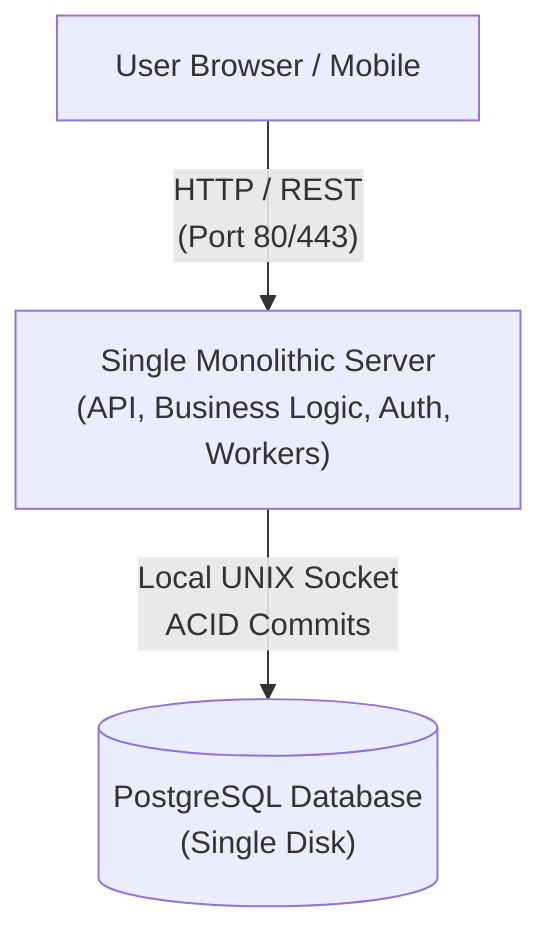
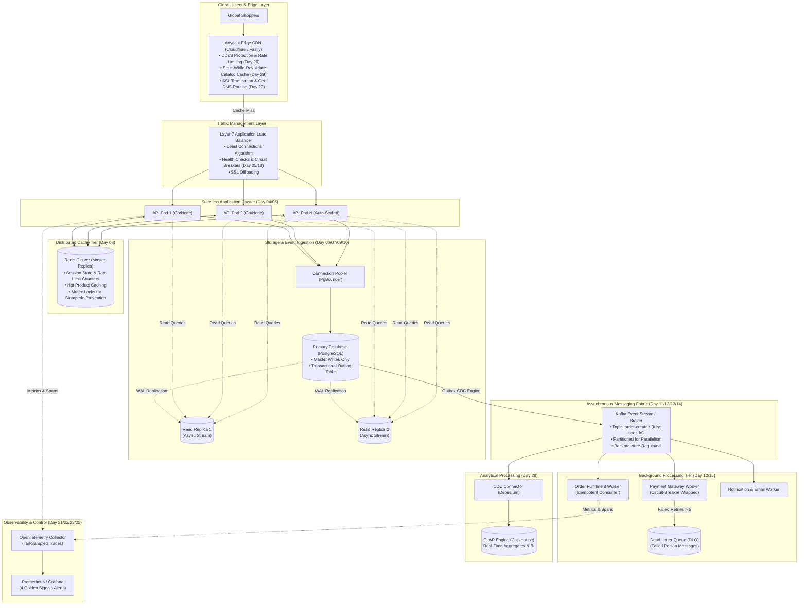

# Day 30 — The System That Grew With Us
## From One Server to a System Built for Scale (And What We Would Do Differently)

> 🔗 **LinkedIn Discussion**: [Read & Discuss on LinkedIn](https://www.linkedin.com/in/himanshu-verma-822a07286/)  
> 🏛️ **System Architecture Milestone**: [`v7-global-architecture`](../../../system-evolution/v7-global-architecture/README.md)  
> 🚀 **Phase**: Phase 6 — Designing for Real Scale (Days 26–30)  
> 🎯 **Today's Focus**: The 30-Day Retrospective, Full System Blueprint, The 11-Stage Evolution Arc, Hard-Won Architectural Scars, and What We Would Do Differently

---

## The Problem

Thirty days ago, on [Day 01](../../phase-1-one-server-enough/day-01-no-microservices-yet/README.md), ShopScale was a single monolithic Go/Node process running inside a single container on a modest $20/month cloud virtual machine. The database was a local PostgreSQL instance running on the same disk. There were no message brokers, no distributed caches, no load balancers, no multi-region replication fabrics, and zero telemetry agents. Deployments were a simple `git pull` followed by a systemd process restart.

Fast forward to today. The system handles hundreds of thousands of concurrent shoppers across three continents. When you open the infrastructure dashboard, you see an interconnected distributed topology:

```text
                    GLOBAL USERS
                         │
                   Load Balancer
                         │
              ┌──────────┴──────────┐
              │                     │
          API Layer             API Layer
              │                     │
              └──────┬──────────────┘
                     │
               Cache Layer
                     │
              ┌──────┴──────┐
              │             │
          Primary DB      Replicas
              │
          Event Stream
              │
       ┌──────┴────────┐
       │               │
   Workers         Analytics
       │               │
   Monitoring ───── Tracing
```

The system works. It sustains flash sales, routes traffic around regional cable cuts, absorbs burst traffic without collapsing, and isolates failures to limited blast radiuses.

So what is the problem?

The problem is **Accretive Architectural Complexity**.

Systems built during rapid growth are shaped chronologically by the emergencies that birthed them:
1. When the CPU spiked on the monolith, we slapped a load balancer in front of it ([Day 05](../../phase-1-one-server-enough/day-05-load-balancer-changes-everything/README.md)).
2. When the database choked on read volume, we added read replicas and then a Redis cache ([Day 07](../../phase-2-database-becomes-the-problem/day-07-read-replicas/README.md) & [Day 08](../../phase-2-database-becomes-the-problem/day-08-caching-easy-until-not/README.md)).
3. When checkout HTTP requests timed out under payment gateway lag, we grafted a message queue and background workers ([Day 11](../../phase-3-stop-making-everything-synchronous/day-11-never-synchronous-request/README.md) & [Day 12](../../phase-3-stop-making-everything-synchronous/day-12-introducing-the-queue/README.md)).
4. When workers hammered each other during network hiccups, we introduced retry backoffs, dead-letter queues, and circuit breakers ([Day 17](../../phase-4-now-the-system-is-distributed/day-17-timeouts-retries-retry-storm/README.md) & [Day 18](../../phase-4-now-the-system-is-distributed/day-18-cascading-failures/README.md)).
5. When cross-region traffic drove replication lag into tens of seconds, we sharded by tenant and built cell boundaries ([Day 27](../day-27-multi-region-architecture/README.md) & [Day 29](../day-29-designing-for-10x-growth/README.md)).

Each individual layer made complete sense the day it was introduced. But when you look at the total system as a whole, you realize: **Every layer solved an immediate bottleneck, but it also introduced a permanent operational tax.**

Junior engineers look at this diagram and see a checklist of industry buzzwords conquered. A battle-tested engineer looks at it and asks:
* *Where did we introduce distributed coordination when simpler data modeling would have avoided it?*
* *Which abstractions are paying their rent, and which ones are draining developer velocity?*
* *If we had to build this system again knowing what we know now, what would we do completely differently?*

---

## Why the Simple Approach Breaks

When engineers reflect on architecture, they tend to fall into one of two dangerous traps. Understanding why both extremes fail is essential before we dissect our retrospective.

```text
       TRAP A: RESUME-DRIVEN OVER-ENGINEERING          TRAP B: REACTIVE PATCHWORK ACCRETION
     ┌────────────────────────────────────────┐      ┌────────────────────────────────────────┐
     │ Start Day 01 with 35 microservices,    │      │ Bolt on tools reactively to patch bad  │
     │ Kafka, Kubernetes, and distributed SQL │      │ SQL, ignoring data boundaries until    │
     │ before the product has 50 active users.│      │ you have a fragile distributed monolith│
     └────────────────────────────────────────┘      └────────────────────────────────────────┘
                         │                                               │
                         ▼                                               ▼
         Velocity collapses to zero;                     Every deployment triggers hidden
         company runs out of runway.                     cascading failures across tiers.
```

### Trap A: The Day-0 Distributed Fallacy

Engineers read whitepapers from Netflix, Amazon, or Google and attempt to implement their end-state architecture on Day 01. 

They decompose their nascent application into twenty microservices, introduce Kafka for event streaming, deploy Kubernetes across two clouds, and configure distributed consensus databases like CockroachDB or Spanner.

Why this breaks:
* **The Cognitive Tax Outweighs the Business**: The engineering team spends 85% of their sprint cycles configuring service meshes, debugging cross-service trace propagation, diagnosing gRPC connection resets, and writing schema migration scripts across five databases.
* **Premature Boundary Freeze**: In early stages, business requirements pivot weekly. Refactoring a domain boundary that spans four independent network services and three event topics takes weeks. In a monolithic codebase, that same refactor takes two hours with an IDE rename tool.
* **Capital Depletion**: The infrastructure and observability bill outpaces revenue long before product-market fit is reached.

### Trap B: The Reactive Patchwork (Masking Bad Fundamentals)

The opposite failure occurs when teams resist architectural restructuring for too long, using technologies as "band-aids" over poor fundamentals:
* **Caching Bad Queries**: Instead of analyzing a slow `O(N)` unindexed join, the team drops a Redis cache in front of it. The query still runs like molasses whenever the cache expires, causing catastrophic cache stampedes ([Day 08](../../phase-2-database-becomes-the-problem/day-08-caching-easy-until-not/README.md)).
* **Queueing Bad Workflows**: Instead of eliminating unnecessary synchronous work, the team shoves every database update into Kafka, introducing dual-write consistency bugs and consumer lag headaches ([Day 13](../../phase-3-stop-making-everything-synchronous/day-13-exactly-once-myth/README.md)).
* **Throwing Iron at Software Inefficiency**: Instead of tuning PostgreSQL connection pools or fixing memory leaks, the team doubles database instance sizes, multiplying AWS bills ([Day 28](../day-28-scaling-cost-economics/README.md)).

The simple approach breaks because **technology cannot fix an architectural problem it was not designed to solve.**

---

## Understanding the Problem

### The Problem-First Engineering Philosophy

The defining principle of this entire 30-day journey is that **technology must always be a consequence of the problem, never the starting point.**

Most technical content is structured tool-first:
* *"Today we are going to learn Redis."*
* *"Today we are going to learn Kafka."*
* *"Today we are going to learn Kubernetes."*

This breeds engineers who know how to install tools, but have no idea *when* or *why* to use them.

In this series, we inverted the mental model completely:
* Instead of *"Today we learn Redis"*, we asked:  
  **"Our primary database is saturated with 50,000 read queries per second for unchanged catalog data, starving our write transactions of disk IOPS. What are our options?"** ([Day 08](../../phase-2-database-becomes-the-problem/day-08-caching-easy-until-not/README.md))
* Instead of *"Today we learn Kafka"*, we asked:  
  **"Our checkout API is timing out because a single HTTP request is trying to charge a credit card, decrement inventory, generate a PDF invoice, and send an email synchronously within 300ms. How do we decouple this?"** ([Day 11](../../phase-3-stop-making-everything-synchronous/day-11-never-synchronous-request/README.md) & [Day 12](../../phase-3-stop-making-everything-synchronous/day-12-introducing-the-queue/README.md))
* Instead of *"Today we learn Multi-Region"*, we asked:  
  **"Our European users are experiencing 280ms latency because speed-of-light optical fiber physics across the Atlantic imposes a 90ms round-trip penalty per TCP handshake. How do we bring compute closer to them without destroying data consistency?"** ([Day 27](../day-27-multi-region-architecture/README.md))

When the problem is thoroughly understood down to hardware physics and network constraints, the architectural solution becomes obvious.

### The 11-Stage Evolution Arc

Over 30 days, ShopScale moved through an 11-stage progression. Every engineering organization scaling a product travels this exact path:

```text
 1. START SIMPLE ──────────────► Monolith + Single SQLite/Postgres DB (Day 01)
         │
 2. GET USERS ─────────────────► Traffic arrives; resource saturation begins (Day 03)
         │
 3. HIT BOTTLENECKS ───────────► CPU/Memory limits; vertical scaling ceiling hit (Day 04)
         │
 4. SCALE THE APPLICATION ─────► Stateless API nodes + Layer 7 Load Balancing (Day 05)
         │
 5. SCALE THE DATA ────────────► Connection pooling, read replicas, caching tiers (Days 06–09)
         │
 6. INTRODUCE ASYNCHRONY ──────► Message queues, worker pools, event-driven decoupling (Days 11–15)
         │
 7. DEAL WITH FAILURE ─────────► Retries, backoff, circuit breakers, dead letters (Days 16–20)
         │
 8. OBSERVE THE SYSTEM ────────► 4 Golden signals, distributed tracing, alerting hygiene (Days 21–23)
         │
 9. BREAK THE SYSTEM ──────────► Load testing with k6, chaos injection, fault validation (Days 24–25)
         │
10. SCALE GLOBALLY ────────────► Rate limiting, multi-region routing, cell partitioning (Days 26–29)
         │
11. MAKE BETTER TRADE-OFFS ────► Cost governance, pruning complexity, architecture review (Day 30)
```

---

## 30 Days Later: What I Would Do Differently

This is the most critical section of the entire series. If we wiped our repository clean and rebuilt ShopScale from scratch today, here are the **six fundamental architectural decisions we would change**:

```text
┌────────────────────────────────────────────────────────────────────────┐
│               THE 6 RETROSPECTIVE ENGINEERING CORRECTIONS              │
└────────────────────────────────────────────────────────────────────────┘
 │
 ├── 1. BUILD A STRICT MODULAR MONOLITH BEFORE EVER SPLITTING SERVICES
 │
 ├── 2. STANDARDIZE IDEMPOTENCY KEYS AND OUTBOX ON DAY 01
 │
 ├── 3. EXHAUST RELATIONAL OPTIMIZATIONS BEFORE REACHING FOR REDIS
 │
 ├── 4. INJECT DISTRIBUTED TRACE CONTEXT (W3C) BEFORE ADDING ASYNC QUEUES
 │
 ├── 5. ENFORCE BACKPRESSURE AND DEAD-LETTER LIMITS AT BIRTH
 │
 └── 6. AUDIT CLUSTER EGRESS AND AZ BOUNDARIES BEFORE MULTI-REGION
```

### 1. I Would Have Built a Strict Modular Monolith Before Even Thinking About Splitting Services

* **What we did**: Around [Day 16](../../phase-4-now-the-system-is-distributed/day-16-network-is-unreliable/README.md), as the system grew complex, we began breaking services into independent deployment targets (Auth Service, Inventory Service, Order Service, Notification Service).
* **The painful lesson**: We introduced network serialization boundaries between teams before our domain boundaries were completely stable. We immediately traded simple in-memory function calls for network latency, partial failure modes, distributed transaction orchestration, and schema drift.
* **What I would do differently**: I would keep the codebase as a **Strict Modular Monolith** far longer. A modular monolith enforces hard boundaries inside a single deployable artifact using language-level packages/modules with private interfaces. No module can query another module's database tables directly. 
  When you keep modules in one codebase with strict boundary interfaces, you get 95% of the organizational benefits of microservices with 0% of the network latency, deployment overhead, or distributed failure headaches. You only extract a service when its scaling profile or deployment lifecycle demands it (e.g., heavy GPU transcoding vs. lightweight API).

### 2. I Would Have Standardized Idempotency and the Transactional Outbox Pattern on Day 01

* **What we did**: In Phase 1 and 2, we wrote code where an API endpoint updated the database and then directly published an event to a message queue or called a third-party webhook. In [Day 10](../../phase-2-database-becomes-the-problem/day-10-data-without-breaking-consistency/README.md) and [Day 13](../../phase-3-stop-making-everything-synchronous/day-13-exactly-once-myth/README.md), we discovered the hard truth: **The Dual-Write Problem guarantees silent data corruption.**
* **The painful lesson**: Retrofitting idempotency keys, request deduplication tables, and Transactional Outbox tables across dozens of existing database tables and consumer workers was grueling, error-prone surgery on a running plane.
* **What I would do differently**: From the very first pull request on Day 01, every state-mutating API endpoint must accept a client-provided `Idempotency-Key` header, and every asynchronous domain event must be committed to an `outbox` table in the *same local database transaction* as the entity state. Making reliability an infrastructural standard from Day 01 costs almost nothing; retrofitting it into 15 production tables takes months.

### 3. I Would Have Exhausted Relational Database Performance Before Introducing Redis

* **What we did**: On [Day 08](../../phase-2-database-becomes-the-problem/day-08-caching-easy-until-not/README.md), when database query latency crept up, we immediately deployed a Redis cluster to cache product catalog and user profile data.
* **The painful lesson**: Redis solved our read latency immediately, but it introduced cache invalidation bugs, cache stampedes, TTL synchronization drift, and operational memory overhead. Weeks later, we discovered that two missing partial indexes, poor connection pooling parameters, and un-tuned PostgreSQL shared buffers were causing 70% of the initial database distress.
* **What I would do differently**: I would refuse to introduce a distributed cache until the database's native capabilities are fully exhausted:
  1. Add covering indexes and partial indexes to eliminate sequential scans.
  2. Implement aggressive connection pooling via PgBouncer or native connection managers ([Day 06](../../phase-2-database-becomes-the-problem/day-06-app-scales-db-doesnt/README.md)).
  3. Tune engine memory parameters (`shared_buffers`, `work_mem`).
  4. Use HTTP edge caching with `stale-while-revalidate` for public data.
  Only when optimized disk IOPS and buffer hits are physically saturated should you introduce the dual-system state synchronization nightmare of an external caching tier.

### 4. I Would Have Baked Structured Logging and Distributed Tracing into the Base Framework Before Introducing Async Workers

* **What we did**: We added message queues on [Day 12](../../phase-3-stop-making-everything-synchronous/day-12-introducing-the-queue/README.md), but only tackled distributed tracing on [Day 21](../../phase-5-cant-scale-what-you-cant-see/day-21-users-know-before-you/README.md) and [Day 23](../../phase-5-cant-scale-what-you-cant-see/day-23-production-incident-walkthrough/README.md).
* **The painful lesson**: Between Day 12 and Day 21, debugging an order that stalled between the API, the queue, and the background worker was a nightmare. Logs were scattered across three different machines with different timestamp formats and zero correlation IDs. We lost days of engineering time hunting "phantom" worker drops.
* **What I would do differently**: Day 01 middleware must inject a W3C `traceparent` context and a `correlation_id` into every incoming request. When publishing a message to a queue, that trace context must be injected into message metadata headers. When a worker picks up the job, it must extract that context. Observability is not a Phase 5 luxury; it is the flashlight you need before you step into the distributed dark.

### 5. I Would Have Enforced Backpressure and Dead-Letter Caps on Queues from Moment One

* **What we did**: We provisioned message queues with default unbounded buffers and basic automatic retries. On [Day 14](../../phase-3-stop-making-everything-synchronous/day-14-back-pressure/README.md) and [Day 17](../../phase-4-now-the-system-is-distributed/day-17-timeouts-retries-retry-storm/README.md), a downstream payment gateway outage caused millions of retry messages to flood the broker, consuming gigabytes of RAM, triggering OOM kills, and locking worker threads in continuous retry loops.
* **The painful lesson**: A queue without backpressure and rate limiting is just a delayed out-of-memory crash waiting to happen.
* **What I would do differently**: Every queue must be born with:
  1. Hard maximum message count caps.
  2. Exponential backoff with jitter on retries.
  3. A strict Dead-Letter Queue (DLQ) policy with a maximum retry count of 3 to 5 before routing to cold storage.
  4. Real-time consumer lag threshold alerts.

### 6. I Would Have Accounted for Cloud Egress Economics Before Celebrating Multi-Region

* **What we did**: On [Day 27](../day-27-multi-region-architecture/README.md), we deployed active-active multi-region replication and celebrated our global sub-80ms latencies. On [Day 28](../day-28-scaling-cost-economics/README.md), the monthly AWS bill arrived, and the finance team halted our roadmap.
* **The painful lesson**: We replicated full product catalog updates and cross-AZ event streams indiscriminately across regions over public WAN transit. Cloud providers charge heavily for cross-AZ and cross-region egress ($0.02 to $0.09 per GB).
* **What I would do differently**: Architectural designs must be co-authored with a unit-cost financial model. Data replication must be filtered, compressed, and partitioned so that only customer-critical state crosses region boundaries.

---

## Possible Approaches

When an engineering team builds or refactors a system for scale, there are three primary architectural paths they can choose:

```text
┌────────────────────────────────────────────────────────────────────────┐
│                   3 PATHWAYS TO SYSTEM ARCHITECTURE                    │
└────────────────────────────────────────────────────────────────────────┘
```

### Approach 1: The Monolithic Fortress
* **How it works**: Scale the application vertically as far as hardware allows (64 vCPUs, 512 GB RAM). Scale horizontally only at the stateless HTTP layer behind a load balancer, maintaining a single, highly optimized relational database with read replicas and local memory caches.
* **Where it helps**: Unmatched developer productivity. Zero distributed transaction bugs. Sub-millisecond latency for all internal business operations. Very low infrastructure complexity.
* **Limitations**: Hits a hard ceiling when database write volume exceeds what a single primary disk controller can physically commit (typically 3,000–5,000 ACID write TPS). A fatal bug in one domain can crash the entire runtime.
* **When it makes sense**: From Day 01 up to roughly 100,000 Daily Active Users (DAU) and 95% of typical SaaS or e-commerce workloads.

### Approach 2: The Premature Microservice Fabric
* **How it works**: Decompose the system early into dozens of isolated, independently deployed microservices, each with its own database, communicating via gRPC or asynchronous Kafka topics.
* **Where it helps**: Allows large enterprise engineering organizations (500+ developers) to ship code independently without merge conflicts or deployment bottlenecks.
* **Limitations**: Extreme operational overhead. Debugging distributed failures requires sophisticated telemetry tooling. High tail latency from multiple network hops. Requires complex distributed consistency mechanisms (Sagas, 2PC).
* **When it makes sense**: Only when engineering team size makes monolithic code coordination impossible (Conway's Law), NOT for traffic scale alone.

### Approach 3: Evolutionary, Problem-Driven Architecture (The 30-Day Path)
* **How it works**: Start with a disciplined modular monolith. Establish rigorous telemetry baselines. When a specific hardware or software constraint is reached (e.g., database connection saturation, blocking synchronous I/O, geographical latency), surgically decouple that specific layer using proven distributed patterns.
* **Where it helps**: Balances high developer velocity with realistic scalability. Avoids paying the operational tax of distributed systems until the business can afford and justify it.
* **Limitations**: Requires vigilant architectural discipline and periodic refactoring sprints as the system crosses the "Rule of 3 and 10" scale thresholds.
* **When it makes sense**: The recommended path for any modern high-growth technology platform.

---

## Trade-offs

System design is never about finding the "perfect" architecture; it is about choosing which set of problems you are willing to tolerate.

| Dimension | Day 01: Simple Monolith | Day 15: Asynchronous System | Day 30: Scaled Distributed System |
|---|---|---|---|
| **System Throughput** | ~500 requests/sec | ~10,000 requests/sec | 150,000+ requests/sec |
| **P99 Read Latency** | 15 ms (local disk) | 45 ms (network hops) | 12 ms (Edge CDN + Local Cell Cache) |
| **Write Coordination** | Single ACID Transaction | Outbox + Worker Eventual Consistency | Cell-Partitioned Shards + Async Ingestion |
| **Blast Radius** | 100% of users affected if process crashes | Partial (API survives worker collapse) | Isolated to single Cell (~12.5% of users) |
| **Operational Cognitive Load** | Minimal (1 engineer can understand all) | Moderate (Must monitor queue lag, retries) | High (Requires dedicated SRE, tracing, DLQs) |
| **Deployment Simplicity** | 1-click deployment / rollback | Multiple artifact deployments | Canary rollouts, schema migrations across cells |
| **Infrastructure Monthly Cost** | ~$50 / month | ~$1,200 / month | ~$35,000+ / month |
| **Data Consistency Guarantee** | Immediate Strong Consistency | Eventual Consistency across boundaries | Tunable Consistency (PACELC: Local PC / Global EC) |

---

## A Practical Example: The Complete Evolution Blueprint

To visualize the complete transformation, let us contrast the Day 01 architecture with the full Day 30 production architecture.

### Day 01: The Starting Point



* Everything runs inside one process.
* If payment processing takes 4 seconds, the client waits 4 seconds.
* If the database restarts, the entire business goes offline.

---

### Day 30: The Complete Scaled System

Here is the complete blueprint of ShopScale after 30 days of disciplined, problem-driven evolution:



---

### The Code Pattern That Saved Our Architecture: Idempotent Transactional Outbox

If there is one code implementation that embodies the lessons of this series, it is the **Transactional Outbox with Idempotent Consumer**. 

It permanently eliminates the dual-write bug that plagues growing systems when trying to update a database and publish to an event stream simultaneously:

```go
// Package orders - Production Transactional Outbox Pattern
package orders

import (
	"context"
	"database/sql"
	"encoding/json"
	"fmt"
	"time"

	"github.com/google/uuid"
)

type Order struct {
	ID             string    `json:"id"`
	UserID         string    `json:"user_id"`
	AmountCents    int64     `json:"amount_cents"`
	Status         string    `json:"status"`
	IdempotencyKey string    `json:"idempotency_key"`
	CreatedAt      time.Time `json:"created_at"`
}

type OrderEvent struct {
	EventID   string    `json:"event_id"`
	EventType string    `json:"event_type"`
	Payload   string    `json:"payload"`
	CreatedAt time.Time `json:"created_at"`
}

// CreateOrder atomically commits the order and writes an event to the outbox table.
// This guarantees that the event is ALWAYS published if and only if the database commit succeeds.
func CreateOrder(ctx context.Context, db *sql.DB, order Order) (*Order, error) {
	tx, err := db.BeginTx(ctx, &sql.TxOptions{Isolation: sql.LevelReadCommitted})
	if err != nil {
		return nil, fmt.Errorf("failed to begin tx: %w", err)
	}
	defer tx.Rollback()

	// 1. Check idempotency key to prevent duplicate checkouts
	var existingID string
	err = tx.QueryRowContext(ctx, 
		"SELECT id FROM orders WHERE idempotency_key = $1", 
		order.IdempotencyKey,
	).Scan(&existingID)

	if err == nil {
		// Idempotent duplicate: return existing order without reprocessing
		order.ID = existingID
		return &order, nil
	} else if err != sql.ErrNoRows {
		return nil, fmt.Errorf("failed to check idempotency: %w", err)
	}

	// 2. Insert new Order record
	order.ID = "ord_" + uuid.New().String()
	order.Status = "PENDING_PAYMENT"
	order.CreatedAt = time.Now().UTC()

	_, err = tx.ExecContext(ctx, `
		INSERT INTO orders (id, user_id, amount_cents, status, idempotency_key, created_at)
		VALUES ($1, $2, $3, $4, $5, $6);
	`, order.ID, order.UserID, order.AmountCents, order.Status, order.IdempotencyKey, order.CreatedAt)
	if err != nil {
		return nil, fmt.Errorf("failed to insert order: %w", err)
	}

	// 3. Atomically write to the Outbox table in the SAME transaction
	payloadBytes, _ := json.Marshal(order)
	outboxEventID := "evt_" + uuid.New().String()

	_, err = tx.ExecContext(ctx, `
		INSERT INTO outbox_events (id, aggregate_type, aggregate_id, event_type, payload, status, created_at)
		VALUES ($1, 'ORDER', $2, 'ORDER_CREATED', $3, 'PENDING', $4);
	`, outboxEventID, order.ID, string(payloadBytes), time.Now().UTC())
	if err != nil {
		return nil, fmt.Errorf("failed to write outbox event: %w", err)
	}

	// 4. Commit the transaction
	if err := tx.Commit(); err != nil {
		return nil, fmt.Errorf("failed to commit order and outbox: %w", err)
	}

	// An asynchronous background Debezium connector or polling worker tails the outbox
	// table and publishes to Kafka with zero risk of dual-write discrepancies.
	return &order, nil
}
```

---

## Failure Scenarios (What Can Still Go Wrong in the Scaled System)

Even when a system reaches Day 30 maturity, distributed failure modes never disappear. They merely become subtler and harder to detect:

```text
┌────────────────────────────────────────────────────────────────────────┐
│               MATURE DISTRIBUTED SYSTEM FAILURE MODES                  │
└────────────────────────────────────────────────────────────────────────┘
```

### 1. The Outbox Polling Lag and Ghost Read Disaster
* **The Edge Case**: The user places an order. The API commits the order and writes to the `outbox_events` table. The API returns `HTTP 202 Accepted` with a redirect to the order tracking page.
* **The Failure**: The asynchronous worker tailing the outbox table lags behind by 4 seconds due to Kafka ingestion throttling. The user's browser immediately requests `/orders/ord_12345`. The read request routes to a read replica that has not received the replication stream yet.
* **The Symptom**: The user is greeted with a "404 Order Not Found" screen immediately after a successful checkout, prompting them to click "Submit Order" again and creating duplicate payment chaos.
* **The Fix**: **Read-Your-Own-Writes Consistency**. When the user creates an order, set a temporary session cookie containing the transaction timestamp. If a read request arrives within 5 seconds of a write, force the load balancer to route the read to the **Primary Database** instead of the read replicas.

### 2. Cache Invalidation Cascades Under High Write Concurrency
* **The Edge Case**: An admin updates product prices across 5,000 SKUs during a major marketing campaign.
* **The Failure**: The admin tool fires 5,000 `DEL` commands into Redis simultaneously. 100,000 browsing users immediately experience cache misses on the top products at the exact same millisecond.
* **The Symptom**: A massive **Cache Stampede (Thundering Herd)** crushes the read replica databases, driving CPU to 100% and triggering upstream timeouts across all API nodes.
* **The Fix**: Never issue naked deletes on hot cache keys under peak load. Use **Probabilistic Early Expiration (XFetch)** or an **Update-Through Cache Pattern** where the background job pre-warms the cache key with the new value before releasing the old one.

### 3. Distributed Tracing Cardinality Explosion
* **The Edge Case**: A developer adds an OpenTelemetry span attribute that includes the raw error message returned by third-party payment gateways, which includes unique customer tokens and dynamic timestamps.
* **The Failure**: Instead of a few hundred distinct metric time-series, the Prometheus/Mimir monitoring cluster receives 4,000,000 unique metric time-series labels in an hour.
* **The Symptom**: The monitoring infrastructure runs out of RAM, alerting stops functioning, and the engineering team goes blind during the peak of the flash sale.
* **The Fix**: Enforce strict linting rules on metric label names. Never allow unbounded cardinality values (UUIDs, email addresses, error messages) in metric dimensions. Use distributed trace spans for high-cardinality metadata and reserve metrics strictly for low-cardinality aggregations.

---

## Key Engineering Decisions

As you lead and scale engineering teams, apply this **Five-Question Decision Framework** before adding any new component to your architecture:

```text
               THE SENIOR ARCHITECT'S DECISION FILTER
               
             Does this introduce a new network boundary?
                                 │
                ┌────────────────┴────────────────┐
               YES                                NO
                │                                 │
     Do we have distributed             Proceed. Keep logic
     tracing and correlation            inside the modular
     IDs in place first?                monolith.
        ┌───────┴───────┐
       YES              NO
        │               │
  What is the failure   STOP. Implement observability
  mode when this new    before distributing state.
  dependency is down?
        │
  ┌─────┴─────────────────────────────────────┐
  │ • Have we defined timeouts and jitter?     │
  │ • Is the operation idempotent?            │
  │ • Is there a backpressure limit?          │
  │ • Can the business function if it fails?  │
  └───────────────────────────────────────────┘
```

1. **Optimize Before You Distribute**: Exhaust indexes, connection pooling, and memory settings before introducing caching or sharding. A well-tuned relational database can take you further than you think.
2. **Treat Network Hops as Guaranteed Failure Points**: Every network call will eventually time out, fail, drop packets, or return garbage. If an operation spans a network boundary, it must have a timeout, an exponential backoff with jitter, a circuit breaker, and an idempotency key.
3. **Decouple by Domain, Not by Technology**: Do not build a "Redis Service" or a "Kafka Cluster" just because you want to use modern technology. Decouple your system along bounded business contexts (Billing, Catalog, Inventory) where independent scaling or team ownership justifies the operational tax.
4. **Design for Observable Debugging First**: If an engineer cannot trace an order from the user's mobile browser to a database write and back to a notification email within 60 seconds using distributed tracing, the system is too complex for the team to run safely.
5. **The Ultimate Metric is MTTR, Not MTBF**: No distributed system achieves 100% Mean Time Between Failures (MTBF). Disks will fail, cloud zones will experience outages, and developers will deploy bugs. Architect your system so that failures are isolated (small blast radius), degraded states are graceful, and Mean Time To Recovery (MTTR) is measured in seconds rather than hours.

---

## Key Takeaways

* **Technology is a consequence of problems**: Never start with the tool. Start with the hardware constraint, the latency bottleneck, or the operational limitation, and let the technology follow naturally.
* **Complexity is conserved**: You never eliminate complexity in a distributed system; you only move it. When you trade a monolith for microservices, you trade application code complexity for operational, network, and data consistency complexity.
* **Design for 10×, implement for 3×**: Plan your architectural roadmap so that you know what breaks at the next order of magnitude, but implement only what is required to survive the next 3× to protect team velocity.
* **Idempotency is non-negotiable**: In any distributed system with network retries and asynchronous message delivery, "at-least-once" is the only reality. Design all consumers and state mutations to be strictly idempotent.
* **The best systems are evolutionary**: Great scalable systems are not created in a single flash of genius on a whiteboard. They are forged through disciplined observation, relentless bottleneck identification, and practical engineering trade-offs.

---

## 🏁 Series Conclusion: How to Talk About This Journey

Don't describe this journey as *"A 30-day course on system design."* That space is saturated with generic interview prep, definitions, and hand-waving diagrams.

Frame it for what it truly is:

> **"A first-principles, problem-driven engineering journey: evolving a production system from a single server to global scale by facing real bottlenecks, making hard trade-offs, and learning from architectural scars."**

Thank you for following along with **30 Days of Building Systems That Scale**. Build boldly, measure relentlessly, and always respect the trade-offs.
