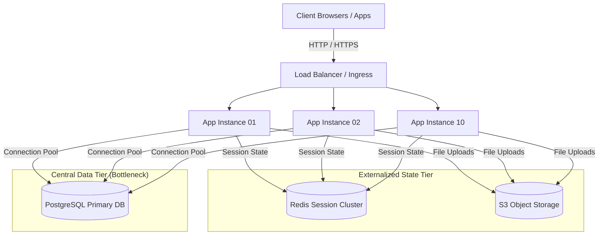

# Milestone v2-scaled-compute — Horizontally Scaled Compute Tier

> **System Evolution Stage**: `v2-scaled-compute`  
> **Previous Milestone**: [`v1-monolith`](../v1-monolith/README.md)  
> **Related Guides**:  
> - [Day 04 — Vertical vs. Horizontal Scaling](../../days/phase-1-one-server-enough/day-04-vertical-vs-horizontal/README.md)  
> - [Day 05 — The Load Balancer Changes Everything](../../days/phase-1-one-server-enough/day-05-load-balancer-changes-everything/README.md)  
> - [Day 06 — Your Application Scales. Your Database Doesn't.](../../days/phase-2-database-becomes-the-problem/day-06-app-scales-db-doesnt/README.md)  
> **Next Milestone**: `v3-cached-data`

---

## 🎯 Architecture Overview

`v2-scaled-compute` represents the second architectural stage of **ShopScale**: scaling application compute horizontally by removing local in-memory state and placing multiple application instances behind a Load Balancer.

To enable horizontal compute scaling, we made the application process **stateless**:
* **Session State**: Moved out of application process RAM and externalized to a centralized Redis cluster.
* **File Uploads / Assets**: Moved out of local server disk and externalized to S3-compatible Object Storage.

Incoming traffic hits a single ingress endpoint (`api.shopscale.com`) managed by a Load Balancer (e.g., NGINX / HAProxy / Cloud ALB), which distributes client requests evenly across `app-01` through `app-10`. However, all application nodes continue to read and write to a single primary PostgreSQL database.



---

## 📋 System Characteristics Matrix

| Attribute | Specification |
|---|---|
| **Topology** | Load Balancer + N Stateless App Nodes + Redis Session Store + Single PostgreSQL DB |
| **Max Tested Throughput** | ~3,500 - 5,000 RPS (Compute Layer), Bottlenecked by Database Connections |
| **P99 Latency SLA** | Compute < 25ms; Spikes to > 8,000ms under heavy DB lock contention |
| **Compute Tier** | Horizontally Scalable (1 to 10+ Stateless Nodes) |
| **Session Tier** | In-Memory Redis Cache Cluster |
| **Data Tier** | 1x PostgreSQL Primary DB (Single Point of Failure and Bottleneck) |
| **Async Worker Tier** | None (Synchronous API execution) |
| **Target Availability** | 99.9% Compute Availability (DB remains Single Point of Failure) |

---

## 🧩 Component Breakdown

1. **Load Balancer (NGINX / Cloud ALB)**: Terminates TLS, performs health checks, and balances HTTP traffic using Round-Robin / Least Connections across app instances.
2. **Stateless App Cluster (`app-01` to `app-10`)**: Identical application instances running stateless business logic. Any node can handle any user request.
3. **Redis Session Cluster**: Stores user authentication tokens and active session payloads with short TTLs.
4. **S3 Object Storage**: Decoupled media and user file storage.
5. **PostgreSQL Database**: Single relational database serving all transactions (`users`, `products`, `orders`, `inventory`).

---

## 🚀 How to Launch This Milestone

You can spin up the full `v2-scaled-compute` topology locally using Docker Compose:

```bash
cd system-evolution/v2-scaled-compute
docker compose up -d --build
```

Verify that the Load Balancer is distributing requests across multiple backend app nodes:

```bash
# Execute multiple requests to check instance hostnames in responses
for i in {1..5}; do curl -s http://localhost:80/health | jq .hostname; done
```

---

## 🏛️ Associated Architectural Decisions (ADRs)

* **[ADR-04: Externalize Session State to Redis](../../days/phase-1-one-server-enough/day-04-vertical-vs-horizontal/README.md)**: Decoupled user sessions from server memory to allow stateless horizontal scaling.
* **[ADR-05: Introduce Reverse Proxy & Load Balancer](../../days/phase-1-one-server-enough/day-05-load-balancer-changes-everything/README.md)**: Established a single public ingress point to route traffic across multiple application servers.
* **[ADR-06: Database Connection Pooling & Bottleneck Management](../../days/phase-2-database-becomes-the-problem/day-06-app-scales-db-doesnt/README.md)**: Identified single-database saturation under compute scale and established PgBouncer transaction pooling.
