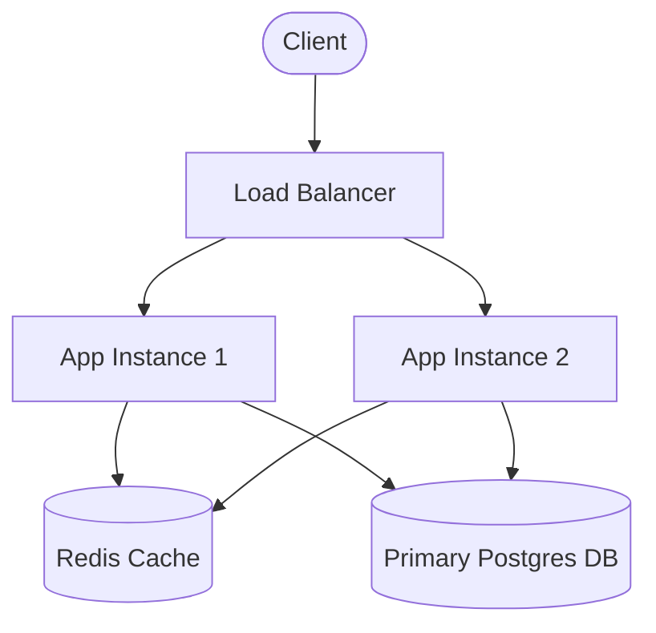

# Day [XX] — [Day Title]

> 🔗 **LinkedIn Discussion**: [Link to today's LinkedIn Post](https://linkedin.com/in/your-profile)  
> 🏛️ **System Architecture Milestone**: [`vX-[version-name]`](../../../system-evolution/vX-[version-name])

---

## 🚨 1. The Engineering Problem

Describe the exact bottleneck, symptom, or failure point the system is encountering today.

* What went wrong under current load conditions?
* What metrics (CPU, Memory, Latency, IOPS, Connection Limits) triggered this alert?
* What business impact or user experience degradation occurred?

---

## 📉 2. Why the Simple Solution Breaks

Explain why straightforward fixes or naive approaches (e.g., throwing a bigger server at it, adding an unbounded loop, making synchronous calls) fail.

```text
+-------------------+      Sync Request (Blocks)     +-------------------+
|  Client App       | -----------------------------> |  App Server       |
+-------------------+                                +-------------------+
                                                              |
                                                    DB Lock (Timeout 500ms)
                                                              v
                                                     [ 💥 Connection Pool Exhausted ]
```

---

## 🧠 3. Exploring Potential Approaches

Evaluate candidate technical solutions before committing to a fix.

| Approach | Pros | Cons | Decision |
|---|---|---|---|
| **Option A**: [e.g., Vertical Scaling] | Fast short-term relief, zero code changes | Hard ceiling, expensive, single point of failure | ❌ Rejected |
| **Option B**: [e.g., Read Replicas] | Offloads read traffic, scales reads horizontally | Introduces replication lag, eventual consistency | ✅ Selected for Reads |
| **Option C**: [e.g., Sharding] | Unlimited write scale | Massive operational complexity, cross-shard queries | ⏳ Deferred |

---

## ⚖️ 4. The Architectural Decision (ADR)

* **Status**: Accepted
* **Context**: [Summary of current system constraints]
* **Decision**: We will implement [Pattern/Technology] because [Key Reason].
* **Consequences**: We gain [Benefit], but must manage [New Complexity/Trade-off].

---

## 🏗️ 5. Updated System Architecture

Show how the system topology evolves as a result of today's decision.



---

## 🛠️ 6. Practical Implementation & Code Spotlight

Provide the concise code snippet, configuration, or infrastructure setup implementing the solution.

```yaml
# system-evolution/v3-cached-data/docker-compose.yml snippet
version: '3.8'
services:
  cache:
    image: redis:7-alpine
    command: redis-server --maxmemory 512mb --maxmemory-policy allkeys-lru
    ports:
      - "6379:6379"
```

---

## 💣 7. Failure Modes & New Limitations Introduced

Every engineering decision involves a trade-off. What new failure mode did today's change introduce for tomorrow?

* **New Bottleneck**: [e.g., Cache stampede / Cache invalidation failure]
* **Failure Scenario**: What happens if [Component X] crashes or network disconnects?
* **Mitigation Strategy**: [e.g., Circuit breaker / Fallback to stale data]

---

## 🧪 8. Hands-On Verification & Experiment

Instructions to reproduce the problem and verify the fix locally using the [`labs/`](../../../labs) folder.

```bash
# Run the load test to observe baseline vs upgraded performance
cd labs/load-testing
k6 run --env SCENARIO=day-XX-experiment.js
```

---

## 💡 9. Key Takeaways

1. **[Takeaway 1]**: Highlighting the core engineering mindset.
2. **[Takeaway 2]**: Key trade-off to remember.
3. **[Takeaway 3]**: When to apply vs when to avoid this pattern.

---

### ⏭️ Next Step
* Read the next guide: **[Day XX+1 — Next Title](../day-XX+1-folder-name/README.md)**
* View the updated architecture milestone: [`architecture/day-XX-snapshot.md`](../../../architecture/day-XX-snapshot.md)
